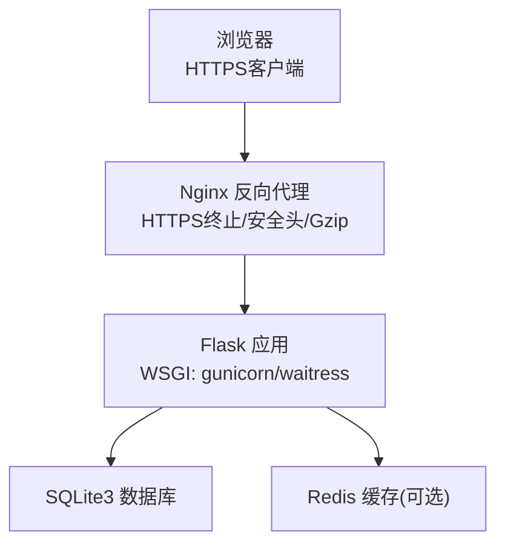
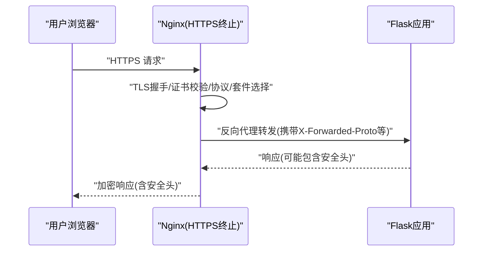
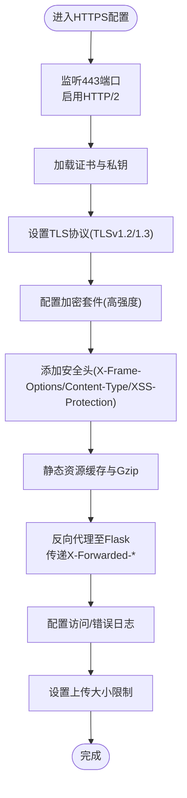
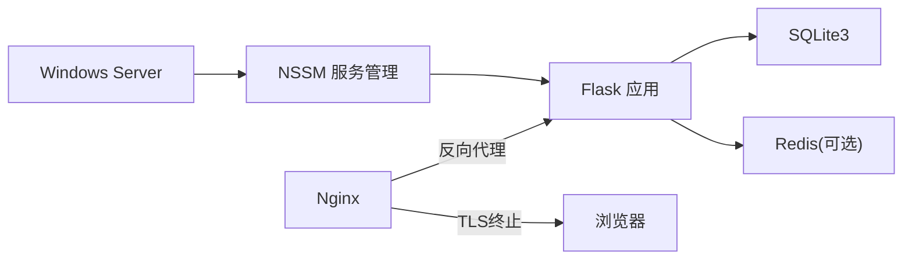

# HTTPS/TLS配置

<cite>
**本文引用的文件**
- [企业网站CMS系统开发需求文档.ini](file://企业网站CMS系统开发需求文档.ini)
- [企业网站CMS系统详细需求文档.md](file://企业网站CMS系统详细需求文档.md)
</cite>

## 目录
1. [简介](#简介)
2. [项目结构](#项目结构)
3. [核心组件](#核心组件)
4. [架构总览](#架构总览)
5. [详细组件分析](#详细组件分析)
6. [依赖分析](#依赖分析)
7. [性能考量](#性能考量)
8. [故障排除指南](#故障排除指南)
9. [结论](#结论)
10. [附录](#附录)

## 简介
本文件围绕企业网站CMS系统在Nginx反向代理中的HTTPS/TLS配置进行系统化说明，结合项目文档中给出的Nginx配置示例与安全要求，覆盖证书申请与安装、证书链配置、加密套件与协议版本控制、HTTPS强制跳转、HSTS头设置、安全重定向、证书自动续期、监控与故障排除等主题，并提供可落地的最佳实践与参考路径。

## 项目结构
- 本项目采用“前端静态/SPA + Nginx反向代理 + Flask后端”的典型三层架构。Nginx负责：
  - 静态资源服务与缓存
  - HTTPS终止与TLS协商
  - 反向代理至Flask应用
  - 安全头与压缩等前置处理
- 项目文档中提供了Nginx配置示例片段，涵盖监听端口、证书路径、协议与加密套件、安全头、Gzip压缩、静态资源缓存、API代理与WebSocket支持等。

**图表来源**
- [企业网站CMS系统详细需求文档.md](file://企业网站CMS系统详细需求文档.md#L34-L57)
- [企业网站CMS系统详细需求文档.md](file://企业网站CMS系统详细需求文档.md#L1143-L1230)

**章节来源**
- [企业网站CMS系统详细需求文档.md](file://企业网站CMS系统详细需求文档.md#L34-L57)
- [企业网站CMS系统详细需求文档.md](file://企业网站CMS系统详细需求文档.md#L1143-L1230)

## 核心组件
- Nginx反向代理
  - 监听80/443端口，实现HTTP到HTTPS的强制跳转与TLS终止
  - 配置ssl_certificate、ssl_certificate_key、ssl_protocols、ssl_ciphers等
  - 设置安全头（X-Frame-Options、X-Content-Type-Options、X-XSS-Protection）
  - 静态资源缓存与Gzip压缩
  - 反向代理至Flask应用，传递X-Forwarded-*头
- Flask后端
  - 通过环境变量与配置文件管理敏感信息
  - 支持CORS、JWT、缓存与会话等安全与性能配置
- Windows服务与进程管理
  - 使用NSSM将Gunicorn/Waitress注册为Windows服务，实现开机自启与崩溃重启

**章节来源**
- [企业网站CMS系统详细需求文档.md](file://企业网站CMS系统详细需求文档.md#L1143-L1230)
- [企业网站CMS系统详细需求文档.md](file://企业网站CMS系统详细需求文档.md#L1232-L1302)
- [企业网站CMS系统详细需求文档.md](file://企业网站CMS系统详细需求文档.md#L1324-L1344)

## 架构总览
下图展示了HTTPS/TLS在整体架构中的位置与职责边界，以及与后端Flask的交互。

**图表来源**
- [企业网站CMS系统详细需求文档.md](file://企业网站CMS系统详细需求文档.md#L1143-L1230)

## 详细组件分析

### Nginx HTTPS/TLS配置要点
- 监听与强制跳转
  - 80端口监听并返回301重定向至HTTPS，确保全站HTTPS
- TLS终止与证书
  - 指定ssl_certificate与ssl_certificate_key
  - 明确ssl_protocols（TLSv1.2、TLSv1.3）
  - 使用合理的ssl_ciphers（示例中为高强度且排除弱算法）
- 安全头
  - 设置X-Frame-Options、X-Content-Type-Options、X-XSS-Protection等
- 静态资源与压缩
  - 对/static/与/media/设置expires与Cache-Control
  - 启用gzip并限定类型
- 反向代理
  - 代理/api/至Flask应用，设置Host、X-Real-IP、X-Forwarded-For、X-Forwarded-Proto
  - 如需WebSocket，启用HTTP/1.1与Upgrade/Connection头
- 日志与上传限制
  - 配置access_log与error_log
  - 设置client_max_body_size以限制上传大小

**图表来源**
- [企业网站CMS系统详细需求文档.md](file://企业网站CMS系统详细需求文档.md#L1143-L1230)

**章节来源**
- [企业网站CMS系统详细需求文档.md](file://企业网站CMS系统详细需求文档.md#L1143-L1230)

### 证书申请、安装与配置
- 证书来源
  - 项目文档中明确“HTTPS强制跳转”与“HSTS头”，表明系统需具备有效SSL证书
- 证书文件
  - 示例中使用ssl_certificate与ssl_certificate_key分别指向证书与私钥文件
- 证书链
  - 若CA颁发的中间证书未被默认信任，应在ssl_certificate中串联根证书与中间证书，形成完整链
- 安装位置
  - 将证书与私钥放置在Nginx可读取的安全路径，并确保仅Nginx进程可读
- 配置生效
  - 修改后执行Nginx配置校验与重载，确保证书加载成功

**章节来源**
- [企业网站CMS系统详细需求文档.md](file://企业网站CMS系统详细需求文档.md#L1143-L1230)

### 加密套件与协议版本控制
- 协议版本
  - 建议启用TLSv1.2与TLSv1.3；禁用TLSv1.0/1.1
- 加密套件
  - 优先使用ECDHE密钥交换与AEAD加密算法
  - 排除MD5、RC4、3DES等弱算法
  - 在Nginx中通过ssl_ciphers指定强套件集合

**章节来源**
- [企业网站CMS系统详细需求文档.md](file://企业网站CMS系统详细需求文档.md#L1167-L1170)

### HTTPS强制跳转与安全重定向
- 80端口到443端口的301永久重定向
- 在Flask侧可结合X-Forwarded-Proto判断是否为HTTPS，必要时进行内部重定向或安全头设置
- 对于HSTS，可在Nginx中添加Strict-Transport-Security头，提升浏览器长期信任

**章节来源**
- [企业网站CMS系统详细需求文档.md](file://企业网站CMS系统详细需求文档.md#L1154-L1160)
- [企业网站CMS系统详细需求文档.md](file://企业网站CMS系统详细需求文档.md#L1124-L1126)

### HSTS头设置
- 在Nginx中添加HSTS头，建议包含preload与includeSubDomains
- 注意HSTS的长期影响，需确保证书有效与配置正确

**章节来源**
- [企业网站CMS系统详细需求文档.md](file://企业网站CMS系统详细需求文档.md#L1124-L1126)

### 证书自动续期与监控
- 自动续期
  - 使用自动化脚本定期检查证书到期时间，提前续期
  - 结合定时任务（如Windows任务计划程序）执行acme.sh或其他ACME客户端
- 监控
  - Nginx访问/错误日志用于异常检测
  - 证书到期告警（邮件/短信）
  - 服务健康检查与证书加载状态检查
- 故障排除
  - 证书链不完整导致浏览器警告
  - 私钥权限不正确导致无法加载
  - 证书与域名不匹配
  - 旧协议/弱套件仍被客户端使用

**章节来源**
- [企业网站CMS系统详细需求文档.md](file://企业网站CMS系统详细需求文档.md#L1143-L1230)

## 依赖分析
- Nginx与Flask之间的依赖
  - Nginx负责TLS终止与安全头，Flask负责业务逻辑与API响应
  - 通过X-Forwarded-Proto等头，Flask可感知原始协议，便于安全重定向与HSTS策略
- Windows服务与进程管理
  - NSSM将Gunicorn/Waitress注册为Windows服务，确保Flask进程稳定运行

**图表来源**
- [企业网站CMS系统详细需求文档.md](file://企业网站CMS系统详细需求文档.md#L1143-L1230)
- [企业网站CMS系统详细需求文档.md](file://企业网站CMS系统详细需求文档.md#L1324-L1344)

**章节来源**
- [企业网站CMS系统详细需求文档.md](file://企业网站CMS系统详细需求文档.md#L1143-L1230)
- [企业网站CMS系统详细需求文档.md](file://企业网站CMS系统详细需求文档.md#L1324-L1344)

## 性能考量
- TLS性能
  - 启用TLS会话复用与OCSP Stapling可减少握手开销
  - 适当选择加密套件与CPU/硬件加速（如需要）
- 压缩与缓存
  - 启用Gzip与静态资源缓存，降低带宽与延迟
- 反向代理
  - 合理设置超时与缓冲区，避免阻塞与内存占用过高

[本节为通用指导，不直接分析具体文件]

## 故障排除指南
- 证书相关
  - 证书链不完整：在ssl_certificate中串联根与中间证书
  - 私钥权限：确保仅Nginx可读
  - 证书与域名不匹配：核对SAN与CN
- 协议与套件
  - 旧客户端无法建立TLS：确认ssl_protocols与ssl_ciphers配置
- 代理与头
  - Flask未识别HTTPS：检查X-Forwarded-Proto是否正确传递
- 日志与监控
  - 通过Nginx访问/错误日志定位问题
  - 配置证书到期告警与健康检查

**章节来源**
- [企业网站CMS系统详细需求文档.md](file://企业网站CMS系统详细需求文档.md#L1143-L1230)

## 结论
本项目在技术架构与安全要求层面明确了HTTPS/TLS的重要性，并提供了Nginx配置示例。结合本文档的证书申请安装、协议与套件选择、强制跳转与HSTS设置、自动续期与监控等实践，可帮助运维团队在Windows Server环境下稳定、安全地部署与维护HTTPS服务。

[本节为总结性内容，不直接分析具体文件]

## 附录
- 参考配置片段路径
  - Nginx HTTPS/TLS与代理配置示例：[企业网站CMS系统详细需求文档.md](file://企业网站CMS系统详细需求文档.md#L1143-L1230)
  - Flask配置与环境变量：[企业网站CMS系统详细需求文档.md](file://企业网站CMS系统详细需求文档.md#L1232-L1302)
  - Windows服务注册与参数：[企业网站CMS系统详细需求文档.md](file://企业网站CMS系统详细需求文档.md#L1324-L1344)
- 安全与合规要点
  - HTTPS强制跳转与HSTS头已在安全设计中明确：[企业网站CMS系统详细需求文档.md](file://企业网站CMS系统详细需求文档.md#L1124-L1126)