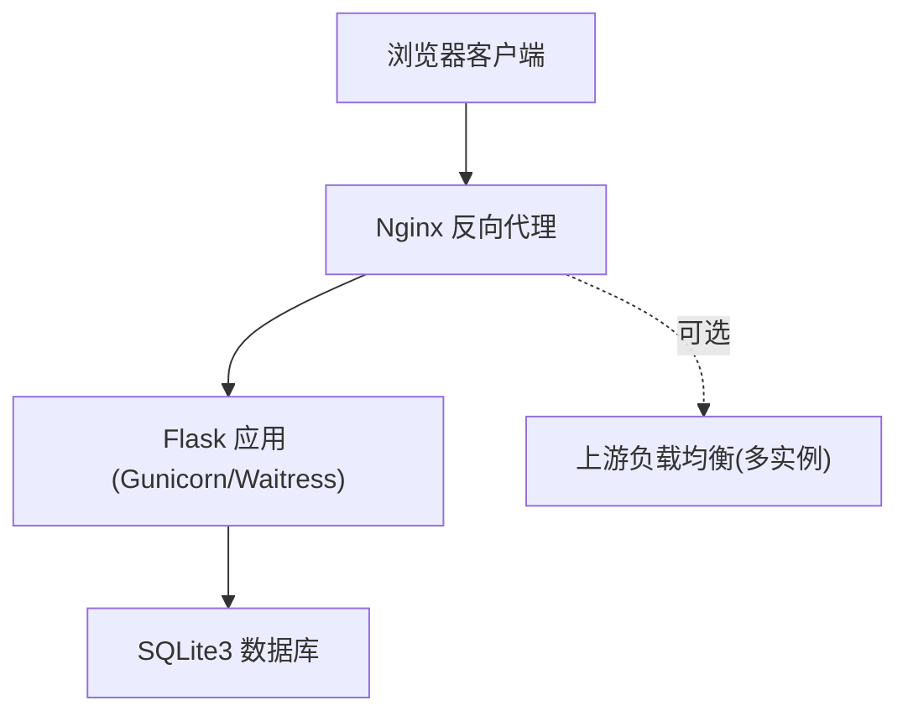
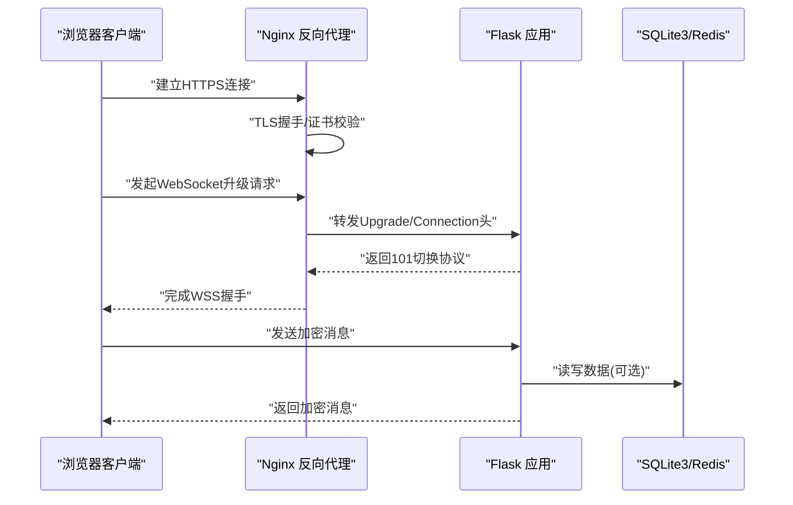
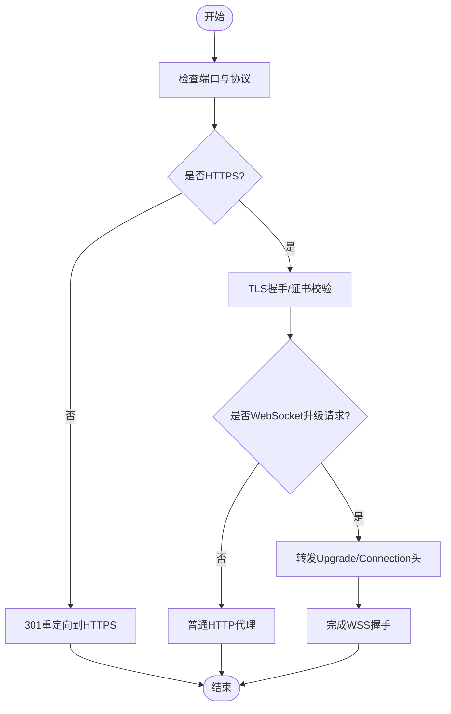
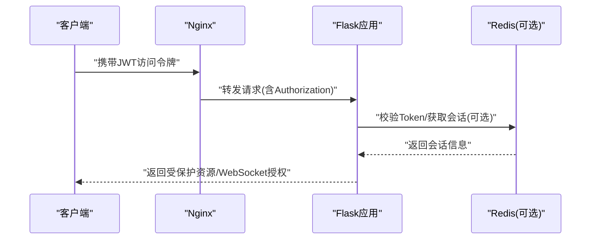
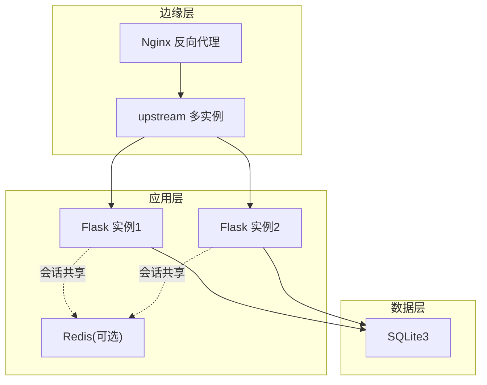
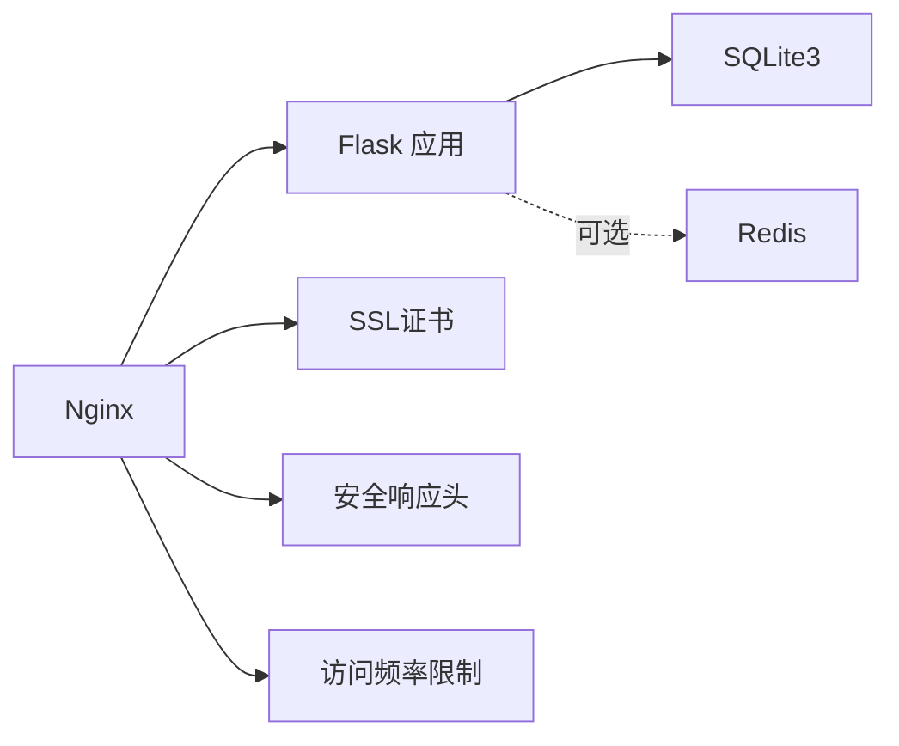

# WebSocket连接加密

<cite>
**本文档引用的文件**
- [企业网站CMS系统开发需求文档.ini](file://企业网站CMS系统开发需求文档.ini)
- [企业网站CMS系统详细需求文档.md](file://企业网站CMS系统详细需求文档.md)
- [开发计划表_2月4日-2月12日.md](file://开发计划表_2月4日-2月12日.md)
</cite>

## 目录
1. [简介](#简介)
2. [项目结构](#项目结构)
3. [核心组件](#核心组件)
4. [架构总览](#架构总览)
5. [详细组件分析](#详细组件分析)
6. [依赖关系分析](#依赖关系分析)
7. [性能考量](#性能考量)
8. [故障排查指南](#故障排查指南)
9. [结论](#结论)
10. [附录](#附录)

## 简介
本文件聚焦于企业CMS系统的WebSocket连接加密与安全配置，结合现有文档中的Nginx反向代理、HTTPS/TLS、WebSocket代理与安全头等能力，系统化梳理WSS（WebSocket Secure）的配置要点、SSL/TLS握手与证书验证、消息传输加密、连接认证与会话管理、防火墙与负载均衡支持以及连接池与性能监控方案。文档旨在帮助开发者与运维人员在现有Flask+Gunicorn/Nginx架构下，安全、稳定地启用WebSocket实时通信能力。

## 项目结构
- 前端：React/Vue（可选）或纯HTML模板渲染
- 后端：Flask应用，提供RESTful API与可选的WebSocket支持
- 反向代理：Nginx，负责HTTPS终止、静态资源服务、负载均衡与WebSocket代理
- 数据层：SQLite3（默认）或可选Redis（高并发时）

**图表来源**
- [企业网站CMS系统详细需求文档.md](file://企业网站CMS系统详细需求文档.md#L28-L57)

**章节来源**
- [企业网站CMS系统详细需求文档.md](file://企业网站CMS系统详细需求文档.md#L28-L57)

## 核心组件
- Nginx反向代理：终止HTTPS、设置安全头、代理WebSocket升级请求
- Flask应用：提供REST API与可选WebSocket端点
- WebSocket代理：通过Upgrade/Connection头实现WSS升级
- 证书与TLS：Nginx配置SSL证书、协议与密码套件
- 安全头：X-Frame-Options、X-Content-Type-Options、X-XSS-Protection等
- 认证与会话：JWT Token、会话存储（Redis可选）、异常登录检测
- 防火墙与限流：基于IP的访问频率限制、CORS配置、IP黑白名单

**章节来源**
- [企业网站CMS系统详细需求文档.md](file://企业网站CMS系统详细需求文档.md#L1141-L1230)
- [企业网站CMS系统详细需求文档.md](file://企业网站CMS系统详细需求文档.md#L1078-L1140)

## 架构总览
下图展示了从浏览器到Flask应用的完整链路，重点标注了WSS升级、TLS终止、安全头与WebSocket代理的关键节点。

**图表来源**
- [企业网站CMS系统详细需求文档.md](file://企业网站CMS系统详细需求文档.md#L1162-L1220)

**章节来源**
- [企业网站CMS系统详细需求文档.md](file://企业网站CMS系统详细需求文档.md#L1141-L1230)

## 详细组件分析

### WSS协议配置与使用
- HTTPS终止与证书
  - Nginx监听443端口，配置SSL证书与私钥路径
  - 指定TLS协议版本（TLSv1.2/1.3）与高强度密码套件
  - 设置安全响应头（X-Frame-Options、X-Content-Type-Options、X-XSS-Protection）
- WebSocket代理
  - 在/api/路径下启用proxy_http_version 1.1
  - 传递Upgrade与Connection头以支持协议升级
  - 保持X-Forwarded-Proto正确传递，便于后端识别WSS
- 强制HTTPS跳转
  - 80端口监听时将请求重定向至https，确保所有流量走加密通道

**图表来源**
- [企业网站CMS系统详细需求文档.md](file://企业网站CMS系统详细需求文档.md#L1154-L1220)

**章节来源**
- [企业网站CMS系统详细需求文档.md](file://企业网站CMS系统详细需求文档.md#L1141-L1230)

### SSL/TLS握手与证书验证
- 证书与私钥
  - 使用ssl_certificate与ssl_certificate_key指定证书与私钥路径
- 协议与密码套件
  - ssl_protocols启用TLSv1.2与TLSv1.3
  - ssl_ciphers设置高强度密码套件，禁用弱算法
- 安全响应头
  - X-Frame-Options、X-Content-Type-Options、X-XSS-Protection等
- HSTS与HTTPS强制
  - 结合安全头与301重定向，确保浏览器始终使用HTTPS

**章节来源**
- [企业网站CMS系统详细需求文档.md](file://企业网站CMS系统详细需求文档.md#L1162-L1176)

### WebSocket消息加密传输
- 传输层加密
  - WSS基于TLS，消息在传输过程中被加密，防窃听与篡改
- 代理链路加密
  - Nginx终止TLS后，内部与Flask之间可使用HTTP（若仅内网）或继续TLS
- 消息完整性
  - 通过TLS握手与证书链保证端到端加密，消息在链路中不可被中间人解密

**章节来源**
- [企业网站CMS系统详细需求文档.md](file://企业网站CMS系统详细需求文档.md#L1162-L1176)

### 连接认证与会话管理
- JWT Token机制
  - Access Token与Refresh Token分别用于短期访问与长期续期
  - Token存储与刷新策略，结合后端认证中间件
- 会话存储
  - Redis可选用于存储会话、Token与页面缓存，提升高并发下的会话一致性
- 异常登录检测
  - 基于IP/设备变化的异常登录检测，必要时触发二次验证或强制登出

**图表来源**
- [企业网站CMS系统详细需求文档.md](file://企业网站CMS系统详细需求文档.md#L1082-L1098)

**章节来源**
- [企业网站CMS系统详细需求文档.md](file://企业网站CMS系统详细需求文档.md#L1078-L1140)

### WebSocket防火墙配置、负载均衡与连接池
- 防火墙与访问控制
  - 基于IP的访问频率限制（Flask-Limiter）
  - CORS配置与SameSite Cookie策略
  - IP白名单/黑名单策略（可结合Nginx geo或第三方WAF）
- 负载均衡
  - Nginx upstream支持多Flask实例，实现横向扩展
  - WebSocket升级请求需确保粘性会话或后端具备会话共享（Redis）
- 连接池
  - Flask应用层连接池（如SQLAlchemy）与数据库连接池
  - Nginx与上游Flask实例间的连接池与keepalive配置

**图表来源**
- [企业网站CMS系统详细需求文档.md](file://企业网站CMS系统详细需求文档.md#L1147-L1152)
- [企业网站CMS系统详细需求文档.md](file://企业网站CMS系统详细需求文档.md#L1371-L1375)

**章节来源**
- [企业网站CMS系统详细需求文档.md](file://企业网站CMS系统详细需求文档.md#L1141-L1230)
- [企业网站CMS系统详细需求文档.md](file://企业网站CMS系统详细需求文档.md#L1371-L1375)

### WebSocket安全测试与性能监控
- 安全测试
  - HTTPS/TLS强度验证（协议版本、密码套件）
  - WebSocket升级失败回退与错误码处理
  - 证书链有效性与吊销检查
- 性能监控
  - Nginx访问/错误日志采集与分析
  - Flask应用性能指标（响应时间、并发数、错误率）
  - Redis（可选）与数据库连接池使用率
  - 前端WebSocket连接数与消息吞吐量

**章节来源**
- [企业网站CMS系统详细需求文档.md](file://企业网站CMS系统详细需求文档.md#L1417-L1423)
- [企业网站CMS系统详细需求文档.md](file://企业网站CMS系统详细需求文档.md#L1827-L1834)

## 依赖关系分析
- Nginx与Flask
  - Nginx负责TLS终止与WebSocket升级转发，Flask处理业务逻辑与数据访问
- 认证与会话
  - JWT Token与Redis会话存储相互配合，保障跨实例一致性
- 安全与合规
  - 安全头、CORS、限流与证书策略共同构成传输与访问安全基线

**图表来源**
- [企业网站CMS系统详细需求文档.md](file://企业网站CMS系统详细需求文档.md#L1141-L1230)
- [企业网站CMS系统详细需求文档.md](file://企业网站CMS系统详细需求文档.md#L1078-L1140)

**章节来源**
- [企业网站CMS系统详细需求文档.md](file://企业网站CMS系统详细需求文档.md#L1078-L1140)
- [企业网站CMS系统详细需求文档.md](file://企业网站CMS系统详细需求文档.md#L1141-L1230)

## 性能考量
- 连接池与并发
  - Flask应用连接池与数据库连接池合理配置，避免阻塞
  - Nginx keepalive与上游连接池协同，减少握手开销
- WebSocket吞吐
  - 控制消息大小与频率，避免内存压力
  - 对高频推送场景采用批量压缩与去重策略
- 监控与告警
  - 建立端到端监控链路，覆盖Nginx、Flask、Redis与数据库
  - 设置阈值告警，及时发现性能瓶颈与异常

[本节为通用性能指导，不直接分析具体文件]

## 故障排查指南
- WebSocket升级失败
  - 检查Nginx是否转发Upgrade/Connection头
  - 确认后端是否返回101切换协议
  - 核对Origin/CORS策略与安全头配置
- TLS握手失败
  - 校验证书链与私钥匹配
  - 检查ssl_protocols与ssl_ciphers兼容性
  - 确认浏览器支持的TLS版本
- 会话与认证问题
  - 校验JWT签名与过期时间
  - 检查Redis会话存储可用性与键空间
- 性能与资源
  - 查看Nginx与Flask日志，定位慢请求
  - 监控数据库连接池与Redis命中率

**章节来源**
- [企业网站CMS系统详细需求文档.md](file://企业网站CMS系统详细需求文档.md#L1141-L1230)
- [企业网站CMS系统详细需求文档.md](file://企业网站CMS系统详细需求文档.md#L1417-L1423)

## 结论
在现有Flask+Nginx架构下，启用WSS与WebSocket实时通信的关键在于：
- 正确的Nginx TLS配置与WebSocket代理头转发
- 强健的认证与会话管理（JWT+Redis可选）
- 完善的防火墙与限流策略
- 可观测性的监控与告警体系

通过遵循本文档的配置要点与最佳实践，可在保证安全的前提下，稳定地提供实时通信能力。

[本节为总结性内容，不直接分析具体文件]

## 附录
- 部署与运维要点
  - 使用NSSM将Flask服务注册为Windows服务，确保开机自启与崩溃重启
  - 环境变量集中管理（.env），区分生产与开发
  - 定期轮换证书与密钥，执行安全审计与渗透测试

**章节来源**
- [开发计划表_2月4日-2月12日.md](file://开发计划表_2月4日-2月12日.md#L1324-L1356)
- [企业网站CMS系统开发需求文档.ini](file://企业网站CMS系统开发需求文档.ini#L105-L110)