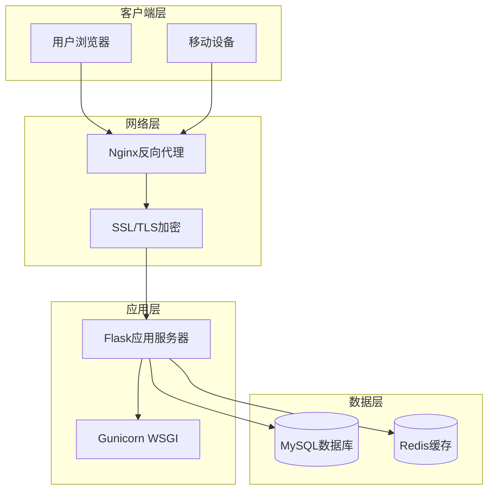
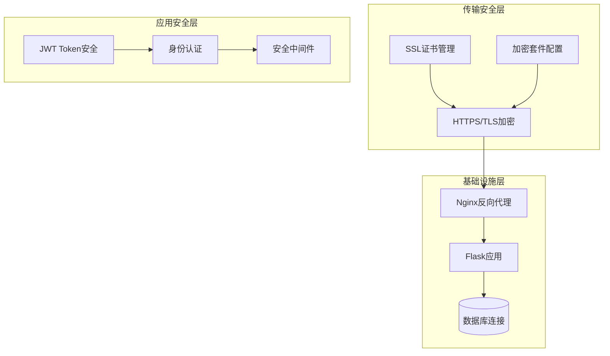
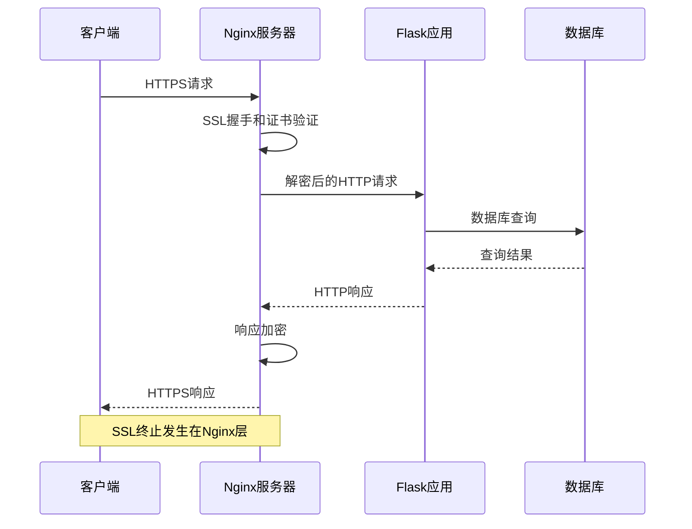
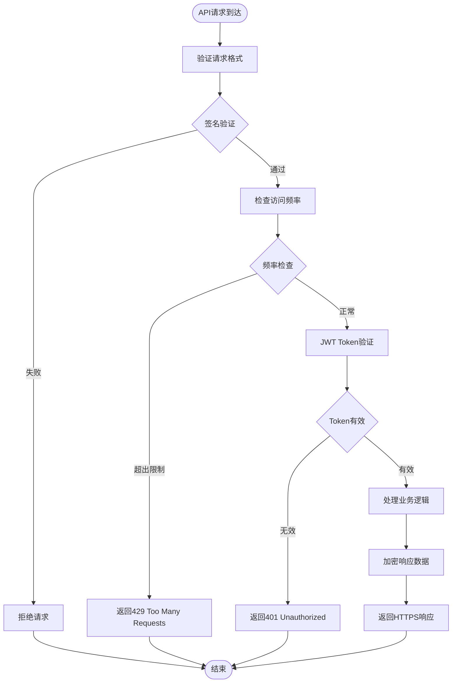
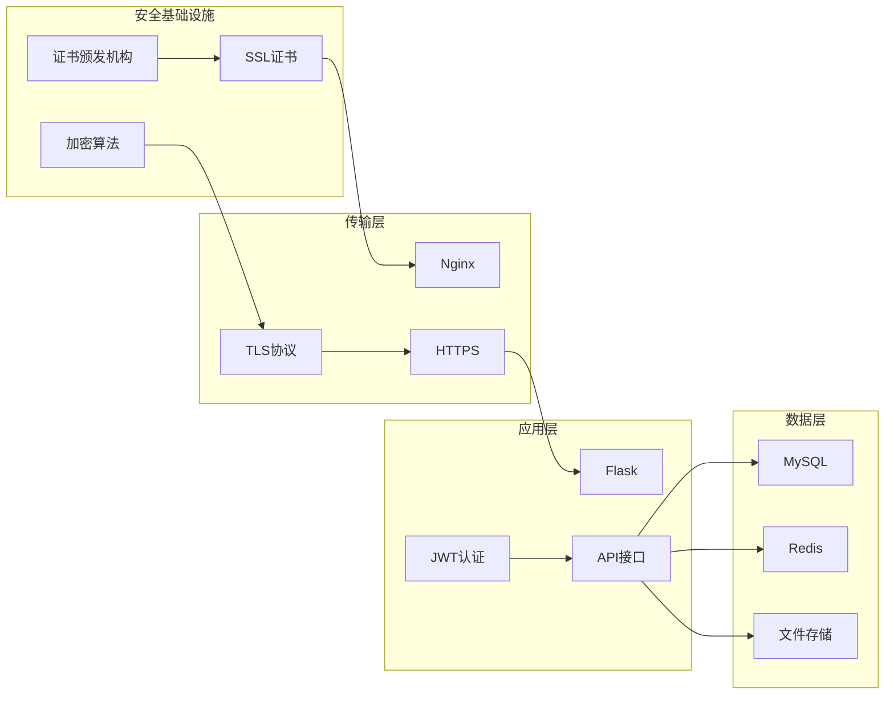

# 数据传输加密

<cite>
**本文档引用的文件**
- [企业网站CMS系统开发需求文档.ini](file://企业网站CMS系统开发需求文档.ini)
- [企业网站CMS系统详细需求文档.md](file://企业网站CMS系统详细需求文档.md)
- [开发计划表_2月4日-2月12日.md](file://开发计划表_2月4日-2月12日.md)
</cite>

## 目录
1. [引言](#引言)
2. [项目结构](#项目结构)
3. [核心组件](#核心组件)
4. [架构总览](#架构总览)
5. [详细组件分析](#详细组件分析)
6. [依赖关系分析](#依赖关系分析)
7. [性能考虑](#性能考虑)
8. [故障排除指南](#故障排除指南)
9. [结论](#结论)

## 引言

本文件专注于企业CMS系统的数据传输加密方案，涵盖HTTPS/TLS配置、SSL证书管理、Nginx反向代理SSL终止、API接口传输安全、WebSocket连接加密、文件上传下载保护以及数据库连接加密等关键领域。该系统采用Python Flask作为后端框架，Nginx作为反向代理服务器，部署于Windows Server环境，具备严格的安全要求和HTTPS传输需求。

## 项目结构

基于项目文档，系统采用前后端分离架构，主要组件包括：

**图表来源**
- [企业网站CMS系统详细需求文档.md](file://企业网站CMS系统详细需求文档.md#L28-L57)

**章节来源**
- [企业网站CMS系统详细需求文档.md](file://企业网站CMS系统详细需求文档.md#L22-L57)

## 核心组件

### HTTPS/TLS配置

系统要求实现数据加密传输（HTTPS），这是安全架构的基础要求。根据项目文档，系统采用Nginx作为反向代理，在Nginx层面实现SSL终止，这样可以有效减轻后端服务器的加密负担。

### JWT Token加密

系统采用JWT（JSON Web Token）进行身份认证，这要求在传输过程中确保Token的安全性。JWT通常包含三个部分：头部、载荷和签名，需要通过HTTPS传输来防止中间人攻击。

### API接口安全

系统提供RESTful API接口，需要确保所有API通信都通过HTTPS进行，防止敏感数据泄露和API劫持。

### WebSocket连接加密

虽然当前MVP版本可能不包含WebSocket功能，但系统架构应支持WebSocket的加密连接，为未来的实时功能做好准备。

**章节来源**
- [企业网站CMS系统开发需求文档.ini](file://企业网站CMS系统开发需求文档.ini#L105-L109)
- [开发计划表_2月4日-2月12日.md](file://开发计划表_2月4日-2月12日.md#L142-L157)

## 架构总览

系统采用三层架构，重点关注传输层的安全性：

**图表来源**
- [企业网站CMS系统详细需求文档.md](file://企业网站CMS系统详细需求文档.md#L34-L41)
- [开发计划表_2月4日-2月12日.md](file://开发计划表_2月4日-2月12日.md#L465-L487)

## 详细组件分析

### Nginx反向代理SSL终止

#### SSL终止配置

Nginx作为反向代理服务器，在SSL终止点提供以下功能：
- HTTPS监听和证书处理
- HTTP到HTTPS的重定向
- Gzip压缩和缓存
- 负载均衡支持

#### 证书链配置

SSL证书链的正确配置对于建立信任链至关重要：
- 根CA证书
- 中间证书
- 服务器证书
- 完整的证书链文件

#### 加密套件选择

加密套件的选择直接影响安全性和性能：
- TLS 1.2和TLS 1.3支持
- 现代加密算法优先
- 禁用过时的弱加密套件
- 适当的密钥交换算法

**图表来源**
- [开发计划表_2月4日-2月12日.md](file://开发计划表_2月4日-2月12日.md#L465-L487)

**章节来源**
- [开发计划表_2月4日-2月12日.md](file://开发计划表_2月4日-2月12日.md#L465-L487)

### API接口传输安全

#### JWT Token加密机制

JWT Token在传输过程中的安全保护：
- 通过HTTPS传输防止中间人攻击
- Token的合理有效期设置
- 刷新Token的安全机制
- Token在内存中的安全存储

#### 请求签名验证

API请求的完整性保护：
- 请求参数的签名计算
- 时间戳验证防止重放攻击
- 非ces参数的随机性保证
- 请求频率限制和防暴力破解

#### 中间件安全过滤

安全中间件的实现：
- CORS配置和跨域安全
- CSRF防护机制
- 输入验证和清理
- 访问频率限制
- IP白名单/黑名单

**图表来源**
- [开发计划表_2月4日-2月12日.md](file://开发计划表_2月4日-2月12日.md#L142-L157)

**章节来源**
- [开发计划表_2月4日-2月12日.md](file://开发计划表_2月4日-2月12日.md#L142-L157)

### WebSocket连接加密

#### WebSocket安全连接

WebSocket在加密通道中的实现：
- wss://协议的使用
- 与HTTPS相同的证书验证
- 保持会话状态的安全性
- 实时数据的加密传输

#### 客户端认证

WebSocket连接的认证机制：
- 基于Cookie或Token的认证
- 连接建立时的身份验证
- 连接生命周期管理
- 断开连接的安全处理

### 文件上传下载传输保护

#### 上传安全机制

文件上传过程中的安全保护：
- HTTPS上传通道
- 文件类型和大小验证
- 恶意文件检测
- 上传路径的安全管理

#### 下载安全控制

文件下载过程中的访问控制：
- 下载权限验证
- 临时访问令牌
- 下载日志记录
- 大文件的分块传输安全

### 数据库连接加密

#### 连接加密配置

数据库连接的安全设置：
- SSL/TLS连接加密
- 证书验证机制
- 加密的凭据存储
- 连接池的安全配置

#### 数据传输保护

数据库通信的加密保护：
- 所有SQL查询的加密传输
- 结果集的敏感数据保护
- 备份数据的加密存储
- 日志记录的敏感信息脱敏

**章节来源**
- [企业网站CMS系统详细需求文档.md](file://企业网站CMS系统详细需求文档.md#L569-L594)

## 依赖关系分析

系统各组件之间的安全依赖关系：

**图表来源**
- [企业网站CMS系统详细需求文档.md](file://企业网站CMS系统详细需求文档.md#L28-L57)

**章节来源**
- [企业网站CMS系统详细需求文档.md](file://企业网站CMS系统详细需求文档.md#L28-L57)

## 性能考虑

### SSL/TLS性能优化

- 硬件加速支持
- 会话复用机制
- 适当的缓存策略
- 证书链优化

### 加密算法选择

- 现代加密算法的性能权衡
- CPU密集型操作的优化
- 批量处理的效率提升
- 资源使用的监控和调优

## 故障排除指南

### 常见SSL证书问题

- 证书链不完整导致的连接失败
- 证书过期或即将过期
- 域名不匹配错误
- 证书验证失败

### API安全问题

- JWT Token过期或无效
- CORS配置错误
- 请求被意外拦截
- 认证绕过尝试

### 性能问题

- SSL握手延迟过高
- 加密处理CPU占用
- 并发连接数限制
- 缓存命中率低

**章节来源**
- [企业网站CMS系统开发需求文档.ini](file://企业网站CMS系统开发需求文档.ini#L105-L109)

## 结论

本数据传输加密方案为CMS系统提供了全面的安全保障，涵盖了从网络层到应用层的各个层面。通过Nginx的SSL终止、严格的证书管理、完善的API安全机制以及数据库连接加密，系统能够有效防范各种网络攻击和数据泄露风险。

关键的安全特性包括：
- 完整的HTTPS/TLS加密链路
- 强大的JWT认证和授权机制  
- 多层次的API安全防护
- 安全的文件传输和存储
- 数据库连接的加密保护

建议在实际部署中定期进行安全评估和渗透测试，确保加密方案的有效性和完整性。