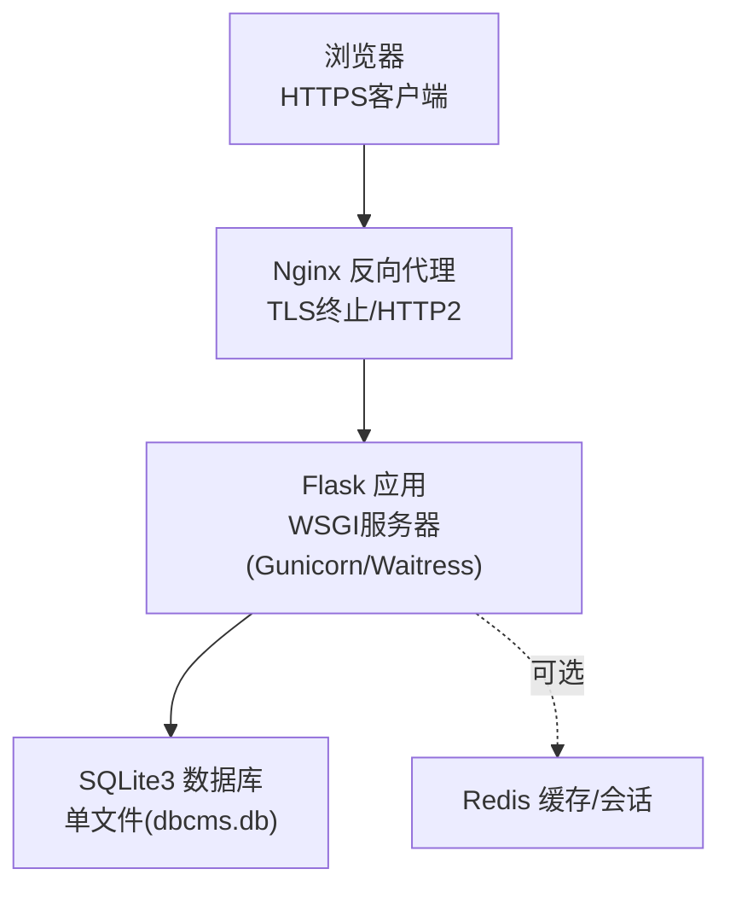
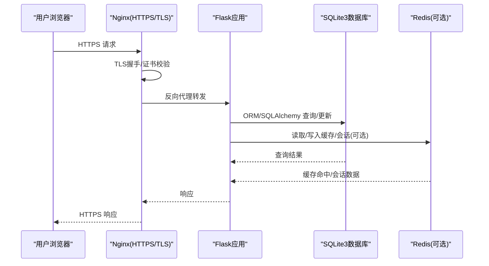
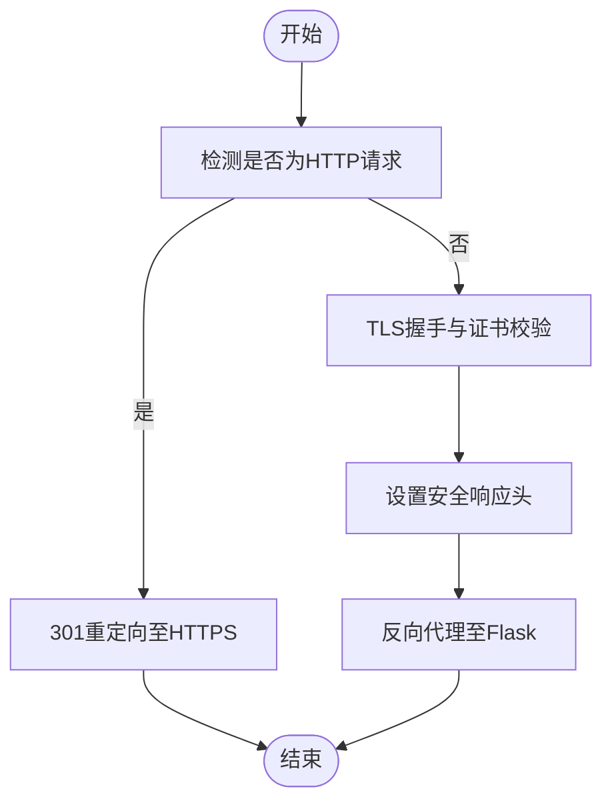
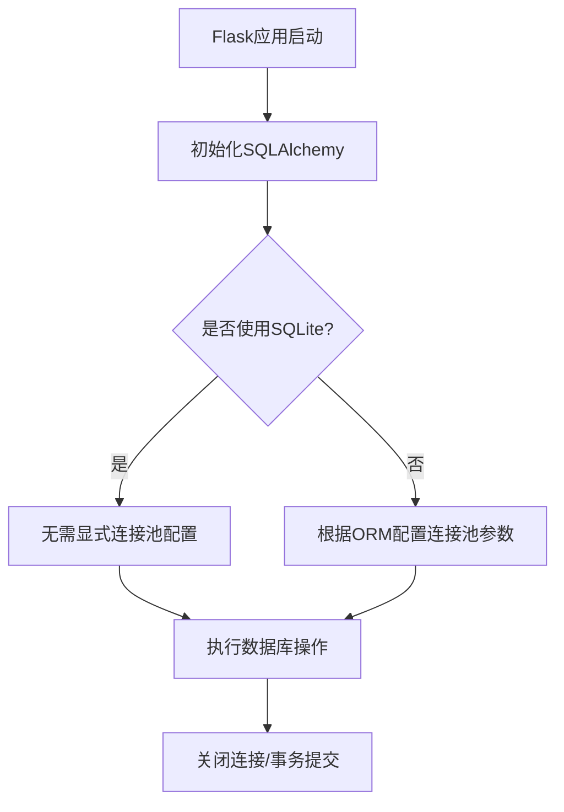
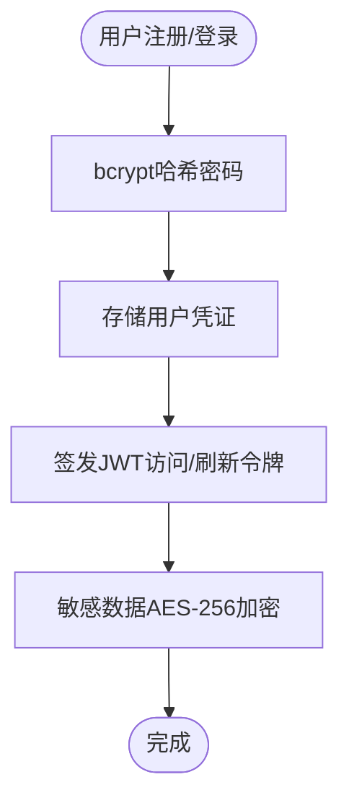
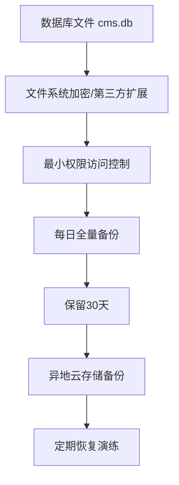
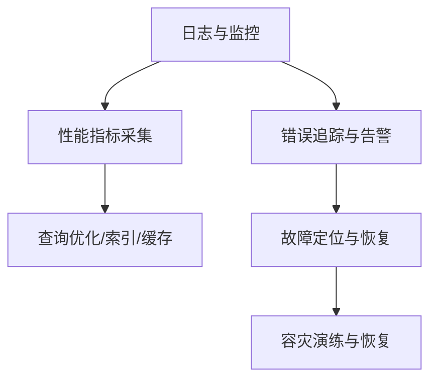
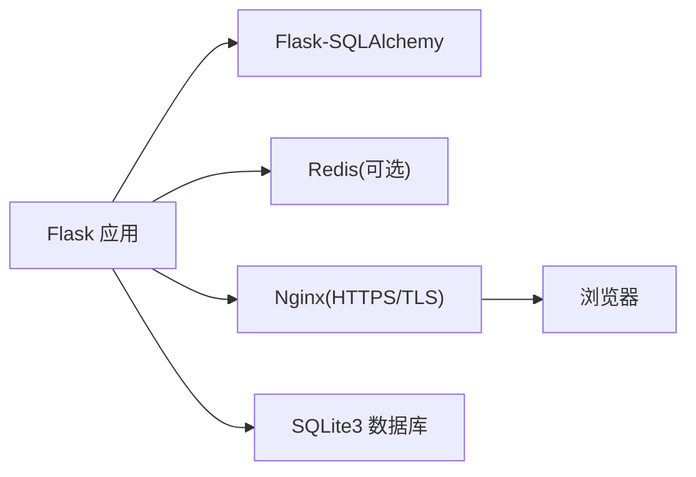

# 数据库连接加密

<cite>
**本文引用的文件**
- [企业网站CMS系统详细需求文档.md](file://企业网站CMS系统详细需求文档.md)
- [开发计划表_2月4日-2月12日.md](file://开发计划表_2月4日-2月12日.md)
</cite>

## 目录
1. [引言](#引言)
2. [项目结构](#项目结构)
3. [核心组件](#核心组件)
4. [架构总览](#架构总览)
5. [详细组件分析](#详细组件分析)
6. [依赖关系分析](#依赖关系分析)
7. [性能考量](#性能考量)
8. [故障排查指南](#故障排查指南)
9. [结论](#结论)
10. [附录](#附录)

## 引言
本文件围绕数据库连接加密与安全保护进行系统化梳理，结合仓库中的技术文档，重点覆盖以下主题：
- 传输层安全：HTTPS/TLS在反向代理层的实施与证书管理
- 数据库连接安全：SQLite单文件数据库的零配置特性与安全边界
- 密码与敏感数据：密码哈希策略、敏感数据加密与密钥管理
- 连接与会话：连接池与会话存储策略（Redis可选）
- 备份与恢复：数据库文件备份、访问控制与异地备份
- 监控与审计：日志、错误追踪与安全事件监控
- 性能优化与故障恢复：慢查询、连接池与容灾策略

说明：当前仓库未包含实际的Python源代码文件，本文依据现有技术文档进行安全实践与架构层面的总结与建议。

## 项目结构
本项目采用前后端分离与反向代理架构，数据库采用SQLite3单文件数据库，部署在Windows环境下，使用Nginx作为反向代理与TLS终止点，后端为Flask应用并通过WSGI服务器对外提供服务。

**图表来源**
- [企业网站CMS系统详细需求文档.md](file://企业网站CMS系统详细需求文档.md#L28-L56)
- [企业网站CMS系统详细需求文档.md](file://企业网站CMS系统详细需求文档.md#L1141-L1230)
- [企业网站CMS系统详细需求文档.md](file://企业网站CMS系统详细需求文档.md#L1232-L1302)

**章节来源**
- [企业网站CMS系统详细需求文档.md](file://企业网站CMS系统详细需求文档.md#L28-L56)
- [企业网站CMS系统详细需求文档.md](file://企业网站CMS系统详细需求文档.md#L1141-L1230)
- [企业网站CMS系统详细需求文档.md](file://企业网站CMS系统详细需求文档.md#L1232-L1302)

## 核心组件
- 反向代理与TLS终止：Nginx负责HTTPS证书、协议与安全头配置，统一接入Flask应用
- Flask应用：使用Flask-SQLAlchemy连接SQLite数据库；可选Redis用于缓存与会话
- 数据库：SQLite3单文件数据库，零配置、便于备份与部署
- 安全策略：HTTPS/TLS、JWT令牌、bcrypt密码哈希、敏感数据AES-256加密、API限流与审计日志

**章节来源**
- [企业网站CMS系统详细需求文档.md](file://企业网站CMS系统详细需求文档.md#L1141-L1230)
- [企业网站CMS系统详细需求文档.md](file://企业网站CMS系统详细需求文档.md#L1232-L1302)
- [企业网站CMS系统详细需求文档.md](file://企业网站CMS系统详细需求文档.md#L1078-L1139)
- [企业网站CMS系统详细需求文档.md](file://企业网站CMS系统详细需求文档.md#L1381-L1423)

## 架构总览
下图展示了数据库连接加密与安全保护的关键路径：浏览器通过HTTPS访问，Nginx终止TLS并转发至Flask；Flask通过SQLite3执行业务逻辑；可选Redis用于缓存与会话；所有外部传输均受TLS保护。

**图表来源**
- [企业网站CMS系统详细需求文档.md](file://企业网站CMS系统详细需求文档.md#L1141-L1230)
- [企业网站CMS系统详细需求文档.md](file://企业网站CMS系统详细需求文档.md#L1232-L1302)

## 详细组件分析

### 传输层安全与证书管理
- Nginx配置启用HTTPS监听，指定证书与私钥路径，并限定TLS协议版本与密码套件
- 设置安全响应头，包括X-Frame-Options、X-Content-Type-Options、X-XSS-Protection等
- 强制HTTP跳转至HTTPS，确保所有流量经由TLS传输
- 建议定期轮换证书与密钥，使用自动化证书管理工具（如ACME）

**图表来源**
- [企业网站CMS系统详细需求文档.md](file://企业网站CMS系统详细需求文档.md#L1141-L1230)

**章节来源**
- [企业网站CMS系统详细需求文档.md](file://企业网站CMS系统详细需求文档.md#L1141-L1230)

### 数据库连接与连接池
- SQLite3为单文件数据库，无需独立数据库服务进程，零配置部署
- Flask-SQLAlchemy默认连接池行为适用于SQLite；文档明确“SQLite不需要连接池配置”
- 对于高并发场景，可引入Redis作为缓存与会话存储，减轻数据库压力
- 建议在生产环境关闭SQLAlchemy echo，避免不必要的日志开销

**图表来源**
- [企业网站CMS系统详细需求文档.md](file://企业网站CMS系统详细需求文档.md#L1232-L1302)

**章节来源**
- [企业网站CMS系统详细需求文档.md](file://企业网站CMS系统详细需求文档.md#L1232-L1302)

### 密码与敏感数据加密
- 密码采用bcrypt哈希（成本因子12），满足高强度抗暴力破解需求
- JWT访问令牌有效期2小时，刷新令牌7天，令牌存储与刷新机制需配合安全存储策略
- 敏感数据采用AES-256加密存储，结合密钥轮换与安全密钥管理
- API密钥等第三方凭据通过环境变量管理并加密存储，定期轮换

**图表来源**
- [企业网站CMS系统详细需求文档.md](file://企业网站CMS系统详细需求文档.md#L1078-L1139)
- [企业网站CMS系统详细需求文档.md](file://企业网站CMS系统详细需求文档.md#L1381-L1401)

**章节来源**
- [企业网站CMS系统详细需求文档.md](file://企业网站CMS系统详细需求文档.md#L1078-L1139)
- [企业网站CMS系统详细需求文档.md](file://企业网站CMS系统详细需求文档.md#L1381-L1401)

### 连接超时与连接复用策略
- Nginx代理层可配置连接超时与上游超时，确保在高负载下稳定处理请求
- HTTP/2提升连接复用效率，减少TLS握手与队首阻塞
- 生产环境建议开启keep-alive与适当的超时阈值，平衡资源占用与响应延迟

**章节来源**
- [企业网站CMS系统详细需求文档.md](file://企业网站CMS系统详细需求文档.md#L1141-L1230)

### SQLite文件加密保护、访问权限与备份
- SQLite本身未提供内置文件级加密，建议通过操作系统层面的文件加密（如BitLocker/EFS）或第三方扩展（如SQLCipher）实现
- 数据库文件与备份目录设置最小权限访问，仅授予运行账户读写权限
- 备份策略：每日全量备份数据库文件，保留30天；异地备份至云存储；定期恢复演练
- 日志目录与备份目录分离，避免日志污染备份

**图表来源**
- [企业网站CMS系统详细需求文档.md](file://企业网站CMS系统详细需求文档.md#L704-L712)
- [企业网站CMS系统详细需求文档.md](file://企业网站CMS系统详细需求文档.md#L1406-L1416)

**章节来源**
- [企业网站CMS系统详细需求文档.md](file://企业网站CMS系统详细需求文档.md#L704-L712)
- [企业网站CMS系统详细需求文档.md](file://企业网站CMS系统详细需求文档.md#L1406-L1416)

### 安全监控、性能优化与故障恢复
- 日志：使用Python logging模块与RotatingFileHandler，集中采集Nginx访问/错误日志
- 性能监控：可选Flask-Profiler与指标采集；数据库慢查询日志与索引优化
- 错误追踪：可选Sentry进行异常捕获与告警
- 容灾恢复：RTO<30分钟、RPO<1小时；定期备份恢复测试
- API限流：基于Flask-Limiter实现IP与用户维度限流

**图表来源**
- [企业网站CMS系统详细需求文档.md](file://企业网站CMS系统详细需求文档.md#L655-L659)
- [企业网站CMS系统详细需求文档.md](file://企业网站CMS系统详细需求文档.md#L1371-L1423)
- [企业网站CMS系统详细需求文档.md](file://企业网站CMS系统详细需求文档.md#L1078-L1139)

**章节来源**
- [企业网站CMS系统详细需求文档.md](file://企业网站CMS系统详细需求文档.md#L655-L659)
- [企业网站CMS系统详细需求文档.md](file://企业网站CMS系统详细需求文档.md#L1371-L1423)
- [企业网站CMS系统详细需求文档.md](file://企业网站CMS系统详细需求文档.md#L1078-L1139)

## 依赖关系分析
- 技术栈：Flask + Flask-SQLAlchemy + SQLite3 + Nginx + Waitress/Gunicorn + Redis(可选)
- 外部依赖：TLS证书、邮件服务、CDN/云存储（可选）
- 内部依赖：配置文件(.env)、数据库迁移脚本、缓存与会话存储

**图表来源**
- [企业网站CMS系统详细需求文档.md](file://企业网站CMS系统详细需求文档.md#L1232-L1302)
- [企业网站CMS系统详细需求文档.md](file://企业网站CMS系统详细需求文档.md#L1141-L1230)

**章节来源**
- [企业网站CMS系统详细需求文档.md](file://企业网站CMS系统详细需求文档.md#L1232-L1302)
- [企业网站CMS系统详细需求文档.md](file://企业网站CMS系统详细需求文档.md#L1141-L1230)

## 性能考量
- 连接池与缓存：SQLite无需连接池配置；Redis可选用于缓存与会话，减轻数据库压力
- 索引优化与慢查询：建立必要索引，避免N+1查询；启用慢查询日志并定期分析
- 静态资源与CDN：Nginx提供静态资源服务与Gzip压缩，可选CDN加速
- 并发与QPS：根据性能目标调整Worker数量与连接参数

**章节来源**
- [企业网站CMS系统详细需求文档.md](file://企业网站CMS系统详细需求文档.md#L512-L548)
- [企业网站CMS系统详细需求文档.md](file://企业网站CMS系统详细需求文档.md#L1371-L1375)

## 故障排查指南
- TLS握手失败：检查证书链完整性、私钥权限与Nginx配置
- 数据库访问异常：确认数据库文件权限、磁盘空间与SQLite锁竞争
- 缓存/会话不可用：检查Redis连接与网络连通性
- 日志与告警：核对Flask日志、Nginx错误日志与Sentry告警
- 备份恢复：验证备份文件完整性与恢复流程，定期演练

**章节来源**
- [企业网站CMS系统详细需求文档.md](file://企业网站CMS系统详细需求文档.md#L1141-L1230)
- [企业网站CMS系统详细需求文档.md](file://企业网站CMS系统详细需求文档.md#L1406-L1416)
- [开发计划表_2月4日-2月12日.md](file://开发计划表_2月4日-2月12日.md#L755-L775)

## 结论
本项目通过Nginx的TLS终止与强安全头配置，实现了数据库通信的端到端加密；SQLite3单文件数据库简化了运维与备份；密码与敏感数据采用业界标准的哈希与对称加密策略；可选Redis缓存与限流进一步提升了性能与安全性。建议在生产环境中补充文件级加密、密钥轮换与定期恢复演练，持续完善监控与审计体系。

## 附录
- 部署要点：使用NSSM将Flask注册为Windows服务；合理设置环境变量与日志路径
- 风险与应对：参考需求文档中的风险与应对措施，提前准备应急预案

**章节来源**
- [企业网站CMS系统详细需求文档.md](file://企业网站CMS系统详细需求文档.md#L1324-L1357)
- [开发计划表_2月4日-2月12日.md](file://开发计划表_2月4日-2月12日.md#L731-L752)