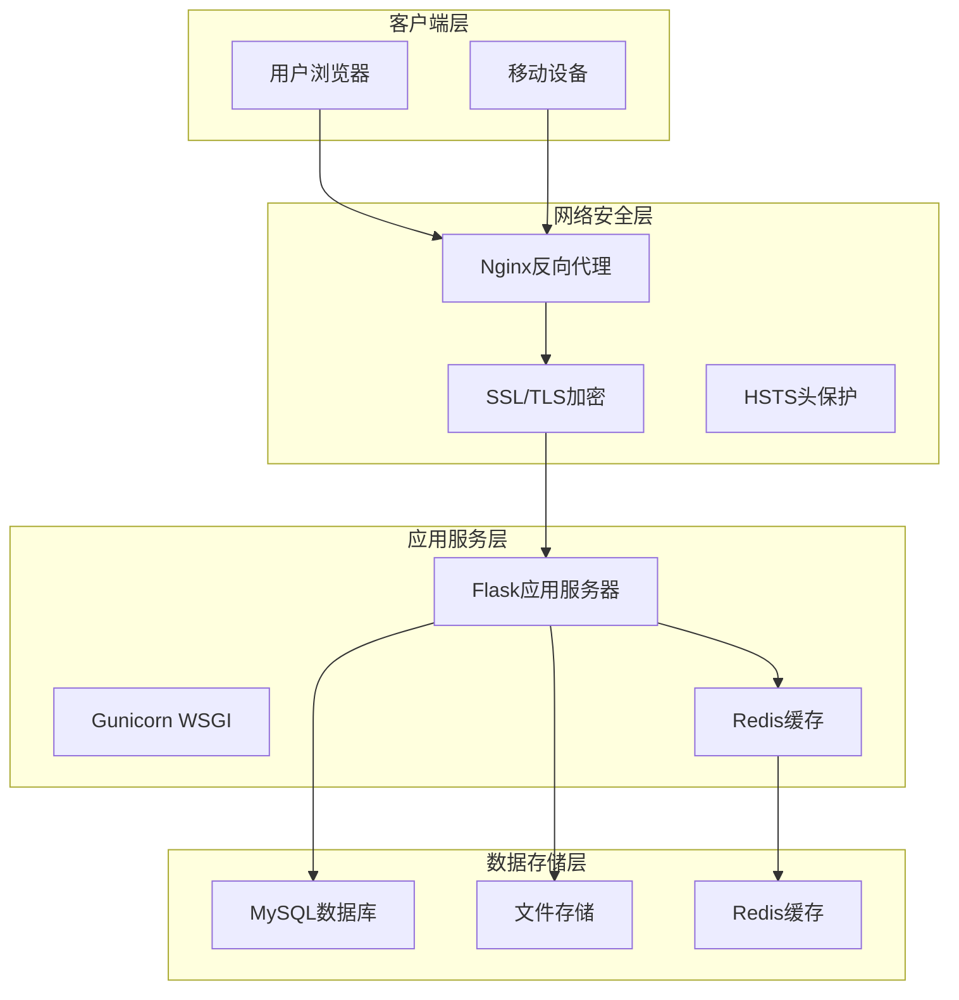
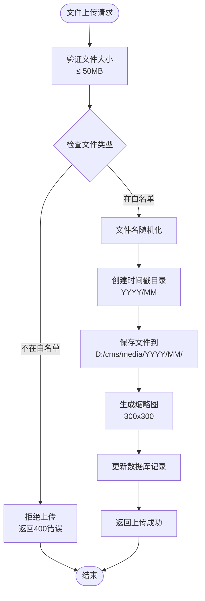
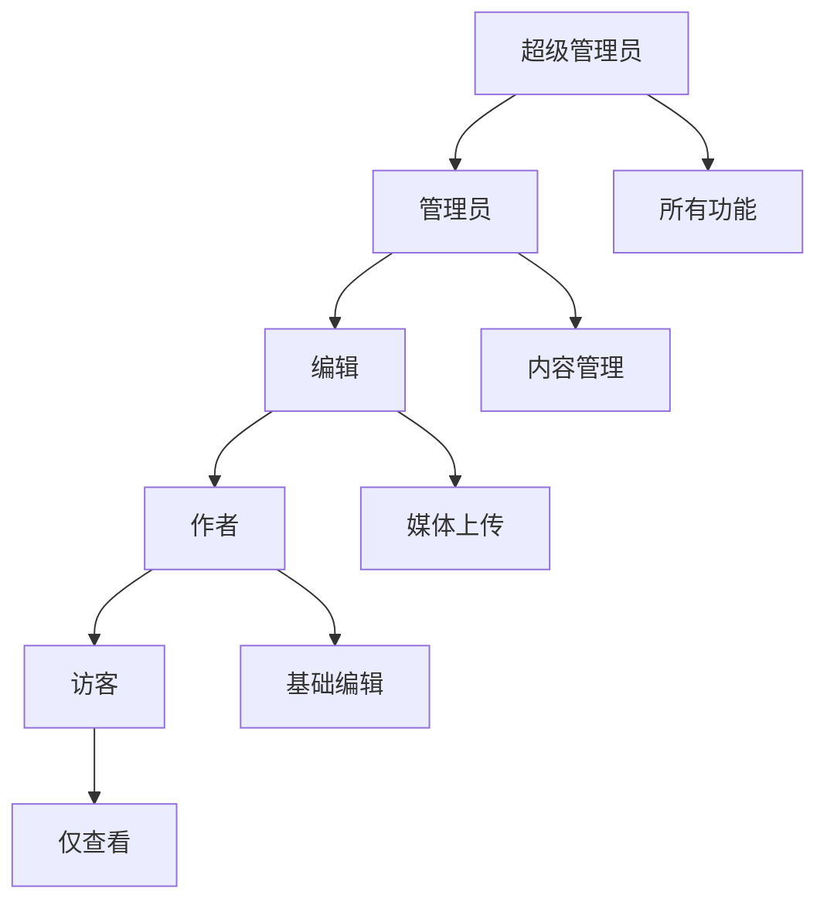
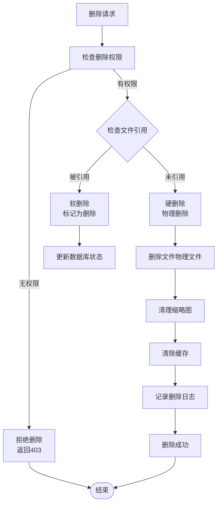
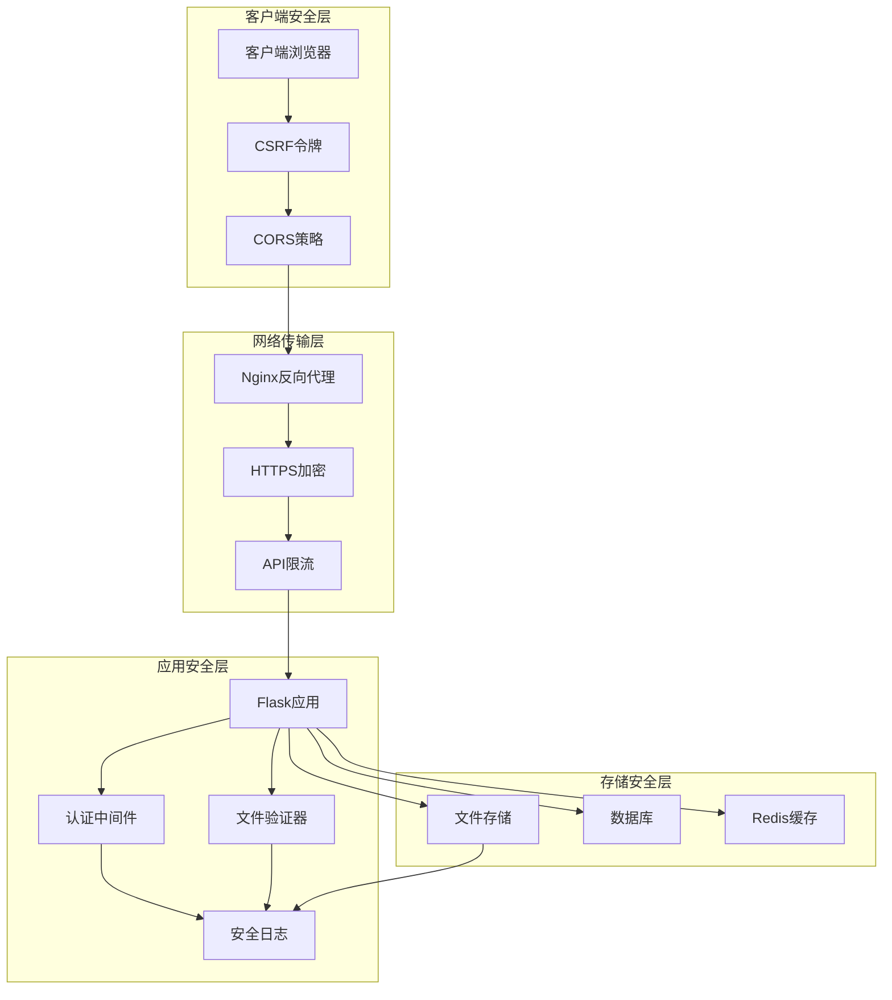
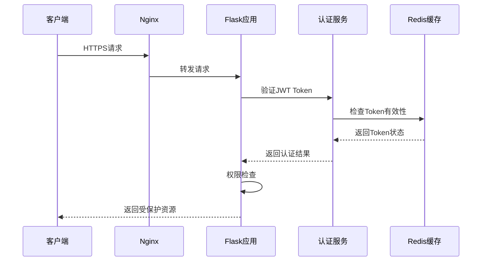
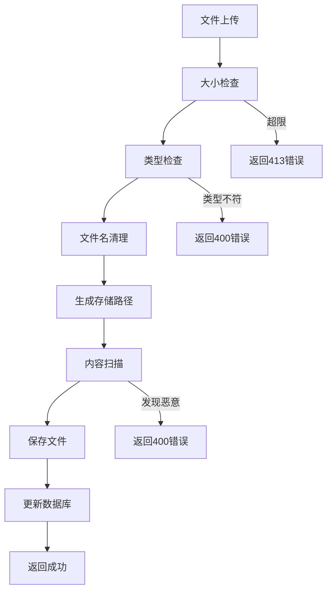
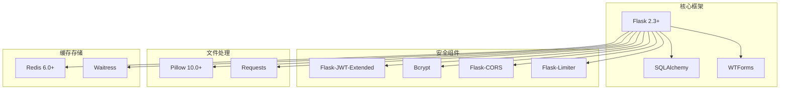

# 文件传输保护

<cite>
**本文档引用的文件**
- [企业网站CMS系统开发需求文档.ini](file://企业网站CMS系统开发需求文档.ini)
- [企业网站CMS系统详细需求文档.md](file://企业网站CMS系统详细需求文档.md)
- [开发计划表_2月4日-2月12日.md](file://开发计划表_2月4日-2月12日.md)
</cite>

## 目录
1. [引言](#引言)
2. [项目结构](#项目结构)
3. [核心组件](#核心组件)
4. [架构总览](#架构总览)
5. [详细组件分析](#详细组件分析)
6. [依赖关系分析](#依赖关系分析)
7. [性能考虑](#性能考虑)
8. [故障排除指南](#故障排除指南)
9. [结论](#结论)

## 引言

本文档专注于企业网站CMS系统的文件传输保护机制，涵盖文件上传下载过程中的安全保护措施。基于项目文档分析，该系统采用Python Flask + Nginx + Windows Server的技术栈，通过HTTPS加密传输、文件完整性校验和恶意文件检测等多重安全机制，确保文件传输过程的安全性。

系统的核心安全架构包括：
- **传输层安全**：HTTPS/TLS 1.2+加密传输
- **文件上传安全**：类型白名单、大小限制、病毒扫描
- **访问控制**：基于角色的权限管理
- **存储安全**：文件名随机化、存储路径限制
- **审计监控**：完整的操作日志记录

## 项目结构

CMS系统采用前后端分离架构，文件传输保护贯穿整个系统架构：



**图表来源**
- [企业网站CMS系统详细需求文档.md](file://企业网站CMS系统详细需求文档.md#L28-L57)

**章节来源**
- [企业网站CMS系统详细需求文档.md](file://企业网站CMS系统详细需求文档.md#L22-L57)

## 核心组件

### 1. HTTPS传输加密

系统采用严格的HTTPS传输安全机制：

**TLS配置要点**：
- TLS协议版本：TLSv1.2+ (支持TLSv1.3)
- 加密套件：HIGH:!aNULL:!MD5
- 安全头配置：X-Frame-Options、X-Content-Type-Options、X-XSS-Protection
- HSTS头：强制HTTPS跳转
- 客户端最大上传大小：50MB

**Nginx安全配置**：
```nginx
server {
    listen 443 ssl http2;
    server_name example.com;
    
    # SSL证书配置
    ssl_certificate /path/to/cert.pem;
    ssl_certificate_key /path/to/key.pem;
    ssl_protocols TLSv1.2 TLSv1.3;
    ssl_ciphers HIGH:!aNULL:!MD5;
    
    # 安全头
    add_header X-Frame-Options "SAMEORIGIN" always;
    add_header X-Content-Type-Options "nosniff" always;
    add_header X-XSS-Protection "1; mode=block" always;
    add_header Strict-Transport-Security "max-age=31536000; includeSubDomains" always;
    
    # 客户端最大上传大小
    client_max_body_size 50M;
}
```

**章节来源**
- [企业网站CMS系统详细需求文档.md](file://企业网站CMS系统详细需求文档.md#L1145-L1230)

### 2. 文件上传安全机制

#### 2.1 文件类型限制

系统实施严格的文件类型白名单机制：

**支持的文件类型**：
- **图片格式**：PNG、JPG、JPEG、GIF、SVG、WebP
- **视频格式**：MP4、WebM、MOV  
- **文档格式**：PDF、DOC、DOCX、XLS、XLSX

**类型验证流程**：


**图表来源**
- [开发计划表_2月4日-2月12日.md](file://开发计划表_2月4日-2月12日.md#L196-L218)

#### 2.2 文件大小控制

**大小限制策略**：
- 单文件大小限制：50MB
- 客户端上传大小限制：50MB
- 服务端内存限制：50MB
- 磁盘空间监控：预留至少20%可用空间

#### 2.3 文件完整性校验

**校验机制**：
- MD5/SHA256文件指纹生成
- 上传进度跟踪
- 断点续传支持
- 重复文件检测

**章节来源**
- [开发计划表_2月4日-2月12日.md](file://开发计划表_2月4日-2月12日.md#L196-L218)

### 3. 恶意文件检测

#### 3.1 文件内容扫描

**检测策略**：
- MIME类型验证
- 文件头签名检查
- 恶意代码模式匹配
- 病毒扫描集成（可选）

#### 3.2 上传行为监控

**监控指标**：
- 频繁上传检测
- 大文件异常上传
- 多用户并发上传
- IP地址异常行为

**章节来源**
- [企业网站CMS系统详细需求文档.md](file://企业网站CMS系统详细需求文档.md#L1116-L1127)

### 4. 文件存储加密

#### 4.1 存储路径管理

**目录结构**：
```
D:/cms/
├── media/                    # 媒体文件根目录
│   ├── 2026/               # 年份子目录
│   │   ├── 02/             # 月份子目录
│   │   │   ├── random_hash_1.jpg
│   │   │   ├── random_hash_2.png
│   │   │   └── ...
│   │   └── ...
│   └── thumbnails/         # 缩略图目录
├── data/                   # 数据库文件
├── logs/                   # 日志文件
└── backups/                # 备份文件
```

#### 4.2 文件访问权限控制

**权限策略**：
- 文件系统权限：仅Web服务账户可读写
- 目录访问控制：禁止直接访问原始文件路径
- 缩略图访问：允许公开访问
- 原始文件：通过API接口访问

**章节来源**
- [开发计划表_2月4日-2月12日.md](file://开发计划表_2月4日-2月12日.md#L214-L218)

### 5. 访问权限控制

#### 5.1 基于角色的权限管理

**角色层次结构**：


**权限矩阵**：
- **超级管理员**：完全访问权限
- **管理员**：内容管理和用户管理
- **编辑**：内容编辑和媒体上传
- **作者**：个人内容创建和媒体上传
- **访客**：只读访问权限

**章节来源**
- [企业网站CMS系统详细需求文档.md](file://企业网站CMS系统详细需求文档.md#L239-L282)

### 6. 文件删除机制

#### 6.1 安全删除流程

**删除策略**：


**图表来源**
- [企业网站CMS系统详细需求文档.md](file://企业网站CMS系统详细需求文档.md#L840-L861)

#### 6.2 数据库设计

**媒体表结构**：
```sql
CREATE TABLE media (
    id INT PRIMARY KEY AUTO_INCREMENT,
    filename VARCHAR(255) NOT NULL,
    original_name VARCHAR(255),
    file_path VARCHAR(500) NOT NULL,
    file_url VARCHAR(500),
    mime_type VARCHAR(100),
    file_size INT,
    width INT,
    height INT,
    title VARCHAR(255),
    alt_text VARCHAR(255),
    description TEXT,
    folder_id INT DEFAULT 0,
    uploader_id INT,
    created_at DATETIME DEFAULT CURRENT_TIMESTAMP,
    updated_at DATETIME DEFAULT CURRENT_TIMESTAMP ON UPDATE CURRENT_TIMESTAMP,
    deleted_at DATETIME,
    FOREIGN KEY (uploader_id) REFERENCES users(id)
);
```

**章节来源**
- [企业网站CMS系统详细需求文档.md](file://企业网站CMS系统详细需求文档.md#L840-L861)

## 架构总览

### 1. 文件传输安全架构



**图表来源**
- [企业网站CMS系统详细需求文档.md](file://企业网站CMS系统详细需求文档.md#L1078-L1140)

### 2. API安全架构

**认证流程**：


**图表来源**
- [企业网站CMS系统详细需求文档.md](file://企业网站CMS系统详细需求文档.md#L1080-L1098)

**章节来源**
- [企业网站CMS系统详细需求文档.md](file://企业网站CMS系统详细需求文档.md#L1078-L1140)

## 详细组件分析

### 1. 文件上传组件

#### 1.1 上传接口设计

**API端点**：
- `POST /api/v1/media/upload` - 单文件上传
- `POST /api/v1/media/bulk-upload` - 批量上传
- `DELETE /api/v1/media/:id` - 删除文件

**请求格式**：
```json
{
  "data": {
    "file": "binary_data",
    "title": "文件标题",
    "description": "文件描述",
    "folder_id": 0
  },
  "meta": {
    "request_id": "uuid"
  }
}
```

**响应格式**：
```json
{
  "code": 200,
  "message": "success",
  "data": {
    "id": 1,
    "filename": "random_hash.jpg",
    "original_name": "image.jpg",
    "file_url": "/media/2026/02/random_hash.jpg",
    "file_size": 1024000,
    "mime_type": "image/jpeg",
    "width": 800,
    "height": 600
  },
  "meta": {
    "timestamp": 1234567890,
    "request_id": "uuid"
  }
}
```

**章节来源**
- [企业网站CMS系统详细需求文档.md](file://企业网站CMS系统详细需求文档.md#L1058-L1066)

#### 1.2 文件验证组件

**验证规则**：
- **文件大小**：不超过50MB
- **文件类型**：严格白名单验证
- **文件名**：随机化生成，防止路径遍历
- **MIME类型**：双重验证（文件头+扩展名）
- **内容检查**：恶意代码检测

**验证流程**：


**图表来源**
- [开发计划表_2月4日-2月12日.md](file://开发计划表_2月4日-2月12日.md#L196-L218)

### 2. 安全审计组件

#### 2.1 日志记录机制

**日志类型**：
- **访问日志**：用户登录、文件访问
- **操作日志**：文件上传、下载、删除
- **安全日志**：认证失败、权限拒绝
- **系统日志**：错误、警告、异常

**日志格式**：
```json
{
  "timestamp": "2026-02-12T10:30:00Z",
  "user_id": 1,
  "username": "admin",
  "action": "FILE_UPLOAD",
  "ip_address": "192.168.1.100",
  "user_agent": "Mozilla/5.0...",
  "target_file": "/media/2026/02/random_hash.jpg",
  "file_size": 1024000,
  "result": "SUCCESS",
  "metadata": {
    "original_name": "image.jpg",
    "mime_type": "image/jpeg"
  }
}
```

#### 2.2 审计指标

**监控指标**：
- 文件上传成功率：≥ 99%
- 上传失败率：≤ 1%
- 恶意文件拦截率：100%
- 平均响应时间：< 500ms

**章节来源**
- [企业网站CMS系统详细需求文档.md](file://企业网站CMS系统详细需求文档.md#L1391-L1395)

### 3. 性能优化组件

#### 3.1 缓存策略

**缓存层次**：
- **Redis缓存**：文件元数据、用户会话
- **浏览器缓存**：静态资源、缩略图
- **CDN缓存**：静态文件、媒体资源

**缓存配置**：
- 缩略图缓存：30天
- 静态资源缓存：30天
- 用户会话缓存：2小时
- 数据库查询缓存：5分钟

#### 3.2 压缩优化

**压缩策略**：
- **Gzip压缩**：文本文件、API响应
- **图片压缩**：WebP格式支持
- **懒加载**：图片延迟加载
- **CDN加速**：全球内容分发

**章节来源**
- [企业网站CMS系统详细需求文档.md](file://企业网站CMS系统详细需求文档.md#L512-L548)

## 依赖关系分析

### 1. 技术栈依赖



**图表来源**
- [企业网站CMS系统详细需求文档.md](file://企业网站CMS系统详细需求文档.md#L555-L594)

### 2. 外部依赖

**第三方服务**：
- **云存储**：阿里云OSS、腾讯云COS、七牛云
- **CDN服务**：静态资源加速
- **监控服务**：性能监控、错误追踪
- **邮件服务**：用户通知、密码重置

**章节来源**
- [企业网站CMS系统详细需求文档.md](file://企业网站CMS系统详细需求文档.md#L381-L384)

## 性能考虑

### 1. 传输性能优化

**网络优化**：
- **HTTP/2支持**：多路复用、头部压缩
- **Gzip压缩**：静态资源压缩传输
- **CDN加速**：全球内容分发网络
- **连接复用**：Keep-Alive连接管理

**文件传输优化**：
- **分块上传**：支持大文件分块传输
- **断点续传**：网络中断后继续上传
- **并发上传**：多文件并发处理
- **进度跟踪**：实时上传进度显示

### 2. 存储性能优化

**存储策略**：
- **分层存储**：热数据、温数据、冷数据
- **索引优化**：数据库查询优化
- **缓存策略**：多级缓存架构
- **负载均衡**：多服务器集群

**性能指标**：
- **并发用户**：支持1000+并发
- **QPS**：500+每秒查询
- **响应时间**：< 500ms
- **磁盘IO**：< 80%使用率

## 故障排除指南

### 1. 常见问题诊断

**上传失败问题**：
- **文件过大**：检查文件大小限制（50MB）
- **类型不支持**：确认文件扩展名在白名单中
- **权限不足**：检查用户角色权限
- **磁盘空间**：监控存储空间使用情况

**访问权限问题**：
- **认证失败**：检查JWT Token有效性
- **权限拒绝**：验证用户角色和资源权限
- **会话过期**：重新登录获取新Token
- **跨域问题**：检查CORS配置

**性能问题**：
- **响应缓慢**：检查Redis缓存状态
- **内存泄漏**：监控内存使用情况
- **数据库锁**：检查慢查询日志
- **磁盘IO瓶颈**：优化文件存储结构

### 2. 安全事件处理

**恶意文件检测**：
- **立即隔离**：将可疑文件移至隔离区
- **深度扫描**：使用专业杀毒软件扫描
- **用户通知**：通知相关用户文件被隔离
- **日志记录**：详细记录安全事件

**攻击防护**：
- **DDoS防护**：启用API限流和CDN防护
- **SQL注入防护**：使用ORM参数化查询
- **XSS防护**：输入过滤和输出转义
- **CSRF防护**：Token验证和SameSite Cookie

**章节来源**
- [企业网站CMS系统详细需求文档.md](file://企业网站CMS系统详细需求文档.md#L1381-L1422)

## 结论

企业网站CMS系统的文件传输保护机制通过多层次的安全架构，有效保障了文件传输过程中的安全性。系统采用的HTTPS加密传输、严格的文件类型验证、恶意文件检测和完善的权限控制，形成了完整的安全防护体系。

**主要安全特性**：
1. **传输安全**：HTTPS/TLS 1.2+加密，强制HTTPS跳转
2. **文件安全**：类型白名单、大小限制、病毒扫描
3. **访问控制**：基于角色的权限管理
4. **存储安全**：文件名随机化、存储路径限制
5. **审计监控**：完整的操作日志记录
6. **性能优化**：CDN加速、缓存策略、压缩优化

**未来改进方向**：
- 集成专业的文件内容安全扫描服务
- 实现更精细的访问控制策略
- 增强API限流和DDoS防护能力
- 优化大文件传输性能
- 完善安全事件响应机制

该系统为中小企业的文件传输安全提供了可靠的解决方案，通过合理的架构设计和严格的安全措施，能够有效防范各种文件传输相关的安全威胁。