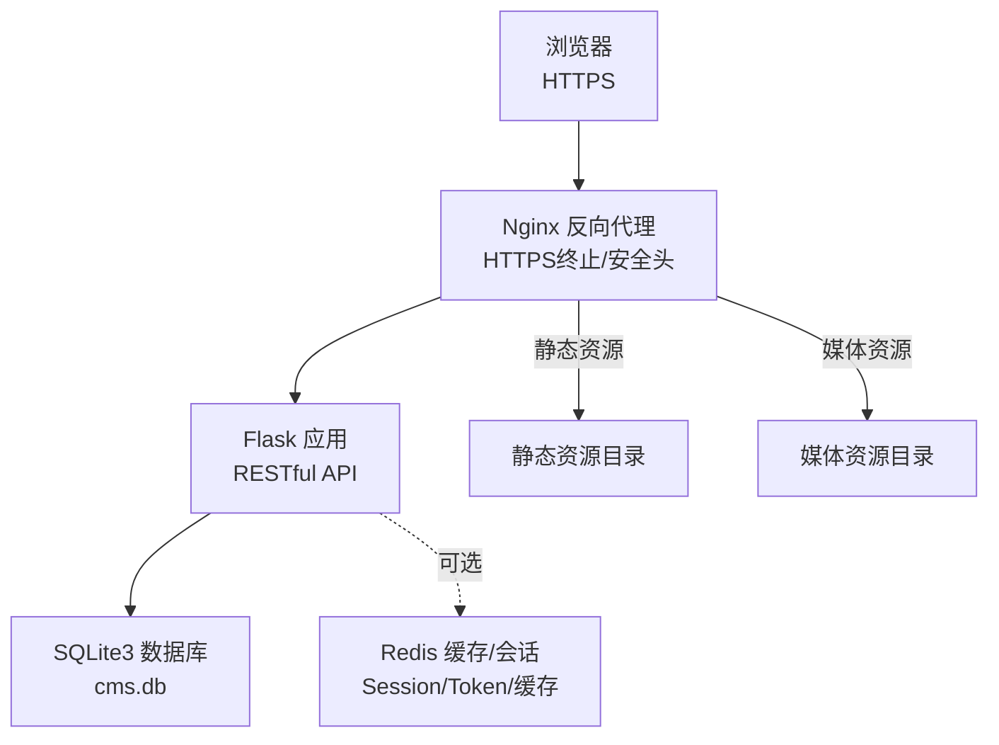
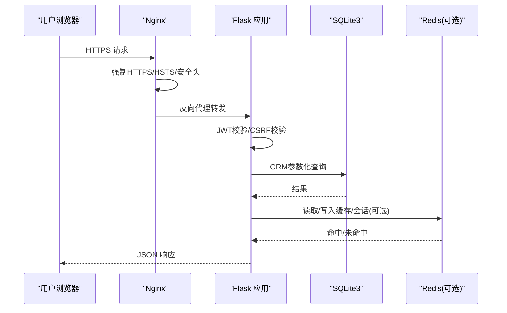
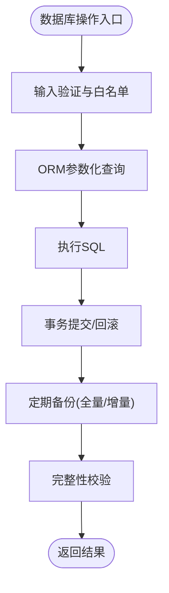
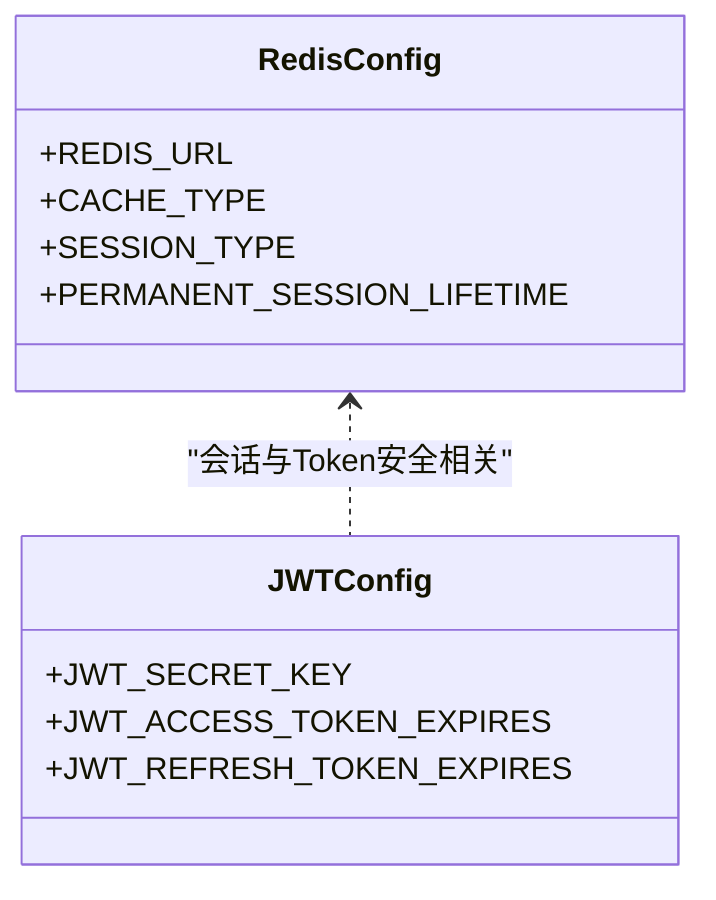
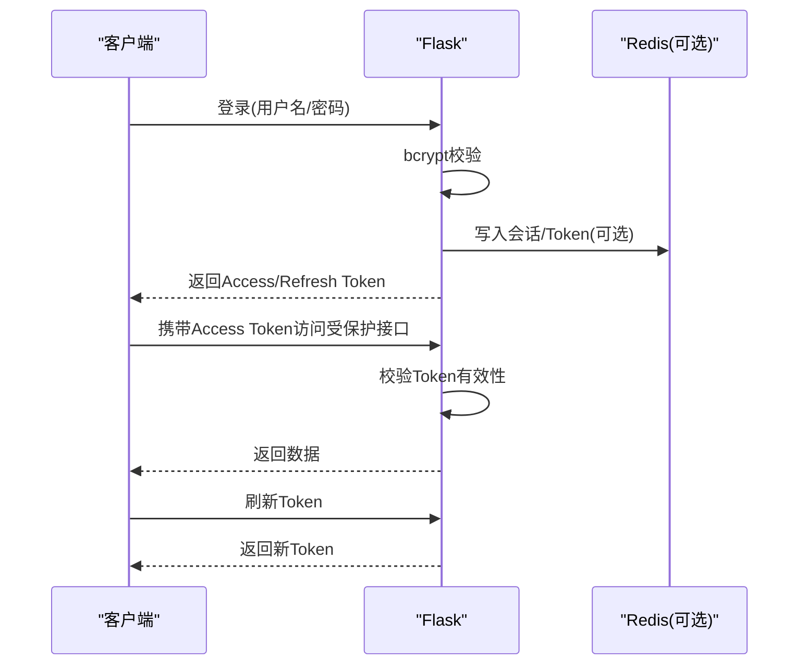
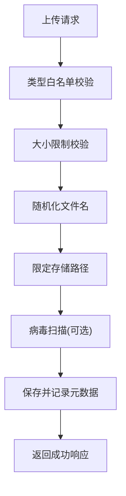
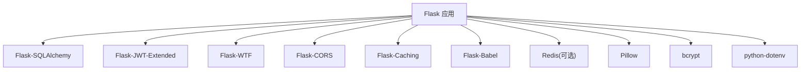

# 数据安全

<cite>
**本文引用的文件**
- [企业网站CMS系统详细需求文档.md](file://企业网站CMS系统详细需求文档.md)
- [开发计划表_2月4日-2月12日.md](file://开发计划表_2月4日-2月12日.md)
</cite>

## 目录
1. [引言](#引言)
2. [项目结构](#项目结构)
3. [核心组件](#核心组件)
4. [架构总览](#架构总览)
5. [详细组件分析](#详细组件分析)
6. [依赖分析](#依赖分析)
7. [性能考量](#性能考量)
8. [故障排查指南](#故障排查指南)
9. [结论](#结论)
10. [附录](#附录)

## 引言
本文件面向企业网站CMS系统的数据安全与合规实践，围绕数据库安全策略、数据传输加密、SQL注入防护、数据完整性保护、Redis缓存中的敏感数据与会话安全、Token安全管理、文件上传安全、备份与TLS配置、敏感信息脱敏以及数据访问日志与应急响应机制进行系统化梳理与落地建议。文档依据项目需求文档与开发计划，结合实际技术栈（Flask + SQLite3 + Redis + Nginx）给出可执行的安全基线与最佳实践。

## 项目结构
系统采用前后端分离架构，后端通过Flask提供RESTful API，Nginx作为反向代理与SSL终止，SQLite3作为主数据库，Redis用于可选缓存与会话存储。开发计划明确了各阶段的安全相关任务与接口，包括JWT认证、文件上传安全、API限流、日志与监控等。

**图表来源**
- [企业网站CMS系统详细需求文档.md](file://企业网站CMS系统详细需求文档.md#L28-L57)
- [企业网站CMS系统详细需求文档.md](file://企业网站CMS系统详细需求文档.md#L1143-L1230)
- [企业网站CMS系统详细需求文档.md](file://企业网站CMS系统详细需求文档.md#L1232-L1301)

**章节来源**
- [企业网站CMS系统详细需求文档.md](file://企业网站CMS系统详细需求文档.md#L28-L57)
- [开发计划表_2月4日-2月12日.md](file://开发计划表_2月4日-2月12日.md#L196-L252)

## 核心组件
- 认证与授权：JWT Token机制（Access/Refresh）、密码加密（bcrypt）、登录失败锁定、异常登录检测。
- 数据安全：SQL注入防护（ORM参数化）、XSS防护（输入过滤+Jinja2自动转义+CSP）、CSRF防护（Flask-WTF CSRF Token + SameSite Cookie + 双重提交Cookie）、文件上传安全（白名单+大小限制+路径限制+可选病毒扫描）。
- 数据传输安全：HTTPS强制跳转、HSTS头、TLS 1.2+、敏感数据加密（AES-256）。
- API安全：访问频率限制（Flask-Limiter，基于IP/用户）、第三方API Key加密存储与轮换。
- 缓存与会话：Redis可选缓存与Session存储，Token与会话安全配置。
- 备份与日志：数据库文件备份策略、日志记录与监控、安全事件审计。

**章节来源**
- [企业网站CMS系统详细需求文档.md](file://企业网站CMS系统详细需求文档.md#L1078-L1140)
- [企业网站CMS系统详细需求文档.md](file://企业网站CMS系统详细需求文档.md#L1381-L1423)
- [开发计划表_2月4日-2月12日.md](file://开发计划表_2月4日-2月12日.md#L196-L252)

## 架构总览
系统在Nginx层统一实现HTTPS终止、安全头加固、上传大小限制与Gzip压缩；Flask应用负责业务逻辑与API；SQLite3承担主数据存储；Redis用于可选缓存与会话。开发计划明确了安全相关任务的落地节点，包括JWT、文件上传、API限流、日志与监控等。

**图表来源**
- [企业网站CMS系统详细需求文档.md](file://企业网站CMS系统详细需求文档.md#L1143-L1230)
- [企业网站CMS系统详细需求文档.md](file://企业网站CMS系统详细需求文档.md#L1232-L1301)
- [企业网站CMS系统详细需求文档.md](file://企业网站CMS系统详细需求文档.md#L1078-L1140)

## 详细组件分析

### 数据库安全策略与SQLite3配置
- 选型与优势：SQLite3单文件、零配置、ACID事务、简化部署与备份，适合中小规模网站。
- 文件组织：数据库文件与备份目录、日志目录分离，便于备份与审计。
- 安全配置要点：
  - 使用ORM参数化查询，避免动态SQL拼接。
  - 输入验证与白名单策略，减少注入风险。
  - 索引与慢查询日志优化，保障查询性能与安全审计。
  - 备份策略：每日全量备份，保留30天，异地备份至云存储。
- 数据完整性保护：
  - ACID事务保证写入一致性。
  - 外键约束与唯一索引（如用户名/邮箱唯一）。
  - FTS5全文检索虚拟表配合触发器保持同步，确保搜索一致性。

**图表来源**
- [企业网站CMS系统详细需求文档.md](file://企业网站CMS系统详细需求文档.md#L662-L712)
- [企业网站CMS系统详细需求文档.md](file://企业网站CMS系统详细需求文档.md#L1099-L1105)
- [企业网站CMS系统详细需求文档.md](file://企业网站CMS系统详细需求文档.md#L1406-L1410)

**章节来源**
- [企业网站CMS系统详细需求文档.md](file://企业网站CMS系统详细需求文档.md#L662-L712)
- [企业网站CMS系统详细需求文档.md](file://企业网站CMS系统详细需求文档.md#L1099-L1105)
- [企业网站CMS系统详细需求文档.md](file://企业网站CMS系统详细需求文档.md#L1406-L1410)

### SQL注入防护与数据完整性
- 防护手段：
  - ORM参数化查询（Flask-SQLAlchemy）。
  - 输入验证与白名单（文件类型、字段长度、数值范围）。
  - 避免动态SQL拼接，统一通过ORM或受控SQL模板。
- 完整性保障：
  - 外键约束与唯一索引。
  - 触发器与虚拟表（FTS5）同步，确保全文检索一致性。
  - 事务边界明确，错误即回滚。

**章节来源**
- [企业网站CMS系统详细需求文档.md](file://企业网站CMS系统详细需求文档.md#L1099-L1105)
- [企业网站CMS系统详细需求文档.md](file://企业网站CMS系统详细需求文档.md#L891-L938)

### Redis缓存与会话安全
- 会话与缓存分离：Session存储在Redis，缓存独立实例，避免会话污染。
- Token安全：JWT存储在LocalStorage/Cookie，配合SameSite与HttpOnly策略（建议），并启用刷新机制。
- 异常登录检测：基于IP/设备变化的检测与告警。
- 配置要点：Redis URL、超时、持久化策略（可选）。

**图表来源**
- [企业网站CMS系统详细需求文档.md](file://企业网站CMS系统详细需求文档.md#L1254-L1271)
- [企业网站CMS系统详细需求文档.md](file://企业网站CMS系统详细需求文档.md#L1094-L1098)

**章节来源**
- [企业网站CMS系统详细需求文档.md](file://企业网站CMS系统详细需求文档.md#L1254-L1271)
- [企业网站CMS系统详细需求文档.md](file://企业网站CMS系统详细需求文档.md#L1094-L1098)

### Token安全管理
- Token机制：Access Token（2小时）、Refresh Token（7天），支持自动刷新。
- 存储与传输：LocalStorage/Cookie，建议启用HttpOnly与SameSite，传输使用HTTPS。
- 刷新与吊销：服务端维护刷新Token白名单，异常行为触发吊销与二次验证。
- 密码安全：bcrypt加密（cost=12），密码强度要求与历史记录。

**图表来源**
- [企业网站CMS系统详细需求文档.md](file://企业网站CMS系统详细需求文档.md#L1082-L1093)
- [企业网站CMS系统详细需求文档.md](file://企业网站CMS系统详细需求文档.md#L1267-L1271)

**章节来源**
- [企业网站CMS系统详细需求文档.md](file://企业网站CMS系统详细需求文档.md#L1082-L1093)
- [企业网站CMS系统详细需求文档.md](file://企业网站CMS系统详细需求文档.md#L1267-L1271)

### 文件上传安全规则
- 白名单：允许的文件类型（图片、视频、文档）。
- 大小限制：MAX_CONTENT_LENGTH（50MB）。
- 名称随机化：避免路径穿越与冲突。
- 存储路径限制：固定媒体目录，禁止越权访问。
- 可选病毒扫描：第三方扫描服务集成。
- 接口与任务：开发计划明确了上传、列表、删除、信息更新等接口与任务节点。

**图表来源**
- [企业网站CMS系统详细需求文档.md](file://企业网站CMS系统详细需求文档.md#L1116-L1122)
- [开发计划表_2月4日-2月12日.md](file://开发计划表_2月4日-2月12日.md#L196-L212)

**章节来源**
- [企业网站CMS系统详细需求文档.md](file://企业网站CMS系统详细需求文档.md#L1116-L1122)
- [开发计划表_2月4日-2月12日.md](file://开发计划表_2月4日-2月12日.md#L196-L212)

### 数据传输加密与TLS配置
- 传输加密：HTTPS强制跳转、HSTS头、TLS 1.2+。
- Nginx安全头：X-Frame-Options、X-Content-Type-Options、X-XSS-Protection。
- 客户端上传限制：client_max_body_size 50M。
- 邮件传输：SMTP-TLS（MAIL_USE_TLS）。

**章节来源**
- [企业网站CMS系统详细需求文档.md](file://企业网站CMS系统详细需求文档.md#L1123-L1127)
- [企业网站CMS系统详细需求文档.md](file://企业网站CMS系统详细需求文档.md#L1143-L1230)
- [企业网站CMS系统详细需求文档.md](file://企业网站CMS系统详细需求文档.md#L1277-L1283)

### 敏感信息脱敏与存储
- 密码加密：bcrypt（cost=12）。
- 敏感数据加密：AES-256（敏感数据加密）。
- API密钥管理：加密存储、环境变量管理、定期轮换。
- 日志脱敏：避免记录明文密码、Token、敏感字段。

**章节来源**
- [企业网站CMS系统详细需求文档.md](file://企业网站CMS系统详细需求文档.md#L1088-L1093)
- [企业网站CMS系统详细需求文档.md](file://企业网站CMS系统详细需求文档.md#L1397-L1401)
- [企业网站CMS系统详细需求文档.md](file://企业网站CMS系统详细需求文档.md#L1136-L1140)

### 数据访问日志、异常检测与应急响应
- 审计日志：登录日志、操作审计、错误日志、安全事件日志。
- 异常检测：登录失败锁定（5次失败锁定30分钟）、异常登录检测（IP/设备变化）。
- 应急响应：渗透测试、代码安全审计、日志监控、备份恢复测试（每月）。

**章节来源**
- [企业网站CMS系统详细需求文档.md](file://企业网站CMS系统详细需求文档.md#L1391-L1396)
- [企业网站CMS系统详细需求文档.md](file://企业网站CMS系统详细需求文档.md#L1088-L1093)
- [企业网站CMS系统详细需求文档.md](file://企业网站CMS系统详细需求文档.md#L1915-L1923)
- [企业网站CMS系统详细需求文档.md](file://企业网站CMS系统详细需求文档.md#L1412-L1416)

## 依赖分析
- 技术栈依赖：Flask生态（SQLAlchemy、JWT、WTF、CORS、Caching、Babel）、Redis（可选）、Pillow（图片处理）、bcrypt（密码加密）、python-dotenv（环境变量）。
- 部署依赖：Nginx（SSL/TLS、安全头、反向代理）、Windows服务（NSSM注册Gunicorn/Waitress）。

**图表来源**
- [企业网站CMS系统详细需求文档.md](file://企业网站CMS系统详细需求文档.md#L1304-L1322)

**章节来源**
- [企业网站CMS系统详细需求文档.md](file://企业网站CMS系统详细需求文档.md#L1304-L1322)

## 性能考量
- 缓存策略：页面缓存（Redis）、数据缓存（查询结果/API响应）、静态资源缓存（浏览器缓存+CDN）。
- 数据库优化：索引优化、避免N+1查询、慢查询日志、连接池配置。
- 传输优化：Gzip压缩、CDN加速、TLS 1.3（如可用）。
- 并发与限流：基于IP/用户的Flask-Limiter限流，防止DDoS与暴力破解。

**章节来源**
- [企业网站CMS系统详细需求文档.md](file://企业网站CMS系统详细需求文档.md#L514-L548)
- [企业网站CMS系统详细需求文档.md](file://企业网站CMS系统详细需求文档.md#L1130-L1135)
- [企业网站CMS系统详细需求文档.md](file://企业网站CMS系统详细需求文档.md#L1362-L1380)

## 故障排查指南
- 日志定位：Nginx访问/错误日志、Flask访问/错误日志、Windows服务日志（NSSM）。
- 常见问题：
  - HTTPS跳转失败：检查Nginx server_name与SSL证书配置。
  - 文件上传失败：检查ALLOWED_EXTENSIONS、MAX_CONTENT_LENGTH、存储路径权限。
  - JWT无效：检查SECRET_KEY、Token过期、刷新流程。
  - Redis连接失败：检查REDIS_URL、端口、认证（如启用）。
- 备份恢复：验证备份文件完整性，按备份策略执行恢复流程。

**章节来源**
- [企业网站CMS系统详细需求文档.md](file://企业网站CMS系统详细需求文档.md#L1324-L1356)
- [企业网站CMS系统详细需求文档.md](file://企业网站CMS系统详细需求文档.md#L1406-L1410)

## 结论
本项目在技术栈与架构层面已具备较为完善的安全基线：HTTPS/TLS、JWT、ORM参数化、输入/输出安全、文件上传白名单与大小限制、Redis可选缓存与会话、API限流与审计日志。建议在开发与部署过程中持续落实安全配置与监控，定期进行渗透测试与代码审计，确保系统在生产环境中的数据安全与合规。

## 附录
- 配置参考：Flask配置（数据库、Redis、JWT、上传、邮件、CORS）。
- 接口参考：媒体上传、备份与恢复、系统配置等API接口。
- 风险与应对：数据泄露风险、数据库性能瓶颈、需求变更等。

**章节来源**
- [企业网站CMS系统详细需求文档.md](file://企业网站CMS系统详细需求文档.md#L1232-L1301)
- [开发计划表_2月4日-2月12日.md](file://开发计划表_2月4日-2月12日.md#L205-L212)
- [企业网站CMS系统详细需求文档.md](file://企业网站CMS系统详细需求文档.md#L1867-L1923)