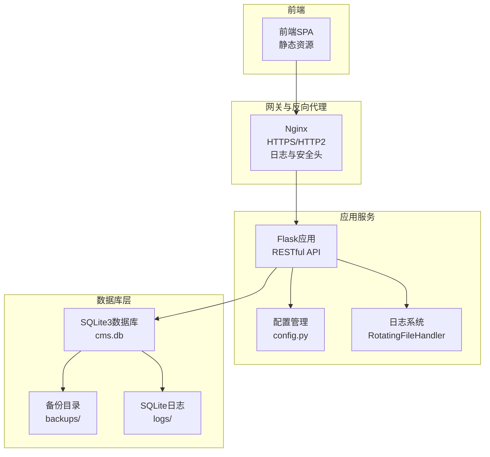
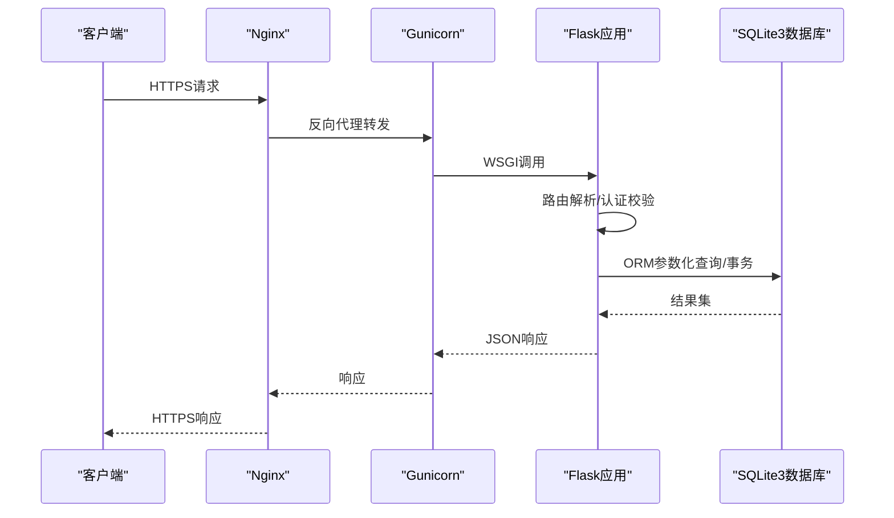
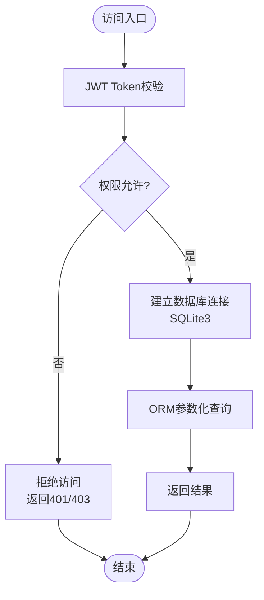
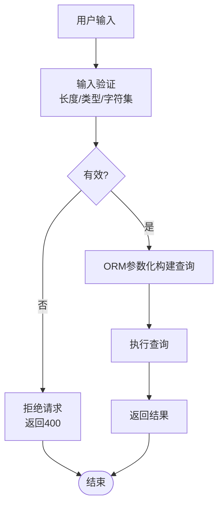
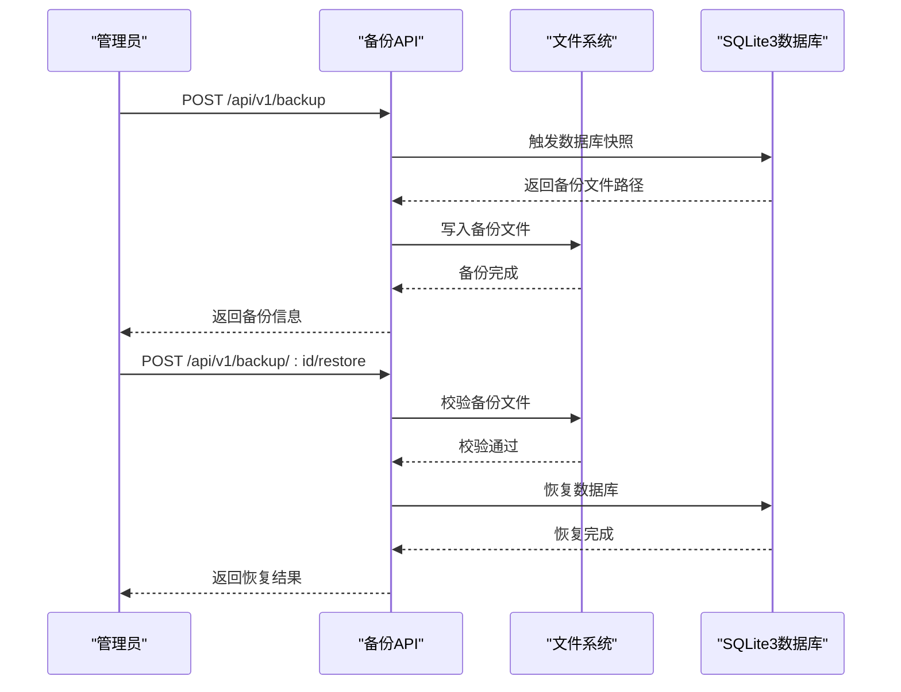
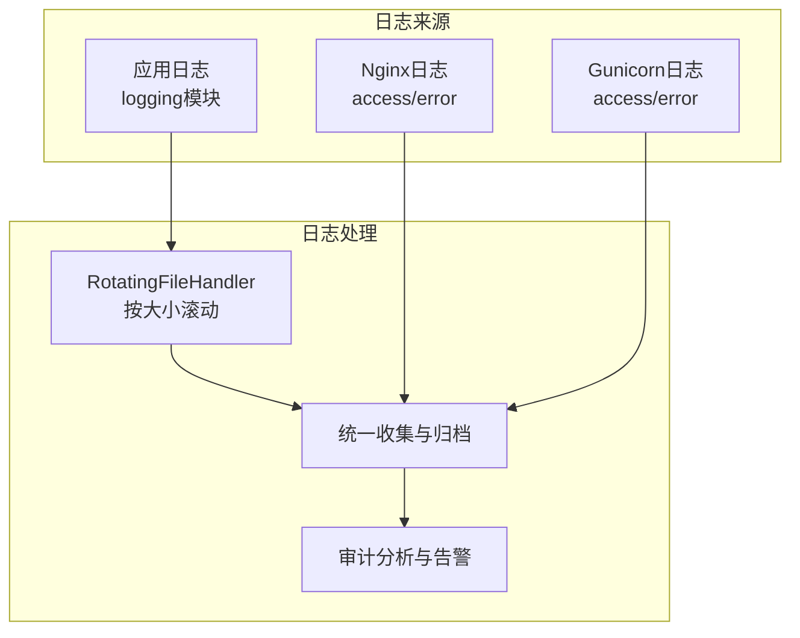
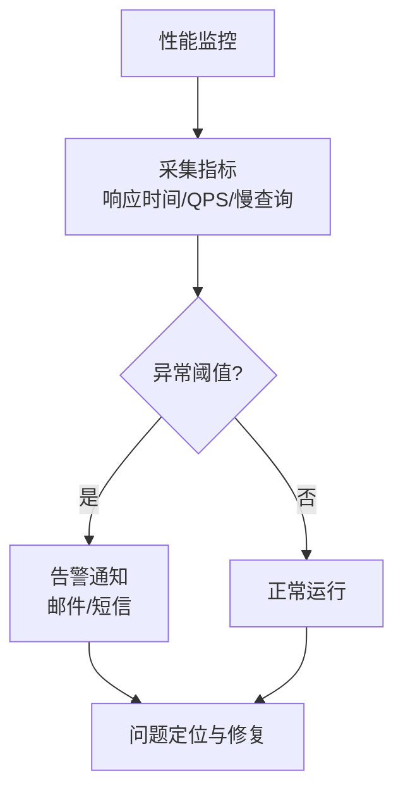
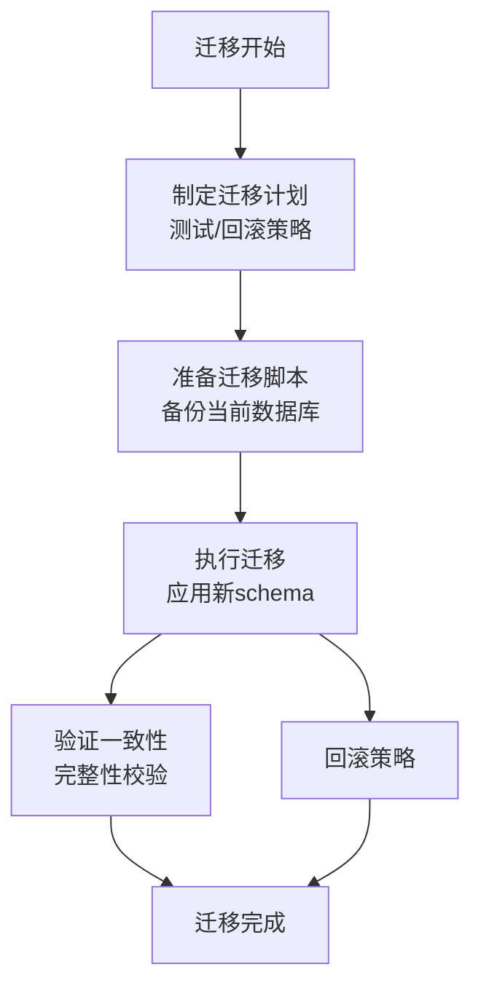
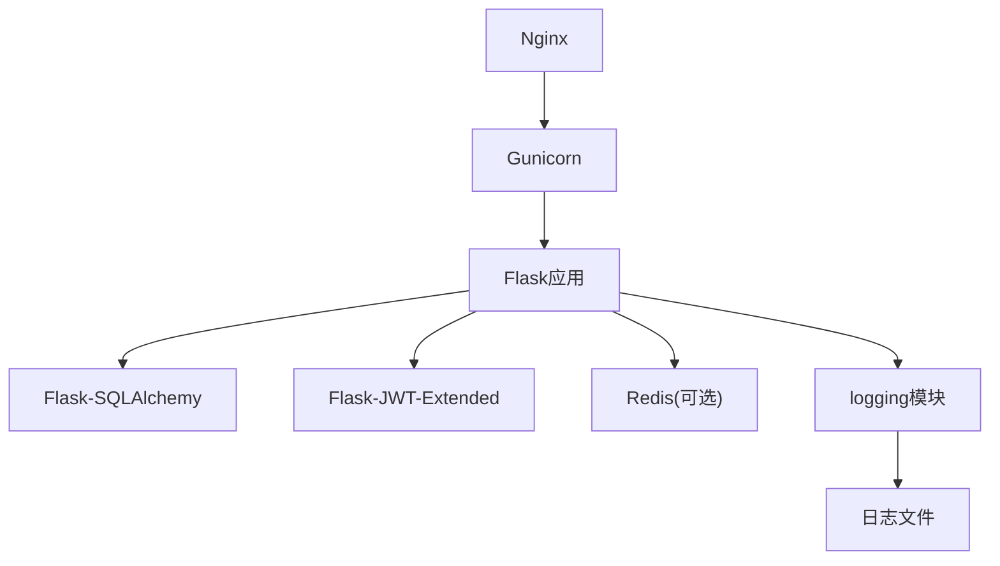

# 数据库安全

<cite>
**本文引用的文件**
- [企业网站CMS系统详细需求文档.md](file://企业网站CMS系统详细需求文档.md)
- [企业网站CMS系统开发需求文档.ini](file://企业网站CMS系统开发需求文档.ini)
- [开发计划表_2月4日-2月12日.md](file://开发计划表_2月4日-2月12日.md)
</cite>

## 目录
1. [简介](#简介)
2. [项目结构](#项目结构)
3. [核心组件](#核心组件)
4. [架构总览](#架构总览)
5. [详细组件分析](#详细组件分析)
6. [依赖关系分析](#依赖关系分析)
7. [性能考量](#性能考量)
8. [故障排查指南](#故障排查指南)
9. [结论](#结论)
10. [附录](#附录)

## 简介
本文件面向企业网站CMS系统的数据库安全保护，围绕SQLite3数据库的安全配置与防护策略展开，涵盖数据库文件权限设置、访问控制与连接安全、SQL注入防护机制（参数化查询、输入验证、ORM安全使用）、数据库备份加密与文件完整性校验、访问日志记录、性能监控与慢查询检测、异常访问告警机制，以及数据库迁移安全、版本兼容性与数据一致性保障措施。  
该系统采用SQLite3作为数据库引擎，具备零配置、ACID事务支持、跨平台等特性，适用于低并发、读多写少的企业官网场景；同时结合Flask-RESTful、Flask-SQLAlchemy、JWT等技术栈实现安全可控的数据访问与管理。

## 项目结构
- 后端采用Flask框架，使用Flask-SQLAlchemy进行ORM映射，SQLite3作为默认数据库引擎。
- 配置文件集中管理数据库URI、连接池、日志与缓存等关键参数。
- 部署层通过Nginx反向代理与Gunicorn WSGI服务器，配合Windows服务（NSSM）进行稳定运行。
- 数据库文件组织清晰，包含主数据库文件、备份目录与日志目录，便于备份与审计。

**图表来源**
- [企业网站CMS系统详细需求文档.md](file://企业网站CMS系统详细需求文档.md#L1234-L1302)
- [企业网站CMS系统详细需求文档.md](file://企业网站CMS系统详细需求文档.md#L1143-L1230)
- [企业网站CMS系统详细需求文档.md](file://企业网站CMS系统详细需求文档.md#L704-L712)

**章节来源**
- [企业网站CMS系统详细需求文档.md](file://企业网站CMS系统详细需求文档.md#L1234-L1302)
- [企业网站CMS系统详细需求文档.md](file://企业网站CMS系统详细需求文档.md#L1143-L1230)
- [企业网站CMS系统详细需求文档.md](file://企业网站CMS系统详细需求文档.md#L704-L712)

## 核心组件
- 数据库配置与连接
  - 使用Flask-SQLAlchemy配置SQLite3数据库URI，默认指向D:/cms/data/cms.db。
  - 生产环境关闭SQLAlchemy-Echo，避免敏感SQL泄露。
  - SQLite无需连接池配置，减少资源开销。
- 认证与授权
  - JWT Token机制：Access Token有效期2小时，Refresh Token有效期7天，支持Token刷新。
  - 密码安全：bcrypt加密（cost=12），密码强度要求与失败锁定策略。
  - 会话管理：可选Redis存储，支持单点/多点登录与异常登录检测。
- 安全防护
  - SQL注入防护：ORM参数化查询、输入验证、避免动态SQL。
  - XSS防护：输入过滤、输出转义（Jinja2自动转义）、CSP头。
  - CSRF防护：Flask-WTF CSRF Token、SameSite Cookie、双重提交Cookie。
  - 数据传输安全：HTTPS强制跳转、HSTS头、敏感数据加密。
- 备份与恢复
  - 数据库备份：每日全量备份，备份文件位于backups/目录。
  - 恢复接口：提供备份恢复API，支持RESTful调用。
- 日志与监控
  - 日志：Python logging模块 + RotatingFileHandler。
  - Web服务器日志：Nginx access/error log，Gunicorn access/error log。
  - 监控工具：可选Flask-Profiler、Sentry错误追踪。
- 迁移与版本兼容
  - 使用Flask-Migrate进行数据库迁移，确保版本演进与数据一致性。
  - 需要时可考虑升级至MySQL，以满足更高并发与复杂部署需求。

**章节来源**
- [企业网站CMS系统详细需求文档.md](file://企业网站CMS系统详细需求文档.md#L1234-L1302)
- [企业网站CMS系统详细需求文档.md](file://企业网站CMS系统详细需求文档.md#L1078-L1139)
- [企业网站CMS系统详细需求文档.md](file://企业网站CMS系统详细需求文档.md#L1068-L1076)
- [企业网站CMS系统详细需求文档.md](file://企业网站CMS系统详细需求文档.md#L655-L695)
- [企业网站CMS系统详细需求文档.md](file://企业网站CMS系统详细需求文档.md#L1304-L1322)

## 架构总览
系统采用“前端SPA + Nginx反向代理 + Flask应用 + SQLite3数据库”的分层架构。Nginx负责TLS终止、安全头注入与静态资源分发；Flask应用通过ORM访问SQLite3，提供RESTful API；日志系统贯穿应用与Web服务器两端，便于审计与问题定位。

**图表来源**
- [企业网站CMS系统详细需求文档.md](file://企业网站CMS系统详细需求文档.md#L1143-L1230)
- [企业网站CMS系统详细需求文档.md](file://企业网站CMS系统详细需求文档.md#L1234-L1302)

## 详细组件分析

### 数据库文件权限与访问控制
- 文件权限
  - 将数据库文件放置在受控目录（如D:/cms/data/），仅授予应用进程读写权限，避免其他用户或进程访问。
  - 备份目录与日志目录同样遵循最小权限原则，定期清理过期备份。
- 访问控制
  - 通过Flask路由与权限装饰器（如@login_required）统一拦截未授权访问。
  - JWT Token用于API鉴权，Access Token短时效，Refresh Token长时效并支持刷新。
  - 会话管理可选Redis存储，支持异常登录检测与设备/IP变化告警。
- 连接安全
  - SQLite3无需网络端口，本地文件访问，天然隔离外网攻击面。
  - 生产环境关闭SQLAlchemy-Echo，避免SQL明文输出。
  - 使用环境变量（.env）管理DATABASE_URL，避免硬编码。

**图表来源**
- [企业网站CMS系统详细需求文档.md](file://企业网站CMS系统详细需求文档.md#L1078-L1139)
- [企业网站CMS系统详细需求文档.md](file://企业网站CMS系统详细需求文档.md#L1234-L1302)

**章节来源**
- [企业网站CMS系统详细需求文档.md](file://企业网站CMS系统详细需求文档.md#L1078-L1139)
- [企业网站CMS系统详细需求文档.md](file://企业网站CMS系统详细需求文档.md#L1234-L1302)

### SQL注入防护机制
- 参数化查询与ORM安全
  - 使用Flask-SQLAlchemy ORM进行参数化查询，避免字符串拼接导致的SQL注入。
  - 输入验证：对用户输入进行长度、类型、字符集等约束校验。
  - 避免动态SQL：禁止将用户输入直接拼接到SQL语句中。
- 全文搜索与FTS5
  - SQLite不支持FULLTEXT索引，采用FTS5虚拟表实现全文检索，并通过触发器保持与主表同步，减少手工拼接SQL的风险。

**图表来源**
- [企业网站CMS系统详细需求文档.md](file://企业网站CMS系统详细需求文档.md#L1101-L1105)
- [企业网站CMS系统详细需求文档.md](file://企业网站CMS系统详细需求文档.md#L906-L938)

**章节来源**
- [企业网站CMS系统详细需求文档.md](file://企业网站CMS系统详细需求文档.md#L1101-L1105)
- [企业网站CMS系统详细需求文档.md](file://企业网站CMS系统详细需求文档.md#L906-L938)

### 数据库备份、加密与完整性校验
- 备份策略
  - 每日全量备份，备份文件位于D:/cms/data/backups/，命名包含日期，便于追溯。
  - 提供RESTful备份接口：创建备份、列出备份、恢复备份。
- 加密与完整性
  - 数据库文件本身为SQLite原生文件，可通过操作系统层面的文件加密（如BitLocker/EFS）增强安全性。
  - 完整性校验：备份完成后进行校验（如哈希值比对），并在恢复前再次校验。
  - 日志记录：应用日志与Web服务器日志共同记录备份/恢复操作，便于审计。
- 恢复流程
  - 通过API触发恢复，先校验备份文件完整性，再执行恢复并验证数据库一致性。

**图表来源**
- [企业网站CMS系统详细需求文档.md](file://企业网站CMS系统详细需求文档.md#L1068-L1076)
- [企业网站CMS系统详细需求文档.md](file://企业网站CMS系统详细需求文档.md#L1406-L1415)

**章节来源**
- [企业网站CMS系统详细需求文档.md](file://企业网站CMS系统详细需求文档.md#L1068-L1076)
- [企业网站CMS系统详细需求文档.md](file://企业网站CMS系统详细需求文档.md#L1406-L1415)

### 访问日志记录与审计
- 应用日志
  - 使用Python logging模块与RotatingFileHandler，按大小滚动日志，避免磁盘占满。
  - 记录用户登录、操作审计、错误日志与安全事件日志。
- Web服务器日志
  - Nginx配置access_log与error_log，记录请求路径、状态码、客户端IP等。
  - Gunicorn通过命令行参数指定access-logfile与error-logfile，便于统一收集。
- 审计要点
  - 记录关键操作（如用户管理、内容发布、备份/恢复）的时间、用户、IP、结果。
  - 对异常登录（IP/设备变化）与高风险操作进行标记与告警。

**图表来源**
- [企业网站CMS系统详细需求文档.md](file://企业网站CMS系统详细需求文档.md#L655-L658)
- [企业网站CMS系统详细需求文档.md](file://企业网站CMS系统详细需求文档.md#L1177-L1179)
- [企业网站CMS系统详细需求文档.md](file://企业网站CMS系统详细需求文档.md#L1333-L1334)

**章节来源**
- [企业网站CMS系统详细需求文档.md](file://企业网站CMS系统详细需求文档.md#L655-L658)
- [企业网站CMS系统详细需求文档.md](file://企业网站CMS系统详细需求文档.md#L1177-L1179)
- [企业网站CMS系统详细需求文档.md](file://企业网站CMS系统详细需求文档.md#L1333-L1334)

### 性能监控、慢查询检测与异常访问告警
- 性能监控
  - 可选Flask-Profiler进行性能分析，识别热点函数与慢查询。
  - 监控指标：响应时间、QPS、数据库查询耗时、内存/CPU使用率。
- 慢查询检测
  - 在生产环境开启SQLAlchemy-Echo（开发环境已关闭）进行短期诊断，定位慢查询。
  - 结合Nginx与Gunicorn日志，分析请求耗时分布。
- 异常访问告警
  - 基于Flask-Limiter进行访问频率限制（基于IP/用户），超限触发告警。
  - 结合日志分析工具（如ELK/Graylog）实现异常行为检测与邮件/短信通知。

**图表来源**
- [企业网站CMS系统详细需求文档.md](file://企业网站CMS系统详细需求文档.md#L1360-L1380)
- [企业网站CMS系统详细需求文档.md](file://企业网站CMS系统详细需求文档.md#L1128-L1135)

**章节来源**
- [企业网站CMS系统详细需求文档.md](file://企业网站CMS系统详细需求文档.md#L1360-L1380)
- [企业网站CMS系统详细需求文档.md](file://企业网站CMS系统详细需求文档.md#L1128-L1135)

### 数据库迁移安全、版本兼容性与一致性
- 迁移与版本管理
  - 使用Flask-Migrate进行数据库迁移，确保schema演进与数据一致性。
  - 迁移脚本需经过测试环境验证后再上线，回滚策略明确。
- 版本兼容性
  - SQLite3版本需满足最低要求，确保FTS5等特性可用。
  - 如需升级至MySQL，需评估迁移成本、索引策略、触发器与存储过程差异。
- 数据一致性保障
  - 使用ACID事务保证写入一致性，对关键业务（如备份/恢复）采用事务包裹。
  - 备份/恢复前后进行完整性校验，确保数据一致。

**图表来源**
- [企业网站CMS系统详细需求文档.md](file://企业网站CMS系统详细需求文档.md#L1304-L1322)
- [企业网站CMS系统详细需求文档.md](file://企业网站CMS系统详细需求文档.md#L695-L703)

**章节来源**
- [企业网站CMS系统详细需求文档.md](file://企业网站CMS系统详细需求文档.md#L1304-L1322)
- [企业网站CMS系统详细需求文档.md](file://企业网站CMS系统详细需求文档.md#L695-L703)

## 依赖关系分析
- 组件耦合
  - Flask应用依赖Flask-SQLAlchemy进行数据库访问，依赖JWT进行认证，依赖Redis进行会话存储（可选）。
  - Nginx与Gunicorn构成稳定的Web前置层，日志系统贯穿全链路。
- 外部依赖
  - Python生态：Flask、Flask-SQLAlchemy、Flask-Migrate、Flask-JWT-Extended、bcrypt、redis等。
  - 部署工具：Nginx、Gunicorn、NSSM（Windows服务）。
- 潜在风险
  - SQLite在高并发写入场景可能成为瓶颈，需结合缓存与读写分离策略。
  - 环境变量泄露风险，需妥善管理DATABASE_URL与JWT_SECRET_KEY。

**图表来源**
- [企业网站CMS系统详细需求文档.md](file://企业网站CMS系统详细需求文档.md#L1304-L1322)
- [企业网站CMS系统详细需求文档.md](file://企业网站CMS系统详细需求文档.md#L1143-L1230)

**章节来源**
- [企业网站CMS系统详细需求文档.md](file://企业网站CMS系统详细需求文档.md#L1304-L1322)
- [企业网站CMS系统详细需求文档.md](file://企业网站CMS系统详细需求文档.md#L1143-L1230)

## 性能考量
- SQLite3在读多写少场景表现优异，适合本项目的企业官网CMS需求。
- 建议：
  - 合理设计索引，避免全表扫描。
  - 使用Redis缓存热点数据，减轻数据库压力。
  - 对高频查询进行缓存与分页，控制单次查询数据量。
  - 监控数据库查询耗时，识别并优化慢查询。

[本节为通用性能指导，不直接分析具体文件]

## 故障排查指南
- 数据库连接问题
  - 检查DATABASE_URL是否正确指向D:/cms/data/cms.db。
  - 确认应用进程对数据库文件具有读写权限。
- 备份/恢复失败
  - 校验备份文件完整性（哈希值），确认备份目录权限。
  - 恢复前先停止应用，恢复后重启并验证数据库连通性。
- 日志定位
  - 查看Nginx与Gunicorn日志，定位请求异常与错误码。
  - 应用日志中查找SQL执行时间、权限拒绝、认证失败等关键信息。
- 性能问题
  - 使用Flask-Profiler定位热点函数，结合慢查询日志优化SQL。
  - 检查索引缺失与锁等待情况。

**章节来源**
- [企业网站CMS系统详细需求文档.md](file://企业网站CMS系统详细需求文档.md#L1417-L1422)
- [企业网站CMS系统详细需求文档.md](file://企业网站CMS系统详细需求文档.md#L1333-L1334)

## 结论
本项目围绕SQLite3数据库构建了完善的安全部署与防护体系：通过严格的文件权限与访问控制、ORM参数化查询与输入验证、JWT认证与会话管理、完善的日志与审计、自动化备份与恢复、性能监控与告警机制，以及规范的迁移与一致性保障，实现了企业官网CMS系统的数据库安全与稳定运行。在满足当前低并发、读多写少场景的同时，也为未来升级至MySQL提供了清晰的演进路径与兼容策略。

[本节为总结性内容，不直接分析具体文件]

## 附录
- 环境变量与配置
  - DATABASE_URL：数据库URI（默认sqlite:///D:/cms/data/cms.db）
  - SECRET_KEY、JWT_SECRET_KEY：用于签名与加密
  - REDIS_URL：会话存储（可选）
- 部署要点
  - 使用NSSM将Gunicorn注册为Windows服务，配置access/error日志路径。
  - Nginx启用HTTPS与安全头，限制上传大小与压缩策略。

**章节来源**
- [企业网站CMS系统详细需求文档.md](file://企业网站CMS系统详细需求文档.md#L1346-L1356)
- [企业网站CMS系统详细需求文档.md](file://企业网站CMS系统详细需求文档.md#L1143-L1230)