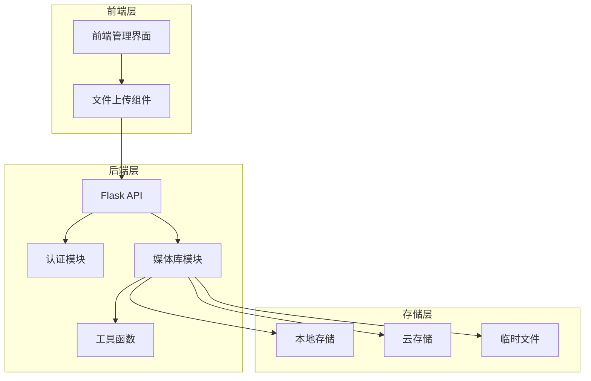
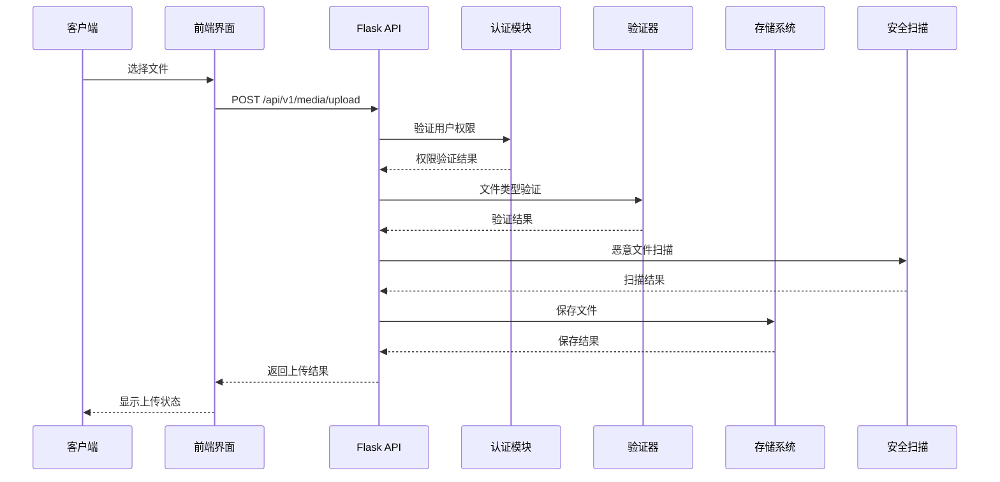
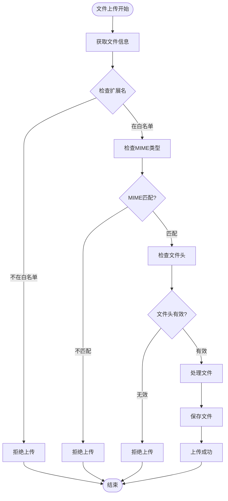
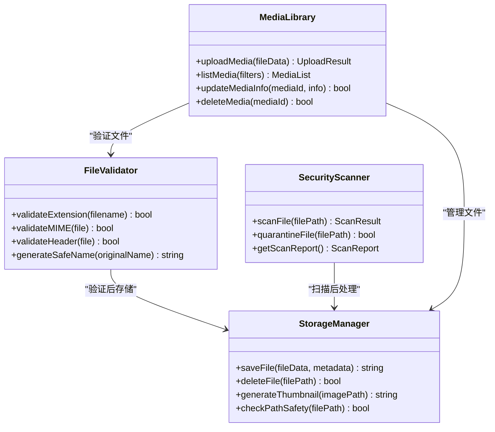
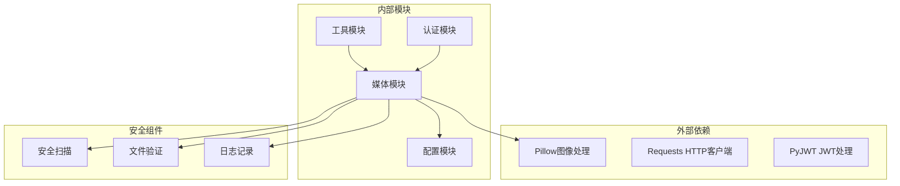

# 文件上传安全

<cite>
**本文档引用的文件**
- [企业网站CMS系统开发需求文档.ini](file://企业网站CMS系统开发需求文档.ini)
- [企业网站CMS系统详细需求文档.md](file://企业网站CMS系统详细需求文档.md)
- [开发计划表_2月4日-2月12日.md](file://开发计划表_2月4日-2月12日.md)
</cite>

## 目录
1. [引言](#引言)
2. [项目结构](#项目结构)
3. [核心组件](#核心组件)
4. [架构概览](#架构概览)
5. [详细组件分析](#详细组件分析)
6. [依赖关系分析](#依赖关系分析)
7. [性能考虑](#性能考虑)
8. [故障排除指南](#故障排除指南)
9. [结论](#结论)

## 引言

本文档专注于企业网站CMS系统的文件上传安全防护，基于项目需求文档和开发计划中的文件上传功能要求，提供全面的安全规则和防护机制说明。该系统采用Python Flask作为后端框架，支持图片上传、批量上传等功能，并集成了多种安全防护措施。

## 项目结构

基于开发计划和需求文档，文件上传功能主要涉及以下组件：

**图表来源**
- [开发计划表_2月4日-2月12日.md](file://开发计划表_2月4日-2月12日.md#L196-L238)
- [企业网站CMS系统详细需求文档.md](file://企业网站CMS系统详细需求文档.md#L355-L387)

**章节来源**
- [开发计划表_2月4日-2月12日.md](file://开发计划表_2月4日-2月12日.md#L196-L238)
- [企业网站CMS系统详细需求文档.md](file://企业网站CMS系统详细需求文档.md#L355-L387)

## 核心组件

### 文件上传接口设计

系统提供了完整的文件上传接口，支持多种文件类型和安全验证：

**上传接口规范**：
- 接口路径：`/api/v1/media/upload`
- 请求方法：`POST`
- 内容类型：`multipart/form-data`
- 支持文件类型：JPG, PNG, GIF, WebP
- 文件大小限制：5MB
- 支持批量上传

**文件存储策略**：
- 本地存储路径：`D:/cms/media/YYYY/MM/`
- 自动生成缩略图：300x300像素
- 文件名处理：使用UUID避免冲突
- 目录结构：按年月分层存储

**章节来源**
- [开发计划表_2月4日-2月12日.md](file://开发计划表_2月4日-2月12日.md#L205-L212)
- [开发计划表_2月4日-2月12日.md](file://开发计划表_2月4日-2月12日.md#L214-L218)

### 媒体库管理模块

媒体库模块提供完整的文件管理功能：

**核心功能**：
- 文件列表管理
- 文件信息编辑（标题、描述）
- 文件删除功能
- 文件类型筛选
- 文件大小统计

**存储管理**：
- 本地存储支持
- 云存储集成（阿里云OSS、腾讯云COS、七牛云）
- 存储空间监控
- 未使用文件清理

**章节来源**
- [开发计划表_2月4日-2月12日.md](file://开发计划表_2月4日-2月12日.md#L197-L238)
- [企业网站CMS系统详细需求文档.md](file://企业网站CMS系统详细需求文档.md#L379-L387)

## 架构概览

文件上传系统的整体架构采用分层设计：

**图表来源**
- [开发计划表_2月4日-2月12日.md](file://开发计划表_2月4日-2月12日.md#L197-L212)
- [企业网站CMS系统详细需求文档.md](file://企业网站CMS系统详细需求文档.md#L355-L366)

## 详细组件分析

### 文件类型验证机制

系统实现了多层次的文件类型验证：

#### MIME类型检查
- 使用Python的`mimetypes`模块进行MIME类型识别
- 验证文件扩展名与MIME类型的匹配性
- 阻止伪装文件类型的上传

#### 文件头验证
- 读取文件头部字节进行二进制验证
- 支持常见图片格式的魔数检查
- 防止通过修改扩展名绕过验证

#### 扩展名白名单
- 严格的文件扩展名白名单机制
- 仅允许预定义的安全格式
- 动态扩展名验证

**图表来源**
- [开发计划表_2月4日-2月12日.md](file://开发计划表_2月4日-2月12日.md#L200-L201)

**章节来源**
- [开发计划表_2月4日-2月12日.md](file://开发计划表_2月4日-2月12日.md#L200-L201)

### 恶意文件检测技术

#### 病毒扫描集成
- 集成第三方病毒扫描服务
- 支持多引擎扫描
- 实时扫描和异步扫描模式

#### 文件内容分析
- 检测潜在的恶意代码
- 分析文件结构和语法
- 识别已知威胁模式

#### 危险代码识别
- 检测脚本文件中的可疑代码
- 分析文件执行权限
- 识别潜在的注入攻击

### 文件存储路径安全

#### 目录遍历攻击防护
- 使用安全的文件路径构建
- 防止相对路径攻击
- 严格的目录访问控制

#### 文件名处理
- 自动生成唯一文件名
- 防止特殊字符攻击
- 中文文件名支持

#### 存储路径隔离
- 按用户和时间分层存储
- 防止文件冲突
- 支持文件版本管理

**图表来源**
- [开发计划表_2月4日-2月12日.md](file://开发计划表_2月4日-2月12日.md#L197-L238)

**章节来源**
- [开发计划表_2月4日-2月12日.md](file://开发计划表_2月4日-2月12日.md#L197-L238)

### 文件大小限制和批量上传安全

#### 文件大小限制
- 单文件大小限制：5MB
- 总上传大小限制：20MB
- 动态配置支持

#### 批量上传安全
- 逐文件验证
- 进度跟踪
- 错误处理和回滚
- 并发控制

#### 上传速率限制
- 基于IP的请求频率限制
- 用户级别的上传频率限制
- 防止滥用和DDoS攻击

### 云存储集成安全配置

#### 云存储提供商支持
- 阿里云OSS
- 腾讯云COS  
- 七牛云存储

#### 安全配置要点
- 使用签名URL进行访问控制
- 配置CORS策略
- 设置访问权限和生命周期
- 监控存储使用情况

#### 数据传输安全
- HTTPS强制传输
- 服务器端加密
- 访问日志记录

**章节来源**
- [企业网站CMS系统详细需求文档.md](file://企业网站CMS系统详细需求文档.md#L381-L384)

### 文件访问控制

#### 权限控制机制
- 基于角色的访问控制（RBAC）
- 文件所有权验证
- 目录访问权限控制

#### 临时文件管理
- 自动清理机制
- 临时文件生命周期管理
- 存储空间监控

#### 存储空间监控
- 实时存储使用统计
- 空间预警机制
- 自动清理策略

## 依赖关系分析

文件上传系统的依赖关系如下：

**图表来源**
- [企业网站CMS系统详细需求文档.md](file://企业网站CMS系统详细需求文档.md#L589-L593)

**章节来源**
- [企业网站CMS系统详细需求文档.md](file://企业网站CMS系统详细需求文档.md#L589-L593)

## 性能考虑

### 上传性能优化
- 异步文件处理
- 进度条实时更新
- 断点续传支持
- 并发上传限制

### 存储性能优化
- 分层存储结构
- 缓存策略
- CDN集成
- 压缩算法

### 安全性能平衡
- 验证过程的性能影响
- 扫描延迟优化
- 资源使用监控
- 自适应安全策略

## 故障排除指南

### 常见上传问题
- 文件类型错误：检查扩展名和MIME类型
- 存储权限问题：验证目录写入权限
- 网络连接问题：检查代理和防火墙设置
- 磁盘空间不足：清理临时文件和旧媒体

### 安全问题诊断
- 恶意文件检测：检查安全扫描日志
- 权限验证失败：验证用户认证状态
- 路径遍历攻击：检查文件路径验证
- 上传速率限制：调整频率限制配置

### 性能问题解决
- 上传速度慢：优化网络带宽和服务器配置
- 存储空间不足：清理不需要的文件
- 并发上传问题：调整并发限制
- 缓存失效：重建缓存索引

**章节来源**
- [开发计划表_2月4日-2月12日.md](file://开发计划表_2月4日-2月12日.md#L419-L432)

## 结论

企业网站CMS系统的文件上传安全防护体系涵盖了从文件类型验证、恶意文件检测到存储管理和访问控制的全方位保护。通过多层次的安全验证机制、严格的权限控制和完善的监控体系，系统能够有效防范各种文件上传相关的安全威胁。

关键的安全特性包括：
- 多层次文件验证机制
- 恶意文件检测和隔离
- 安全的存储路径和文件名处理
- 细粒度的访问控制
- 完善的监控和日志记录
- 灵活的云存储集成

这些安全措施为CMS系统的稳定运行和数据安全提供了坚实保障，能够满足企业网站对文件上传功能的安全需求。