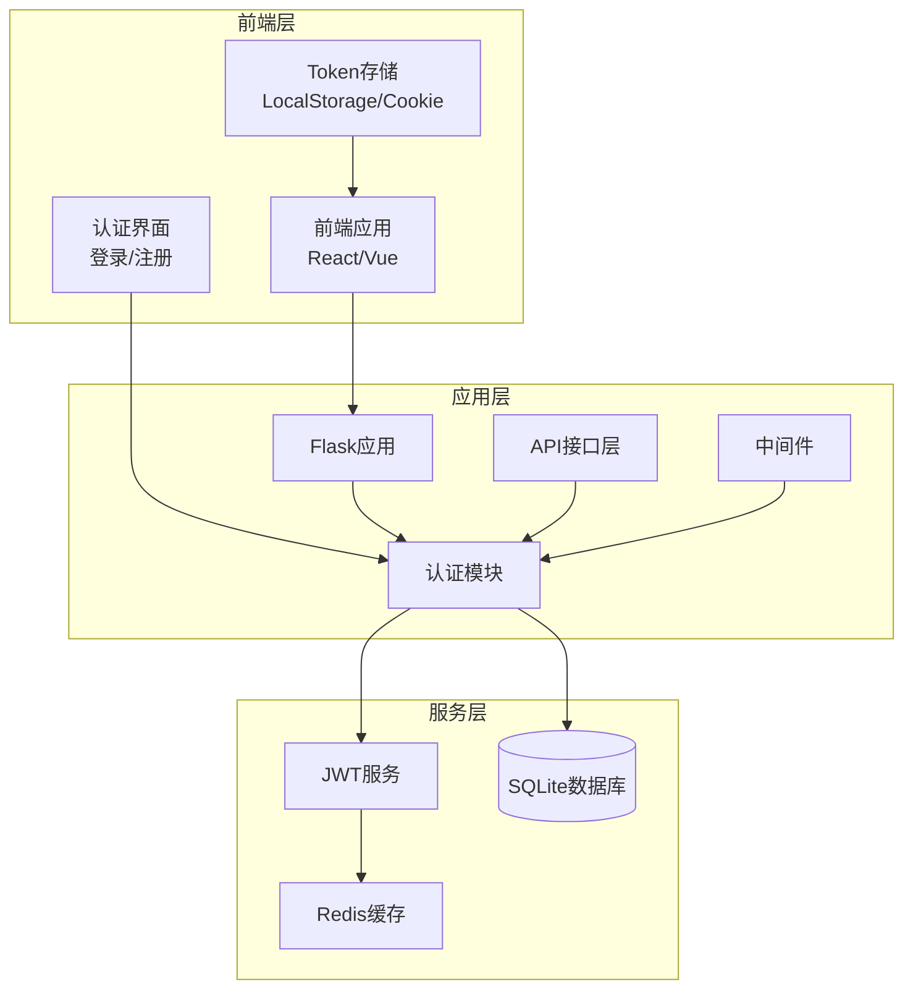
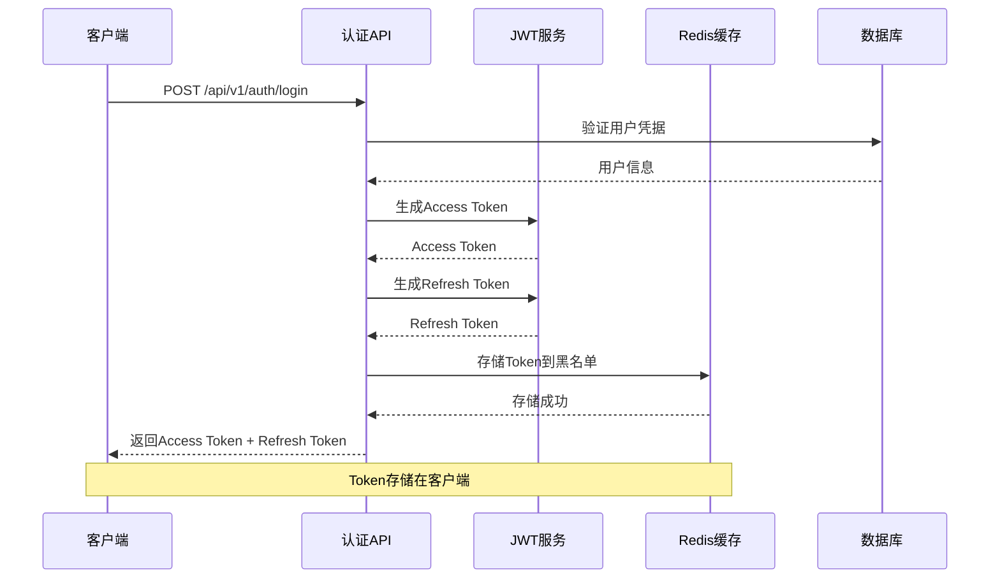
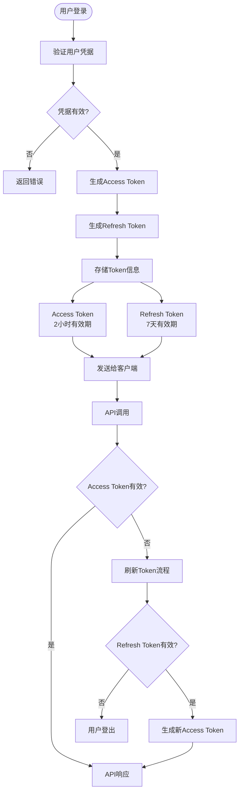
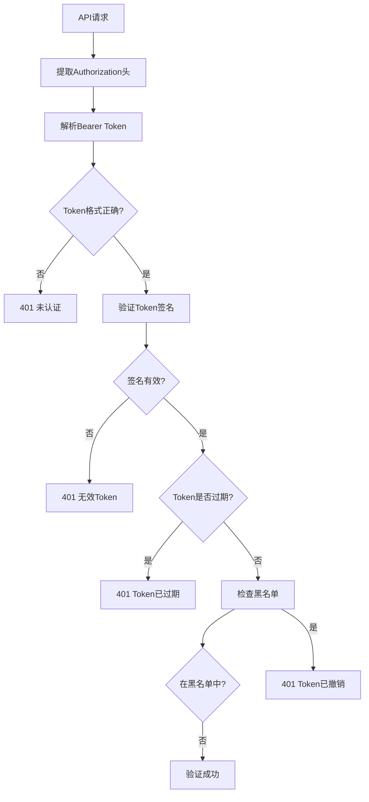
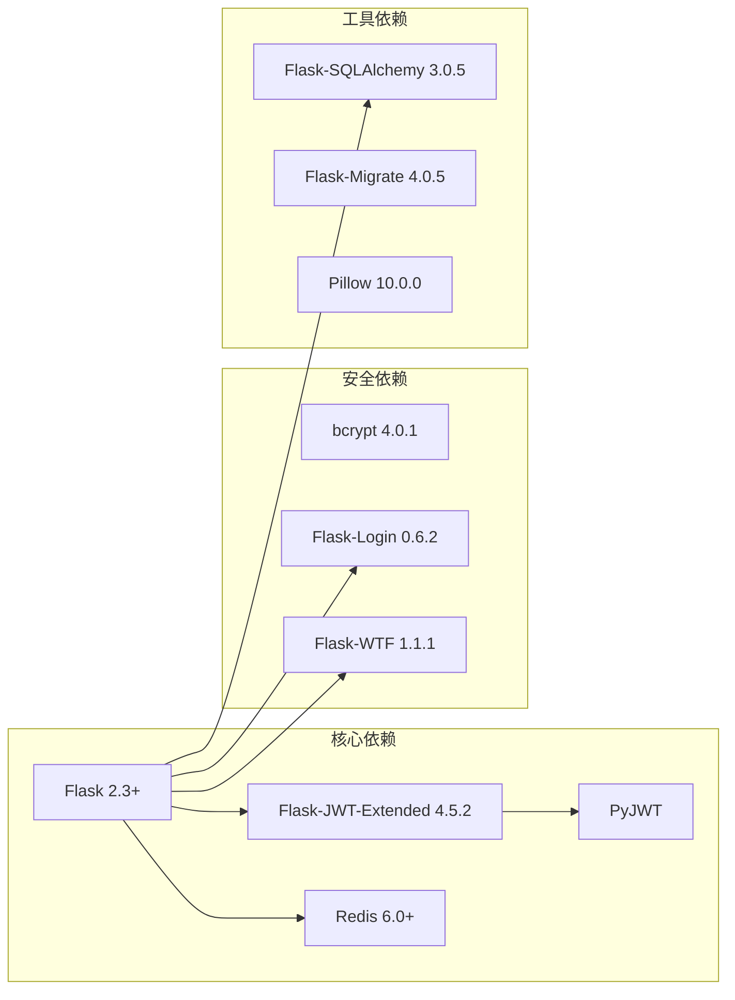

# JWT身份验证

<cite>
**本文档引用的文件**
- [企业网站CMS系统详细需求文档.md](file://企业网站CMS系统详细需求文档.md)
- [开发计划表_2月4日-2月12日.md](file://开发计划表_2月4日-2月12日.md)
- [企业网站CMS系统开发需求文档.ini](file://企业网站CMS系统开发需求文档.ini)
</cite>

## 目录
1. [简介](#简介)
2. [项目结构](#项目结构)
3. [核心组件](#核心组件)
4. [架构概览](#架构概览)
5. [详细组件分析](#详细组件分析)
6. [依赖关系分析](#依赖关系分析)
7. [性能考虑](#性能考虑)
8. [故障排除指南](#故障排除指南)
9. [结论](#结论)

## 简介

本文件详细阐述了企业网站CMS系统的JWT（JSON Web Token）身份验证机制。该系统采用Flask框架结合Flask-JWT-Extended扩展实现现代化的身份认证方案，支持双令牌模型（Access Token和Refresh Token）、多设备登录管理和Token黑名单机制。

JWT身份验证是现代Web应用的标准实践，通过将用户身份信息编码到Token中，实现了无状态的认证机制，特别适合微服务架构和分布式系统。

## 项目结构

CMS系统采用模块化的项目结构，JWT认证作为核心安全组件集成在整个应用架构中：

**图表来源**
- [开发计划表_2月4日-2月12日.md](file://开发计划表_2月4日-2月12日.md#L92-L105)
- [企业网站CMS系统详细需求文档.md](file://企业网站CMS系统详细需求文档.md#L1078-L1098)

**章节来源**
- [开发计划表_2月4日-2月12日.md](file://开发计划表_2月4日-2月12日.md#L92-L105)
- [企业网站CMS系统详细需求文档.md](file://企业网站CMS系统详细需求文档.md#L1078-L1098)

## 核心组件

### JWT配置与设置

系统采用Flask-JWT-Extended扩展实现JWT认证，核心配置包括：

**访问令牌配置**：
- 有效期：2小时
- 签名算法：HS256
- 存储位置：LocalStorage/Cookie

**刷新令牌配置**：
- 有效期：7天
- 签名算法：HS256
- 存储位置：HttpOnly Cookie

**密钥管理**：
- JWT_SECRET_KEY：生产环境专用密钥
- 环境变量管理
- 安全存储

**章节来源**
- [企业网站CMS系统详细需求文档.md](file://企业网站CMS系统详细需求文档.md#L1267-L1271)
- [企业网站CMS系统详细需求文档.md](file://企业网站CMS系统详细需求文档.md#L1082-L1086)

### 认证接口设计

系统提供完整的JWT认证接口集：

**图表来源**
- [企业网站CMS系统详细需求文档.md](file://企业网站CMS系统详细需求文档.md#L1002-L1011)

**章节来源**
- [企业网站CMS系统详细需求文档.md](file://企业网站CMS系统详细需求文档.md#L1002-L1011)

## 架构概览

### 双令牌架构

系统采用双令牌模型实现安全的用户会话管理：

**图表来源**
- [企业网站CMS系统详细需求文档.md](file://企业网站CMS系统详细需求文档.md#L1082-L1086)

### Token存储策略

系统支持多种Token存储方案：

**前端存储选项**：
- LocalStorage：持久存储，适合SPA应用
- Cookie：HttpOnly属性，更安全
- Session Storage：临时存储

**存储安全性考虑**：
- HttpOnly Cookie防止XSS攻击
- Secure属性确保HTTPS传输
- SameSite属性防止CSRF攻击

**章节来源**
- [企业网站CMS系统详细需求文档.md](file://企业网站CMS系统详细需求文档.md#L1085-L1086)

## 详细组件分析

### JWT服务实现

#### Token生成机制

系统使用Flask-JWT-Extended扩展实现JWT的生成和验证：

**Access Token生成**：
- 包含用户标识信息
- 短有效期（2小时）
- 用于API访问授权

**Refresh Token生成**：
- 包含用户标识信息
- 长有效期（7天）
- 用于获取新的Access Token

#### Token验证流程

**图表来源**
- [企业网站CMS系统详细需求文档.md](file://企业网站CMS系统详细需求文档.md#L1082-L1086)

#### Token刷新机制

系统实现智能的Token刷新策略：

**自动刷新条件**：
- Access Token即将过期
- 前端检测到401状态码
- 用户主动刷新

**刷新流程**：
1. 使用Refresh Token向服务器申请新Token
2. 验证Refresh Token有效性
3. 生成新的Access Token
4. 更新客户端存储
5. 维护Token黑名单

**章节来源**
- [企业网站CMS系统详细需求文档.md](file://企业网站CMS系统详细需求文档.md#L1083-L1084)

### Token黑名单机制

#### 黑名单实现策略

系统采用Redis实现Token黑名单，支持以下场景：

**Token撤销场景**：
- 用户主动登出
- 密码修改
- 账户禁用
- 安全事件触发

**黑名单管理**：
- 存储已撤销的Token标识
- 设置过期时间管理内存
- 支持批量清理过期条目

#### 多设备登录管理

系统支持多设备登录场景：

**设备识别**：
- 基于User-Agent识别设备
- Token绑定特定设备信息
- 支持设备切换通知

**冲突处理**：
- 新设备登录时撤销旧设备Token
- 支持单点登录配置
- 异常登录检测和通知

**章节来源**
- [企业网站CMS系统详细需求文档.md](file://企业网站CMS系统详细需求文档.md#L1094-L1098)

### 前端Token管理

#### Token存储最佳实践

**LocalStorage vs Cookie选择**：
- LocalStorage：适合SPA应用，持久存储
- HttpOnly Cookie：更安全，防止XSS攻击
- Session Storage：临时存储，页面关闭即清除

**Token生命周期管理**：
- 自动刷新机制
- 过期检测和处理
- 错误状态码处理

#### 前端安全措施

**CSP配置**：
- Content Security Policy头部
- 防止脚本注入攻击
- 限制外部资源加载

**XSS防护**：
- 输入验证和输出转义
- 安全的DOM操作
- 防止恶意脚本执行

**章节来源**
- [企业网站CMS系统详细需求文档.md](file://企业网站CMS系统详细需求文档.md#L1106-L1110)

## 依赖关系分析

### 技术栈依赖

系统JWT认证实现依赖以下核心技术：

**图表来源**
- [企业网站CMS系统详细需求文档.md](file://企业网站CMS系统详细需求文档.md#L1304-L1322)

### 配置管理

系统采用环境变量管理JWT配置：

**配置项说明**：
- JWT_SECRET_KEY：JWT签名密钥
- JWT_ACCESS_TOKEN_EXPIRES：Access Token有效期
- JWT_REFRESH_TOKEN_EXPIRES：Refresh Token有效期
- REDIS_URL：Redis连接地址

**环境分离**：
- development：开发环境配置
- production：生产环境配置
- testing：测试环境配置

**章节来源**
- [企业网站CMS系统详细需求文档.md](file://企业网站CMS系统详细需求文档.md#L1234-L1301)

## 性能考虑

### Token性能优化

**内存使用优化**：
- Redis缓存Token状态
- 合理设置过期时间
- 批量清理过期Token

**网络传输优化**：
- Token大小控制
- 压缩传输数据
- 减少不必要的请求

**并发处理**：
- Redis集群支持
- Token验证异步处理
- 缓存命中率优化

### 安全性能平衡

**安全与性能权衡**：
- Token验证频率控制
- 缓存策略优化
- 加密算法性能评估

## 故障排除指南

### 常见问题诊断

**Token过期问题**：
- 检查客户端时间同步
- 验证服务器时间配置
- 确认Token有效期设置

**Token验证失败**：
- 检查签名密钥一致性
- 验证Token格式正确性
- 确认Redis连接状态

**多设备冲突**：
- 检查设备识别逻辑
- 验证Token撤销机制
- 监控异常登录行为

### 调试工具和方法

**日志监控**：
- 认证请求日志
- Token验证日志
- 错误状态码统计

**性能监控**：
- Token验证响应时间
- Redis连接池使用情况
- 内存使用情况

**章节来源**
- [企业网站CMS系统详细需求文档.md](file://企业网站CMS系统详细需求文档.md#L1128-L1139)

## 结论

本JWT身份验证系统提供了企业级的安全认证解决方案，具有以下特点：

**安全性保障**：
- 双令牌模型提供多层次保护
- Token黑名单机制支持快速撤销
- 多设备登录冲突处理
- 前后端双重安全防护

**性能优化**：
- Redis缓存提升验证速度
- 合理的Token有效期设置
- 异步处理减少延迟

**可维护性**：
- 清晰的架构设计
- 完善的错误处理机制
- 灵活的配置管理

该系统为CMS平台提供了可靠的身份认证基础，支持未来的功能扩展和安全增强。