# RBAC权限控制

<cite>
**本文档引用的文件**
- [企业网站CMS系统开发需求文档.ini](file://企业网站CMS系统开发需求文档.ini)
- [企业网站CMS系统详细需求文档.md](file://企业网站CMS系统详细需求文档.md)
</cite>

## 目录
1. [简介](#简介)
2. [项目结构](#项目结构)
3. [核心组件](#核心组件)
4. [架构总览](#架构总览)
5. [详细组件分析](#详细组件分析)
6. [依赖关系分析](#依赖关系分析)
7. [性能考虑](#性能考虑)
8. [故障排除指南](#故障排除指南)
9. [结论](#结论)

## 简介

RBAC（基于角色的访问控制）权限控制系统是企业网站CMS系统的核心安全组件。该系统实现了严格的用户权限管理，确保不同角色的用户只能访问其被授权的功能和数据。

系统采用Flask框架构建，集成了Flask-Login和Flask-JWT-Extended等安全组件，提供了完整的用户认证、授权和会话管理功能。

## 项目结构

CMS系统的权限控制模块位于后端Flask应用中，主要包含以下核心组件：

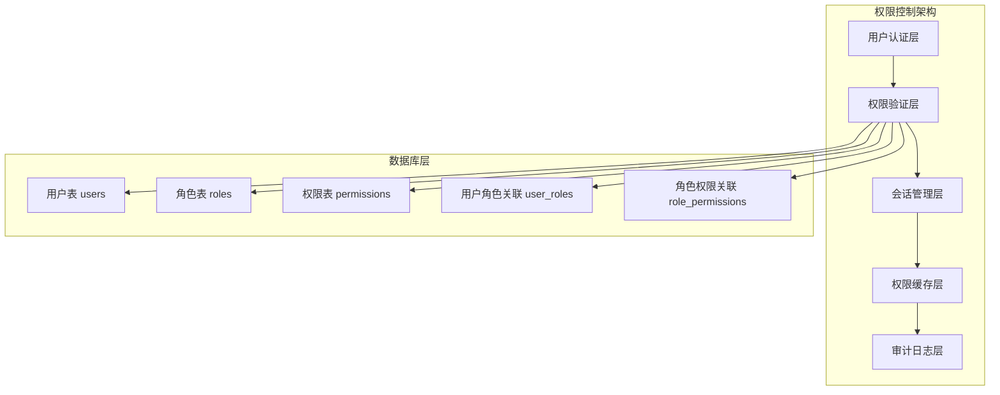

**图表来源**
- [企业网站CMS系统详细需求文档.md](file://企业网站CMS系统详细需求文档.md#L271-L282)

**章节来源**
- [企业网站CMS系统详细需求文档.md](file://企业网站CMS系统详细需求文档.md#L235-L293)

## 核心组件

### 用户(User)管理

用户是RBAC系统中最基本的实体，具有以下核心属性：
- 唯一标识符（ID）
- 用户名和邮箱（唯一约束）
- 密码哈希值
- 显示名称和头像
- 用户状态（正常/禁用）
- 创建和更新时间戳
- 最后登录时间

### 角色(Role)管理

角色代表用户在系统中的职责和权限集合：
- 唯一标识符（ID）
- 角色名称（唯一约束）
- 角色描述
- 创建时间戳

系统预定义了5个核心角色层次：
1. **超级管理员** - 拥有所有权限
2. **管理员** - 内容管理和用户管理权限
3. **编辑** - 内容编辑权限
4. **作者** - 内容创建权限
5. **访客** - 仅查看权限

### 权限(Permission)管理

权限定义了系统中可执行的操作：
- 唯一标识符（ID）
- 权限名称（唯一约束）
- 权限代码（唯一约束）
- 权限描述
- 所属模块

权限粒度分为三个层次：
- **模块级权限** - 页面管理、文章管理等
- **操作级权限** - 创建、读取、更新、删除
- **数据级权限** - 仅能操作自己的数据

**章节来源**
- [企业网站CMS系统详细需求文档.md](file://企业网站CMS系统详细需求文档.md#L237-L293)

## 架构总览

RBAC权限控制系统的整体架构采用分层设计，确保了系统的可扩展性和安全性：

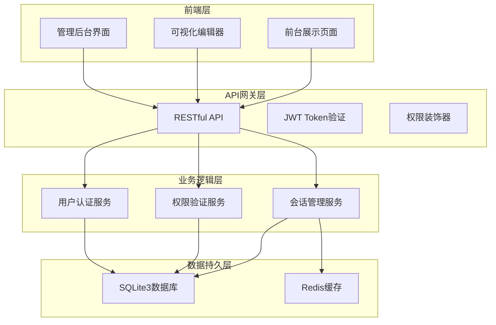

**图表来源**
- [企业网站CMS系统详细需求文档.md](file://企业网站CMS系统详细需求文档.md#L22-L57)

### Flask-Login与Flask-JWT-Extended集成

系统采用了双重认证机制：

1. **Flask-Login** - 用于传统的会话管理
   - 用户状态管理
   - 会话生命周期控制
   - 自动登出机制

2. **Flask-JWT-Extended** - 用于API认证
   - JWT Token生成和验证
   - Token刷新机制
   - API端点保护

**章节来源**
- [企业网站CMS系统详细需求文档.md](file://企业网站CMS系统详细需求文档.md#L1080-L1140)

## 详细组件分析

### 数据模型设计

RBAC系统采用标准的关系型数据库设计，确保数据一致性和完整性：

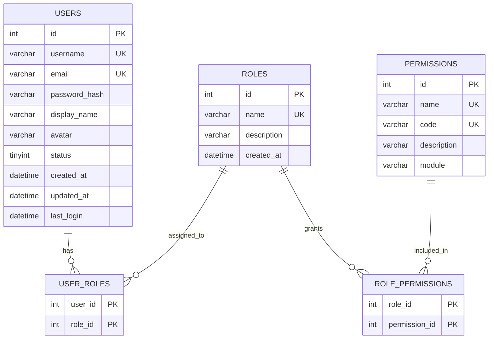

**图表来源**
- [企业网站CMS系统详细需求文档.md](file://企业网站CMS系统详细需求文档.md#L716-L768)

### 权限验证流程

系统实现了多层次的权限验证机制：

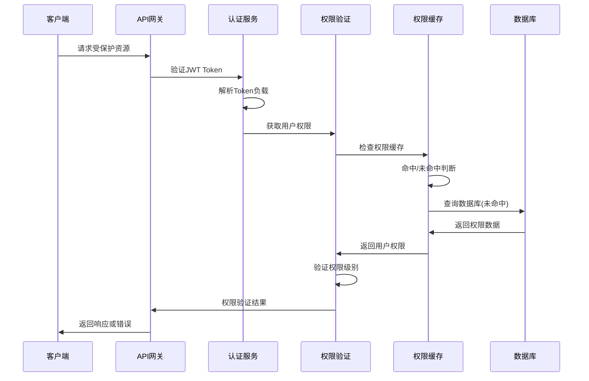

**图表来源**
- [企业网站CMS系统详细需求文档.md](file://企业网站CMS系统详细需求文档.md#L1080-L1140)

### 角色继承机制

系统支持角色的层次化继承，通过角色权限关联表实现：

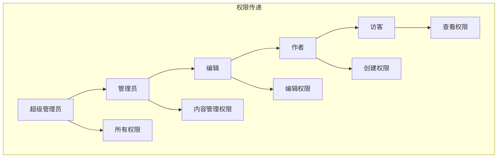

**图表来源**
- [企业网站CMS系统详细需求文档.md](file://企业网站CMS系统详细需求文档.md#L239-L265)

### 动态权限验证流程

系统实现了动态权限验证，支持实时权限变更：

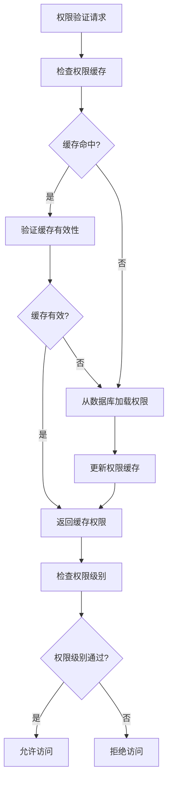

**图表来源**
- [企业网站CMS系统详细需求文档.md](file://企业网站CMS系统详细需求文档.md#L266-L270)

### 装饰器权限验证

系统提供了多种权限验证装饰器：

1. **@login_required** - 基础登录验证
2. **@roles_required** - 角色权限验证
3. **@permissions_required** - 权限码验证
4. **@fresh_login_required** - 新鲜登录验证

这些装饰器可以组合使用，实现复杂的权限控制逻辑。

**章节来源**
- [企业网站CMS系统详细需求文档.md](file://企业网站CMS系统详细需求文档.md#L1534-L1552)

### 蓝图级别的权限控制

系统采用Flask蓝图模式，每个蓝图可以独立配置权限控制：

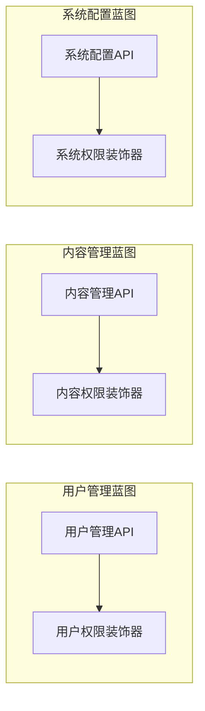

**图表来源**
- [企业网站CMS系统详细需求文档.md](file://企业网站CMS系统详细需求文档.md#L1013-L1076)

### API端点的细粒度权限管理

每个API端点都配置了相应的权限要求：

```mermaid
graph TD
subgraph "认证相关"
Login[POST /api/v1/auth/login]
Logout[POST /api/v1/auth/logout]
Register[POST /api/v1/auth/register]
end
subgraph "用户管理"
UsersList[GET /api/v1/users]
CreateUser[POST /api/v1/users]
UpdateUser[PUT /api/v1/users/:id]
DeleteUser[DELETE /api/v1/users/:id]
AssignRoles[PUT /api/v1/users/:id/roles]
end
subgraph "内容管理"
PostsList[GET /api/v1/posts]
CreatePost[POST /api/v1/posts]
UpdatePost[PUT /api/v1/posts/:id]
DeletePost[DELETE /api/v1/posts/:id]
end
Login --> Public[公共访问]
Logout --> Authenticated[认证用户]
Register --> Public
UsersList --> AdminOnly[管理员权限]
CreateUser --> AdminOnly
UpdateUser --> AdminOnly
DeleteUser --> AdminOnly
AssignRoles --> AdminOnly
PostsList --> Authenticated
CreatePost --> Authenticated
UpdatePost --> OwnerOnly[作者权限]
DeletePost --> OwnerOnly
```

**图表来源**
- [企业网站CMS系统详细需求文档.md](file://企业网站CMS系统详细需求文档.md#L1002-L1076)

**章节来源**
- [企业网站CMS系统详细需求文档.md](file://企业网站CMS系统详细需求文档.md#L1000-L1076)

## 依赖关系分析

RBAC权限控制系统依赖于多个Flask扩展和外部服务：

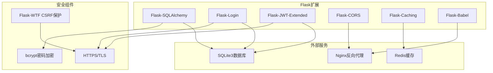

**图表来源**
- [企业网站CMS系统详细需求文档.md](file://企业网站CMS系统详细需求文档.md#L555-L594)

**章节来源**
- [企业网站CMS系统详细需求文档.md](file://企业网站CMS系统详细需求文档.md#L555-L594)

## 性能考虑

### 权限缓存策略

系统实现了多层次的权限缓存机制：

1. **Redis缓存层**
   - 用户权限缓存
   - 角色权限缓存
   - 权限变更通知

2. **内存缓存层**
   - 会话数据缓存
   - 频繁访问的权限数据

3. **数据库查询优化**
   - 合理的索引设计
   - 批量权限查询
   - 查询结果缓存

### 权限变更的实时生效机制

系统通过以下机制确保权限变更的实时生效：

1. **缓存失效策略**
   - 权限变更时主动清除相关缓存
   - 设置合理的缓存过期时间
   - 监控权限变更事件

2. **分布式缓存一致性**
   - Redis发布订阅机制
   - 缓存数据版本控制
   - 跨节点权限同步

### 性能监控和优化

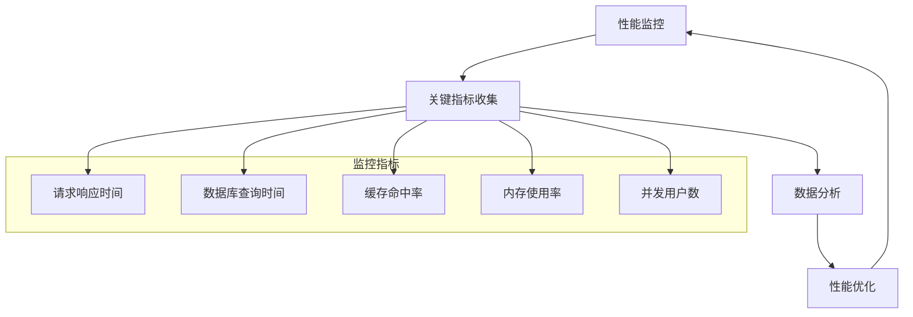

## 故障排除指南

### 常见权限问题

1. **权限验证失败**
   - 检查JWT Token是否过期
   - 验证用户状态是否正常
   - 确认权限缓存是否正确

2. **权限变更不生效**
   - 检查缓存是否正确失效
   - 验证数据库连接状态
   - 确认Redis服务可用性

3. **会话管理异常**
   - 检查Session存储配置
   - 验证Redis连接参数
   - 确认会话超时设置

### 审计日志实现

系统实现了完整的权限审计日志：

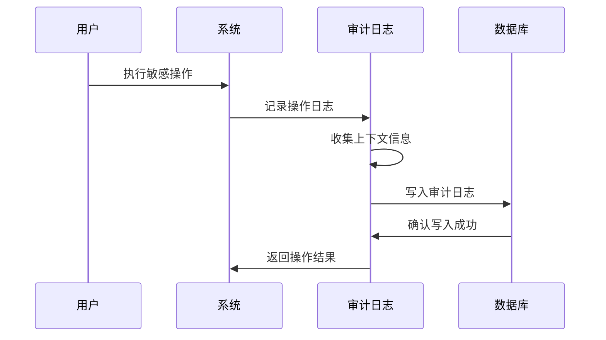

**图表来源**
- [企业网站CMS系统详细需求文档.md](file://企业网站CMS系统详细需求文档.md#L1391-L1396)

**章节来源**
- [企业网站CMS系统详细需求文档.md](file://企业网站CMS系统详细需求文档.md#L1391-L1401)

## 结论

RBAC权限控制系统为企业网站CMS提供了完整、安全、可扩展的权限管理解决方案。系统采用现代化的技术架构，结合Flask框架的强大功能，实现了灵活的角色管理、细粒度的权限控制和高效的性能表现。

通过合理的数据模型设计、完善的缓存策略和实时的权限变更机制，系统能够满足企业级应用的安全需求。同时，清晰的架构设计和模块化的组件实现，为后续的功能扩展和性能优化奠定了良好的基础。

该权限控制系统不仅满足了当前的功能需求，还为未来的业务发展预留了充足的扩展空间，是企业网站内容管理的理想选择。