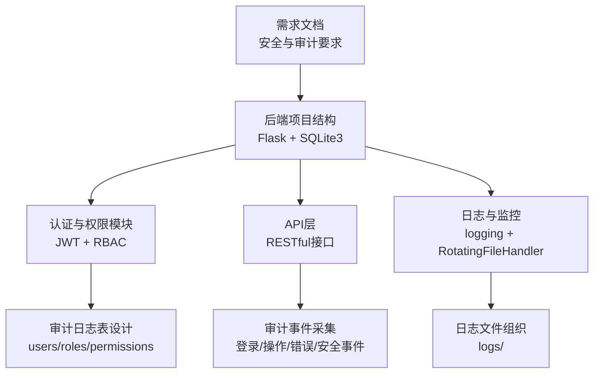
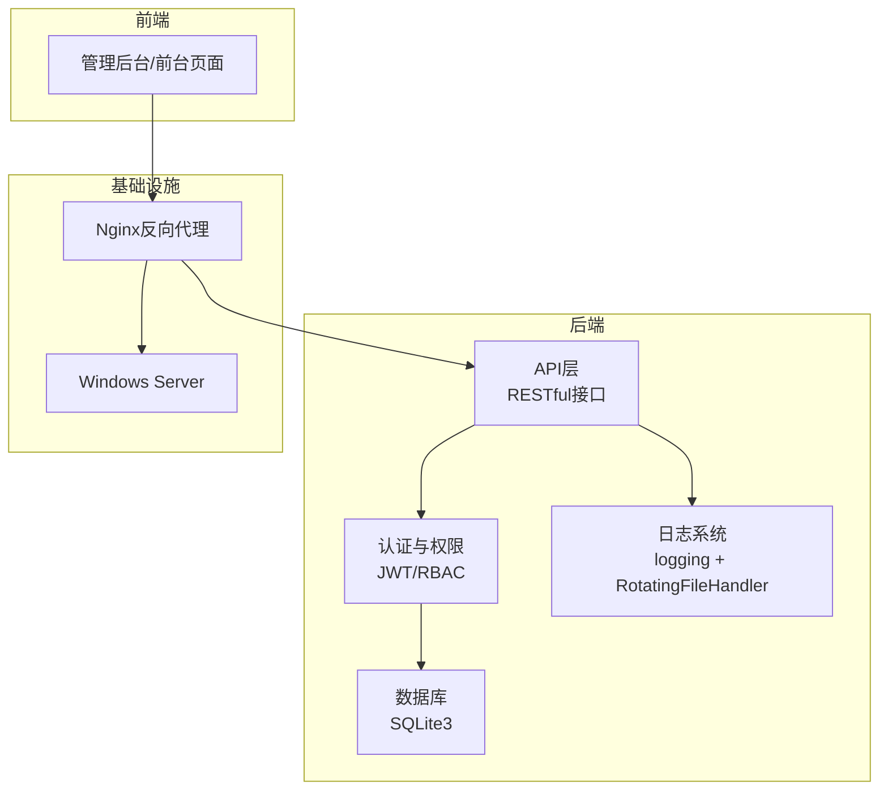
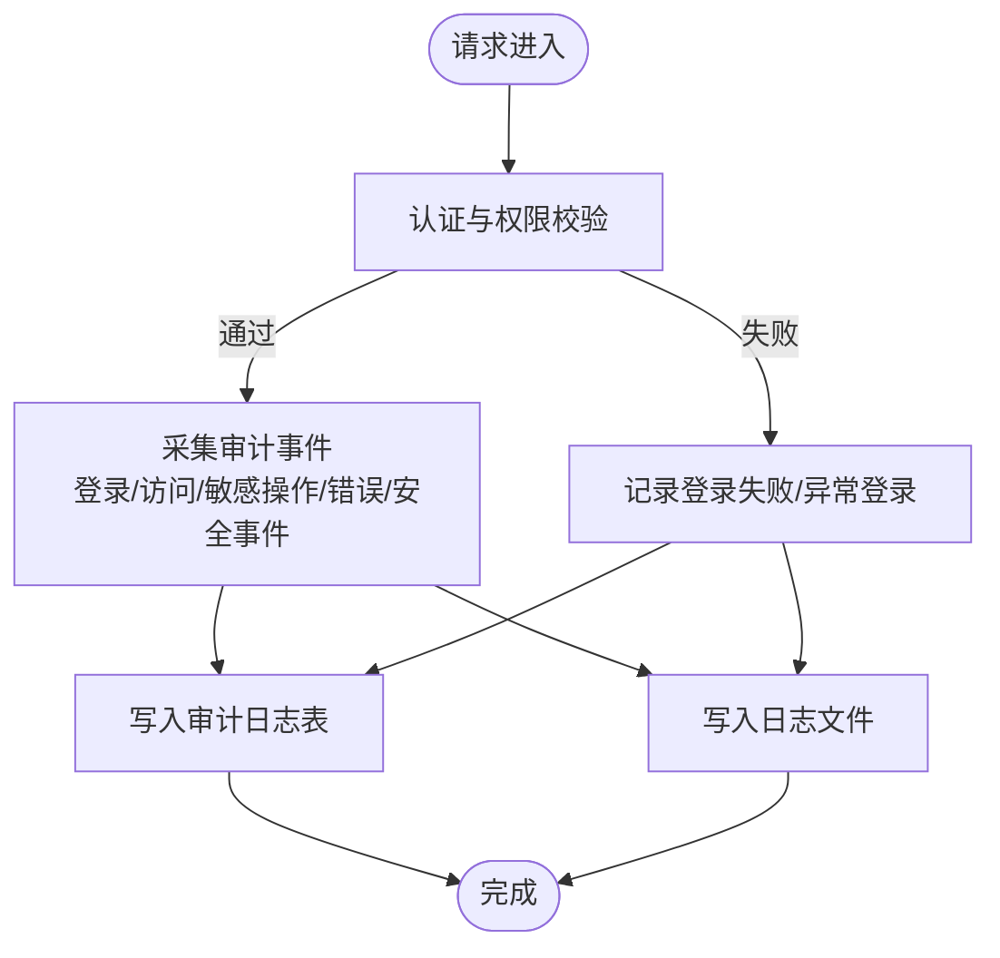
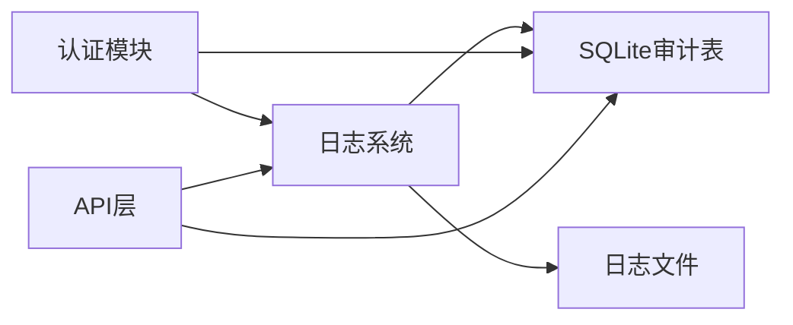

# 安全审计

<cite>
**本文引用的文件**
- [企业网站CMS系统详细需求文档.md](file://企业网站CMS系统详细需求文档.md)
- [开发计划表_2月4日-2月12日.md](file://开发计划表_2月4日-2月12日.md)
</cite>

## 目录
1. [简介](#简介)
2. [项目结构](#项目结构)
3. [核心组件](#核心组件)
4. [架构总览](#架构总览)
5. [详细组件分析](#详细组件分析)
6. [依赖分析](#依赖分析)
7. [性能考量](#性能考量)
8. [故障排查指南](#故障排查指南)
9. [结论](#结论)
10. [附录](#附录)

## 简介
本文件面向“权限控制安全审计系统”的综合文档，结合仓库中的需求文档与开发计划，系统化阐述权限审计日志的设计与实现思路，覆盖用户登录日志、权限访问日志、敏感操作日志的记录格式与存储策略；并提出权限变更审计、异常权限访问检测与权限滥用预警机制的落地建议；同时给出审计数据的查询统计、报表生成与导出能力的规划，以及审计日志的安全存储、定期清理与备份策略，并包含权限安全监控仪表板、实时告警机制与合规性报告生成的建议方案。

## 项目结构
- 本仓库包含两份关键文档：
  - 企业网站CMS系统详细需求文档：明确了系统架构、安全设计、审计日志要求与备份策略等。
  - 开发计划表_2月4日-2月12日：给出了后端项目结构、API接口、日志与部署相关内容的阶段性安排。

**章节来源**
- file://企业网站CMS系统详细需求文档.md#L28-L57
- file://开发计划表_2月4日-2月12日.md#L92-L105

## 核心组件
- 权限与认证子系统：基于Flask-Security/Flask-Principal的RBAC模型，装饰器方式的权限验证，JWT Token机制。
- 审计日志子系统：用户登录日志、操作审计日志、错误日志、安全事件日志。
- 存储与备份：SQLite3数据库文件集中存放，日志文件按天轮转，备份策略按日全量与增量结合。
- 监控与告警：服务状态、性能指标、错误率、磁盘空间监控，邮件/短信告警。

**章节来源**
- file://企业网站CMS系统详细需求文档.md#L1078-L1127
- file://企业网站CMS系统详细需求文档.md#L1391-L1395
- file://企业网站CMS系统详细需求文档.md#L1406-L1415
- file://开发计划表_2月4日-2月12日.md#L92-L105

## 架构总览
整体系统采用前后端分离架构，后端提供RESTful API，前端通过JWT进行认证与鉴权。审计日志贯穿认证、业务操作与系统运行全过程，统一由后端日志系统与数据库表承载。

**图示来源**
- [企业网站CMS系统详细需求文档.md](file://企业网站CMS系统详细需求文档.md#L28-L57)
- [开发计划表_2月4日-2月12日.md](file://开发计划表_2月4日-2月12日.md#L441-L500)

**章节来源**
- file://企业网站CMS系统详细需求文档.md#L28-L57
- file://开发计划表_2月4日-2月12日.md#L441-L500

## 详细组件分析

### 审计日志设计与实现
- 记录类型
  - 用户登录日志：记录登录时间、IP、UA、结果（成功/失败）、失败次数、锁定状态等。
  - 权限访问日志：记录受保护接口访问、用户身份、资源标识、操作动作、结果、耗时等。
  - 敏感操作日志：记录高危操作（如用户管理、权限分配、备份恢复、系统配置变更）的时间、操作者、目标对象、变更前后值。
  - 错误日志：记录异常堆栈、错误码、请求上下文、用户标识等。
  - 安全事件日志：记录异常登录（IP/设备变化）、暴力破解、越权尝试、异常行为等。
- 记录格式
  - 结构化JSON：包含时间戳、请求ID、用户ID、IP、UA、资源、动作、结果、耗时、上下文等字段。
  - 便于入库与检索，支持全文/条件查询与聚合统计。
- 存储策略
  - 日志文件：使用logging模块与RotatingFileHandler按天轮转，保留N天。
  - 审计事件表：在SQLite中新增审计日志表，字段包含事件类型、用户、资源、动作、结果、时间、上下文等。
  - 备份：每日全量备份数据库文件，保留30天；日志文件按天归档至备份目录。

**章节来源**
- file://企业网站CMS系统详细需求文档.md#L1391-L1395
- file://企业网站CMS系统详细需求文档.md#L655-L658
- file://开发计划表_2月4日-2月12日.md#L441-L500

### 权限变更审计
- 变更范围：用户角色分配/回收、权限分配/回收、系统配置变更、备份/恢复等。
- 变更记录：操作者、目标对象、变更前/后值、变更原因（可选）、审批信息（可选）、时间戳。
- 变更回溯：支持按时间、用户、对象维度查询与对比，支持导出。

**章节来源**
- file://企业网站CMS系统详细需求文档.md#L237-L292

### 异常权限访问检测与滥用预警
- 异常行为识别
  - 高频访问同一接口或资源：触发阈值报警。
  - 跨设备/跨IP异常登录：结合Redis会话与IP/UA比对。
  - 越权访问尝试：记录并标记高危行为。
  - 敏感操作集中执行：如短时间内大量用户/权限变更。
- 预警机制
  - 实时告警：通过邮件/短信推送。
  - 审计仪表板：展示异常趋势、热点资源、高危用户等。
  - 自动处置：可选封禁、二次验证、临时降权等。

**章节来源**
- file://企业网站CMS系统详细需求文档.md#L1094-L1097
- file://企业网站CMS系统详细需求文档.md#L1130-L1134

### 审计数据查询、统计、报表与导出
- 查询统计
  - 时间范围、用户、资源、动作、结果等多维过滤。
  - 聚合统计：访问量、失败率、平均耗时、Top资源/用户等。
- 报表生成
  - 日报/周报/月报：访问趋势、异常事件分布、高危行为统计。
  - 合规报告：满足审计要求的固定格式报告。
- 导出能力
  - CSV/Excel导出，支持分页与筛选条件导出。

**章节来源**
- file://企业网站CMS系统详细需求文档.md#L1417-L1422

### 安全存储、定期清理与备份
- 安全存储
  - 日志文件与数据库文件采用最小权限访问控制。
  - 日志内容避免明文存储敏感信息，必要时脱敏或加密。
- 定期清理
  - 日志文件按天轮转，保留N天；审计事件表按策略清理旧数据。
- 备份策略
  - 数据库文件每日全量备份，保留30天；日志文件归档至备份目录。
  - 异地备份：云存储或异地服务器。

**章节来源**
- file://企业网站CMS系统详细需求文档.md#L1406-L1415
- file://开发计划表_2月4日-2月12日.md#L441-L500

### 权限安全监控仪表板与实时告警
- 仪表板
  - 实时访问量、错误率、异常登录、越权尝试、敏感操作趋势。
  - 用户活跃度、资源热度、高危操作统计。
- 实时告警
  - 阈值触发：失败率、异常登录、越权尝试、高频访问等。
  - 通知渠道：邮件、短信、IM群组等。

**章节来源**
- file://企业网站CMS系统详细需求文档.md#L1417-L1422

### 合规性报告生成
- 报告内容
  - 审计期间内的登录、访问、敏感操作、异常事件汇总。
  - 高危事件与处置记录。
  - 合规性指标与趋势分析。
- 生成与归档
  - 定期生成并归档，支持导出PDF/Word。

**章节来源**
- file://企业网站CMS系统详细需求文档.md#L1417-L1422

## 依赖分析
- 技术栈与组件耦合
  - Flask-SQLAlchemy：ORM与数据库交互。
  - Flask-Login/Flask-WTF：认证与表单校验。
  - Flask-Limiter：API限流。
  - logging + RotatingFileHandler：日志轮转。
  - Redis：可选会话与缓存。
- 审计日志与业务耦合
  - 审计事件采集与业务接口解耦，通过中间件/装饰器统一采集。
  - 审计数据与业务数据分离，避免审计写入影响业务性能。

**图示来源**
- [开发计划表_2月4日-2月12日.md](file://开发计划表_2月4日-2月12日.md#L92-L105)
- [企业网站CMS系统详细需求文档.md](file://企业网站CMS系统详细需求文档.md#L1078-L1127)

**章节来源**
- file://开发计划表_2月4日-2月12日.md#L92-L105
- file://企业网站CMS系统详细需求文档.md#L1078-L1127

## 性能考量
- 审计写入异步化：将审计事件写入队列或异步任务，避免阻塞主业务。
- 日志级别与采样：对高频接口进行采样记录，降低写入压力。
- 索引与分区：审计表按时间分区或建立索引，提高查询性能。
- 存储容量：合理设置日志轮转与保留策略，避免磁盘占满。

## 故障排查指南
- 审计日志缺失
  - 检查日志配置与轮转策略是否生效。
  - 确认审计事件采集中间件/装饰器是否正确挂载。
- 审计数据不一致
  - 对比数据库审计表与日志文件，核对时间戳与上下文。
- 性能下降
  - 分析审计写入峰值，评估异步化与采样策略。
- 备份异常
  - 校验备份脚本与存储路径，确认备份完整性与可恢复性。

**章节来源**
- file://开发计划表_2月4日-2月12日.md#L441-L500
- file://企业网站CMS系统详细需求文档.md#L1406-L1415

## 结论
本项目在需求文档中明确了安全与审计的基本要求，开发计划中给出了后端项目结构与日志配置的安排。围绕这些基础，本文提出了权限审计日志的记录格式与存储策略、权限变更审计与异常行为检测、审计数据的查询统计与报表导出、安全存储与备份策略，以及监控仪表板与实时告警的建议方案。建议在后续迭代中逐步完善审计表结构、事件采集中间件与可视化报表，持续提升系统的安全可观测性与合规能力。

## 附录
- 术语
  - RBAC：基于角色的访问控制
  - JWT：JSON Web Token
  - API限流：Flask-Limiter
  - 日志轮转：RotatingFileHandler