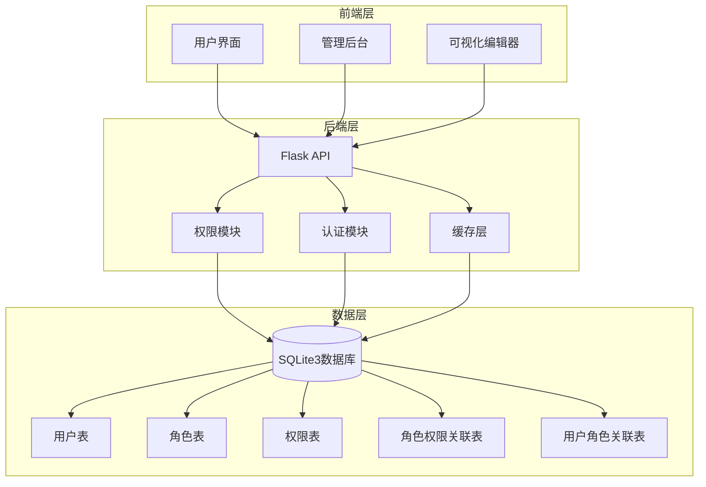
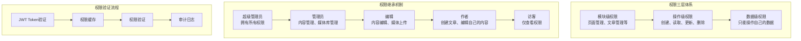
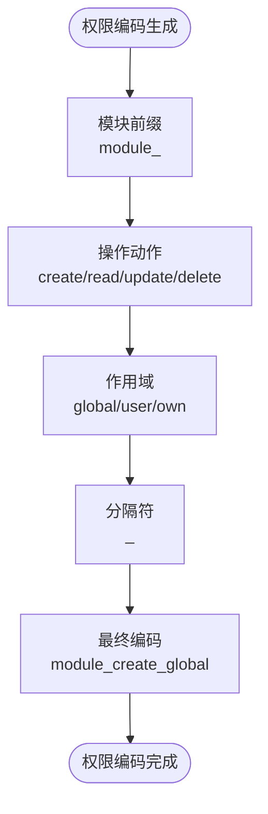
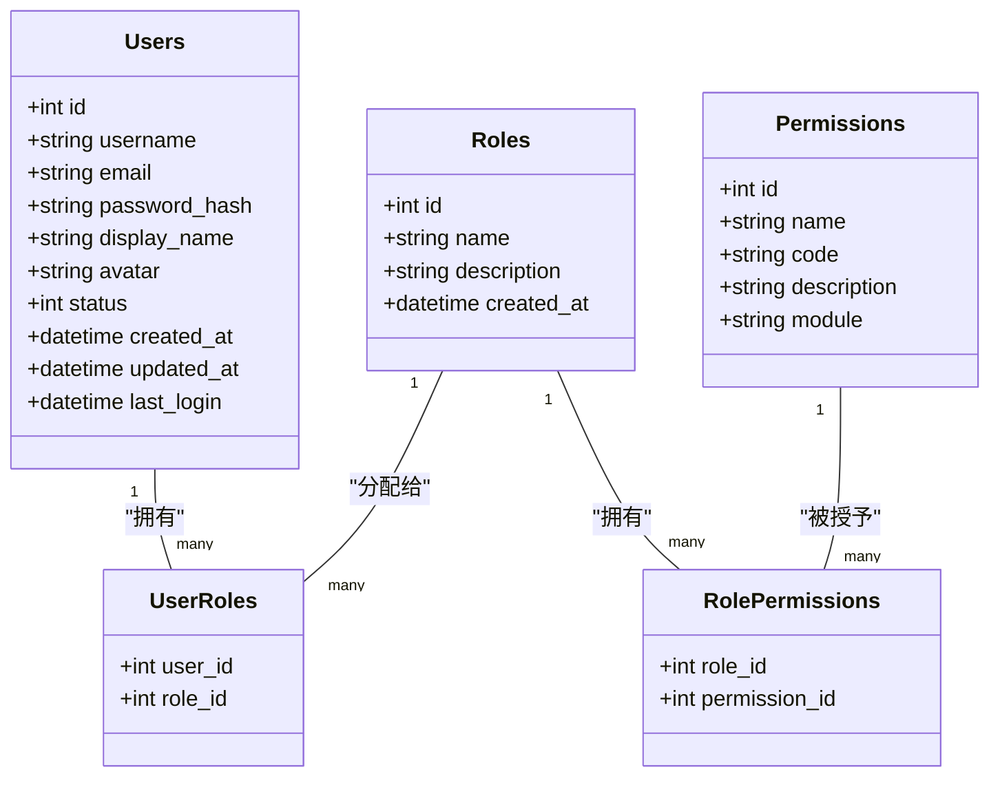
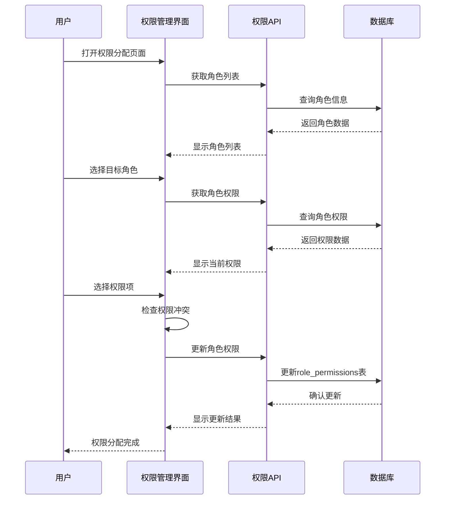
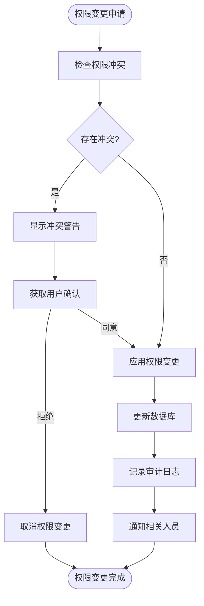
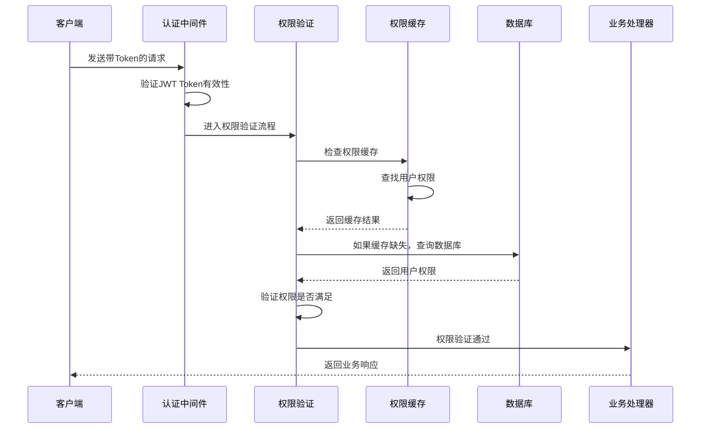
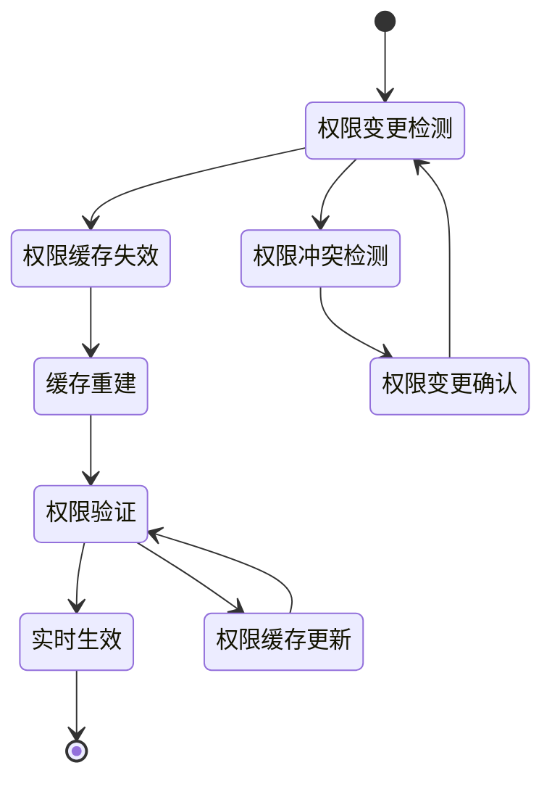
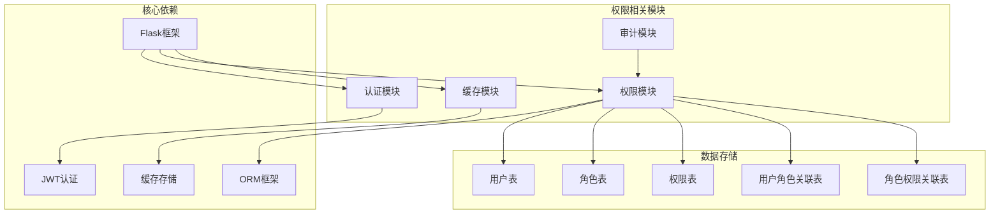

# 权限分配

<cite>
**本文档引用的文件**
- [企业网站CMS系统详细需求文档.md](file://企业网站CMS系统详细需求文档.md)
- [企业网站CMS系统开发需求文档.ini](file://企业网站CMS系统开发需求文档.ini)
- [开发计划表_2月4日-2月12日.md](file://开发计划表_2月4日-2月12日.md)
</cite>

## 目录
1. [简介](#简介)
2. [项目结构](#项目结构)
3. [核心组件](#核心组件)
4. [架构总览](#架构总览)
5. [详细组件分析](#详细组件分析)
6. [依赖关系分析](#依赖关系分析)
7. [性能考虑](#性能考虑)
8. [故障排除指南](#故障排除指南)
9. [结论](#结论)
10. [附录](#附录)

## 简介
本文件针对企业网站CMS系统的权限分配系统进行全面的技术文档说明。该系统采用基于角色的访问控制（RBAC）模型，通过三层权限体系实现精细化的权限管理，包括模块级权限、操作级权限和数据级权限。系统支持权限与角色的关联关系，通过role_permissions表实现权限继承机制，并提供权限分配界面、批量权限管理、权限冲突检测等功能。

## 项目结构
CMS系统采用前后端分离架构，后端基于Flask框架，数据库使用SQLite3，权限管理作为核心功能模块集成在整个系统中。

**图表来源**
- [企业网站CMS系统详细需求文档.md](file://企业网站CMS系统详细需求文档.md#L22-L57)
- [企业网站CMS系统详细需求文档.md](file://企业网站CMS系统详细需求文档.md#L716-L767)

**章节来源**
- [企业网站CMS系统详细需求文档.md](file://企业网站CMS系统详细需求文档.md#L22-L57)
- [开发计划表_2月4日-2月12日.md](file://开发计划表_2月4日-2月12日.md#L92-L105)

## 核心组件
权限分配系统的核心组件包括用户管理、角色管理、权限管理三个主要模块，以及它们之间的关联关系。

### 用户管理模块
- **用户表(users)**：存储用户基本信息，包括用户名、邮箱、密码哈希、显示名称、头像、状态等字段
- **用户状态管理**：支持正常、禁用状态，通过状态字段控制用户访问权限
- **用户认证**：基于JWT Token的认证机制，支持Token刷新和自动续期

### 角色管理模块
- **角色表(roles)**：定义系统中的角色类型，包括超级管理员、管理员、编辑、作者、访客等
- **角色继承**：通过role_permissions表实现角色间的权限继承关系
- **角色分配**：通过user_roles表将用户与角色建立关联

### 权限管理模块
- **权限表(permissions)**：定义具体的权限项，包括权限名称、编码、描述和所属模块
- **权限分类**：支持模块级、操作级、数据级三种权限粒度
- **权限验证**：通过装饰器方式实现权限验证，确保API访问的安全性

**章节来源**
- [企业网站CMS系统详细需求文档.md](file://企业网站CMS系统详细需求文档.md#L237-L293)
- [企业网站CMS系统详细需求文档.md](file://企业网站CMS系统详细需求文档.md#L716-L767)

## 架构总览
权限分配系统采用RBAC（基于角色的访问控制）模型，通过三层权限体系实现精细化的权限管理。

**图表来源**
- [企业网站CMS系统详细需求文档.md](file://企业网站CMS系统详细需求文档.md#L266-L282)
- [企业网站CMS系统详细需求文档.md](file://企业网站CMS系统详细需求文档.md#L1080-L1140)

## 详细组件分析

### 权限定义与分类
系统采用三层权限体系，每层权限都有明确的定义和应用场景：

#### 模块级权限
- **定义**：对整个功能模块的访问控制
- **示例**：页面管理、文章管理、媒体库管理、用户管理等
- **特点**：最粗粒度的权限控制，通常用于控制用户能否访问某个功能模块

#### 操作级权限
- **定义**：对具体操作的访问控制
- **示例**：创建、读取、更新、删除、批量操作等
- **特点**：中等粒度的权限控制，用于精确控制用户在模块内的操作能力

#### 数据级权限
- **定义**：对特定数据的访问控制
- **示例**：只能操作自己的文章、只能编辑自己创建的数据等
- **特点**：最细粒度的权限控制，确保用户只能访问和操作符合其权限的数据

### 权限编码规则
权限编码采用统一的命名规范，确保权限标识的一致性和可读性：

**图表来源**
- [企业网站CMS系统详细需求文档.md](file://企业网站CMS系统详细需求文档.md#L752-L758)

### 角色与权限关联关系
系统通过role_permissions表实现角色与权限的关联关系，支持权限继承机制：

**图表来源**
- [企业网站CMS系统详细需求文档.md](file://企业网站CMS系统详细需求文档.md#L716-L767)

### 权限分配界面设计
权限分配界面采用直观的树形结构展示权限层次，支持批量权限分配和权限冲突检测：

**图表来源**
- [企业网站CMS系统详细需求文档.md](file://企业网站CMS系统详细需求文档.md#L1020-L1021)

### 批量权限管理
系统支持批量权限分配和管理，提高权限管理效率：

- **批量分配**：支持一次性为多个角色分配相同的权限
- **批量移除**：支持批量移除角色的某些权限
- **权限模板**：支持创建权限模板，便于快速应用到多个角色
- **权限继承**：子角色自动继承父角色的权限

### 权限冲突检测
系统内置权限冲突检测机制，防止权限配置错误：

**图表来源**
- [企业网站CMS系统详细需求文档.md](file://企业网站CMS系统详细需求文档.md#L284-L293)

### 权限验证流程
权限验证采用动态验证机制，确保每次请求都经过严格的权限检查：

**图表来源**
- [企业网站CMS系统详细需求文档.md](file://企业网站CMS系统详细需求文档.md#L1080-L1140)

### 权限缓存策略
系统采用多层缓存策略，提高权限验证的性能：

- **Redis缓存**：使用Redis存储用户权限信息，支持分布式部署
- **内存缓存**：在应用内存中缓存热点权限数据
- **缓存失效**：权限变更时自动失效相关缓存
- **缓存预热**：系统启动时预加载常用权限数据

### 权限变更实时生效机制
系统通过事件驱动的方式实现权限变更的实时生效：

**图表来源**
- [企业网站CMS系统详细需求文档.md](file://企业网站CMS系统详细需求文档.md#L1141-L1356)

### 权限审计日志
系统提供完整的权限审计功能，记录所有权限相关的操作：

- **操作日志**：记录用户的所有权限操作
- **登录日志**：记录用户的登录和登出行为
- **权限变更日志**：记录权限的分配、回收、修改等操作
- **异常日志**：记录权限验证失败等异常情况
- **审计报表**：生成权限使用统计和分析报表

### 权限使用统计
系统提供权限使用统计功能，帮助管理员了解权限使用情况：

- **权限使用频率**：统计各权限的使用次数和使用时间
- **用户权限分布**：分析用户权限的分布情况
- **权限效果评估**：评估权限设置的效果和合理性
- **趋势分析**：分析权限使用的变化趋势

### 权限优化建议
基于系统的设计和实现，提出以下优化建议：

- **权限分级管理**：根据用户角色的重要程度设置不同的权限级别
- **最小权限原则**：遵循最小权限原则，只授予用户完成工作所需的最少权限
- **定期权限审查**：定期审查和清理不再使用的权限
- **权限模板标准化**：建立标准的权限模板，减少权限配置的工作量
- **权限监控告警**：建立权限使用的监控和告警机制

**章节来源**
- [企业网站CMS系统详细需求文档.md](file://企业网站CMS系统详细需求文档.md#L237-L293)
- [企业网站CMS系统详细需求文档.md](file://企业网站CMS系统详细需求文档.md#L716-L767)
- [企业网站CMS系统详细需求文档.md](file://企业网站CMS系统详细需求文档.md#L1080-L1140)

## 依赖关系分析
权限分配系统与其他系统组件的依赖关系如下：

**图表来源**
- [企业网站CMS系统详细需求文档.md](file://企业网站CMS系统详细需求文档.md#L555-L594)
- [企业网站CMS系统详细需求文档.md](file://企业网站CMS系统详细需求文档.md#L716-L767)

**章节来源**
- [企业网站CMS系统详细需求文档.md](file://企业网站CMS系统详细需求文档.md#L555-L594)
- [企业网站CMS系统详细需求文档.md](file://企业网站CMS系统详细需求文档.md#L716-L767)

## 性能考虑
权限分配系统在设计时充分考虑了性能优化：

- **数据库优化**：为用户表、角色表、权限表建立适当的索引，优化查询性能
- **缓存策略**：使用Redis缓存用户权限信息，减少数据库查询压力
- **批量操作**：支持批量权限分配和查询，提高权限管理效率
- **异步处理**：权限变更采用异步处理方式，避免阻塞主线程
- **连接池**：使用数据库连接池，提高数据库访问效率

## 故障排除指南
权限分配系统可能遇到的常见问题及解决方法：

### 权限验证失败
**问题现象**：用户登录后无法访问某些功能
**可能原因**：
- 用户权限配置错误
- 权限缓存未更新
- JWT Token过期

**解决方法**：
1. 检查用户的角色分配是否正确
2. 清除权限缓存并重新加载
3. 重新生成JWT Token

### 权限冲突
**问题现象**：权限分配时出现冲突警告
**可能原因**：
- 新权限与现有权限相互冲突
- 权限继承导致的权限冲突

**解决方法**：
1. 仔细检查冲突的权限组合
2. 调整权限配置或角色关系
3. 使用权限模板进行批量配置

### 性能问题
**问题现象**：权限验证响应缓慢
**可能原因**：
- 数据库查询性能不足
- 缓存配置不当
- 权限数据量过大

**解决方法**：
1. 优化数据库索引和查询
2. 调整缓存配置和容量
3. 对权限数据进行分片处理

**章节来源**
- [企业网站CMS系统详细需求文档.md](file://企业网站CMS系统详细需求文档.md#L1381-L1422)

## 结论
企业网站CMS系统的权限分配系统采用先进的RBAC模型，通过三层权限体系实现了精细化的权限管理。系统支持权限与角色的关联关系，通过role_permissions表实现权限继承机制，并提供权限分配界面、批量权限管理、权限冲突检测等功能。通过合理的缓存策略和实时生效机制，系统能够在保证安全性的同时提供良好的用户体验。建议在实际部署中根据具体业务需求调整权限配置，并建立完善的权限管理制度。

## 附录

### 数据库表结构
系统采用标准的关系型数据库设计，包含以下核心表：

- **users**：用户基本信息表
- **roles**：角色定义表  
- **permissions**：权限定义表
- **user_roles**：用户角色关联表
- **role_permissions**：角色权限关联表

### API接口规范
系统提供RESTful API接口，支持权限相关的CRUD操作：

- **用户权限管理**：GET/POST/PUT/DELETE /api/v1/users/:id/roles
- **权限查询**：GET /api/v1/permissions
- **角色权限管理**：GET/POST/DELETE /api/v1/roles/:id/permissions

### 安全配置
系统采用多层次的安全防护措施：

- **JWT Token认证**：基于JWT的无状态认证机制
- **权限验证**：装饰器方式的权限验证
- **SQL注入防护**：使用ORM参数化查询
- **XSS防护**：输入过滤和输出转义
- **CSRF防护**：Flask-WTF CSRF Token

**章节来源**
- [企业网站CMS系统详细需求文档.md](file://企业网站CMS系统详细需求文档.md#L716-L767)
- [企业网站CMS系统详细需求文档.md](file://企业网站CMS系统详细需求文档.md#L940-L1076)
- [企业网站CMS系统详细需求文档.md](file://企业网站CMS系统详细需求文档.md#L1078-L1140)