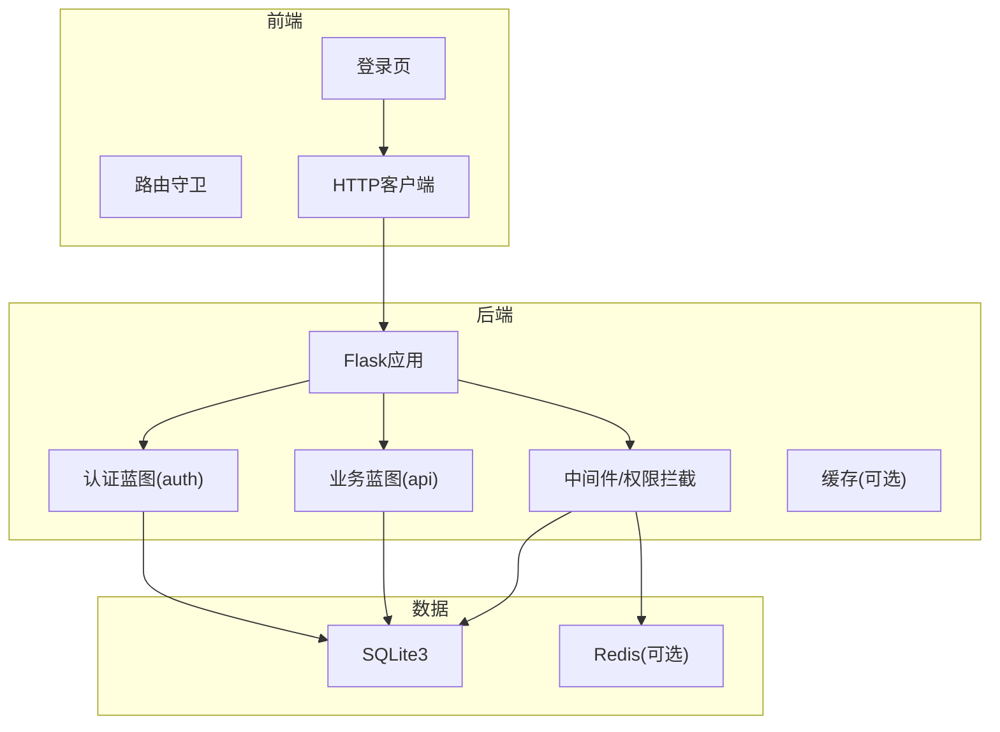
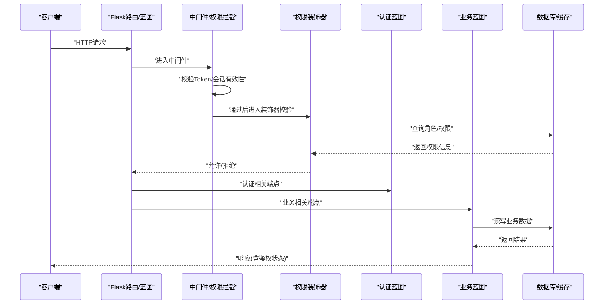
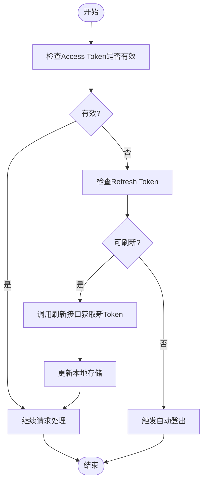
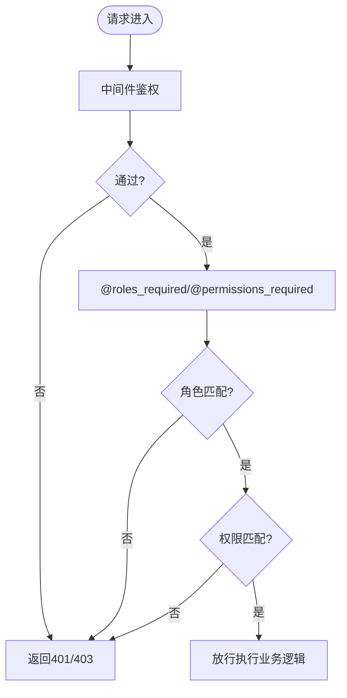
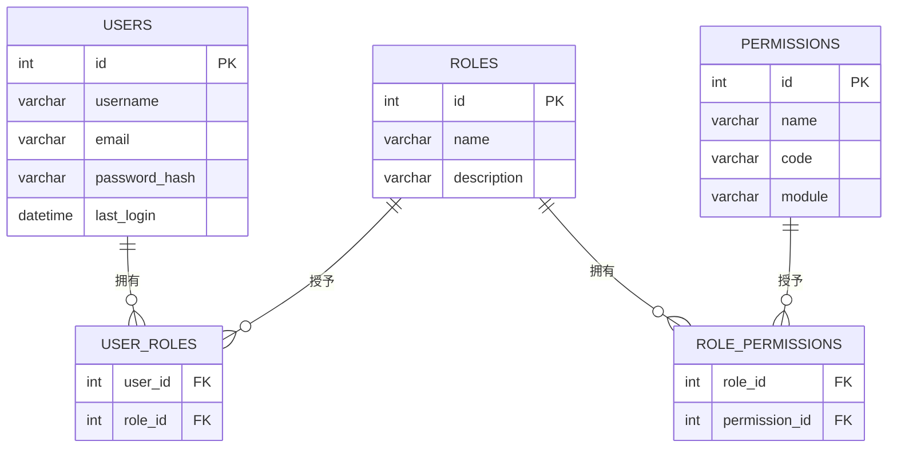

# 权限验证

<cite>
**本文引用的文件**
- [企业网站CMS系统开发需求文档.ini](file://企业网站CMS系统开发需求文档.ini)
- [企业网站CMS系统详细需求文档.md](file://企业网站CMS系统详细需求文档.md)
- [开发计划表_2月4日-2月12日.md](file://开发计划表_2月4日-2月12日.md)
</cite>

## 目录
1. [简介](#简介)
2. [项目结构](#项目结构)
3. [核心组件](#核心组件)
4. [架构总览](#架构总览)
5. [组件详解](#组件详解)
6. [依赖关系分析](#依赖关系分析)
7. [性能考量](#性能考量)
8. [故障排查指南](#故障排查指南)
9. [结论](#结论)
10. [附录](#附录)

## 简介
本文件围绕企业网站CMS系统的权限验证机制进行系统化说明，重点覆盖用户状态管理、会话与令牌处理、自动登出、装饰器权限校验（如@roles_required、@permissions_required）、蓝图级权限控制、API端点细粒度权限管理以及中间件拦截机制。同时给出性能优化策略、缓存与错误处理流程，并提供调试方法、常见问题排查与安全最佳实践，帮助开发者在Flask生态下构建稳定、可维护且安全的权限体系。

## 项目结构
- 后端采用Flask应用，按蓝图划分功能域（认证、API、工具等），便于权限控制的模块化落地。
- 前端通过RESTful API与后端交互，路由层配合鉴权守卫实现前端侧的权限拦截。
- 数据层采用SQLite3（默认）或Redis（可选）支撑用户、角色、权限及会话/缓存。

**章节来源**
- file://开发计划表_2月4日-2月12日.md#L92-L105
- file://开发计划表_2月4日-2月12日.md#L137-L184
- file://企业网站CMS系统详细需求文档.md#L555-L594

## 核心组件
- 用户与角色权限模型：users、roles、permissions、user_roles、role_permissions等表，支撑RBAC模型。
- 认证与会话：JWT Token（访问/刷新）+ 可选Redis会话存储；支持单点/多点登录与异常登录检测。
- 权限装饰器：@roles_required、@permissions_required等，用于蓝图与函数级权限控制。
- 中间件与拦截：全局/蓝图级中间件统一执行权限校验与自动登出。
- API端点：RESTful接口统一返回格式，结合状态码表达鉴权与授权结果。
- 缓存与性能：页面缓存、数据缓存、静态资源缓存；登录态用户不参与页面缓存。

**章节来源**
- file://企业网站CMS系统详细需求文档.md#L271-L282
- file://企业网站CMS系统详细需求文档.md#L1080-L1140
- file://企业网站CMS系统详细需求文档.md#L514-L548
- file://开发计划表_2月4日-2月12日.md#L142-L157

## 架构总览
下图展示从请求进入后端到权限校验、业务处理与响应返回的整体流程，突出中间件拦截、装饰器校验与会话/令牌处理的关键节点。

**图表来源**
- [企业网站CMS系统详细需求文档.md](file://企业网站CMS系统详细需求文档.md#L1002-L1076)
- [开发计划表_2月4日-2月12日.md](file://开发计划表_2月4日-2月12日.md#L142-L157)

**章节来源**
- file://企业网站CMS系统详细需求文档.md#L940-L998
- file://开发计划表_2月4日-2月12日.md#L137-L184

## 组件详解

### 用户状态管理与会话处理
- 令牌机制：Access Token（短期有效）与Refresh Token（长期有效），通过认证接口发放与刷新。
- 会话存储：可选Redis存储Session，支持单点/多点登录策略与异常登录检测（IP/设备变更）。
- 登录失败锁定：连续多次失败触发临时锁定，降低暴力破解风险。
- 前端存储：Token通常存储于LocalStorage/Cookie，结合路由守卫实现自动登录态维持与刷新。

**章节来源**
- file://企业网站CMS系统详细需求文档.md#L1082-L1097
- file://开发计划表_2月4日-2月12日.md#L142-L157

### 自动登出机制
- 会话失效：当Refresh Token过期或被撤销，前端路由守卫拦截未授权请求并引导至登录页。
- 异常检测：检测到异常登录（IP/设备变化）时，强制当前会话失效并提示重新登录。
- 服务端清理：服务端在必要时主动清理Redis中的会话记录，确保安全。

**章节来源**
- file://企业网站CMS系统详细需求文档.md#L1094-L1097
- file://开发计划表_2月4日-2月12日.md#L293-L323

### 装饰器权限验证实现原理
- @roles_required：校验用户是否具备指定角色集合，常用于管理后台的模块级访问控制。
- @permissions_required：校验用户是否具备指定权限编码，常用于API端点的细粒度控制。
- 执行顺序：中间件先做基础鉴权（Token/会话），再由装饰器做角色/权限校验；两者结合保证安全边界。

**章节来源**
- file://企业网站CMS系统详细需求文档.md#L271-L274
- file://开发计划表_2月4日-2月12日.md#L142-L148

### 蓝图级别的权限控制
- 认证蓝图（auth）：集中处理登录、登出、注册、刷新等认证相关端点，统一返回格式与状态码。
- 业务蓝图（api）：各功能域（文章、页面、媒体、系统配置）在蓝图内部通过装饰器实现模块级权限控制。
- 蓝图级中间件：可对特定蓝图设置统一的权限拦截策略，减少重复代码。

**章节来源**
- file://开发计划表_2月4日-2月12日.md#L92-L105
- file://开发计划表_2月4日-2月12日.md#L160-L184

### API端点的细粒度权限管理
- 统一响应格式：包含code、message、data、meta，便于前端识别鉴权与授权状态。
- HTTP状态码：200/201/204表示成功，400/401/403/404/500分别对应参数错误、未认证、无权限、资源不存在、服务器错误。
- 权限映射：每个API端点绑定权限编码，结合@permissions_required进行校验；角色继承关系由user_roles与role_permissions决定。

**章节来源**
- file://企业网站CMS系统详细需求文档.md#L940-L998
- file://企业网站CMS系统详细需求文档.md#L1000-L1076

### 中间件权限拦截机制
- 全局中间件：在请求进入路由之前统一执行鉴权与权限校验，拦截未授权访问。
- 蓝图中间件：针对特定蓝图设置拦截策略，例如仅对管理后台启用严格权限校验。
- 异常处理：中间件捕获鉴权失败、权限不足等异常，返回标准化错误响应。

**章节来源**
- file://开发计划表_2月4日-2月12日.md#L137-L184
- file://企业网站CMS系统详细需求文档.md#L1078-L1140

## 依赖关系分析
- 模型依赖：users → user_roles → roles；roles → role_permissions → permissions。
- 组件耦合：认证蓝图与业务蓝图通过中间件与装饰器解耦；权限校验逻辑集中在中间件与装饰器层。
- 外部依赖：Flask生态组件（Flask-Login、Flask-Security/Flask-Principal、Flask-RESTful、Flask-Caching等）。

**图表来源**
- [企业网站CMS系统详细需求文档.md](file://企业网站CMS系统详细需求文档.md#L716-L768)

**章节来源**
- file://企业网站CMS系统详细需求文档.md#L716-L768

## 性能考量
- 页面缓存：Redis缓存全页面输出，登录用户不缓存，避免敏感信息泄露。
- 数据缓存：查询结果与API响应缓存，结合缓存Key命名规范与失效策略。
- 静态资源缓存：浏览器缓存与版本/哈希更新策略，减少带宽消耗。
- 资源优化：图片懒加载、响应式图片、WebP格式、CSS/JS压缩合并。
- 数据库优化：索引优化、避免N+1查询、连接池配置、慢查询日志。
- CDN配置：静态资源CDN加速与缓存刷新。

**章节来源**
- file://企业网站CMS系统详细需求文档.md#L514-L548

## 故障排查指南
- 未认证/无权限：
  - 检查请求头Authorization是否携带有效Bearer Token。
  - 核对Token是否过期，必要时调用刷新接口。
  - 确认用户角色与权限是否正确分配。
- 登录失败锁定：
  - 查看登录失败次数阈值与锁定时间配置。
  - 检查是否因IP/设备异常导致的会话失效。
- 缓存问题：
  - 登录用户页面未缓存属于预期；确认页面缓存策略。
  - 缓存Key冲突或过期策略不当会导致脏数据，核对命名规范与失效逻辑。
- 中间件拦截异常：
  - 检查中间件执行顺序与条件分支，确保在装饰器之前完成基础鉴权。
  - 对特定蓝图的中间件配置进行回溯定位。

**章节来源**
- file://企业网站CMS系统详细需求文档.md#L1088-L1140
- file://开发计划表_2月4日-2月12日.md#L439-L509

## 结论
本项目在Flask生态下采用JWT令牌与RBAC模型相结合的权限体系，通过中间件与装饰器实现“蓝图级+函数级”的多层权限控制，辅以缓存与性能优化策略，满足中小规模企业官网CMS的权限需求。建议在后续版本中引入更细粒度的数据级权限与操作审计，持续提升系统的安全性与可观测性。

## 附录
- 角色与权限对照：详见数据库表结构与权限分配策略。
- API接口清单：认证、用户、文章、页面、分类标签、媒体库、系统配置等端点。
- 安全基线：JWT、密码加密、XSS/CSRF防护、文件上传安全、HTTPS/HSTS等。

**章节来源**
- file://企业网站CMS系统详细需求文档.md#L271-L282
- file://企业网站CMS系统详细需求文档.md#L1000-L1076
- file://企业网站CMS系统详细需求文档.md#L1078-L1140