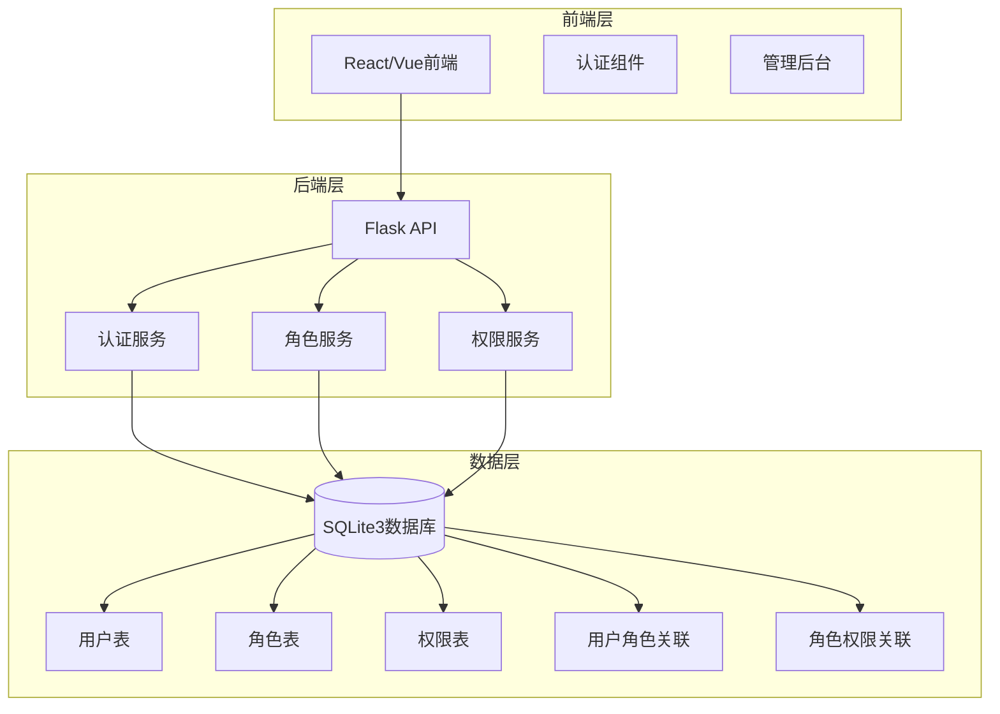
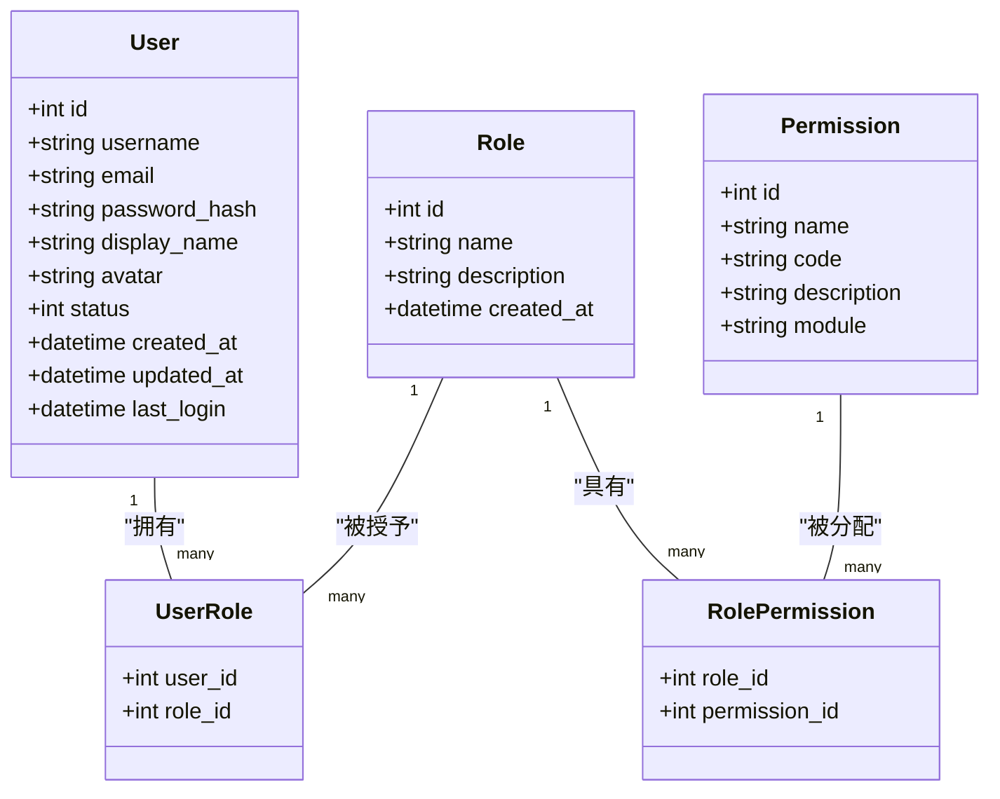
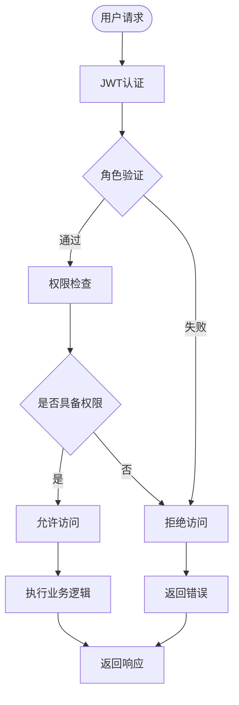
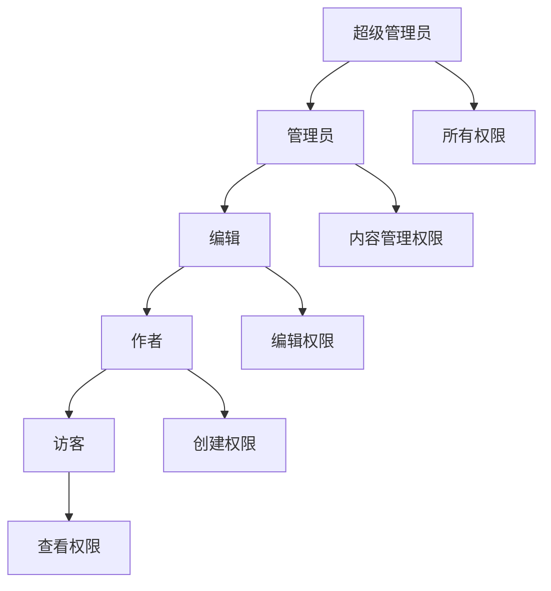
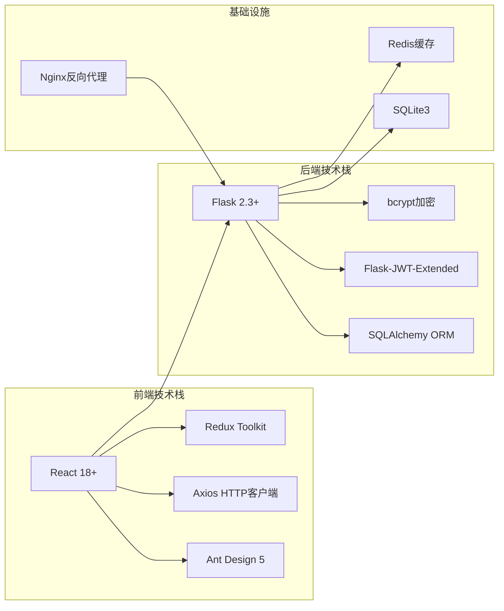
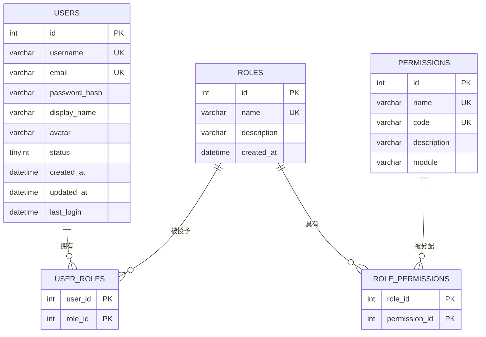

# 角色管理系统

<cite>
**本文档引用的文件**
- [企业网站CMS系统详细需求文档.md](file://企业网站CMS系统详细需求文档.md)
- [企业网站CMS系统开发需求文档.ini](file://企业网站CMS系统开发需求文档.ini)
- [开发计划表_2月4日-2月12日.md](file://开发计划表_2月4日-2月12日.md)
</cite>

## 目录
1. [简介](#简介)
2. [项目结构](#项目结构)
3. [核心组件](#核心组件)
4. [架构概览](#架构概览)
5. [详细组件分析](#详细组件分析)
6. [依赖关系分析](#依赖关系分析)
7. [性能考虑](#性能考虑)
8. [故障排除指南](#故障排除指南)
9. [结论](#结论)

## 简介

角色管理系统是企业网站CMS系统的核心权限控制模块，基于RBAC（基于角色的访问控制）模型设计。该系统实现了完整的用户权限管理体系，支持多层级角色结构、动态权限继承和细粒度的权限控制。

系统采用Flask框架开发，使用SQLite3作为数据库存储，支持JWT令牌认证和基于装饰器的权限验证机制。通过标准化的API接口，为内容管理系统提供了可靠的权限安全保障。

## 项目结构

CMS系统采用前后端分离架构，角色管理系统作为后端权限控制的核心模块：

**图表来源**
- [企业网站CMS系统详细需求文档.md](file://企业网站CMS系统详细需求文档.md#L22-L57)
- [开发计划表_2月4日-2月12日.md](file://开发计划表_2月4日-2月12日.md#L92-L105)

**章节来源**
- [企业网站CMS系统详细需求文档.md](file://企业网站CMS系统详细需求文档.md#L22-L57)
- [开发计划表_2月4日-2月12日.md](file://开发计划表_2月4日-2月12日.md#L92-L105)

## 核心组件

### 角色体系架构

系统实现了完整的RBAC模型，包含以下核心组件：

#### 用户管理模块
- **用户表(users)**: 存储用户基本信息、认证凭据和状态管理
- **用户角色关联(user_roles)**: 多对多关系，支持用户拥有多个角色

#### 角色管理模块  
- **角色表(roles)**: 定义角色基本信息和创建时间
- **角色权限关联(role_permissions)**: 多对多关系，建立角色与权限的绑定

#### 权限管理模块
- **权限表(permissions)**: 定义系统中的具体权限项
- **模块化权限**: 支持按模块、操作、数据级别的细粒度控制

**图表来源**
- [企业网站CMS系统详细需求文档.md](file://企业网站CMS系统详细需求文档.md#L716-L768)

**章节来源**
- [企业网站CMS系统详细需求文档.md](file://企业网站CMS系统详细需求文档.md#L716-L768)

## 架构概览

### RBAC模型实现

系统采用标准的RBAC三层模型：

**图表来源**
- [企业网站CMS系统详细需求文档.md](file://企业网站CMS系统详细需求文档.md#L271-L282)

### 权限继承机制

系统支持动态权限继承，通过角色层次结构实现权限的传递：

**图表来源**
- [企业网站CMS系统详细需求文档.md](file://企业网站CMS系统详细需求文档.md#L239-L265)

**章节来源**
- [企业网站CMS系统详细需求文档.md](file://企业网站CMS系统详细需求文档.md#L239-L282)

## 详细组件分析

### 预设角色权限矩阵

系统定义了五个预设角色，每个角色都有明确的权限范围和职责边界：

#### 超级管理员 (Super Admin)
- **权限范围**: 完全控制系统的所有功能
- **职责边界**: 系统最高权限，可管理所有用户和配置
- **具体权限**:
  - 所有模块的完全访问权限
  - 用户管理权限（包括超级管理员）
  - 系统配置管理
  - 数据备份和恢复
  - 权限分配和角色管理

#### 管理员 (Admin)
- **权限范围**: 内容管理和用户管理
- **职责边界**: 系统日常运营管理者
- **具体权限**:
  - 内容管理（增删改查）
  - 媒体库管理
  - 页面发布
  - 用户管理（除超级管理员外）

#### 编辑 (Editor)
- **权限范围**: 内容编辑和媒体上传
- **职责边界**: 内容创作和维护人员
- **具体权限**:
  - 内容编辑
  - 媒体上传
  - 页面编辑（需审核）

#### 作者 (Author)
- **权限范围**: 内容创作和媒体管理
- **职责边界**: 内容创作者
- **具体权限**:
  - 创建文章
  - 编辑自己的内容
  - 上传媒体

#### 访客 (Viewer)
- **权限范围**: 仅查看权限
- **职责边界**: 系统普通用户
- **具体权限**:
  - 仅查看权限
  - 导出数据

**章节来源**
- [企业网站CMS系统详细需求文档.md](file://企业网站CMS系统详细需求文档.md#L239-L265)

### 角色管理API接口

系统提供了完整的角色管理API接口：

#### 用户角色管理接口
- **GET /api/v1/users/:id/roles** - 获取用户角色列表
- **PUT /api/v1/users/:id/roles** - 分配用户角色
- **DELETE /api/v1/users/:id/roles** - 移除用户角色

#### 角色管理接口
- **GET /api/v1/roles** - 获取角色列表
- **POST /api/v1/roles** - 创建角色
- **GET /api/v1/roles/:id** - 获取角色详情
- **PUT /api/v1/roles/:id** - 更新角色
- **DELETE /api/v1/roles/:id** - 删除角色

#### 权限管理接口
- **GET /api/v1/permissions** - 获取权限列表
- **POST /api/v1/permissions** - 创建权限
- **GET /api/v1/permissions/:id** - 获取权限详情
- **PUT /api/v1/permissions/:id** - 更新权限
- **DELETE /api/v1/permissions/:id** - 删除权限

**章节来源**
- [企业网站CMS系统详细需求文档.md](file://企业网站CMS系统详细需求文档.md#L1013-L1021)

### 权限粒度控制

系统实现了多层次的权限控制机制：

#### 模块级权限
- 页面管理权限
- 文章管理权限
- 媒体库权限
- 用户管理权限

#### 操作级权限
- 创建权限 (Create)
- 读取权限 (Read)
- 更新权限 (Update)
- 删除权限 (Delete)

#### 数据级权限
- 自身数据访问
- 部门数据访问
- 全部数据访问

**章节来源**
- [企业网站CMS系统详细需求文档.md](file://企业网站CMS系统详细需求文档.md#L266-L269)

## 依赖关系分析

### 技术栈依赖

系统采用现代化的技术栈组合：

**图表来源**
- [企业网站CMS系统详细需求文档.md](file://企业网站CMS系统详细需求文档.md#L555-L594)

### 数据库设计依赖

系统采用标准化的关系型数据库设计：

**图表来源**
- [企业网站CMS系统详细需求文档.md](file://企业网站CMS系统详细需求文档.md#L716-L768)

**章节来源**
- [企业网站CMS系统详细需求文档.md](file://企业网站CMS系统详细需求文档.md#L555-L594)
- [企业网站CMS系统详细需求文档.md](file://企业网站CMS系统详细需求文档.md#L716-L768)

## 性能考虑

### 缓存策略

系统采用多层缓存机制优化性能：

- **Redis缓存**: 用户会话、权限数据、热点内容
- **数据库查询缓存**: 频繁访问的角色权限数据
- **静态资源缓存**: 前端静态文件、图片资源

### 数据库优化

- **索引优化**: 在常用查询字段上建立索引
- **连接池**: 数据库连接复用
- **查询优化**: 避免N+1查询问题
- **分页查询**: 大数据量的分页处理

### 安全性能

- **JWT令牌缓存**: 减少令牌验证开销
- **权限预加载**: 用户登录时预加载权限
- **API限流**: 防止恶意请求攻击

## 故障排除指南

### 常见问题诊断

#### 权限验证失败
- 检查JWT令牌有效性
- 验证用户角色状态
- 确认权限分配正确性

#### 数据库连接问题
- 检查SQLite数据库文件权限
- 验证数据库连接字符串
- 确认数据库文件完整性

#### 缓存异常
- 清理Redis缓存
- 检查缓存键命名规范
- 验证缓存过期时间设置

### 性能监控

- **响应时间监控**: API接口响应时间
- **数据库查询监控**: 慢查询日志
- **内存使用监控**: 应用内存占用
- **并发用户监控**: 同时在线用户数

**章节来源**
- [企业网站CMS系统详细需求文档.md](file://企业网站CMS系统详细需求文档.md#L1360-L1460)

## 结论

角色管理系统作为企业网站CMS的核心模块，成功实现了基于RBAC的权限控制体系。系统通过清晰的角色层次结构、灵活的权限继承机制和完善的API接口，为企业提供了可靠的安全保障。

系统的主要优势包括：
- **模块化设计**: 清晰的职责分离和依赖关系
- **可扩展性**: 支持角色和权限的动态扩展
- **安全性**: 多层安全防护和权限验证
- **易用性**: 标准化的API接口和文档

未来可以在现有基础上进一步增强：
- 更细粒度的权限控制
- 权限审计日志
- 多租户支持
- 权限继承的复杂规则