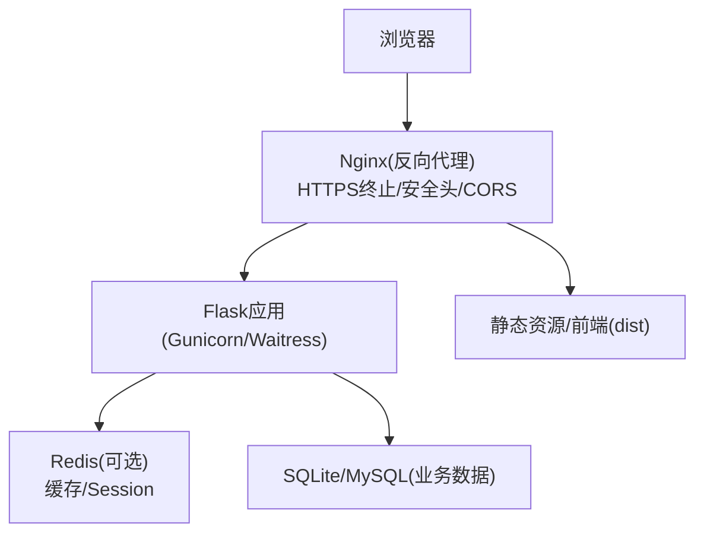
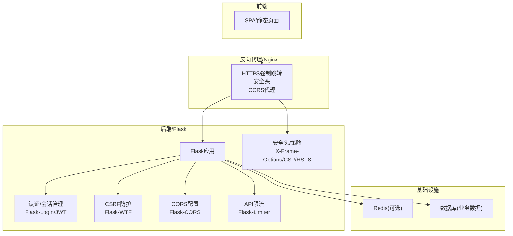
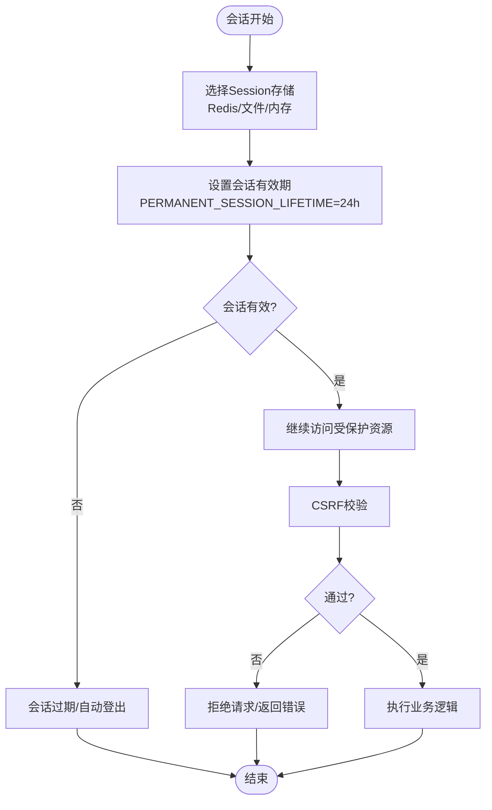
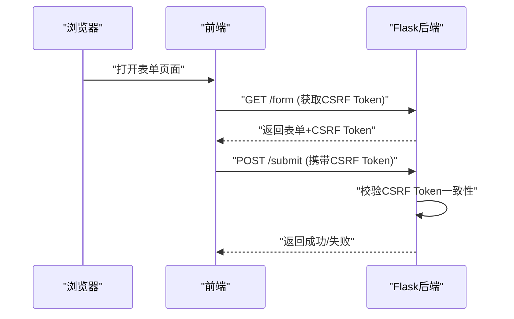
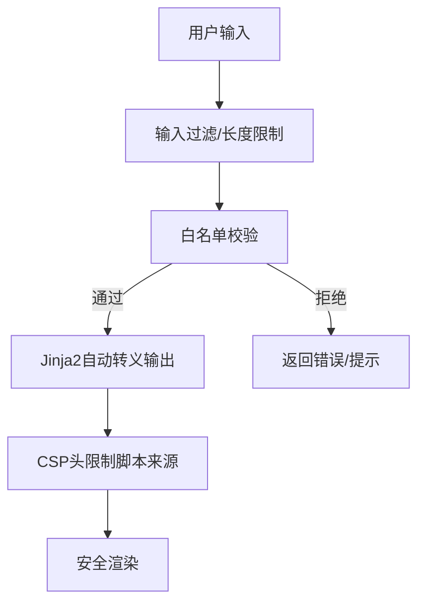
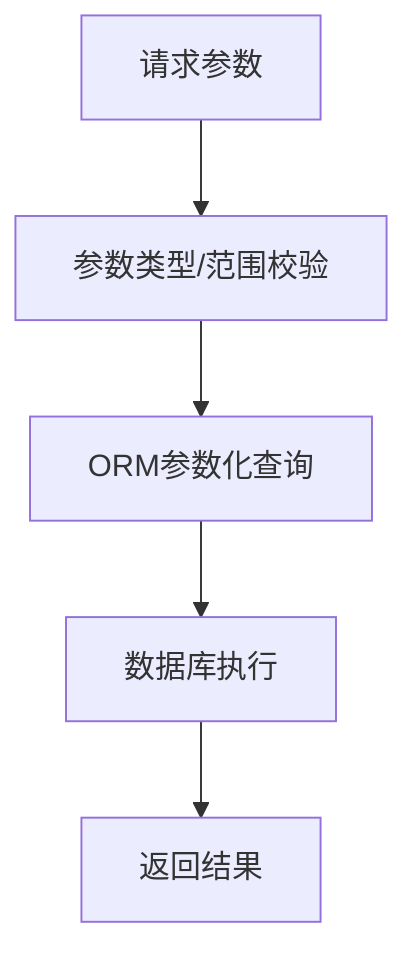
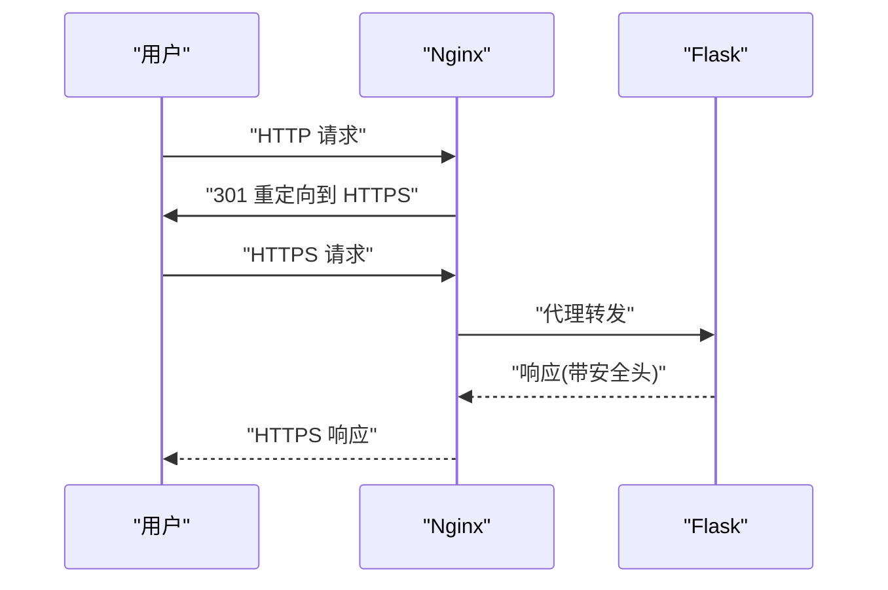
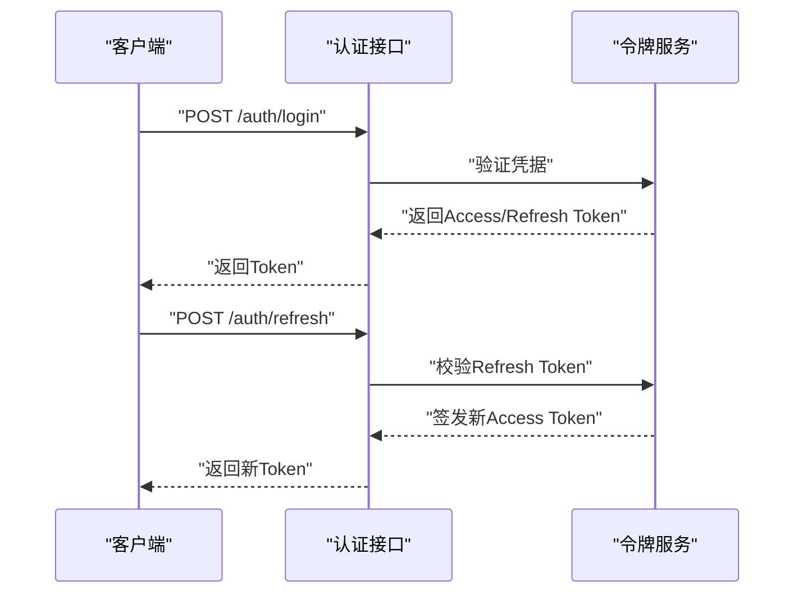
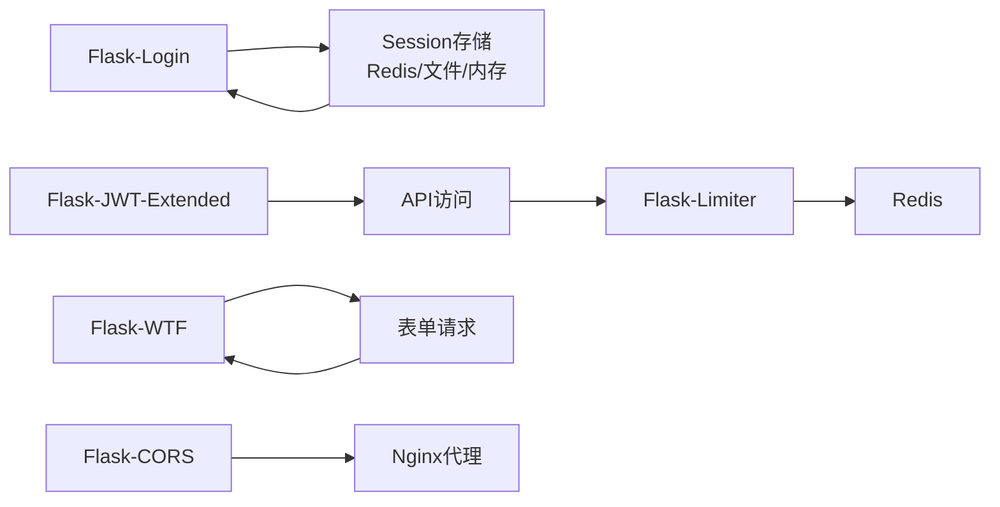

# 会话安全

<cite>
**本文引用的文件**
- [企业网站CMS系统详细需求文档.md](file://企业网站CMS系统详细需求文档.md)
- [开发计划表_2月4日-2月12日.md](file://开发计划表_2月4日-2月12日.md)
</cite>

## 目录
1. [简介](#简介)
2. [项目结构](#项目结构)
3. [核心组件](#核心组件)
4. [架构总览](#架构总览)
5. [详细组件分析](#详细组件分析)
6. [依赖关系分析](#依赖关系分析)
7. [性能考量](#性能考量)
8. [故障排查指南](#故障排查指南)
9. [结论](#结论)
10. [附录](#附录)

## 简介
本文件围绕会话安全管理展开，结合项目需求文档中的安全设计与部署配置，系统梳理Flask-Login的会话管理机制、Session存储策略与安全配置；详解CSRF防护、XSS防护与SQL注入防护；阐述HTTPS强制跳转、CORS跨域配置与API访问频率限制；解释IP黑白名单思路、会话超时与自动登出；并给出安全Cookie配置、SameSite属性与安全头(X-Frame-Options、Content-Security-Policy等)的配置方案。文档同时提供架构图、序列图与流程图，帮助读者从整体到细节全面理解系统的安全实现。

## 项目结构
本项目采用前后端分离架构，后端基于Flask，使用Nginx作为反向代理与安全加固层，Redis用于缓存与Session存储（可选）。前端为SPA或静态页面，通过Nginx代理转发至Flask后端API。

**图表来源**
- [企业网站CMS系统详细需求文档.md](file://企业网站CMS系统详细需求文档.md#L28-L56)
- [企业网站CMS系统详细需求文档.md](file://企业网站CMS系统详细需求文档.md#L1143-L1230)

**章节来源**
- [企业网站CMS系统详细需求文档.md](file://企业网站CMS系统详细需求文档.md#L28-L56)
- [开发计划表_2月4日-2月12日.md](file://开发计划表_2月4日-2月12日.md#L92-L128)

## 核心组件
- Flask-Login：用户认证与会话管理（基于Flask-Login）
- Flask-JWT-Extended：JWT Token机制（Access/Refresh Token）
- Flask-WTF：CSRF防护（CSRF Token）
- Flask-CORS：跨域配置（CORS_ORIGINS）
- Flask-Limiter：API访问频率限制（基于IP/用户限流）
- Redis：缓存与Session存储（可选）
- Nginx：HTTPS强制跳转、安全头、CORS代理、静态资源与API代理

**章节来源**
- [企业网站CMS系统详细需求文档.md](file://企业网站CMS系统详细需求文档.md#L1078-L1140)
- [企业网站CMS系统详细需求文档.md](file://企业网站CMS系统详细需求文档.md#L1232-L1301)
- [企业网站CMS系统详细需求文档.md](file://企业网站CMS系统详细需求文档.md#L1143-L1230)

## 架构总览
下图展示了会话安全相关的关键组件与交互路径，包括认证、会话存储、CSRF/XSS防护、HTTPS/CORS与API限流等。

**图表来源**
- [企业网站CMS系统详细需求文档.md](file://企业网站CMS系统详细需求文档.md#L1078-L1140)
- [企业网站CMS系统详细需求文档.md](file://企业网站CMS系统详细需求文档.md#L1143-L1230)
- [企业网站CMS系统详细需求文档.md](file://企业网站CMS系统详细需求文档.md#L1232-L1301)

## 详细组件分析

### 1) Flask-Login 会话管理与Session存储策略
- 会话存储：配置为Redis（可选），以支持分布式与高可用；也可使用默认的文件/内存存储（开发环境）。
- 会话生命周期：永久会话时长配置为24小时，到期后自动失效。
- 会话超时与自动登出：可通过PERMANENT_SESSION_LIFETIME控制；结合前端路由守卫与后端会话校验实现自动登出。
- 安全Cookie：建议启用HttpOnly、Secure、SameSite等属性，减少XSS与CSRF风险。
- 异常登录检测：建议结合IP/设备指纹与登录日志，触发二次验证或强制登出。

**图表来源**
- [企业网站CMS系统详细需求文档.md](file://企业网站CMS系统详细需求文档.md#L1094-L1098)
- [企业网站CMS系统详细需求文档.md](file://企业网站CMS系统详细需求文档.md#L1262-L1266)

**章节来源**
- [企业网站CMS系统详细需求文档.md](file://企业网站CMS系统详细需求文档.md#L1094-L1098)
- [企业网站CMS系统详细需求文档.md](file://企业网站CMS系统详细需求文档.md#L1262-L1266)

### 2) CSRF 防护机制
- Flask-WTF CSRF Token：为表单请求附加CSRF Token，后端校验一致性。
- SameSite Cookie：设置SameSite属性（Lax/Strict），降低跨站请求风险。
- 双重提交Cookie：配合CSRF Token，进一步强化防护。
- 前端实践：在表单与AJAX请求中携带CSRF Token，并确保Cookie SameSite策略正确。

**图表来源**
- [企业网站CMS系统详细需求文档.md](file://企业网站CMS系统详细需求文档.md#L1111-L1115)

**章节来源**
- [企业网站CMS系统详细需求文档.md](file://企业网站CMS系统详细需求文档.md#L1111-L1115)

### 3) XSS 防护
- 输入过滤：对用户输入进行白名单过滤与长度限制。
- 输出转义：Jinja2默认自动转义，避免直接输出原始HTML。
- CSP（内容安全策略）：通过Nginx添加CSP头，限制脚本来源与内联脚本。
- 建议：尽量使用CSP-Report-Only进行过渡，收集违规报告后再强制执行。

**图表来源**
- [企业网站CMS系统详细需求文档.md](file://企业网站CMS系统详细需求文档.md#L1106-L1110)
- [企业网站CMS系统详细需求文档.md](file://企业网站CMS系统详细需求文档.md#L1172-L1176)

**章节来源**
- [企业网站CMS系统详细需求文档.md](file://企业网站CMS系统详细需求文档.md#L1106-L1110)
- [企业网站CMS系统详细需求文档.md](file://企业网站CMS系统详细需求文档.md#L1172-L1176)

### 4) SQL 注入防护
- ORM参数化查询：使用Flask-SQLAlchemy的ORM，避免原生SQL拼接。
- 输入验证：对所有外部输入进行类型与范围校验。
- 避免动态SQL：禁止将用户输入直接拼接到SQL语句中。

**图表来源**
- [企业网站CMS系统详细需求文档.md](file://企业网站CMS系统详细需求文档.md#L1101-L1105)

**章节来源**
- [企业网站CMS系统详细需求文档.md](file://企业网站CMS系统详细需求文档.md#L1101-L1105)

### 5) HTTPS 强制跳转与安全头
- HTTPS强制跳转：Nginx监听80端口，301重定向至443。
- 安全头：
  - X-Frame-Options：SAMEORIGIN，防点击劫持。
  - X-Content-Type-Options：nosniff，防MIME嗅探。
  - X-XSS-Protection：1; mode=block，启用浏览器XSS过滤。
  - HSTS：在生产环境启用，强制浏览器使用HTTPS。
  - CSP：限制脚本来源与内联脚本，降低XSS风险。

**图表来源**
- [企业网站CMS系统详细需求文档.md](file://企业网站CMS系统详细需求文档.md#L1154-L1160)
- [企业网站CMS系统详细需求文档.md](file://企业网站CMS系统详细需求文档.md#L1162-L1176)

**章节来源**
- [企业网站CMS系统详细需求文档.md](file://企业网站CMS系统详细需求文档.md#L1154-L1160)
- [企业网站CMS系统详细需求文档.md](file://企业网站CMS系统详细需求文档.md#L1162-L1176)

### 6) CORS 跨域配置
- Flask-CORS：通过CORS_ORIGINS配置允许的源。
- Nginx代理：在API路径上设置CORS头，便于统一管理跨域策略。
- 建议：生产环境仅允许必要域名，避免通配符。

**章节来源**
- [企业网站CMS系统详细需求文档.md](file://企业网站CMS系统详细需求文档.md#L1287-L1289)
- [企业网站CMS系统详细需求文档.md](file://企业网站CMS系统详细需求文档.md#L1208-L1220)

### 7) API 访问频率限制
- Flask-Limiter：基于IP与用户维度进行限流，不同接口可设置不同阈值。
- 建议：登录接口与敏感接口限流更严格，普通接口适度放宽。
- 结合Redis：若使用Redis存储Session，可复用其连接进行限流计数。

**章节来源**
- [企业网站CMS系统详细需求文档.md](file://企业网站CMS系统详细需求文档.md#L1128-L1135)

### 8) IP 黑名单/白名单机制
- 黑名单：对频繁触发限流或异常行为的IP进行临时封禁。
- 白名单：对可信来源（如内部网段、监控系统）放行。
- 实施建议：在Nginx层或Flask中间件中实现，结合日志与告警。

**章节来源**
- [企业网站CMS系统详细需求文档.md](file://企业网站CMS系统详细需求文档.md#L1128-L1135)

### 9) 会话超时管理与自动登出
- 会话超时：PERMANENT_SESSION_LIFETIME控制，到期后自动失效。
- 自动登出：前端路由守卫检测会话状态，后端接口校验当前用户是否仍有效。
- 异常登出：检测到异常登录（IP/设备变化）时触发二次验证或强制登出。

**章节来源**
- [企业网站CMS系统详细需求文档.md](file://企业网站CMS系统详细需求文档.md#L1094-L1098)
- [企业网站CMS系统详细需求文档.md](file://企业网站CMS系统详细需求文档.md#L1262-L1266)

### 10) 安全Cookie配置与SameSite
- HttpOnly：防止XSS读取Cookie。
- Secure：仅HTTPS传输。
- SameSite：Lax/Strict，减少CSRF风险。
- Domain/Path：精确设置作用域。
- 建议：登录态Cookie使用Strict，其他场景可用Lax。

**章节来源**
- [企业网站CMS系统详细需求文档.md](file://企业网站CMS系统详细需求文档.md#L1111-L1115)

### 11) JWT Token机制与刷新
- Access Token：短期（2小时），用于日常请求。
- Refresh Token：长期（7天），用于刷新Access Token。
- Token存储：LocalStorage/Cookie均可，需配合安全策略（SameSite、HttpOnly、Secure）。
- 刷新机制：后端校验Refresh Token有效性与来源，签发新的Access Token。

**图表来源**
- [企业网站CMS系统详细需求文档.md](file://企业网站CMS系统详细需求文档.md#L1082-L1087)

**章节来源**
- [企业网站CMS系统详细需求文档.md](file://企业网站CMS系统详细需求文档.md#L1082-L1087)

## 依赖关系分析
- Flask-Login与Session存储：Session存储在Redis时，需配置SESSION_TYPE与SESSION_REDIS。
- Flask-JWT-Extended：与Flask-Login可并存，JWT用于API访问，Session用于Web会话。
- Flask-WTF与CSRF：CSRF Token与SameSite Cookie共同保障表单安全。
- Flask-CORS与Nginx：两者协同实现跨域策略，生产环境建议统一在Nginx层处理。
- Flask-Limiter：与Redis结合，实现高效限流。

**图表来源**
- [企业网站CMS系统详细需求文档.md](file://企业网站CMS系统详细需求文档.md#L1262-L1266)
- [企业网站CMS系统详细需求文档.md](file://企业网站CMS系统详细需求文档.md#L1287-L1289)
- [企业网站CMS系统详细需求文档.md](file://企业网站CMS系统详细需求文档.md#L1128-L1135)

**章节来源**
- [企业网站CMS系统详细需求文档.md](file://企业网站CMS系统详细需求文档.md#L1262-L1266)
- [企业网站CMS系统详细需求文档.md](file://企业网站CMS系统详细需求文档.md#L1287-L1289)
- [企业网站CMS系统详细需求文档.md](file://企业网站CMS系统详细需求文档.md#L1128-L1135)

## 性能考量
- Session存储：Redis可提升并发下的会话一致性与可扩展性。
- 缓存：Redis用于页面缓存与数据缓存，结合缓存失效策略。
- 限流：Flask-Limiter基于Redis计数，避免阻塞式限流带来的性能损耗。
- Nginx：静态资源缓存、Gzip压缩、HTTPS终止与安全头，减轻后端压力。

**章节来源**
- [企业网站CMS系统详细需求文档.md](file://企业网站CMS系统详细需求文档.md#L512-L548)
- [企业网站CMS系统详细需求文档.md](file://企业网站CMS系统详细需求文档.md#L1143-L1230)
- [企业网站CMS系统详细需求文档.md](file://企业网站CMS系统详细需求文档.md#L1257-L1261)

## 故障排查指南
- CSRF校验失败：检查前端是否正确携带CSRF Token，SameSite设置是否与Cookie一致。
- 会话超时频繁：检查PERMANENT_SESSION_LIFETIME配置与前端自动刷新逻辑。
- CORS报错：核对Flask-CORS的CORS_ORIGINS与Nginx代理头设置。
- HTTPS跳转异常：确认Nginx 80->443重定向规则与证书配置。
- API限流误伤：调整Flask-Limiter规则，区分IP与用户维度，避免过度限制。
- XSS/CSP问题：逐步收紧CSP策略，先使用Report-Only观察违规情况。

**章节来源**
- [企业网站CMS系统详细需求文档.md](file://企业网站CMS系统详细需求文档.md#L1111-L1115)
- [企业网站CMS系统详细需求文档.md](file://企业网站CMS系统详细需求文档.md#L1287-L1289)
- [企业网站CMS系统详细需求文档.md](file://企业网站CMS系统详细需求文档.md#L1154-L1160)
- [企业网站CMS系统详细需求文档.md](file://企业网站CMS系统详细需求文档.md#L1128-L1135)

## 结论
本项目在安全设计层面提供了较为完整的会话安全方案：Flask-Login与JWT并行、CSRF/XSS/SQL注入三道防线、HTTPS强制与安全头、CORS统一治理、API限流与Redis支撑。建议在生产环境中启用HSTS、严格的CSP、SameSite Strict、Secure与HttpOnly Cookie，并结合异常登录检测与IP黑白名单机制，持续完善安全策略与监控告警。

## 附录
- 配置参考
  - Session存储与生命周期：参见配置类中的Session相关字段。
  - CORS配置：CORS_ORIGINS。
  - JWT配置：JWT_SECRET_KEY、JWT_ACCESS_TOKEN_EXPIRES、JWT_REFRESH_TOKEN_EXPIRES。
  - Nginx安全头与HTTPS：参考nginx.conf中的安全头与重定向配置。

**章节来源**
- [企业网站CMS系统详细需求文档.md](file://企业网站CMS系统详细需求文档.md#L1232-L1301)
- [企业网站CMS系统详细需求文档.md](file://企业网站CMS系统详细需求文档.md#L1143-L1230)