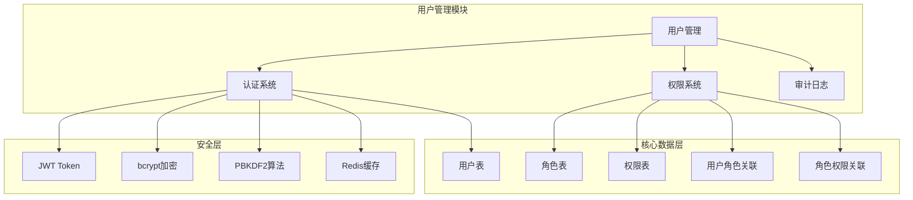
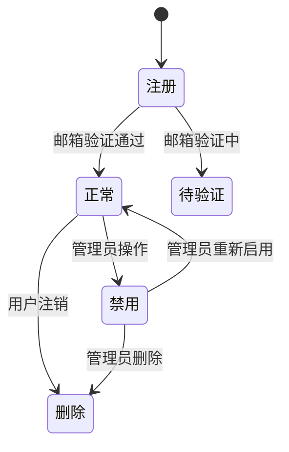
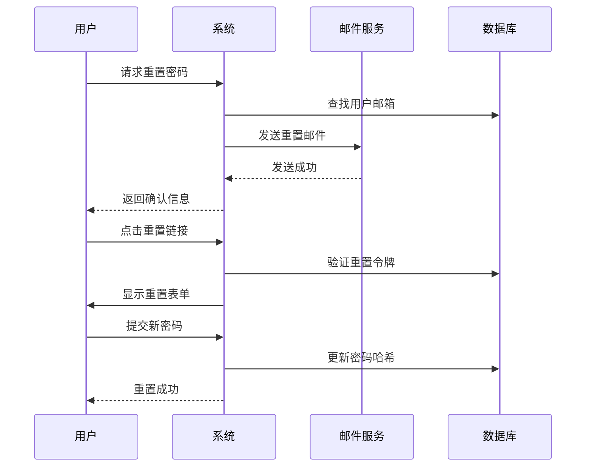
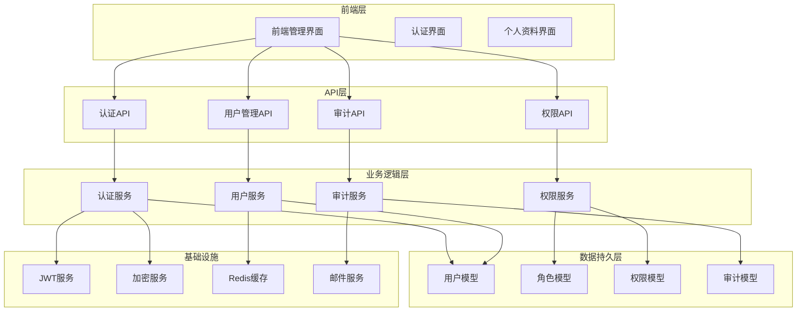
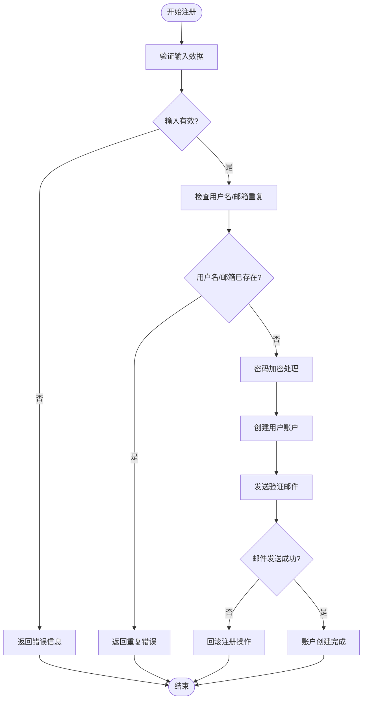
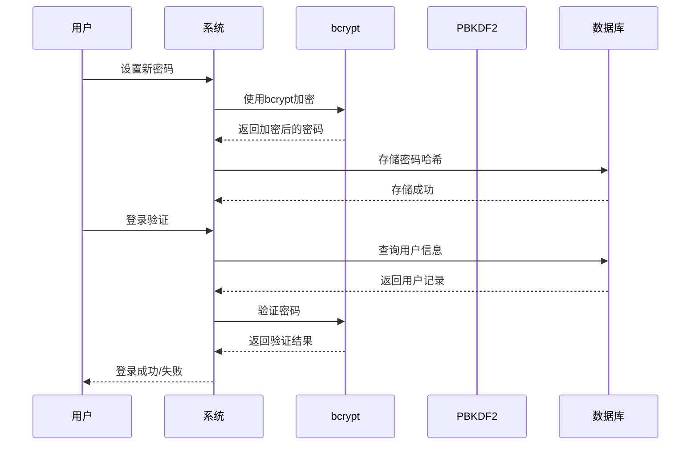
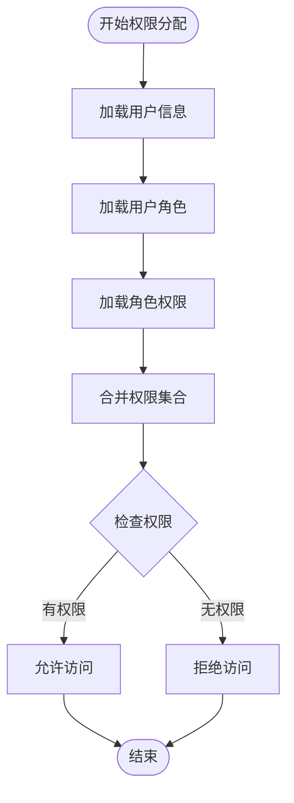
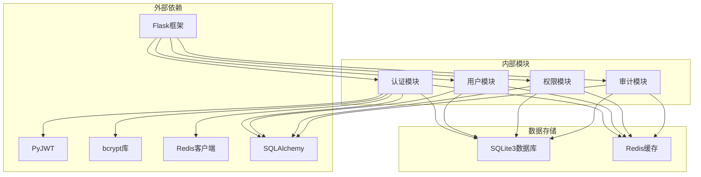

# 用户管理

<cite>
**本文档引用的文件**
- [企业网站CMS系统详细需求文档.md](file://企业网站CMS系统详细需求文档.md)
- [开发计划表_2月4日-2月12日.md](file://开发计划表_2月4日-2月12日.md)
- [企业网站CMS系统开发需求文档.ini](file://企业网站CMS系统开发需求文档.ini)
</cite>

## 目录
1. [简介](#简介)
2. [项目结构](#项目结构)
3. [核心组件](#核心组件)
4. [架构总览](#架构总览)
5. [详细组件分析](#详细组件分析)
6. [依赖关系分析](#依赖关系分析)
7. [性能考虑](#性能考虑)
8. [故障排除指南](#故障排除指南)
9. [结论](#结论)

## 简介

用户管理功能是企业网站CMS系统的核心模块之一，负责管理系统的用户注册、认证、授权和安全控制。该功能基于Flask框架实现，采用JWT（JSON Web Token）进行身份认证，结合bcrypt密码加密算法和PBKDF2安全策略，确保用户账户的安全性和可靠性。

本系统支持完整的用户生命周期管理，包括用户注册流程、邮箱/手机号验证机制、密码安全策略、用户状态管理、登录日志记录、多设备登录管理、密码重置流程、安全令牌机制、用户资料管理、头像上传以及权限分配等核心功能。

## 项目结构

基于需求文档分析，用户管理功能在系统中的组织结构如下：

**图表来源**
- [企业网站CMS系统详细需求文档.md](file://企业网站CMS系统详细需求文档.md#L237-L293)
- [企业网站CMS系统详细需求文档.md](file://企业网站CMS系统详细需求文档.md#L716-L768)

**章节来源**
- [企业网站CMS系统详细需求文档.md](file://企业网站CMS系统详细需求文档.md#L237-L293)
- [开发计划表_2月4日-2月12日.md](file://开发计划表_2月4日-2月12日.md#L92-L105)

## 核心组件

### 用户认证系统

用户认证系统是整个用户管理功能的基础，采用JWT（JSON Web Token）进行身份验证，支持用户注册、登录、登出和Token刷新功能。

#### 认证接口设计

系统提供以下核心认证接口：
- 用户注册：`POST /api/v1/auth/register`
- 用户登录：`POST /api/v1/auth/login`
- 用户登出：`POST /api/v1/auth/logout`
- Token刷新：`POST /api/v1/auth/refresh`
- 获取当前用户：`GET /api/v1/auth/me`

#### JWT Token机制

系统采用双Token机制确保安全性：
- **Access Token**：有效期2小时，用于日常API访问
- **Refresh Token**：有效期7天，用于刷新Access Token
- Token存储在客户端（LocalStorage/Cookie）
- 支持Token自动刷新机制

**章节来源**
- [企业网站CMS系统详细需求文档.md](file://企业网站CMS系统详细需求文档.md#L1002-L1011)
- [企业网站CMS系统详细需求文档.md](file://企业网站CMS系统详细需求文档.md#L1082-L1086)

### 密码安全策略

系统采用多层次的密码安全策略，确保用户密码的安全性。

#### 密码加密算法

1. **bcrypt加密算法**
   - 成本因子设置为12
   - 自动处理盐值生成
   - 防止彩虹表攻击
   - 适应硬件性能变化

2. **PBKDF2算法**
   - 作为备用加密方案
   - 支持自定义迭代次数
   - 提供额外的安全保障

#### 密码强度要求

- 最小长度：8位字符
- 必须包含字母和数字
- 支持特殊字符
- 密码历史记录，防止重复使用
- 登录失败锁定机制（5次失败锁定30分钟）

**章节来源**
- [企业网站CMS系统详细需求文档.md](file://企业网站CMS系统详细需求文档.md#L1088-L1092)

### 用户状态管理

系统提供完整的用户状态管理功能，支持用户账户的激活和禁用控制。

#### 用户状态枚举

- **正常状态**：1 - 用户账户正常激活
- **禁用状态**：0 - 管理员可以禁用用户账户
- **默认状态**：新注册用户默认为正常状态

#### 状态变更流程

**图表来源**
- [企业网站CMS系统详细需求文档.md](file://企业网站CMS系统详细需求文档.md#L719-L732)

**章节来源**
- [企业网站CMS系统详细需求文档.md](file://企业网站CMS系统详细需求文档.md#L719-L732)

### 权限控制系统

系统采用RBAC（基于角色的访问控制）模型，提供细粒度的权限管理功能。

#### 角色体系设计

1. **超级管理员（Super Admin）**
   - 拥有所有权限
   - 可管理用户和系统配置
   - 可执行所有操作

2. **管理员（Admin）**
   - 内容管理权限
   - 媒体库管理
   - 页面发布权限
   - 可管理除超级管理员外的所有用户

3. **编辑（Editor）**
   - 内容编辑权限
   - 媒体上传权限
   - 页面编辑权限（需审核）

4. **作者（Author）**
   - 创建文章权限
   - 编辑自己的内容
   - 上传媒体权限

5. **访客（Viewer）**
   - 仅查看权限
   - 可导出数据

#### 权限粒度

- **模块级权限**：页面管理、文章管理等
- **操作级权限**：创建、读取、更新、删除
- **数据级权限**：只能操作自己的数据

**章节来源**
- [企业网站CMS系统详细需求文档.md](file://企业网站CMS系统详细需求文档.md#L239-L270)

### 登录日志记录

系统提供完整的登录日志记录功能，用于安全审计和用户行为监控。

#### 登录日志字段

- 用户标识
- 登录时间
- 登录IP地址
- 用户代理信息
- 登录结果（成功/失败）
- 设备信息
- 会话ID

#### 日志存储策略

- 实时记录登录事件
- 支持日志查询和筛选
- 定期清理过期日志
- 异常登录检测（IP/设备变化）

**章节来源**
- [企业网站CMS系统详细需求文档.md](file://企业网站CMS系统详细需求文档.md#L1094-L1097)

### 多设备登录管理

系统支持多设备登录管理，允许用户在多个设备上同时登录。

#### 会话管理

- Redis缓存存储会话信息
- 支持单点登录/多点登录配置
- 异常登录检测机制
- 会话超时自动清理

#### 设备识别

- 基于User-Agent识别设备类型
- IP地址变化检测
- 异常登录提醒
- 设备列表管理

**章节来源**
- [企业网站CMS系统详细需求文档.md](file://企业网站CMS系统详细需求文档.md#L1094-L1097)

### 密码重置流程

系统提供安全的密码重置功能，通过邮箱验证确保账户安全。

#### 密码重置流程

**图表来源**
- [企业网站CMS系统详细需求文档.md](file://企业网站CMS系统详细需求文档.md#L1008-L1009)

#### 安全令牌机制

- 一次性重置令牌
- 令牌有效期（通常24小时）
- 令牌加密存储
- 令牌使用后立即失效

**章节来源**
- [企业网站CMS系统详细需求文档.md](file://企业网站CMS系统详细需求文档.md#L1008-L1009)

### 用户资料管理

系统提供完整的用户资料管理功能，支持用户个人信息的维护和更新。

#### 用户资料字段

- 用户名（唯一标识）
- 邮箱地址（唯一标识）
- 显示名称
- 头像图片
- 账户状态
- 创建时间
- 最后登录时间

#### 头像上传功能

- 支持JPG、PNG、GIF、WebP格式
- 文件大小限制（通常5MB）
- 自动缩略图生成
- 图片压缩优化
- 安全文件名处理

**章节来源**
- [企业网站CMS系统详细需求文档.md](file://企业网站CMS系统详细需求文档.md#L719-L729)

### 账号锁定机制

系统实现智能的账号锁定机制，防止暴力破解攻击。

#### 锁定策略

- 登录失败阈值：5次连续失败
- 锁定时长：30分钟
- IP地址绑定锁定
- 用户账户级锁定
- 管理员可手动解锁

#### 异常检测

- 异常地理位置登录
- 异常设备登录
- 短时间内大量登录尝试
- 自动触发安全警报

**章节来源**
- [企业网站CMS系统详细需求文档.md](file://企业网站CMS系统详细需求文档.md#L1089-L1092)

### 安全审计和用户行为监控

系统提供全面的安全审计功能，记录所有重要的安全相关事件。

#### 审计日志类型

- 用户登录/登出事件
- 权限变更操作
- 敏感数据访问
- 系统配置修改
- 异常安全事件

#### 监控指标

- 登录成功率统计
- 异常登录模式识别
- 用户活跃度分析
- 权限滥用检测
- 系统安全状态监控

**章节来源**
- [企业网站CMS系统详细需求文档.md](file://企业网站CMS系统详细需求文档.md#L1391-L1395)

## 架构总览

用户管理功能的整体架构设计如下：

**图表来源**
- [企业网站CMS系统详细需求文档.md](file://企业网站CMS系统详细需求文档.md#L22-L57)
- [开发计划表_2月4日-2月12日.md](file://开发计划表_2月4日-2月12日.md#L92-L105)

## 详细组件分析

### 用户注册流程

用户注册流程是用户管理功能的重要组成部分，涉及多个安全验证步骤。

#### 注册流程图

**图表来源**
- [开发计划表_2月4日-2月12日.md](file://开发计划表_2月4日-2月12日.md#L142-L148)

#### 验证机制

- **邮箱验证**：注册后发送验证邮件，用户点击链接激活账户
- **手机号验证**：可选的手机号验证功能
- **验证码机制**：防止机器人注册
- **输入过滤**：防止恶意输入

**章节来源**
- [开发计划表_2月4日-2月12日.md](file://开发计划表_2月4日-2月12日.md#L142-L148)

### 密码安全实现

密码安全是用户管理功能的核心安全特性，采用多重保护机制。

#### 密码加密流程

**图表来源**
- [企业网站CMS系统详细需求文档.md](file://企业网站CMS系统详细需求文档.md#L1088-L1092)

#### 安全特性

- **不可逆加密**：bcrypt提供不可逆加密
- **自适应成本因子**：随着硬件性能提升自动调整
- **盐值随机化**：每次加密使用不同的盐值
- **PBKDF2备用方案**：提供额外的安全层

**章节来源**
- [企业网站CMS系统详细需求文档.md](file://企业网站CMS系统详细需求文档.md#L1088-L1092)

### 权限分配机制

权限分配机制确保用户只能访问其被授权的功能和数据。

#### 权限分配流程

**图表来源**
- [企业网站CMS系统详细需求文档.md](file://企业网站CMS系统详细需求文档.md#L271-L282)

#### 权限继承

- 角色权限继承：子角色继承父角色权限
- 模块权限：按功能模块划分权限
- 数据权限：按数据范围限制访问
- 动态权限：运行时权限计算

**章节来源**
- [企业网站CMS系统详细需求文档.md](file://企业网站CMS系统详细需求文档.md#L271-L282)

## 依赖关系分析

用户管理功能的依赖关系如下：

**图表来源**
- [企业网站CMS系统详细需求文档.md](file://企业网站CMS系统详细需求文档.md#L555-L594)
- [开发计划表_2月4日-2月12日.md](file://开发计划表_2月4日-2月12日.md#L1304-L1322)

**章节来源**
- [企业网站CMS系统详细需求文档.md](file://企业网站CMS系统详细需求文档.md#L555-L594)
- [开发计划表_2月4日-2月12日.md](file://开发计划表_2月4日-2月12日.md#L1304-L1322)

## 性能考虑

### 缓存策略

系统采用多层缓存策略优化性能：

1. **Redis缓存**
   - 用户会话信息缓存
   - JWT Token缓存
   - 权限信息缓存
   - 配置信息缓存

2. **数据库查询优化**
   - 索引优化（邮箱、用户名）
   - 查询结果缓存
   - 连接池配置
   - 批量操作优化

### 安全性能平衡

- **bcrypt成本因子**：平衡安全性与性能
- **Token过期时间**：减少频繁验证开销
- **会话管理**：优化Redis存储结构
- **日志记录**：异步写入避免阻塞

## 故障排除指南

### 常见问题及解决方案

#### 登录失败问题

**问题现象**：用户无法登录系统
**可能原因**：
- 账户被禁用
- 密码错误
- 账号锁定
- Token过期

**解决步骤**：
1. 检查用户状态是否正常
2. 验证密码是否正确
3. 确认是否被锁定
4. 重新获取新的Token

#### 密码重置问题

**问题现象**：无法接收重置邮件
**可能原因**：
- 邮件服务器配置错误
- 邮箱地址无效
- 防火墙阻止邮件
- 邮件被标记为垃圾邮件

**解决步骤**：
1. 检查邮件服务器配置
2. 验证邮箱地址格式
3. 测试邮件发送功能
4. 检查邮件服务器日志

#### 权限访问问题

**问题现象**：用户无法访问某些功能
**可能原因**：
- 角色权限不足
- 权限缓存未更新
- 数据权限限制
- 缓存同步问题

**解决步骤**：
1. 检查用户角色分配
2. 刷新权限缓存
3. 验证数据权限设置
4. 清理权限缓存

**章节来源**
- [企业网站CMS系统详细需求文档.md](file://企业网站CMS系统详细需求文档.md#L1381-L1401)

## 结论

用户管理功能作为企业CMS系统的核心模块，实现了完整的用户生命周期管理。通过采用JWT认证、bcrypt加密、RBAC权限控制等先进技术，系统提供了安全、可靠、易用的用户管理解决方案。

系统的主要优势包括：

1. **安全性**：多层次的安全防护机制，包括密码加密、Token管理、异常检测等
2. **灵活性**：支持多种认证方式和权限配置
3. **可扩展性**：模块化设计，便于功能扩展和维护
4. **易用性**：简洁的API设计和完善的文档支持

未来版本可以进一步增强的功能包括：
- 更细粒度的权限控制
- 增强的操作日志审计
- 更丰富的用户行为分析
- 多语言支持
- 高级SEO功能