# 认证与授权

<cite>
**本文档引用的文件**
- [企业网站CMS系统开发需求文档.ini](file://企业网站CMS系统开发需求文档.ini)
- [企业网站CMS系统详细需求文档.md](file://企业网站CMS系统详细需求文档.md)
- [开发计划表_2月4日-2月12日.md](file://开发计划表_2月4日-2月12日.md)
</cite>

## 目录
1. [简介](#简介)
2. [项目结构](#项目结构)
3. [核心组件](#核心组件)
4. [架构总览](#架构总览)
5. [详细组件分析](#详细组件分析)
6. [依赖关系分析](#依赖关系分析)
7. [性能考虑](#性能考虑)
8. [故障排除指南](#故障排除指南)
9. [结论](#结论)

## 简介

本项目是一个基于Python Flask的企业网站内容管理系统(CMS)，采用JWT身份验证机制和RBAC(基于角色的访问控制)模型。系统支持多终端适配、可视化编辑器和完整的权限管理体系。

## 项目结构

基于需求文档分析，系统采用前后端分离架构，后端使用Flask框架，前端使用React/Vue技术栈，数据库采用SQLite3，支持Redis缓存。

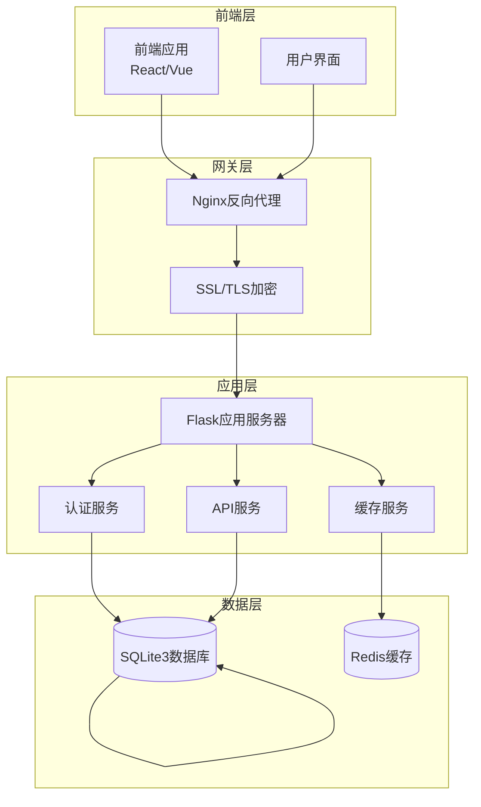

**图表来源**
- [企业网站CMS系统详细需求文档.md](file://企业网站CMS系统详细需求文档.md#L28-L57)
- [开发计划表_2月4日-2月12日.md](file://开发计划表_2月4日-2月12日.md#L92-L105)

**章节来源**
- [企业网站CMS系统详细需求文档.md](file://企业网站CMS系统详细需求文档.md#L22-L57)
- [开发计划表_2月4日-2月12日.md](file://开发计划表_2月4日-2月12日.md#L92-L105)

## 核心组件

### 认证与授权核心组件

系统采用JWT令牌机制，结合Flask-Login实现用户状态管理，支持多设备登录和自动登出功能。

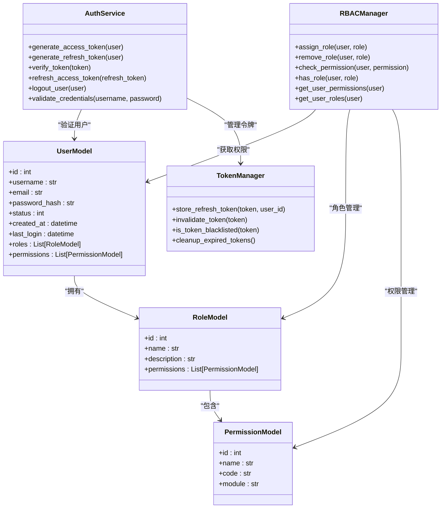

**图表来源**
- [企业网站CMS系统详细需求文档.md](file://企业网站CMS系统详细需求文档.md#L275-L282)
- [企业网站CMS系统详细需求文档.md](file://企业网站CMS系统详细需求文档.md#L716-L768)

**章节来源**
- [企业网站CMS系统详细需求文档.md](file://企业网站CMS系统详细需求文档.md#L271-L293)
- [企业网站CMS系统详细需求文档.md](file://企业网站CMS系统详细需求文档.md#L716-L768)

## 架构总览

系统采用JWT令牌驱动的身份验证架构，支持多设备登录和动态权限验证。

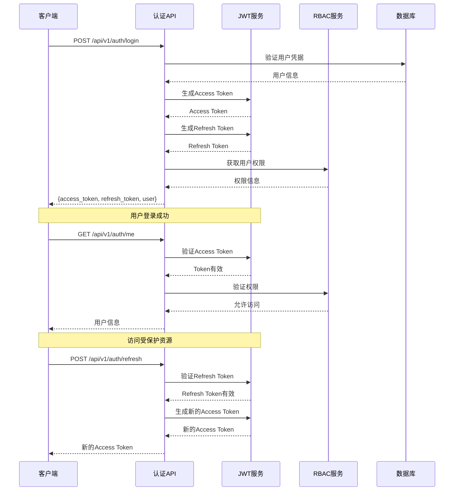

**图表来源**
- [企业网站CMS系统详细需求文档.md](file://企业网站CMS系统详细需求文档.md#L1002-L1011)
- [企业网站CMS系统详细需求文档.md](file://企业网站CMS系统详细需求文档.md#L1082-L1086)

## 详细组件分析

### JWT身份验证机制

#### Token生命周期管理

系统采用双Token机制，支持短期访问令牌和长期刷新令牌：

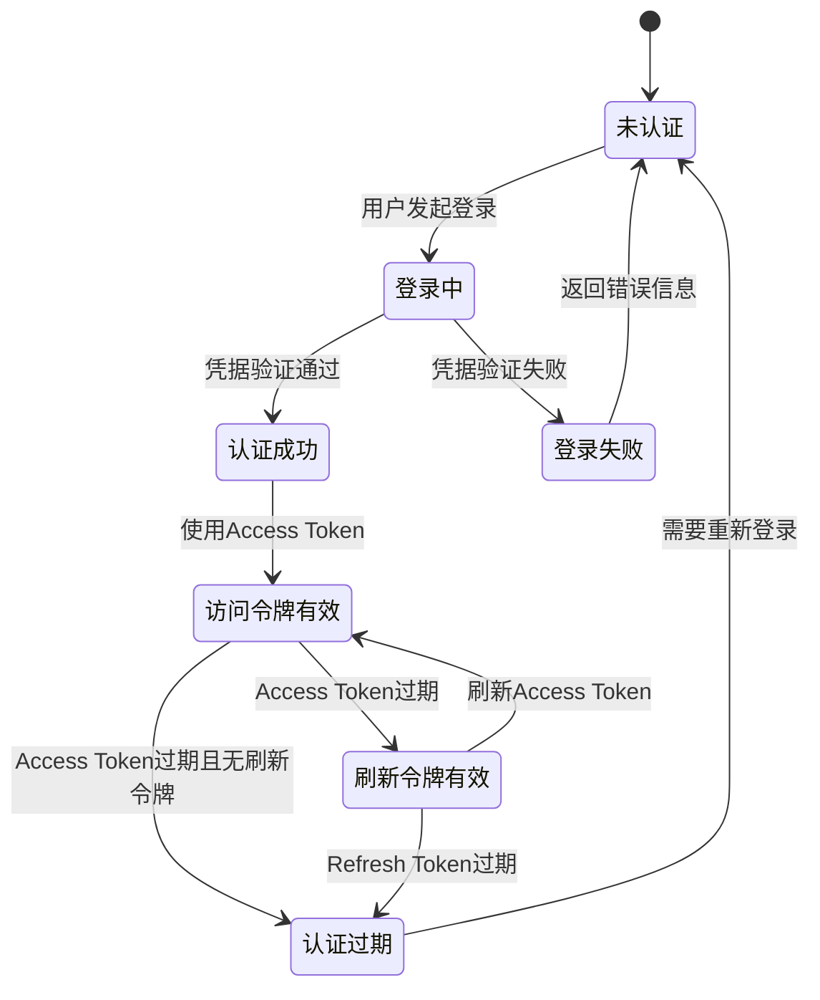

**图表来源**
- [企业网站CMS系统详细需求文档.md](file://企业网站CMS系统详细需求文档.md#L1082-L1086)

#### Token存储策略

系统支持多种Token存储方式：
- **LocalStorage**: 前端持久化存储，适合SPA应用
- **HttpOnly Cookie**: 服务器端存储，防止XSS攻击
- **内存存储**: 临时存储，适合无状态应用

**章节来源**
- [企业网站CMS系统详细需求文档.md](file://企业网站CMS系统详细需求文档.md#L1082-L1086)

### 密码加密策略

系统采用bcrypt算法进行密码加密，提供12轮成本因子，确保密码安全。

#### 密码加密流程

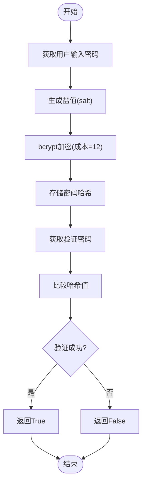

**图表来源**
- [企业网站CMS系统详细需求文档.md](file://企业网站CMS系统详细需求文档.md#L1088-L1092)

**章节来源**
- [企业网站CMS系统详细需求文档.md](file://企业网站CMS系统详细需求文档.md#L1088-L1092)

### RBAC权限模型

#### 角色层次结构

系统采用多级角色模型，支持角色继承和权限组合：

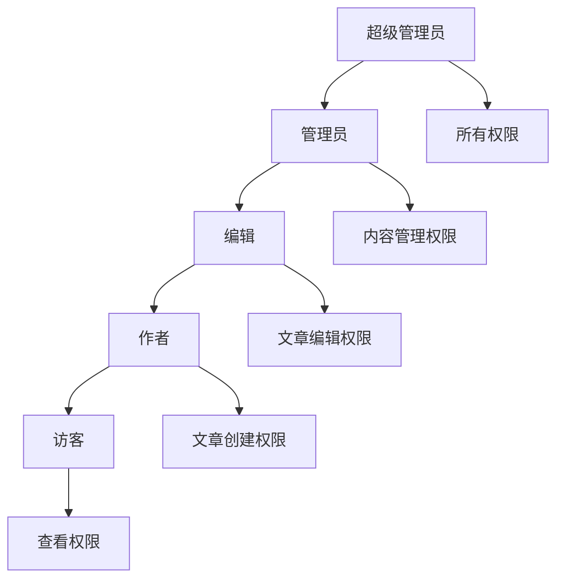

**图表来源**
- [企业网站CMS系统详细需求文档.md](file://企业网站CMS系统详细需求文档.md#L239-L265)

#### 权限分配机制

系统支持模块级、操作级和数据级权限控制：

| 权限级别 | 描述 | 示例 |
|---------|------|------|
| 模块级权限 | 控制对整个功能模块的访问 | 文章管理、用户管理 |
| 操作级权限 | 控制具体操作行为 | 创建、读取、更新、删除 |
| 数据级权限 | 控制对特定数据的访问 | 仅能操作自己的内容 |

**章节来源**
- [企业网站CMS系统详细需求文档.md](file://企业网站CMS系统详细需求文档.md#L266-L269)

### Flask-Login集成

#### 用户状态管理

系统使用Flask-Login管理用户会话状态：

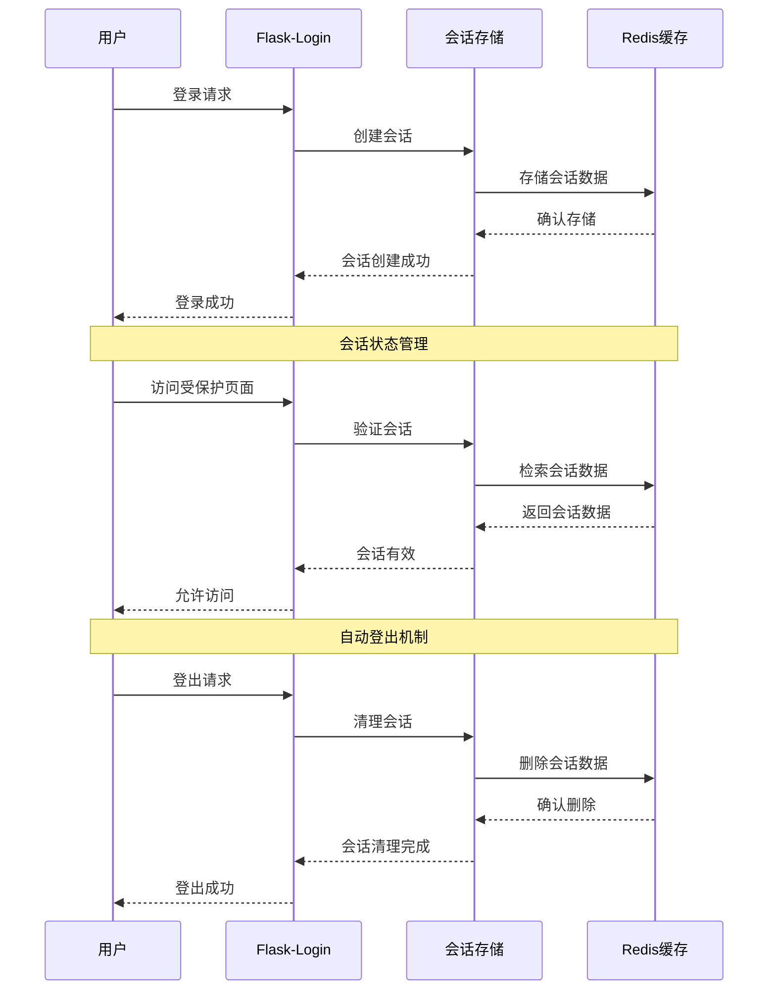

**图表来源**
- [开发计划表_2月4日-2月12日.md](file://开发计划表_2月4日-2月12日.md#L142-L148)

**章节来源**
- [开发计划表_2月4日-2月12日.md](file://开发计划表_2月4日-2月12日.md#L142-L148)

### 多设备登录管理

#### 设备识别与管理

系统支持多设备同时登录，通过设备指纹和会话管理实现：

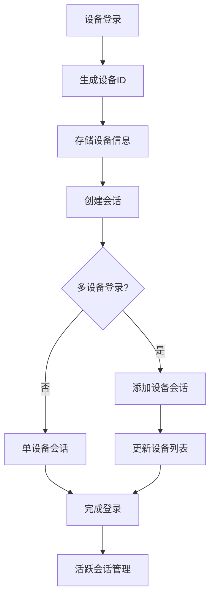

**图表来源**
- [企业网站CMS系统详细需求文档.md](file://企业网站CMS系统详细需求文档.md#L1096-L1097)

**章节来源**
- [企业网站CMS系统详细需求文档.md](file://企业网站CMS系统详细需求文档.md#L1096-L1097)

### API认证头格式

#### 认证请求头规范

系统采用标准的Bearer Token认证方式：

| 头部名称 | 值格式 | 用途 |
|---------|--------|------|
| Authorization | `Bearer <access_token>` | JWT访问令牌认证 |
| Content-Type | `application/json` | JSON请求体格式 |
| Accept | `application/json` | JSON响应格式 |

#### API响应格式

系统统一使用标准化的响应格式：

```json
{
  "code": 200,
  "message": "success",
  "data": {},
  "meta": {
    "timestamp": 1234567890,
    "request_id": "uuid"
  }
}
```

**章节来源**
- [企业网站CMS系统详细需求文档.md](file://企业网站CMS系统详细需求文档.md#L942-L972)

### Token刷新策略

#### 刷新机制设计

系统采用智能刷新策略，平衡用户体验和安全性：

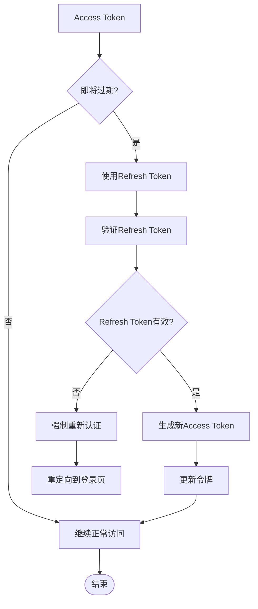

**图表来源**
- [企业网站CMS系统详细需求文档.md](file://企业网站CMS系统详细需求文档.md#L1082-L1086)

**章节来源**
- [企业网站CMS系统详细需求文档.md](file://企业网站CMS系统详细需求文档.md#L1082-L1086)

### 用户注册流程

#### 注册验证流程

系统提供完整的用户注册和邮箱验证流程：

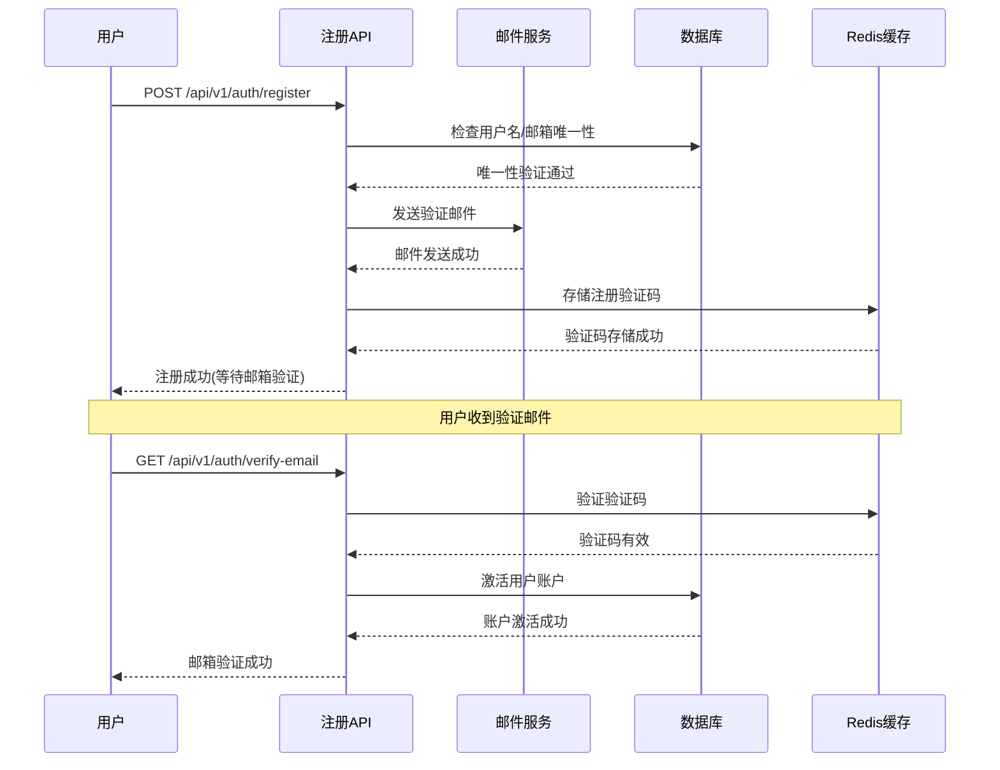

**图表来源**
- [开发计划表_2月4日-2月12日.md](file://开发计划表_2月4日-2月12日.md#L142-L147)

**章节来源**
- [开发计划表_2月4日-2月12日.md](file://开发计划表_2月4日-2月12日.md#L142-L147)

### 密码重置流程

#### 安全密码重置机制

系统提供安全的密码重置功能：

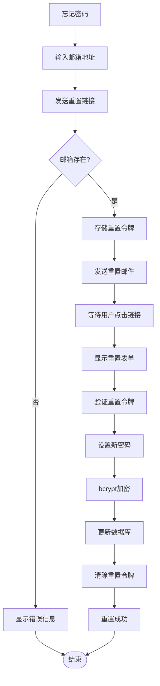

**图表来源**
- [企业网站CMS系统详细需求文档.md](file://企业网站CMS系统详细需求文档.md#L1088-L1092)

**章节来源**
- [企业网站CMS系统详细需求文档.md](file://企业网站CMS系统详细需求文档.md#L1088-L1092)

## 依赖关系分析

### 技术栈依赖

系统采用现代化的技术栈，各组件间依赖关系清晰：

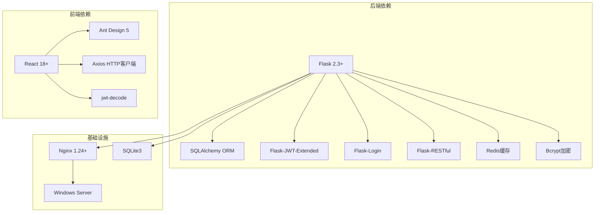

**图表来源**
- [企业网站CMS系统详细需求文档.md](file://企业网站CMS系统详细需求文档.md#L555-L594)

**章节来源**
- [企业网站CMS系统详细需求文档.md](file://企业网站CMS系统详细需求文档.md#L555-L594)

### 数据库设计

#### 核心数据表关系

系统采用规范化的关系数据库设计：

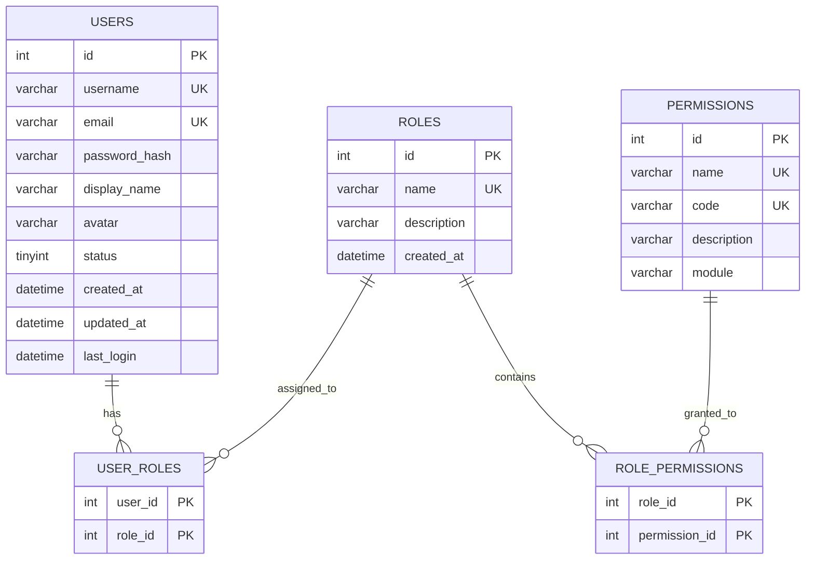

**图表来源**
- [企业网站CMS系统详细需求文档.md](file://企业网站CMS系统详细需求文档.md#L716-L768)

**章节来源**
- [企业网站CMS系统详细需求文档.md](file://企业网站CMS系统详细需求文档.md#L716-L768)

## 性能考虑

### 缓存策略

系统采用多层次缓存策略优化性能：

1. **Redis缓存**: 用户会话、API响应、页面缓存
2. **浏览器缓存**: 静态资源、图片缓存
3. **数据库查询缓存**: 频繁访问的数据

### 性能优化建议

- **JWT令牌缓存**: 在Redis中缓存用户权限信息
- **数据库连接池**: 配置合适的连接池大小
- **异步任务**: 使用Celery处理耗时操作
- **CDN加速**: 静态资源使用CDN分发

## 故障排除指南

### 常见认证问题

#### 登录失败排查

1. **检查用户名/密码是否正确**
2. **验证账户状态是否正常**
3. **检查密码哈希是否正确**
4. **确认JWT密钥配置**

#### Token过期问题

1. **检查Access Token有效期**
2. **验证Refresh Token是否过期**
3. **确认Token刷新机制**
4. **检查Redis连接状态**

#### 权限验证失败

1. **验证用户角色分配**
2. **检查权限映射关系**
3. **确认RBAC配置**
4. **调试权限检查逻辑**

**章节来源**
- [企业网站CMS系统详细需求文档.md](file://企业网站CMS系统详细需求文档.md#L1078-L1140)

## 结论

本项目实现了完整的认证与授权解决方案，采用JWT令牌机制和RBAC权限模型，支持多设备登录和动态权限验证。系统具有良好的安全性、可扩展性和易维护性，能够满足企业网站CMS系统的认证需求。

通过合理的架构设计和技术选型，系统能够在保证安全性的前提下提供优秀的用户体验，并为未来的功能扩展奠定了坚实的基础。