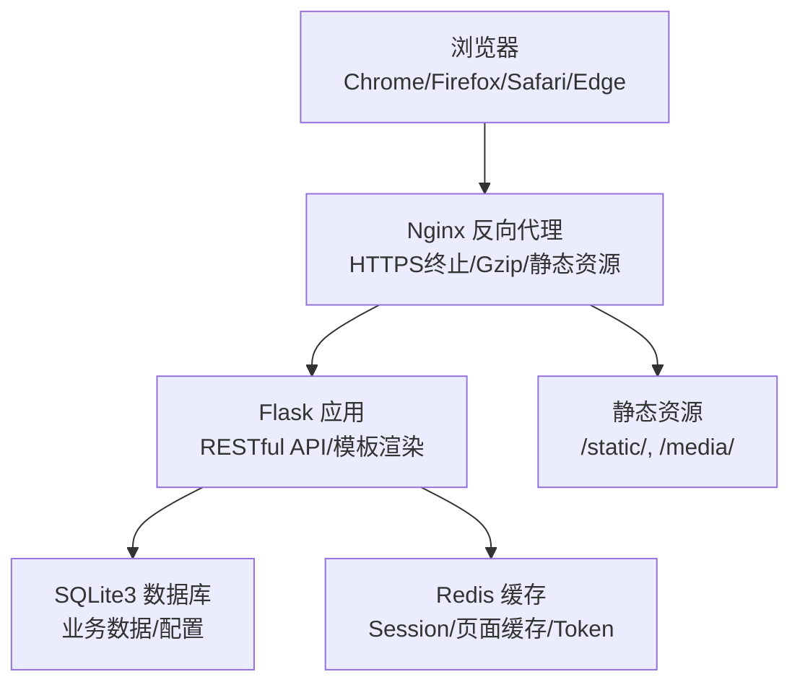
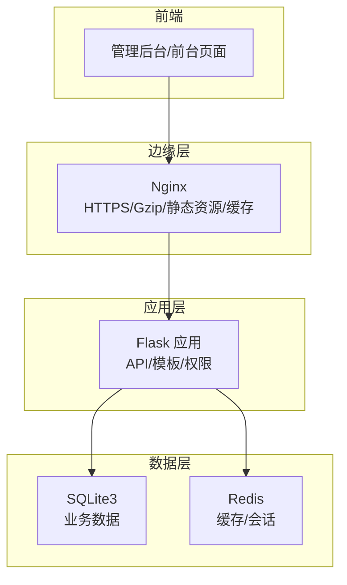
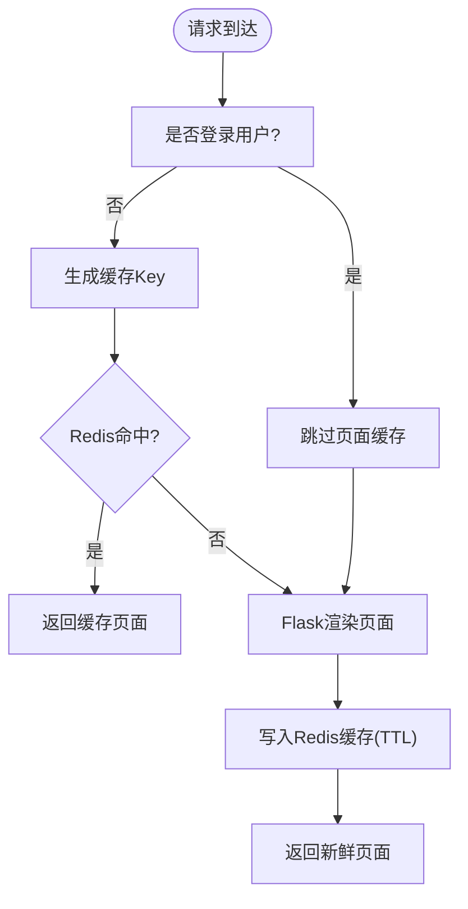
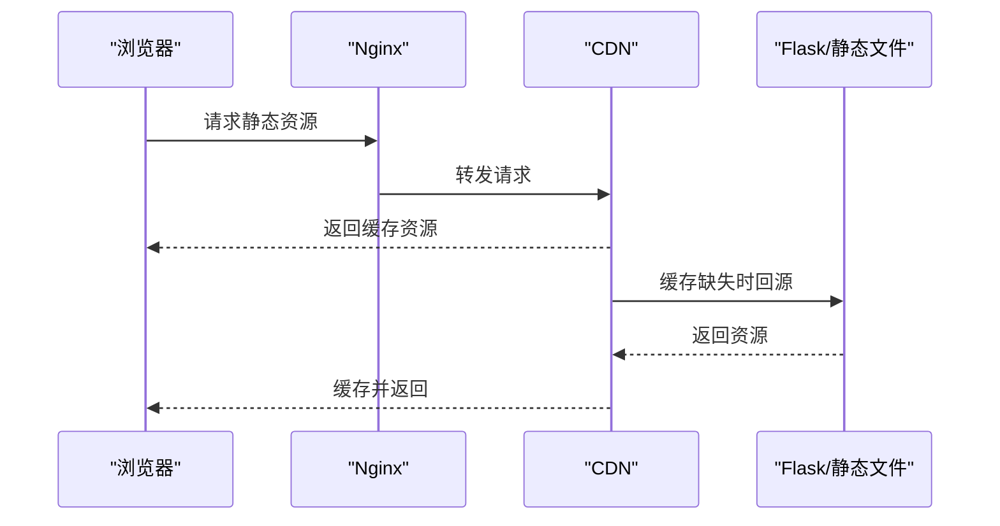
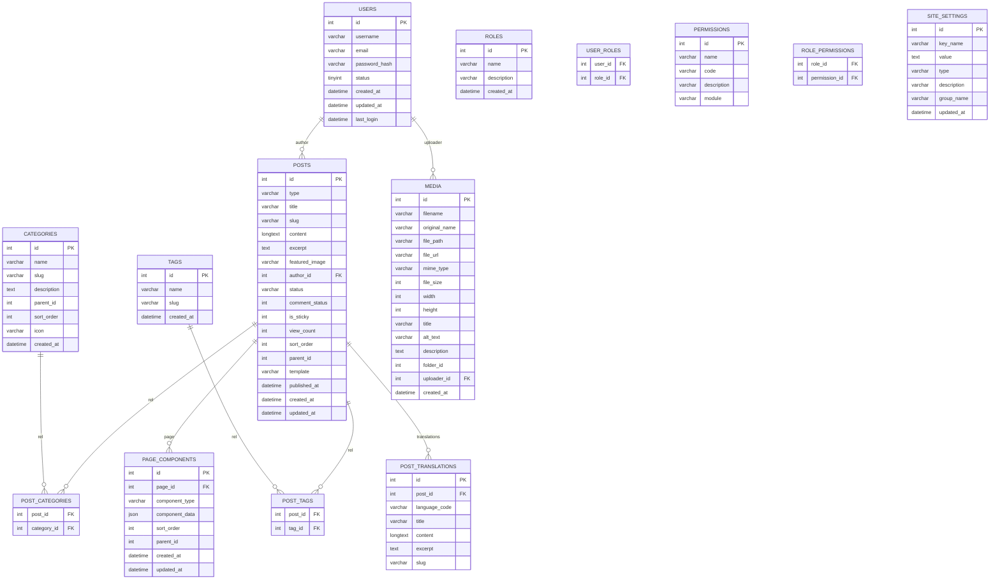
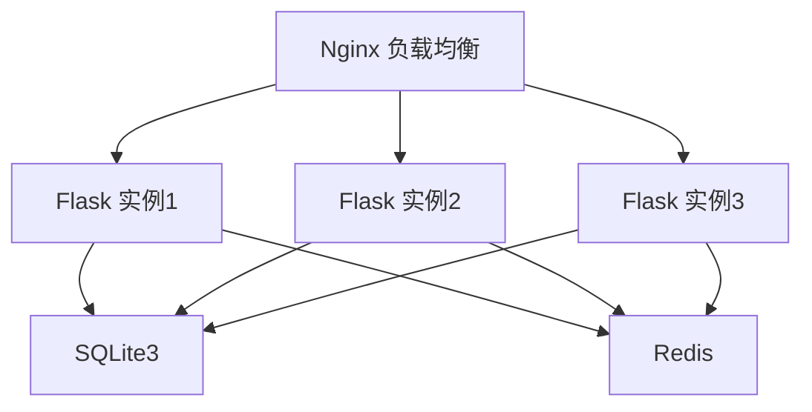
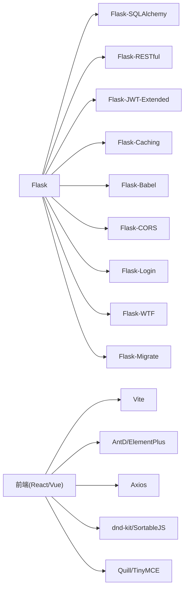

# 性能优化

<cite>
**本文引用的文件**
- [企业网站CMS系统开发需求文档.ini](file://企业网站CMS系统开发需求文档.ini)
- [企业网站CMS系统详细需求文档.md](file://企业网站CMS系统详细需求文档.md)
- [开发计划表_2月4日-2月12日.md](file://开发计划表_2月4日-2月12日.md)
</cite>

## 目录
1. [引言](#引言)
2. [项目结构](#项目结构)
3. [核心组件](#核心组件)
4. [架构总览](#架构总览)
5. [详细组件分析](#详细组件分析)
6. [依赖分析](#依赖分析)
7. [性能考量](#性能考量)
8. [故障排除指南](#故障排除指南)
9. [结论](#结论)
10. [附录](#附录)

## 引言
本性能优化文档面向企业网站CMS系统，聚焦于系统在当前技术栈（Python Flask + Nginx + Windows Server）下的性能策略、优化技术与监控方法。文档基于需求文档与开发计划，结合实际部署环境与MVP阶段的约束，给出可落地的缓存策略、数据库优化、前端性能优化、CDN与懒加载、监控与测试方法，并延伸至负载均衡、水平扩展与高可用设计建议，辅以故障排除与最佳实践。

## 项目结构
系统采用前后端分离架构，后端使用Flask提供RESTful API，前端可选React/Vue或纯HTML模板渲染；Nginx作为反向代理与静态资源服务，承担HTTPS终止、Gzip压缩、负载均衡与静态资源缓存；数据库采用SQLite3（MVP阶段），Redis可选用于缓存与Session。

图表来源
- [企业网站CMS系统详细需求文档.md](file://企业网站CMS系统详细需求文档.md#L22-L57)
- [开发计划表_2月4日-2月12日.md](file://开发计划表_2月4日-2月12日.md#L440-L506)

章节来源
- [企业网站CMS系统详细需求文档.md](file://企业网站CMS系统详细需求文档.md#L22-L57)
- [开发计划表_2月4日-2月12日.md](file://开发计划表_2月4日-2月12日.md#L440-L506)

## 核心组件
- 后端服务（Flask）
  - RESTful API、模板渲染、权限控制、业务逻辑处理
  - 配置文件集中管理数据库、Redis、JWT、CORS、分页等
- 反向代理（Nginx）
  - 静态资源服务、Gzip压缩、HTTPS终止、负载均衡、缓存头设置
- 数据库（SQLite3）
  - 单文件数据库，零配置，适合中小规模读多写少场景
- 缓存（Redis，可选）
  - Session、页面缓存、Token、Flask-Caching
- 前端（React/Vue或纯HTML模板）
  - 管理后台界面、可视化编辑器、前台展示页面

章节来源
- [企业网站CMS系统详细需求文档.md](file://企业网站CMS系统详细需求文档.md#L555-L628)
- [开发计划表_2月4日-2月12日.md](file://开发计划表_2月4日-2月12日.md#L92-L105)

## 架构总览
系统采用“浏览器 → Nginx → Flask → SQLite/Redis”的典型三层架构。Nginx负责入口流量治理与静态资源加速；Flask提供API与模板渲染；SQLite承载业务数据，Redis可选用于缓存与会话。

图表来源
- [企业网站CMS系统详细需求文档.md](file://企业网站CMS系统详细需求文档.md#L22-L57)
- [企业网站CMS系统详细需求文档.md](file://企业网站CMS系统详细需求文档.md#L1144-L1230)

## 详细组件分析

### 缓存策略与Redis集成
- 页面缓存
  - 使用Redis缓存全页面输出，针对未登录用户的静态页面进行缓存，登录用户不缓存
  - 支持缓存预热与失效策略（基于Key命名规范与TTL）
- 数据缓存
  - API响应缓存、查询结果缓存，Key命名规范统一，避免冲突
- 静态资源缓存
  - Nginx设置浏览器缓存头（Expires/Cache-Control），配合版本号/哈希策略
- Session与Token
  - Session存储在Redis，Token过期时间合理配置，支持刷新机制

图表来源
- [企业网站CMS系统详细需求文档.md](file://企业网站CMS系统详细需求文档.md#L514-L529)
- [企业网站CMS系统详细需求文档.md](file://企业网站CMS系统详细需求文档.md#L1234-L1302)

章节来源
- [企业网站CMS系统详细需求文档.md](file://企业网站CMS系统详细需求文档.md#L514-L529)
- [企业网站CMS系统详细需求文档.md](file://企业网站CMS系统详细需求文档.md#L1234-L1302)

### 资源优化：图片懒加载与CDN
- 图片懒加载
  - 前端采用Intersection Observer实现图片懒加载，减少首屏渲染压力
  - 响应式图片srcset与WebP格式支持，提升加载性能
- CDN集成
  - 配置CDN域名，静态资源与媒体资源走CDN，缩短访问距离
  - CDN缓存刷新策略，避免陈旧内容

图表来源
- [企业网站CMS系统详细需求文档.md](file://企业网站CMS系统详细需求文档.md#L530-L537)
- [开发计划表_2月4日-2月12日.md](file://开发计划表_2月4日-2月12日.md#L465-L487)

章节来源
- [企业网站CMS系统详细需求文档.md](file://企业网站CMS系统详细需求文档.md#L530-L537)
- [开发计划表_2月4日-2月12日.md](file://开发计划表_2月4日-2月12日.md#L465-L487)

### 数据库优化：查询优化与索引设计
- 索引优化
  - 针对高频查询列建立索引（如文章表的type/status、slug、published_at）
  - 分类表parent_id建立索引，支持树形查询
  - 媒体表mime_type、folder_id建立索引，提升筛选性能
- 查询优化
  - 避免N+1查询，使用select_in_bulk或join一次性获取关联数据
  - 使用分页与LIMIT，避免一次性返回大量数据
- SQLite特性
  - WAL模式提升并发读取性能
  - FTS5虚拟表实现全文检索，配合触发器保持同步

图表来源
- [企业网站CMS系统详细需求文档.md](file://企业网站CMS系统详细需求文档.md#L716-L904)

章节来源
- [企业网站CMS系统详细需求文档.md](file://企业网站CMS系统详细需求文档.md#L716-L904)

### 前端性能优化：代码分割与资源压缩
- 代码分割
  - 前端使用Vite构建，按需加载模块，减少首屏体积
- 资源压缩
  - JS/CSS压缩合并，关键CSS内联，异步加载非关键资源
- 懒加载与骨架屏
  - 图片懒加载、组件懒加载、骨架屏提升感知性能

章节来源
- [开发计划表_2月4日-2月12日.md](file://开发计划表_2月4日-2月12日.md#L280-L360)
- [企业网站CMS系统详细需求文档.md](file://企业网站CMS系统详细需求文档.md#L530-L537)

### 性能监控指标与测试方法
- 监控指标
  - 页面加载时间（首屏/全页）、API响应时间、数据库查询耗时、缓存命中率、错误率
- 测试方法
  - 压力测试（JMeter/Locust）、端到端测试（Playwright/Cypress）、性能回归测试
- 日志与告警
  - Nginx访问/错误日志、Flask应用日志、Redis/数据库慢查询日志、告警阈值设置

章节来源
- [企业网站CMS系统详细需求文档.md](file://企业网站CMS系统详细需求文档.md#L1362-L1380)
- [开发计划表_2月4日-2月12日.md](file://开发计划表_2月4日-2月12日.md#L439-L506)

### 负载均衡、水平扩展与高可用
- 负载均衡
  - Nginx实现反向代理与负载均衡，支持多实例部署
- 水平扩展
  - 多Flask实例横向扩展，Redis作为共享缓存与会话存储
- 高可用
  - Windows服务（NSSM）或Linux systemd守护进程，自动重启；数据库与缓存健康检查；CDN与静态资源冗余

图表来源
- [企业网站CMS系统详细需求文档.md](file://企业网站CMS系统详细需求文档.md#L1144-L1230)
- [开发计划表_2月4日-2月12日.md](file://开发计划表_2月4日-2月12日.md#L489-L506)

章节来源
- [企业网站CMS系统详细需求文档.md](file://企业网站CMS系统详细需求文档.md#L1144-L1230)
- [开发计划表_2月4日-2月12日.md](file://开发计划表_2月4日-2月12日.md#L489-L506)

## 依赖分析
- Flask生态
  - Flask-SQLAlchemy、Flask-Migrate、Flask-Login、Flask-WTF、Flask-CORS、Flask-RESTful、Flask-Caching、Flask-Babel、Flask-JWT-Extended
- 前端生态
  - React/Vue + Vite + Ant Design/Element Plus + Axios + dnd-kit/SortableJS + Quill/TinyMCE
- 基础设施
  - Nginx、SQLite3、Redis、Waitress/NSSM、Docker（可选）

图表来源
- [企业网站CMS系统详细需求文档.md](file://企业网站CMS系统详细需求文档.md#L555-L628)

章节来源
- [企业网站CMS系统详细需求文档.md](file://企业网站CMS系统详细需求文档.md#L555-L628)

## 性能考量
- 响应时间目标
  - 首页加载 < 2秒，内页 < 3秒，API < 500ms，数据库查询 < 100ms
- 并发与资源占用
  - 支持1000+并发用户，内存使用 < 2GB，CPU < 70%，磁盘IO < 80%
- 资源优化
  - 图片懒加载、响应式图片、WebP、Gzip压缩、CDN、版本化缓存
- 数据库与缓存
  - 合理索引、查询优化、Redis缓存、WAL模式、慢查询日志

章节来源
- [企业网站CMS系统详细需求文档.md](file://企业网站CMS系统详细需求文档.md#L1362-L1380)
- [开发计划表_2月4日-2月12日.md](file://开发计划表_2月4日-2月12日.md#L715-L721)

## 故障排除指南
- 部署问题
  - Windows环境：使用Waitress或NSSM注册服务；确保端口开放与防火墙配置
  - Nginx：检查代理配置、静态资源路径、Gzip与缓存头设置
- 性能问题
  - 页面加载慢：启用Redis缓存、优化数据库索引、启用CDN与Gzip
  - API响应慢：检查慢查询日志、连接池配置、限流策略
- 缓存异常
  - 缓存未生效：核对Key命名规范、TTL设置、登录用户不缓存策略
- 数据库问题
  - SQLite写入阻塞：启用WAL模式、减少不必要的写事务、优化索引
- 前端问题
  - 图片不加载：检查CDN域名、懒加载实现、跨域与CSP策略

章节来源
- [开发计划表_2月4日-2月12日.md](file://开发计划表_2月4日-2月12日.md#L440-L506)
- [企业网站CMS系统详细需求文档.md](file://企业网站CMS系统详细需求文档.md#L1144-L1230)

## 结论
本CMS系统在MVP阶段采用Flask+SQLite+Redis+Nginx的轻量架构，具备良好的可维护性与部署简易性。通过合理的缓存策略、数据库索引优化、前端资源优化与CDN集成，可满足中小规模网站的性能与可用性要求。随着业务增长，可逐步引入Redis集群、数据库读写分离、容器化与微服务化，以及更完善的监控与告警体系，持续提升系统性能与稳定性。

## 附录
- 性能测试建议
  - 使用Locust/JMeter进行并发测试，覆盖登录、文章列表、媒体上传等关键路径
- 最佳实践
  - 缓存Key命名规范、TTL策略、登录用户不缓存
  - 数据库索引与查询优化、WAL模式、慢查询日志
  - 前端资源压缩、懒加载、关键CSS内联
  - Nginx Gzip与缓存头、CDN与版本化缓存
- 后续优化（V2）
  - 更丰富的可视化组件、多语言支持、高级SEO、评论系统、搜索优化
  - Redis缓存集成、CDN配置、图片懒加载、数据库查询优化

章节来源
- [开发计划表_2月4日-2月12日.md](file://开发计划表_2月4日-2月12日.md#L731-L752)
- [企业网站CMS系统详细需求文档.md](file://企业网站CMS系统详细需求文档.md#L1362-L1380)