# 性能监控

<cite>
**本文档引用的文件**
- [企业网站CMS系统开发需求文档.ini](file://企业网站CMS系统开发需求文档.ini)
- [企业网站CMS系统详细需求文档.md](file://企业网站CMS系统详细需求文档.md)
- [开发计划表_2月4日-2月12日.md](file://开发计划表_2月4日-2月12日.md)
</cite>

## 目录
1. [简介](#简介)
2. [项目结构](#项目结构)
3. [核心组件](#核心组件)
4. [架构总览](#架构总览)
5. [详细组件分析](#详细组件分析)
6. [依赖关系分析](#依赖关系分析)
7. [性能考量](#性能考量)
8. [故障排查指南](#故障排查指南)
9. [结论](#结论)
10. [附录](#附录)

## 简介
本性能监控文档面向企业网站CMS系统，基于Python Flask + Nginx + Windows Server的技术栈，提供从页面加载时间、首屏渲染时间、用户交互延迟到API响应时间、数据库查询性能、内存使用情况和CPU负载的全方位监控方案。文档涵盖前端性能监控、后端性能监控、性能测试方法、瓶颈分析与优化建议、故障排查流程以及Nginx、Flask应用、Redis缓存的具体监控实施方案，并提供监控工具配置、告警机制设置和性能报告生成的实践指导。

## 项目结构
CMS系统采用前后端分离架构，Nginx作为反向代理和静态资源服务，Flask应用提供RESTful API和模板渲染，SQLite数据库存储业务数据，Redis用于缓存（可选）。系统部署于Windows Server环境，使用Waitress或Gunicorn作为WSGI服务器。

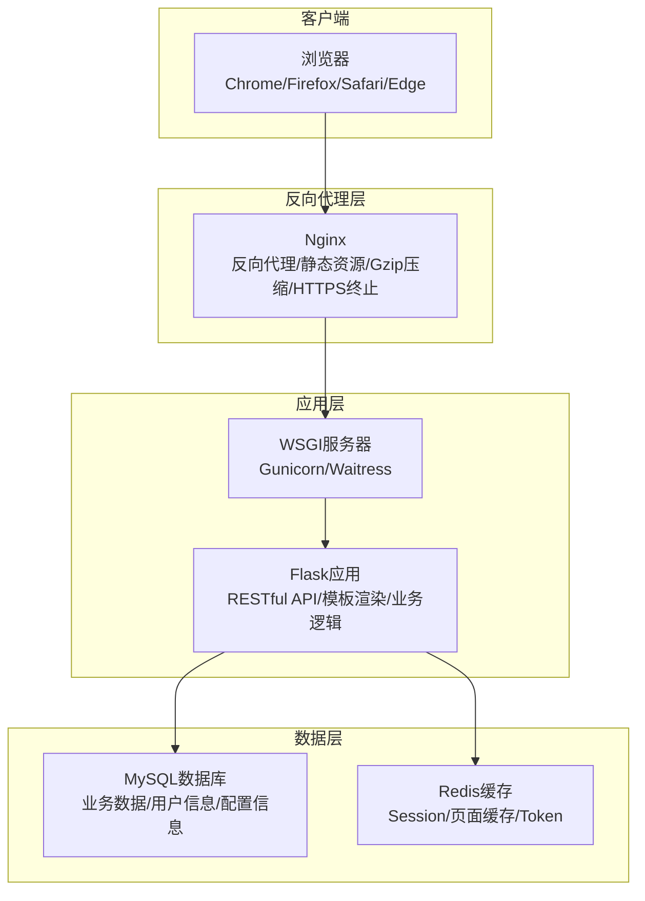

**图表来源**
- [企业网站CMS系统详细需求文档.md](file://企业网站CMS系统详细需求文档.md#L22-L57)
- [开发计划表_2月4日-2月12日.md](file://开发计划表_2月4日-2月12日.md#L441-L506)

**章节来源**
- [企业网站CMS系统详细需求文档.md](file://企业网站CMS系统详细需求文档.md#L22-L57)
- [开发计划表_2月4日-2月12日.md](file://开发计划表_2月4日-2月12日.md#L441-L506)

## 核心组件
- **前端性能监控**：页面加载时间、首屏渲染时间、用户交互延迟、资源加载性能
- **后端性能监控**：API响应时间、数据库查询性能、内存使用情况、CPU负载监控
- **基础设施监控**：Nginx性能监控、Flask应用监控、Redis缓存监控
- **性能测试**：压力测试、负载测试、性能基准测试
- **告警与报告**：监控工具配置、告警机制设置、性能报告生成

**章节来源**
- [企业网站CMS系统开发需求文档.ini](file://企业网站CMS系统开发需求文档.ini#L100-L104)
- [企业网站CMS系统详细需求文档.md](file://企业网站CMS系统详细需求文档.md#L512-L548)

## 架构总览
系统采用轻量级架构，适合中小型企业网站。前端使用React/Vue，后端提供RESTful API；Nginx负责反向代理、静态资源服务和Gzip压缩；Flask应用处理业务逻辑；SQLite数据库存储数据，Redis用于缓存（可选）。

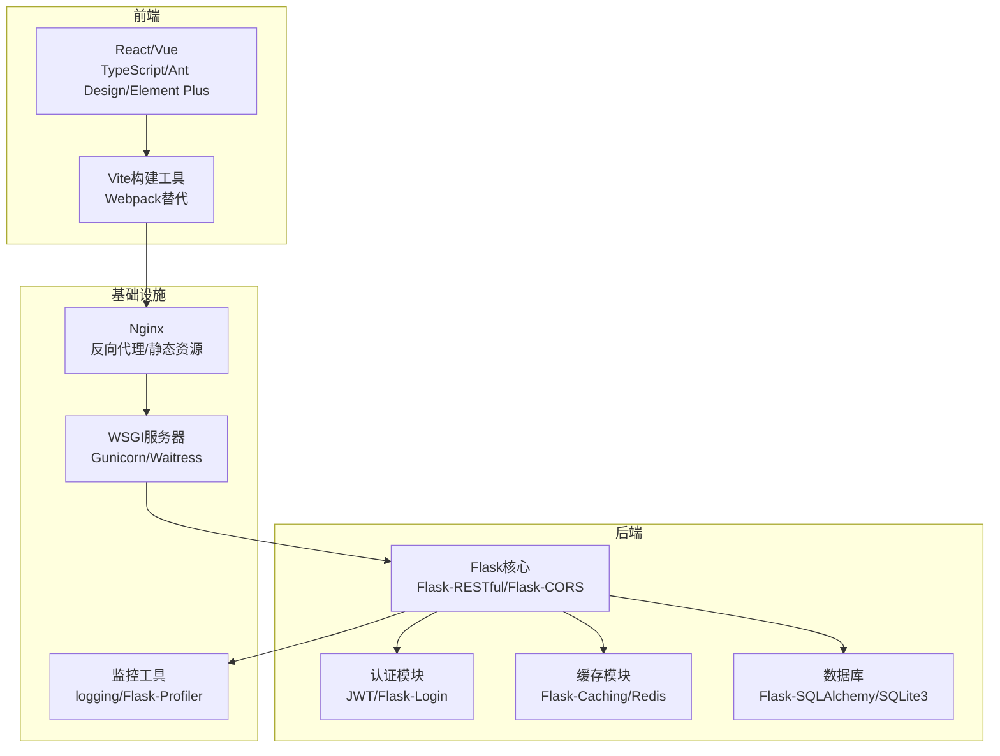

**图表来源**
- [企业网站CMS系统详细需求文档.md](file://企业网站CMS系统详细需求文档.md#L555-L659)

**章节来源**
- [企业网站CMS系统详细需求文档.md](file://企业网站CMS系统详细需求文档.md#L555-L659)

## 详细组件分析

### 前端性能监控方案
前端性能监控重点关注用户体验的关键指标，包括页面加载时间、首屏渲染时间、用户交互延迟和资源加载性能。

#### 页面加载时间监控
页面加载时间是衡量前端性能的核心指标，应监控从用户发起请求到页面完全可交互的时间。

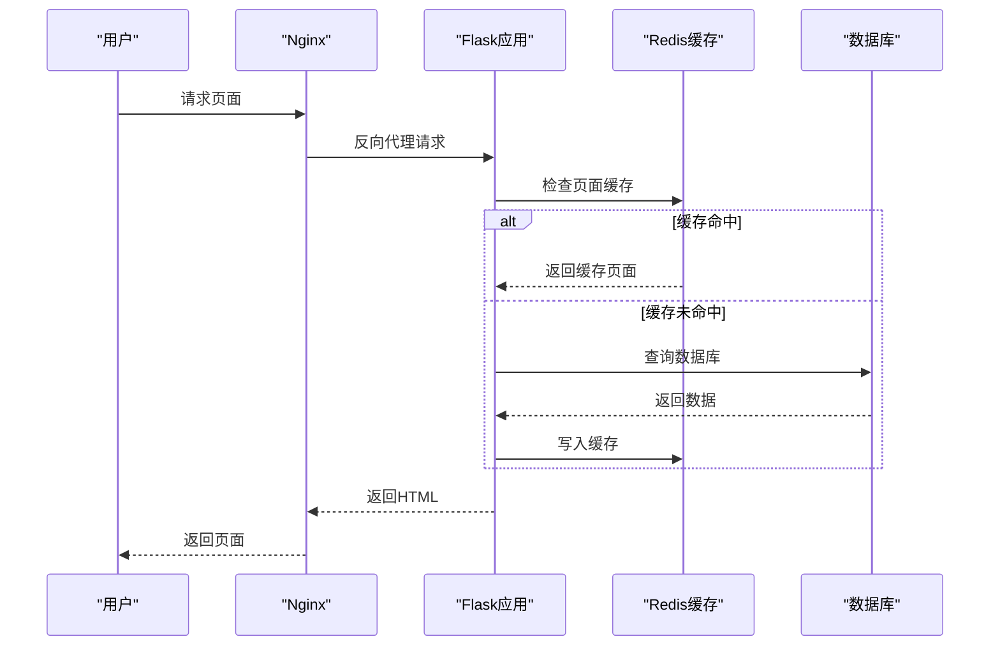

**图表来源**
- [企业网站CMS系统详细需求文档.md](file://企业网站CMS系统详细需求文档.md#L514-L529)

#### 首屏渲染时间监控
首屏渲染时间指页面主要内容首次呈现的时间，对用户体验至关重要。

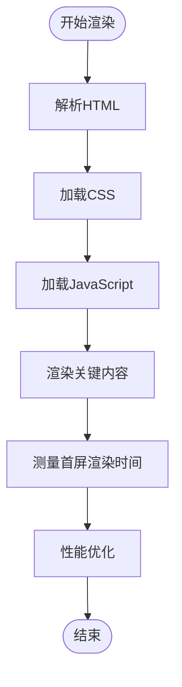

**图表来源**
- [企业网站CMS系统详细需求文档.md](file://企业网站CMS系统详细需求文档.md#L530-L536)

#### 用户交互延迟监控
用户交互延迟监控包括点击响应时间、滚动响应时间等，确保用户操作的即时反馈。

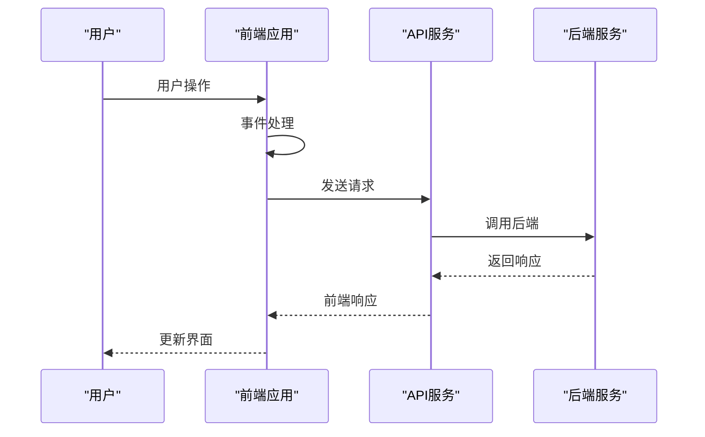

**图表来源**
- [开发计划表_2月4日-2月12日.md](file://开发计划表_2月4日-2月12日.md#L150-L174)

#### 资源加载性能监控
资源加载性能监控包括图片懒加载、响应式图片、CDN加速等优化措施的效果评估。

**章节来源**
- [企业网站CMS系统详细需求文档.md](file://企业网站CMS系统详细需求文档.md#L530-L548)
- [开发计划表_2月4日-2月12日.md](file://开发计划表_2月4日-2月12日.md#L150-L174)

### 后端性能监控方案
后端性能监控涵盖API响应时间、数据库查询性能、内存使用情况和CPU负载监控。

#### API响应时间监控
API响应时间是后端性能的关键指标，应监控各个端点的响应时间分布。

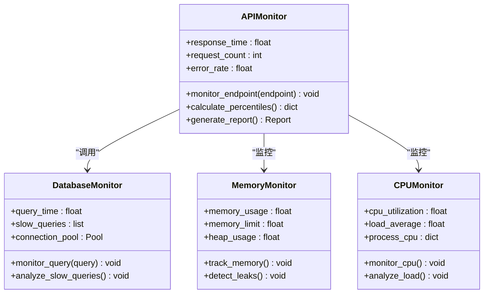

**图表来源**
- [企业网站CMS系统详细需求文档.md](file://企业网站CMS系统详细需求文档.md#L538-L542)

#### 数据库查询性能监控
数据库查询性能监控重点关注慢查询、连接池使用情况和索引使用效果。

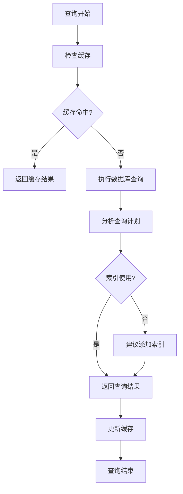

**图表来源**
- [企业网站CMS系统详细需求文档.md](file://企业网站CMS系统详细需求文档.md#L538-L542)

#### 内存使用情况监控
内存使用监控包括堆内存使用、对象生命周期管理和内存泄漏检测。

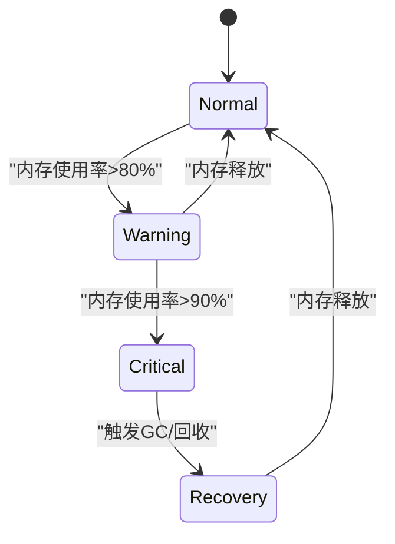

**图表来源**
- [企业网站CMS系统详细需求文档.md](file://企业网站CMS系统详细需求文档.md#L538-L542)

**章节来源**
- [企业网站CMS系统详细需求文档.md](file://企业网站CMS系统详细需求文档.md#L538-L542)

### 性能测试方法
性能测试包括压力测试、负载测试和性能基准测试，确保系统在各种场景下的稳定性。

#### 压力测试
压力测试用于确定系统的最大承载能力，识别性能瓶颈。

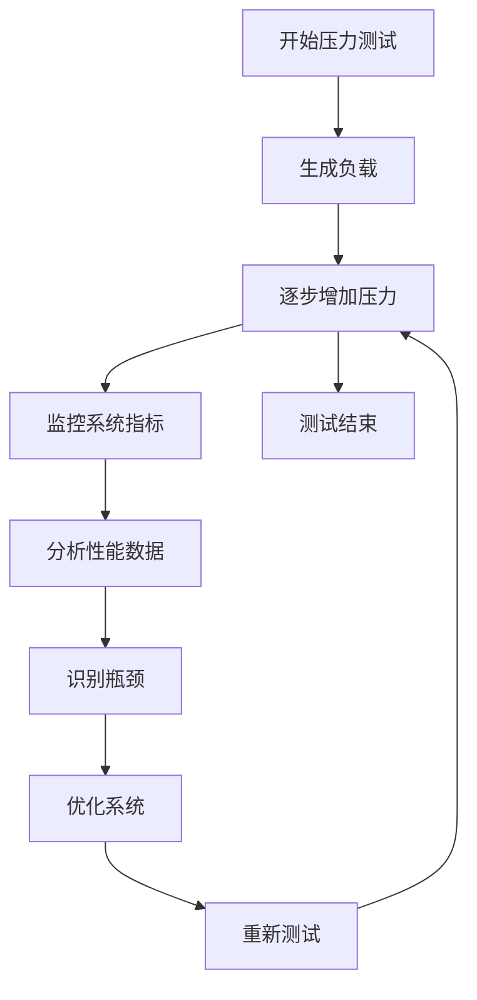

**图表来源**
- [开发计划表_2月4日-2月12日.md](file://开发计划表_2月4日-2月12日.md#L715-L720)

#### 负载测试
负载测试模拟真实用户行为，验证系统在预期负载下的表现。

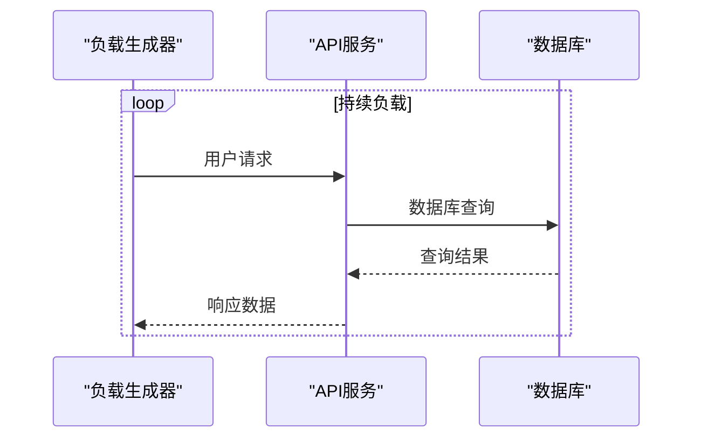

**图表来源**
- [开发计划表_2月4日-2月12日.md](file://开发计划表_2月4日-2月12日.md#L715-L720)

#### 性能基准测试
性能基准测试建立系统性能基线，便于后续对比和优化。

**章节来源**
- [开发计划表_2月4日-2月12日.md](file://开发计划表_2月4日-2月12日.md#L715-L720)

### 监控工具配置
监控工具配置包括日志记录、性能监控和错误追踪的设置。

#### 日志配置
系统使用Python logging模块配合RotatingFileHandler进行日志管理。

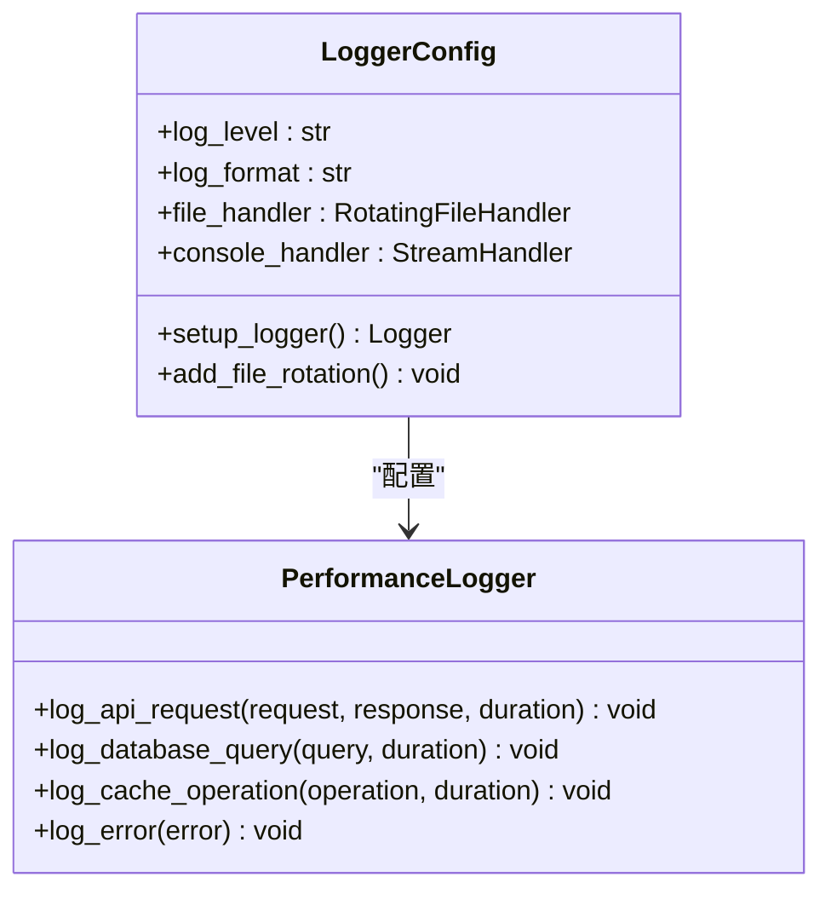

**图表来源**
- [企业网站CMS系统详细需求文档.md](file://企业网站CMS系统详细需求文档.md#L655-L658)

#### Flask性能监控
Flask应用可使用Flask-Profiler进行性能分析，或通过中间件收集性能数据。

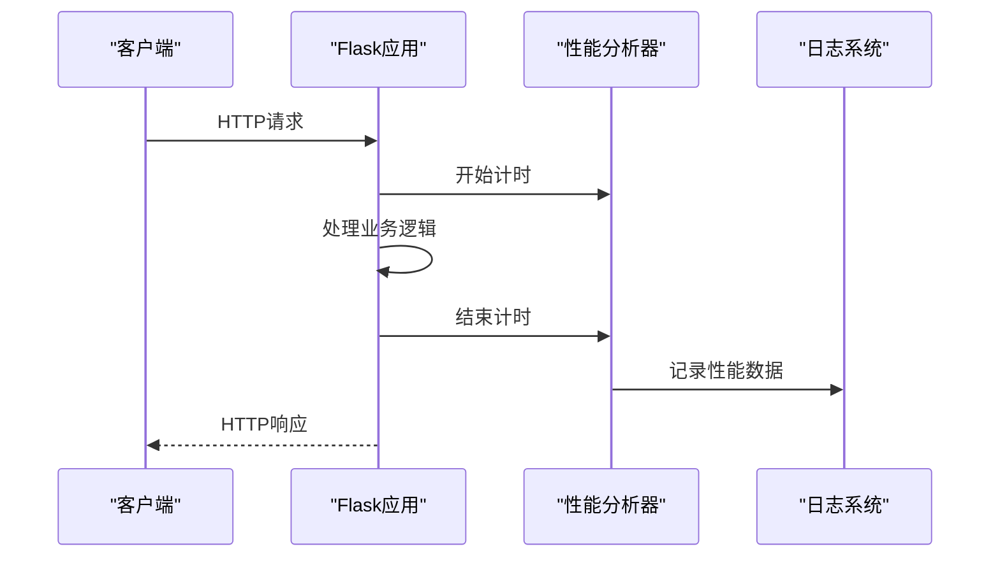

**图表来源**
- [企业网站CMS系统详细需求文档.md](file://企业网站CMS系统详细需求文档.md#L655-L658)

**章节来源**
- [企业网站CMS系统详细需求文档.md](file://企业网站CMS系统详细需求文档.md#L655-L658)

### 告警机制设置
告警机制设置包括阈值设定、告警渠道配置和自动化响应流程。

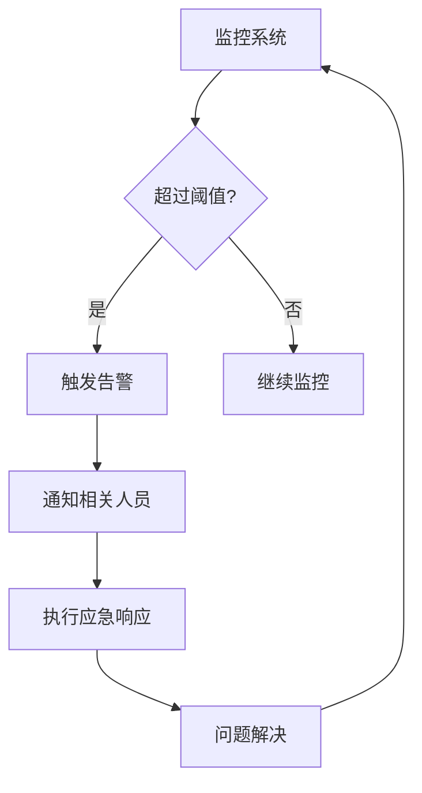

**图表来源**
- [开发计划表_2月4日-2月12日.md](file://开发计划表_2月4日-2月12日.md#L715-L720)

### 性能报告生成
性能报告生成包括数据收集、指标计算和报告输出的完整流程。

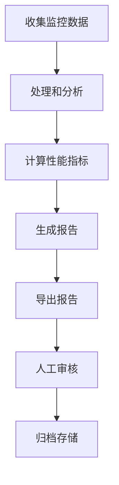

**图表来源**
- [开发计划表_2月4日-2月12日.md](file://开发计划表_2月4日-2月12日.md#L542-L565)

**章节来源**
- [开发计划表_2月4日-2月12日.md](file://开发计划表_2月4日-2月12日.md#L542-L565)

## 依赖关系分析
系统各组件之间的依赖关系清晰，前端通过Nginx访问后端API，后端依赖数据库和缓存服务。

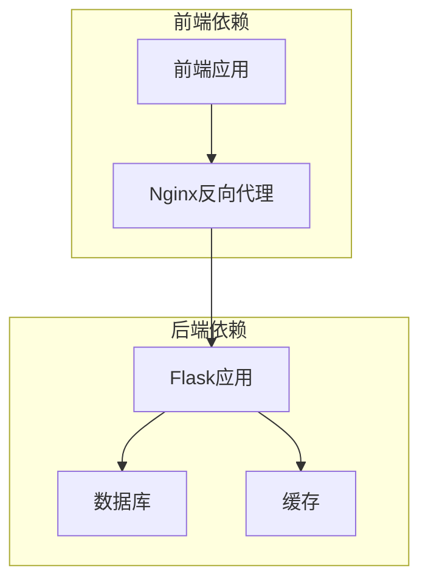

**图表来源**
- [企业网站CMS系统详细需求文档.md](file://企业网站CMS系统详细需求文档.md#L22-L57)

**章节来源**
- [企业网站CMS系统详细需求文档.md](file://企业网站CMS系统详细需求文档.md#L22-L57)

## 性能考量
基于项目需求文档中的性能要求，系统需要满足页面加载时间小于3秒、并发用户支持大于1000、数据库查询响应小于100ms等指标。

### 性能指标定义
- **页面加载时间**: 从请求到页面完全可交互的时间
- **API响应时间**: 从请求到响应返回的时间
- **数据库查询时间**: 单次查询的执行时间
- **内存使用率**: 应用进程的内存占用比例
- **CPU利用率**: 服务器的CPU使用百分比

### 性能优化策略
- **缓存策略**: 页面缓存、数据缓存、静态资源缓存
- **资源优化**: 图片懒加载、响应式图片、CDN加速
- **数据库优化**: 索引优化、查询优化、连接池配置
- **前端优化**: 关键CSS内联、异步加载非关键资源

**章节来源**
- [企业网站CMS系统开发需求文档.ini](file://企业网站CMS系统开发需求文档.ini#L100-L104)
- [企业网站CMS系统详细需求文档.md](file://企业网站CMS系统详细需求文档.md#L512-L548)

## 故障排查指南
故障排查流程包括问题定位、根因分析和解决方案实施。

### 常见性能问题诊断
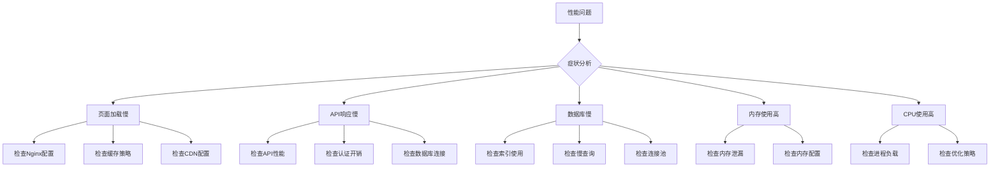

### 故障排查步骤
1. **问题确认**: 明确性能问题的具体表现
2. **数据收集**: 收集相关监控指标和日志
3. **根因分析**: 分析可能的原因和影响因素
4. **解决方案**: 制定并实施优化方案
5. **验证测试**: 验证优化效果
6. **预防措施**: 建立预防机制

**章节来源**
- [开发计划表_2月4日-2月12日.md](file://开发计划表_2月4日-2月12日.md#L755-L785)

## 结论
本性能监控文档为CMS系统提供了全面的监控方案，涵盖了前端和后端的性能监控指标、监控工具配置、告警机制设置和性能测试方法。通过实施这些监控措施，可以有效保障系统的性能稳定性和用户体验。建议在实际部署中结合具体的业务场景和硬件环境，持续优化监控策略和性能指标。

## 附录

### 监控指标清单
- **前端指标**: 页面加载时间、首屏渲染时间、交互延迟、资源加载时间
- **后端指标**: API响应时间、数据库查询时间、内存使用率、CPU利用率
- **基础设施指标**: Nginx请求处理时间、连接数、错误率

### 告警阈值建议
- **页面加载时间**: >3秒
- **API响应时间**: >500ms
- **数据库查询时间**: >100ms
- **内存使用率**: >80%
- **CPU利用率**: >85%

### 性能优化检查清单
- [ ] 缓存策略优化
- [ ] 数据库索引检查
- [ ] 前端资源压缩
- [ ] CDN配置检查
- [ ] 连接池参数调优