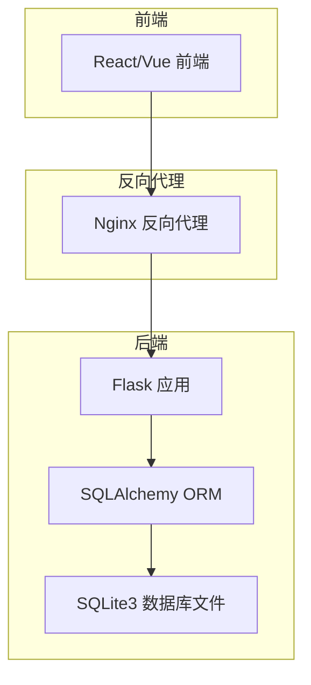
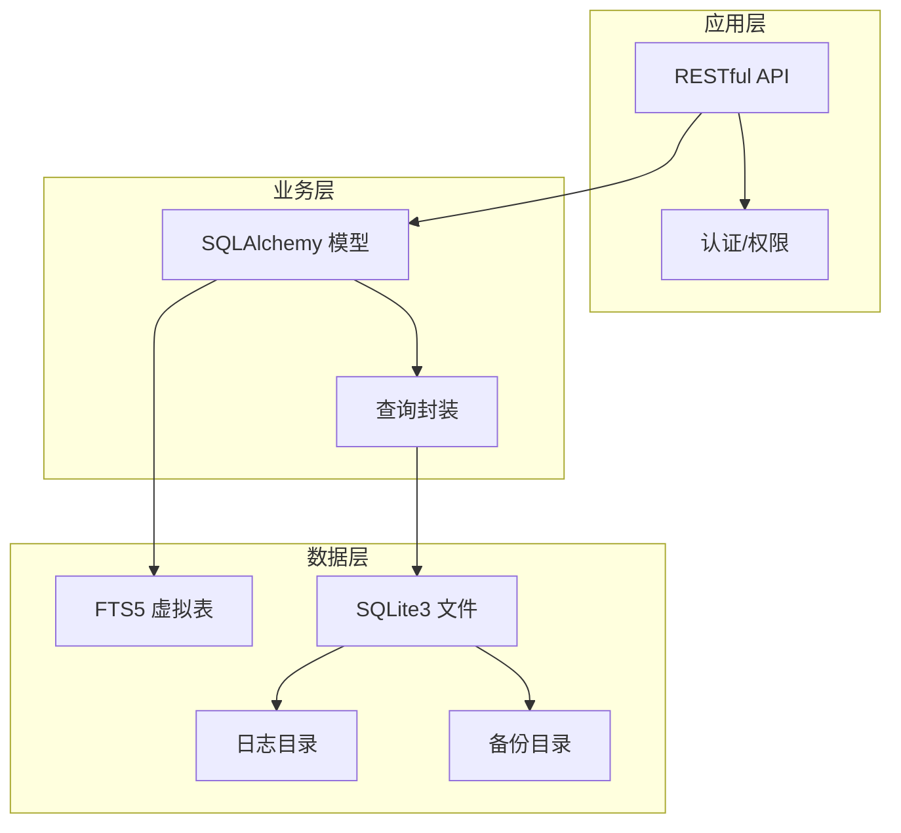
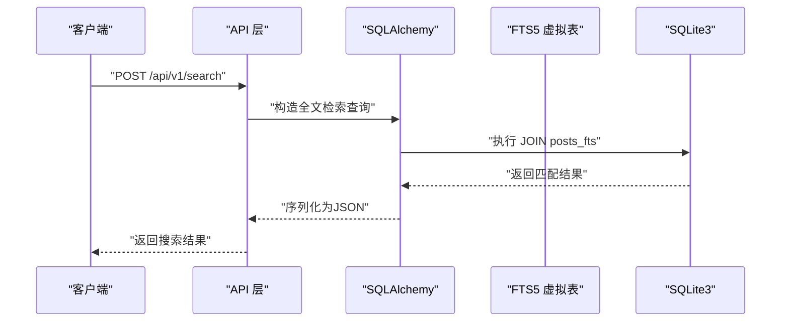
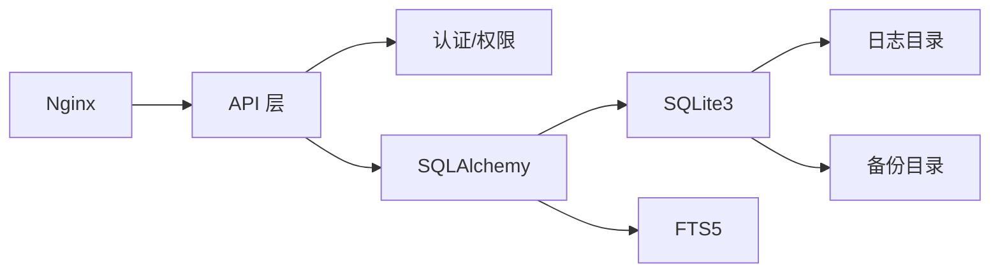

# 数据库优化

<cite>
**本文引用的文件**
- [企业网站CMS系统详细需求文档.md](file://企业网站CMS系统详细需求文档.md)
- [开发计划表_2月4日-2月12日.md](file://开发计划表_2月4日-2月12日.md)
- [企业网站CMS系统开发需求文档.ini](file://企业网站CMS系统开发需求文档.ini)
</cite>

## 目录
1. [简介](#简介)
2. [项目结构](#项目结构)
3. [核心组件](#核心组件)
4. [架构总览](#架构总览)
5. [组件详细分析](#组件详细分析)
6. [依赖关系分析](#依赖关系分析)
7. [性能考量](#性能考量)
8. [故障排查指南](#故障排查指南)
9. [结论](#结论)
10. [附录](#附录)

## 简介
本文件面向企业官网CMS系统的数据库优化实践，聚焦SQLite3在该场景下的性能优化策略与运维要点。结合项目文档中的数据库选型、表结构设计、全文检索方案、部署与备份策略，系统梳理索引优化、查询优化、连接池配置、慢查询日志与监控、维护与迁移、故障恢复等主题，并给出可操作的实施建议与最佳实践。

## 项目结构
- 后端采用Flask + SQLAlchemy + SQLite3，数据库为单文件，便于部署与备份。
- 前端采用React/Vue（可选），通过RESTful API与后端交互。
- 部署在Windows Server，使用Nginx反向代理，后端可通过Waitress或Gunicorn运行。
- 数据库文件位于D:/cms/data/cms.db，备份目录为D:/cms/data/backups，日志目录为D:/cms/data/logs。

**章节来源**
- file://开发计划表_2月4日-2月12日.md#L440-L500
- file://企业网站CMS系统详细需求文档.md#L555-L578

## 核心组件
- 数据库层：SQLite3，单文件数据库，零配置，支持ACID事务，适合中小规模内容管理场景。
- ORM层：Flask-SQLAlchemy，提供模型定义、查询封装与迁移能力。
- 连接层：SQLite3连接对象，配合WAL模式与事务控制提升并发读取性能。
- 全文检索：FTS5虚拟表 + 触发器，解决SQLite不支持FULLTEXT索引的问题。
- 备份与日志：数据库文件直接复制作为备份；日志目录用于存放SQLite相关日志。

**章节来源**
- file://企业网站CMS系统详细需求文档.md#L569-L578
- file://企业网站CMS系统详细需求文档.md#L662-L694
- file://企业网站CMS系统详细需求文档.md#L906-L938

## 架构总览
下图展示了CMS系统中数据库优化相关的组件交互与数据流向，重点体现ORM、SQLite、FTS5全文检索与备份/日志的关系。

**图表来源**
- [企业网站CMS系统详细需求文档.md](file://企业网站CMS系统详细需求文档.md#L906-L938)
- [开发计划表_2月4日-2月12日.md](file://开发计划表_2月4日-2月12日.md#L440-L500)

**章节来源**
- file://企业网站CMS系统详细需求文档.md#L906-L938
- file://开发计划表_2月4日-2月12日.md#L440-L500

## 组件详细分析

### 索引优化策略
- 复合索引设计
  - posts表的复合索引idx_type_status(type, status)用于“按类型+状态”筛选，适合文章列表与状态统计。
  - posts表的单列索引idx_slug(slug)与idx_published_at(published_at)分别用于唯一标识查找与发布时间排序。
  - categories表的idx_parent_id(parent_id)用于树形分类的父子关系查询。
  - media表的idx_mime_type(mime_type)与idx_folder_id(folder_id)用于媒体类型与目录筛选。
- 索引使用策略
  - 避免对写入频繁的列建立过多索引，平衡读取与写入性能。
  - 对高频过滤条件与排序字段建立索引，减少全表扫描。
  - 对唯一约束字段（如slug）建立唯一索引，保障数据一致性。
- 复杂度与代价
  - 索引增加写入开销（INSERT/UPDATE/DELETE），需结合业务读写比例评估。
  - 复合索引遵循最左前缀原则，查询条件需覆盖最左列才能命中索引。

**章节来源**
- file://企业网站CMS系统详细需求文档.md#L770-L837

### 查询优化方案
- 避免N+1查询
  - 使用select_in_load或joinedload等联结策略一次性加载关联数据，减少多次查询。
  - 在列表页对关联字段进行预加载，避免逐条访问时触发惰性加载。
- 批量操作优化
  - 使用bulk_insert_mappings/bulk_update_mappings减少ORM开销。
  - 合理分批处理大批量数据，避免单次事务过大导致锁竞争。
- 查询计划分析
  - 使用EXPLAIN QUERY PLAN或PRAGMA query_only（SQLite）观察执行计划，识别未命中索引的查询。
  - 对热点查询建立合适的索引组合，必要时拆分查询或引入物化视图（SQLite中可用CTE或临时表辅助）。

**章节来源**
- file://企业网站CMS系统详细需求文档.md#L538-L542

### 连接池配置
- 连接数设置
  - SQLite3本身不提供传统意义上的连接池，但可通过WAL模式与事务控制提升并发读取能力。
  - 在应用层使用连接复用策略，避免频繁打开/关闭连接。
- 超时配置
  - 设置合理的超时（busy_timeout、timeout），避免长时间阻塞导致请求堆积。
- 连接复用策略
  - 在Flask-SQLAlchemy中复用同一引擎实例，减少连接创建成本。
  - 对只读查询启用只读事务，减少写锁争用。

**章节来源**
- file://开发计划表_2月4日-2月12日.md#L612-L614

### 慢查询日志与性能监控
- 慢查询日志
  - SQLite3可通过PRAGMA设置，记录执行时间超过阈值的SQL语句。
  - 结合应用日志（logging模块 + RotatingFileHandler）统一收集与归档。
- 性能监控指标
  - 关键指标：平均查询耗时、慢查询比例、连接等待时间、事务回滚次数。
  - 建议使用Flask-Profiler（可选）或自定义中间件采集请求耗时。
- 日志与告警
  - 将慢查询与异常错误分级记录，定期巡检日志目录，发现问题及时优化。

**章节来源**
- file://企业网站CMS系统详细需求文档.md#L655-L658
- file://企业网站CMS系统详细需求文档.md#L538-L542

### 数据库维护策略
- WAL模式与checkpoint
  - 启用WAL模式（journal_mode=WAL），显著提升并发读取性能。
  - 定期执行checkpoint，避免WAL文件过大影响性能。
- VACUUM与分析
  - 定期执行VACUUM整理碎片，ANALYZE更新统计信息，帮助查询优化器选择更优执行计划。
- 备份策略
  - 数据库文件直接复制作为备份，建议每日增量备份+每周全量备份。
  - 备份目录结构清晰，保留最近N份备份，定期清理过期备份。
- 故障恢复
  - 使用备份文件替换损坏的数据库文件，恢复后验证完整性。
  - 对关键操作（迁移、批量导入）先在测试环境验证，再在生产执行。

**章节来源**
- file://开发计划表_2月4日-2月12日.md#L440-L500
- file://企业网站CMS系统详细需求文档.md#L704-L712

### SQLite3性能特点与适用场景
- 适合场景
  - 读多写少、数据量较小（<10万条记录）、部署简单、运维成本低。
  - 企业官网CMS以静态内容为主，更新频率低，SQLite3足以支撑。
- 性能指标
  - 支持10万+条记录，读取性能可达每秒数千次查询。
  - 单文件数据库，零配置，简化部署与备份。
- 扩展性考虑
  - 当访问量、写入频率或数据量增长到一定阈值（如日均PV>10万、并发写入频繁、数据量>100万条），可考虑迁移到MySQL/PostgreSQL。

**章节来源**
- file://企业网站CMS系统详细需求文档.md#L662-L694
- file://企业网站CMS系统详细需求文档.md#L695-L703

### 全文搜索与FTS5
- 方案说明
  - 使用FTS5虚拟表(posts_fts)维护title与content的倒排索引，通过触发器与主表同步。
- 查询流程
  - 将主表与FTS5表JOIN，使用MATCH谓词进行全文检索，返回匹配的文章记录。
- 维护要点
  - 插入/删除/更新时触发器同步，确保一致性。
  - 定期检查FTS5表健康状态，必要时重建虚拟表。

**图表来源**
- [企业网站CMS系统详细需求文档.md](file://企业网站CMS系统详细需求文档.md#L906-L938)

**章节来源**
- file://企业网站CMS系统详细需求文档.md#L906-L938

### 数据备份与迁移
- 备份策略
  - 数据库文件直接复制为备份，建议按“每日增量+每周全量”策略。
  - 备份文件命名包含时间戳，便于追溯与恢复。
- 迁移方案
  - 使用Flask-Migrate进行数据库迁移，先在测试环境验证，再在生产执行。
  - 迁移前先备份数据库文件，迁移后验证数据完整性与查询性能。
- 故障恢复
  - 使用最近一次有效备份恢复数据库文件，重启应用服务。
  - 对关键操作（如批量导入、结构变更）制定回滚预案。

**章节来源**
- file://企业网站CMS系统详细需求文档.md#L704-L712
- file://开发计划表_2月4日-2月12日.md#L440-L500

## 依赖关系分析
- 组件耦合
  - API层依赖认证/权限模块与SQLAlchemy模型。
  - 模型层依赖ORM与SQLite3驱动，FTS5作为查询辅助。
  - 备份/日志与数据库文件强耦合，需统一管理路径。
- 外部依赖
  - Flask-SQLAlchemy提供ORM与迁移能力。
  - Nginx负责静态资源与反向代理，降低后端压力。
  - Windows Server + Waitress/Gunicorn提供运行环境。

**图表来源**
- [开发计划表_2月4日-2月12日.md](file://开发计划表_2月4日-2月12日.md#L440-L500)
- [企业网站CMS系统详细需求文档.md](file://企业网站CMS系统详细需求文档.md#L906-L938)

**章节来源**
- file://开发计划表_2月4日-2月12日.md#L440-L500
- file://企业网站CMS系统详细需求文档.md#L906-L938

## 性能考量
- 读多写少场景
  - SQLite3在该场景下表现优异，建议启用WAL模式与合理索引。
- 并发与锁
  - 写入操作可能产生锁竞争，建议批量写入与事务合并。
- I/O与磁盘
  - 数据库文件与日志/备份目录分离，避免I/O争用。
- 缓存与CDN
  - 页面缓存与静态资源CDN可显著降低数据库压力，结合Redis可选。

**章节来源**
- file://企业网站CMS系统详细需求文档.md#L512-L542
- file://企业网站CMS系统详细需求文档.md#L662-L694

## 故障排查指南
- 常见问题
  - 查询慢：检查索引是否命中，必要时新增或调整索引。
  - 写入卡顿：检查事务大小与批量策略，避免长时间持有锁。
  - 备份失败：检查备份目录权限与磁盘空间。
- 排查步骤
  - 查看应用日志与SQLite日志，定位异常SQL。
  - 使用EXPLAIN QUERY PLAN分析执行计划，识别瓶颈。
  - 对热点表执行VACUUM与ANALYZE，更新统计信息。
- 恢复流程
  - 使用最近有效备份替换数据库文件，重启服务后验证。

**章节来源**
- file://企业网站CMS系统详细需求文档.md#L655-L658
- file://开发计划表_2月4日-2月12日.md#L440-L500

## 结论
针对企业官网CMS系统，SQLite3提供了极佳的性价比与运维便利性。通过合理的索引设计、查询优化、WAL模式与定期维护，可在中小规模场景下获得稳定且高效的数据库性能。当业务增长超出SQLite3承载能力时，再按需迁移至MySQL/PostgreSQL，确保系统持续演进。

## 附录
- 风险与应对
  - 数据库性能瓶颈：合理设计索引、查询优化、Redis缓存、读写分离（如需要）。
  - 并发写入限制：启用WAL模式、批量写入、缩短事务、合理分区。
- 成本与收益
  - SQLite3免费、零配置、运维成本低；Redis为可选，仅在高并发需求时启用。

**章节来源**
- file://企业网站CMS系统详细需求文档.md#L1886-L1893
- file://企业网站CMS系统详细需求文档.md#L1946-L1957