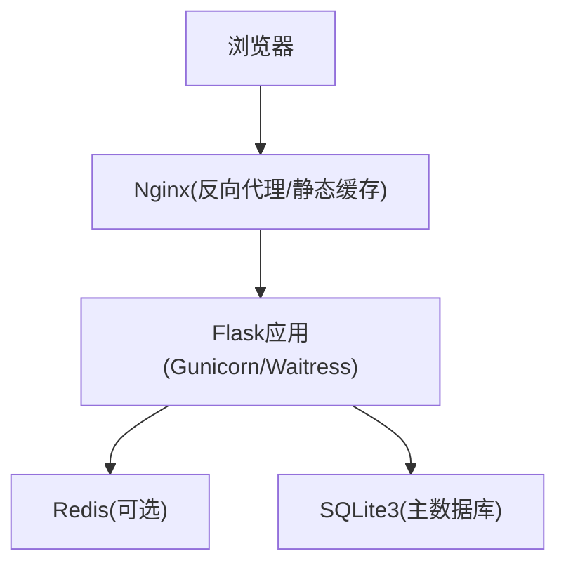
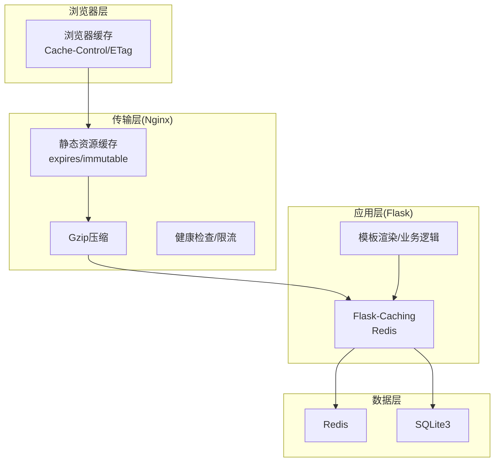
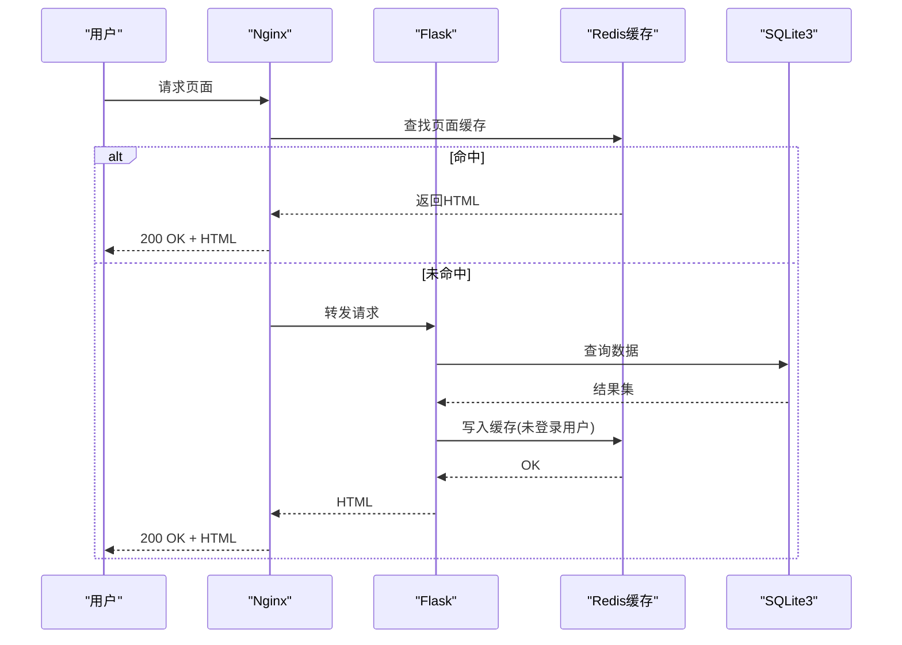
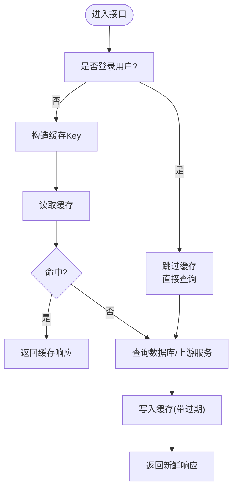
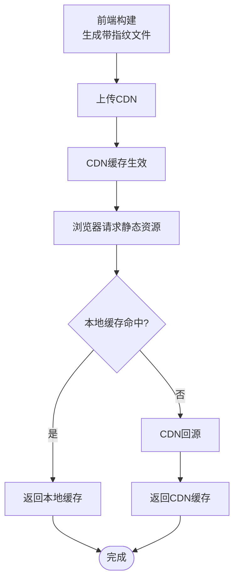
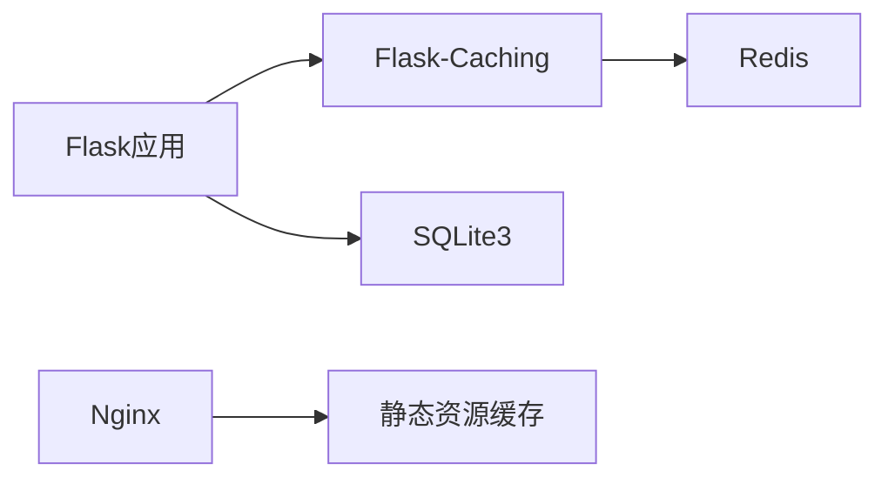

# 缓存策略

<cite>
**本文引用的文件**
- [企业网站CMS系统详细需求文档.md](file://企业网站CMS系统详细需求文档.md)
- [开发计划表_2月4日-2月12日.md](file://开发计划表_2月4日-2月12日.md)
</cite>

## 目录
1. [简介](#简介)
2. [项目结构](#项目结构)
3. [核心组件](#核心组件)
4. [架构总览](#架构总览)
5. [详细组件分析](#详细组件分析)
6. [依赖关系分析](#依赖关系分析)
7. [性能考量](#性能考量)
8. [故障排查指南](#故障排查指南)
9. [结论](#结论)
10. [附录](#附录)

## 简介
本文件面向企业CMS系统的缓存策略设计与落地，结合项目需求文档与开发计划，系统化梳理三层缓存架构：页面缓存（Redis全页面缓存）、数据缓存（查询结果与API响应）与静态资源缓存（浏览器与CDN）。文档覆盖缓存预热、失效策略、Key命名规范、性能监控指标、命中率统计方法、故障处理与清理策略，并给出可执行的配置参数与过期时间建议。

## 项目结构
- 后端采用Flask + SQLite3 + Redis（可选）+ Nginx的混合架构，支持SPA与纯HTML模板渲染。
- 缓存层位于Nginx与Flask之间，以及Flask内部，分别承担静态资源缓存与应用层缓存。
- 开发计划中明确将“Redis缓存集成”列为V2版本优化方向，当前MVP阶段以Nginx与SQLite为主，Redis作为高并发扩展能力预留。

**章节来源**
- file://开发计划表_2月4日-2月12日.md#L1-L800
- file://企业网站CMS系统详细需求文档.md#L28-L57

## 核心组件
- 页面缓存（Redis全页面缓存）
  - 针对未登录用户的静态页面进行Redis缓存，命中则直接返回页面内容，绕过后端渲染。
  - 登录用户不缓存，避免隐私与个性化内容泄露。
- 数据缓存
  - 数据库查询结果缓存：热点查询结果写入Redis，减少数据库压力。
  - API响应缓存：对稳定接口返回体进行缓存，缩短响应时间。
  - Key命名规范：统一前缀、业务域、参数维度与版本号，便于检索与失效。
- 静态资源缓存
  - 浏览器缓存：通过Nginx配置expires与Cache-Control，实现长期缓存与immutable策略。
  - 版本号/哈希更新策略：构建产物带内容指纹，变更即失效。
  - CDN缓存优化：CDN域名配置与缓存刷新策略，加速全球访问。

**章节来源**
- file://企业网站CMS系统详细需求文档.md#L512-L548
- file://企业网站CMS系统详细需求文档.md#L1232-L1302
- file://企业网站CMS系统详细需求文档.md#L1141-L1230

## 架构总览
三层缓存协同工作：
- 应用层缓存（Flask-Caching + Redis）：页面片段、查询结果、API响应缓存。
- 传输层缓存（Nginx）：静态资源强缓存、Gzip压缩、健康检查与负载均衡。
- 浏览器缓存（前端构建）：带指纹的静态资源、Service Worker离线缓存（可选）。

**图表来源**
- [企业网站CMS系统详细需求文档.md](file://企业网站CMS系统详细需求文档.md#L1141-L1230)
- [企业网站CMS系统详细需求文档.md](file://企业网站CMS系统详细需求文档.md#L1232-L1302)

**章节来源**
- file://企业网站CMS系统详细需求文档.md#L28-L57
- file://企业网站CMS系统详细需求文档.md#L1141-L1230
- file://企业网站CMS系统详细需求文档.md#L1232-L1302

## 详细组件分析

### 页面缓存（Redis全页面缓存）
- 缓存对象：未登录用户的静态页面HTML。
- 缓存键：统一前缀 + URL路径 + 语言/区域参数 + 版本号；避免同URL因参数差异导致的Key冲突。
- 过期时间：默认300秒，针对热点页面可设为更高值；登录态用户跳过缓存。
- 预热策略：系统启动或定时任务预热热门页面（首页、热门文章页、分类页）。
- 失效策略：内容更新（文章/页面发布/修改）、SEO配置变更、模板变更时主动失效对应Key。
- 命中率统计：通过Redis命令统计命中次数与总请求数，计算命中率并监控趋势。

**图表来源**
- [企业网站CMS系统详细需求文档.md](file://企业网站CMS系统详细需求文档.md#L514-L520)
- [企业网站CMS系统详细需求文档.md](file://企业网站CMS系统详细需求文档.md#L1257-L1260)

**章节来源**
- file://企业网站CMS系统详细需求文档.md#L514-L520
- file://企业网站CMS系统详细需求文档.md#L1257-L1260

### 数据缓存（查询结果与API响应）
- 查询结果缓存
  - Key命名：前缀_query_ + 业务表名 + 主键/条件组合 + 版本号；例如：query_posts_123_v1。
  - 过期时间：列表页查询可设较长（如300-600秒），详情页可设较短（如180秒）。
  - 失效：写操作（新增/更新/删除）时按Key前缀批量失效或精确删除。
- API响应缓存
  - Key命名：前缀_api_ + 路径 + 查询参数哈希 + 版本号；例如：api_posts_list_filter_v1。
  - 过期时间：稳定接口可设较长（如300秒），动态接口（如用户相关）不缓存。
  - 失效：接口版本升级或内容变更时失效。

**图表来源**
- [企业网站CMS系统详细需求文档.md](file://企业网站CMS系统详细需求文档.md#L521-L524)
- [企业网站CMS系统详细需求文档.md](file://企业网站CMS系统详细需求文档.md#L1257-L1260)

**章节来源**
- file://企业网站CMS系统详细需求文档.md#L521-L524
- file://企业网站CMS系统详细需求文档.md#L1257-L1260

### 静态资源缓存（浏览器与CDN）
- 浏览器缓存
  - Nginx配置expires与Cache-Control，静态资源目录设置长期缓存（如30天），immutable避免重复校验。
  - 前端构建产物带内容指纹（如bundle.[contenthash].js），文件名变更即失效。
- CDN缓存
  - 配置CDN域名，启用缓存刷新策略；内容更新后主动刷新CDN缓存。
  - 对不同资源类型设置差异化缓存策略（JS/CSS较长，图片可更长）。

**图表来源**
- [企业网站CMS系统详细需求文档.md](file://企业网站CMS系统详细需求文档.md#L1141-L1230)
- [企业网站CMS系统详细需求文档.md](file://企业网站CMS系统详细需求文档.md#L526-L529)

**章节来源**
- file://企业网站CMS系统详细需求文档.md#L1141-L1230
- file://企业网站CMS系统详细需求文档.md#L526-L529

## 依赖关系分析
- 技术栈与缓存组件映射
  - Flask-Caching：应用层缓存抽象，支持多种后端（含Redis）。
  - Redis：页面缓存、会话缓存、查询结果缓存。
  - Nginx：静态资源缓存、Gzip压缩、健康检查。
  - SQLite3：主数据库，读多写少场景性能优异，适合MVP阶段。
- 配置参数与依赖
  - 缓存类型与默认超时：CACHE_TYPE、CACHE_DEFAULT_TIMEOUT。
  - Redis连接：CACHE_REDIS_URL、SESSION_REDIS。
  - 会话生命周期：PERMANENT_SESSION_LIFETIME。
  - 静态资源缓存：Nginx location /static/ 的expires与immutable。

**图表来源**
- [企业网站CMS系统详细需求文档.md](file://企业网站CMS系统详细需求文档.md#L1232-L1302)
- [企业网站CMS系统详细需求文档.md](file://企业网站CMS系统详细需求文档.md#L1141-L1230)

**章节来源**
- file://企业网站CMS系统详细需求文档.md#L1232-L1302
- file://企业网站CMS系统详细需求文档.md#L1141-L1230

## 性能考量
- 命中率统计
  - 页面缓存：通过Redis命令统计命中次数与总请求数，计算命中率并设定阈值告警。
  - 数据缓存：对热点Key建立命中率监控，识别异常波动。
- 过期时间与清理
  - 默认过期：300秒；热点页面可延长至600秒；登录态接口不缓存。
  - 清理策略：写操作后主动失效；定期扫描过期Key；内存不足时按LRU淘汰。
- CDN与Nginx
  - 静态资源长期缓存，构建产物指纹化；CDN缓存刷新与回源策略需结合业务变更节奏。

**章节来源**
- file://企业网站CMS系统详细需求文档.md#L512-L548
- file://企业网站CMS系统详细需求文档.md#L1232-L1302
- file://企业网站CMS系统详细需求文档.md#L1141-L1230

## 故障排查指南
- 页面缓存未命中
  - 检查是否登录用户（登录用户不缓存）。
  - 核对Key前缀与URL参数是否一致。
  - 确认Redis连接与过期时间配置。
- 数据缓存异常
  - 核对Key命名规范是否一致。
  - 检查写操作后是否正确失效相关Key。
  - 监控Redis内存与淘汰策略。
- 静态资源未更新
  - 检查构建是否生成新指纹文件。
  - 确认Nginx缓存配置与CDN缓存刷新是否生效。
- 性能下降
  - 监控Redis命中率与内存使用。
  - 检查Nginx日志与Gzip压缩是否开启。
  - 评估热点Key分布与过期策略。

**章节来源**
- file://企业网站CMS系统详细需求文档.md#L512-L548
- file://企业网站CMS系统详细需求文档.md#L1232-L1302
- file://企业网站CMS系统详细需求文档.md#L1141-L1230

## 结论
本缓存策略以“三层协同”为核心：浏览器与CDN负责静态资源的极致缓存，Nginx承担传输层优化，Flask+Redis实现应用层缓存。MVP阶段以Nginx与SQLite为主，Redis作为高并发扩展能力预留；V2版本将重点推进Redis全页面缓存、数据缓存与Key命名规范的落地。通过命中率统计、过期时间与清理策略、故障排查流程，确保系统在性能、稳定性与可维护性之间取得平衡。

## 附录
- 缓存配置参数（摘自配置文件）
  - 缓存类型：CACHE_TYPE
  - Redis连接：CACHE_REDIS_URL
  - 默认过期：CACHE_DEFAULT_TIMEOUT
  - 会话类型与Redis：SESSION_TYPE、SESSION_REDIS
  - 会话有效期：PERMANENT_SESSION_LIFETIME
- Key命名规范（建议）
  - 页面缓存：page_{path}_{lang}_v{version}
  - 查询缓存：query_{table}_{key}_v{version}
  - API缓存：api_{path}_{query_hash}_v{version}
- 过期时间建议（示例）
  - 页面缓存：300~600秒（登录用户：0秒）
  - 查询缓存：180~600秒（详情页较短，列表页较长）
  - API缓存：180~300秒（用户相关接口不缓存）

**章节来源**
- file://企业网站CMS系统详细需求文档.md#L1232-L1302