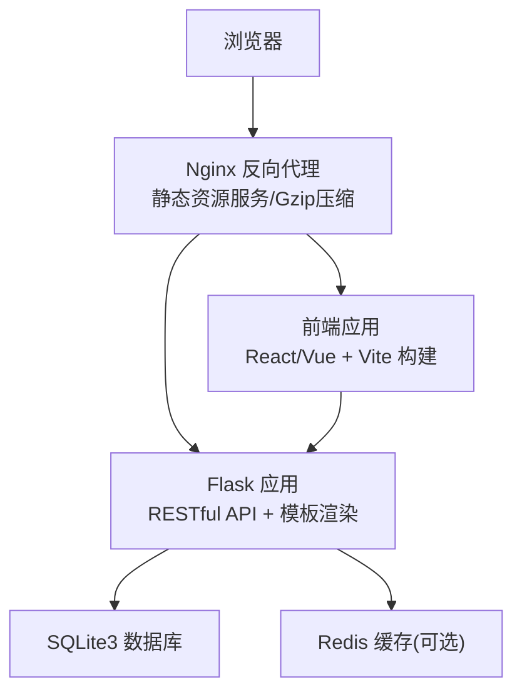
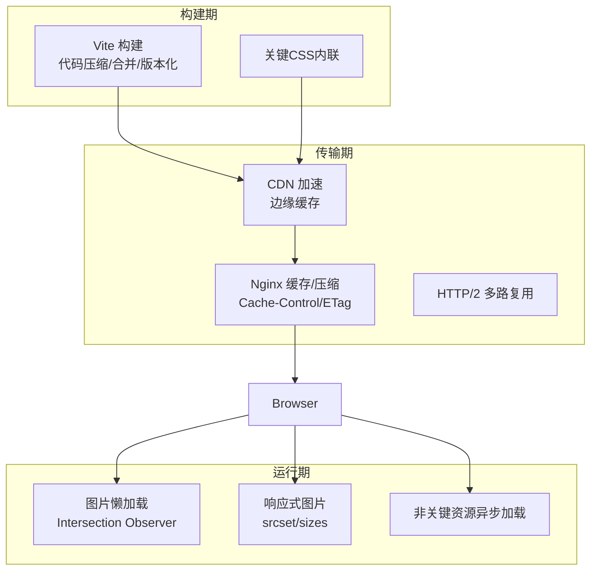
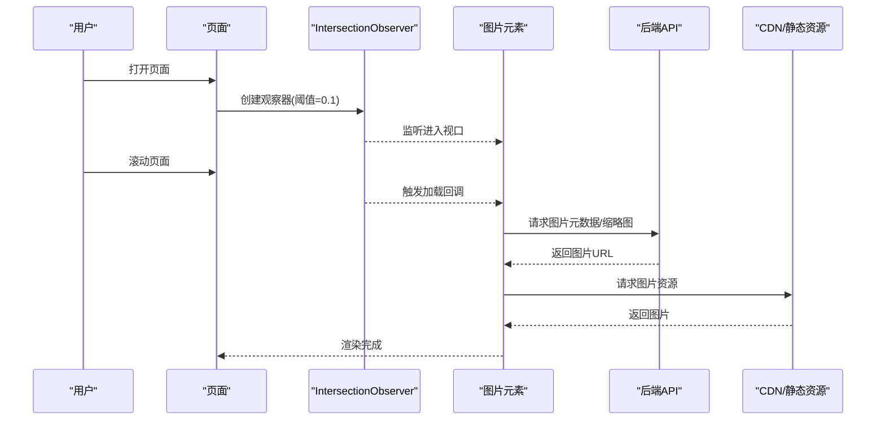
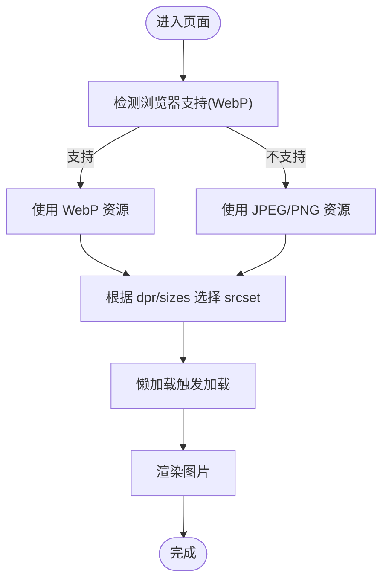
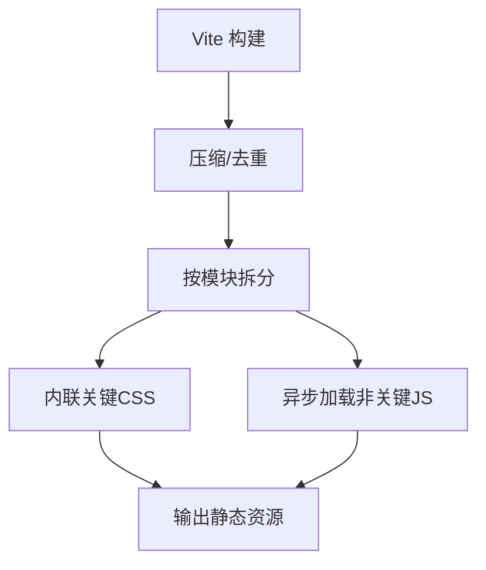
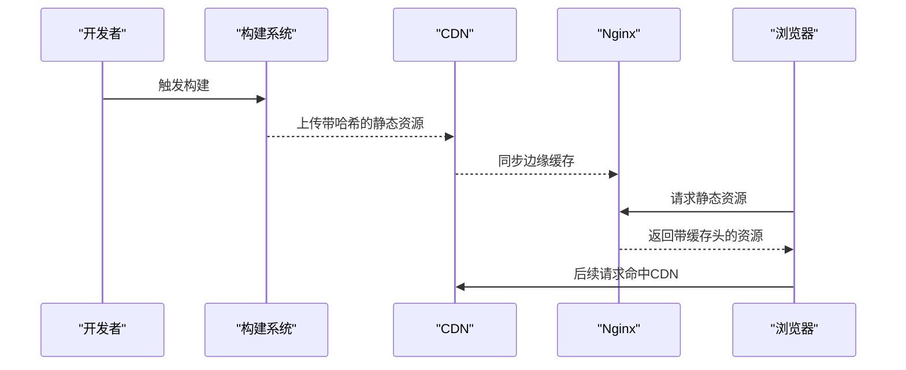
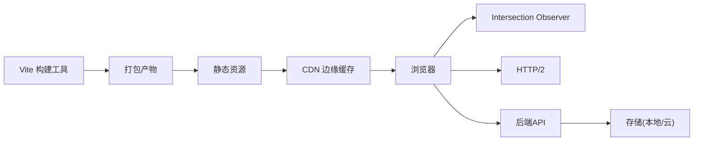

# 资源优化

<cite>
**本文引用的文件**
- [企业网站CMS系统开发需求文档.ini](file://企业网站CMS系统开发需求文档.ini)
- [企业网站CMS系统详细需求文档.md](file://企业网站CMS系统详细需求文档.md)
- [开发计划表_2月4日-2月12日.md](file://开发计划表_2月4日-2月12日.md)
</cite>

## 目录
1. [简介](#简介)
2. [项目结构](#项目结构)
3. [核心组件](#核心组件)
4. [架构总览](#架构总览)
5. [详细组件分析](#详细组件分析)
6. [依赖关系分析](#依赖关系分析)
7. [性能考量](#性能考量)
8. [故障排查指南](#故障排查指南)
9. [结论](#结论)
10. [附录](#附录)

## 简介
本文件面向企业CMS系统的前端资源优化，围绕图片懒加载、响应式图片策略、CSS与JavaScript优化、CDN与缓存、版本管理以及性能监控等主题，结合项目需求文档中的技术要求与开发计划，提供可落地的实施建议与最佳实践。文档既关注技术细节，也强调可操作性与可验证性，帮助在有限时间内实现高质量的前端性能优化。

## 项目结构
本项目采用前后端分离架构，前端使用React/Vue + TypeScript，后端使用Flask + SQLite3，通过Nginx作为反向代理与静态资源服务。前端构建产物部署至Nginx，后端提供RESTful API。

**图表来源**
- [企业网站CMS系统详细需求文档.md](file://企业网站CMS系统详细需求文档.md#L22-L57)
- [开发计划表_2月4日-2月12日.md](file://开发计划表_2月4日-2月12日.md#L441-L506)

**章节来源**
- [企业网站CMS系统详细需求文档.md](file://企业网站CMS系统详细需求文档.md#L22-L57)
- [开发计划表_2月4日-2月12日.md](file://开发计划表_2月4日-2月12日.md#L441-L506)

## 核心组件
- 前端应用：React/Vue + Vite，负责可视化编辑器、管理后台界面与前台展示页面。
- 后端API：Flask提供RESTful接口，支持媒体上传、文章管理、页面管理等功能。
- 静态资源：前端构建产物由Nginx提供，配合Gzip压缩与缓存头。
- 缓存层：可选Redis用于页面缓存与会话管理。
- 存储：SQLite3存储业务数据；媒体文件支持本地存储与云存储（OSS/COS/七牛）。

**章节来源**
- [企业网站CMS系统详细需求文档.md](file://企业网站CMS系统详细需求文档.md#L555-L628)
- [开发计划表_2月4日-2月12日.md](file://开发计划表_2月4日-2月12日.md#L441-L506)

## 架构总览
前端资源优化贯穿于构建、传输与运行时三个阶段：
- 构建期：代码压缩合并、关键CSS内联、资源版本化。
- 传输期：CDN加速、HTTP缓存、Gzip压缩、HTTP/2。
- 运行期：图片懒加载、响应式图片、非关键资源异步加载。

**图表来源**
- [企业网站CMS系统详细需求文档.md](file://企业网站CMS系统详细需求文档.md#L512-L548)
- [开发计划表_2月4日-2月12日.md](file://开发计划表_2月4日-2月12日.md#L465-L487)

## 详细组件分析

### 图片懒加载与加载时机控制
- Intersection Observer API：监听目标元素进入视口，触发图片加载，避免首屏阻塞。
- 触发策略：
  - 预设阈值（如0.1），当元素进入视口10%时开始加载。
  - 预加载相邻元素（如当前元素上方/下方若干像素），减少首屏空白。
  - 非首屏图片延迟加载，仅在用户滚动接近时加载。
- 降级策略：不支持Observer时回退至scroll事件监听，但需注意性能与节流。
- 与媒体库联动：媒体库上传时生成多尺寸缩略图，懒加载时按视口宽度选择合适尺寸。

**图表来源**
- [开发计划表_2月4日-2月12日.md](file://开发计划表_2月4日-2月12日.md#L340)
- [企业网站CMS系统详细需求文档.md](file://企业网站CMS系统详细需求文档.md#L531)

**章节来源**
- [开发计划表_2月4日-2月12日.md](file://开发计划表_2月4日-2月12日.md#L340)
- [企业网站CMS系统详细需求文档.md](file://企业网站CMS系统详细需求文档.md#L531)

### 响应式图片策略
- srcset与sizes：为不同视口宽度提供合适尺寸的图片，避免过度加载。
- WebP格式支持：优先返回WebP，不支持时回退至JPEG/PNG，结合后端格式检测。
- 压缩与尺寸：后端上传时生成多尺寸缩略图，前端按设备像素比(dpr)与视口宽度选择最优图片。
- ALT与SEO：自动填充ALT文本，提升SEO与可访问性。

**图表来源**
- [开发计划表_2月4日-2月12日.md](file://开发计划表_2月4日-2月12日.md#L215-L218)
- [企业网站CMS系统详细需求文档.md](file://企业网站CMS系统详细需求文档.md#L532-L533)

**章节来源**
- [开发计划表_2月4日-2月12日.md](file://开发计划表_2月4日-2月12日.md#L215-L218)
- [企业网站CMS系统详细需求文档.md](file://企业网站CMS系统详细需求文档.md#L532-L533)

### CSS与JavaScript资源优化
- 代码压缩与合并：构建时启用压缩与Tree Shaking，减少体积。
- 关键CSS内联：将首屏必需的CSS内联到<head>，其余CSS异步加载。
- 非关键资源异步加载：将非关键脚本标记为defer/async，避免阻塞渲染。
- 资源分片与版本化：按模块拆分，使用哈希后缀实现强缓存。

**图表来源**
- [企业网站CMS系统详细需求文档.md](file://企业网站CMS系统详细需求文档.md#L534-L536)

**章节来源**
- [企业网站CMS系统详细需求文档.md](file://企业网站CMS系统详细需求文档.md#L534-L536)

### CDN配置与静态资源缓存
- CDN域名配置：在系统配置中设置CDN地址，静态资源统一走CDN。
- 缓存策略：浏览器缓存（Cache-Control/ETag）、CDN边缘缓存、版本化资源永不陈旧。
- 刷新策略：资源更新后通过版本号或哈希变更触发CDN刷新。
- Nginx配置要点：静态资源目录映射、Gzip压缩、HTTPS终止、负载均衡（可选）。

**图表来源**
- [企业网站CMS系统详细需求文档.md](file://企业网站CMS系统详细需求文档.md#L544-L547)
- [开发计划表_2月4日-2月12日.md](file://开发计划表_2月4日-2月12日.md#L465-L487)

**章节来源**
- [企业网站CMS系统详细需求文档.md](file://企业网站CMS系统详细需求文档.md#L544-L547)
- [开发计划表_2月4日-2月12日.md](file://开发计划表_2月4日-2月12日.md#L465-L487)

### 资源版本管理机制
- 哈希命名：构建产物文件名包含内容哈希，文件内容不变则名称不变。
- 版本号策略：可选语义化版本号或时间戳，配合缓存头实现长期缓存。
- 回滚策略：保留最近N个版本，便于回滚与灰度发布。
- 前端注入：构建时将版本信息注入到入口文件，便于运行时监控与调试。

**章节来源**
- [企业网站CMS系统详细需求文档.md](file://企业网站CMS系统详细需求文档.md#L526-L529)

### 性能监控与评估
- 指标定义：首屏渲染时间(FMP/FCP/LCP)、交互时间(TTI)、页面加载时间(Load)。
- 数据采集：在关键生命周期埋点，上报至监控系统（如Google Analytics/自建）。
- 评估方法：对比优化前后指标，结合用户反馈与业务指标（转化率、跳出率）综合评估。
- 持续改进：建立A/B测试与灰度发布流程，逐步推广优化策略。

**章节来源**
- [企业网站CMS系统开发需求文档.ini](file://企业网站CMS系统开发需求文档.ini#L100-L103)

## 依赖关系分析
前端资源优化涉及多层依赖：
- 构建工具链：Vite负责打包、压缩、版本化与开发服务器。
- 运行时依赖：浏览器API（Intersection Observer）、HTTP/2、CDN边缘节点。
- 后端依赖：API提供图片元数据与缩略图URL，存储支持WebP与多尺寸生成。

**图表来源**
- [企业网站CMS系统详细需求文档.md](file://企业网站CMS系统详细需求文档.md#L555-L628)
- [开发计划表_2月4日-2月12日.md](file://开发计划表_2月4日-2月12日.md#L465-L487)

**章节来源**
- [企业网站CMS系统详细需求文档.md](file://企业网站CMS系统详细需求文档.md#L555-L628)
- [开发计划表_2月4日-2月12日.md](file://开发计划表_2月4日-2月12日.md#L465-L487)

## 性能考量
- 首屏优化：关键CSS内联、首屏图片优先加载、非关键JS异步。
- 网络优化：启用HTTP/2、Gzip压缩、CDN缓存、合理的Cache-Control。
- 资源体积：Tree Shaking、按需加载、图片WebP化、多尺寸裁剪。
- 可靠性：降级策略（Observer回退）、错误重试、占位图与骨架屏。
- 可观测性：埋点采集、性能指标上报、A/B测试与灰度发布。

[本节为通用指导，无需列出章节来源]

## 故障排查指南
- 图片不加载或闪烁：
  - 检查Intersection Observer是否被正确初始化与销毁。
  - 确认懒加载阈值与预加载策略合理。
  - 核对CDN域名与缓存头配置。
- 响应式图片显示模糊：
  - 检查srcset与sizes配置是否匹配设备像素比。
  - 确认后端生成的多尺寸图片是否存在。
- CSS内联导致首屏阻塞：
  - 检查关键CSS提取是否准确，避免遗漏。
  - 确认非关键CSS异步加载顺序。
- CDN缓存未生效：
  - 检查版本号/哈希是否更新。
  - 确认CDN边缘节点同步状态。
- 性能指标异常：
  - 检查埋点是否正确上报。
  - 对比优化前后数据，定位瓶颈。

**章节来源**
- [开发计划表_2月4日-2月12日.md](file://开发计划表_2月4日-2月12日.md#L465-L487)
- [企业网站CMS系统详细需求文档.md](file://企业网站CMS系统详细需求文档.md#L512-L548)

## 结论
前端资源优化是一个系统工程，需要在构建、传输与运行时三个层面协同推进。结合本项目的技术栈与需求，建议优先实现图片懒加载、响应式图片与关键CSS内联，配合CDN与缓存策略，确保在有限时间内达成性能目标。同时建立监控与评估机制，持续迭代优化，逐步完善高级特性（如多语言、高级SEO、Redis缓存等）。

[本节为总结性内容，无需列出章节来源]

## 附录
- 开发与部署要点：
  - 前端构建：使用Vite，启用压缩与版本化。
  - Nginx：静态资源映射、Gzip压缩、HTTPS、CDN代理。
  - 后端：提供媒体API与模板渲染，支持WebP与多尺寸生成。
- 风险与应对：
  - 技术风险：可视化编辑器复杂度高，采用成熟库与MVP策略。
  - 时间风险：8天周期紧张，严格按里程碑推进，预留缓冲。
  - 环境风险：Windows部署使用Waitress/NSSM，提前准备。

**章节来源**
- [开发计划表_2月4日-2月12日.md](file://开发计划表_2月4日-2月12日.md#L575-L625)
- [开发计划表_2月4日-2月12日.md](file://开发计划表_2月4日-2月12日.md#L441-L506)