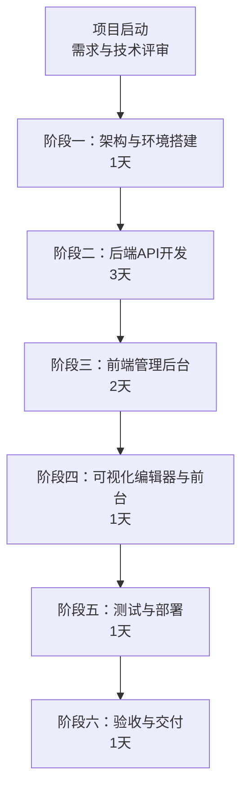
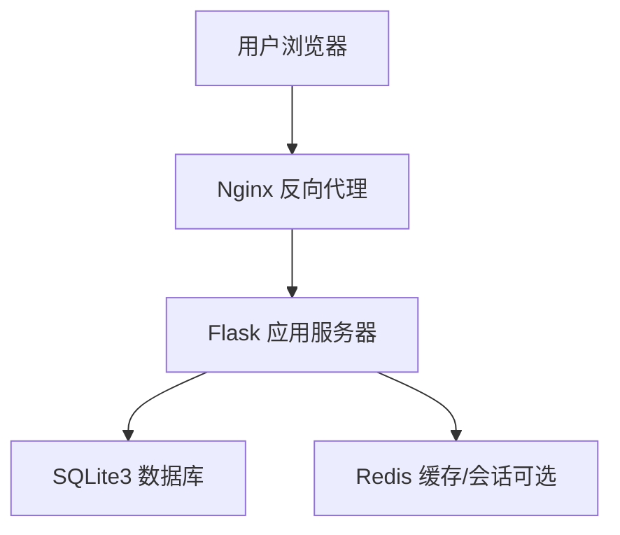
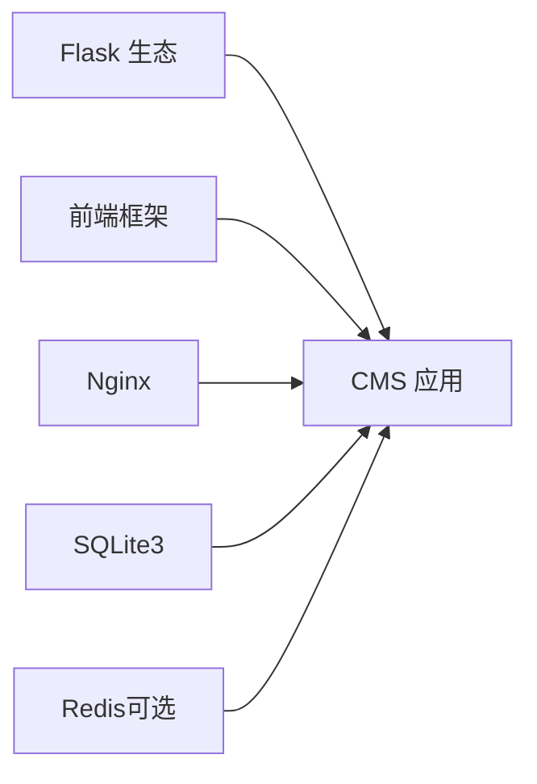

# 成本预算

<cite>
**本文引用的文件**
- [企业网站CMS系统开发需求文档.ini](file://企业网站CMS系统开发需求文档.ini)
- [企业网站CMS系统详细需求文档.md](file://企业网站CMS系统详细需求文档.md)
</cite>

## 目录
1. [引言](#引言)
2. [项目结构](#项目结构)
3. [核心组件](#核心组件)
4. [架构总览](#架构总览)
5. [详细组件分析](#详细组件分析)
6. [依赖分析](#依赖分析)
7. [性能考量](#性能考量)
8. [故障排查指南](#故障排查指南)
9. [结论](#结论)
10. [附录](#附录)

## 引言
本成本预算文档围绕企业网站CMS系统的开发与运维，结合项目需求文档中的技术栈、功能范围与实施计划，系统梳理成本构成、预算估算与控制策略。文档覆盖开发成本（人力与外包）、软硬件与基础设施、许可证与第三方服务、运维与培训、预算编制与核算、成本分析与优化、预算审批与监控、风险与预测调整机制等维度，旨在为管理层提供可执行的成本管理方案与决策依据。

## 项目结构
本项目以“最小可行产品（MVP）”为目标，在8天内完成核心功能交付，采用Python Flask + Nginx + Windows Server的轻量化架构，前端支持React/Vue或纯HTML模板渲染。项目分为六个阶段：架构与环境搭建、后端API开发、前端管理后台、可视化编辑器与前台展示、测试与部署、交付与培训。

**章节来源**
- file://企业网站CMS系统详细需求文档.md#L1463-L1771

## 核心组件
- 开发团队与职责
  - 全栈工程师×2：负责后端API与前端管理后台
  - 测试/部署工程师×1：负责测试与部署
  - UI设计师×1：负责界面与交互设计（MVP阶段）
- 技术栈与工具
  - 后端：Python Flask + SQLAlchemy + JWT + Redis（可选）
  - 前端：React/Vue（可选）或纯HTML模板（Jinja2）
  - 服务器：Nginx + Windows Server + Waitress/Gunicorn
  - 数据库：SQLite3（默认），Redis可选
- 功能范围（MVP）
  - 用户登录/权限管理、文章管理（CRUD）、分类管理、媒体库（图片上传）、简化版可视化编辑器（5个核心组件）、前台展示页面、基础SEO

**章节来源**
- file://企业网站CMS系统详细需求文档.md#L1786-L1801
- file://企业网站CMS系统详细需求文档.md#L1808-L1824

## 架构总览
系统采用前后端分离架构，Nginx作为反向代理与静态资源服务，Flask提供RESTful API与模板渲染，SQLite3存储业务数据，Redis用于缓存与会话（可选）。该架构在MVP阶段以Windows Server + Nginx + Flask + SQLite3为核心，降低服务器与数据库成本，便于快速部署与运维。

**章节来源**
- file://企业网站CMS系统详细需求文档.md#L22-L57

## 详细组件分析

### 开发成本
- 人员配置与工时估算
  - 项目经理：16周
  - 后端工程师×2：32周
  - 前端工程师×2：32周
  - UI设计师：8周
  - 测试工程师：4周
- 估算口径
  - 以周为单位的人力成本，结合岗位单价与工作量进行汇总
  - MVP阶段总工时约240-320小时（按团队规模）
- 成本控制要点
  - 严格遵循MVP范围，避免功能蔓延
  - 前后端并行开发，缩短交付周期
  - 使用成熟开源组件，减少定制化成本

**章节来源**
- file://企业网站CMS系统详细需求文档.md#L1797-L1800
- file://企业网站CMS系统详细需求文档.md#L1930-L1935

### 软硬件与基础设施
- 服务器与许可
  - Windows Server 2022许可：约¥5,000/年
  - 服务器硬件/云服务器：约¥8,000/年（SQLite降低配置需求）
  - SSL证书：约¥1,000/年
  - 域名：约¥100/年
  - 备份存储：约¥1,000/年
- 软件许可
  - SQLite3：免费（公有领域）
  - Redis：免费（开源，可选）
  - Nginx：免费（开源）
  - Python/Flask：免费（开源）
- 第三方服务
  - 云存储（OSS）：约¥1,000/年（可选）
  - 邮件服务：约¥500/年
  - CDN加速：约¥2,000/年（可选）
- 合计
  - 第一年总成本约¥15,600，相较MySQL方案节省约¥6,000/年

**章节来源**
- file://企业网站CMS系统详细需求文档.md#L1939-L1957

### 许可证与第三方服务
- 许可证费用
  - Windows Server 2022许可、SSL证书、域名、备份存储
- 第三方服务
  - 云存储、邮件服务、CDN加速（按需启用）
- 成本优化
  - 优先使用免费或开源组件；仅在必要时启用付费服务

**章节来源**
- file://企业网站CMS系统详细需求文档.md#L1946-L1956

### 运维与培训
- 运维
  - 日志与监控：日志轮转、性能监控、错误追踪（可选）
  - 备份策略：每日全量/增量备份，保留30天，异地备份至云存储
  - 容灾恢复：RTO<30分钟，RPO<1小时
- 培训
  - 管理员培训：系统登录、用户管理、系统配置、数据备份
  - 内容编辑培训：文章创建与发布、媒体上传管理、页面编辑器使用、常见问题处理
- 成本控制
  - 简化运维流程，降低人工干预频率
  - 培训标准化，减少重复沟通成本

**章节来源**
- file://企业网站CMS系统详细需求文档.md#L1406-L1415
- file://企业网站CMS系统详细需求文档.md#L1735-L1744

### 预算编制、核算与分析
- 预算编制
  - 以阶段为单位分解成本：人员、软硬件、第三方服务、运维与培训
  - 结合MVP时间线（8天）与年度成本（如服务器、许可、CDN等）折算月度预算
- 成本核算
  - 人员成本按周/月归集，区分直接开发与测试/部署
  - 软硬件与第三方服务按年/月摊销
- 成本分析
  - 对比SQLite与MySQL方案的成本差异，评估数据库升级的必要性与时机
  - 分析各阶段实际工时与预算偏差，持续优化资源分配

**章节来源**
- file://企业网站CMS系统详细需求文档.md#L1928-L1957

### 成本控制策略与优化措施
- 控制策略
  - 严控需求变更，预留20%缓冲时间
  - 采用成熟开源技术栈，降低学习与维护成本
  - 使用NSSM将Flask注册为Windows服务，提升稳定性与运维效率
- 优化措施
  - 前后端并行开发，缩短交付周期
  - 使用Redis缓存与CDN加速（按需启用），提升性能与用户体验
  - SQLite3零配置部署，降低数据库运维成本

**章节来源**
- file://企业网站CMS系统详细需求文档.md#L1897-L1903
- file://企业网站CMS系统详细需求文档.md#L1324-L1344

### 预算审批流程、成本监控与报告
- 预算审批流程
  - 需求方确认 → 技术负责人审核 → 项目经理批准 → 开发团队评审
- 成本监控
  - 按阶段跟踪实际工时与支出，定期对比预算
  - 关键里程碑（M1-M7）作为成本节点进行复核
- 成本报表
  - 月度/季度成本报表，包含人员、软硬件、第三方服务、运维与培训明细
  - 成本偏差分析与改进措施

**章节来源**
- file://企业网站CMS系统详细需求文档.md#L2018-L2023
- file://企业网站CMS系统详细需求文档.md#L1774-L1784

### 成本风险管理、预测与调整机制
- 风险识别
  - Windows Server环境兼容性、拖拽编辑器性能、数据库性能瓶颈、需求变更、人员变动、数据泄露
- 风险应对
  - 提前在Windows环境测试、使用虚拟滚动与组件懒加载、合理索引与Redis缓存、严格变更流程、知识共享与备份、安全审计与日志监控
- 成本预测
  - 基于MVP阶段的实际工时与成本，预测后续V2版本的增量成本
- 调整机制
  - 需求变更走变更流程，评估对预算的影响并及时调整资源分配

**章节来源**
- file://企业网站CMS系统详细需求文档.md#L1865-L1923

## 依赖分析
- 技术依赖
  - Flask生态（SQLAlchemy、JWT、CORS、Caching、Babel等）
  - 前端生态（React/Vue + UI库 + 拖拽库 + 富文本）
  - 服务器与部署（Nginx + Windows Server + Waitress/Gunicorn）
- 成本依赖
  - SQLite3降低数据库与运维成本
  - Redis为可选依赖，按性能需求启用
  - CDN与云存储为可选依赖，按流量与容量需求启用

**章节来源**
- file://企业网站CMS系统详细需求文档.md#L555-L659

## 性能考量
- 性能目标
  - 首页加载<2秒，内页加载<3秒，API响应<500ms，数据库查询<100ms
- 优化手段
  - 页面缓存（Redis）、图片懒加载、CDN加速、Gzip压缩、关键CSS内联
- 成本影响
  - 缓存与CDN可显著提升性能，但需考虑第三方服务成本

**章节来源**
- file://企业网站CMS系统详细需求文档.md#L1362-L1380
- file://企业网站CMS系统详细需求文档.md#L512-L548

## 故障排查指南
- 常见问题
  - Windows Server环境兼容性、Nginx代理配置、Flask服务注册、SSL证书配置、数据库文件权限
- 处理流程
  - 日志定位 → 快速修复 → 回滚验证 → 复盘总结
- 成本控制
  - 标准化排障流程，减少停机时间与重复修复成本

**章节来源**
- file://企业网站CMS系统详细需求文档.md#L1324-L1356

## 结论
本项目以MVP为核心，采用轻量化技术栈与Windows Server部署，有效降低了数据库与运维成本。通过严格的阶段化管理、需求控制与成本监控，可在8天内高质量交付核心功能，并为后续V2版本的扩展奠定基础。建议在预算中预留20%的缓冲，以应对需求变更与突发问题，确保项目在可控成本下稳步推进。

## 附录
- 术语表
  - CMS：内容管理系统
  - SPA：单页应用
  - ORM：对象关系映射
  - JWT：JSON Web Token
  - RBAC：基于角色的访问控制
  - CSRF/XSS：跨站请求伪造/跨站脚本攻击
  - SEO：搜索引擎优化
  - CDN：内容分发网络
  - SSL/TLS：安全套接字层/传输层安全
- 参考资料
  - Flask、React、Vue、Nginx、MySQL官方文档
  - Flask-SQLAlchemy、Ant Design、Element Plus、Quill.js

**章节来源**
- file://企业网站CMS系统详细需求文档.md#L1961-L1992