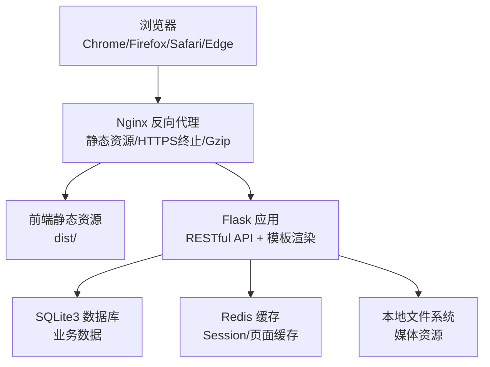
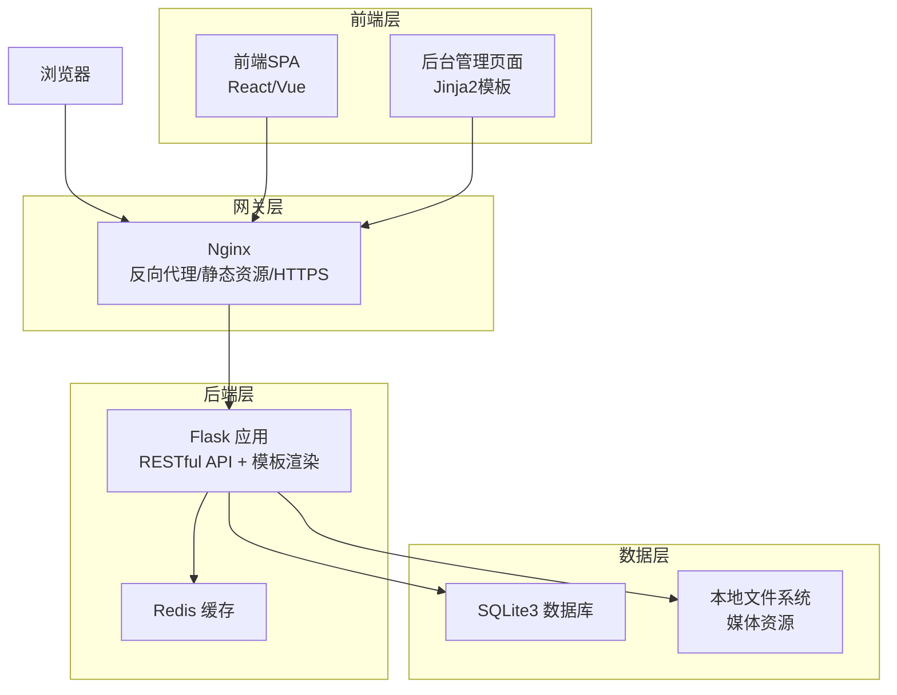
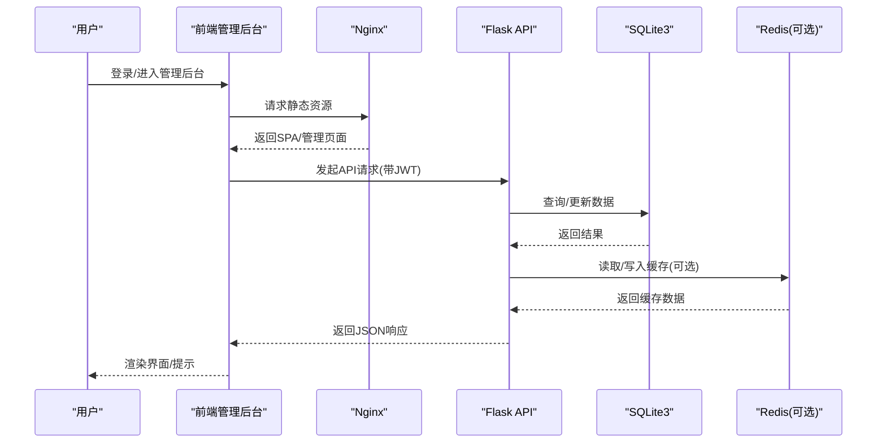
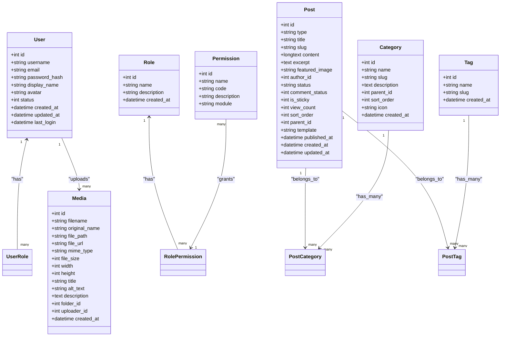
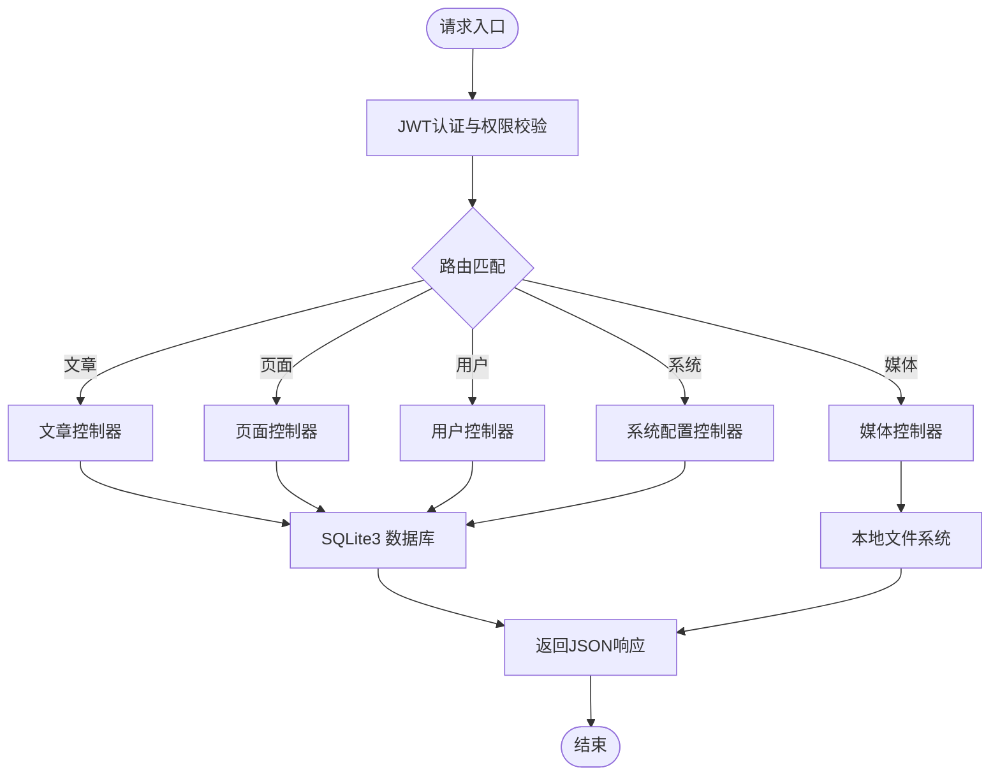
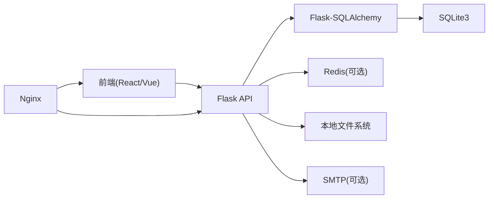

# 技术架构设计

<cite>
**本文档引用的文件**
- [企业网站CMS系统开发需求文档.ini](file://企业网站CMS系统开发需求文档.ini)
- [企业网站CMS系统详细需求文档.md](file://企业网站CMS系统详细需求文档.md)
</cite>

## 目录
1. [引言](#引言)
2. [项目结构](#项目结构)
3. [核心组件](#核心组件)
4. [架构总览](#架构总览)
5. [详细组件分析](#详细组件分析)
6. [依赖关系分析](#依赖关系分析)
7. [性能考量](#性能考量)
8. [故障排查指南](#故障排查指南)
9. [结论](#结论)
10. [附录](#附录)

## 引言
本技术架构文档面向企业官网内容管理系统（CMS）项目，系统采用前后端分离架构，后端基于Python Flask + SQLite3，前端采用React/Vue技术栈，通过Nginx进行反向代理与静态资源服务。文档从系统上下文、组件分解、数据流、技术栈选型、部署拓扑、性能与可扩展性、安全设计、演进路线等方面进行全面阐述，并给出关键挑战的解决方案与最佳实践。

## 项目结构
项目采用“前后端分离”的典型现代Web架构：
- 前端：React/Vue单页应用（SPA），构建产物由Nginx提供静态服务
- 后端：Flask RESTful API + 模板渲染（Jinja2），提供统一接口与后台管理
- 部署：Nginx反向代理 + WSGI服务器（Gunicorn/Waitress）+ SQLite3数据库 + 可选Redis缓存
- 存储：本地文件系统（媒体资源）+ SQLite3（业务数据）

**图表来源**
- [企业网站CMS系统详细需求文档.md](file://企业网站CMS系统详细需求文档.md#L34-L57)
- [企业网站CMS系统详细需求文档.md](file://企业网站CMS系统详细需求文档.md#L1143-L1230)

**章节来源**
- [企业网站CMS系统详细需求文档.md](file://企业网站CMS系统详细需求文档.md#L22-L57)

## 核心组件
- 前端管理后台（React/Vue SPA）
  - 路由：React Router/Vue Router
  - UI库：Ant Design/Element Plus
  - 状态管理：Redux Toolkit/Pinia
  - HTTP客户端：Axios
  - 拖拽：dnd-kit/react-beautiful-dnd
  - 富文本：Quill/TinyMCE
- 后端服务（Flask）
  - RESTful API：Flask-RESTful
  - ORM：Flask-SQLAlchemy
  - 认证授权：Flask-JWT-Extended + Flask-Login
  - 缓存：Flask-Caching（可选Redis）
  - 国际化：Flask-Babel
  - 跨域：Flask-CORS
  - 表单与验证：Flask-WTF
  - 数据库迁移：Flask-Migrate
- 部署与运维
  - Web服务器：Nginx
  - WSGI服务器：Gunicorn/Waitress
  - 进程管理：NSSM（Windows服务）
  - 数据库：SQLite3（默认），可选MySQL
  - 缓存：Redis（可选）

**章节来源**
- [企业网站CMS系统详细需求文档.md](file://企业网站CMS系统详细需求文档.md#L595-L628)
- [企业网站CMS系统详细需求文档.md](file://企业网站CMS系统详细需求文档.md#L555-L594)
- [企业网站CMS系统详细需求文档.md](file://企业网站CMS系统详细需求文档.md#L629-L659)

## 架构总览
系统采用“前后端分离 + 反向代理 + 轻量化数据库”的混合架构模式：
- 前端通过Nginx提供的静态资源目录提供管理后台界面；API请求经Nginx代理至Flask应用
- Flask应用提供RESTful API与后台管理模板渲染，使用SQLite3存储业务数据，可选Redis提供缓存与Session
- 系统支持纯HTML模板渲染与SPA两种模式，便于在不同场景下灵活部署

**图表来源**
- [企业网站CMS系统详细需求文档.md](file://企业网站CMS系统详细需求文档.md#L24-L27)
- [企业网站CMS系统详细需求文档.md](file://企业网站CMS系统详细需求文档.md#L34-L57)
- [企业网站CMS系统详细需求文档.md](file://企业网站CMS系统详细需求文档.md#L1143-L1230)

## 详细组件分析

### 前端组件分析
- 路由与状态管理
  - 路由：React Router/Vue Router负责页面级路由与权限守卫
  - 状态管理：Redux Toolkit/Pinia集中管理全局状态（用户信息、表单数据、组件配置）
- 可视化编辑器
  - 拖拽系统：dnd-kit/react-beautiful-dnd实现组件拖拽、排序、复制与删除
  - 组件库：基础文本、图片、容器、按钮、表单等核心组件
  - 实时预览：编辑模式与预览模式无缝切换，支持多设备预览
- UI与交互
  - UI库：Ant Design/Element Plus提供一致的组件风格
  - 表单：React Hook Form/VeeValidate提供高性能表单校验
  - HTTP：Axios封装请求拦截器与错误处理

**图表来源**
- [企业网站CMS系统详细需求文档.md](file://企业网站CMS系统详细需求文档.md#L1000-L1076)
- [企业网站CMS系统详细需求文档.md](file://企业网站CMS系统详细需求文档.md#L1143-L1230)

**章节来源**
- [企业网站CMS系统详细需求文档.md](file://企业网站CMS系统详细需求文档.md#L595-L628)
- [企业网站CMS系统详细需求文档.md](file://企业网站CMS系统详细需求文档.md#L65-L103)

### 后端组件分析
- 认证与授权
  - JWT：Access Token短时效，Refresh Token长时效，支持自动刷新
  - Flask-Login：会话管理与登录状态维护
  - 权限控制：RBAC模型，基于角色的访问控制，装饰器实现权限校验
- 内容管理
  - 文章/页面：支持草稿、发布、定时发布、置顶、评论开关等
  - 分类/标签：树形分类、标签云、关联关系
  - 媒体库：图片上传、压缩、缩略图、信息编辑、文件夹组织
- 系统配置
  - 网站设置：名称、Logo、联系方式、ICP等
  - SEO配置：Meta标签模板、Sitemap、友好URL
  - 备份管理：自动/手动备份、恢复、云存储
- 数据库与缓存
  - SQLite3：默认数据库，零配置、ACID事务、简化运维
  - Redis：可选缓存与Session，提升读性能与会话一致性

**图表来源**
- [企业网站CMS系统详细需求文档.md](file://企业网站CMS系统详细需求文档.md#L716-L861)
- [企业网站CMS系统详细需求文档.md](file://企业网站CMS系统详细需求文档.md#L863-L889)
- [企业网站CMS系统详细需求文档.md](file://企业网站CMS系统详细需求文档.md#L891-L904)

**章节来源**
- [企业网站CMS系统详细需求文档.md](file://企业网站CMS系统详细需求文档.md#L237-L293)
- [企业网站CMS系统详细需求文档.md](file://企业网站CMS系统详细需求文档.md#L294-L446)
- [企业网站CMS系统详细需求文档.md](file://企业网站CMS系统详细需求文档.md#L660-L713)

### API与数据流
- 接口规范
  - 协议：HTTPS
  - 格式：JSON
  - 认证：JWT Bearer Token
  - 分页：统一分页结构
- 核心接口
  - 认证：登录、登出、注册、刷新、忘记/重置密码、当前用户信息
  - 用户管理：CRUD、角色分配
  - 文章管理：列表、详情、CRUD、批量删除、状态变更
  - 页面管理：列表、详情、CRUD、组件配置
  - 分类/标签：树形列表、CRUD
  - 媒体库：上传、批量上传、列表、详情、更新、删除
  - 系统配置：分组配置、备份创建/列表/恢复

**图表来源**
- [企业网站CMS系统详细需求文档.md](file://企业网站CMS系统详细需求文档.md#L940-L1076)

**章节来源**
- [企业网站CMS系统详细需求文档.md](file://企业网站CMS系统详细需求文档.md#L940-L1076)

## 依赖关系分析
- 技术栈耦合
  - 前端与后端通过RESTful API通信，解耦UI与业务逻辑
  - Flask通过ORM与数据库交互，抽象数据访问层
  - Nginx作为统一入口，承担静态资源与代理职责
- 外部依赖
  - 数据库：SQLite3（默认）、可选MySQL
  - 缓存：Redis（可选）
  - 文件存储：本地文件系统 + 云存储SDK（可选）
- 部署依赖
  - Windows Server + Nginx + WSGI服务器（Gunicorn/Waitress）
  - NSSM将Flask服务注册为Windows服务，实现开机自启与崩溃重启

**图表来源**
- [企业网站CMS系统详细需求文档.md](file://企业网站CMS系统详细需求文档.md#L555-L659)
- [企业网站CMS系统详细需求文档.md](file://企业网站CMS系统详细需求文档.md#L1143-L1230)

**章节来源**
- [企业网站CMS系统详细需求文档.md](file://企业网站CMS系统详细需求文档.md#L555-L659)

## 性能考量
- 前端性能
  - 静态资源：Nginx启用Gzip压缩与缓存头，CDN加速（可选）
  - 前端构建：Vite打包，按需加载与代码分割
- 后端性能
  - 缓存策略：页面缓存（Redis）、数据缓存（查询结果）、静态资源缓存
  - 数据库优化：合理索引、避免N+1查询、连接池配置
  - 异步任务：Celery（可选），后台任务如导出、邮件发送
- 部署性能
  - WSGI：Gunicorn/Waitress多进程异步worker
  - 负载均衡：Nginx反向代理，支持多实例（可选）
- 性能指标
  - 页面加载时间：首页<2秒，内页<3秒
  - API响应：平均<500ms，数据库查询<100ms
  - 并发用户：支持1000+并发（MVP阶段）

**章节来源**
- [企业网站CMS系统详细需求文档.md](file://企业网站CMS系统详细需求文档.md#L1362-L1380)
- [企业网站CMS系统详细需求文档.md](file://企业网站CMS系统详细需求文档.md#L512-L548)

## 故障排查指南
- 认证与授权
  - JWT过期：检查Access/Refresh Token配置与自动刷新逻辑
  - 权限不足：核对RBAC角色与权限映射
- 数据库与缓存
  - SQLite性能：关注索引缺失、慢查询日志、避免大事务
  - Redis不可用：检查连接配置与健康状态
- 文件上传
  - 上传失败：检查文件类型白名单、大小限制、存储路径权限
- 日志与监控
  - Flask日志：RotatingFileHandler，结合Nginx访问/错误日志
  - 监控：性能指标、错误率、磁盘空间、告警通知

**章节来源**
- [企业网站CMS系统详细需求文档.md](file://企业网站CMS系统详细需求文档.md#L1078-L1140)
- [企业网站CMS系统详细需求文档.md](file://企业网站CMS系统详细需求文档.md#L1360-L1423)
- [企业网站CMS系统详细需求文档.md](file://企业网站CMS系统详细需求文档.md#L1232-L1302)

## 结论
本项目采用“前后端分离 + 轻量化数据库 + 反向代理”的架构，兼顾易部署、低运维成本与良好扩展性。通过JWT认证、RBAC权限控制、SQL注入与XSS防护、文件上传安全策略与缓存优化，系统在MVP阶段即可满足中小企业的官网管理需求。后续可按需引入MySQL、Redis集群、CDN与容器化部署，以支撑更高并发与更复杂的业务场景。

## 附录

### 技术栈选型与权衡
- 前端：React/Vue + TypeScript，组件化与类型安全，配合dnd-kit实现拖拽编辑
- 后端：Flask + SQLite3，零配置、ACID事务、简化运维，适合中小规模业务
- 部署：Nginx + Waitress/Gunicorn + NSSM，Windows Server友好，便于企业内部运维
- 缓存：Redis可选，针对高并发与热点数据场景

**章节来源**
- [企业网站CMS系统详细需求文档.md](file://企业网站CMS系统详细需求文档.md#L70-L91)
- [企业网站CMS系统详细需求文档.md](file://企业网站CMS系统详细需求文档.md#L555-L659)

### 部署拓扑与环境要求
- 操作系统：Windows Server 2019/2022
- Web服务器：Nginx 1.24+
- Python运行环境：Python 3.9+，虚拟环境，pip管理
- WSGI服务器：Gunicorn或Waitress（Windows友好）
- 数据库：SQLite3（默认），可选MySQL
- 缓存：Redis（可选）
- 进程管理：NSSM注册为Windows服务

**章节来源**
- [企业网站CMS系统详细需求文档.md](file://企业网站CMS系统详细需求文档.md#L629-L659)
- [企业网站CMS系统详细需求文档.md](file://企业网站CMS系统详细需求文档.md#L1324-L1356)

### 架构演进路线图
- MVP阶段（8天）：完成认证、文章、分类、媒体库、简化可视化编辑器与前台展示
- V2阶段（延后）：高级组件、多语言、复杂权限、数据统计、高级SEO
- 生产演进：引入MySQL/Redis集群、CDN、容器化（Docker）、CI/CD流水线

**章节来源**
- [企业网站CMS系统详细需求文档.md](file://企业网站CMS系统详细需求文档.md#L1481-L1500)
- [企业网站CMS系统详细需求文档.md](file://企业网站CMS系统详细需求文档.md#L1463-L1480)