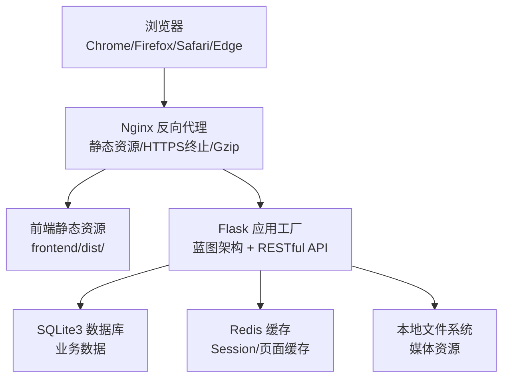
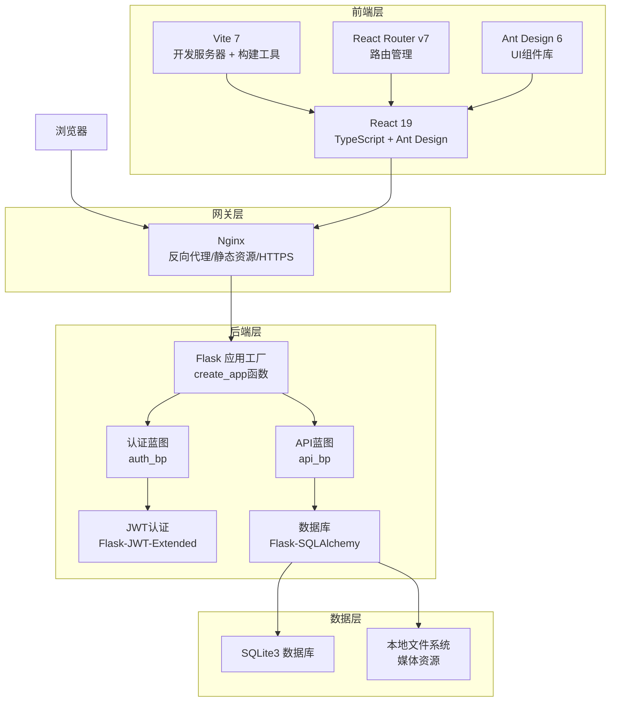
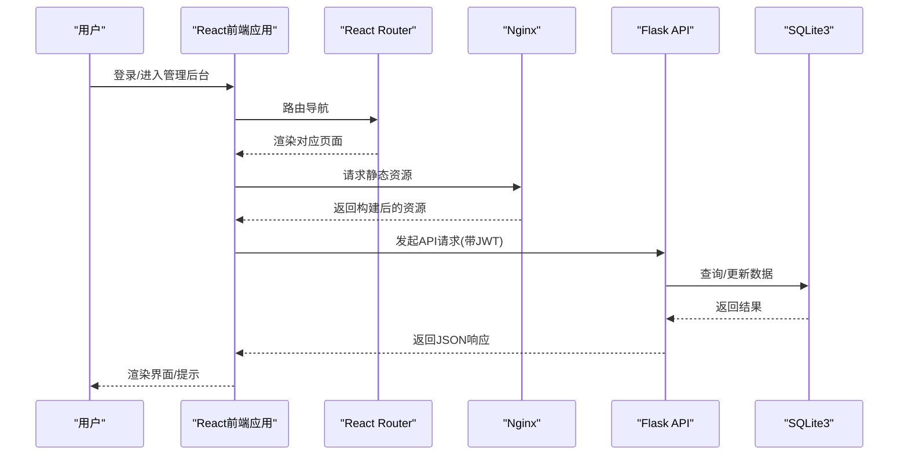
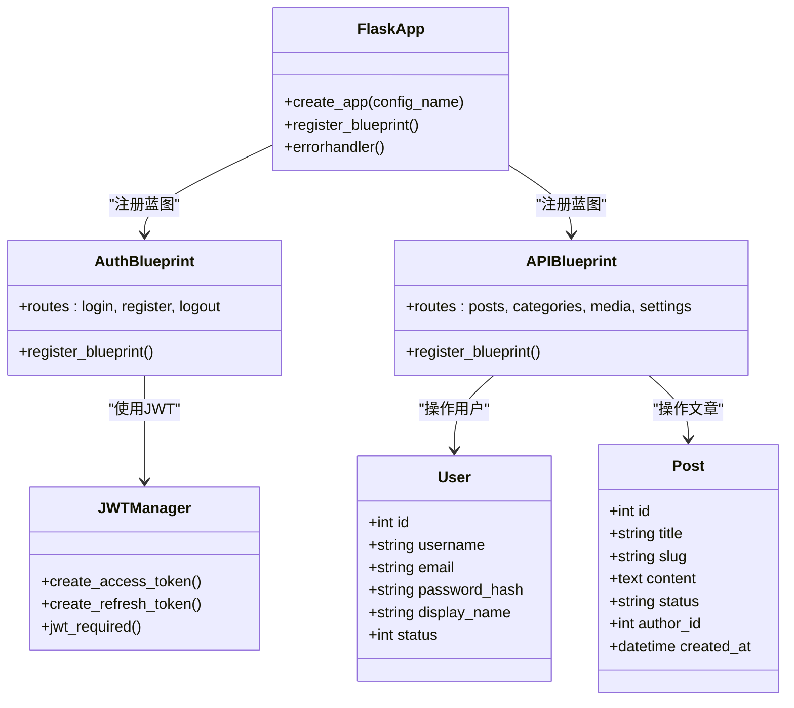
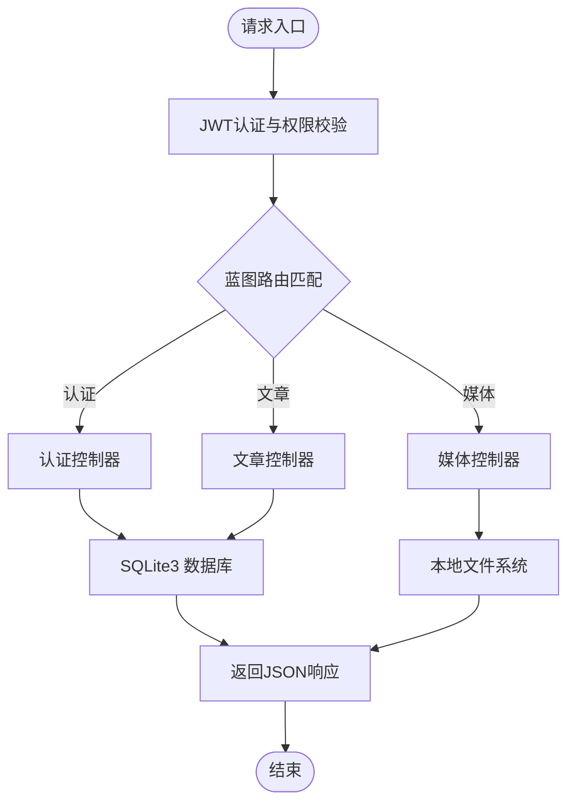
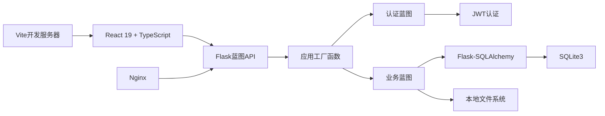

# 技术架构设计

<cite>
**本文档引用的文件**
- [企业网站CMS系统开发需求文档.ini](file://企业网站CMS系统开发需求文档.ini)
- [企业网站CMS系统详细需求文档.md](file://企业网站CMS系统详细需求文档.md)
- [backend/app/__init__.py](file://backend/app/__init__.py)
- [backend/config.py](file://backend/config.py)
- [backend/run.py](file://backend/run.py)
- [backend/app/api/__init__.py](file://backend/app/api/__init__.py)
- [backend/app/auth/__init__.py](file://backend/app/auth/__init__.py)
- [backend/app/models/__init__.py](file://backend/app/models/__init__.py)
- [backend/app/api/posts.py](file://backend/app/api/posts.py)
- [backend/app/auth/routes.py](file://backend/app/auth/routes.py)
- [backend/app/models/user.py](file://backend/app/models/user.py)
- [backend/app/models/post.py](file://backend/app/models/post.py)
- [frontend/package.json](file://frontend/package.json)
- [frontend/vite.config.ts](file://frontend/vite.config.ts)
- [frontend/src/App.tsx](file://frontend/src/App.tsx)
- [frontend/src/main.tsx](file://frontend/src/main.tsx)
- [frontend/src/pages/Dashboard.tsx](file://frontend/src/pages/Dashboard.tsx)
- [frontend/src/layout/AdminLayout.tsx](file://frontend/src/layout/AdminLayout.tsx)
- [frontend/src/types/menu.ts](file://frontend/src/types/menu.ts)
</cite>

## 更新摘要
**所做更改**
- 更新了Flask后端架构为蓝图模式，包括应用工厂函数和配置管理
- 更新了React前端架构为React 19 + TypeScript + Ant Design + Vite
- 新增了现代化技术栈的详细说明和组件分析
- 更新了API架构和数据流图以反映新的蓝图结构
- 新增了前端组件架构和TypeScript类型系统说明
- 新增了完整的Flask后端架构实现，包括JWT认证、用户模型、文章模型等核心组件
- **更新了项目结构**：从 `company_cms_project/` 扁平化到根目录的 `backend/` 和 `frontend/` 目录结构

## 目录
1. [引言](#引言)
2. [项目结构](#项目结构)
3. [核心组件](#核心组件)
4. [架构总览](#架构总览)
5. [详细组件分析](#详细组件分析)
6. [依赖关系分析](#依赖关系分析)
7. [性能考量](#性能考量)
8. [故障排查指南](#故障排查指南)
9. [结论](#结论)
10. [附录](#附录)

## 引言
本技术架构文档面向企业官网内容管理系统（CMS）项目，系统采用全新的前后端分离架构，后端基于Flask蓝图模式 + 应用工厂函数，前端采用React 19 + TypeScript + Ant Design + Vite现代化技术栈。系统通过Nginx进行反向代理与静态资源服务，提供统一的RESTful API接口与后台管理界面。文档从系统上下文、组件分解、数据流、技术栈选型、部署拓扑、性能与可扩展性、安全设计、演进路线等方面进行全面阐述。

**更新** 项目结构已从 `company_cms_project/` 目录扁平化到根目录的 `backend/` 和 `frontend/`，简化了项目层次结构，提高了开发效率。

## 项目结构
项目采用"前后端分离 + 蓝图架构 + 现代化前端"的典型现代Web架构：
- 前端：React 19 + TypeScript单页应用（SPA），使用Vite进行构建和开发服务器，Ant Design提供UI组件库
- 后端：Flask应用工厂函数 + 蓝图模式，提供RESTful API和后台管理功能
- 部署：Nginx反向代理 + Waitress服务器 + SQLite3数据库 + 可选Redis缓存
- 存储：本地文件系统（媒体资源）+ SQLite3（业务数据）

**图表来源**
- [backend/app/__init__.py:15-60](file://backend/app/__init__.py#L15-L60)
- [frontend/package.json:1-46](file://frontend/package.json#L1-L46)

**章节来源**
- [企业网站CMS系统详细需求文档.md:22-57](file://企业网站CMS系统详细需求文档.md#L22-L57)

## 核心组件
- 前端管理后台（React 19 + TypeScript SPA）
  - 路由：React Router v7，支持嵌套路由和权限控制
  - UI库：Ant Design 6，提供完整的组件生态系统
  - 状态管理：Context API + 自定义Hook，轻量级状态管理
  - HTTP客户端：Axios，支持拦截器和错误处理
  - 构建工具：Vite 7，提供快速开发体验和优化构建
  - 类型系统：TypeScript 5.9，提供编译时类型检查
  - 拖拽：@dnd-kit，支持拖拽排序和组件布局
  - 图表：Recharts，数据可视化组件
- 后端服务（Flask蓝图架构）
  - 应用工厂：create_app函数，支持多环境配置
  - 蓝图模式：auth_bp和api_bp，模块化API组织
  - ORM：Flask-SQLAlchemy，数据库抽象层
  - 认证授权：Flask-JWT-Extended，JWT令牌管理
  - 跨域：Flask-CORS，支持前端开发端口
  - 配置管理：Config基类 + 环境配置，灵活的部署支持
  - 数据库迁移：Flask-Migrate，数据库版本管理
  - 核心模型：User、Post、Category、Tag、Media、PageComponent、SiteSetting

**章节来源**
- [frontend/package.json:12-46](file://frontend/package.json#L12-L46)
- [backend/app/__init__.py:15-41](file://backend/app/__init__.py#L15-L41)
- [backend/config.py:8-67](file://backend/config.py#L8-L67)

## 架构总览
系统采用"前后端分离 + 蓝图架构 + 现代化前端"的混合架构模式：
- 前端通过Vite开发服务器提供管理后台界面，使用Ant Design组件库构建UI
- Flask应用工厂函数创建应用实例，注册蓝图提供RESTful API
- 蓝图模式将认证、文章、媒体等功能模块化，提高代码可维护性
- 系统支持JWT认证、权限控制、文件上传、媒体管理等完整功能

**图表来源**
- [backend/app/__init__.py:15-41](file://backend/app/__init__.py#L15-L41)
- [frontend/vite.config.ts:1-8](file://frontend/vite.config.ts#L1-L8)

## 详细组件分析

### 前端组件分析
- 路由与状态管理
  - 路由：React Router v7负责页面级路由与权限守卫，支持嵌套路由
  - 状态管理：Context API + 自定义Hook，轻量级状态管理方案
  - 主题系统：ThemeProvider提供暗色/亮色主题切换
- UI与交互
  - UI库：Ant Design 6提供统一的组件风格和设计规范
  - 表单：支持表单验证和数据绑定
  - 图表：Recharts提供数据可视化能力
  - 拖拽：@dnd-kit实现组件拖拽、排序、复制与删除
- 构建与开发
  - Vite 7提供快速开发体验，支持热模块替换
  - TypeScript提供编译时类型检查，提高代码质量
  - ESLint + Prettier保证代码风格一致性

**图表来源**
- [frontend/src/App.tsx:18-21](file://frontend/src/App.tsx#L18-L21)
- [frontend/src/main.tsx:1-11](file://frontend/src/main.tsx#L1-L11)

**章节来源**
- [frontend/src/App.tsx:1-82](file://frontend/src/App.tsx#L1-L82)
- [frontend/src/layout/AdminLayout.tsx:1-119](file://frontend/src/layout/AdminLayout.tsx#L1-L119)
- [frontend/src/pages/Dashboard.tsx:1-218](file://frontend/src/pages/Dashboard.tsx#L1-L218)

### 后端组件分析
- 应用工厂与蓝图架构
  - 应用工厂：create_app函数支持多环境配置，初始化扩展和蓝图
  - 蓝图模式：auth_bp处理认证相关路由，api_bp处理业务API路由
  - 配置管理：Config基类 + 环境配置类，支持开发和生产环境
- 认证与授权
  - JWT：Access Token短时效，Refresh Token长时效，支持自动刷新
  - 权限控制：基于JWT的身份验证，支持用户权限管理
- 数据管理
  - ORM：Flask-SQLAlchemy提供数据库抽象和关系映射
  - 模型：User、Post、Category、Tag、Media等核心业务模型
  - 文件上传：支持多种媒体格式，自动缩略图生成

**图表来源**
- [backend/app/__init__.py:15-41](file://backend/app/__init__.py#L15-L41)
- [backend/app/auth/__init__.py:1-6](file://backend/app/auth/__init__.py#L1-L6)
- [backend/app/api/__init__.py:1-6](file://backend/app/api/__init__.py#L1-L6)

**章节来源**
- [backend/app/__init__.py:1-84](file://backend/app/__init__.py#L1-L84)
- [backend/config.py:8-67](file://backend/config.py#L8-L67)
- [backend/app/auth/routes.py:1-225](file://backend/app/auth/routes.py#L1-L225)
- [backend/app/api/posts.py:1-308](file://backend/app/api/posts.py#L1-L308)

### API与数据流
- 接口规范
  - 协议：HTTPS
  - 格式：JSON
  - 认证：JWT Bearer Token
  - 错误处理：统一的错误响应格式
- 蓝图路由结构
  - 认证API：/api/v1/auth/*，处理用户注册、登录、登出
  - 业务API：/api/v1/*，处理文章、媒体、分类等业务功能
- 核心接口
  - 认证：登录、注册、刷新、当前用户信息
  - 文章管理：CRUD操作、搜索过滤、分页
  - 媒体管理：上传、列表、详情、删除
  - 系统配置：站点设置、菜单管理

**图表来源**
- [backend/app/__init__.py:36-41](file://backend/app/__init__.py#L36-L41)
- [backend/app/auth/routes.py:25-102](file://backend/app/auth/routes.py#L25-L102)
- [backend/app/api/posts.py:16-75](file://backend/app/api/posts.py#L16-L75)

**章节来源**
- [backend/app/auth/routes.py:105-153](file://backend/app/auth/routes.py#L105-L153)
- [backend/app/api/posts.py:108-187](file://backend/app/api/posts.py#L108-L187)

### 核心模型分析
- 用户模型（User）
  - 基础字段：用户名、邮箱、密码哈希、显示名称、头像、状态
  - 关系：一对多关联文章和媒体文件
  - 安全：密码哈希存储，支持密码验证
- 文章模型（Post）
  - 内容字段：标题、Slug、内容、摘要、特色图片
  - 状态管理：草稿、已发布、私有状态
  - 关系：多对多关联分类和标签，一对多关联页面组件
- 分类和标签模型
  - 分类：层级结构支持，排序和图标
  - 标签：唯一性约束，自动生成Slug
- 媒体模型（Media）
  - 文件元数据：原始名称、文件路径、MIME类型、文件大小
  - 图片属性：宽度、高度，支持缩略图
- 页面组件和站点设置
  - 页面组件：JSON配置，支持拖拽排序
  - 站点设置：键值对配置，支持分组管理

**章节来源**
- [backend/app/models/user.py:1-47](file://backend/app/models/user.py#L1-L47)
- [backend/app/models/post.py:1-248](file://backend/app/models/post.py#L1-L248)

## 依赖关系分析
- 技术栈耦合
  - 前端与后端通过RESTful API通信，解耦UI与业务逻辑
  - Flask蓝图模式将功能模块化，提高代码可维护性
  - React 19 + TypeScript提供类型安全和现代化开发体验
- 外部依赖
  - 数据库：SQLite3（默认）、可选MySQL
  - 缓存：Redis（可选）
  - 文件存储：本地文件系统 + 云存储SDK（可选）
- 部署依赖
  - Windows Server + Nginx + Waitress
  - Vite开发服务器用于前端开发

**图表来源**
- [frontend/package.json:12-46](file://frontend/package.json#L12-L46)
- [backend/app/__init__.py:15-41](file://backend/app/__init__.py#L15-L41)

**章节来源**
- [frontend/package.json:1-46](file://frontend/package.json#L1-L46)
- [backend/config.py:8-67](file://backend/config.py#L8-L67)

## 性能考量
- 前端性能
  - Vite构建：快速开发服务器，热模块替换，优化的生产构建
  - TypeScript编译：编译时类型检查，减少运行时错误
  - Ant Design按需加载：减少bundle大小
  - React 19优化：改进的并发特性和性能
- 后端性能
  - 蓝图架构：模块化设计，提高代码复用和维护性
  - JWT认证：无状态认证，减少服务器存储开销
  - SQLite3：轻量级数据库，适合中小规模应用
- 部署性能
  - Waitress服务器：Windows友好，支持多进程
  - Nginx反向代理：静态资源缓存和负载均衡

**章节来源**
- [frontend/vite.config.ts:1-8](file://frontend/vite.config.ts#L1-L8)
- [backend/run.py:50-58](file://backend/run.py#L50-L58)

## 故障排查指南
- 前端开发
  - Vite启动失败：检查端口占用和依赖安装
  - TypeScript错误：根据编译错误修正类型定义
  - Ant Design样式问题：确认主题配置和样式导入
- 后端开发
  - Flask应用启动：检查配置文件和数据库连接
  - 蓝图路由：确认蓝图注册和URL前缀
  - JWT认证：检查密钥配置和令牌生成
- API调试
  - 接口调用：使用浏览器开发者工具查看网络请求
  - 错误处理：根据统一错误格式定位问题

**章节来源**
- [frontend/vite.config.ts:1-8](file://frontend/vite.config.ts#L1-L8)
- [backend/run.py:1-58](file://backend/run.py#L1-L58)
- [backend/config.py:1-67](file://backend/config.py#L1-L67)

## 结论
本项目采用"前后端分离 + 蓝图架构 + 现代化前端"的架构，结合Flask应用工厂函数和React 19 + TypeScript技术栈，提供了现代化的企业官网内容管理系统。通过蓝图模式的模块化设计、JWT认证的安全保障、Ant Design的UI组件体系和Vite的开发体验，系统在保持简洁性的同时具备良好的可扩展性和维护性。该架构适合中小企业的官网管理需求，后续可根据业务发展需要升级到更复杂的技术栈。

**更新** 项目结构的扁平化改进了开发体验，减少了目录层级，提高了代码组织的清晰度。新的 `backend/` 和 `frontend/` 目录结构更加符合现代Web项目的标准实践。

## 附录

### 技术栈选型与权衡
- 前端：React 19 + TypeScript + Ant Design + Vite，提供现代化开发体验和完整的组件生态
- 后端：Flask蓝图架构 + 应用工厂函数，支持模块化开发和多环境配置
- 数据库：SQLite3（默认），零配置、ACID事务、简化运维
- 部署：Nginx + Waitress，Windows Server友好，便于企业内部运维

**章节来源**
- [frontend/package.json:12-46](file://frontend/package.json#L12-L46)
- [backend/config.py:8-67](file://backend/config.py#L8-L67)

### 部署拓扑与环境要求
- 操作系统：Windows Server 2019/2022
- Web服务器：Nginx 1.24+
- Python运行环境：Python 3.9+，虚拟环境，pip管理
- 前端开发：Node.js 16+，npm包管理
- 服务器：Waitress（Windows友好）
- 数据库：SQLite3（默认），可选MySQL
- 缓存：Redis（可选）

**章节来源**
- [backend/run.py:50-58](file://backend/run.py#L50-L58)
- [backend/config.py:49-67](file://backend/config.py#L49-L67)

### 架构演进路线图
- MVP阶段：完成认证、文章、媒体库、可视化编辑器与前台展示
- V2阶段：高级组件、多语言、复杂权限、数据统计、高级SEO
- 生产演进：引入MySQL/Redis集群、CDN、容器化（Docker）、CI/CD流水线

**章节来源**
- [企业网站CMS系统详细需求文档.md:1481-1500](file://企业网站CMS系统详细需求文档.md#L1481-L1500)
- [企业网站CMS系统详细需求文档.md:1463-1480](file://企业网站CMS系统详细需求文档.md#L1463-L1480)