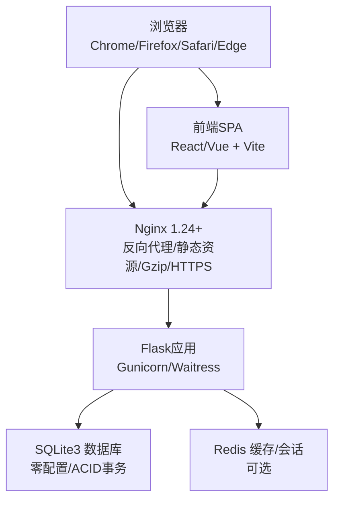
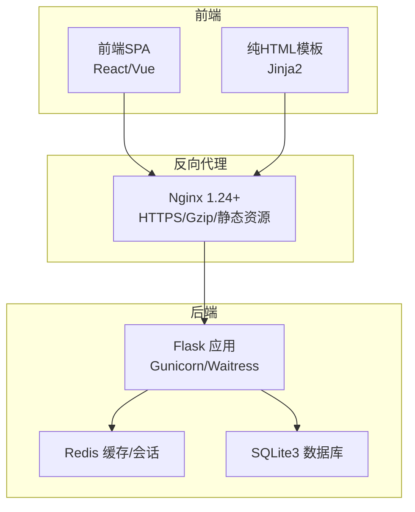
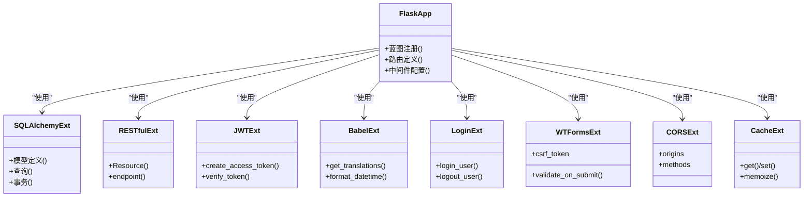
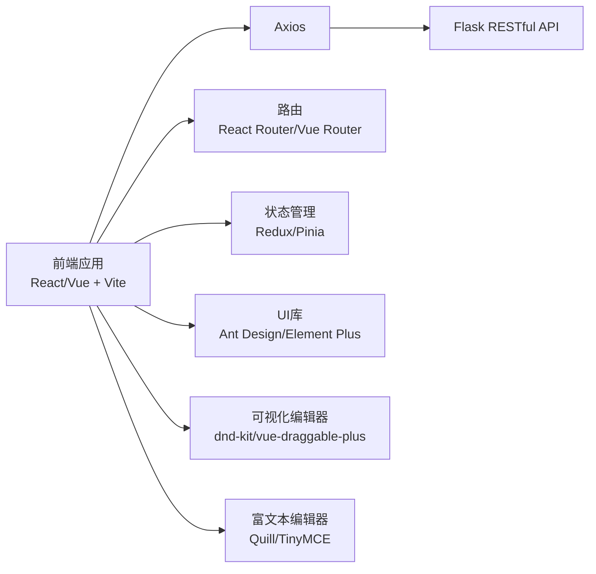
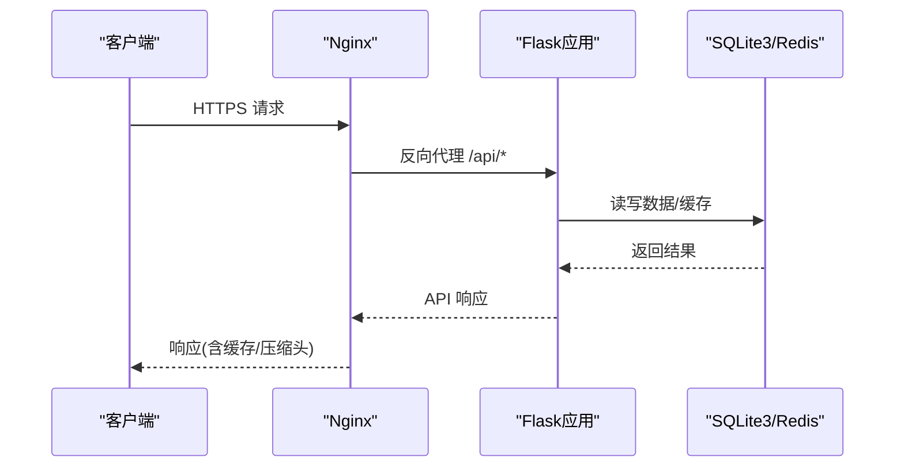
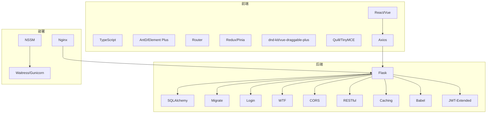

# 技术栈选型

<cite>
**本文引用的文件**
- [企业网站CMS系统开发需求文档.ini](file://企业网站CMS系统开发需求文档.ini)
- [企业网站CMS系统详细需求文档.md](file://企业网站CMS系统详细需求文档.md)
</cite>

## 目录
1. [引言](#引言)
2. [项目结构](#项目结构)
3. [核心组件](#核心组件)
4. [架构总览](#架构总览)
5. [详细组件分析](#详细组件分析)
6. [依赖分析](#依赖分析)
7. [性能考量](#性能考量)
8. [故障排查指南](#故障排查指南)
9. [结论](#结论)
10. [附录](#附录)

## 引言
本技术栈选型文档围绕企业网站CMS系统的实际需求与约束，系统阐述后端技术栈（Python 3.9+、Flask 2.3+及其扩展）、前端技术栈（React 18+/Vue 3+及其生态）、数据库选型（SQLite3 vs MySQL）、部署环境（Nginx 1.24+、Windows Server）等关键决策，并解释各组件的作用、集成方式与性能特点。文档同时提供技术栈对比分析，说明选择特定技术的原因以及替代方案的权衡。

## 项目结构
本项目采用前后端分离架构，后端提供RESTful API，前端可选React/Vue或纯HTML模板渲染（Jinja2）。系统部署于Windows Server，通过Nginx反向代理，后端使用Gunicorn或Waitress承载Flask应用，数据库采用SQLite3，缓存可选Redis。

**图表来源**
- [企业网站CMS系统详细需求文档.md](file://企业网站CMS系统详细需求文档.md#L22-L57)

**章节来源**
- [企业网站CMS系统详细需求文档.md](file://企业网站CMS系统详细需求文档.md#L22-L57)

## 核心组件
- 后端框架与扩展
  - Python 3.9+：稳定、生态丰富、部署简单
  - Flask 2.3+：轻量、灵活、扩展性强
  - Flask-SQLAlchemy：ORM、模型定义与查询
  - Flask-Migrate：数据库迁移
  - Flask-Login：用户认证
  - Flask-WTF：表单验证与CSRF保护
  - Flask-CORS：跨域支持
  - Flask-RESTful：API开发
  - Flask-Caching：缓存
  - Flask-Babel：国际化
  - Flask-JWT-Extended：JWT认证
- 前端技术栈（可选）
  - React 18+/Vue 3+ + TypeScript
  - 构建工具：Vite
  - UI库：Ant Design 5 / Element Plus
  - 状态管理：Redux Toolkit / Pinia
  - 路由：React Router 6 / Vue Router 4
  - 拖拽：dnd-kit / vue-draggable-plus
  - 富文本：Quill / TinyMCE
  - HTTP客户端：Axios
  - 表单：React Hook Form / VeeValidate
  - 图标：Ant Design Icons / Element Plus Icons
  - 纯HTML模板：Jinja2（适合简单后台）
- 数据库
  - SQLite3：零配置、ACID事务、适合中小网站
  - Redis：可选，用于缓存与会话
- 部署环境
  - Nginx 1.24+：反向代理、静态资源、Gzip、HTTPS
  - Windows Server：系统平台
  - WSGI服务器：Gunicorn（Linux）或 Waitress（Windows友好）
  - 进程管理：NSSM（Windows服务）

**章节来源**
- [企业网站CMS系统详细需求文档.md](file://企业网站CMS系统详细需求文档.md#L555-L659)

## 架构总览
系统采用“浏览器 -> Nginx -> Flask -> SQLite/Redis”的典型三层架构。Nginx负责静态资源、HTTPS终止、Gzip压缩与反向代理；Flask提供RESTful API与模板渲染；SQLite用于业务数据存储，Redis用于缓存与会话（可选）。

**图表来源**
- [企业网站CMS系统详细需求文档.md](file://企业网站CMS系统详细需求文档.md#L22-L57)

**章节来源**
- [企业网站CMS系统详细需求文档.md](file://企业网站CMS系统详细需求文档.md#L22-L57)

## 详细组件分析

### 后端技术栈（Flask 生态）
- 作用与职责
  - Flask：应用入口、路由、请求处理、模板渲染
  - Flask-SQLAlchemy：ORM、模型定义、查询与事务
  - Flask-Migrate：数据库迁移与版本演进
  - Flask-Login：用户会话与登录状态管理
  - Flask-WTF：表单验证、CSRF保护
  - Flask-CORS：跨域资源共享
  - Flask-RESTful：统一API风格与资源抽象
  - Flask-Caching：页面与数据缓存
  - Flask-Babel：国际化与多语言
  - Flask-JWT-Extended：JWT认证与授权
- 集成方式
  - 通过Flask蓝图组织模块化路由
  - 通过Flask-RESTful定义资源与动作
  - 通过Flask-CORS配置允许的源与方法
  - 通过Flask-Babel配置语言包与翻译
  - 通过Flask-JWT-Extended配置Token签名与过期策略
- 性能特点
  - 轻量、启动快、内存占用低
  - 适合中小规模网站与MVP快速迭代
  - 可通过Gunicorn/Waitress多进程提升并发

**图表来源**
- [企业网站CMS系统详细需求文档.md](file://企业网站CMS系统详细需求文档.md#L555-L659)

**章节来源**
- [企业网站CMS系统详细需求文档.md](file://企业网站CMS系统详细需求文档.md#L555-L659)

### 前端技术栈（React/Vue 生态）
- 作用与职责
  - React/Vue：构建管理后台与可视化编辑器
  - TypeScript：类型安全与开发体验
  - Vite：快速构建与热更新
  - Ant Design/Element Plus：UI组件库
  - Redux/Pinia：状态管理
  - React Router/Vue Router：路由
  - dnd-kit/vue-draggable-plus：拖拽系统
  - Quill/TinyMCE：富文本编辑
  - Axios：HTTP客户端
  - React Hook Form/VeeValidate：表单校验
  - Icons：图标库
- 集成方式
  - 通过Vite构建前端产物并由Nginx托管
  - 通过Axios调用Flask RESTful API
  - 通过路由与状态管理实现页面切换与数据流
  - 通过拖拽库实现可视化编辑器的组件拖放
- 性能特点
  - 组件化开发，便于维护与复用
  - 拖拽与富文本在MVP阶段简化实现，保证交付进度

**图表来源**
- [企业网站CMS系统详细需求文档.md](file://企业网站CMS系统详细需求文档.md#L595-L628)

**章节来源**
- [企业网站CMS系统详细需求文档.md](file://企业网站CMS系统详细需求文档.md#L595-L628)

### 数据库选型（SQLite3 vs MySQL）
- SQLite3 选型原因
  - 场景适配：静态内容为主、低并发写入、数据量小
  - 零配置：单文件数据库，无需安装服务
  - 简化部署：随应用部署，运维简单
  - 备份便捷：直接复制.db文件
  - ACID支持：事务完整，数据安全
  - 性能：读多写少场景性能优异
- 何时考虑升级到 MySQL
  - 日均访问量 > 10万PV
  - 并发写入频繁
  - 数据量 > 100万条
  - 需要分布式、主从复制、读写分离
- SQLite3 与 MySQL 对比

| 维度 | SQLite3 | MySQL |
|---|---|---|
| 安装与配置 | 零配置 | 需要服务端安装与维护 |
| 部署复杂度 | 极低 | 中等偏高 |
| 备份与恢复 | 文件复制 | 逻辑/物理备份 |
| 并发写入 | 有限 | 更强 |
| 大数据量 | 适合中小规模 | 更适合大规模 |
| 分布式能力 | 无 | 支持主从/集群 |
| 成本 | 免费 | 商业许可/云服务成本 |

**章节来源**
- [企业网站CMS系统详细需求文档.md](file://企业网站CMS系统详细需求文档.md#L662-L703)

### 部署环境（Nginx 1.24+、Windows Server）
- Nginx 1.24+ 配置要点
  - 反向代理：将/api/转发至Flask应用
  - 静态资源：/static/与/media/分别指向静态与媒体目录
  - Gzip压缩：开启文本与JS/CSS压缩
  - HTTPS：SSL证书配置与HSTS
  - 负载均衡：可选多实例
- Windows Server 部署要点
  - WSGI服务器：使用Waitress（Windows友好）
  - 进程管理：NSSM注册为Windows服务，开机自启、崩溃重启
  - 环境变量：通过.env与Flask配置管理
- 进程与服务管理

**图表来源**
- [企业网站CMS系统详细需求文档.md](file://企业网站CMS系统详细需求文档.md#L1143-L1230)
- [企业网站CMS系统详细需求文档.md](file://企业网站CMS系统详细需求文档.md#L1232-L1302)
- [企业网站CMS系统详细需求文档.md](file://企业网站CMS系统详细需求文档.md#L1324-L1356)

**章节来源**
- [企业网站CMS系统详细需求文档.md](file://企业网站CMS系统详细需求文档.md#L629-L659)
- [企业网站CMS系统详细需求文档.md](file://企业网站CMS系统详细需求文档.md#L1143-L1230)
- [企业网站CMS系统详细需求文档.md](file://企业网站CMS系统详细需求文档.md#L1232-L1302)
- [企业网站CMS系统详细需求文档.md](file://企业网站CMS系统详细需求文档.md#L1324-L1356)

## 依赖分析
- 组件耦合与内聚
  - Flask应用内部通过蓝图划分模块，内聚性良好
  - 前后端通过RESTful API解耦，便于独立演进
  - Nginx作为单一入口，集中处理静态资源与代理
- 外部依赖与集成点
  - Flask依赖：SQLAlchemy、Migrate、Login、WTF、CORS、RESTful、Caching、Babel、JWT
  - 前端依赖：React/Vue、TypeScript、UI库、状态管理、路由、拖拽、富文本、HTTP客户端
  - 部署依赖：Nginx、Windows服务（NSSM）、WSGI服务器（Waitress/Gunicorn）
- 潜在环路与风险
  - 前端与后端的API契约变更需谨慎管理
  - SQLite在高并发写入场景可能成为瓶颈，需评估升级MySQL

**图表来源**
- [企业网站CMS系统详细需求文档.md](file://企业网站CMS系统详细需求文档.md#L555-L659)
- [企业网站CMS系统详细需求文档.md](file://企业网站CMS系统详细需求文档.md#L595-L628)
- [企业网站CMS系统详细需求文档.md](file://企业网站CMS系统详细需求文档.md#L1143-L1230)
- [企业网站CMS系统详细需求文档.md](file://企业网站CMS系统详细需求文档.md#L1324-L1356)

**章节来源**
- [企业网站CMS系统详细需求文档.md](file://企业网站CMS系统详细需求文档.md#L555-L659)
- [企业网站CMS系统详细需求文档.md](file://企业网站CMS系统详细需求文档.md#L595-L628)
- [企业网站CMS系统详细需求文档.md](file://企业网站CMS系统详细需求文档.md#L1143-L1230)
- [企业网站CMS系统详细需求文档.md](file://企业网站CMS系统详细需求文档.md#L1324-L1356)

## 性能考量
- 响应时间与并发
  - 页面加载时间：< 3秒
  - API响应：< 500ms
  - 数据库查询：< 100ms
  - 并发用户：> 1000（MVP阶段以SQLite读性能为主）
- 缓存策略
  - 页面缓存：Redis（可选）
  - 数据缓存：查询结果与API响应缓存
  - 静态资源缓存：浏览器缓存与版本化
- 资源优化
  - 图片懒加载、响应式图片、WebP
  - CSS/JS压缩与关键CSS内联
  - CDN加速（可选）
- 数据库优化
  - 合理索引、避免N+1查询
  - SQLite读多写少场景性能优异
  - 高并发场景评估升级MySQL

**章节来源**
- [企业网站CMS系统详细需求文档.md](file://企业网站CMS系统详细需求文档.md#L1362-L1380)
- [企业网站CMS系统详细需求文档.md](file://企业网站CMS系统详细需求文档.md#L512-L548)

## 故障排查指南
- 常见问题与定位
  - API 401/403：检查JWT签名、过期与权限装饰器
  - CSRF错误：确认Flask-WTF CSRF Token与SameSite配置
  - 文件上传失败：检查ALLOWED_EXTENSIONS、MAX_CONTENT_LENGTH、存储路径
  - SQLite并发写入冲突：评估写入频率与升级MySQL
  - Nginx静态资源404：确认alias与try_files配置
  - Windows服务无法启动：检查NSSM参数与日志
- 日志与监控
  - Flask日志：logging + RotatingFileHandler
  - Nginx访问/错误日志：定位请求与错误
  - 可选：Flask-Profiler、Sentry

**章节来源**
- [企业网站CMS系统详细需求文档.md](file://企业网站CMS系统详细需求文档.md#L1078-L1140)
- [企业网站CMS系统详细需求文档.md](file://企业网站CMS系统详细需求文档.md#L1232-L1302)
- [企业网站CMS系统详细需求文档.md](file://企业网站CMS系统详细需求文档.md#L1324-L1356)

## 结论
本技术栈选型以“轻量、易部署、易维护”为核心目标，结合企业官网CMS的实际场景，选择了Python 3.9+ + Flask 2.3+ + SQLite3 + Nginx + Windows Server 的组合。该方案在MVP阶段具备快速交付与低成本运维的优势；随着业务增长与并发压力上升，可评估引入Redis缓存与MySQL数据库，以满足更高性能与可扩展性需求。前后端通过RESTful API解耦，前端可选React/Vue或纯HTML模板，满足不同团队与产品形态的需求。

## 附录
- 技术术语
  - CMS：内容管理系统
  - SPA：单页应用
  - ORM：对象关系映射
  - JWT：JSON Web Token
  - RBAC：基于角色的访问控制
  - CSRF：跨站请求伪造
  - XSS：跨站脚本攻击
  - SEO：搜索引擎优化
  - CDN：内容分发网络
  - SSL/TLS：安全套接字层/传输层安全
- 参考资料
  - Flask 官方文档
  - React/Vue 官方文档
  - Nginx 官方文档
  - Ant Design / Element Plus
  - Quill.js

**章节来源**
- [企业网站CMS系统详细需求文档.md](file://企业网站CMS系统详细需求文档.md#L1963-L1992)