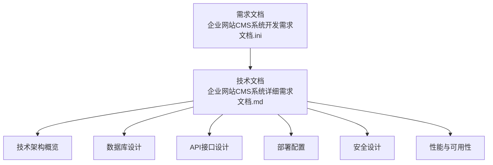
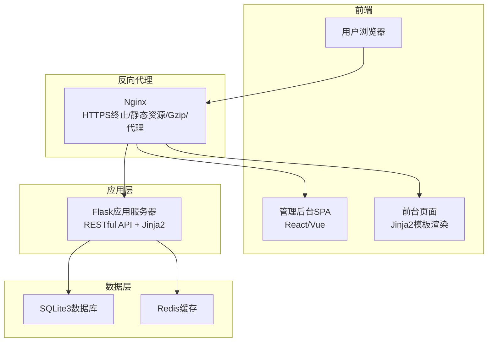
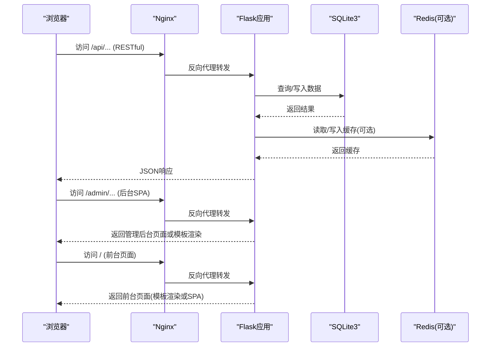
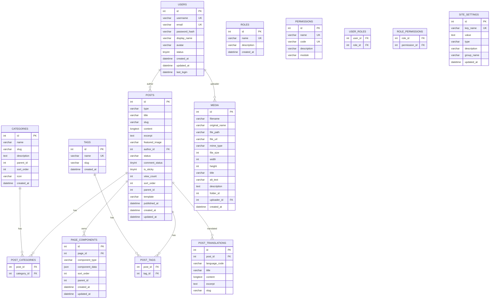
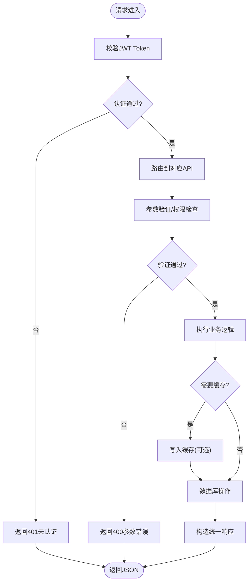
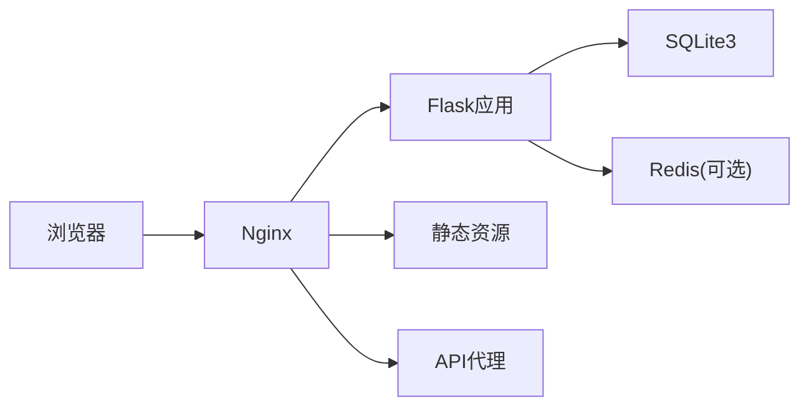

# 系统架构概览

<cite>
**本文档引用的文件**
- [企业网站CMS系统开发需求文档.ini](file://企业网站CMS系统开发需求文档.ini)
- [企业网站CMS系统详细需求文档.md](file://企业网站CMS系统详细需求文档.md)
</cite>

## 目录
1. [引言](#引言)
2. [项目结构](#项目结构)
3. [核心组件](#核心组件)
4. [架构总览](#架构总览)
5. [详细组件分析](#详细组件分析)
6. [依赖关系分析](#依赖关系分析)
7. [性能考量](#性能考量)
8. [故障排查指南](#故障排查指南)
9. [结论](#结论)
10. [附录](#附录)

## 引言
本系统为企业网站CMS（内容管理系统）的架构概览文档，面向企业官网的快速搭建与灵活配置需求。系统采用前后端分离架构，结合Jinja2模板渲染与SPA单页应用两种模式，支持可视化拖拽布局与组件化内容管理，具备多语言、SEO优化、缓存与CDN等性能优化能力，并在Windows Server环境下通过Nginx反向代理、Flask应用服务器与SQLite数据库协同工作，满足中小企业的部署与运维需求。

## 项目结构
系统由需求文档与技术文档两部分构成，前者明确了功能边界与技术选型建议，后者给出了具体的技术架构、数据库设计、API规范、部署配置与性能安全要求。整体结构清晰，便于从高层到细节的逐层理解。

**章节来源**
- file://企业网站CMS系统开发需求文档.ini#L1-L191
- file://企业网站CMS系统详细需求文档.md#L1-L200

## 核心组件
- 用户浏览器：支持主流桌面与移动端浏览器，负责访问前台页面与后台管理界面。
- Nginx反向代理：提供静态资源服务、HTTPS终止、Gzip压缩、负载均衡与API代理。
- Flask应用服务器：提供RESTful API与Jinja2模板渲染，处理业务逻辑与权限控制。
- MySQL/SQLite数据库：存储业务数据、用户信息与配置信息；在本方案中采用SQLite3以简化部署与运维。
- Redis缓存：可选用于Session、页面缓存与Token管理，提升高并发场景下的性能与用户体验。

**章节来源**
- file://企业网站CMS系统详细需求文档.md#L22-L57
- file://企业网站CMS系统详细需求文档.md#L553-L660

## 架构总览
系统采用“前后端分离 + 混合渲染”的架构模式：
- 前端：React/Vue构建的管理后台与前台展示页面，支持SPA单页应用。
- 后端：Flask提供RESTful API与Jinja2模板渲染，支持纯HTML后台与SPA前台。
- 部署：Nginx作为反向代理与静态资源服务，Flask通过WSGI（Gunicorn/Waitress）运行，数据库采用SQLite3，Redis可选。

**图表来源**
- file://企业网站CMS系统详细需求文档.md#L22-L57
- file://企业网站CMS系统详细需求文档.md#L1143-L1230
- file://企业网站CMS系统详细需求文档.md#L1232-L1302

**章节来源**
- file://企业网站CMS系统详细需求文档.md#L22-L57
- file://企业网站CMS系统详细需求文档.md#L1143-L1230
- file://企业网站CMS系统详细需求文档.md#L1232-L1302

## 详细组件分析

### 前后端分离与混合渲染
- 前端管理后台采用SPA模式，通过Axios调用Flask RESTful API，实现登录、内容管理、媒体库等功能。
- 前台展示页面支持两种模式：
  - SPA模式：前端根据页面组件配置渲染。
  - 模板渲染模式：后端使用Jinja2渲染页面，适合SEO与首屏性能优化。
- Nginx将静态资源与API请求分别路由至前端构建目录与Flask应用，实现统一入口与缓存优化。

**图表来源**
- file://企业网站CMS系统详细需求文档.md#L1143-L1230
- file://企业网站CMS系统详细需求文档.md#L1232-L1302

**章节来源**
- file://企业网站CMS系统详细需求文档.md#L24-L27
- file://企业网站CMS系统详细需求文档.md#L1143-L1230
- file://企业网站CMS系统详细需求文档.md#L1232-L1302

### 数据库与缓存设计
- 数据库：采用SQLite3，具备零配置、ACID事务、跨平台等优势，适合中小网站与低并发场景。
- 缓存：可选Redis，用于Session、页面缓存与Token管理，提升高并发性能。
- 全文搜索：通过SQLite FTS5虚拟表实现，配合触发器保持同步，满足内容检索需求。

**图表来源**
- file://企业网站CMS系统详细需求文档.md#L714-L938

**章节来源**
- file://企业网站CMS系统详细需求文档.md#L660-L713
- file://企业网站CMS系统详细需求文档.md#L714-L938

### API与接口规范
- 协议与格式：HTTPS + JSON，统一前缀/api/v1/。
- 认证：JWT Token，支持登录、登出、刷新、忘记密码等流程。
- 分页与元数据：统一响应结构，包含分页信息与请求ID。
- 接口覆盖：认证、用户管理、文章管理、页面管理、分类标签、媒体库、系统配置等。

**图表来源**
- file://企业网站CMS系统详细需求文档.md#L940-L998
- file://企业网站CMS系统详细需求文档.md#L1000-L1076

**章节来源**
- file://企业网站CMS系统详细需求文档.md#L940-L998
- file://企业网站CMS系统详细需求文档.md#L1000-L1076

### 安全与性能策略
- 安全：JWT Token、bcrypt密码加密、CORS配置、CSRF防护、XSS输出转义、SQL注入防护、文件上传白名单与大小限制、HTTPS强制跳转与HSTS头。
- 性能：页面缓存（Redis）、数据缓存、静态资源CDN、Gzip压缩、图片懒加载与响应式、关键CSS内联、异步加载非关键资源。
- 可用性：日志记录、错误追踪（可选）、监控告警、备份策略与容灾恢复。

**章节来源**
- file://企业网站CMS系统详细需求文档.md#L1078-L1140
- file://企业网站CMS系统详细需求文档.md#L512-L548
- file://企业网站CMS系统详细需求文档.md#L1360-L1441

## 依赖关系分析
- 组件耦合：前端通过RESTful API与后端解耦；Nginx作为统一入口，降低后端直接暴露风险。
- 外部依赖：Flask生态（SQLAlchemy、RESTful、CORS、Caching、Babel、JWT等），Redis（可选），SQLite3，Nginx，Windows Server + NSSM服务管理。
- 循环依赖：文档中未见循环依赖迹象，模块职责清晰（认证、内容、媒体、配置）。

**图表来源**
- file://企业网站CMS系统详细需求文档.md#L1143-L1230
- file://企业网站CMS系统详细需求文档.md#L1232-L1302

**章节来源**
- file://企业网站CMS系统详细需求文档.md#L1143-L1230
- file://企业网站CMS系统详细需求文档.md#L1232-L1302

## 性能考量
- 前端性能：SPA按需加载、组件懒加载、关键资源内联、CDN加速、Gzip压缩。
- 后端性能：Flask多worker进程（Gunicorn/Waitress），SQLite读取性能优异，Redis缓存可选。
- 数据库优化：合理索引、避免N+1查询、连接池配置、慢查询日志。
- 缓存策略：页面缓存、数据缓存、静态资源缓存、缓存失效与预热。

**章节来源**
- file://企业网站CMS系统详细需求文档.md#L512-L548
- file://企业网站CMS系统详细需求文档.md#L660-L713
- file://企业网站CMS系统详细需求文档.md#L1232-L1302

## 故障排查指南
- 认证问题：检查JWT密钥、Token过期与刷新流程、CORS配置。
- 数据库问题：确认SQLite文件路径与权限、连接字符串、FTS5触发器是否正确。
- 缓存问题：验证Redis连接、Key命名规范、缓存过期策略。
- 部署问题：确认Nginx配置、SSL证书、Windows服务（NSSM）状态、日志路径。
- 性能问题：启用慢查询日志、监控Redis命中率、分析前端资源加载时间。

**章节来源**
- file://企业网站CMS系统详细需求文档.md#L1232-L1302
- file://企业网站CMS系统详细需求文档.md#L1324-L1356

## 结论
该CMS系统通过前后端分离与混合渲染模式，实现了灵活的可视化编辑与高效的前台展示；在Windows Server环境下，借助Nginx与Flask的协作，结合SQLite3与Redis（可选）的组合，既满足了中小企业的部署与运维需求，又兼顾了性能与安全。文档提供了清晰的架构设计、数据库模型、API规范与部署配置，便于后续扩展与维护。

## 附录
- 技术术语：CMS、SPA、ORM、JWT、RBAC、CSRF、XSS、SEO、CDN、SSL/TLS。
- 参考资料：Flask、React、Vue、Nginx、SQLite3等官方文档与相关技术资源。

**章节来源**
- file://企业网站CMS系统详细需求文档.md#L1961-L1999