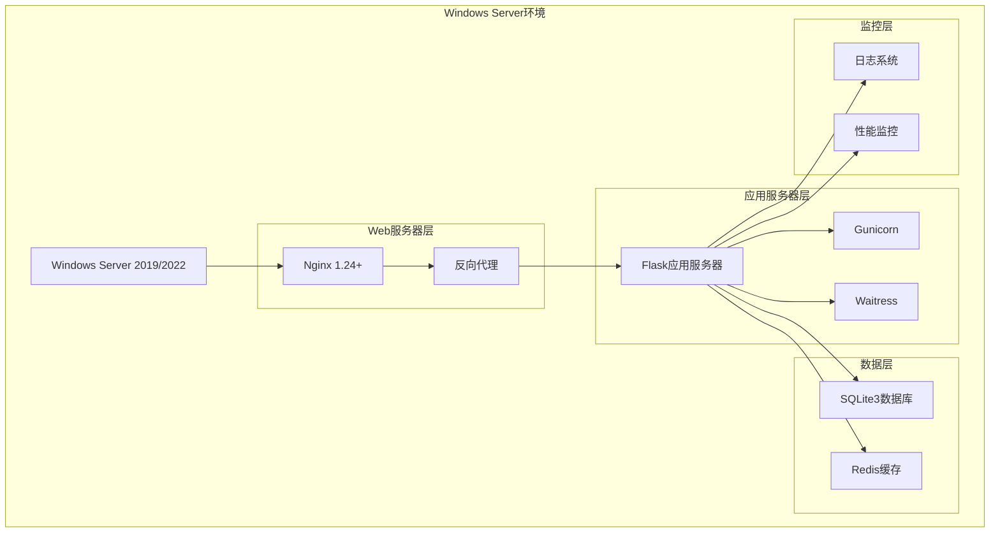
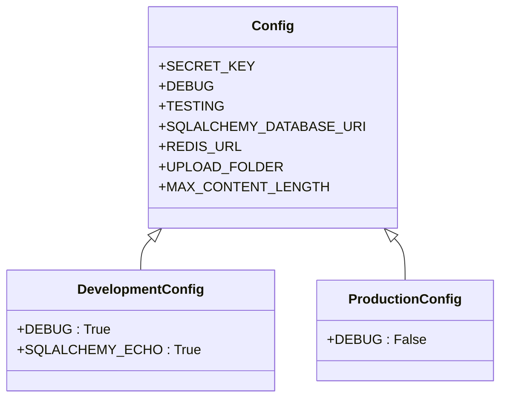
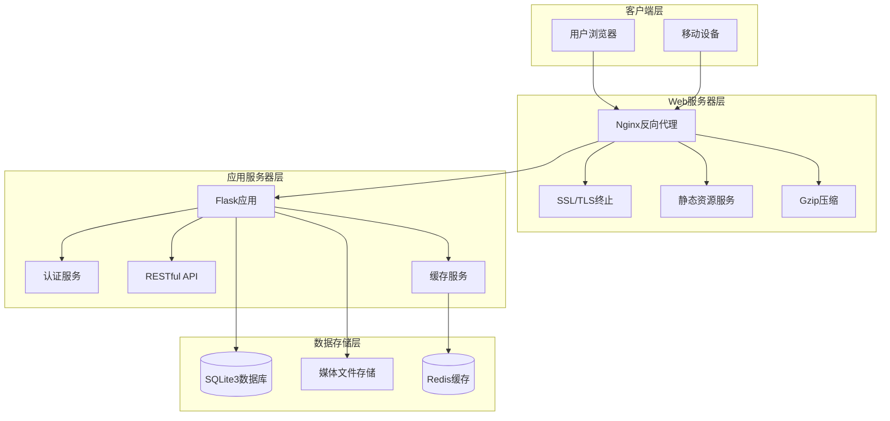
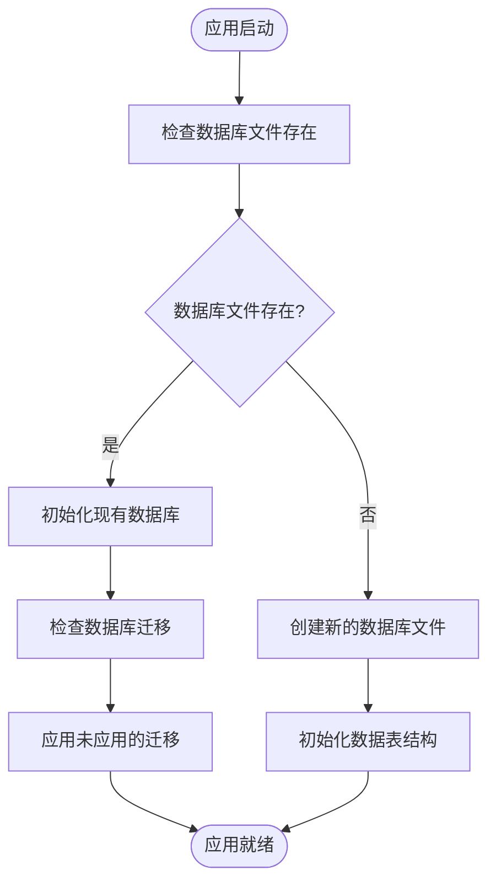
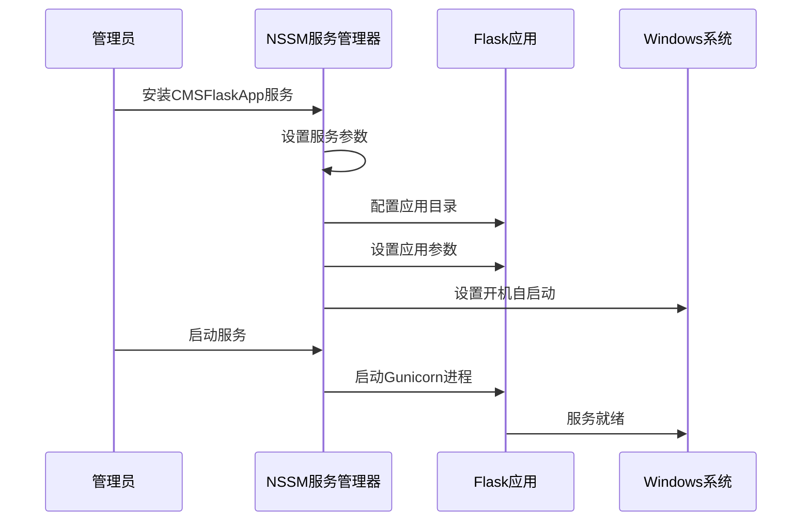
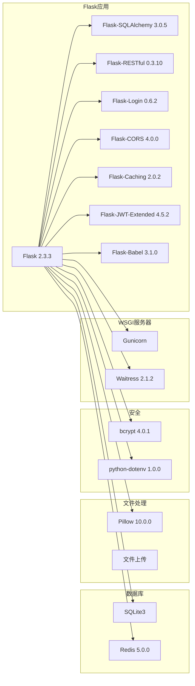
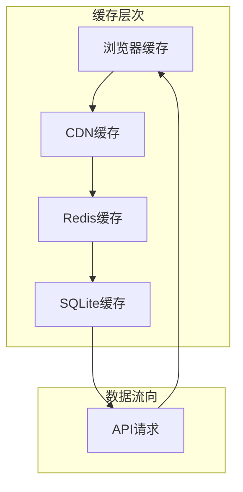

# Flask应用部署

<cite>
**本文档引用的文件**
- [企业网站CMS系统详细需求文档.md](file://企业网站CMS系统详细需求文档.md)
</cite>

## 目录
1. [简介](#简介)
2. [项目结构](#项目结构)
3. [核心组件](#核心组件)
4. [架构概览](#架构概览)
5. [详细组件分析](#详细组件分析)
6. [依赖分析](#依赖分析)
7. [性能考虑](#性能考虑)
8. [故障排除指南](#故障排除指南)
9. [结论](#结论)

## 简介

本文档提供了基于Flask的企业网站CMS系统的完整部署指南。该系统采用Python Flask作为后端框架，结合Nginx反向代理服务器，在Windows Server环境下实现高性能的企业官网内容管理系统。

系统采用前后端分离架构，支持多种部署模式：
- 纯HTML模板渲染模式（Jinja2）
- SPA单页应用模式（React/Vue）
- 混合模式支持

## 项目结构

基于需求文档分析，Flask应用的核心项目结构如下：



**图表来源**
- [企业网站CMS系统详细需求文档.md](file://企业网站CMS系统详细需求文档.md#L22-L57)

**章节来源**
- [企业网站CMS系统详细需求文档.md](file://企业网站CMS系统详细需求文档.md#L22-L57)

## 核心组件

### WSGI服务器选择

系统支持两种WSGI服务器配置：

#### Gunicorn配置
- **多worker进程**: `-w 4` (4个worker进程)
- **绑定地址**: `-b 127.0.0.1:8000`
- **访问日志**: `--access-logfile D:\cms\logs\access.log`
- **错误日志**: `--error-logfile D:\cms\logs\error.log`
- **应用入口**: `wsgi:app`

#### Waitress配置（Windows友好）
- **Windows Server优化**: 更好的Windows兼容性
- **异步处理**: 支持异步worker模式
- **进程管理**: 适合Windows环境的服务管理

### 配置文件结构

系统采用分层配置管理：



**图表来源**
- [企业网站CMS系统详细需求文档.md](file://企业网站CMS系统详细需求文档.md#L1239-L1301)

**章节来源**
- [企业网站CMS系统详细需求文档.md](file://企业网站CMS系统详细需求文档.md#L1239-L1301)

## 架构概览

系统采用经典的三层架构模式：



**图表来源**
- [企业网站CMS系统详细需求文档.md](file://企业网站CMS系统详细需求文档.md#L28-L57)

**章节来源**
- [企业网站CMS系统详细需求文档.md](file://企业网站CMS系统详细需求文档.md#L28-L57)

## 详细组件分析

### Nginx反向代理配置

Nginx作为系统的统一入口，提供以下核心功能：

#### SSL/TLS配置
- **协议支持**: TLSv1.2, TLSv1.3
- **加密套件**: HIGH:!aNULL:!MD5
- **证书管理**: 支持Let's Encrypt等证书颁发机构

#### 安全头配置
- **X-Frame-Options**: SAMEORIGIN
- **X-Content-Type-Options**: nosniff  
- **X-XSS-Protection**: 1; mode=block

#### 静态资源优化
- **缓存策略**: 30天缓存策略
- **压缩支持**: Gzip压缩
- **文件类型**: 文本、CSS、JavaScript、JSON、XML

### Flask应用配置

#### 数据库配置
系统采用SQLite3作为主要数据库，具有以下特点：



**图表来源**
- [企业网站CMS系统详细需求文档.md](file://企业网站CMS系统详细需求文档.md#L662-L712)

#### 缓存配置
- **缓存类型**: Redis
- **默认超时**: 300秒
- **会话存储**: Redis
- **永久会话**: 24小时

#### 文件上传配置
- **最大文件大小**: 50MB
- **允许的文件类型**: PNG, JPG, JPEG, GIF, SVG, WEBP, MP4, PDF
- **存储路径**: D:/cms/media

**章节来源**
- [企业网站CMS系统详细需求文档.md](file://企业网站CMS系统详细需求文档.md#L1234-L1301)

### Windows服务管理

系统使用NSSM（Non-Sucking Service Manager）将Flask应用注册为Windows服务：

#### 服务配置流程


**图表来源**
- [企业网站CMS系统详细需求文档.md](file://企业网站CMS系统详细需求文档.md#L1324-L1344)

**章节来源**
- [企业网站CMS系统详细需求文档.md](file://企业网站CMS系统详细需求文档.md#L1324-L1344)

## 依赖分析

### 核心依赖关系



**图表来源**
- [企业网站CMS系统详细需求文档.md](file://企业网站CMS系统详细需求文档.md#L1304-L1322)

**章节来源**
- [企业网站CMS系统详细需求文档.md](file://企业网站CMS系统详细需求文档.md#L1304-L1322)

### 环境变量配置

系统采用dotenv模式管理环境变量：

#### 生产环境配置
```bash
FLASK_ENV=production
SECRET_KEY=your-production-secret-key
JWT_SECRET_KEY=your-jwt-secret-key
DATABASE_URL=sqlite:///D:/cms/data/cms.db
REDIS_URL=redis://localhost:6379/0
MAIL_SERVER=smtp.example.com
MAIL_USERNAME=noreply@example.com
MAIL_PASSWORD=your-mail-password
```

#### 开发环境配置
- **调试模式**: DEBUG=True
- **SQLAlchemy回显**: SQLALCHEMY_ECHO=True
- **日志级别**: 更详细的日志输出

**章节来源**
- [企业网站CMS系统详细需求文档.md](file://企业网站CMS系统详细需求文档.md#L1346-L1356)

## 性能考虑

### 性能基准要求

系统性能指标要求：
- **页面加载时间**: 首页 < 2秒，内页 < 3秒
- **API响应时间**: < 500ms
- **数据库查询**: < 100ms
- **文件上传速度**: 10MB/s
- **并发用户**: 支持1000+用户并发

### 缓存策略

#### 多层缓存架构


#### 缓存配置要点
- **页面缓存**: Redis存储，300秒超时
- **会话缓存**: Redis存储，24小时超时
- **静态资源**: Nginx缓存，30天过期
- **数据库查询**: Redis缓存热点数据

### 监控配置

#### 日志配置
- **访问日志**: D:/cms/logs/access.log
- **错误日志**: D:/cms/logs/error.log
- **RotatingFileHandler**: 日志轮转
- **logging模块**: 标准Python日志框架

#### 性能监控
- **Flask-Profiler**: 可选性能分析
- **Sentry**: 错误追踪（可选）
- **系统监控**: CPU、内存、磁盘使用率

**章节来源**
- [企业网站CMS系统详细需求文档.md](file://企业网站CMS系统详细需求文档.md#L1358-L1358)

## 故障排除指南

### 常见部署问题

#### 1. WSGI服务器启动失败

**症状**: Flask应用无法启动
**解决方案**:
- 检查Python虚拟环境是否正确激活
- 验证requirements.txt中的依赖安装
- 确认端口8000未被其他程序占用
- 检查防火墙设置

#### 2. Nginx代理配置错误

**症状**: 访问404或502错误
**解决方案**:
- 验证upstream配置指向正确的Flask地址
- 检查proxy_pass配置语法
- 确认Flask应用监听127.0.0.1:8000
- 验证SSL证书路径正确

#### 3. 数据库连接问题

**症状**: 应用启动时报数据库错误
**解决方案**:
- 检查DATABASE_URL环境变量
- 验证SQLite数据库文件权限
- 确认数据库文件路径存在
- 检查磁盘空间充足

#### 4. 文件上传失败

**症状**: 文件上传返回413或500错误
**解决方案**:
- 检查client_max_body_size配置
- 验证ALLOWED_EXTENSIONS设置
- 确认上传目录权限
- 检查MAX_CONTENT_LENGTH限制

#### 5. Windows服务无法启动

**症状**: NSSM服务状态异常
**解决方案**:
- 使用`nssm status CMSFlaskApp`检查状态
- 查看服务日志获取详细错误信息
- 验证Python路径正确性
- 检查工作目录权限

### 性能调优建议

#### 1. worker进程配置
- **CPU密集型应用**: 根据CPU核心数设置worker数量
- **I/O密集型应用**: 可适当增加worker数量
- **内存限制**: 监控每个worker的内存使用

#### 2. 缓存优化
- **热点数据缓存**: Redis存储高频访问数据
- **页面片段缓存**: 缓存动态页面的部分内容
- **数据库查询缓存**: 缓存常用的查询结果

#### 3. 数据库优化
- **索引优化**: 为常用查询字段建立索引
- **查询优化**: 避免N+1查询问题
- **连接池配置**: 合理设置数据库连接池大小

**章节来源**
- [企业网站CMS系统详细需求文档.md](file://企业网站CMS系统详细需求文档.md#L1865-L1923)

## 结论

本文档提供了基于Flask的企业网站CMS系统的完整部署指南。系统采用现代化的架构设计，结合Nginx反向代理和WSGI服务器，实现了高性能、可扩展的企业官网内容管理解决方案。

### 关键优势

1. **架构清晰**: 采用前后端分离架构，便于维护和扩展
2. **部署简便**: Windows Server友好，使用NSSM简化服务管理
3. **性能优秀**: 多层缓存策略，支持高并发访问
4. **安全可靠**: 完善的安全配置和监控机制
5. **成本效益**: 采用SQLite3降低部署和维护成本

### 最佳实践建议

1. **生产环境**: 始终使用生产配置，启用SSL/TLS
2. **监控告警**: 建立完善的日志和监控体系
3. **备份策略**: 定期备份数据库和配置文件
4. **性能监控**: 持续监控系统性能指标
5. **安全更新**: 及时更新依赖包和系统补丁

通过遵循本文档提供的部署指南和最佳实践，可以确保Flask应用在生产环境中稳定、高效地运行。