# Nginx反向代理配置

<cite>
**本文档引用的文件**
- [企业网站CMS系统详细需求文档.md](file://企业网站CMS系统详细需求文档.md)
- [开发计划表_2月4日-2月12日.md](file://开发计划表_2月4日-2月12日.md)
</cite>

## 目录
1. [简介](#简介)
2. [项目结构](#项目结构)
3. [核心组件](#核心组件)
4. [架构概览](#架构概览)
5. [详细组件分析](#详细组件分析)
6. [依赖关系分析](#依赖关系分析)
7. [性能考虑](#性能考虑)
8. [故障排除指南](#故障排除指南)
9. [结论](#结论)

## 简介

本文档详细说明了Nginx反向代理在企业网站CMS系统中的配置和使用。该系统采用Flask作为后端应用服务器，使用Nginx作为反向代理服务器，实现了静态资源服务、负载均衡、HTTPS终止和Gzip压缩等功能。

根据项目需求文档，系统采用前后端分离架构，Nginx作为统一入口点，负责：
- 静态资源服务（前端构建产物）
- 反向代理到Flask应用服务器
- HTTPS终止和SSL/TLS处理
- Gzip压缩优化
- 负载均衡（可选）

## 项目结构

基于开发计划表，项目采用前后端分离的部署架构：

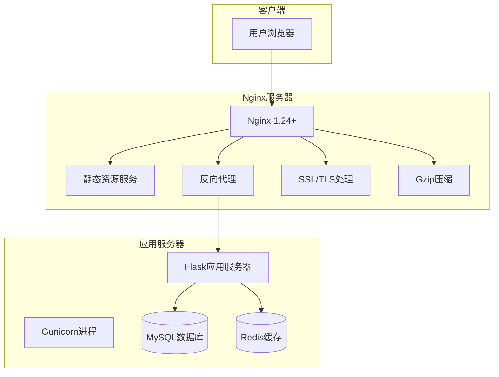

**图表来源**
- [企业网站CMS系统详细需求文档.md](file://企业网站CMS系统详细需求文档.md#L28-L57)
- [开发计划表_2月4日-2月12日.md](file://开发计划表_2月4日-2月12日.md#L441-L506)

**章节来源**
- [企业网站CMS系统详细需求文档.md](file://企业网站CMS系统详细需求文档.md#L22-L57)
- [开发计划表_2月4日-2月12日.md](file://开发计划表_2月4日-2月12日.md#L441-L506)

## 核心组件

### Nginx反向代理架构

系统采用Nginx作为统一入口点，主要承担以下职责：

1. **静态资源服务**：托管前端构建后的静态文件
2. **API代理**：将API请求转发到后端Flask应用
3. **HTTPS终止**：处理SSL/TLS加密和证书管理
4. **负载均衡**：支持多实例应用服务器
5. **缓存优化**：静态资源缓存和压缩

### 应用架构

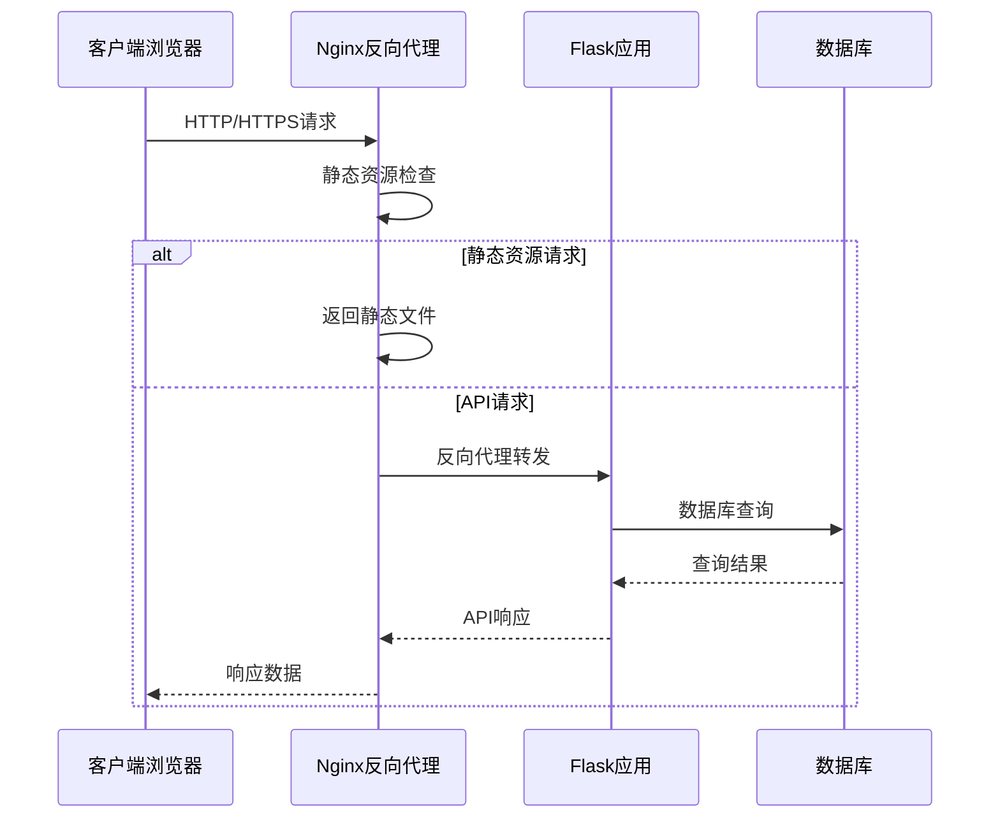

**图表来源**
- [企业网站CMS系统详细需求文档.md](file://企业网站CMS系统详细需求文档.md#L36-L49)

**章节来源**
- [企业网站CMS系统详细需求文档.md](file://企业网站CMS系统详细需求文档.md#L28-L57)

## 架构概览

### 系统架构图

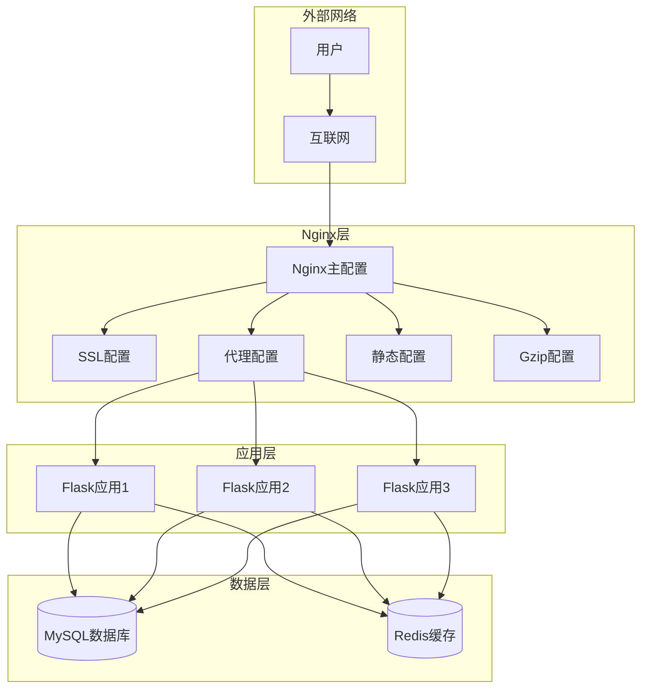

**图表来源**
- [开发计划表_2月4日-2月12日.md](file://开发计划表_2月4日-2月12日.md#L465-L487)

### 配置层次结构

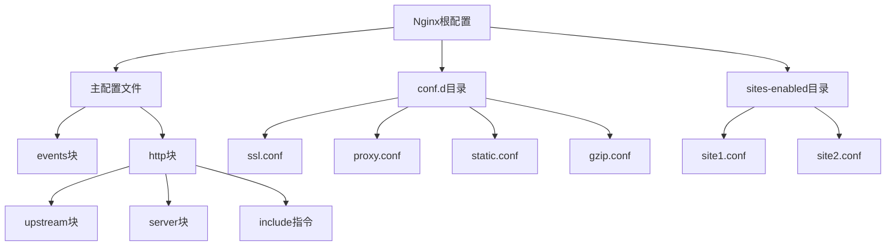

**图表来源**
- [开发计划表_2月4日-2月12日.md](file://开发计划表_2月4日-2月12日.md#L465-L487)

## 详细组件分析

### 基本反向代理配置

#### 静态资源服务配置

静态资源配置负责托管前端构建后的文件，包括HTML、CSS、JavaScript、图片等静态文件。

**配置要点**：
- 使用alias指令指向构建输出目录
- 设置适当的缓存头信息
- 配置错误页面处理
- 启用Gzip压缩

#### API反向代理配置

API代理配置将动态请求转发到后端Flask应用服务器。

**配置要点**：
- 使用proxy_pass指令指定后端地址
- 设置代理头信息传递
- 配置超时参数
- 错误处理和重试机制

#### 基本配置示例

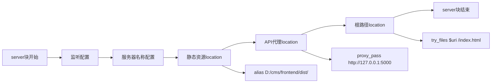

**图表来源**
- [开发计划表_2月4日-2月12日.md](file://开发计划表_2月4日-2月12日.md#L467-L485)

### HTTPS证书配置

#### SSL/TLS配置

系统支持HTTPS协议，需要配置SSL证书和相关参数。

**配置要素**：
- 证书文件路径配置
- 私钥文件路径配置
- SSL协议版本和加密套件
- HSTS头信息设置
- OCSP Stapling启用

#### Let's Encrypt证书配置

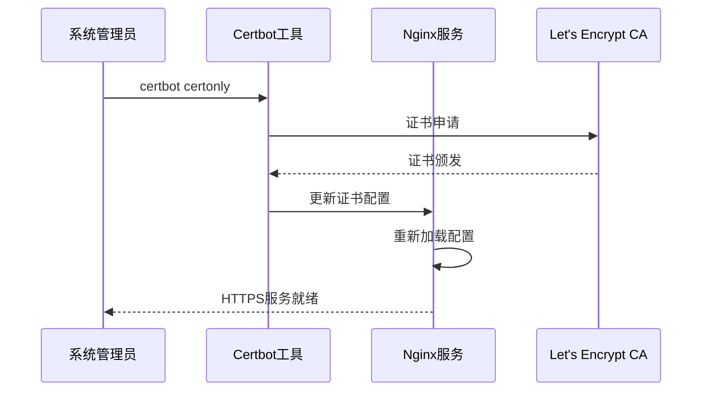

**图表来源**
- [开发计划表_2月4日-2月12日.md](file://开发计划表_2月4日-2月12日.md#L489-L499)

### 负载均衡配置

#### Upstream配置

负载均衡配置允许多个Flask应用实例同时处理请求，提高系统的可用性和性能。

**配置要素**：
- upstream块定义
- 服务器列表和权重
- 健康检查配置
- 会话保持设置

#### 健康检查机制

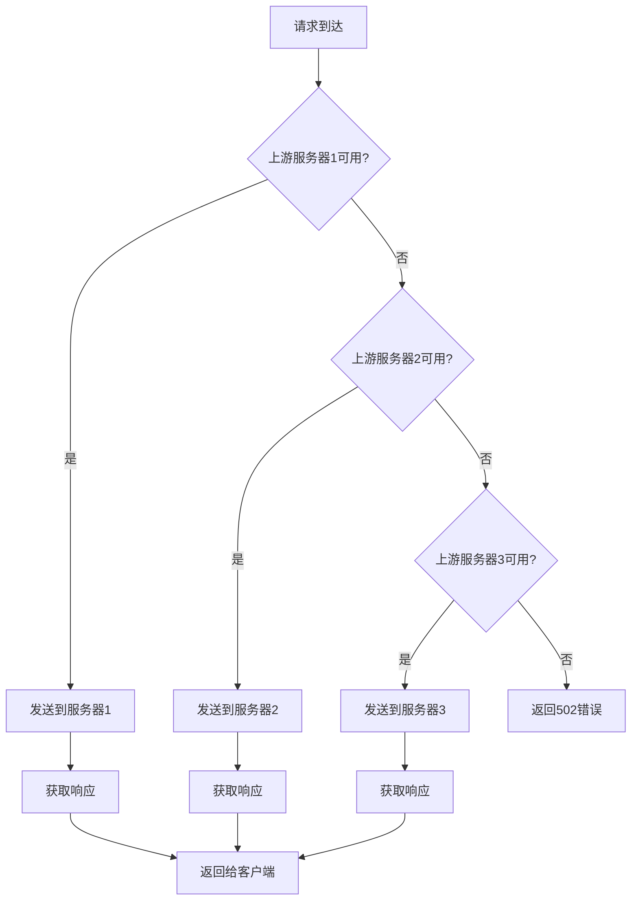

**图表来源**
- [开发计划表_2月4日-2月12日.md](file://开发计划表_2月4日-2月12日.md#L465-L487)

### Gzip压缩配置

#### 压缩配置

Gzip压缩配置用于减少传输数据量，提高页面加载速度。

**配置要素**：
- 启用gzip压缩
- 设置压缩级别
- 指定压缩的MIME类型
- 配置压缩缓冲区

#### 压缩流程

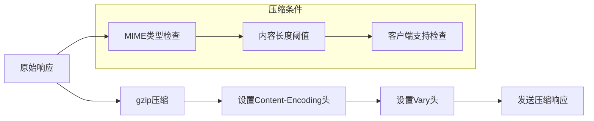

**图表来源**
- [开发计划表_2月4日-2月12日.md](file://开发计划表_2月4日-2月12日.md#L465-L487)

### 性能优化配置

#### 连接池配置

连接池配置用于管理与后端服务器的连接，提高连接复用效率。

**配置要素**：
- keepalive超时设置
- 最大连接数配置
- 连接复用策略

#### 缓冲区配置

缓冲区配置用于优化数据传输过程中的内存使用。

**配置要素**：
- 请求缓冲区大小
- 响应缓冲区大小
- 临时文件配置

#### 超时设置

超时配置用于控制各种等待时间，防止资源长时间占用。

**配置要素**：
- 连接超时时间
- 请求读取超时
- 响应发送超时

**章节来源**
- [开发计划表_2月4日-2月12日.md](file://开发计划表_2月4日-2月12日.md#L465-L487)

## 依赖关系分析

### 组件依赖关系

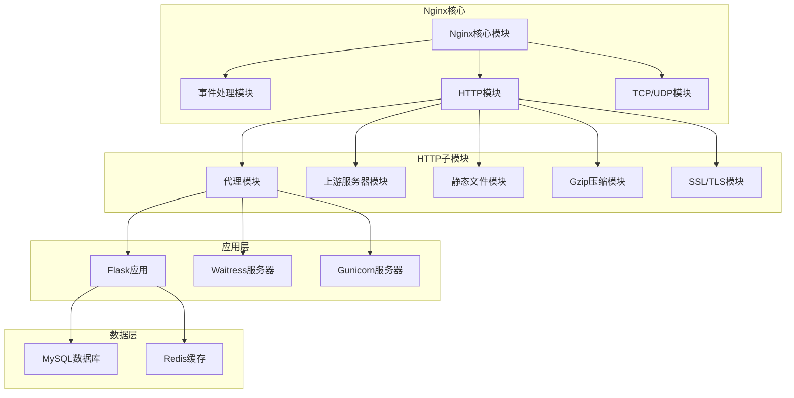

**图表来源**
- [企业网站CMS系统详细需求文档.md](file://企业网站CMS系统详细需求文档.md#L44-L56)

### 配置文件依赖

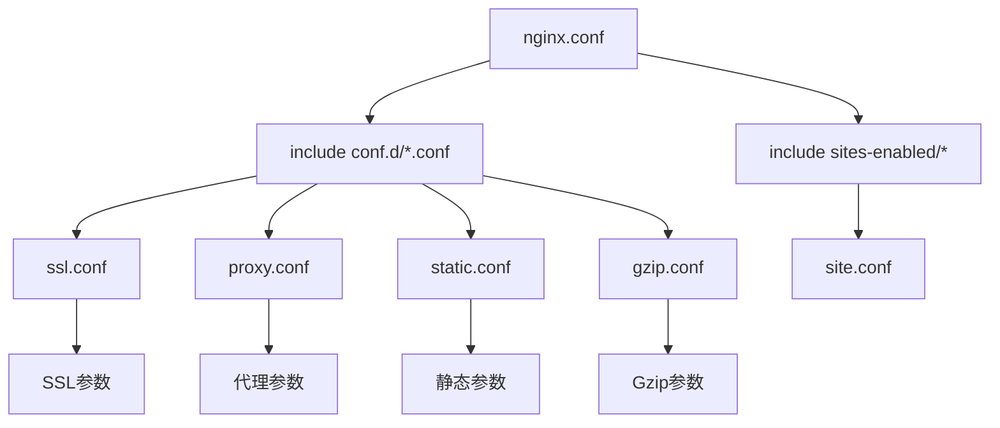

**图表来源**
- [开发计划表_2月4日-2月12日.md](file://开发计划表_2月4日-2月12日.md#L465-L487)

**章节来源**
- [企业网站CMS系统详细需求文档.md](file://企业网站CMS系统详细需求文档.md#L44-L56)

## 性能考虑

### 性能优化策略

基于项目需求文档中的性能要求，系统需要支持：
- 页面加载时间 < 3秒
- 并发用户支持 > 1000
- 数据库查询响应 < 100ms

### 缓存策略

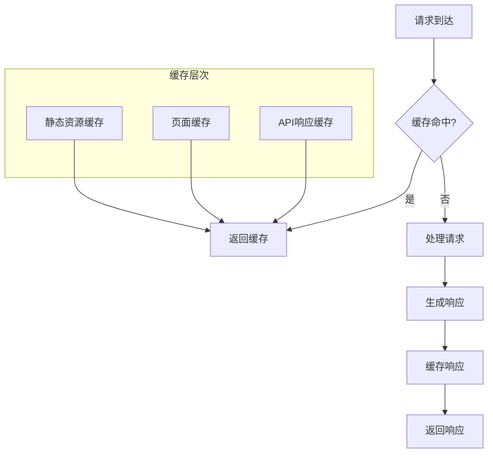

### 监控和调优

系统应该具备以下监控能力：
- 请求处理时间统计
- 错误率监控
- 资源使用率监控
- 用户体验指标监控

## 故障排除指南

### 常见问题及解决方案

#### Nginx启动失败

**症状**：Nginx无法启动或启动后立即退出

**可能原因**：
- 配置语法错误
- 权限不足
- 端口被占用
- 证书文件问题

**解决步骤**：
1. 检查配置文件语法：`nginx -t`
2. 查看错误日志：`tail -f /var/log/nginx/error.log`
3. 检查端口占用：`netstat -tlnp | grep :80`
4. 验证文件权限和路径

#### 反向代理连接失败

**症状**：静态资源正常但API请求失败

**可能原因**：
- 后端服务器未启动
- 网络连接问题
- 防火墙阻拦
- 代理配置错误

**解决步骤**：
1. 检查后端服务状态
2. 测试网络连通性
3. 验证代理配置
4. 查看代理日志

#### SSL证书问题

**症状**：HTTPS连接失败或证书警告

**可能原因**：
- 证书过期
- 证书链不完整
- 私钥不匹配
- 协议版本不兼容

**解决步骤**：
1. 检查证书有效期
2. 验证证书链完整性
3. 确认私钥匹配
4. 更新SSL配置

#### 性能问题

**症状**：响应缓慢或高延迟

**可能原因**：
- 资源不足
- 配置不当
- 数据库瓶颈
- 缓存失效

**解决步骤**：
1. 监控系统资源使用
2. 分析慢查询日志
3. 优化缓存策略
4. 调整Nginx配置参数

**章节来源**
- [开发计划表_2月4日-2月12日.md](file://开发计划表_2月4日-2月12日.md#L419-L432)

## 结论

Nginx反向代理在企业网站CMS系统中扮演着至关重要的角色，它不仅提供了统一的入口点，还实现了静态资源服务、负载均衡、HTTPS终止和性能优化等核心功能。

基于项目需求文档的要求，系统配置应该重点关注：
- **稳定性**：确保高可用性和故障转移机制
- **性能**：优化响应时间和资源使用
- **安全性**：实施适当的SSL/TLS配置和安全策略
- **可维护性**：提供清晰的日志记录和监控能力

通过合理的配置和持续的优化，Nginx能够有效支撑CMS系统的运行，为用户提供优质的访问体验。