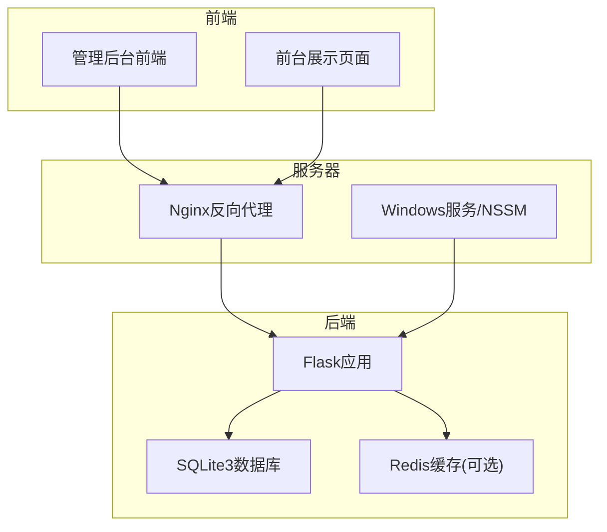
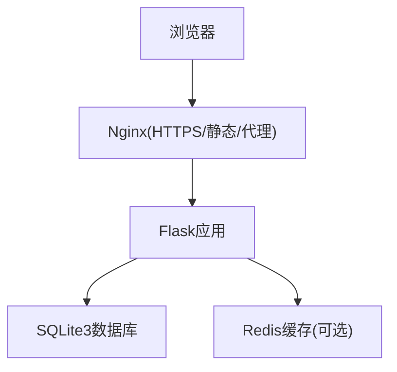
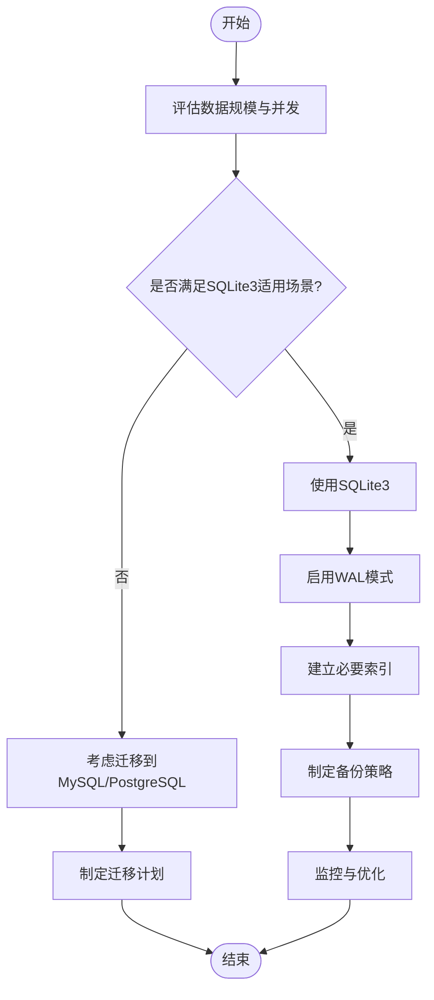
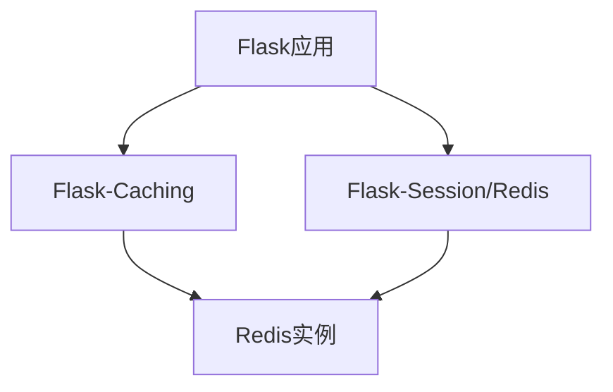
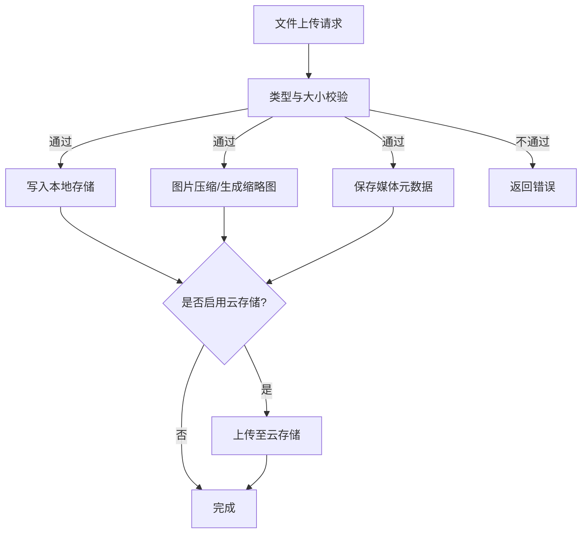
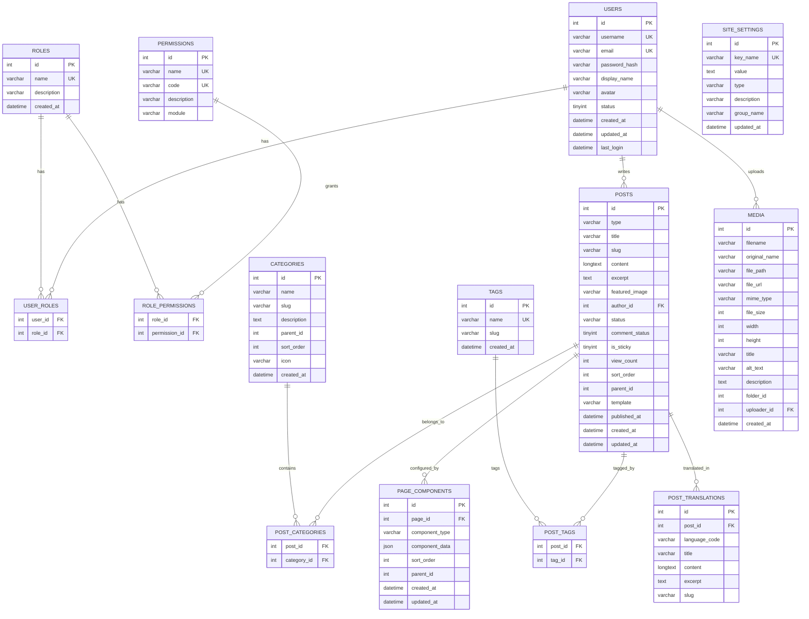
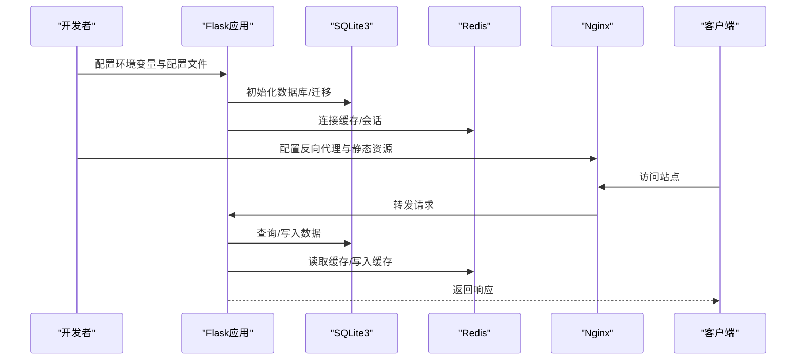
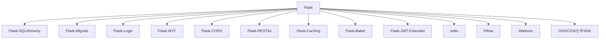

# 数据库与存储配置

<cite>
**本文档引用的文件**
- [企业网站CMS系统开发需求文档.ini](file://企业网站CMS系统开发需求文档.ini)
- [企业网站CMS系统详细需求文档.md](file://企业网站CMS系统详细需求文档.md)
- [开发计划表_2月4日-2月12日.md](file://开发计划表_2月4日-2月12日.md)
</cite>

## 目录
1. [简介](#简介)
2. [项目结构](#项目结构)
3. [核心组件](#核心组件)
4. [架构总览](#架构总览)
5. [详细组件分析](#详细组件分析)
6. [依赖关系分析](#依赖关系分析)
7. [性能考量](#性能考量)
8. [故障排除指南](#故障排除指南)
9. [结论](#结论)
10. [附录](#附录)

## 简介
本文件面向企业网站CMS系统的数据库与存储配置，聚焦以下主题：
- SQLite3数据库的配置与管理：文件组织结构、备份策略、性能优化配置
- Redis缓存的可选配置：安装、配置、集群设置
- 数据库迁移与版本管理方案
- 存储空间管理、文件上传配置、云存储集成
- 提供完整的配置示例与数据迁移指南

本说明基于仓库中的需求文档与开发计划，确保内容与实际技术栈一致。

## 项目结构
系统采用前后端分离架构，后端使用Python Flask + SQLite3，可选Redis缓存；文件存储支持本地存储与云存储（OSS/COS/七牛）。

**图表来源**
- [企业网站CMS系统详细需求文档.md](file://企业网站CMS系统详细需求文档.md#L28-L57)
- [开发计划表_2月4日-2月12日.md](file://开发计划表_2月4日-2月12日.md#L440-L500)

**章节来源**
- [企业网站CMS系统详细需求文档.md](file://企业网站CMS系统详细需求文档.md#L22-L57)
- [开发计划表_2月4日-2月12日.md](file://开发计划表_2月4日-2月12日.md#L440-L500)

## 核心组件
- 数据库层：SQLite3（主数据库），支持ACID事务，零配置，适合中小规模网站
- 缓存层：Redis（可选），用于Session、页面缓存、Token等
- 文件存储：本地存储（Windows文件系统），支持云存储（阿里云OSS、腾讯云COS、七牛）
- 部署与代理：Nginx反向代理，Windows服务（NSSM）或Waitress

**章节来源**
- [企业网站CMS系统详细需求文档.md](file://企业网站CMS系统详细需求文档.md#L555-L594)
- [开发计划表_2月4日-2月12日.md](file://开发计划表_2月4日-2月12日.md#L440-L500)

## 架构总览
系统采用“前端静态资源 + 后端API + SQLite3 + 可选Redis”的轻量架构。Nginx统一对外提供HTTPS、静态资源服务与API代理。

**图表来源**
- [企业网站CMS系统详细需求文档.md](file://企业网站CMS系统详细需求文档.md#L28-L57)
- [企业网站CMS系统详细需求文档.md](file://企业网站CMS系统详细需求文档.md#L1145-L1230)

**章节来源**
- [企业网站CMS系统详细需求文档.md](file://企业网站CMS系统详细需求文档.md#L28-L57)
- [企业网站CMS系统详细需求文档.md](file://企业网站CMS系统详细需求文档.md#L1145-L1230)

## 详细组件分析

### SQLite3数据库配置与管理
- 选型依据：SQLite3单文件、零配置、ACID支持、适合中小网站（<10万条记录，低并发写入）
- 文件组织结构：数据库文件与备份目录、日志目录分离
- 备份策略：每日全量备份，保留一定数量，支持备份到云存储
- 性能优化：启用WAL模式、合理索引、查询优化、避免N+1问题
- 迁移与版本管理：使用Flask-Migrate进行数据库迁移

**图表来源**
- [企业网站CMS系统详细需求文档.md](file://企业网站CMS系统详细需求文档.md#L662-L703)
- [开发计划表_2月4日-2月12日.md](file://开发计划表_2月4日-2月12日.md#L612-L615)

**章节来源**
- [企业网站CMS系统详细需求文档.md](file://企业网站CMS系统详细需求文档.md#L662-L703)
- [开发计划表_2月4日-2月12日.md](file://开发计划表_2月4日-2月12日.md#L612-L615)

#### 数据库文件组织结构
- 数据库文件：D:/cms/data/cms.db
- 备份目录：D:/cms/data/backups/
- 日志目录：D:/cms/data/logs/

**章节来源**
- [企业网站CMS系统详细需求文档.md](file://企业网站CMS系统详细需求文档.md#L704-L712)

#### 备份策略
- 自动备份：每日全量备份，保留一定数量
- 异地备份：支持备份到云存储
- 手动备份与恢复：提供API接口支持
- 备份频率与保留期：每日全量、保留30天

**章节来源**
- [企业网站CMS系统详细需求文档.md](file://企业网站CMS系统详细需求文档.md#L436-L444)
- [企业网站CMS系统详细需求文档.md](file://企业网站CMS系统详细需求文档.md#L1406-L1410)

#### 性能优化配置
- 索引优化：为常用查询字段建立索引
- 查询优化：避免N+1问题，使用合适的JOIN与LIMIT
- 连接池配置：SQLite无需连接池
- 慢查询日志：开启慢查询日志定位问题
- WAL模式：提高并发读取性能

**章节来源**
- [企业网站CMS系统详细需求文档.md](file://企业网站CMS系统详细需求文档.md#L538-L542)
- [开发计划表_2月4日-2月12日.md](file://开发计划表_2月4日-2月12日.md#L612-L615)

#### 数据库迁移与版本管理
- 使用Flask-Migrate进行数据库迁移
- 迁移脚本生成与执行
- 版本回滚与一致性保障

**章节来源**
- [企业网站CMS系统详细需求文档.md](file://企业网站CMS系统详细需求文档.md#L560-L561)

### Redis缓存配置（可选）
- 用途：Session、页面缓存、Token
- 安装与部署：Redis服务端安装与启动
- 配置：Redis连接URL、缓存默认过期时间
- 集群设置：可选，适用于高并发场景

**图表来源**
- [企业网站CMS系统详细需求文档.md](file://企业网站CMS系统详细需求文档.md#L1254-L1265)

**章节来源**
- [企业网站CMS系统详细需求文档.md](file://企业网站CMS系统详细需求文档.md#L1254-L1265)

### 文件上传与存储配置
- 本地存储：文件上传目录与URL映射
- 支持格式：图片（JPG、PNG、GIF、SVG、WebP）、视频（MP4、WebM、MOV）、文档（PDF、DOC、XLS等）
- 文件大小限制：50MB
- 图片处理：自动压缩、生成缩略图
- 云存储集成：阿里云OSS、腾讯云COS、七牛云SDK

**图表来源**
- [开发计划表_2月4日-2月12日.md](file://开发计划表_2月4日-2月12日.md#L196-L218)
- [企业网站CMS系统详细需求文档.md](file://企业网站CMS系统详细需求文档.md#L379-L386)

**章节来源**
- [开发计划表_2月4日-2月12日.md](file://开发计划表_2月4日-2月12日.md#L196-L218)
- [企业网站CMS系统详细需求文档.md](file://企业网站CMS系统详细需求文档.md#L379-L386)

### 数据库设计与表结构
- 用户与权限：users、roles、permissions、user_roles、role_permissions
- 内容管理：posts、categories、post_categories、tags、post_tags
- 媒体库：media
- 页面配置：page_components、site_settings
- 多语言：post_translations
- 全文搜索：使用SQLite FTS5虚拟表与触发器同步

**图表来源**
- [企业网站CMS系统详细需求文档.md](file://企业网站CMS系统详细需求文档.md#L716-L904)

**章节来源**
- [企业网站CMS系统详细需求文档.md](file://企业网站CMS系统详细需求文档.md#L716-L904)

### 配置示例与部署要点
- Flask配置：数据库URI、Redis、缓存、Session、JWT、文件上传、CORS等
- Nginx配置：HTTPS、静态资源、Gzip、代理、日志、上传大小限制
- Windows服务：NSSM注册服务、Waitress启动
- 环境变量：.env模板

**图表来源**
- [企业网站CMS系统详细需求文档.md](file://企业网站CMS系统详细需求文档.md#L1234-L1302)
- [企业网站CMS系统详细需求文档.md](file://企业网站CMS系统详细需求文档.md#L1145-L1230)
- [开发计划表_2月4日-2月12日.md](file://开发计划表_2月4日-2月12日.md#L440-L500)

**章节来源**
- [企业网站CMS系统详细需求文档.md](file://企业网站CMS系统详细需求文档.md#L1234-L1302)
- [企业网站CMS系统详细需求文档.md](file://企业网站CMS系统详细需求文档.md#L1145-L1230)
- [开发计划表_2月4日-2月12日.md](file://开发计划表_2月4日-2月12日.md#L440-L500)

## 依赖关系分析
- Flask生态：Flask-SQLAlchemy、Flask-Migrate、Flask-Login、Flask-WTF、Flask-CORS、Flask-RESTful、Flask-Caching、Flask-Babel、Flask-JWT-Extended
- 缓存：redis（可选）
- 图片处理：Pillow
- WSGI：Waitress（Windows友好）
- 云存储：OSS/COS/七牛SDK（可选）

**图表来源**
- [企业网站CMS系统详细需求文档.md](file://企业网站CMS系统详细需求文档.md#L1304-L1322)

**章节来源**
- [企业网站CMS系统详细需求文档.md](file://企业网站CMS系统详细需求文档.md#L1304-L1322)

## 性能考量
- 页面加载时间：< 3秒
- API响应时间：< 500ms
- 数据库查询响应：< 100ms
- 并发用户支持：>1000（高并发场景可启用Redis）
- 资源优化：图片懒加载、响应式图片、WebP、CDN、Gzip压缩
- 数据库优化：索引、查询优化、WAL模式、慢查询日志

**章节来源**
- [企业网站CMS系统详细需求文档.md](file://企业网站CMS系统详细需求文档.md#L100-L103)
- [企业网站CMS系统详细需求文档.md](file://企业网站CMS系统详细需求文档.md#L512-L548)

## 故障排除指南
- 数据库文件损坏：使用备份恢复，检查WAL文件完整性
- 备份失败：检查备份目录权限、磁盘空间、云存储凭证
- Redis连接异常：确认Redis服务状态、连接URL、网络连通性
- 文件上传失败：检查上传目录权限、文件大小限制、MIME类型白名单
- Nginx代理错误：检查代理配置、静态资源路径、日志文件

**章节来源**
- [企业网站CMS系统详细需求文档.md](file://企业网站CMS系统详细需求文档.md#L1406-L1410)
- [开发计划表_2月4日-2月12日.md](file://开发计划表_2月4日-2月12日.md#L440-L500)

## 结论
本项目采用SQLite3作为主数据库，结合Flask生态与可选Redis缓存，实现轻量、易部署、易备份的企业网站CMS系统。通过合理的文件组织、备份策略与性能优化，能够满足中小规模网站的日常运营需求。若未来业务增长，可平滑迁移到MySQL/PostgreSQL，并引入Redis集群与CDN等能力。

## 附录

### A. 数据库迁移与版本管理方案
- 使用Flask-Migrate进行数据库迁移
- 迁移脚本生成与执行流程
- 版本回滚与一致性保障

**章节来源**
- [企业网站CMS系统详细需求文档.md](file://企业网站CMS系统详细需求文档.md#L560-L561)

### B. 存储空间管理与文件上传配置
- 本地存储：D:/cms/media/ YYYY/MM/ 目录结构
- 文件上传：支持格式、大小限制、图片压缩与缩略图
- 云存储：OSS/COS/七牛SDK接入

**章节来源**
- [开发计划表_2月4日-2月12日.md](file://开发计划表_2月4日-2月12日.md#L214-L218)
- [企业网站CMS系统详细需求文档.md](file://企业网站CMS系统详细需求文档.md#L379-L386)

### C. 配置示例与部署清单
- Flask配置：数据库URI、Redis、缓存、Session、JWT、文件上传、CORS
- Nginx配置：HTTPS、静态资源、Gzip、代理、日志、上传大小限制
- Windows服务：NSSM注册服务、Waitress启动
- 环境变量：.env模板

**章节来源**
- [企业网站CMS系统详细需求文档.md](file://企业网站CMS系统详细需求文档.md#L1234-L1302)
- [企业网站CMS系统详细需求文档.md](file://企业网站CMS系统详细需求文档.md#L1145-L1230)
- [开发计划表_2月4日-2月12日.md](file://开发计划表_2月4日-2月12日.md#L440-L500)