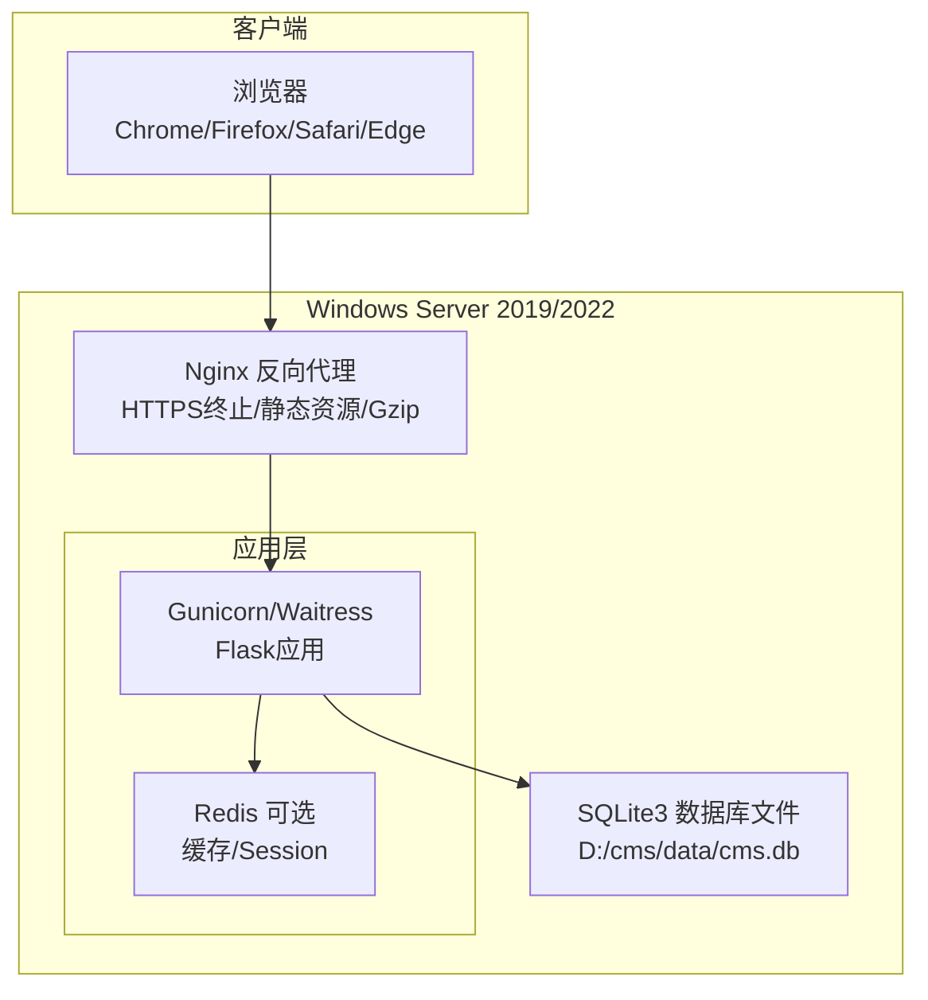
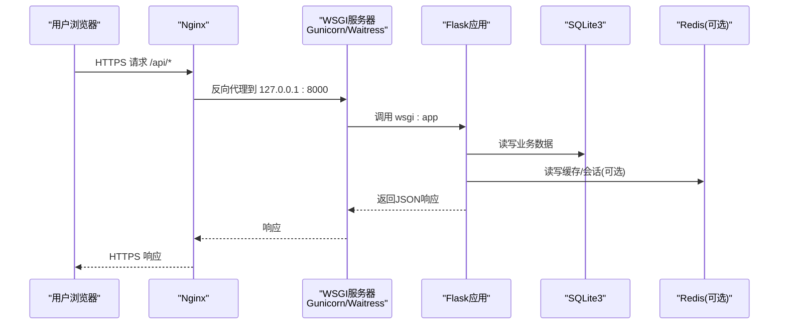
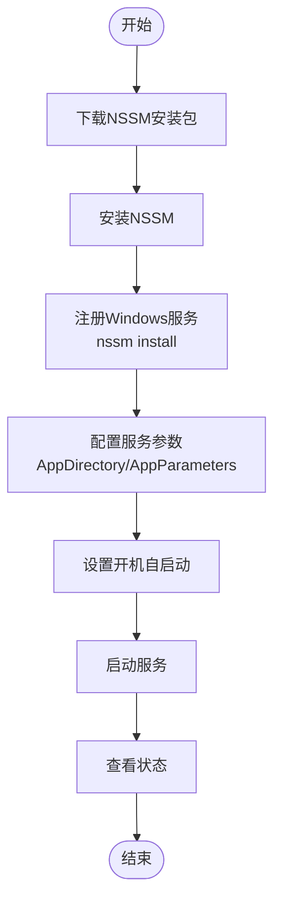
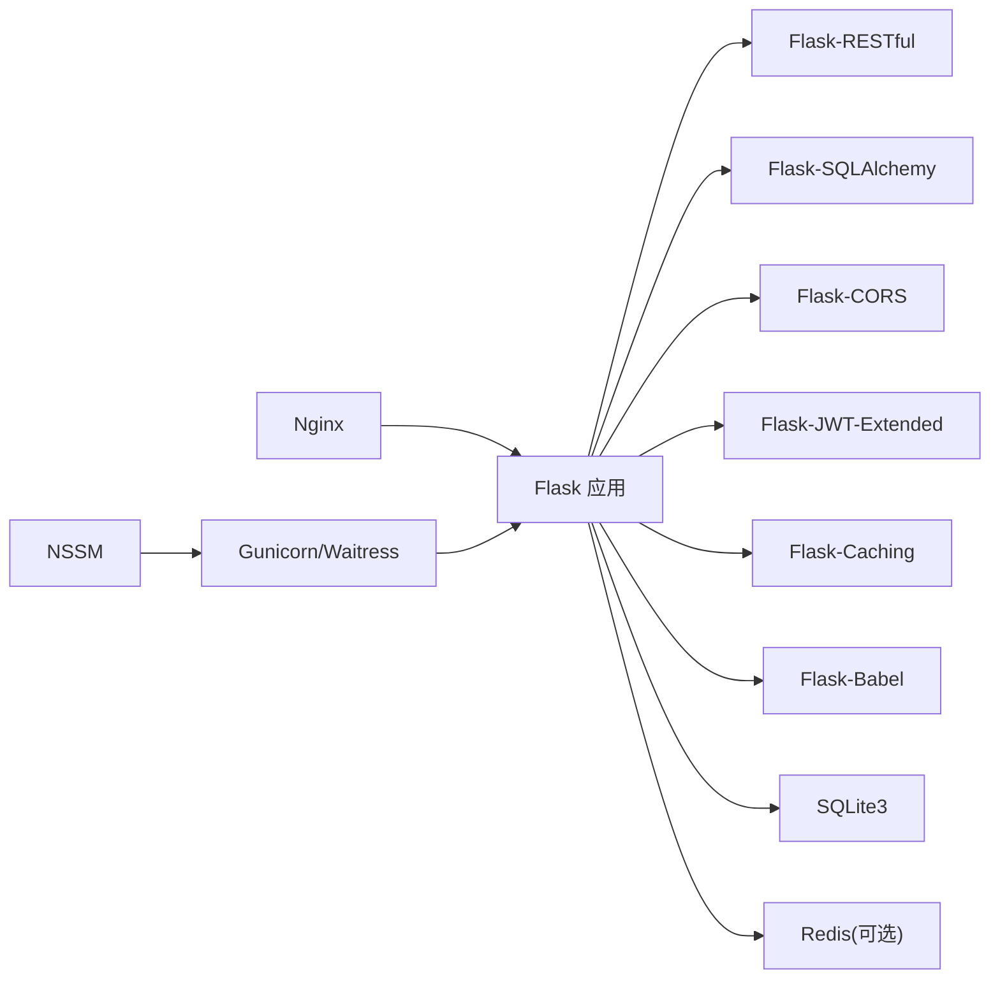

# 服务器环境配置

<cite>
**本文引用的文件**
- [企业网站CMS系统开发需求文档.ini](file://企业网站CMS系统开发需求文档.ini)
- [企业网站CMS系统详细需求文档.md](file://企业网站CMS系统详细需求文档.md)
</cite>

## 目录
1. [简介](#简介)
2. [项目结构](#项目结构)
3. [核心组件](#核心组件)
4. [架构总览](#架构总览)
5. [详细组件分析](#详细组件分析)
6. [依赖分析](#依赖分析)
7. [性能考虑](#性能考虑)
8. [故障排除指南](#故障排除指南)
9. [结论](#结论)
10. [附录](#附录)

## 简介
本文件面向Windows Server 2019/2022环境下的企业CMS系统部署，基于项目文档中的技术栈与部署要求，提供系统要求、硬件配置、网络与防火墙设置、Python运行环境、虚拟环境与包管理、NSSM服务管理器安装与配置、以及系统监控工具（日志、性能、错误追踪）的完整配置指南。目标是帮助运维与开发团队在Windows环境下稳定、可重复地完成生产部署与日常维护。

## 项目结构
- 项目采用前后端分离架构，后端使用Flask + Gunicorn（或Windows友好的Waitress），前端可选React/Vue或纯HTML模板渲染，通过Nginx反向代理提供HTTPS终止、静态资源服务、Gzip压缩与负载均衡能力。
- 部署环境明确要求Windows Server 2019/2022，并使用NSSM将Gunicorn注册为Windows服务，实现开机自启与崩溃自动重启。
- 数据库采用SQLite3（零配置、单文件、ACID事务），Redis为可选缓存与Session存储；监控方面使用Flask内置日志与RotatingFileHandler，可选Flask-Profiler与Sentry。

**图表来源**
- [企业网站CMS系统详细需求文档.md](file://企业网站CMS系统详细需求文档.md#L28-L57)
- [企业网站CMS系统详细需求文档.md](file://企业网站CMS系统详细需求文档.md#L631-L638)
- [企业网站CMS系统详细需求文档.md](file://企业网站CMS系统详细需求文档.md#L1324-L1344)

**章节来源**
- [企业网站CMS系统详细需求文档.md](file://企业网站CMS系统详细需求文档.md#L22-L57)
- [企业网站CMS系统详细需求文档.md](file://企业网站CMS系统详细需求文档.md#L631-L638)

## 核心组件
- 操作系统与硬件
  - 操作系统：Windows Server 2019/2022
  - 硬件建议：CPU≥2核、内存≥2GB（SQLite场景）、磁盘≥20GB（含系统与应用），网络带宽满足并发用户与静态资源访问需求
- Web服务器：Nginx 1.24+，提供HTTPS终止、静态资源服务、Gzip压缩、SSL/TLS配置与可选负载均衡
- 应用服务器：Flask + Gunicorn（Windows下推荐Waitress），WSGI进程管理
- 数据库：SQLite3（默认），Redis为可选缓存/Session
- 监控与日志：logging模块 + RotatingFileHandler，可选Flask-Profiler与Sentry
- 服务化：NSSM将Gunicorn注册为Windows服务，支持开机自启动与崩溃重启

**章节来源**
- [企业网站CMS系统详细需求文档.md](file://企业网站CMS系统详细需求文档.md#L631-L638)
- [企业网站CMS系统详细需求文档.md](file://企业网站CMS系统详细需求文档.md#L555-L594)
- [企业网站CMS系统详细需求文档.md](file://企业网站CMS系统详细需求文档.md#L655-L658)

## 架构总览
系统采用“浏览器 → Nginx反向代理 → Flask应用（Gunicorn/Waitress） → SQLite3/Redis”的典型三层架构。Nginx负责TLS终止、静态资源与API代理，应用层提供RESTful API与模板渲染，数据层使用SQLite3单文件数据库，Redis用于可选缓存与Session。

**图表来源**
- [企业网站CMS系统详细需求文档.md](file://企业网站CMS系统详细需求文档.md#L1143-L1230)
- [企业网站CMS系统详细需求文档.md](file://企业网站CMS系统详细需求文档.md#L1232-L1302)

**章节来源**
- [企业网站CMS系统详细需求文档.md](file://企业网站CMS系统详细需求文档.md#L1143-L1230)
- [企业网站CMS系统详细需求文档.md](file://企业网站CMS系统详细需求文档.md#L1232-L1302)

## 详细组件分析

### 操作系统与硬件要求
- 操作系统版本：Windows Server 2019/2022
- 硬件配置建议：
  - CPU：至少2核（建议4核以上）
  - 内存：至少2GB（建议4GB以上）
  - 磁盘：至少20GB可用空间（含系统、应用、日志与数据库文件）
  - 网络：千兆网卡，带宽满足并发用户与静态资源访问
- 系统优化建议：
  - 关闭不必要的Windows服务，减少资源占用
  - 启用Windows Defender实时保护但排除应用目录以避免误报
  - 设置合理的磁盘配额与日志轮转策略

**章节来源**
- [企业网站CMS系统详细需求文档.md](file://企业网站CMS系统详细需求文档.md#L631-L638)
- [企业网站CMS系统详细需求文档.md](file://企业网站CMS系统详细需求文档.md#L1362-L1379)

### 网络与防火墙配置
- 端口开放：
  - TCP 80：HTTP重定向至HTTPS
  - TCP 443：HTTPS服务
  - TCP 8000：WSGI应用监听端口（Nginx代理）
- 防火墙规则：
  - 允许入站TCP 80/443来自任意来源
  - 限制WSGI端口仅允许Nginx所在主机访问（127.0.0.1）
  - 开启出站HTTPS访问（获取证书、更新等）
- DNS与SSL：
  - 配置域名解析至服务器公网IP
  - 使用Let’s Encrypt或其他CA签发SSL证书，Nginx中启用TLS 1.2/1.3与安全套件
- CDN与静态资源：
  - 静态资源通过Nginx缓存与Gzip压缩，合理设置expires头

**章节来源**
- [企业网站CMS系统详细需求文档.md](file://企业网站CMS系统详细需求文档.md#L1143-L1230)

### Python运行环境与虚拟环境
- Python版本：3.9+
- 虚拟环境：
  - 使用内置venv创建隔离环境
  - 在虚拟环境中安装requirements.txt中的依赖
- 包管理：
  - 使用pip进行依赖安装与升级
  - 生产环境建议锁定版本并定期扫描漏洞
- 环境变量：
  - 使用.env文件或系统环境变量配置SECRET_KEY、JWT_SECRET_KEY、DATABASE_URL、REDIS_URL、邮件服务器等
  - 将虚拟环境的Scripts目录加入PATH，便于命令行调用

**章节来源**
- [企业网站CMS系统详细需求文档.md](file://企业网站CMS系统详细需求文档.md#L558-L560)
- [企业网站CMS系统详细需求文档.md](file://企业网站CMS系统详细需求文档.md#L1304-L1322)
- [企业网站CMS系统详细需求文档.md](file://企业网站CMS系统详细需求文档.md#L1346-L1356)

### NSSM服务管理器安装与配置
- 安装NSSM：
  - 从官方网站下载并安装NSSM
- 注册服务：
  - 将Gunicorn（或Waitress）作为Windows服务注册
  - 设置服务显示名为“CMS Flask Application”，描述为“企业CMS系统后端服务”
  - 设置AppDirectory为应用根目录，AppParameters为WSGI入口与日志参数
- 启动与状态：
  - 使用nssm start启动服务
  - 使用nssm status查看服务状态
  - 设置Start为SERVICE_AUTO_START以实现开机自启动
- 日志：
  - 通过AppParameters指定access-logfile与error-logfile路径，便于排障

**图表来源**
- [企业网站CMS系统详细需求文档.md](file://企业网站CMS系统详细需求文档.md#L1324-L1344)

**章节来源**
- [企业网站CMS系统详细需求文档.md](file://企业网站CMS系统详细需求文档.md#L1324-L1344)

### 系统监控工具配置
- 日志记录：
  - 使用Python logging模块与RotatingFileHandler，按大小轮转
  - Nginx访问日志与错误日志分别输出到独立文件
- 性能监控：
  - 可选Flask-Profiler（开发/测试环境），生产环境谨慎使用
  - 结合系统自带性能监视器（任务管理器、资源监视器）观察CPU/内存/磁盘IO
- 错误追踪：
  - 可选Sentry，集中收集后端异常与错误堆栈
  - 配置Sentry DSN与环境变量，确保敏感信息不泄露

**章节来源**
- [企业网站CMS系统详细需求文档.md](file://企业网站CMS系统详细需求文档.md#L655-L658)
- [企业网站CMS系统详细需求文档.md](file://企业网站CMS系统详细需求文档.md#L1360-L1422)

## 依赖分析
- 技术栈依赖关系：
  - Flask为核心应用框架，依赖Flask-RESTful、Flask-SQLAlchemy、Flask-CORS、Flask-JWT-Extended等扩展
  - 数据库：SQLite3（默认），Redis为可选缓存/Session
  - WSGI：Gunicorn（Linux）或Waitress（Windows友好）
  - 前端：React/Vue或纯HTML模板（Jinja2），通过Nginx提供静态资源
- 部署依赖：
  - Nginx提供反向代理与HTTPS终止
  - NSSM将WSGI服务注册为Windows服务
  - 环境变量与配置文件（config.py/.env）驱动应用行为

**图表来源**
- [企业网站CMS系统详细需求文档.md](file://企业网站CMS系统详细需求文档.md#L555-L594)
- [企业网站CMS系统详细需求文档.md](file://企业网站CMS系统详细需求文档.md#L1304-L1322)
- [企业网站CMS系统详细需求文档.md](file://企业网站CMS系统详细需求文档.md#L1324-L1344)

**章节来源**
- [企业网站CMS系统详细需求文档.md](file://企业网站CMS系统详细需求文档.md#L555-L594)
- [企业网站CMS系统详细需求文档.md](file://企业网站CMS系统详细需求文档.md#L1304-L1322)

## 性能考虑
- 响应时间与并发：
  - 首页加载<2秒，内页<3秒，API响应<500ms，数据库查询<100ms
  - 并发用户支持≥1000，QPS≥500
- 资源占用：
  - 内存使用<2GB，CPU使用<70%，磁盘IO<80%
- 优化手段：
  - Nginx启用Gzip压缩与静态资源缓存
  - SQLite读多写少场景性能优异，避免复杂事务与锁竞争
  - Redis缓存热点数据与Session（高并发时）
  - 前端资源CDN加速（可选）

**章节来源**
- [企业网站CMS系统详细需求文档.md](file://企业网站CMS系统详细需求文档.md#L1362-L1379)
- [企业网站CMS系统详细需求文档.md](file://企业网站CMS系统详细需求文档.md#L512-L548)

## 故障排除指南
- 服务无法启动：
  - 检查NSSM服务状态与日志路径是否正确
  - 确认虚拟环境与依赖安装完整
- Nginx代理失败：
  - 检查upstream地址与端口是否正确
  - 查看Nginx访问/错误日志定位问题
- 数据库连接异常：
  - 确认DATABASE_URL指向正确的SQLite文件路径
  - 检查文件权限与磁盘空间
- 性能问题：
  - 使用系统监视器观察CPU/内存/磁盘IO
  - 对慢查询与热点接口进行优化
- 安全与合规：
  - 确保HTTPS启用与安全头配置
  - 定期更新证书与依赖包

**章节来源**
- [企业网站CMS系统详细需求文档.md](file://企业网站CMS系统详细需求文档.md#L1143-L1230)
- [企业网站CMS系统详细需求文档.md](file://企业网站CMS系统详细需求文档.md#L1324-L1344)

## 结论
本配置文档基于项目技术栈与部署要求，给出了Windows Server 2019/2022环境下的系统要求、网络与防火墙设置、Python运行环境与虚拟环境、NSSM服务化部署以及系统监控工具的配置要点。遵循上述步骤可确保Flask应用在Windows环境下稳定运行，并具备良好的可维护性与可扩展性。

## 附录
- 配置清单与参考路径：
  - Nginx配置示例：[nginx.conf](file://企业网站CMS系统详细需求文档.md#L1143-L1230)
  - Flask配置示例：[config.py](file://企业网站CMS系统详细需求文档.md#L1232-L1302)
  - 依赖清单：[requirements.txt](file://企业网站CMS系统详细需求文档.md#L1304-L1322)
  - NSSM服务配置：[Windows服务配置](file://企业网站CMS系统详细需求文档.md#L1324-L1344)
  - 环境变量示例：[环境变量配置](file://企业网站CMS系统详细需求文档.md#L1346-L1356)