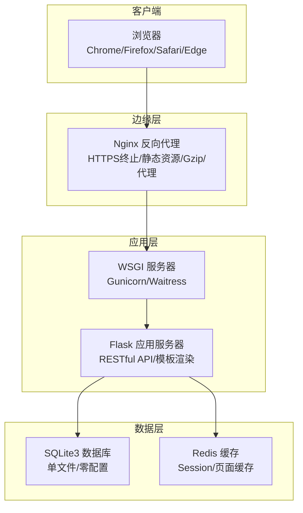
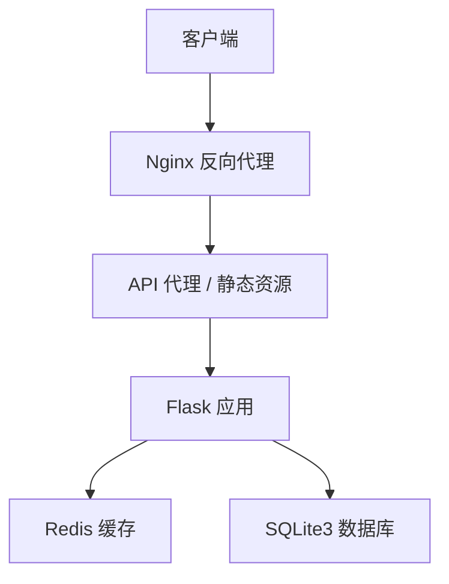
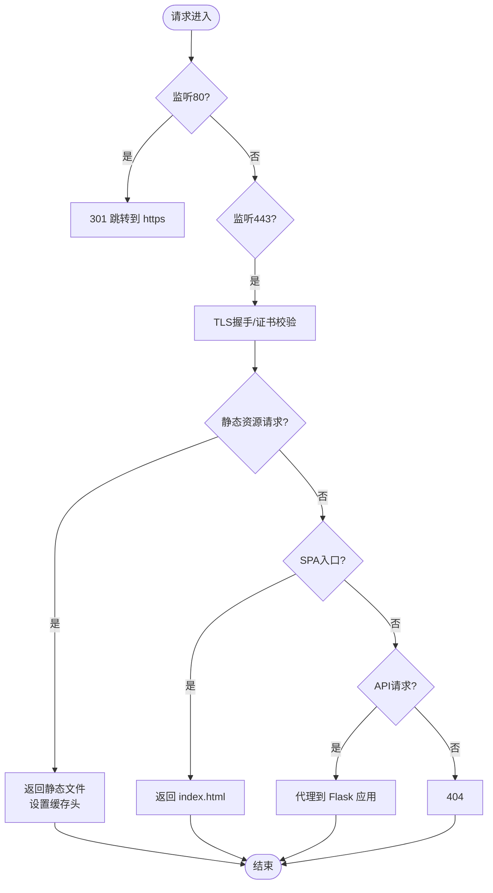
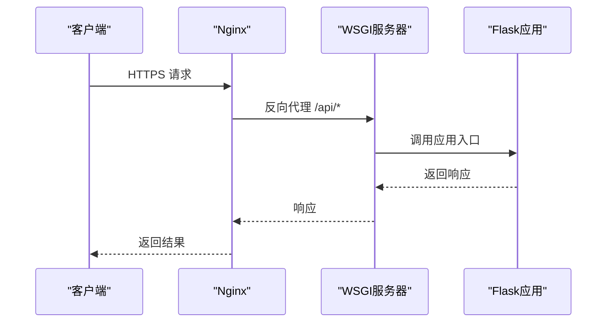
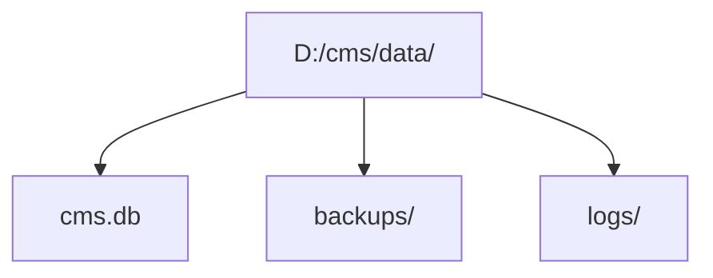
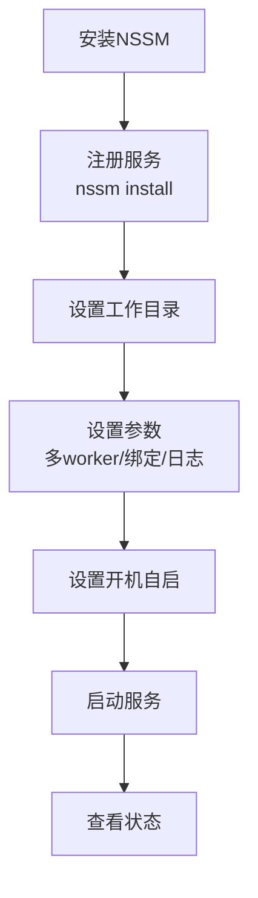
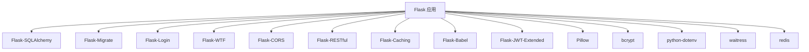

# 部署架构设计

<cite>
**本文引用的文件**
- [企业网站CMS系统开发需求文档.ini](file://企业网站CMS系统开发需求文档.ini)
- [企业网站CMS系统详细需求文档.md](file://企业网站CMS系统详细需求文档.md)
</cite>

## 目录
1. [简介](#简介)
2. [项目结构](#项目结构)
3. [核心组件](#核心组件)
4. [架构总览](#架构总览)
5. [详细组件分析](#详细组件分析)
6. [依赖关系分析](#依赖关系分析)
7. [性能考量](#性能考量)
8. [故障排查指南](#故障排查指南)
9. [结论](#结论)
10. [附录](#附录)

## 简介
本部署架构设计面向企业网站CMS系统，基于Windows Server环境，采用“Nginx反向代理 + Flask应用服务器 + SQLite数据库 + Redis缓存”的混合部署方案。系统支持前后端分离与纯HTML模板渲染两种模式，强调易部署、低运维成本与可扩展性。本文档提供部署拓扑、配置要点、进程管理（NSSM）、静态资源处理、SSL/TLS、负载均衡、以及生产与开发环境差异化的配置说明，并给出部署流程图与配置示例路径。

## 项目结构
- 项目采用前后端分离架构：
  - 前端：React/Vue或纯HTML模板（Jinja2）任选其一；
  - 后端：Flask提供RESTful API与模板渲染；
  - 反向代理：Nginx负责静态资源、HTTPS终止、Gzip压缩与API代理；
  - 应用服务器：Gunicorn（Linux）或Waitress（Windows友好）；
  - 数据库：SQLite3（单文件，零配置，适合中小网站）；可选Redis用于缓存与Session；
  - 进程管理：NSSM将Flask服务注册为Windows服务，支持开机自启与崩溃重启。

**图表来源**
- [企业网站CMS系统详细需求文档.md](file://企业网站CMS系统详细需求文档.md#L22-L57)

**章节来源**
- [企业网站CMS系统详细需求文档.md](file://企业网站CMS系统详细需求文档.md#L22-L57)

## 核心组件
- Nginx反向代理：负责HTTPS终止、静态资源服务、Gzip压缩、API代理与可选负载均衡。
- Flask应用服务器：提供RESTful API与模板渲染，支持JWT认证、CORS、缓存与国际化。
- SQLite3数据库：单文件数据库，零配置，适合中小网站；支持FTS5全文检索。
- Redis缓存：可选，用于Session与页面缓存；在高并发场景下启用。
- NSSM服务管理器：将Flask应用注册为Windows服务，支持开机自启与崩溃重启。
- Waitress（Windows友好）：替代Gunicorn，适配Windows Server环境。

**章节来源**
- [企业网站CMS系统详细需求文档.md](file://企业网站CMS系统详细需求文档.md#L555-L659)

## 架构总览
系统采用“边缘代理 + 应用 + 数据”三层架构。Nginx位于最外层，统一处理HTTPS、静态资源与API转发；Flask应用通过WSGI服务器承载，负责业务逻辑与模板渲染；SQLite3作为主数据库，Redis可选用于缓存与会话。

**图表来源**
- [企业网站CMS系统详细需求文档.md](file://企业网站CMS系统详细需求文档.md#L22-L57)

**章节来源**
- [企业网站CMS系统详细需求文档.md](file://企业网站CMS系统详细需求文档.md#L22-L57)

## 详细组件分析

### Nginx反向代理配置
- 监听80端口并强制跳转至443；
- 配置SSL证书与TLS协议、加密套件；
- 设置安全响应头（X-Frame-Options、X-Content-Type-Options、X-XSS-Protection）；
- 配置静态资源目录（/static/ 与 /media/）并设置缓存；
- 对API路径（/api/）进行反向代理至Flask应用；
- 支持前端SPA（/）回退到index.html；
- 可选负载均衡（upstream）指向多个Flask实例；
- 支持WebSocket升级头（如需要）。

**图表来源**
- [企业网站CMS系统详细需求文档.md](file://企业网站CMS系统详细需求文档.md#L1143-L1230)

**章节来源**
- [企业网站CMS系统详细需求文档.md](file://企业网站CMS系统详细需求文档.md#L1143-L1230)

### Flask应用服务器与WSGI
- 使用Waitress（Windows友好）或Gunicorn（Linux）作为WSGI服务器；
- 多worker进程与异步worker（gevent）可选；
- 配置访问日志与错误日志路径；
- 在Windows上通过NSSM注册为服务，支持开机自启与崩溃重启。

**图表来源**
- [企业网站CMS系统详细需求文档.md](file://企业网站CMS系统详细需求文档.md#L1232-L1322)

**章节来源**
- [企业网站CMS系统详细需求文档.md](file://企业网站CMS系统详细需求文档.md#L1232-L1322)

### 数据库文件组织与SQLite3选型
- 采用SQLite3单文件数据库，零配置，适合中小网站；
- 推荐目录结构：D:/cms/data/cms.db、backups/、logs/；
- 使用FTS5虚拟表实现全文检索；
- 如并发写入频繁或数据量超预期，可考虑迁移到MySQL。

**图表来源**
- [企业网站CMS系统详细需求文档.md](file://企业网站CMS系统详细需求文档.md#L704-L712)

**章节来源**
- [企业网站CMS系统详细需求文档.md](file://企业网站CMS系统详细需求文档.md#L660-L712)

### Redis缓存配置
- 可选启用，用于Session与页面缓存；
- 配置Redis连接URL与缓存默认过期时间；
- 在高并发场景下启用，以减轻数据库压力。

**章节来源**
- [企业网站CMS系统详细需求文档.md](file://企业网站CMS系统详细需求文档.md#L1254-L1265)

### 进程管理（NSSM服务管理器）
- 使用NSSM将Flask应用注册为Windows服务；
- 设置工作目录、参数（多worker、绑定地址、日志路径）；
- 设置开机自启动与服务显示名、描述；
- 支持启动、停止、状态查询与崩溃自动重启。

**图表来源**
- [企业网站CMS系统详细需求文档.md](file://企业网站CMS系统详细需求文档.md#L1324-L1344)

**章节来源**
- [企业网站CMS系统详细需求文档.md](file://企业网站CMS系统详细需求文档.md#L1324-L1344)

### 静态资源处理
- Nginx通过alias指令映射静态资源目录；
- 设置expires与Cache-Control头，提升浏览器缓存命中率；
- 支持媒体资源（/media/）与构建产物（/static/）缓存。

**章节来源**
- [企业网站CMS系统详细需求文档.md](file://企业网站CMS系统详细需求文档.md#L1190-L1200)

### SSL/TLS配置
- 在443端口启用SSL，配置证书与私钥；
- 指定TLS协议版本与加密套件；
- 设置安全响应头，增强浏览器安全策略。

**章节来源**
- [企业网站CMS系统详细需求文档.md](file://企业网站CMS系统详细需求文档.md#L1162-L1176)

### 负载均衡设置
- Nginx通过upstream定义后端Flask实例；
- 可扩展多个实例，实现横向扩展；
- 结合健康检查与故障转移策略（可选）。

**章节来源**
- [企业网站CMS系统详细需求文档.md](file://企业网站CMS系统详细需求文档.md#L1148-L1152)

### 生产环境与开发环境差异化配置
- 环境变量：生产环境使用.env文件设置FLASK_ENV=production、数据库URL、Redis URL、邮件配置等；
- Flask配置：DevelopmentConfig开启SQLALCHEMY_ECHO便于调试；ProductionConfig保持默认；
- 日志：生产环境使用RotatingFileHandler，记录访问与错误日志；
- 缓存：生产环境启用Redis缓存与Session；
- 部署：Windows环境使用Waitress + NSSM，Linux环境使用Gunicorn。

**章节来源**
- [企业网站CMS系统详细需求文档.md](file://企业网站CMS系统详细需求文档.md#L1290-L1302)
- [企业网站CMS系统详细需求文档.md](file://企业网站CMS系统详细需求文档.md#L1346-L1356)

## 依赖关系分析
- Flask应用依赖：
  - Flask-SQLAlchemy（ORM）
  - Flask-Migrate（数据库迁移）
  - Flask-Login（用户认证）
  - Flask-WTF（表单验证）
  - Flask-CORS（跨域）
  - Flask-RESTful（API开发）
  - Flask-Caching（缓存）
  - Flask-Babel（国际化）
  - Flask-JWT-Extended（JWT）
  - Pillow（图片处理）
  - bcrypt（密码加密）
  - python-dotenv（环境变量）
  - waitress（Windows友好WSGI）
  - redis（可选）

**图表来源**
- [企业网站CMS系统详细需求文档.md](file://企业网站CMS系统详细需求文档.md#L1304-L1322)

**章节来源**
- [企业网站CMS系统详细需求文档.md](file://企业网站CMS系统详细需求文档.md#L1304-L1322)

## 性能考量
- 静态资源：Nginx开启Gzip压缩与长期缓存头，减少带宽与延迟；
- 数据库：SQLite适合读多写少场景；如需更高并发，可考虑MySQL；
- 缓存：Redis用于Session与页面缓存，降低数据库压力；
- WSGI：Windows使用Waitress，Linux使用Gunicorn，合理设置worker数量；
- 前端：构建产物采用版本号/哈希策略，结合CDN加速（可选）。

**章节来源**
- [企业网站CMS系统详细需求文档.md](file://企业网站CMS系统详细需求文档.md#L512-L548)
- [企业网站CMS系统详细需求文档.md](file://企业网站CMS系统详细需求文档.md#L1184-L1189)

## 故障排查指南
- 服务无法启动：检查NSSM服务参数与日志路径，确认端口占用；
- 静态资源404：核对Nginx alias路径与文件权限；
- API跨域失败：检查Flask-CORS配置与Nginx代理头；
- HTTPS证书问题：确认证书与私钥路径正确，协议版本与加密套件兼容；
- 数据库锁/性能问题：SQLite读多写少场景下性能良好；如写入频繁，评估迁移至MySQL；
- 缓存异常：检查Redis连接URL与过期时间配置。

**章节来源**
- [企业网站CMS系统详细需求文档.md](file://企业网站CMS系统详细需求文档.md#L1143-L1230)
- [企业网站CMS系统详细需求文档.md](file://企业网站CMS系统详细需求文档.md#L1254-L1265)

## 结论
该部署架构以Windows Server为基础，结合Nginx反向代理、Flask应用服务器与SQLite3数据库，辅以可选Redis缓存，形成轻量、易部署、低运维成本的企业CMS系统。通过NSSM服务管理器实现Windows环境下的稳定运行，配合生产与开发环境差异化配置，满足中小企业的快速上线与后续扩展需求。

## 附录
- 配置示例路径（请参考以下文件与行号获取具体配置片段）：
  - Nginx配置示例：[企业网站CMS系统详细需求文档.md](file://企业网站CMS系统详细需求文档.md#L1143-L1230)
  - Flask配置示例：[企业网站CMS系统详细需求文档.md](file://企业网站CMS系统详细需求文档.md#L1232-L1302)
  - requirements.txt依赖清单：[企业网站CMS系统详细需求文档.md](file://企业网站CMS系统详细需求文档.md#L1304-L1322)
  - NSSM服务注册示例：[企业网站CMS系统详细需求文档.md](file://企业网站CMS系统详细需求文档.md#L1324-L1344)
  - 环境变量示例：[企业网站CMS系统详细需求文档.md](file://企业网站CMS系统详细需求文档.md#L1346-L1356)
  - 数据库文件组织与FTS5全文检索：[企业网站CMS系统详细需求文档.md](file://企业网站CMS系统详细需求文档.md#L704-L938)