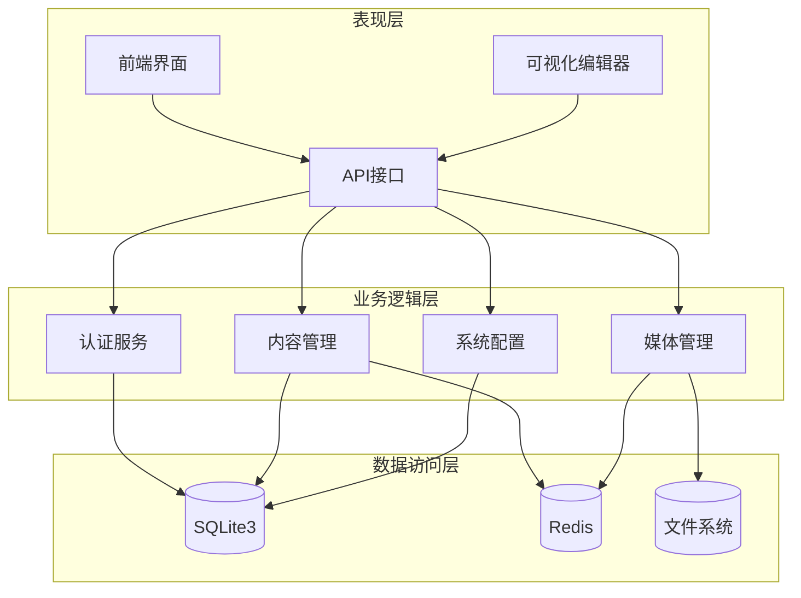
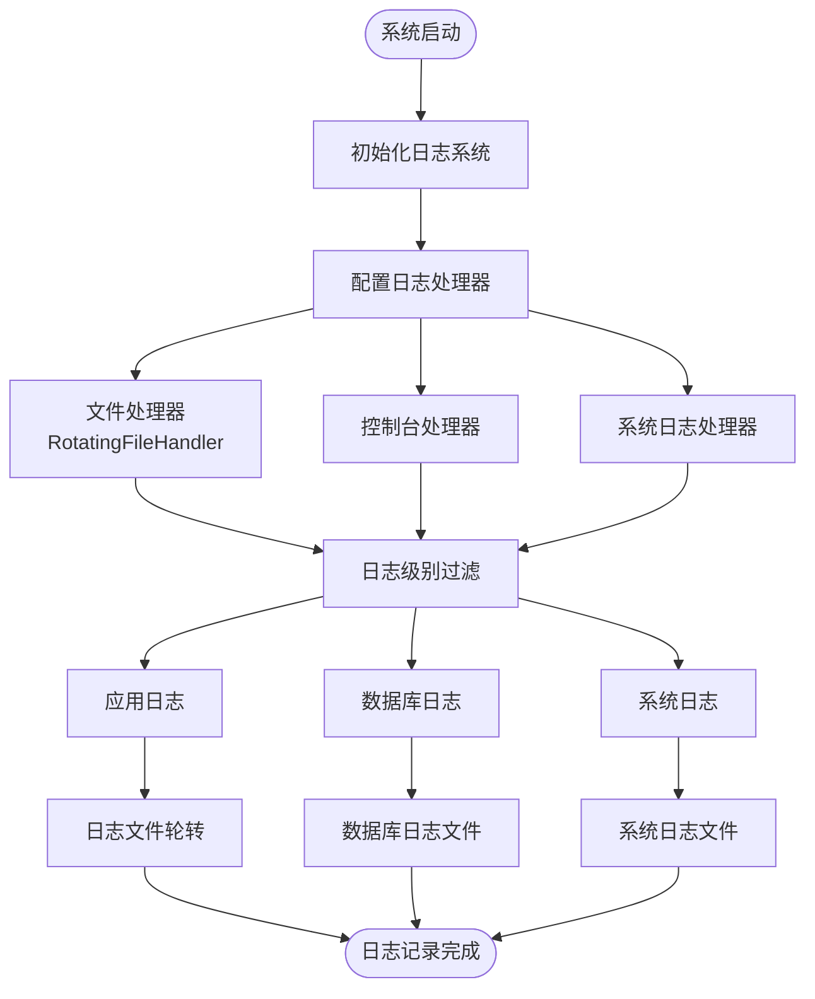
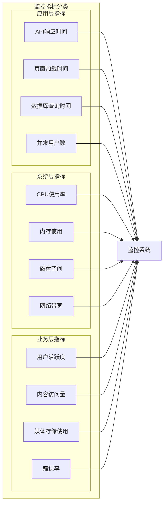
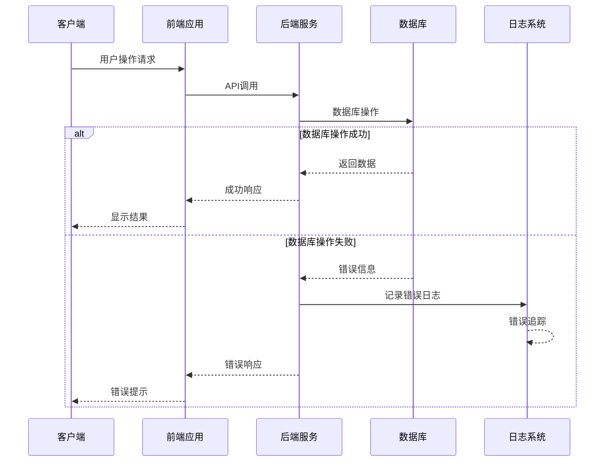
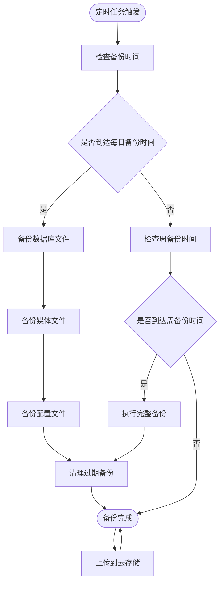
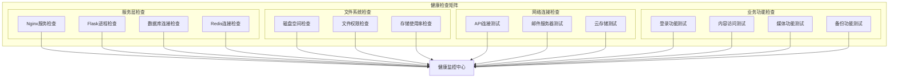
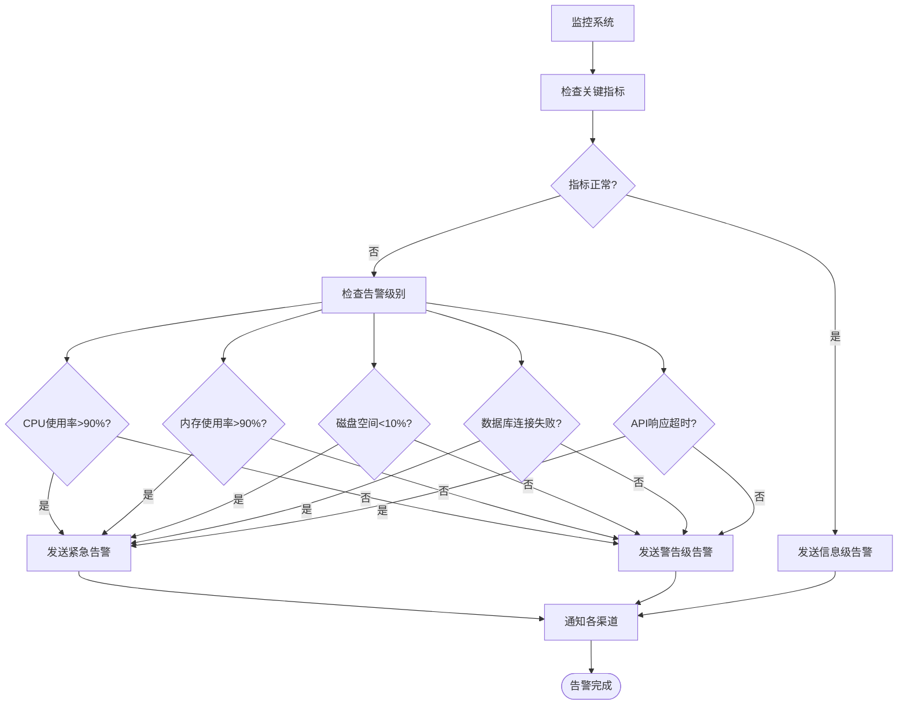
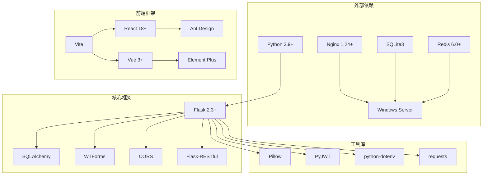

# 部署监控与维护

<cite>
**本文档引用的文件**
- [企业网站CMS系统开发需求文档.ini](file://企业网站CMS系统开发需求文档.ini)
- [企业网站CMS系统详细需求文档.md](file://企业网站CMS系统详细需求文档.md)
- [开发计划表_2月4日-2月12日.md](file://开发计划表_2月4日-2月12日.md)
</cite>

## 目录
1. [简介](#简介)
2. [项目结构](#项目结构)
3. [核心组件](#核心组件)
4. [架构概览](#架构概览)
5. [详细组件分析](#详细组件分析)
6. [依赖关系分析](#依赖关系分析)
7. [性能考虑](#性能考虑)
8. [故障排除指南](#故障排除指南)
9. [结论](#结论)
10. [附录](#附录)

## 简介

本文件为企业网站CMS系统的部署监控与维护指南，涵盖系统监控、维护策略、日志管理、性能监控、错误追踪、备份恢复、健康检查、告警机制等关键运维内容。该系统采用Python Flask + SQLite3 + Nginx + Windows Server技术栈，部署于Windows Server环境，适合中小企业的网站管理和维护需求。

## 项目结构

基于开发计划和需求文档，系统采用前后端分离架构，主要组件包括：

```mermaid
graph TB
subgraph "客户端层"
Browser[用户浏览器]
Mobile[移动设备]
end
subgraph "Web服务器层"
Nginx[Nginx反向代理]
Static[静态资源服务]
Proxy[API代理]
end
subgraph "应用服务器层"
Flask[Flask应用服务器]
Gunicorn[Gunicorn WSGI]
Waitress[Waitress(Win友好)]
end
subgraph "数据存储层"
SQLite[SQLite3数据库]
Redis[Redis缓存]
Storage[文件存储]
end
Browser --> Nginx
Mobile --> Nginx
Nginx --> Static
Nginx --> Proxy
Proxy --> Flask
Flask --> SQLite
Flask --> Redis
Flask --> Storage
```

**图表来源**
- [企业网站CMS系统详细需求文档.md](file://企业网站CMS系统详细需求文档.md#L22-L57)
- [开发计划表_2月4日-2月12日.md](file://开发计划表_2月4日-2月12日.md#L441-L506)

**章节来源**
- [企业网站CMS系统详细需求文档.md](file://企业网站CMS系统详细需求文档.md#L22-L57)
- [开发计划表_2月4日-2月12日.md](file://开发计划表_2月4日-2月12日.md#L441-L506)

## 核心组件

### 技术栈组件

系统采用现代化的技术栈组合，确保性能和可维护性：

**后端技术栈**
- **Python 3.9+**: 主要编程语言
- **Flask 2.3+**: Web框架，提供RESTful API
- **Flask-SQLAlchemy**: ORM数据库操作
- **Flask-Login**: 用户认证管理
- **Flask-WTF**: 表单验证
- **Flask-CORS**: 跨域支持
- **Flask-RESTful**: API开发框架

**前端技术栈**
- **React 18+ 或 Vue 3+**: 前端框架
- **Ant Design/Element Plus**: UI组件库
- **Vite**: 构建工具
- **TypeScript 5+**: 类型安全

**数据库组件**
- **SQLite3**: 主数据库，单文件部署
- **Redis**: 可选缓存和会话存储

**服务器组件**
- **Nginx 1.24+**: 反向代理和负载均衡
- **Gunicorn/Waitress**: WSGI服务器
- **NSSM**: Windows服务管理

**章节来源**
- [企业网站CMS系统详细需求文档.md](file://企业网站CMS系统详细需求文档.md#L555-L659)
- [开发计划表_2月4日-2月12日.md](file://开发计划表_2月4日-2月12日.md#L58-L83)

## 架构概览

系统采用三层架构设计，确保各层职责清晰：



**图表来源**
- [企业网站CMS系统详细需求文档.md](file://企业网站CMS系统详细需求文档.md#L22-L57)
- [开发计划表_2月4日-2月12日.md](file://开发计划表_2月4日-2月12日.md#L92-L105)

## 详细组件分析

### 日志管理系统

#### 日志配置策略

系统采用多层日志记录机制，确保完整的故障追踪能力：

**应用层日志**
- 使用Python logging模块进行结构化日志记录
- 支持RotatingFileHandler实现日志轮转
- 区分不同级别的日志输出（DEBUG/INFO/WARNING/ERROR）

**数据库日志**
- SQLite3数据库文件作为主要数据存储
- 支持WAL模式提高并发性能
- 日志文件位于独立的日志目录中

**系统日志**
- Nginx访问日志和错误日志
- 应用服务器进程日志
- Windows事件日志集成



**图表来源**
- [开发计划表_2月4日-2月12日.md](file://开发计划表_2月4日-2月12日.md#L655-L658)

**章节来源**
- [开发计划表_2月4日-2月12日.md](file://开发计划表_2月4日-2月12日.md#L655-L658)

### 性能监控系统

#### 监控指标定义

系统监控重点关注以下关键性能指标：

**应用性能指标**
- API响应时间（目标：< 500ms）
- 页面加载时间（目标：< 3秒）
- 数据库查询响应时间（目标：< 100ms）
- 并发用户支持能力（目标：> 1000用户）

**系统资源监控**
- CPU使用率
- 内存使用情况
- 磁盘空间使用
- 网络带宽使用

**业务指标监控**
- 用户活跃度
- 内容访问量
- 媒体文件存储使用
- 系统错误率



**图表来源**
- [企业网站CMS系统开发需求文档.ini](file://企业网站CMS系统开发需求文档.ini#L100-L103)

**章节来源**
- [企业网站CMS系统开发需求文档.ini](file://企业网站CMS系统开发需求文档.ini#L100-L103)

### 错误追踪系统

#### 错误处理策略

系统采用多层次的错误处理和追踪机制：

**前端错误追踪**
- JavaScript错误捕获和上报
- 用户行为追踪
- 性能指标收集

**后端错误追踪**
- 异常捕获和记录
- 错误堆栈追踪
- 请求上下文信息

**数据库错误处理**
- 连接池管理
- 事务回滚
- 错误重试机制



**图表来源**
- [开发计划表_2月4日-2月12日.md](file://开发计划表_2月4日-2月12日.md#L655-L658)

**章节来源**
- [开发计划表_2月4日-2月12日.md](file://开发计划表_2月4日-2月12日.md#L655-L658)

### 备份与恢复策略

#### 自动备份配置

系统提供完善的自动化备份机制：

**数据库备份**
- 每日自动备份策略
- 备份文件命名规范：cms_YYYYMMDD.db
- 保留最近7天的备份文件
- 支持增量备份选项

**文件备份**
- 媒体文件定期备份
- 配置文件备份
- 日志文件备份

**云存储集成**
- 支持阿里云OSS备份
- 腾讯云COS备份选项
- 七牛云存储集成



**图表来源**
- [企业网站CMS系统详细需求文档.md](file://企业网站CMS系统详细需求文档.md#L436-L444)

**章节来源**
- [企业网站CMS系统详细需求文档.md](file://企业网站CMS系统详细需求文档.md#L436-L444)

### 健康检查系统

#### 系统健康监控

建立全面的系统健康检查机制：

**服务健康检查**
- Nginx服务状态检查
- Flask应用进程监控
- 数据库连接状态
- Redis缓存连接检查

**文件系统检查**
- 磁盘空间监控
- 文件权限检查
- 存储空间使用率

**网络连接检查**
- 外部API连接测试
- 邮件服务器连接
- 云存储连接测试



**图表来源**
- [开发计划表_2月4日-2月12日.md](file://开发计划表_2月4日-2月12日.md#L520-L540)

**章节来源**
- [开发计划表_2月4日-2月12日.md](file://开发计划表_2月4日-2月12日.md#L520-L540)

### 告警机制配置

#### 告警系统设计

建立多层次的告警通知机制：

**告警级别定义**
- 信息级：系统正常状态
- 警告级：性能指标异常
- 严重级：服务不可用
- 紧急级：系统崩溃

**告警触发条件**
- CPU使用率 > 90%
- 内存使用率 > 90%
- 磁盘空间 < 10%
- 数据库连接失败
- API响应时间 > 2秒

**通知渠道**
- 邮件通知
- 短信告警
- 微信企业号
- 钉钉机器人



**图表来源**
- [企业网站CMS系统开发需求文档.ini](file://企业网站CMS系统开发需求文档.ini#L111-L114)

**章节来源**
- [企业网站CMS系统开发需求文档.ini](file://企业网站CMS系统开发需求文档.ini#L111-L114)

## 依赖关系分析

系统组件之间的依赖关系如下：



**图表来源**
- [企业网站CMS系统详细需求文档.md](file://企业网站CMS系统详细需求文档.md#L555-L628)

**章节来源**
- [企业网站CMS系统详细需求文档.md](file://企业网站CMS系统详细需求文档.md#L555-L628)

## 性能考虑

### 性能优化策略

针对CMS系统的特性，制定以下性能优化策略：

**数据库性能优化**
- SQLite3 WAL模式启用
- 合理的索引设计
- 查询语句优化
- 连接池配置

**缓存策略**
- Redis缓存集成（高并发场景）
- 页面缓存机制
- 静态资源缓存
- API响应缓存

**前端性能优化**
- 图片懒加载
- 资源压缩合并
- CDN加速
- 关键CSS内联

**系统资源优化**
- 进程管理优化
- 内存使用优化
- 磁盘I/O优化
- 网络连接优化

**章节来源**
- [企业网站CMS系统详细需求文档.md](file://企业网站CMS系统详细需求文档.md#L512-L548)

## 故障排除指南

### 常见问题诊断

#### 系统启动问题

**问题现象**：Flask应用无法启动
**可能原因**：
- Python环境配置错误
- 依赖包安装失败
- 环境变量未设置
- 端口被占用

**解决步骤**：
1. 检查Python版本是否符合要求
2. 验证requirements.txt中的依赖安装
3. 确认环境变量配置正确
4. 检查端口占用情况

#### 数据库连接问题

**问题现象**：数据库连接失败
**可能原因**：
- 数据库文件损坏
- 权限不足
- 连接池耗尽
- SQLite版本不兼容

**解决步骤**：
1. 检查数据库文件完整性
2. 验证文件权限设置
3. 查看连接池配置
4. 升级SQLite版本

#### 媒体文件上传问题

**问题现象**：图片上传失败或显示异常
**可能原因**：
- 文件大小超出限制
- 文件格式不支持
- 存储路径权限不足
- 图片处理错误

**解决步骤**：
1. 检查文件大小限制配置
2. 验证支持的文件格式
3. 确认存储目录权限
4. 查看图片处理日志

#### 前台页面显示问题

**问题现象**：前台页面无法正常显示
**可能原因**：
- 静态资源路径错误
- Nginx配置问题
- 前端构建失败
- 缓存问题

**解决步骤**：
1. 检查静态资源路径配置
2. 验证Nginx配置文件
3. 重新构建前端项目
4. 清除浏览器缓存

**章节来源**
- [开发计划表_2月4日-2月12日.md](file://开发计划表_2月4日-2月12日.md#L520-L540)

### 维护最佳实践

#### 日常维护任务

**系统监控**
- 每日检查系统健康状态
- 监控关键性能指标
- 查看错误日志
- 备份完整性验证

**数据维护**
- 定期清理临时文件
- 优化数据库性能
- 备份数据完整性检查
- 存储空间监控

**安全维护**
- 定期更新系统补丁
- 密码策略检查
- 权限审计
- 安全漏洞扫描

#### 周期性维护

**每周任务**
- 系统性能分析
- 日志清理和归档
- 备份验证测试
- 安全检查

**每月任务**
- 系统全面检查
- 数据库优化
- 备份恢复演练
- 性能基准测试

**季度任务**
- 系统升级评估
- 安全渗透测试
- 性能容量规划
- 备份策略调整

**章节来源**
- [企业网站CMS系统开发需求文档.ini](file://企业网站CMS系统开发需求文档.ini#L111-L114)

## 结论

本部署监控与维护文档为企业的CMS系统提供了全面的运维指导。通过实施文档中提到的日志管理、性能监控、错误追踪、备份恢复、健康检查和告警机制，可以确保系统的稳定运行和高效维护。

关键要点包括：
- 建立多层次的日志记录和错误追踪系统
- 制定完善的备份策略和恢复流程
- 实施全面的系统健康检查机制
- 建立有效的告警通知体系
- 遵循最佳的维护实践和周期性检查

建议运维团队根据实际运行情况，持续优化监控指标和告警阈值，不断完善系统的监控和维护策略。

## 附录

### 配置文件参考

**环境变量配置**
- DATABASE_URL: 数据库连接字符串
- SECRET_KEY: 应用密钥
- UPLOAD_FOLDER: 文件上传目录
- REDIS_URL: Redis连接地址

**日志配置**
- LOG_LEVEL: 日志级别
- LOG_FILE: 日志文件路径
- MAX_LOG_SIZE: 日志文件大小限制
- BACKUP_COUNT: 日志文件保留数量

**备份配置**
- BACKUP_SCHEDULE: 备份时间安排
- BACKUP_RETENTION: 备份保留天数
- CLOUD_BACKUP: 云存储备份开关

### 维护检查清单

**每日检查**
- [ ] 系统健康状态检查
- [ ] 关键指标监控
- [ ] 错误日志分析
- [ ] 备份完整性验证

**每周检查**
- [ ] 系统性能分析
- [ ] 日志清理和归档
- [ ] 备份恢复测试
- [ ] 安全检查

**每月检查**
- [ ] 系统全面检查
- [ ] 数据库优化
- [ ] 备份恢复演练
- [ ] 性能基准测试