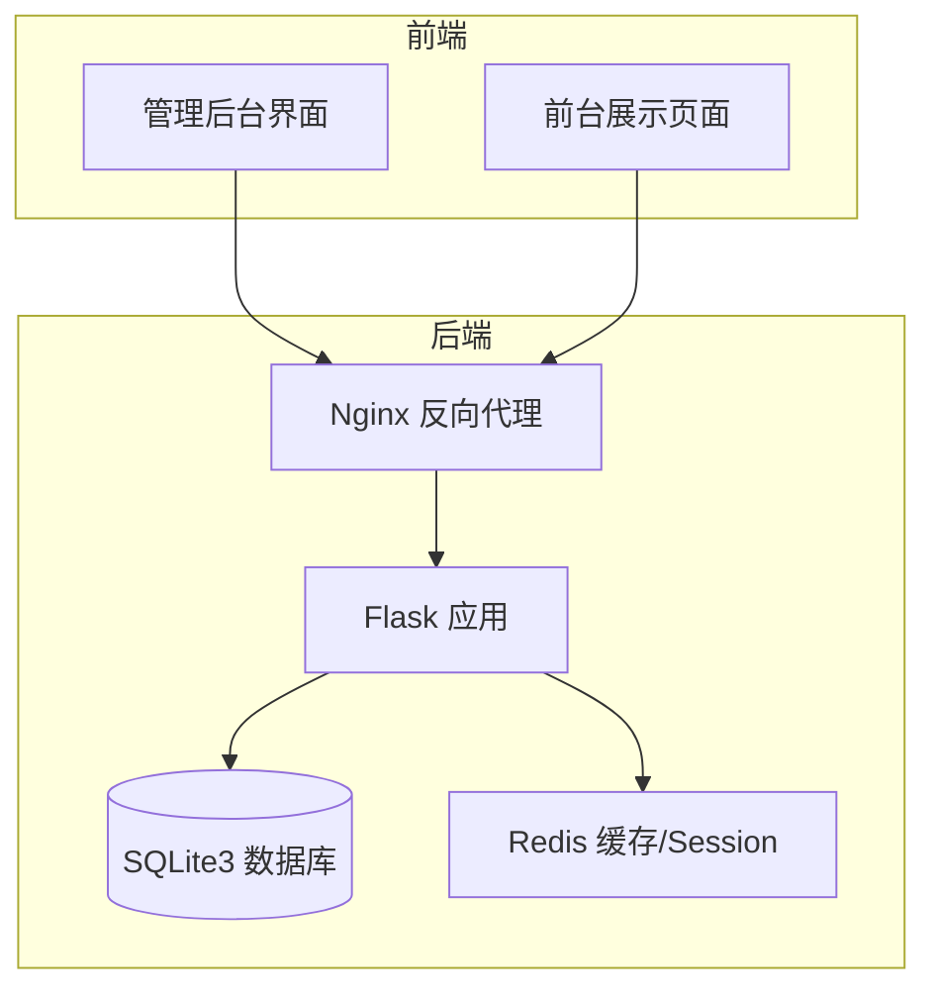
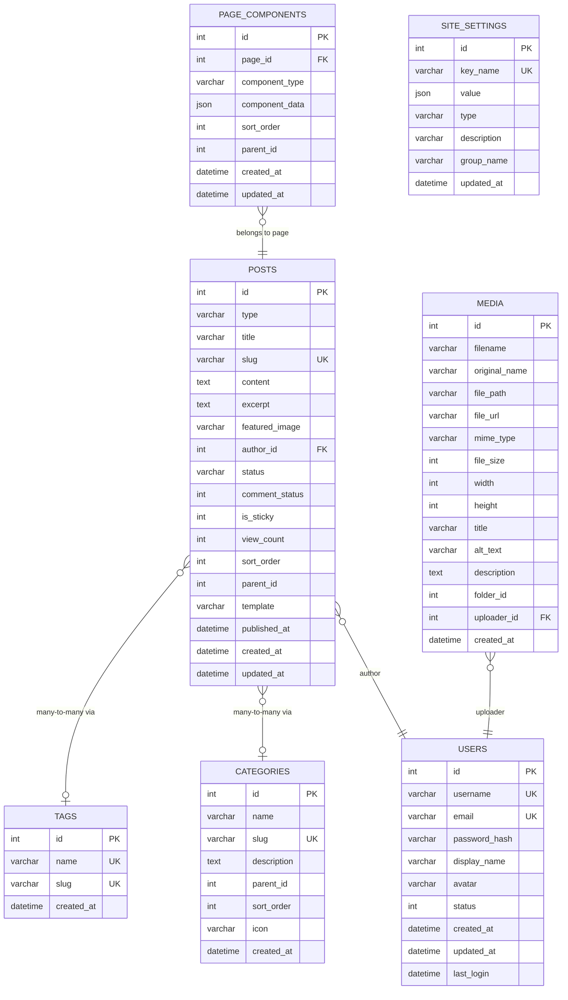
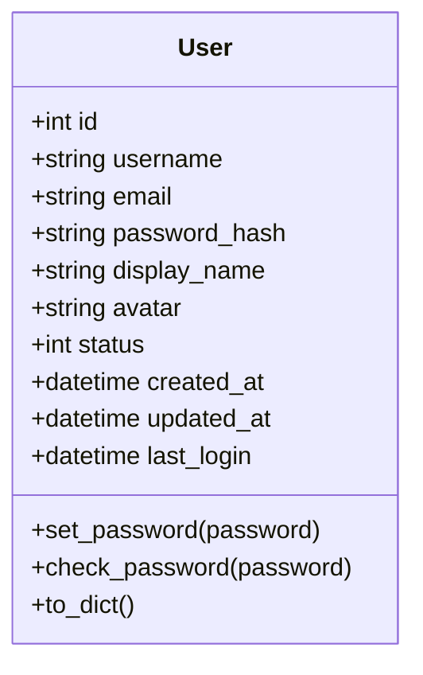
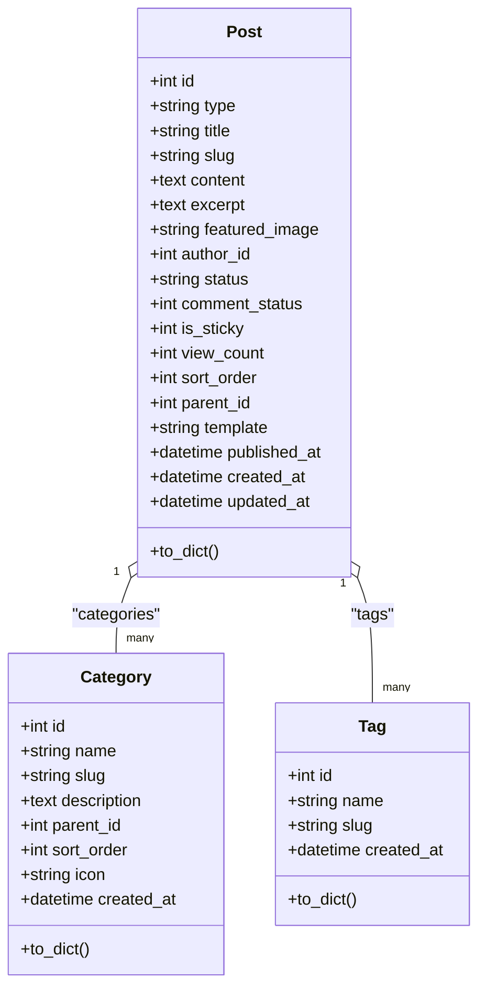
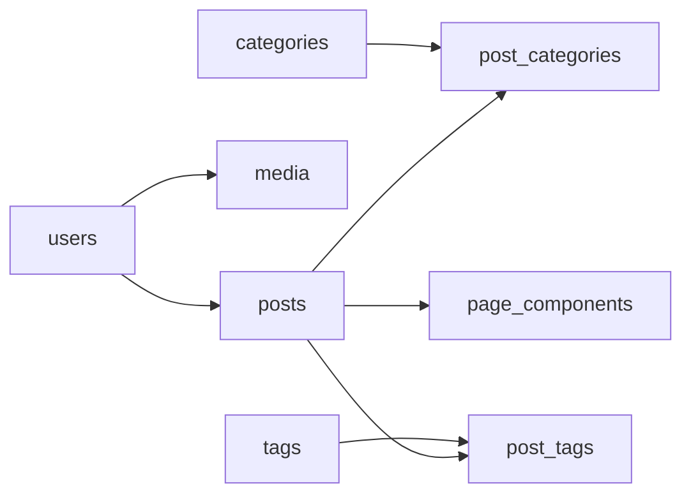
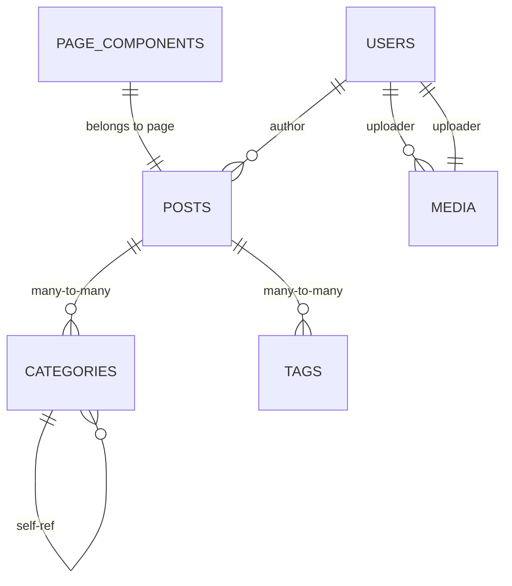

# 数据库设计

<cite>
**本文引用的文件**
- [企业网站CMS系统详细需求文档.md](file://docs/企业网站CMS系统详细需求文档.md)
- [企业网站CMS系统开发需求文档.ini](file://docs/企业网站CMS系统开发需求文档.ini)
- [开发计划表_2月4日-2月12日.md](file://docs/开发计划表_2月4日-2月12日.md)
- [models/__init__.py](file://company_cms_project/backend/app/models/__init__.py)
- [models/post.py](file://company_cms_project/backend/app/models/post.py)
- [models/user.py](file://company_cms_project/backend/app/models/user.py)
- [app/__init__.py](file://company_cms_project/backend/app/__init__.py)
- [config.py](file://company_cms_project/backend/config.py)
- [api/posts.py](file://company_cms_project/backend/app/api/posts.py)
- [api/categories.py](file://company_cms_project/backend/app/api/categories.py)
- [api/media.py](file://company_cms_project/backend/app/api/media.py)
- [api/tags.py](file://company_cms_project/backend/app/api/tags.py)
- [api/settings.py](file://company_cms_project/backend/app/api/settings.py)
- [api/menus.py](file://company_cms_project/backend/app/api/menus.py)
</cite>

## 更新摘要
**变更内容**
- 新增完整的Flask-SQLAlchemy数据库模型实现
- 实现了Post、User、Category、Tag、Media、PageComponent、SiteSetting等核心实体模型
- 完成了多对多关系映射（post_categories、post_tags）
- 集成了JWT认证、文件上传、页面配置等功能
- 实现了完整的API数据访问模式

## 目录
1. [简介](#简介)
2. [项目结构](#项目结构)
3. [核心组件](#核心组件)
4. [架构总览](#架构总览)
5. [详细组件分析](#详细组件分析)
6. [依赖分析](#依赖分析)
7. [性能考量](#性能考量)
8. [故障排查指南](#故障排查指南)
9. [结论](#结论)
10. [附录](#附录)

## 简介
本数据库设计文档面向企业网站CMS系统，基于最新的Flask-SQLAlchemy模型架构，聚焦于SQLite3选型、核心数据表结构、实体关系、索引与约束、数据访问模式、缓存策略、性能优化、数据生命周期与保留策略、迁移路径与版本管理以及数据安全措施。文档内容完全基于仓库中的实际代码实现，确保与开发目标一致。

## 项目结构
- 后端采用Flask + SQLAlchemy + Flask-Migrate，数据库为SQLite3，便于零配置部署与备份。
- 前端可选React/Vue或纯HTML模板渲染，通过Nginx反向代理转发API请求。
- Redis用于可选缓存与Session存储；生产环境使用Windows服务管理Flask应用。

**章节来源**
- [config.py](file://company_cms_project/backend/config.py#L14-L17)
- [app/__init__.py](file://company_cms_project/backend/app/__init__.py#L15-L48)

## 核心组件
本节梳理系统的核心数据表及其职责边界：
- 用户与权限：users、roles、permissions、user_roles、role_permissions
- 内容管理：posts、categories、tags、post_categories、post_tags、post_translations
- 媒体库：media
- 页面配置：page_components
- 站点配置：site_settings
- 全文检索：posts_fts（FTS5虚拟表）

**章节来源**
- [models/post.py](file://company_cms_project/backend/app/models/post.py#L4-L248)
- [models/user.py](file://company_cms_project/backend/app/models/user.py#L5-L47)

## 架构总览
数据库层围绕"内容为中心"的设计，采用一对一、一对多、多对多关系，结合索引与触发器保障查询与全文检索性能。

**图表来源**
- [models/post.py](file://company_cms_project/backend/app/models/post.py#L4-L248)
- [models/user.py](file://company_cms_project/backend/app/models/user.py#L5-L47)

**章节来源**
- [models/post.py](file://company_cms_project/backend/app/models/post.py#L4-L248)
- [models/user.py](file://company_cms_project/backend/app/models/user.py#L5-L47)

## 详细组件分析

### 用户模型
- users：用户基本信息、状态、时间戳、最后登录时间；username与email唯一；建立username与email索引。
- 支持密码哈希、JWT认证、用户权限管理。

**图表来源**
- [models/user.py](file://company_cms_project/backend/app/models/user.py#L5-L47)

**章节来源**
- [models/user.py](file://company_cms_project/backend/app/models/user.py#L5-L47)

### 内容管理模型
- posts：文章/页面统一建模，支持类型区分、状态、置顶、浏览量、发布时间、作者外键；slug唯一；建立type+status、slug、published_at索引。
- categories：分类树形结构，parent_id自引用；slug唯一；sort_order排序；建立parent_id索引。
- tags：标签唯一性约束；slug唯一。
- post_categories/post_tags：文章-分类/标签多对多关联，级联删除。

**图表来源**
- [models/post.py](file://company_cms_project/backend/app/models/post.py#L4-L248)

**章节来源**
- [models/post.py](file://company_cms_project/backend/app/models/post.py#L4-L248)

### 媒体库模型
- media：文件元数据、宽高、标题/alt/描述、上传者外键；mime_type、folder_id索引；uploader_id外键指向users。

**章节来源**
- [models/post.py](file://company_cms_project/backend/app/models/post.py#L118-L158)

### 页面配置模型
- page_components：页面组件树形结构，JSON存储组件配置；page_id外键指向posts；parent_id支持嵌套；sort_order排序。
- site_settings：站点配置键值对，按分组管理，key_name唯一。

**章节来源**
- [models/post.py](file://company_cms_project/backend/app/models/post.py#L173-L248)

### 数据访问模式与缓存策略
- 数据访问模式
  - 用户认证：JWT Token + 权限装饰器；RBAC模型。
  - 内容访问：按type/status筛选、slug精确匹配、分页与排序。
  - 媒体访问：按类型与目录筛选、支持缩略图与元数据。
  - 页面配置：JSON存储组件树，支持排序与父子关系。
- 缓存策略
  - 页面缓存：Redis存储全页面；登录用户不缓存。
  - 数据缓存：查询结果与API响应缓存；Key命名规范。
  - 静态资源缓存：浏览器缓存与版本号/哈希更新策略。

**章节来源**
- [api/posts.py](file://company_cms_project/backend/app/api/posts.py#L16-L75)
- [api/media.py](file://company_cms_project/backend/app/api/media.py#L35-L76)
- [config.py](file://company_cms_project/backend/config.py#L19-L22)

## 依赖分析
- 外键依赖：posts.author_id → users.id；media.uploader_id → users.id；post_*、page_components、role_permissions、user_roles均存在级联删除。
- 索引依赖：users(username, email)、posts(slug)、categories(parent_id)、media(mime_type,folder_id)。
- 全文检索依赖：posts与posts_fts通过触发器保持同步。

**图表来源**
- [models/post.py](file://company_cms_project/backend/app/models/post.py#L162-L170)
- [models/user.py](file://company_cms_project/backend/app/models/user.py#L21-L22)

**章节来源**
- [models/post.py](file://company_cms_project/backend/app/models/post.py#L162-L170)
- [models/user.py](file://company_cms_project/backend/app/models/user.py#L21-L22)

## 性能考量
- 索引策略
  - users：username、email索引，支撑登录与状态查询。
  - posts：slug索引，支撑URL路由和搜索。
  - categories：parent_id索引，支撑树形查询。
  - media：mime_type、folder_id索引，支撑类型与目录筛选。
- 全文检索
  - 使用FTS5虚拟表与触发器，避免FULLTEXT原生索引缺失带来的性能问题。
- 缓存策略
  - Redis可选：用于页面缓存、API响应缓存、Session存储；配置见Flask配置。
- 数据库优化
  - SQLite适合读多写少场景；可通过WAL模式与合理索引提升并发读取性能。
- 资源优化
  - 前端静态资源CDN、图片懒加载、响应式图片、压缩合并等。

**章节来源**
- [config.py](file://company_cms_project/backend/config.py#L14-L17)
- [app/__init__.py](file://company_cms_project/backend/app/__init__.py#L25-L29)

## 故障排查指南
- 登录失败锁定
  - 登录失败超过阈值将临时锁定账户，防止暴力破解。
- 文件上传安全
  - 仅允许白名单类型、限制大小、文件名随机化、存储路径限制。
- SQL注入防护
  - ORM参数化查询、输入校验、避免动态SQL。
- XSS/CSRF防护
  - 输入过滤、输出转义、CSRF Token、SameSite Cookie。
- 备份与恢复
  - SQLite数据库文件可直接复制备份；支持手动/自动备份与恢复。
- 性能问题
  - 检查索引是否命中、是否存在N+1查询、必要时引入Redis缓存。

**章节来源**
- [api/media.py](file://company_cms_project/backend/app/api/media.py#L11-L14)
- [config.py](file://company_cms_project/backend/config.py#L24-L29)

## 结论
本数据库设计以SQLite3为核心，围绕"内容为中心"的实体关系，采用多对多关联与FTS5全文检索，配合索引与可选Redis缓存，满足中小规模企业官网的读多写少场景。通过严格的约束与安全策略，确保数据一致性与安全性；通过清晰的迁移与备份流程，保障系统可演进与可恢复。

## 附录

### 数据字典
- users
  - 字段：id、username、email、password_hash、display_name、avatar、status、created_at、updated_at、last_login
  - 约束：username/email唯一；status默认1；索引：username、email
- posts
  - 字段：id、type、title、slug、content、excerpt、featured_image、author_id、status、comment_status、is_sticky、view_count、sort_order、parent_id、template、published_at、created_at、updated_at
  - 约束：author_id外键；slug唯一；索引：slug
- categories
  - 字段：id、name、slug、description、parent_id、sort_order、icon、created_at
  - 约束：slug唯一；parent_id自引用；索引：parent_id
- tags
  - 字段：id、name、slug、created_at
  - 约束：name、slug唯一
- media
  - 字段：id、filename、original_name、file_path、file_url、mime_type、file_size、width、height、title、alt_text、description、folder_id、uploader_id、created_at
  - 约束：uploader_id外键；索引：mime_type、folder_id
- page_components
  - 字段：id、page_id、component_type、component_data、sort_order、parent_id、created_at、updated_at
  - 约束：page_id外键
- site_settings
  - 字段：id、key_name、value、type、description、group_name、updated_at
  - 约束：key_name唯一

**章节来源**
- [models/user.py](file://company_cms_project/backend/app/models/user.py#L9-L18)
- [models/post.py](file://company_cms_project/backend/app/models/post.py#L8-L25)
- [models/post.py](file://company_cms_project/backend/app/models/post.py#L66-L73)
- [models/post.py](file://company_cms_project/backend/app/models/post.py#L98-L101)
- [models/post.py](file://company_cms_project/backend/app/models/post.py#L122-L136)
- [models/post.py](file://company_cms_project/backend/app/models/post.py#L177-L184)
- [models/post.py](file://company_cms_project/backend/app/models/post.py#L203-L209)

### 表关系图

**图表来源**
- [models/post.py](file://company_cms_project/backend/app/models/post.py#L28-L30)
- [models/post.py](file://company_cms_project/backend/app/models/post.py#L76)
- [models/post.py](file://company_cms_project/backend/app/models/post.py#L104)
- [models/user.py](file://company_cms_project/backend/app/models/user.py#L21-L22)

### 数据访问模式与缓存策略
- 数据访问模式
  - 用户认证：JWT Token + 权限装饰器；RBAC模型。
  - 内容访问：按type/status筛选、slug精确匹配、分页与排序。
  - 媒体访问：按类型与目录筛选、支持缩略图与元数据。
  - 页面配置：JSON存储组件树，支持排序与父子关系。
- 缓存策略
  - 页面缓存：Redis存储全页面；登录用户不缓存。
  - 数据缓存：查询结果与API响应缓存；Key命名规范。
  - 静态资源缓存：浏览器缓存与版本号/哈希更新策略。

**章节来源**
- [api/posts.py](file://company_cms_project/backend/app/api/posts.py#L16-L75)
- [api/media.py](file://company_cms_project/backend/app/api/media.py#L35-L76)
- [config.py](file://company_cms_project/backend/config.py#L19-L22)

### 数据生命周期、保留策略与归档规则
- 生命周期
  - 用户：正常/禁用状态；登录失败锁定；最后登录时间记录。
  - 文章：草稿/已发布/私密；置顶与浏览量统计；发布时间与更新时间。
  - 媒体：上传者、文件元数据、缩略图生成；支持删除与信息更新。
- 保留策略
  - 数据库备份：每日全量；文件备份：每日增量；保留30天；异地备份至云存储。
  - 备份恢复：支持手动/自动备份与恢复。
- 归档规则
  - 未使用文件清理；旧版本内容归档（可扩展）。

**章节来源**
- [config.py](file://company_cms_project/backend/config.py#L24-L29)
- [app/__init__.py](file://company_cms_project/backend/app/__init__.py#L31-L34)

### 数据迁移路径与版本管理
- 迁移路径
  - 使用Flask-Migrate管理数据库版本；迁移脚本随代码版本控制。
  - SQLite迁移相对简单，主要关注新增/删除表与索引。
- 版本管理
  - Git分支管理（Git Flow）；语义化版本标签；代码审查与注释覆盖率。

**章节来源**
- [app/__init__.py](file://company_cms_project/backend/app/__init__.py#L26-L27)

### 数据安全措施
- 认证与授权
  - JWT Token：Access/Refresh Token；Token刷新机制；单点/多点登录可配置。
  - 密码加密：bcrypt；密码强度要求；登录失败锁定。
- 数据传输与存储
  - HTTPS强制跳转；敏感数据加密；CSP头；HSTS。
- API安全
  - 限流（Flask-Limiter）；CSRF防护；API Key加密存储与轮换。

**章节来源**
- [config.py](file://company_cms_project/backend/config.py#L19-L22)
- [api/posts.py](file://company_cms_project/backend/app/api/posts.py#L108-L187)