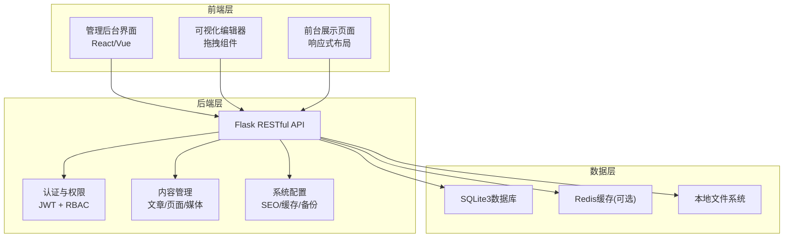
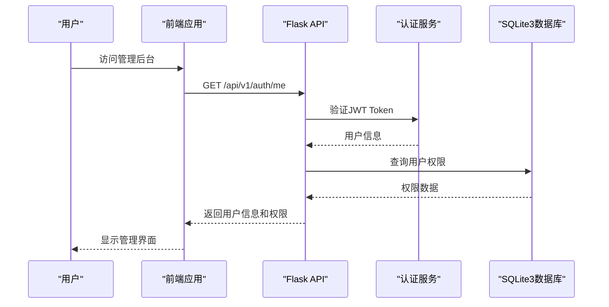
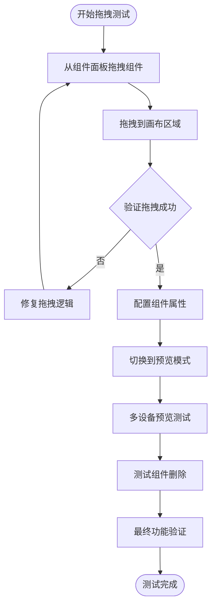
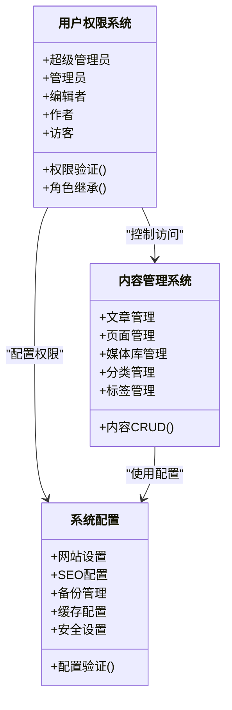
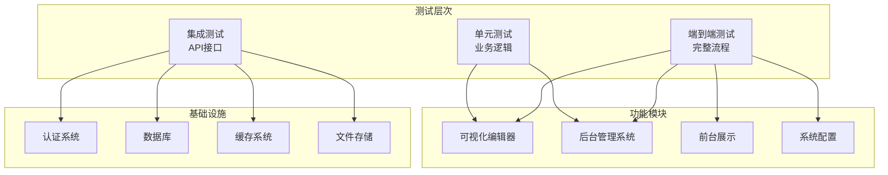

# 功能测试

<cite>
**本文档引用的文件**
- [企业网站CMS系统开发需求文档.ini](file://企业网站CMS系统开发需求文档.ini)
- [企业网站CMS系统详细需求文档.md](file://企业网站CMS系统详细需求文档.md)
- [开发计划表_2月4日-2月12日.md](file://开发计划表_2月4日-2月12日.md)
</cite>

## 目录
1. [引言](#引言)
2. [项目结构](#项目结构)
3. [核心组件](#核心组件)
4. [架构总览](#架构总览)
5. [详细组件分析](#详细组件分析)
6. [依赖关系分析](#依赖关系分析)
7. [性能考虑](#性能考虑)
8. [故障排除指南](#故障排除指南)
9. [结论](#结论)
10. [附录](#附录)

## 引言
本测试文档面向企业网站CMS系统的功能测试，覆盖前端可视化编辑器、后台管理系统、多语言支持、SEO优化和性能优化等核心模块。文档基于项目需求文档和开发计划，提供测试用例设计原则、测试数据准备、测试环境配置和测试执行流程，并涵盖单元测试、集成测试和端到端测试的方法论与最佳实践。

## 项目结构
CMS系统采用前后端分离架构，后端基于Python Flask + SQLite3，前端采用React/Vue技术栈，通过RESTful API通信。开发计划采用MVP策略，8天内完成核心功能交付。

**图表来源**
- [企业网站CMS系统详细需求文档.md](file://企业网站CMS系统详细需求文档.md#L22-L57)
- [开发计划表_2月4日-2月12日.md](file://开发计划表_2月4日-2月12日.md#L92-L105)

**章节来源**
- [企业网站CMS系统详细需求文档.md](file://企业网站CMS系统详细需求文档.md#L22-L57)
- [开发计划表_2月4日-2月12日.md](file://开发计划表_2月4日-2月12日.md#L58-L83)

## 核心组件
CMS系统的核心组件包括：
- 前端可视化编辑器：拖拽布局配置、组件库、实时预览
- 后台管理系统：用户权限管理、内容管理、系统配置
- 多语言支持：语言切换、内容多语言版本、界面多语言
- SEO优化：URL优化、Meta标签管理、Sitemap生成
- 性能优化：页面缓存、图片懒加载、CDN支持

**章节来源**
- [企业网站CMS系统开发需求文档.ini](file://企业网站CMS系统开发需求文档.ini#L14-L69)
- [企业网站CMS系统详细需求文档.md](file://企业网站CMS系统详细需求文档.md#L63-L233)

## 架构总览
系统采用三层架构：表现层（前端）、业务层（Flask后端）、数据层（SQLite3）。前后端通过RESTful API通信，支持JWT认证和RBAC权限控制。

**图表来源**
- [开发计划表_2月4日-2月12日.md](file://开发计划表_2月4日-2月12日.md#L150-L157)

**章节来源**
- [企业网站CMS系统详细需求文档.md](file://企业网站CMS系统详细需求文档.md#L551-L660)

## 详细组件分析

### 前端可视化编辑器测试
可视化编辑器是MVP版本的核心功能，包含简化版拖拽编辑器和基础组件库。

#### 拖拽功能测试
- 组件拖拽测试：验证从组件面板拖拽到画布区域的完整性
- 组件排序测试：验证组件在画布内的拖拽排序功能
- 组件删除测试：验证组件的删除和撤销功能
- 嵌套容器测试：验证容器组件的嵌套和布局功能

#### 组件库功能测试
- 文本组件测试：标题、段落的富文本编辑功能
- 图片组件测试：单图展示、图片上传和预览
- 容器组件测试：基础布局容器的配置和样式
- 按钮组件测试：CTA按钮的点击和样式配置
- 表单组件测试：联系表单的数据收集和验证

#### 实时预览功能测试
- 编辑模式切换测试：编辑模式与预览模式的无缝切换
- 多设备预览测试：桌面、平板、手机的预览效果
- 全屏预览测试：全屏模式下的组件显示
- 预览时工具栏隐藏测试：预览模式下编辑工具栏的隐藏

**图表来源**
- [开发计划表_2月4日-2月12日.md](file://开发计划表_2月4日-2月12日.md#L372-L394)

**章节来源**
- [开发计划表_2月4日-2月12日.md](file://开发计划表_2月4日-2月12日.md#L372-L412)

### 后台管理系统测试

#### 用户权限测试
- 角色权限测试：超级管理员、管理员、编辑者、作者、访客的权限验证
- 登录登出测试：用户注册、登录、登出的完整流程
- 权限继承测试：角色权限的继承和组合验证
- 数据级权限测试：用户只能操作自己创建的内容

#### 内容管理测试
- 文章管理测试：文章的CRUD操作、分类管理、标签管理
- 页面管理测试：页面的创建、模板选择、状态控制
- 媒体库管理测试：图片上传、文件管理、存储空间统计

#### 系统配置测试
- 网站设置测试：基本信息、联系方式、社交媒体链接
- SEO配置测试：Meta标签、URL重写、Google Analytics
- 备份管理测试：自动备份、手动备份、备份恢复

**图表来源**
- [企业网站CMS系统详细需求文档.md](file://企业网站CMS系统详细需求文档.md#L237-L445)

**章节来源**
- [企业网站CMS系统详细需求文档.md](file://企业网站CMS系统详细需求文档.md#L237-L445)

### 多语言支持测试
多语言支持功能包含语言切换、内容多语言管理和界面多语言。

#### 语言切换测试
- URL语言参数测试：/zh/、/en/等语言参数的正确识别
- Cookie记忆测试：语言偏好的持久化存储
- 浏览器语言检测测试：自动检测用户浏览器语言
- 语言切换功能测试：前端语言切换组件的交互

#### 内容多语言测试
- 文章多语言版本测试：文章的中英文版本管理
- 页面多语言版本测试：页面的多语言版本切换
- 语言版本关联测试：多语言内容的关联关系
- 未翻译内容提示测试：缺失翻译时的用户提示

**章节来源**
- [企业网站CMS系统详细需求文档.md](file://企业网站CMS系统详细需求文档.md#L450-L481)

### SEO优化测试
SEO优化系统包含URL优化、Meta标签管理和Sitemap生成等功能。

#### URL优化测试
- 友好URL结构测试：去除?id=的URL结构
- Slug自动生成测试：中文转拼音的slug生成
- URL重定向测试：301/302重定向的正确配置
- 规范链接测试：Canonical URL的设置

#### Meta标签管理测试
- 每页独立设置测试：Title、Description、Keywords的独立配置
- Open Graph标签测试：社交分享的标签生成
- 自动生成Meta标签测试：基于内容的Meta标签生成

#### Sitemap生成测试
- XML Sitemap生成测试：Sitemap文件的正确生成
- 优先级设置测试：Sitemap中URL优先级的配置
- 更新频率测试：Sitemap中更新频率的设置

**章节来源**
- [企业网站CMS系统详细需求文档.md](file://企业网站CMS系统详细需求文档.md#L482-L511)

### 性能优化测试
性能优化包含页面缓存、资源优化和数据库优化等策略。

#### 缓存策略测试
- 页面缓存测试：Redis缓存的正确配置和失效策略
- 数据缓存测试：数据库查询结果的缓存验证
- 静态资源缓存测试：浏览器缓存和版本号更新策略

#### 资源优化测试
- 图片懒加载测试：Intersection Observer的懒加载功能
- 响应式图片测试：srcset的响应式图片支持
- CSS/JS压缩测试：压缩合并后的资源加载

#### 数据库优化测试
- 索引优化测试：关键查询的索引配置验证
- 查询优化测试：避免N+1查询的优化效果
- 连接池配置测试：数据库连接池的性能配置

**章节来源**
- [企业网站CMS系统详细需求文档.md](file://企业网站CMS系统详细需求文档.md#L512-L548)

## 依赖关系分析
CMS系统的测试需要考虑各组件间的依赖关系和耦合度。

**图表来源**
- [开发计划表_2月4日-2月12日.md](file://开发计划表_2月4日-2月12日.md#L636-L649)

**章节来源**
- [开发计划表_2月4日-2月12日.md](file://开发计划表_2月4日-2月12日.md#L636-L729)

## 性能考虑
基于MVP开发计划，系统性能测试重点关注页面加载时间和API响应时间。

### 性能基准
- 页面加载时间：< 3秒
- API响应时间：< 500ms
- 图片上传速度：< 5秒/5MB
- 并发用户支持：≥ 10个用户

### 性能测试方法
- 压力测试：模拟高并发用户访问
- 响应时间测试：关键页面和API的响应时间测量
- 资源使用测试：CPU、内存、磁盘I/O的监控
- 缓存效果测试：缓存命中率和失效策略验证

## 故障排除指南
针对CMS系统可能出现的常见问题提供解决方案。

### 认证与权限问题
- Token过期：实现自动刷新机制，提供刷新Token接口
- 权限不足：检查RBAC权限配置，验证用户角色继承
- 登录失败：检查密码加密算法，实现账户锁定机制

### 数据库问题
- SQLite并发写入：启用WAL模式，优化写入性能
- 数据库锁：合理设计事务，避免长时间持有锁
- 数据迁移：使用Flask-Migrate进行数据库版本管理

### 文件上传问题
- 文件类型验证：实现严格的文件类型检查
- 存储空间管理：监控存储使用情况，提供清理机制
- 图片处理：使用Pillow进行图片压缩和缩略图生成

**章节来源**
- [开发计划表_2月4日-2月12日.md](file://开发计划表_2月4日-2月12日.md#L589-L625)

## 结论
本测试文档基于CMS系统的MVP需求和开发计划，提供了全面的功能测试覆盖。通过合理的测试策略和方法论，可以确保系统在8天开发周期内高质量交付。建议在实际测试中结合具体的代码实现进行针对性的测试用例设计和执行。

## 附录

### 测试用例设计原则
- **可追溯性**：每个测试用例对应具体的需求文档条款
- **可重复性**：测试环境和数据准备标准化
- **可维护性**：测试用例结构清晰，便于维护和更新
- **可自动化**：优先设计可自动化的测试用例

### 测试数据准备
- **用户数据**：准备不同角色的测试用户账号
- **内容数据**：准备文章、页面、媒体等测试内容
- **配置数据**：准备SEO、缓存、备份等系统配置
- **环境数据**：准备测试环境的数据库和文件系统

### 测试环境配置
- **开发环境**：本地开发环境的搭建和配置
- **测试环境**：独立的测试数据库和文件存储
- **生产环境**：模拟生产环境的部署和配置
- **监控环境**：性能监控和日志收集的配置

### 测试执行流程
1. **单元测试**：开发完成后立即执行单元测试
2. **集成测试**：API接口完成后执行集成测试
3. **端到端测试**：完整功能完成后执行端到端测试
4. **回归测试**：每次代码变更后执行回归测试
5. **性能测试**：系统完成后执行性能测试