# 安全测试

<cite>
**本文档引用的文件**
- [企业网站CMS系统开发需求文档.ini](file://企业网站CMS系统开发需求文档.ini)
- [企业网站CMS系统详细需求文档.md](file://企业网站CMS系统详细需求文档.md)
- [开发计划表_2月4日-2月12日.md](file://开发计划表_2月4日-2月12日.md)
</cite>

## 目录
1. [引言](#引言)
2. [项目结构](#项目结构)
3. [核心组件](#核心组件)
4. [架构概览](#架构概览)
5. [详细组件分析](#详细组件分析)
6. [依赖关系分析](#依赖关系分析)
7. [性能考虑](#性能考虑)
8. [故障排除指南](#故障排除指南)
9. [结论](#结论)
10. [附录](#附录)

## 引言

本安全测试文档旨在为企业CMS系统建立完整的安全测试体系，覆盖认证与授权测试、数据安全测试、API安全测试、文件上传安全测试、存储安全测试和第三方集成安全测试。该系统采用Python Flask + SQLite3 + Nginx + Windows Server的技术架构，部署于Windows Server环境，支持前后端分离架构和混合模式支持。

## 项目结构

基于项目文档分析，企业CMS系统采用模块化的项目结构：

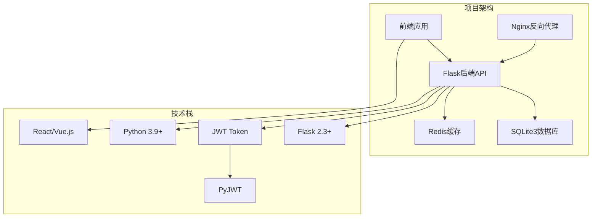

**图表来源**
- [企业网站CMS系统详细需求文档.md](file://企业网站CMS系统详细需求文档.md#L22-L57)
- [开发计划表_2月4日-2月12日.md](file://开发计划表_2月4日-2月12日.md#L555-L594)

**章节来源**
- [企业网站CMS系统详细需求文档.md](file://企业网站CMS系统详细需求文档.md#L22-L57)
- [开发计划表_2月4日-2月12日.md](file://开发计划表_2月4日-2月12日.md#L555-L594)

## 核心组件

### 认证与授权系统

系统采用基于JWT的认证机制和RBAC权限控制模型：

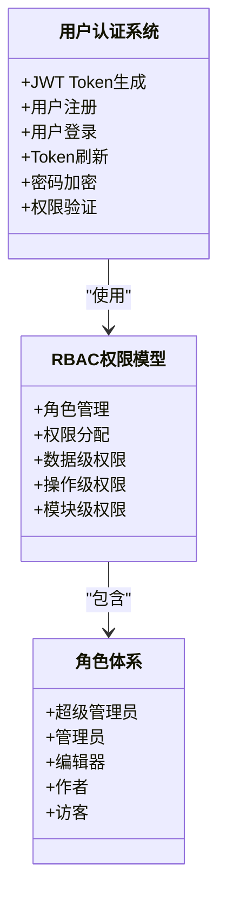

**图表来源**
- [开发计划表_2月4日-2月12日.md](file://开发计划表_2月4日-2月12日.md#L142-L157)
- [企业网站CMS系统详细需求文档.md](file://企业网站CMS系统详细需求文档.md#L237-L282)

### 数据库安全架构

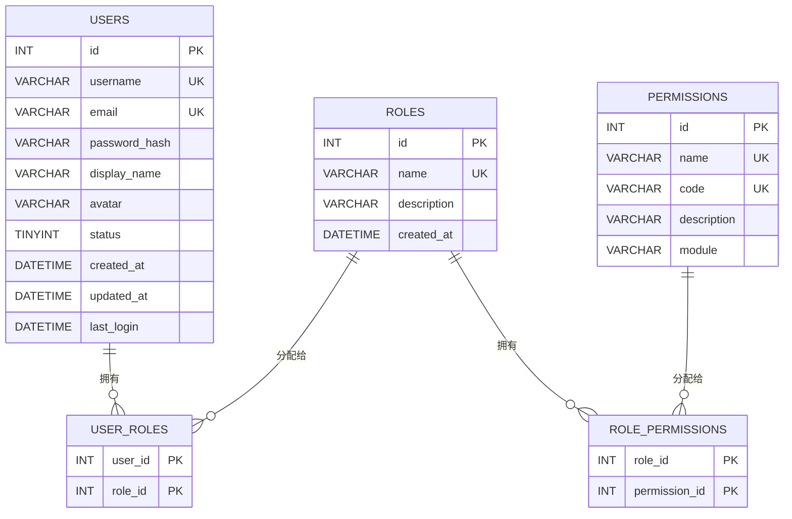

**图表来源**
- [企业网站CMS系统详细需求文档.md](file://企业网站CMS系统详细需求文档.md#L716-L768)

**章节来源**
- [开发计划表_2月4日-2月12日.md](file://开发计划表_2月4日-2月12日.md#L142-L157)
- [企业网站CMS系统详细需求文档.md](file://企业网站CMS系统详细需求文档.md#L237-L282)
- [企业网站CMS系统详细需求文档.md](file://企业网站CMS系统详细需求文档.md#L716-L768)

## 架构概览

系统采用前后端分离架构，支持混合模式（纯HTML模板渲染和SPA单页应用）：

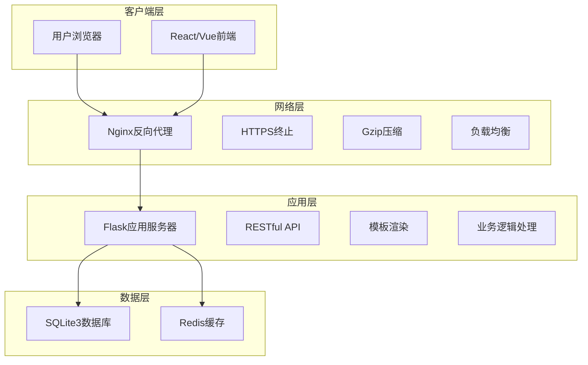

**图表来源**
- [企业网站CMS系统详细需求文档.md](file://企业网站CMS系统详细需求文档.md#L28-L57)

## 详细组件分析

### 认证与授权测试体系

#### JWT令牌验证测试

JWT令牌验证是系统安全的核心组件，需要进行全面的安全测试：

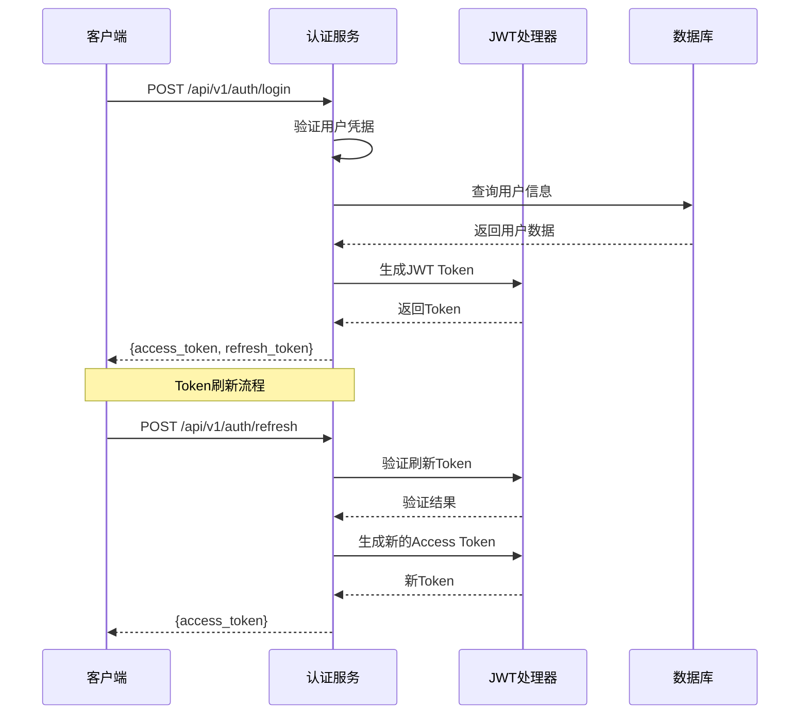

**图表来源**
- [开发计划表_2月4日-2月12日.md](file://开发计划表_2月4日-2月12日.md#L142-L157)

##### JWT安全测试要点

1. **Token生成安全测试**
   - 随机性测试：验证Token生成的随机性
   - 唯一性测试：确保Token不会重复
   - 过期时间测试：验证过期机制
   - 签名验证测试：确保Token完整性

2. **Token验证测试**
   - 伪造Token检测：验证系统能否识别伪造Token
   - 过期Token处理：测试过期Token的处理机制
   - 签名篡改检测：验证签名完整性
   - Token撤销测试：验证Token撤销机制

3. **会话管理测试**

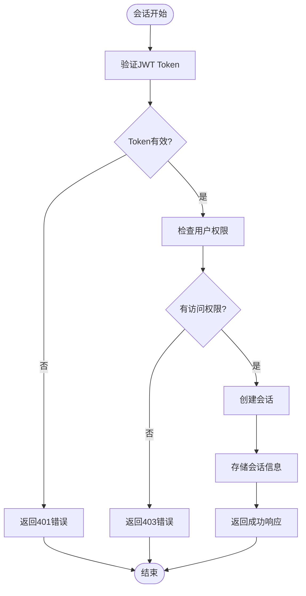

**图表来源**
- [开发计划表_2月4日-2月12日.md](file://开发计划表_2月4日-2月12日.md#L142-L157)

##### 会话安全测试要点

1. **会话创建测试**
   - 正常登录流程测试
   - 多设备登录测试
   - 会话超时测试

2. **会话维持测试**
   - Token自动刷新机制
   - 会话状态持久化
   - 并发会话处理

3. **会话终止测试**
   - 正常登出流程
   - 强制登出机制
   - 会话劫持防护

#### 权限边界测试

系统采用RBAC模型，需要验证权限边界的有效性：

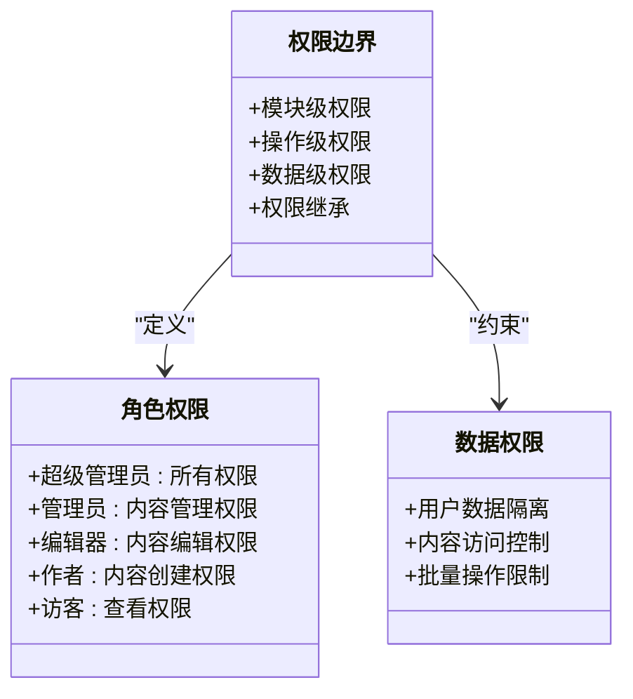

**图表来源**
- [企业网站CMS系统详细需求文档.md](file://企业网站CMS系统详细需求文档.md#L237-L282)

##### 权限测试策略

1. **垂直权限测试**
   - 验证角色间的权限差异
   - 测试权限继承关系
   - 验证权限组合效果

2. **水平权限测试**
   - 验证同级别角色权限
   - 测试权限冲突处理
   - 验证权限边界清晰性

3. **数据权限测试**
   - 验证数据访问隔离
   - 测试批量操作权限
   - 验证数据级权限控制

### 数据安全测试体系

#### SQL注入防护验证

系统采用SQLite3数据库，需要验证SQL注入防护机制：

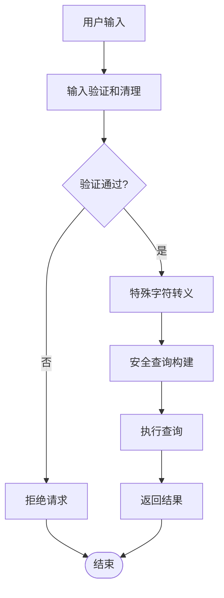

**图表来源**
- [开发计划表_2月4日-2月12日.md](file://开发计划表_2月4日-2月12日.md#L107-L111)

##### SQL注入测试方法

1. **输入验证测试**
   - 特殊字符测试：`'; DROP TABLE users; --`
   - 注释符测试：`--`, `/*`, `*/`
   - 关键字测试：`SELECT`, `INSERT`, `UPDATE`, `DELETE`
   - 转义字符测试：`\`, `'`, `"`, `"`

2. **ORM安全测试**
   - 参数绑定测试
   - 动态查询安全测试
   - 子查询注入防护

3. **数据库访问测试**
   - 权限最小化测试
   - 查询日志审计
   - 异常处理测试

#### XSS攻击防护测试

系统需要验证跨站脚本攻击防护机制：

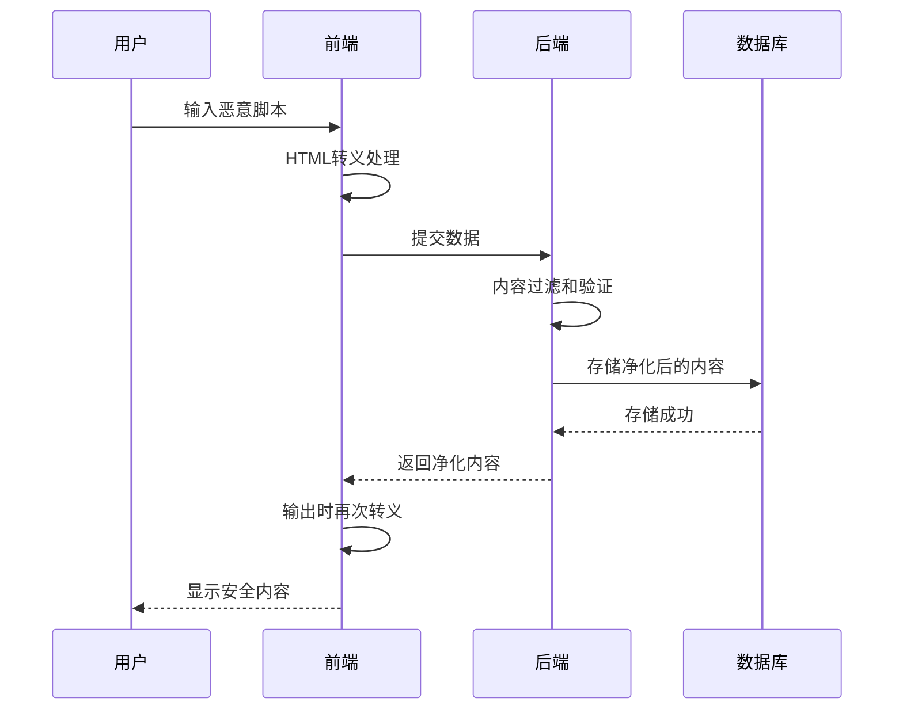

**图表来源**
- [企业网站CMS系统详细需求文档.md](file://企业网站CMS系统详细需求文档.md#L108-L121)

##### XSS防护测试要点

1. **输入过滤测试**
   - 富文本编辑器安全测试
   - 表单输入验证测试
   - URL参数安全测试

2. **输出编码测试**
   - HTML实体编码测试
   - JavaScript转义测试
   - CSS转义测试

3. **内容安全策略(CSP)测试**
   - CSP头设置验证
   - 内联脚本阻止测试
   - 外部资源加载控制

#### CSRF攻击防护测试

系统需要验证跨站请求伪造防护机制：

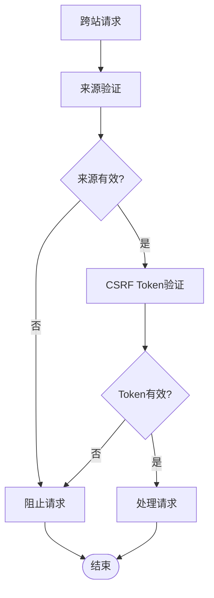

**图表来源**
- [开发计划表_2月4日-2月12日.md](file://开发计划表_2月4日-2月12日.md#L176-L183)

##### CSRF防护测试策略

1. **Token生成测试**
   - Token唯一性测试
   - Token生命周期测试
   - Token存储安全测试

2. **Token验证测试**
   - Token匹配验证
   - Token过期处理
   - Token刷新机制

3. **来源验证测试**
   - Origin头验证
   - Referer头验证
   - SameSite Cookie测试

### API安全测试体系

#### 接口访问控制测试

系统采用RESTful API设计，需要验证访问控制机制：

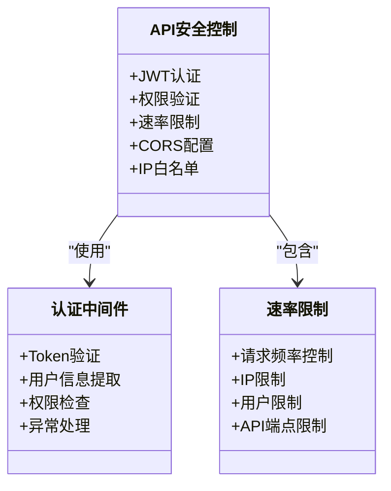

**图表来源**
- [开发计划表_2月4日-2月12日.md](file://开发计划表_2月4日-2月12日.md#L142-L157)

##### API访问控制测试

1. **认证测试**
   - 未认证访问测试
   - 无效Token测试
   - 过期Token测试
   - 权限不足测试

2. **授权测试**
   - 角色权限验证
   - 数据访问控制
   - 操作权限验证
   - 资源访问限制

3. **CORS测试**
   - 跨域请求验证
   - 预检请求处理
   - 安全头设置
   - 代理配置测试

#### 速率限制测试

系统需要验证API速率限制机制：

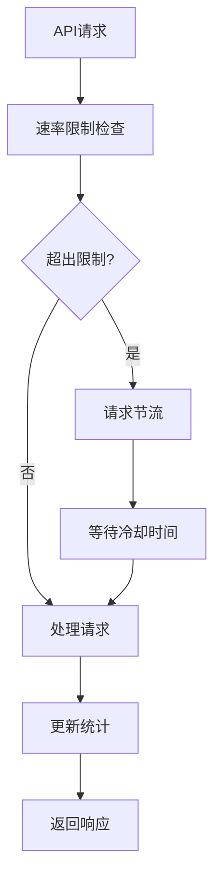

**图表来源**
- [开发计划表_2月4日-2月12日.md](file://开发计划表_2月4日-2月12日.md#L249)

##### 速率限制测试要点

1. **请求频率测试**
   - 单用户请求限制
   - IP地址限制测试
   - API端点特定限制
   - 时间窗口限制

2. **限流算法测试**
   - 固定窗口算法
   - 滑动窗口算法
   - 漏斗算法
   - 令牌桶算法

3. **异常处理测试**
   - 限流触发响应
   - 降级处理机制
   - 错误信息返回
   - 用户体验保障

#### 敏感数据保护测试

系统需要验证敏感数据的保护机制：

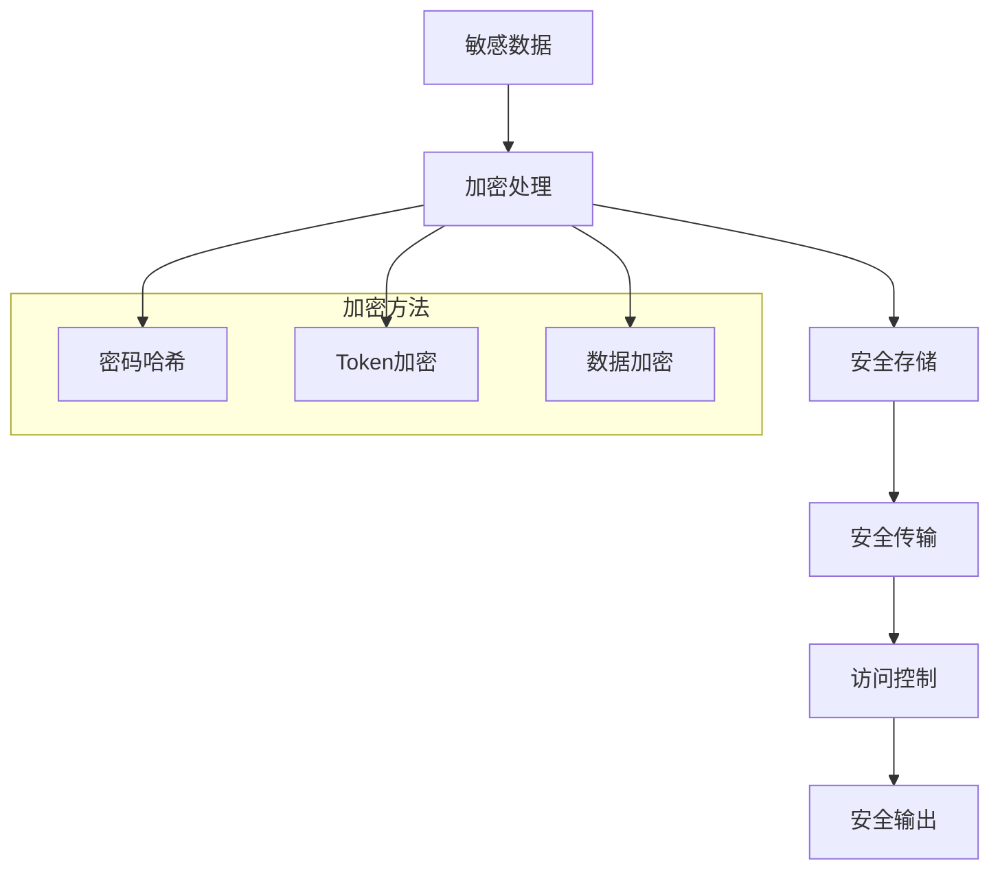

**图表来源**
- [开发计划表_2月4日-2月12日.md](file://开发计划表_2月4日-2月12日.md#L147-L148)

##### 敏感数据保护测试

1. **密码安全测试**
   - 密码哈希算法测试
   - 密码强度验证
   - 存储安全测试
   - 传输加密测试

2. **Token安全测试**
   - JWT签名验证
   - Token存储安全
   - Token传输加密
   - Token撤销机制

3. **数据传输安全**
   - HTTPS强制跳转测试
   - 中间人攻击防护
   - 数据完整性验证
   - 会话安全测试

### 文件上传安全测试

#### 文件上传安全测试

系统需要验证文件上传的安全机制：

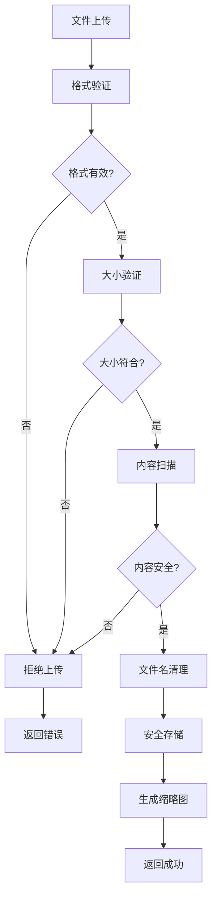

**图表来源**
- [开发计划表_2月4日-2月12日.md](file://开发计划表_2月4日-2月12日.md#L197-L212)

##### 文件上传安全测试要点

1. **文件格式验证**
   - MIME类型检测
   - 文件扩展名验证
   - 文件头验证
   - 动态文件类型识别

2. **文件内容扫描**
   - 恶意代码检测
   - 木马病毒扫描
   - 文件结构验证
   - 缩略图生成安全

3. **存储安全测试**
   - 文件路径安全
   - 文件权限设置
   - 存储空间限制
   - 文件清理机制

#### 存储安全测试

系统需要验证存储层的安全机制：

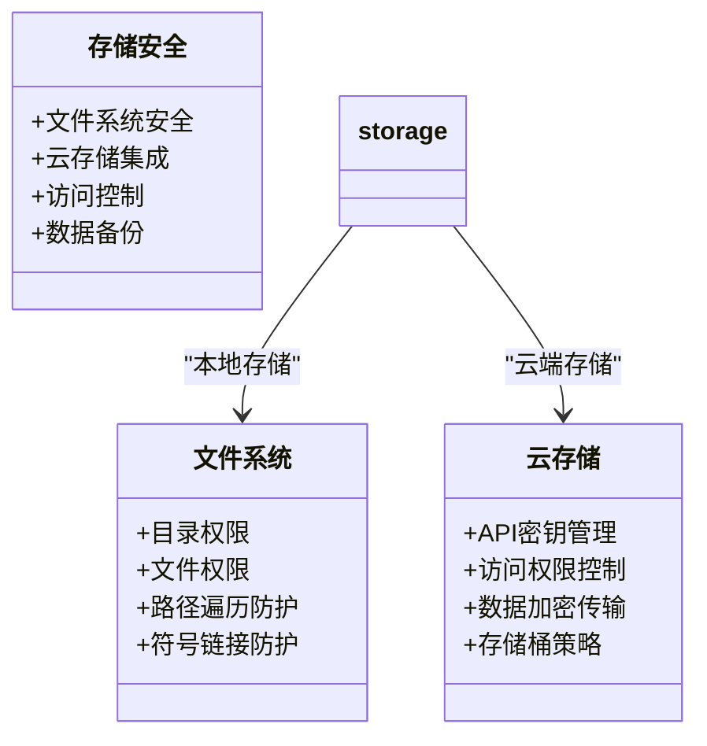

**图表来源**
- [开发计划表_2月4日-2月12日.md](file://开发计划表_2月4日-2月12日.md#L379-L386)

##### 存储安全测试策略

1. **本地存储测试**
   - 目录权限验证
   - 文件访问控制
   - 路径遍历攻击防护
   - 符号链接攻击防护

2. **云存储测试**
   - API密钥安全存储
   - 访问权限验证
   - 数据传输加密
   - 存储桶安全策略

3. **备份安全测试**
   - 备份数据加密
   - 备份传输安全
   - 备份完整性验证
   - 恢复过程安全

### 第三方集成安全测试

#### 第三方集成安全测试

系统可能集成多种第三方服务，需要验证集成安全性：

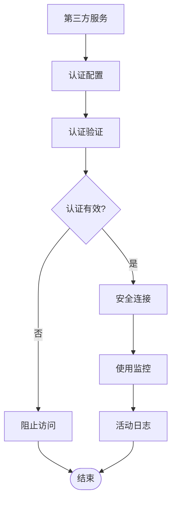

**图表来源**
- [企业网站CMS系统详细需求文档.md](file://企业网站CMS系统详细需求文档.md#L427)

##### 第三方集成安全测试要点

1. **认证集成测试**
   - OAuth流程测试
   - API密钥验证
   - 会话管理测试
   - 权限映射验证

2. **数据传输测试**
   - HTTPS连接验证
   - 数据加密传输
   - 中间人攻击防护
   - 证书验证测试

3. **访问控制测试**
   - API调用限制
   - 使用量监控
   - 异常行为检测
   - 自动化防护

## 依赖关系分析

系统安全测试涉及多个层面的依赖关系：

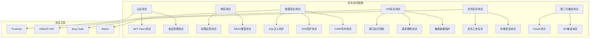

**图表来源**
- [开发计划表_2月4日-2月12日.md](file://开发计划表_2月4日-2月12日.md#L180-L183)

**章节来源**
- [开发计划表_2月4日-2月12日.md](file://开发计划表_2月4日-2月12日.md#L180-L183)

## 性能考虑

安全测试需要平衡安全性和性能：

### 安全性能权衡

1. **认证性能优化**
   - Token验证缓存
   - 异步认证处理
   - 连接池优化
   - 缓存策略

2. **授权性能优化**
   - 权限缓存机制
   - 批量权限检查
   - 权限预加载
   - 缓存失效策略

3. **数据安全性能**
   - 加密算法选择
   - 硬件加速利用
   - 批量处理优化
   - 内存使用控制

## 故障排除指南

### 常见安全问题诊断

#### 认证相关问题

1. **Token相关问题**
   - Token过期处理
   - Token刷新失败
   - 多设备登录冲突
   - Token撤销异常

2. **会话相关问题**
   - 会话丢失处理
   - 并发会话冲突
   - 会话劫持检测
   - 会话状态同步

#### 授权相关问题

1. **权限验证问题**
   - 权限检查失败
   - 权限继承异常
   - 数据访问越权
   - 权限缓存失效

2. **RBAC模型问题**
   - 角色分配错误
   - 权限配置冲突
   - 权限继承链断裂
   - 权限更新延迟

#### 数据安全问题

1. **SQL注入防护问题**
   - ORM绕过检测
   - 动态查询安全
   - 子查询注入
   - 权限提升攻击

2. **XSS防护问题**
   - 富文本编辑器漏洞
   - 输出编码绕过
   - CSP配置错误
   - 内联脚本绕过

#### API安全问题

1. **接口访问控制问题**
   - 未认证请求处理
   - 权限不足请求
   - CORS配置错误
   - IP封禁异常

2. **速率限制问题**
   - 限流算法失效
   - 缓存同步问题
   - 异常请求处理
   - 用户体验影响

### 安全测试工具使用

#### OWASP ZAP集成

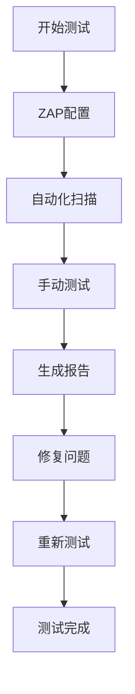

**图表来源**
- [开发计划表_2月4日-2月12日.md](file://开发计划表_2月4日-2月12日.md#L638-L648)

#### 渗透测试执行流程

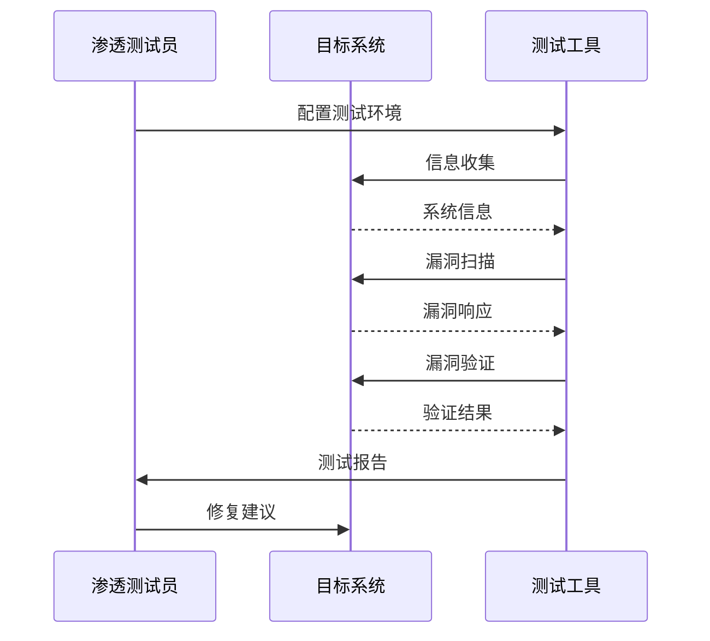

**图表来源**
- [企业网站CMS系统开发需求文档.ini](file://企业网站CMS系统开发需求文档.ini#L105-L110)

## 结论

本安全测试体系涵盖了企业CMS系统的所有关键安全领域，包括认证与授权、数据安全、API安全、文件上传安全、存储安全和第三方集成安全。通过建立完整的测试流程和工具链，可以有效识别和修复安全漏洞，确保系统的整体安全性。

建议在系统开发过程中持续进行安全测试，特别是在每个功能模块完成后进行针对性的安全测试，并在系统上线前进行全面的安全评估和渗透测试。

## 附录

### 安全测试检查清单

#### 认证测试检查清单
- [ ] JWT Token生成测试
- [ ] Token验证机制测试
- [ ] 会话管理测试
- [ ] 多设备登录测试
- [ ] Token撤销机制测试

#### 授权测试检查清单
- [ ] RBAC模型测试
- [ ] 权限边界验证
- [ ] 数据访问控制测试
- [ ] 角色权限验证
- [ ] 权限继承测试

#### 数据安全测试检查清单
- [ ] SQL注入防护测试
- [ ] XSS防护测试
- [ ] CSRF防护测试
- [ ] 敏感数据加密测试
- [ ] 数据完整性验证

#### API安全测试检查清单
- [ ] 接口访问控制测试
- [ ] 速率限制测试
- [ ] CORS配置测试
- [ ] API文档安全测试
- [ ] 异常处理安全测试

#### 文件安全测试检查清单
- [ ] 文件上传格式验证
- [ ] 文件内容扫描测试
- [ ] 存储安全测试
- [ ] 文件访问控制测试
- [ ] 文件清理机制测试

#### 存储安全测试检查清单
- [ ] 本地存储安全测试
- [ ] 云存储集成测试
- [ ] 备份数据安全测试
- [ ] 存储权限控制测试
- [ ] 数据加密存储测试

#### 第三方集成测试检查清单
- [ ] OAuth认证测试
- [ ] API密钥安全测试
- [ ] 数据传输加密测试
- [ ] 访问权限控制测试
- [ ] 使用量监控测试