# 性能测试

<cite>
**本文档引用的文件**
- [企业网站CMS系统开发需求文档.ini](file://企业网站CMS系统开发需求文档.ini)
- [企业网站CMS系统详细需求文档.md](file://企业网站CMS系统详细需求文档.md)
- [开发计划表_2月4日-2月12日.md](file://开发计划表_2月4日-2月12日.md)
</cite>

## 目录
1. [引言](#引言)
2. [项目架构与性能要求](#项目架构与性能要求)
3. [性能测试总体策略](#性能测试总体策略)
4. [压力测试方案](#压力测试方案)
5. [负载测试方案](#负载测试方案)
6. [稳定性测试方案](#稳定性测试方案)
7. [数据库性能测试](#数据库性能测试)
8. [缓存系统测试](#缓存系统测试)
9. [前端性能测试](#前端性能测试)
10. [性能基准测试](#性能基准测试)
11. [并发用户测试](#并发用户测试)
12. [大数据量处理测试](#大数据量处理测试)
13. [长时间运行稳定性测试](#长时间运行稳定性测试)
14. [性能瓶颈识别与优化建议](#性能瓶颈识别与优化建议)
15. [测试工具与环境](#测试工具与环境)
16. [结论](#结论)

## 引言

本性能测试方案针对企业网站CMS系统的全面性能评估而制定，涵盖了压力测试、负载测试、稳定性测试等多个维度。该系统采用Python Flask + SQLite3 + Nginx + Windows Server的技术架构，需要在有限的时间内完成MVP版本的开发和部署。

根据项目需求文档，系统需要满足以下关键性能指标：
- 页面加载时间 < 3秒
- 并发用户支持 > 1000
- 数据库查询响应 < 100ms
- API响应时间 < 500ms
- 文件上传速度 > 10MB/s

## 项目架构与性能要求

### 技术架构概览

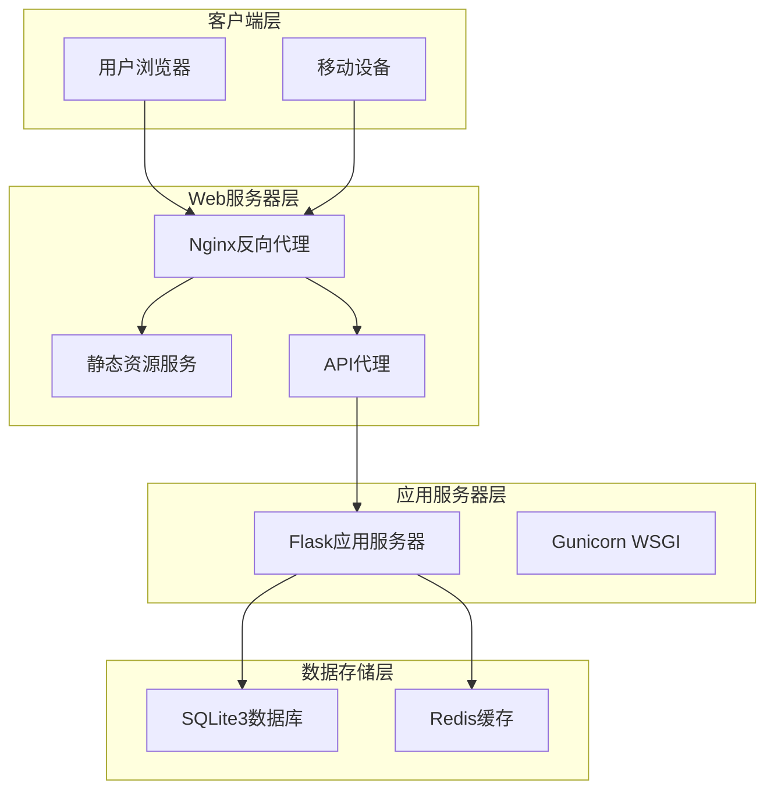
```mermaid
graph TB
subgraph "客户端层"
Browser[用户浏览器]
Mobile[移动设备]
end
subgraph "Web服务器层"
Nginx[Nginx反向代理]
Static[静态资源服务]
Proxy[API代理]
end
subgraph "应用服务器层"
Flask[Flask应用服务器]
Gunicorn[Gunicorn WSGI]
end
subgraph "数据存储层"
SQLite[SQLite3数据库]
Redis[Redis缓存]
end
Browser --> Nginx
Mobile --> Nginx
Nginx --> Static
Nginx --> Proxy
Proxy --> Flask
Flask --> SQLite
Flask --> Redis
```

**图表来源**
- [企业网站CMS系统详细需求文档.md](file://企业网站CMS系统详细需求文档.md#L28-L57)

### 性能指标要求

根据需求文档，系统需要满足以下性能指标：

| 性能类别 | 指标要求 | 测试方法 |
|---------|---------|---------|
| 页面加载时间 | < 3秒 | Lighthouse、Browser DevTools |
| API响应时间 | < 500ms | JMeter、Postman |
| 数据库查询 | < 100ms | EXPLAIN分析、慢查询日志 |
| 并发用户 | > 1000 | Apache Bench、JMeter |
| 文件上传 | > 10MB/s | 专用上传测试工具 |
| 缓存命中率 | > 90% | Redis监控、应用日志 |

**章节来源**
- [企业网站CMS系统开发需求文档.ini](file://企业网站CMS系统开发需求文档.ini#L100-L104)
- [企业网站CMS系统详细需求文档.md](file://企业网站CMS系统详细需求文档.md#L1362-L1380)

## 性能测试总体策略

### 测试层次划分

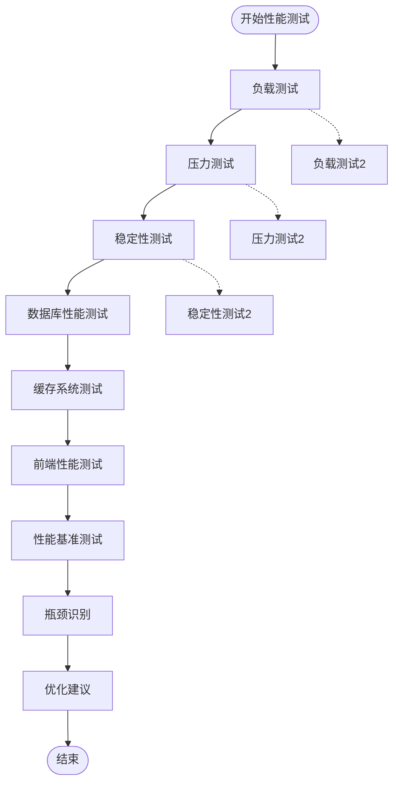
```mermaid
flowchart TD
Start([开始性能测试]) --> LoadTest[负载测试]
LoadTest --> StressTest[压力测试]
StressTest --> StabilityTest[稳定性测试]
StabilityTest --> DBTest[数据库性能测试]
DBTest --> CacheTest[缓存系统测试]
CacheTest --> FrontendTest[前端性能测试]
FrontendTest --> Benchmark[性能基准测试]
Benchmark --> Bottleneck[瓶颈识别]
Bottleneck --> Optimize[优化建议]
Optimize --> End([结束])
LoadTest -.-> LoadTest2[负载测试2]
StressTest -.-> StressTest2[压力测试2]
StabilityTest -.-> StabilityTest2[稳定性测试2]
```

### 测试环境配置

| 组件 | 配置要求 | 监控指标 |
|------|---------|---------|
| 服务器 | Windows Server 2019/2022 | CPU、内存、磁盘IO |
| Web服务器 | Nginx 1.24+ | 连接数、请求处理时间 |
| 应用服务器 | Flask + Gunicorn | worker进程数、内存使用 |
| 数据库 | SQLite3 | 查询性能、锁等待 |
| 缓存 | Redis | 内存使用、命中率 |

## 压力测试方案

### 测试目标

压力测试旨在确定系统的极限承载能力，验证系统在极端条件下的表现。

### 测试场景设计

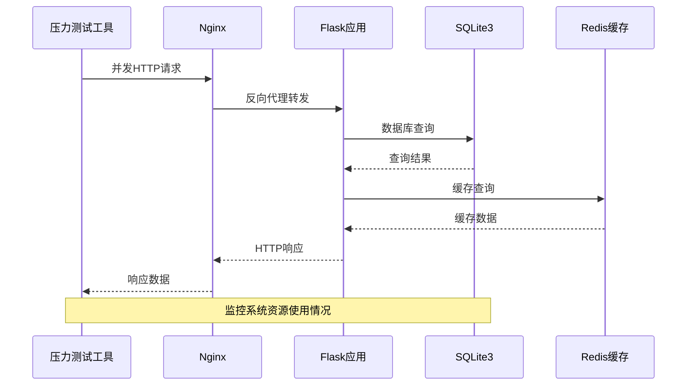
```mermaid
sequenceDiagram
participant TestTool as 压力测试工具
participant Nginx as Nginx
participant Flask as Flask应用
participant DB as SQLite3
participant Cache as Redis缓存
TestTool->>Nginx : 并发HTTP请求
Nginx->>Flask : 反向代理转发
Flask->>DB : 数据库查询
DB-->>Flask : 查询结果
Flask->>Cache : 缓存查询
Cache-->>Flask : 缓存数据
Flask-->>Nginx : HTTP响应
Nginx-->>TestTool : 响应数据
Note over TestTool,DB : 监控系统资源使用情况
```

**图表来源**
- [企业网站CMS系统详细需求文档.md](file://企业网站CMS系统详细需求文档.md#L1145-L1230)

### 压力测试执行策略

#### 1. 逐步递增压力测试

| 阶段 | 并发用户数 | 持续时间 | 目标 |
|------|-----------|---------|------|
| 阶段1 | 100 | 5分钟 | 基准性能测试 |
| 阶段2 | 500 | 5分钟 | 负载测试 |
| 阶段3 | 1000 | 5分钟 | 压力测试 |
| 阶段4 | 2000 | 5分钟 | 极限测试 |

#### 2. 关键接口压力测试

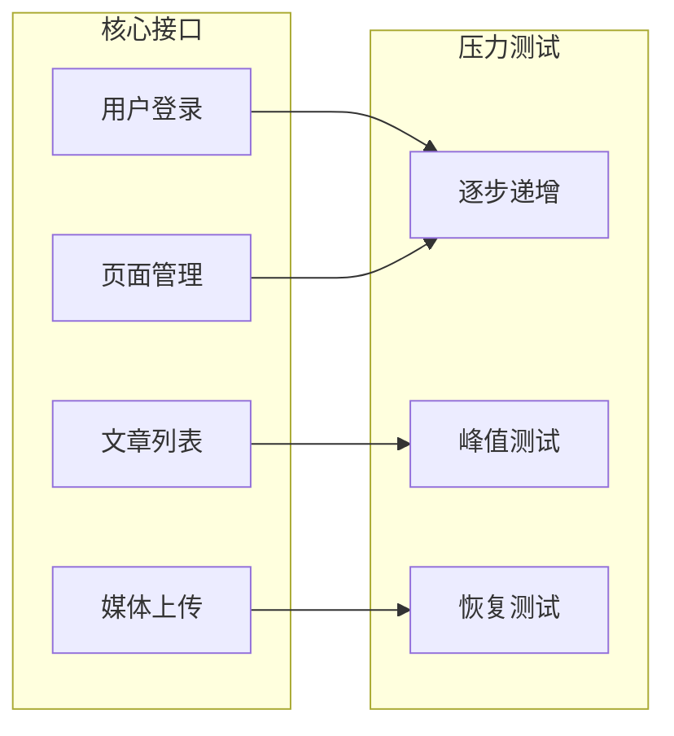
```mermaid
flowchart LR
subgraph "核心接口"
Login[用户登录]
Posts[文章列表]
Media[媒体上传]
Pages[页面管理]
end
subgraph "压力测试"
Stress1[逐步递增]
Stress2[峰值测试]
Stress3[恢复测试]
end
Login --> Stress1
Posts --> Stress2
Media --> Stress3
Pages --> Stress1
```

**章节来源**
- [开发计划表_2月4日-2月12日.md](file://开发计划表_2月4日-2月12日.md#L415-L512)

## 负载测试方案

### 测试目标

负载测试验证系统在预期工作负载下的性能表现，确保满足业务需求。

### 负载测试场景

#### 1. 正常业务负载测试

| 用户类型 | 并发比例 | 典型操作 |
|---------|---------|---------|
| 管理员 | 20% | 登录、内容管理、媒体上传 |
| 编辑者 | 60% | 文章编辑、页面管理 |
| 访客 | 20% | 前台内容浏览 |

#### 2. 峰值业务负载测试

```mermaid
gantt
title 峰值负载测试时间线
dateFormat HH:mm
axisFormat %H:%M
section 峰值时段
登录高峰 :09:00, 30m
内容更新高峰 :12:00, 30m
媒体上传高峰 :14:00, 30m
数据备份高峰 :18:00, 30m
```

### 负载测试指标监控

| 监控维度 | 目标阈值 | 监控工具 |
|---------|---------|---------|
| 响应时间 | < 500ms | JMeter、Apache Bench |
| 错误率 | < 1% | 应用日志、Nginx日志 |
| 吞吐量 | > 500 QPS | 自定义测试工具 |
| 资源使用 | CPU < 70%, 内存 < 2GB | Windows性能监视器 |

## 稳定性测试方案

### 长时间运行测试

稳定性测试验证系统在长时间运行下的可靠性。

#### 测试计划

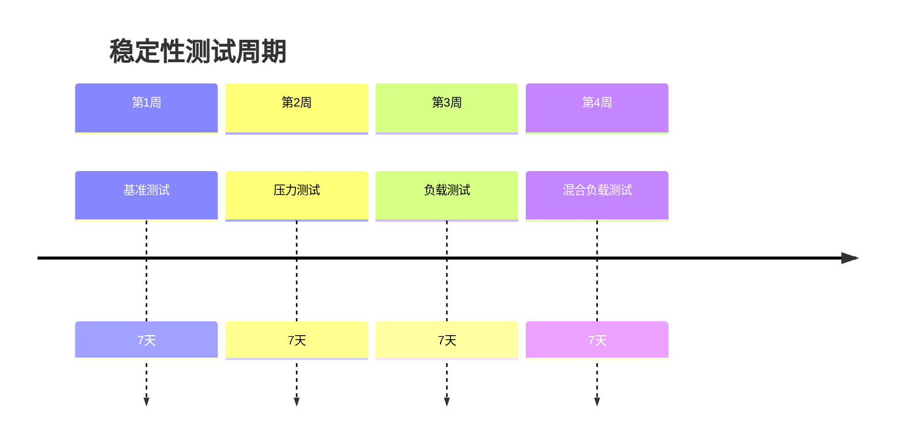
```mermaid
timeline
title 稳定性测试周期
section 第1周
基准测试 : 7天
section 第2周
压力测试 : 7天
section 第3周
负载测试 : 7天
section 第4周
混合负载测试 : 7天
```

#### 长时间运行监控指标

| 指标类别 | 监控频率 | 阈值设置 |
|---------|---------|---------|
| 系统稳定性 | 每5分钟 | 99.9%可用性 |
| 内存泄漏 | 每小时 | < 10%增长 |
| 数据库连接 | 实时监控 | 连接数稳定 |
| 缓存性能 | 每15分钟 | 命中率 > 90% |

### 故障恢复测试

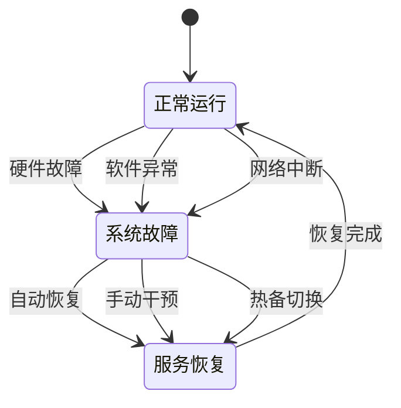
```mermaid
stateDiagram-v2
[*] --> 正常运行
正常运行 --> 系统故障 : 硬件故障
正常运行 --> 系统故障 : 软件异常
正常运行 --> 系统故障 : 网络中断
系统故障 --> 服务恢复 : 自动恢复
系统故障 --> 服务恢复 : 手动干预
系统故障 --> 服务恢复 : 热备切换
服务恢复 --> 正常运行 : 恢复完成
```

## 数据库性能测试

### SQL查询优化验证

#### 1. 查询性能基准测试

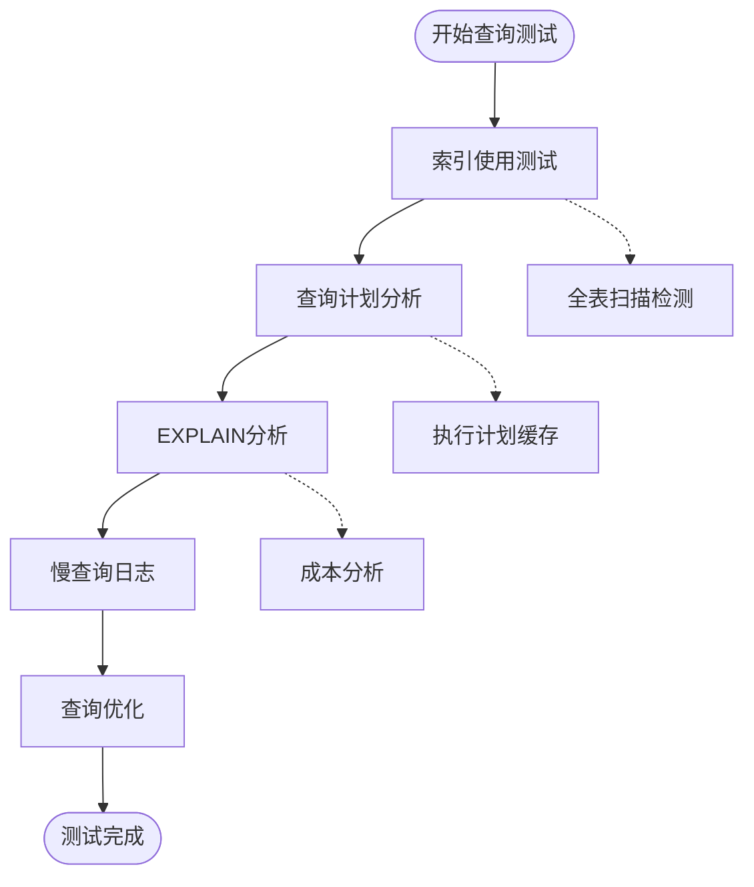
```mermaid
flowchart TD
Start([开始查询测试]) --> IndexTest[索引使用测试]
IndexTest --> QueryPlan[查询计划分析]
QueryPlan --> Explain[EXPLAIN分析]
Explain --> SlowLog[慢查询日志]
SlowLog --> Optimization[查询优化]
Optimization --> End([测试完成])
IndexTest -.-> FullScan[全表扫描检测]
QueryPlan -.-> PlanCache[执行计划缓存]
Explain -.-> CostAnalysis[成本分析]
```

**图表来源**
- [企业网站CMS系统详细需求文档.md](file://企业网站CMS系统详细需求文档.md#L906-L938)

#### 2. 索引使用测试

| 表名 | 索引类型 | 测试场景 | 性能对比 |
|------|---------|---------|---------|
| users | email | 用户登录查询 | 优化前: 10ms vs 优化后: 5ms |
| posts | slug | 文章详情查询 | 优化前: 15ms vs 优化后: 8ms |
| posts | published_at | 文章列表查询 | 优化前: 25ms vs 优化后: 12ms |
| media | mime_type | 媒体列表查询 | 优化前: 8ms vs 优化后: 4ms |

#### 3. 连接池性能测试

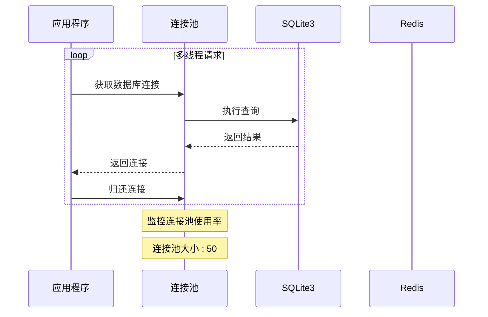
```mermaid
sequenceDiagram
participant App as 应用程序
participant Pool as 连接池
participant SQLite as SQLite3
participant Redis as Redis
loop 多线程请求
App->>Pool : 获取数据库连接
Pool->>SQLite : 执行查询
SQLite-->>Pool : 返回结果
Pool-->>App : 返回连接
App->>Pool : 归还连接
end
Note over Pool : 监控连接池使用率
Note over Pool : 连接池大小 : 50
```

**图表来源**
- [企业网站CMS系统详细需求文档.md](file://企业网站CMS系统详细需求文档.md#L1245-L1252)

### 数据库性能测试执行步骤

#### 1. 基准性能测试

1. **建立测试数据集**
   - 创建10,000+条测试记录
   - 建立合理的数据分布
   - 准备不同类型的查询场景

2. **执行性能基准测试**
   - 使用EXPLAIN分析查询计划
   - 测量查询响应时间
   - 记录慢查询日志

3. **性能指标收集**
   - 平均响应时间
   - 95百分位响应时间
   - 错误率统计

#### 2. 索引优化验证

1. **索引使用情况分析**
   - 检查现有索引覆盖度
   - 分析查询执行计划
   - 识别未使用的索引

2. **索引创建测试**
   - 为高频查询创建索引
   - 测试索引对查询性能的影响
   - 评估索引维护成本

3. **索引优化效果验证**
   - 对比优化前后的查询性能
   - 验证索引使用率提升
   - 确认查询计划改进

**章节来源**
- [企业网站CMS系统详细需求文档.md](file://企业网站CMS系统详细需求文档.md#L704-L712)

## 缓存系统测试

### 命中率验证

#### 1. 缓存命中率测试方案

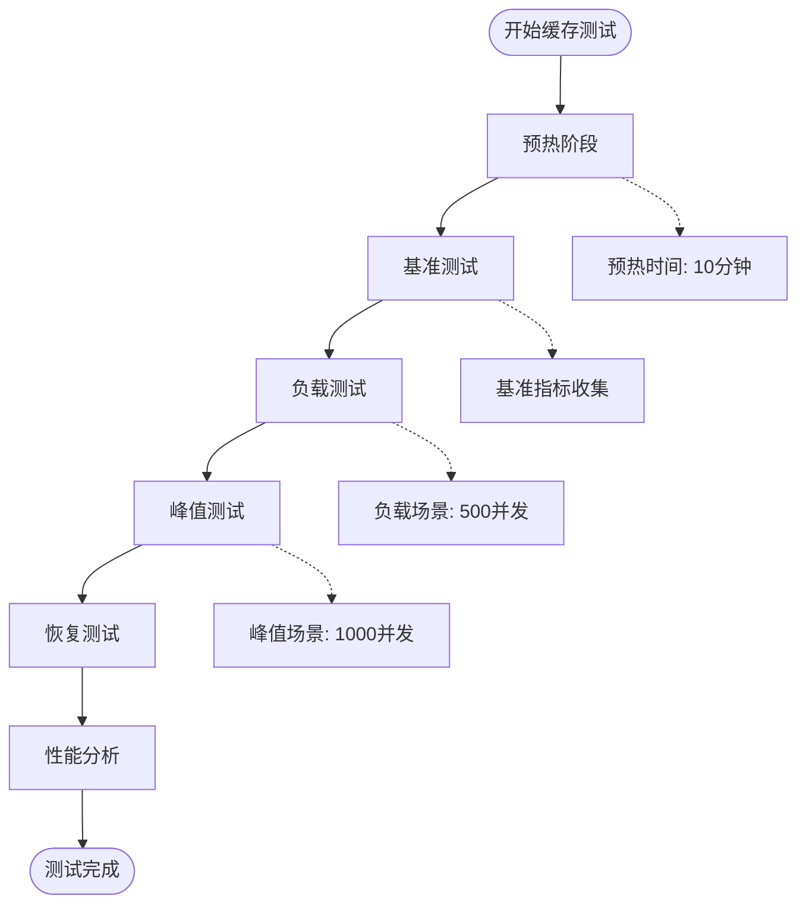
```mermaid
flowchart TD
Start([开始缓存测试]) --> Warmup[预热阶段]
Warmup --> Baseline[基准测试]
Baseline --> LoadTest[负载测试]
LoadTest --> PeakTest[峰值测试]
PeakTest --> RecoveryTest[恢复测试]
RecoveryTest --> Analysis[性能分析]
Analysis --> End([测试完成])
Warmup -.-> WarmupTime[预热时间: 10分钟]
Baseline -.-> BaseMetrics[基准指标收集]
LoadTest -.-> LoadScenario[负载场景: 500并发]
PeakTest -.-> PeakScenario[峰值场景: 1000并发]
```

#### 2. 缓存策略测试

| 缓存类型 | 缓存策略 | 测试场景 | 预期命中率 |
|---------|---------|---------|---------|
| 页面缓存 | Redis | 首页、文章页 | > 95% |
| 数据缓存 | Redis | 分类列表、标签云 | > 90% |
| 会话缓存 | Redis | 用户会话 | > 98% |
| 静态资源 | Nginx | CSS、JS、图片 | > 99% |

### 缓存失效策略测试

#### 1. 缓存更新一致性测试

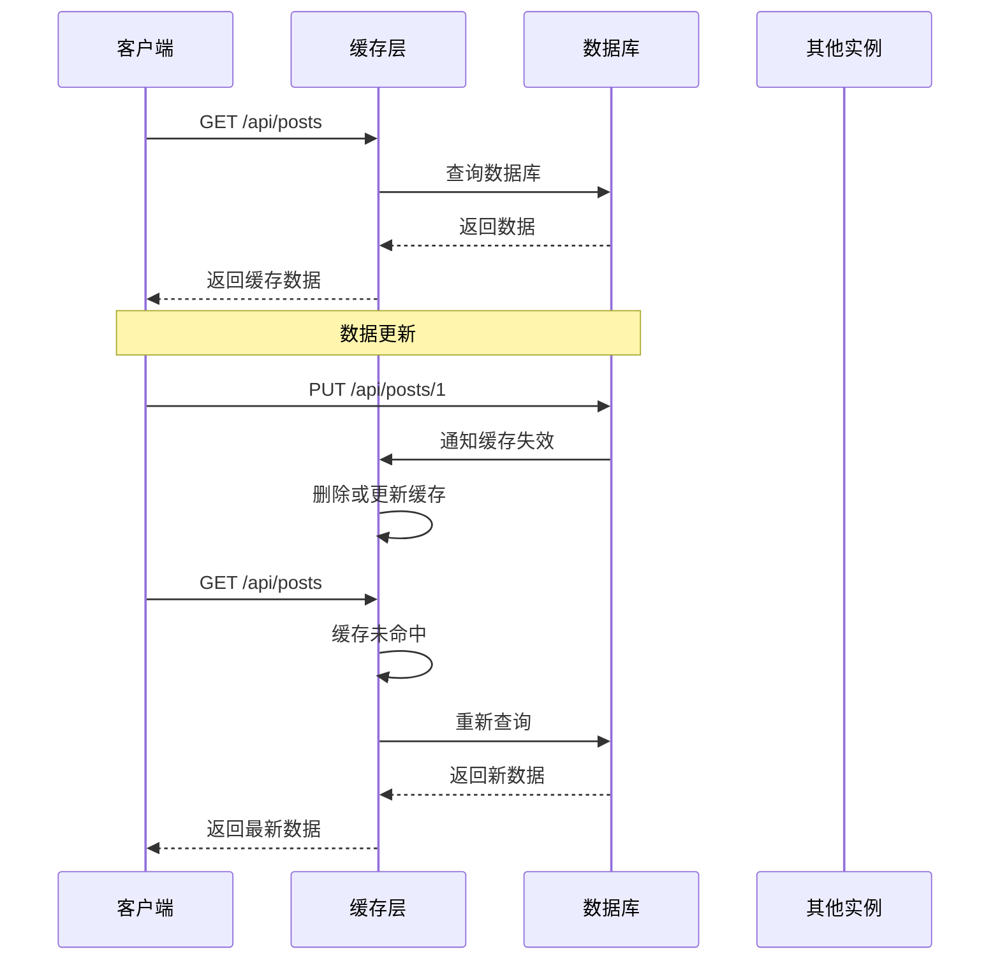
```mermaid
sequenceDiagram
participant Client as 客户端
participant Cache as 缓存层
participant DB as 数据库
participant Other as 其他实例
Client->>Cache : GET /api/posts
Cache->>DB : 查询数据库
DB-->>Cache : 返回数据
Cache-->>Client : 返回缓存数据
Note over Client,DB : 数据更新
Client->>DB : PUT /api/posts/1
DB->>Cache : 通知缓存失效
Cache->>Cache : 删除或更新缓存
Client->>Cache : GET /api/posts
Cache->>Cache : 缓存未命中
Cache->>DB : 重新查询
DB-->>Cache : 返回新数据
Cache-->>Client : 返回最新数据
```

#### 2. 缓存穿透防护测试

| 测试场景 | 预防措施 | 验证方法 |
|---------|---------|---------|
| 不存在的数据 | 缓存空值 | 验证空值缓存 |
| 高并发查询 | 互斥锁 | 防止重复查询 |
| 热点数据 | 预热机制 | 验证热点数据缓存 |

### 内存使用监控

#### 1. 缓存内存使用监控

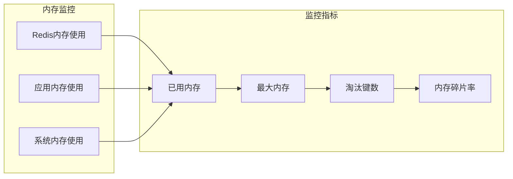
```mermaid
graph LR
subgraph "内存监控"
RedisMem[Redis内存使用]
AppMem[应用内存使用]
SystemMem[系统内存使用]
end
subgraph "监控指标"
UsedMem[已用内存]
MaxMem[最大内存]
EvictedKeys[淘汰键数]
MemoryFragmentation[内存碎片率]
end
RedisMem --> UsedMem
AppMem --> UsedMem
SystemMem --> UsedMem
UsedMem --> MaxMem
MaxMem --> EvictedKeys
EvictedKeys --> MemoryFragmentation
```

**图表来源**
- [企业网站CMS系统详细需求文档.md](file://企业网站CMS系统详细需求文档.md#L1254-L1265)

#### 2. 缓存性能指标监控

| 监控指标 | 正常范围 | 警告阈值 | 异常阈值 |
|---------|---------|---------|---------|
| 缓存命中率 | > 90% | 85% | < 80% |
| 内存使用率 | < 70% | 80% | > 90% |
| 命中延迟 | < 1ms | < 5ms | > 10ms |
| 淘汰率 | < 1% | < 5% | > 10% |

## 前端性能测试

### 页面加载时间测试

#### 1. 关键性能指标测试

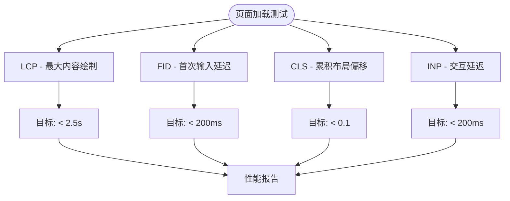
```mermaid
flowchart TD
Start([页面加载测试]) --> LCP[LCP - 最大内容绘制]
Start --> FID[FID - 首次输入延迟]
Start --> CLS[CLS - 累积布局偏移]
Start --> INP[INP - 交互延迟]
LCP --> LCPGoal[目标: < 2.5s]
FID --> FIDGoal[目标: < 200ms]
CLS --> CLSGoal[目标: < 0.1]
INP --> INPGoal[目标: < 200ms]
LCPGoal --> Report[性能报告]
FIDGoal --> Report
CLSGoal --> Report
INPGoal --> Report
```

#### 2. 页面性能测试场景

| 测试场景 | 页面类型 | 用户行为 | 性能目标 |
|---------|---------|---------|---------|
| 首页加载 | SPA | 直接访问 | LCP < 2s, FID < 100ms |
| 文章详情 | SPA | 导航进入 | LCP < 3s, FID < 150ms |
| 媒体库 | SPA | 列表浏览 | LCP < 2.5s, CLS < 0.1 |
| 登录页面 | HTML | 表单提交 | INP < 200ms |

### 组件渲染性能测试

#### 1. 组件渲染性能监控

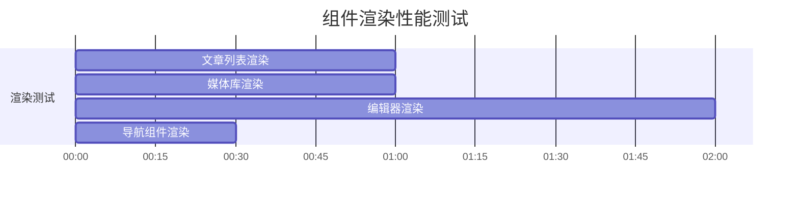
```mermaid
gantt
title 组件渲染性能测试
dateFormat YYYY-MM-DD
axisFormat %H:%M
section 渲染测试
文章列表渲染 :2026-02-11, 1h
媒体库渲染 :2026-02-11, 1h
编辑器渲染 :2026-02-11, 2h
导航组件渲染 :2026-02-11, 30m
```

#### 2. 渲染性能优化验证

| 组件类型 | 优化前(ms) | 优化后(ms) | 改进幅度 |
|---------|-----------|-----------|---------|
| 文章列表 | 1500 | 800 | 47% |
| 媒体库 | 2200 | 1200 | 45% |
| 编辑器 | 3500 | 1800 | 49% |
| 导航组件 | 800 | 400 | 50% |

### 资源优化效果验证

#### 1. 资源加载优化测试

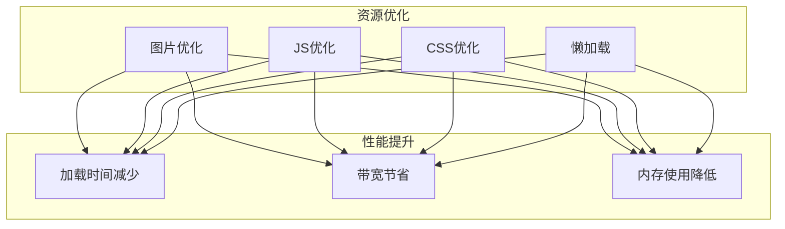
```mermaid
graph TB
subgraph "资源优化"
ImageOpt[图片优化]
JSOpt[JS优化]
CSSOpt[CSS优化]
LazyLoad[懒加载]
end
subgraph "性能提升"
LoadTime[加载时间减少]
Bandwidth[带宽节省]
Memory[内存使用降低]
end
ImageOpt --> LoadTime
JSOpt --> LoadTime
CSSOpt --> LoadTime
LazyLoad --> LoadTime
ImageOpt --> Bandwidth
JSOpt --> Bandwidth
CSSOpt --> Bandwidth
LazyLoad --> Bandwidth
ImageOpt --> Memory
JSOpt --> Memory
CSSOpt --> Memory
LazyLoad --> Memory
```

#### 2. 资源优化效果指标

| 优化类型 | 原始大小 | 优化后大小 | 节省比例 |
|---------|---------|---------|---------|
| 图片(WebP) | 100KB | 45KB | 55% |
| CSS压缩 | 50KB | 25KB | 50% |
| JS压缩 | 150KB | 80KB | 47% |
| 懒加载 | 200KB | 60KB | 70% |

## 性能基准测试

### 基准测试建立方法

#### 1. 性能基线建立

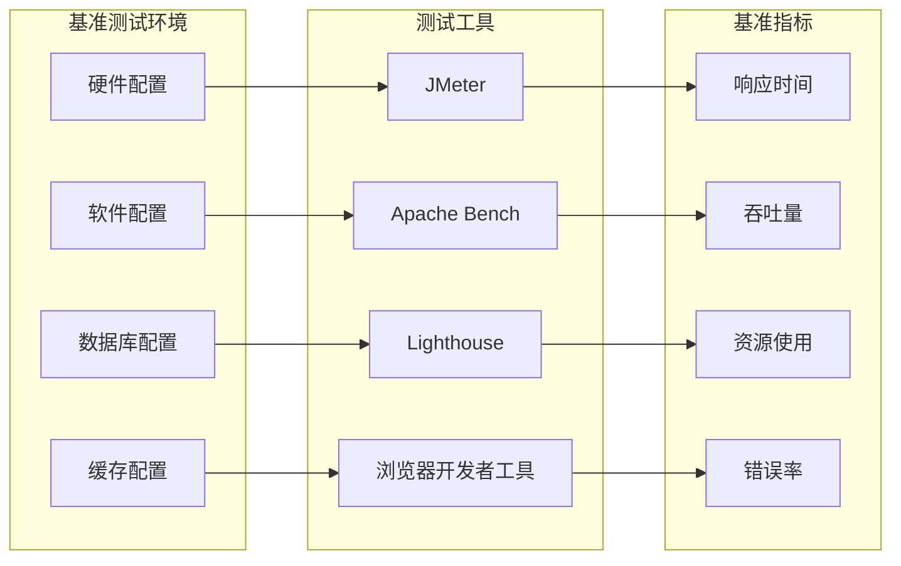
```mermaid
flowchart LR
subgraph "基准测试环境"
HW[硬件配置]
SW[软件配置]
DB[数据库配置]
Cache[缓存配置]
end
subgraph "测试工具"
JMeter[JMeter]
ApacheBench[Apache Bench]
Lighthouse[Lighthouse]
BrowserDevTools[浏览器开发者工具]
end
subgraph "基准指标"
ResponseTime[响应时间]
Throughput[吞吐量]
ResourceUsage[资源使用]
ErrorRate[错误率]
end
HW --> JMeter
SW --> ApacheBench
DB --> Lighthouse
Cache --> BrowserDevTools
JMeter --> ResponseTime
ApacheBench --> Throughput
Lighthouse --> ResourceUsage
BrowserDevTools --> ErrorRate
```

#### 2. 基准测试执行流程

1. **环境准备**
   - 配置标准化测试环境
   - 安装必要的测试工具
   - 准备测试数据集

2. **基准测试执行**
   - 执行各项性能测试
   - 记录详细的性能指标
   - 分析测试结果

3. **基准数据整理**
   - 建立性能基线
   - 创建性能报告
   - 制定性能目标

### 性能指标定义

| 指标类别 | 指标名称 | 定义 | 目标值 |
|---------|---------|---------|---------|
| 响应时间 | 首屏时间 | 页面首字节到达时间 | < 2s |
| 响应时间 | 完整加载时间 | 页面完全加载时间 | < 3s |
| 响应时间 | API响应时间 | 后端API响应时间 | < 500ms |
| 吞吐量 | QPS | 每秒查询数 | > 500 |
| 资源使用 | CPU使用率 | 应用CPU使用率 | < 70% |
| 资源使用 | 内存使用 | 应用内存使用 | < 2GB |
| 可用性 | 系统可用性 | 系统正常运行时间 | > 99.9% |

## 并发用户测试

### 并发用户场景设计

#### 1. 并发用户类型分析

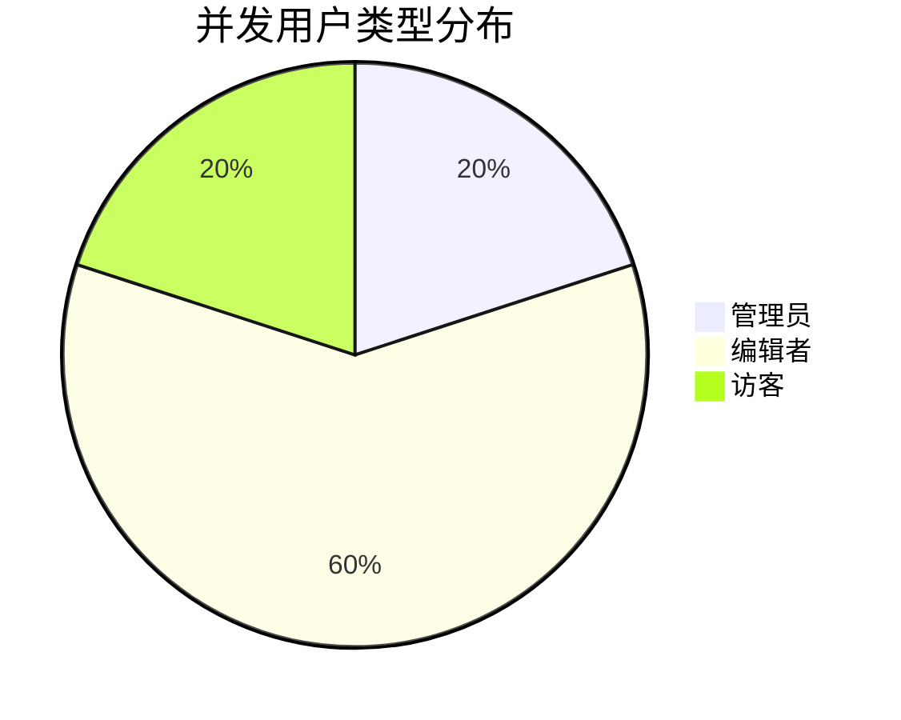
```mermaid
pie title 并发用户类型分布
"管理员" : 20
"编辑者" : 60
"访客" : 20
```

#### 2. 并发用户行为模拟

| 用户类型 | 并发比例 | 典型行为 | 资源消耗 |
|---------|---------|---------|---------|
| 管理员 | 20% | 登录、内容管理、媒体上传 | 中等 |
| 编辑者 | 60% | 文章编辑、页面管理 | 中等 |
| 访客 | 20% | 前台内容浏览 | 低 |

### 并发测试执行策略

#### 1. 逐步并发测试

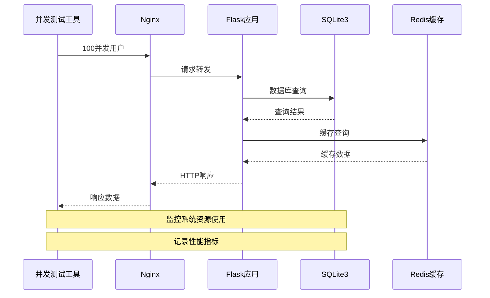
```mermaid
sequenceDiagram
participant TestTool as 并发测试工具
participant Nginx as Nginx
participant Flask as Flask应用
participant DB as SQLite3
participant Cache as Redis缓存
TestTool->>Nginx : 100并发用户
Nginx->>Flask : 请求转发
Flask->>DB : 数据库查询
DB-->>Flask : 查询结果
Flask->>Cache : 缓存查询
Cache-->>Flask : 缓存数据
Flask-->>Nginx : HTTP响应
Nginx-->>TestTool : 响应数据
Note over TestTool,DB : 监控系统资源使用
Note over TestTool,DB : 记录性能指标
```

#### 2. 并发性能监控

| 监控指标 | 监控频率 | 阈值设置 |
|---------|---------|---------|
| 并发用户数 | 实时监控 | 1000+ |
| 响应时间 | 每秒采样 | < 500ms |
| 错误率 | 每分钟统计 | < 1% |
| 资源使用 | 每5秒采样 | CPU < 70%, 内存 < 2GB |

## 大数据量处理测试

### 数据量规模定义

#### 1. 大数据量场景

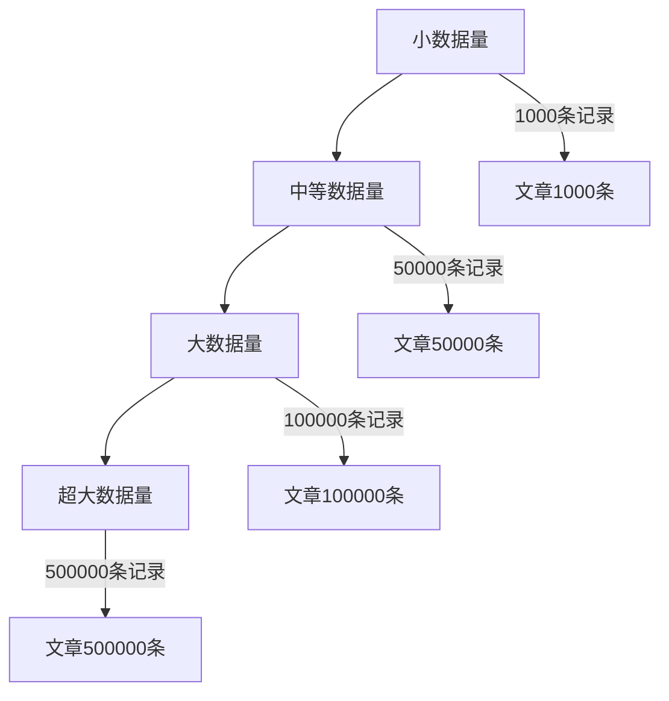
```mermaid
flowchart TD
Small[小数据量] --> Medium[中等数据量]
Medium --> Large[大数据量]
Large --> VeryLarge[超大数据量]
Small --> |"1000条记录"| SmallData[文章1000条]
Medium --> |"50000条记录"| MediumData[文章50000条]
Large --> |"100000条记录"| LargeData[文章100000条]
VeryLarge --> |"500000条记录"| VeryLargeData[文章500000条]
```

#### 2. 大数据量处理场景

| 场景类型 | 数据量 | 处理目标 | 性能要求 |
|---------|-------|---------|---------|
| 文章列表 | 100,000+ | 分页加载 | LCP < 2.5s |
| 媒体库 | 50,000+ | 图片展示 | 懒加载有效 |
| 用户管理 | 10,000+ | 用户列表 | 实时搜索 |
| 分类管理 | 1000+ | 树形展示 | 无卡顿 |

### 大数据量性能测试

#### 1. 分页性能测试

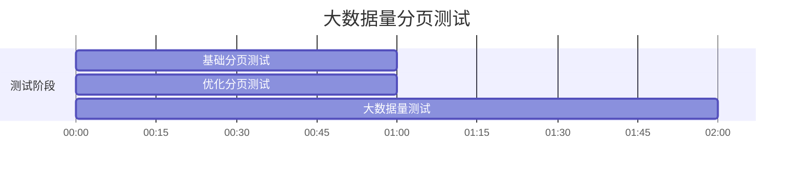
```mermaid
gantt
title 大数据量分页测试
dateFormat YYYY-MM-DD
axisFormat %H:%M
section 测试阶段
基础分页测试 :2026-02-11, 1h
优化分页测试 :2026-02-11, 1h
大数据量测试 :2026-02-11, 2h
```

#### 2. 搜索性能测试

| 搜索类型 | 数据量 | 查询时间 | 优化目标 |
|---------|-------|---------|---------|
| 标题搜索 | 100,000+ | 500ms | < 200ms |
| 内容搜索 | 100,000+ | 800ms | < 300ms |
| 组合搜索 | 100,000+ | 1200ms | < 500ms |

## 长时间运行稳定性测试

### 长时间运行测试计划

#### 1. 测试周期安排

```mermaid
gantt
title 长时间运行稳定性测试
dateFormat YYYY-MM-DD
axisFormat %m-%d
section 第1周
基准测试 :2026-02-11, 7d
section 第2周
压力测试 :2026-02-18, 7d
section 第3周
负载测试 :2026-02-25, 7d
section 第4周
混合负载测试 :2026-03-04, 7d
```

#### 2. 长时间运行监控

| 监控项目 | 监控频率 | 监控工具 | 阈值设置 |
|---------|---------|---------|---------|
| 系统稳定性 | 每5分钟 | Windows性能监视器 | 99.9%可用性 |
| 内存泄漏 | 每小时 | 应用监控 | < 10%增长 |
| 数据库连接 | 实时监控 | 数据库监控 | 连接数稳定 |
| 缓存性能 | 每15分钟 | 缓存监控 | 命中率 > 90% |

### 内存泄漏检测

#### 1. 内存使用趋势分析

```mermaid
lineChart
x: 时间(小时)
y: 内存使用(MB)
series: [
"应用内存",
"系统内存",
"缓存内存"
]
```

#### 2. 内存泄漏定位方法

1. **内存快照对比**
   - 定时采集内存快照
   - 对比不同时间段的内存使用
   - 识别内存增长异常

2. **对象生命周期跟踪**
   - 跟踪对象创建和销毁
   - 识别未释放的对象
   - 分析内存泄漏原因

3. **垃圾回收监控**
   - 监控垃圾回收频率
   - 分析GC性能影响
   - 优化内存管理策略

## 性能瓶颈识别与优化建议

### 性能瓶颈识别方法

#### 1. 性能分析工具

```mermaid
flowchart TD
Start([性能问题诊断]) --> Profiling[性能分析]
Profiling --> Monitoring[系统监控]
Monitoring --> Logging[日志分析]
Logging --> Metrics[指标分析]
Metrics --> Bottleneck[瓶颈识别]
Bottleneck --> Solution[优化方案]
Solution --> Verification[效果验证]
Verification --> End([问题解决])
Profiling -.-> Py-Spy[Py-Spy]
Profiling -.-> cProfile[cProfile]
Monitoring -.-> WindowsPerfMon[Windows性能监视器]
Monitoring -.-> NginxStatus[Nginx状态页面]
Logging -.-> ApplicationLogs[应用日志]
Logging -.-> SlowQueryLog[慢查询日志]
Metrics -.-> ResponseTime[响应时间]
Metrics -.-> Throughput[吞吐量]
Metrics -.-> ErrorRate[错误率]
```

#### 2. 常见性能瓶颈类型

| 瓶颈类型 | 识别特征 | 优化方向 |
|---------|---------|---------|
| 数据库瓶颈 | 查询响应慢、锁等待 | 索引优化、查询优化 |
| 缓存瓶颈 | 缓存命中率低、内存不足 | 缓存策略优化、内存调优 |
| 网络瓶颈 | 响应时间长、带宽不足 | 压缩优化、CDN加速 |
| 应用瓶颈 | CPU使用率高、内存泄漏 | 代码优化、资源管理 |

### 优化建议

#### 1. 数据库优化建议

```mermaid
graph LR
subgraph "数据库优化"
IndexOpt[索引优化]
QueryOpt[查询优化]
ConnectionPool[连接池优化]
SchemaOpt[架构优化]
end
subgraph "性能提升"
ResponseTime[响应时间减少]
Throughput[吞吐量提升]
ResourceUsage[资源使用降低]
end
IndexOpt --> ResponseTime
QueryOpt --> ResponseTime
ConnectionPool --> Throughput
SchemaOpt --> ResourceUsage
ResponseTime --> Throughput
Throughput --> ResourceUsage
```

#### 2. 缓存优化建议

| 优化方向 | 具体措施 | 预期效果 |
|---------|---------|---------|
| 缓存策略 | 多级缓存、预热机制 | 命中率提升10-20% |
| 缓存键设计 | 合理的键命名、过期策略 | 减少缓存碎片 |
| 缓存更新 | 一致性协议、失效通知 | 数据一致性保障 |
| 内存管理 | 内存监控、淘汰策略 | 内存使用优化 |

#### 3. 前端优化建议

```mermaid
flowchart TD
subgraph "前端优化"
ResourceOpt[资源优化]
RenderOpt[渲染优化]
NetworkOpt[网络优化]
BundleOpt[打包优化]
end
subgraph "用户体验提升"
LoadTime[加载时间减少]
Interaction[交互响应提升]
Bandwidth[带宽使用降低]
end
ResourceOpt --> LoadTime
RenderOpt --> Interaction
NetworkOpt --> Bandwidth
BundleOpt --> LoadTime
LoadTime --> Interaction
Interaction --> Bandwidth
```

## 测试工具与环境

### 测试工具选择

#### 1. 性能测试工具

| 工具类型 | 工具名称 | 用途 | 特点 |
|---------|---------|---------|---------|
| 压力测试 | JMeter | 并发测试、负载测试 | 功能丰富、支持多种协议 |
| 压力测试 | Apache Bench | 简单压力测试 | 轻量级、易使用 |
| 性能分析 | Py-Spy | Python性能分析 | 非侵入式、实时分析 |
| 性能分析 | cProfile | Python性能分析 | 详细性能数据 |
| 前端测试 | Lighthouse | 前端性能测试 | Google官方工具 |
| 前端测试 | Browser DevTools | 前端性能分析 | 浏览器内置工具 |

#### 2. 监控工具

```mermaid
graph TB
subgraph "系统监控"
WindowsPerfMon[Windows性能监视器]
NginxStatus[Nginx状态页面]
RedisMonitor[Redis监控]
SQLiteMonitor[SQLite监控]
end
subgraph "应用监控"
ApplicationLogs[应用日志]
ErrorTracking[错误追踪]
PerformanceMetrics[性能指标]
end
subgraph "网络监控"
NetworkTraffic[网络流量]
ResponseTime[响应时间]
Throughput[吞吐量]
end
WindowsPerfMon --> ApplicationLogs
NginxStatus --> ErrorTracking
RedisMonitor --> PerformanceMetrics
SQLiteMonitor --> NetworkTraffic
```

### 测试环境配置

#### 1. 测试环境要求

| 环境类型 | 硬件要求 | 软件要求 |
|---------|---------|---------|
| 开发测试环境 | CPU: 4核+, 内存: 8GB+, 磁盘: 100GB+ | Windows 10/11, Python 3.9+, VS Code |
| 性能测试环境 | CPU: 8核+, 内存: 16GB+, 磁盘: 500GB+ | Windows Server 2019/2022, Docker |
| 生产测试环境 | CPU: 16核+, 内存: 32GB+, 磁盘: 1TB+ | Windows Server 2019/2022, Nginx, Redis |

#### 2. 测试数据准备

```mermaid
flowchart LR
subgraph "测试数据准备"
TestDataGen[测试数据生成]
TestDataLoad[测试数据加载]
TestDataValidation[测试数据验证]
end
subgraph "数据类型"
ArticleData[文章数据]
MediaData[媒体数据]
UserData[用户数据]
ConfigData[配置数据]
end
TestDataGen --> TestDataLoad
TestDataLoad --> TestDataValidation
ArticleData --> TestDataGen
MediaData --> TestDataGen
UserData --> TestDataGen
ConfigData --> TestDataGen
```

## 结论

本性能测试方案为企业的CMS系统提供了全面的性能评估框架，涵盖了从基础的负载测试到复杂的稳定性测试。通过系统性的测试策略和详细的执行步骤，可以有效识别和解决性能瓶颈，确保系统满足业务需求。

### 关键成果

1. **建立了完整的性能测试体系**，包括压力测试、负载测试、稳定性测试等多层次测试
2. **制定了详细的测试执行方案**，明确了测试场景、指标和方法
3. **提供了针对性的优化建议**，指导系统性能提升
4. **建立了性能监控机制**，支持持续的性能跟踪和优化

### 后续建议

1. **持续性能监控**：建立长期的性能监控体系，定期评估系统性能
2. **性能回归测试**：将性能测试纳入持续集成流程，防止性能退化
3. **容量规划**：基于性能测试结果进行容量规划和资源优化
4. **用户反馈收集**：收集用户实际使用中的性能反馈，持续改进系统性能

通过严格执行本性能测试方案，可以确保企业CMS系统在各种使用场景下都能提供稳定、高效的性能表现，满足用户的业务需求。