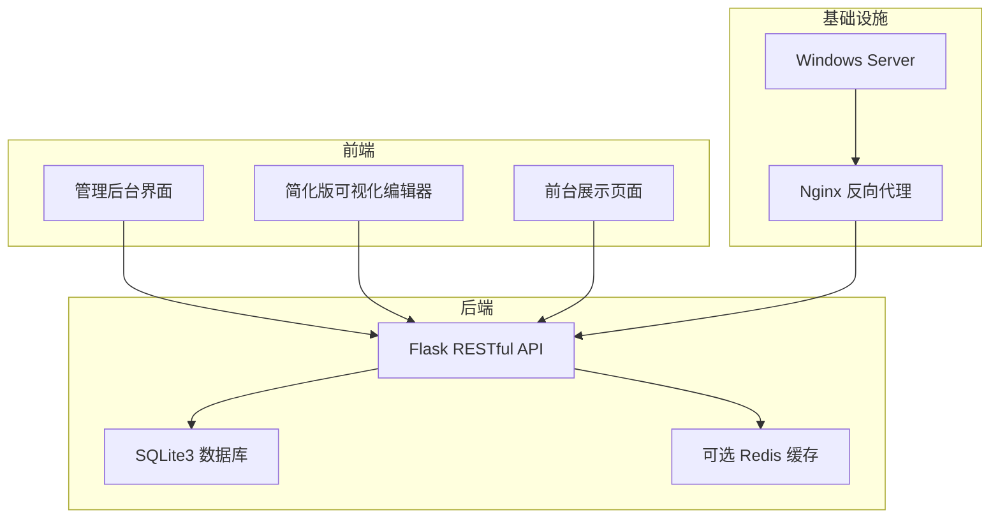
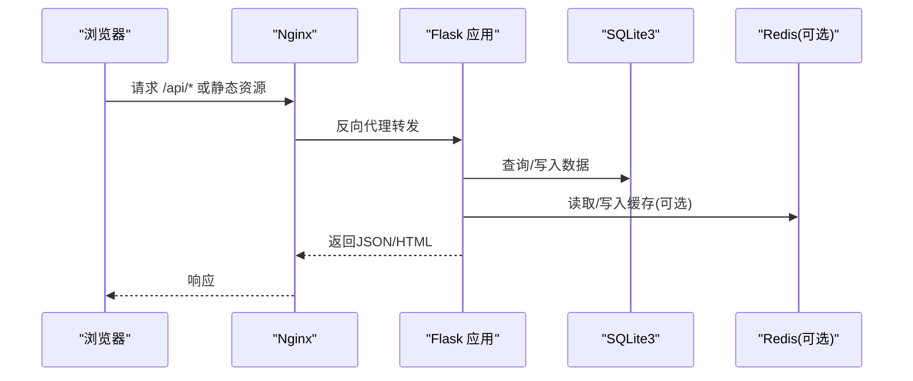
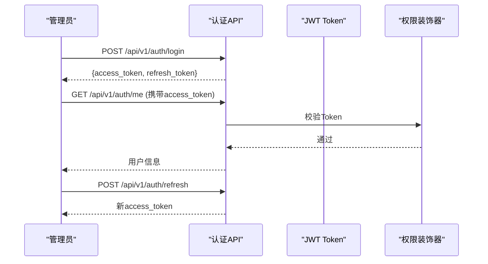
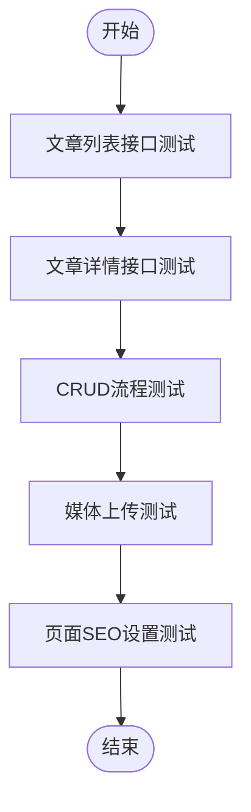
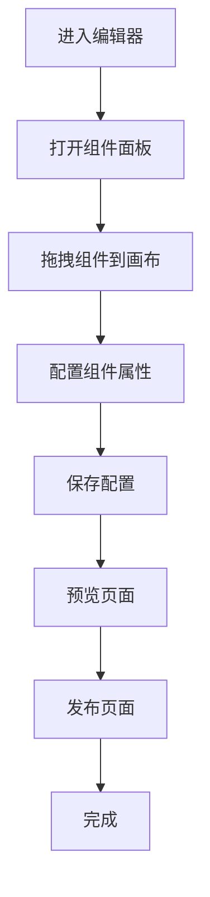
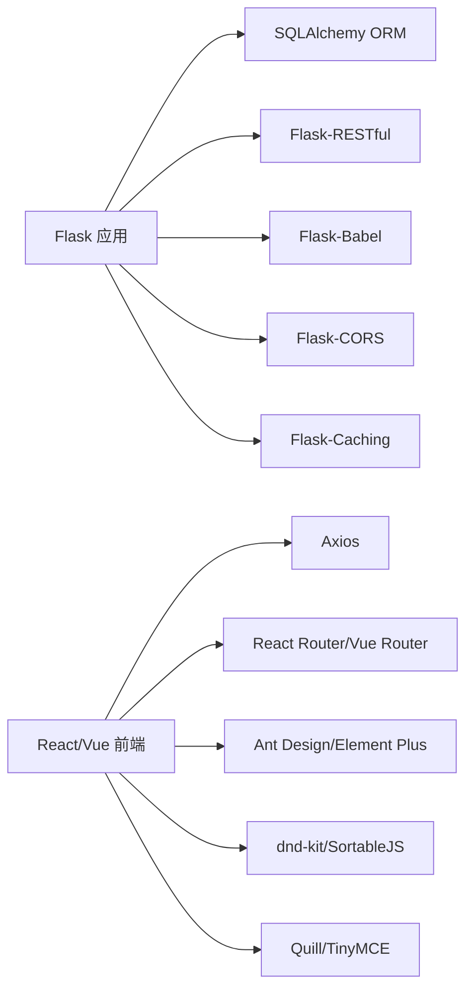

# 测试与验收

<cite>
**本文档引用的文件**
- [企业网站CMS系统开发需求文档.ini](file://企业网站CMS系统开发需求文档.ini)
- [企业网站CMS系统详细需求文档.md](file://企业网站CMS系统详细需求文档.md)
- [开发计划表_2月4日-2月12日.md](file://开发计划表_2月4日-2月12日.md)
</cite>

## 目录
1. [引言](#引言)
2. [项目结构](#项目结构)
3. [核心组件](#核心组件)
4. [架构总览](#架构总览)
5. [详细组件分析](#详细组件分析)
6. [依赖关系分析](#依赖关系分析)
7. [性能考量](#性能考量)
8. [故障排除指南](#故障排除指南)
9. [结论](#结论)
10. [附录](#附录)

## 引言
本测试与验收文档面向“企业网站CMS系统”，旨在提供系统化的测试策略、测试方法与验收标准，覆盖功能测试、性能测试、安全测试以及用户验收测试全流程。文档结合项目需求与开发计划，给出可操作的测试方案、工具使用指南、缺陷管理与回归测试建议，并明确验收标准与项目移交程序，确保系统在交付前达到预期的质量与稳定性目标。

## 项目结构
系统采用前后端分离架构，后端基于Python Flask + SQLite3，前端采用React/Vue（可选），通过Nginx反向代理提供服务。开发周期短、采用MVP策略，重点验证核心功能与基础性能表现。

**图表来源**
- [企业网站CMS系统详细需求文档.md](file://企业网站CMS系统详细需求文档.md#L22-L57)
- [开发计划表_2月4日-2月12日.md](file://开发计划表_2月4日-2月12日.md#L441-L506)

**章节来源**
- [企业网站CMS系统详细需求文档.md](file://企业网站CMS系统详细需求文档.md#L22-L57)
- [开发计划表_2月4日-2月12日.md](file://开发计划表_2月4日-2月12日.md#L58-L134)

## 核心组件
- 用户认证与权限管理：基于JWT的身份认证、RBAC权限控制、用户/角色/权限表结构。
- 内容管理：文章管理（CRUD）、页面管理（可视化编辑器）、媒体库（上传、缩略图、信息编辑）。
- 系统配置：网站基本信息、SEO配置、URL规则、邮件配置、安全设置、性能配置、备份管理。
- 前台展示：首页模板、文章列表页、文章详情页、单页渲染，具备基础SEO与响应式适配。
- 可视化编辑器（MVP）：简化版拖拽编辑器，支持基础组件（文本、图片、容器、按钮、表单）的添加、删除与样式配置。

**章节来源**
- [企业网站CMS系统详细需求文档.md](file://企业网站CMS系统详细需求文档.md#L235-L446)
- [开发计划表_2月4日-2月12日.md](file://开发计划表_2月4日-2月12日.md#L367-L412)

## 架构总览
系统采用轻量级架构，后端使用Flask + SQLite3，前端采用React/Vue或纯HTML模板渲染，通过Nginx提供静态资源服务与反向代理。部署于Windows Server，使用Waitress作为WSGI服务器，或通过NSSM注册为Windows服务。

**图表来源**
- [企业网站CMS系统详细需求文档.md](file://企业网站CMS系统详细需求文档.md#L44-L56)
- [开发计划表_2月4日-2月12日.md](file://开发计划表_2月4日-2月12日.md#L441-L506)

## 详细组件分析

### 用户认证与权限测试
- 测试目标：验证JWT登录/登出、Token刷新、权限拦截、角色访问控制。
- 测试方法：
  - 接口测试：使用Postman或pytest测试登录、刷新、登出接口。
  - 权限测试：模拟不同角色访问受保护接口，验证返回状态与数据。
  - 安全测试：验证Token过期、伪造Token、越权访问等场景。
- 自动化测试：pytest + requests，按角色构造测试用例集。

**图表来源**
- [开发计划表_2月4日-2月12日.md](file://开发计划表_2月4日-2月12日.md#L150-L157)
- [开发计划表_2月4日-2月12日.md](file://开发计划表_2月4日-2月12日.md#L142-L148)

**章节来源**
- [开发计划表_2月4日-2月12日.md](file://开发计划表_2月4日-2月12日.md#L137-L189)
- [企业网站CMS系统详细需求文档.md](file://企业网站CMS系统详细需求文档.md#L235-L293)

### 内容管理测试
- 文章管理：验证列表分页/筛选、详情获取、创建/更新/删除流程；测试定时发布、置顶、允许评论等字段。
- 页面管理：验证页面树形结构、拖拽排序、状态管理（草稿/发布/私密）、页面SEO设置。
- 媒体库：验证文件上传（格式/大小限制）、缩略图生成、列表/详情/更新/删除、批量操作。
- 测试方法：接口测试 + UI端到端测试（必要时），覆盖异常场景（空数据、非法参数、权限不足）。

**图表来源**
- [开发计划表_2月4日-2月12日.md](file://开发计划表_2月4日-2月12日.md#L160-L174)
- [开发计划表_2月4日-2月12日.md](file://开发计划表_2月4日-2月12日.md#L197-L212)
- [开发计划表_2月4日-2月12日.md](file://开发计划表_2月4日-2月12日.md#L221-L225)

**章节来源**
- [开发计划表_2月4日-2月12日.md](file://开发计划表_2月4日-2月12日.md#L192-L239)
- [企业网站CMS系统详细需求文档.md](file://企业网站CMS系统详细需求文档.md#L294-L387)

### 可视化编辑器测试（MVP）
- 测试目标：验证简化版拖拽编辑器的基础功能，包括组件面板、画布区域、属性面板、基础拖拽、组件添加/删除、样式配置、配置保存。
- 测试方法：手动测试编辑器交互，验证组件渲染与JSON配置保存；必要时进行端到端测试。
- 验收标准：编辑器可用、组件可拖拽、配置可保存、前台页面可正确渲染。

**图表来源**
- [开发计划表_2月4日-2月12日.md](file://开发计划表_2月4日-2月12日.md#L372-L389)

**章节来源**
- [开发计划表_2月4日-2月12日.md](file://开发计划表_2月4日-2月12日.md#L367-L412)

### 前台展示测试
- 测试目标：验证首页、文章列表页、文章详情页、单页的渲染与SEO标签输出，确保响应式适配与基础性能。
- 测试方法：浏览器测试（Chrome/Firefox/Edge）、移动端响应式测试、静态资源加载测试。
- 验收标准：页面可正常访问、Meta标签正确、导航正常、图片加载正常、移动端适配。

**章节来源**
- [开发计划表_2月4日-2月12日.md](file://开发计划表_2月4日-2月12日.md#L396-L408)
- [企业网站CMS系统详细需求文档.md](file://企业网站CMS系统详细需求文档.md#L482-L511)

## 依赖关系分析
- 后端依赖：Flask生态（SQLAlchemy、RESTful、CORS、Babel等），SQLite3数据库，可选Redis缓存。
- 前端依赖：React/Vue（可选）+ UI库 + 拖拽库 + 富文本编辑器 + HTTP客户端。
- 部署依赖：Nginx、Windows Server、Waitress/NSSM、环境变量与静态资源路径。

**图表来源**
- [企业网站CMS系统详细需求文档.md](file://企业网站CMS系统详细需求文档.md#L555-L622)

**章节来源**
- [企业网站CMS系统详细需求文档.md](file://企业网站CMS系统详细需求文档.md#L555-L622)

## 性能考量
- 性能目标（来自需求文档）：页面加载时间 < 3秒，支持并发用户 > 1000，数据库查询响应 < 100ms。
- MVP阶段性能关注点：SQLite读取性能、静态资源压缩、Nginx缓存与Gzip压缩、图片懒加载与响应式图片。
- 测试方案：
  - 压力测试：使用Locust或JMeter模拟并发用户，观察API响应时间与页面加载时间。
  - 负载测试：逐步增加并发用户数，记录吞吐量、错误率与响应时间曲线。
  - 前端性能：使用浏览器开发者工具分析首屏渲染、关键资源加载、内存占用。
- 优化建议：启用Redis缓存、CDN加速、关键CSS内联、异步加载非关键资源。

**章节来源**
- [企业网站CMS系统开发需求文档.ini](file://企业网站CMS系统开发需求文档.ini#L100-L104)
- [企业网站CMS系统详细需求文档.md](file://企业网站CMS系统详细需求文档.md#L512-L548)

## 故障排除指南
- 常见问题与定位：
  - 登录失败：检查JWT生成/校验逻辑、数据库连接、请求头Authorization格式。
  - 媒体上传失败：检查文件类型/大小限制、存储路径权限、缩略图生成异常。
  - 页面无法渲染：检查模板渲染逻辑、静态资源路径、Nginx代理配置。
  - 编辑器异常：检查拖拽库版本兼容性、组件JSON配置合法性、保存接口返回。
- 日志与监控：启用Flask日志记录、Nginx访问/错误日志，必要时集成Sentry进行错误追踪。
- 回归测试：每次修复后执行核心功能回归测试，确保未引入新问题。

**章节来源**
- [开发计划表_2月4日-2月12日.md](file://开发计划表_2月4日-2月12日.md#L419-L438)

## 结论
本测试与验收文档基于项目需求与开发计划，制定了覆盖功能、性能、安全与用户验收的测试策略。通过明确的测试方法、自动化测试建议与验收标准，确保系统在8天MVP周期内高质量交付。后续可按V2版本规划继续增强可视化编辑器、多语言支持与高级SEO功能，并持续完善测试与监控体系。

## 附录

### 测试环境搭建
- 后端环境：Python 3.9+、虚拟环境、pip依赖安装、Flask应用启动。
- 前端环境：Node.js、npm/yarn、UI框架与构建工具安装。
- 数据库：SQLite3文件，初始化数据库与测试数据。
- 部署环境：Windows Server、Nginx、Waitress或NSSM服务注册。

**章节来源**
- [开发计划表_2月4日-2月12日.md](file://开发计划表_2月4日-2月12日.md#L68-L83)
- [开发计划表_2月4日-2月12日.md](file://开发计划表_2月4日-2月12日.md#L441-L506)

### 测试数据准备
- 用户数据：管理员、编辑者、访客等角色账号。
- 内容数据：文章、分类、媒体文件、页面配置JSON。
- 环境数据：系统配置（SEO、URL、邮件、安全、性能、备份）。

**章节来源**
- [开发计划表_2月4日-2月12日.md](file://开发计划表_2月4日-2月12日.md#L107-L128)
- [开发计划表_2月4日-2月12日.md](file://开发计划表_2月4日-2月12日.md#L214-L218)

### 测试工具使用指南
- 接口测试：Postman或pytest + requests。
- 自动化测试：pytest + Selenium（可选）。
- 性能测试：Locust/JMeter。
- 日志与监控：Flask logging + RotatingFileHandler，必要时集成Sentry。

**章节来源**
- [开发计划表_2月4日-2月12日.md](file://开发计划表_2月4日-2月12日.md#L636-L649)

### 缺陷管理与回归测试
- 缺陷管理：使用Trello/Notion等工具跟踪缺陷，明确严重级别与修复时限。
- 回归测试：每次修复后执行核心功能回归测试，确保修复有效且无副作用。
- 发布验证：在测试部署阶段完成后进行最终验证，确保系统可稳定运行。

**章节来源**
- [开发计划表_2月4日-2月12日.md](file://开发计划表_2月4日-2月12日.md#L642-L649)

### 验收标准与项目移交
- 验收标准：功能完整实现、性能达标、安全测试通过、用户验收测试通过、文档齐全。
- 验收流程：第12天进行用户验收测试，准备测试用例清单与演示脚本。
- 项目移交：交付源代码、数据库文件、部署配置、API文档、用户手册与运维文档，完成培训与知识转移。

**章节来源**
- [企业网站CMS系统开发需求文档.ini](file://企业网站CMS系统开发需求文档.ini#L181-L188)
- [开发计划表_2月4日-2月12日.md](file://开发计划表_2月4日-2月12日.md#L515-L572)