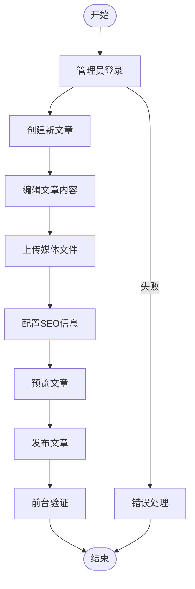
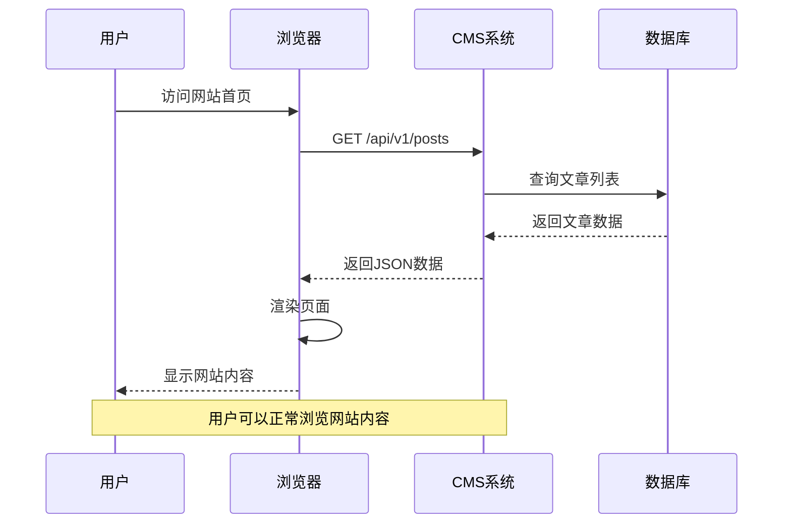
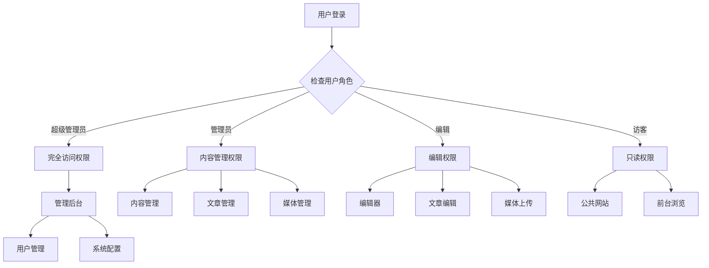
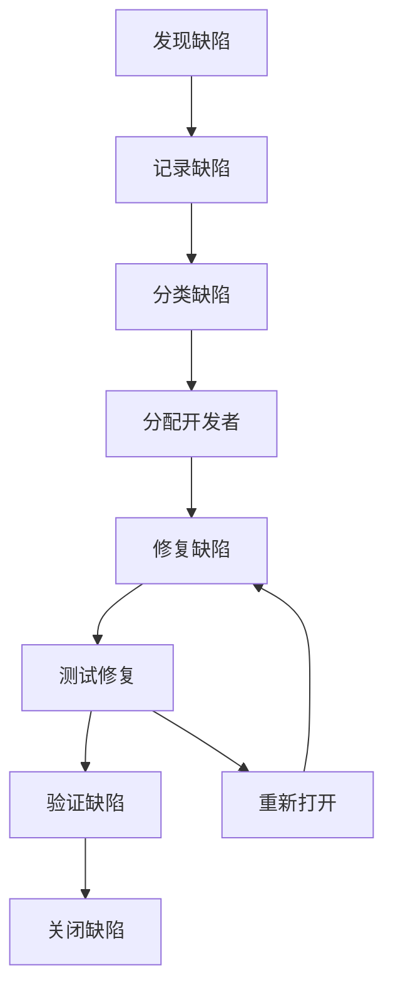
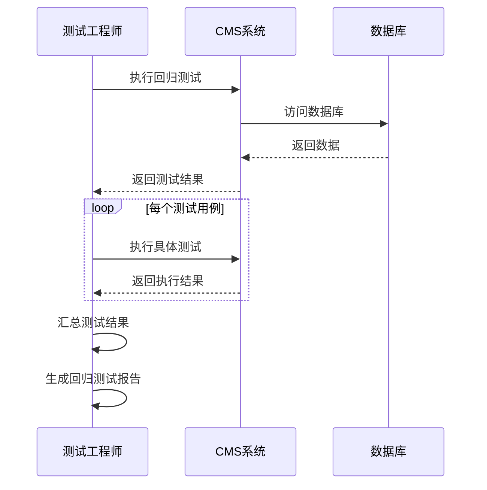

# 用户验收测试

<cite>
**本文档引用的文件**
- [企业网站CMS系统开发需求文档.ini](file://企业网站CMS系统开发需求文档.ini)
- [企业网站CMS系统详细需求文档.md](file://企业网站CMS系统详细需求文档.md)
</cite>

## 目录
1. [引言](#引言)
2. [项目概述](#项目概述)
3. [验收测试目标](#验收测试目标)
4. [验收测试范围](#验收测试范围)
5. [验收标准制定](#验收标准制定)
6. [用户场景测试流程](#用户场景测试流程)
7. [业务流程测试](#业务流程测试)
8. [用户体验测试](#用户体验测试)
9. [用户反馈收集机制](#用户反馈收集机制)
10. [培训测试评估](#培训测试评估)
11. [验收测试执行计划](#验收测试执行计划)
12. [缺陷跟踪管理](#缺陷跟踪管理)
13. [项目移交程序](#项目移交程序)
14. [回归测试验证](#回归测试验证)
15. [兼容性测试](#兼容性测试)
16. [可维护性评估](#可维护性评估)
17. [结论](#结论)

## 引言

用户验收测试（User Acceptance Testing, UAT）是确保企业网站CMS系统满足业务需求、用户体验要求和质量标准的关键环节。本文档基于企业网站CMS系统的详细需求文档，制定了完整的用户验收测试流程，涵盖功能完整性验证、业务流程测试、用户体验评估以及项目移交程序。

## 项目概述

企业网站CMS系统是一个功能完善、易于维护的企业官网内容管理系统，支持可视化拖拽配置，降低技术门槛，提升网站管理效率。系统采用前后端分离架构，支持多终端适配和SEO优化，确保系统安全性和可扩展性。

**章节来源**
- [企业网站CMS系统详细需求文档.md](file://企业网站CMS系统详细需求文档.md#L11-L21)

## 验收测试目标

### 主要目标
- 验证系统功能完整性和业务流程正确性
- 确保用户体验符合设计要求
- 满足性能、安全、兼容性等非功能性需求
- 建立完善的质量门禁标准
- 为项目移交提供可靠的验收依据

### 测试层次
- **功能测试**: 验证各功能模块是否按需求实现
- **业务流程测试**: 验证完整的业务场景流程
- **用户体验测试**: 评估用户操作便利性和满意度
- **兼容性测试**: 验证多浏览器、多设备支持
- **性能测试**: 验证系统性能指标达标

## 验收测试范围

### 功能范围
根据MVP（最小可行产品）要求，验收测试覆盖以下核心功能：

#### 必须实现的功能
- 用户登录和权限管理
- 文章管理（增删改查）
- 分类管理
- 媒体库（图片上传）
- 简化版可视化编辑器（5个核心组件）
- 前台展示页面
- 基础SEO功能

#### 延后功能
- 高级组件（轮播图、Tab等）
- 多语言支持（中英文）
- 复杂权限控制
- 数据统计图表
- 高级SEO功能

**章节来源**
- [企业网站CMS系统详细需求文档.md](file://企业网站CMS系统详细需求文档.md#L1808-L1824)

## 验收标准制定

### 业务需求对照标准

#### 功能完整性验证
- **100%功能覆盖**: 所有MVP功能必须实现并通过测试
- **需求一致性**: 功能实现与需求文档完全一致
- **业务逻辑正确性**: 符合企业网站管理的实际业务流程

#### 质量门禁标准
- **功能测试通过率**: ≥ 90%
- **性能指标达标**: 页面加载时间 < 3秒，API响应时间 < 500ms
- **安全测试通过**: 通过XSS、CSRF、SQL注入等安全测试
- **兼容性验证**: 支持主流浏览器和移动设备
- **文档完整性**: 所有技术文档和用户手册齐全

### 功能验收标准

#### 用户权限管理
- ✅ 用户注册/登录功能正常
- ✅ 角色权限控制有效
- ✅ 密码加密存储
- ✅ 会话管理安全

#### 内容管理
- ✅ 文章创建、编辑、删除、发布流程完整
- ✅ 分类管理功能正常
- ✅ 媒体文件上传和管理
- ✅ 页面可视化编辑器可用

#### 前台展示
- ✅ 首页、文章页、分类页正常显示
- ✅ 响应式设计适配
- ✅ SEO功能正常工作

**章节来源**
- [企业网站CMS系统详细需求文档.md](file://企业网站CMS系统详细需求文档.md#L1806-L1862)

## 用户场景测试流程

### 场景一：管理员登录和权限验证

#### 测试步骤
1. **系统启动验证**
   - 访问后台管理系统
   - 验证系统界面加载
   - 检查系统状态

2. **管理员登录测试**
   - 输入管理员账号密码
   - 验证登录成功
   - 检查权限菜单显示
   - 验证会话保持

3. **权限控制验证**
   - 尝试访问受限功能
   - 验证权限拒绝
   - 检查错误提示信息

#### 预期结果
- 管理员可正常登录
- 权限控制生效
- 安全机制正常工作

### 场景二：内容创建和发布流程

#### 测试步骤
1. **文章创建**
   - 进入文章管理页面
   - 点击新建文章
   - 填写文章标题和内容
   - 选择分类和标签
   - 上传特色图片

2. **文章编辑**
   - 编辑现有文章
   - 修改内容和元数据
   - 预览文章效果

3. **文章发布**
   - 设置发布状态
   - 配置SEO信息
   - 发布文章

#### 预期结果
- 文章创建、编辑、删除功能正常
- 分类和标签管理正常
- SEO设置生效
- 前台可正常显示

### 场景三：媒体文件管理

#### 测试步骤
1. **文件上传**
   - 进入媒体库页面
   - 选择图片文件
   - 验证上传进度
   - 检查上传结果

2. **文件管理**
   - 查看上传的文件
   - 编辑文件信息
   - 删除不需要的文件

3. **文件使用**
   - 在文章中插入图片
   - 验证图片显示效果

#### 预期结果
- 支持多种图片格式上传
- 文件信息管理正常
- 前台图片显示正常

**章节来源**
- [企业网站CMS系统详细需求文档.md](file://企业网站CMS系统详细需求文档.md#L1728-L1770)

## 业务流程测试

### 流程一：完整的内容发布流程

**图表来源**
- [企业网站CMS系统详细需求文档.md](file://企业网站CMS系统详细需求文档.md#L1728-L1744)

### 流程二：用户访问和内容展示

**图表来源**
- [企业网站CMS系统详细需求文档.md](file://企业网站CMS系统详细需求文档.md#L1002-L1043)

### 流程三：权限控制验证

**图表来源**
- [企业网站CMS系统详细需求文档.md](file://企业网站CMS系统详细需求文档.md#L239-L265)

## 用户体验测试

### 界面友好性测试

#### 导航测试
- **主导航**: 顶部导航菜单清晰易用
- **面包屑导航**: 路径指示准确
- **侧边栏导航**: 功能分类合理

#### 操作便捷性测试
- **表单操作**: 表单字段布局合理，验证提示清晰
- **批量操作**: 支持批量删除、状态修改等操作
- **快捷操作**: 支持键盘快捷键操作

#### 响应式设计测试
- **桌面端**: 1366×768及以上分辨率正常显示
- **平板端**: 768×1024分辨率适配良好
- **移动端**: 375×667分辨率正常显示

### 性能体验测试

#### 加载速度测试
- **页面加载**: 首页加载时间 < 2秒
- **内页加载**: 内页加载时间 < 3秒
- **API响应**: API响应时间 < 500ms

#### 交互响应测试
- **按钮点击**: 按钮点击响应迅速
- **表单提交**: 表单提交反馈及时
- **文件上传**: 上传进度显示准确

**章节来源**
- [企业网站CMS系统详细需求文档.md](file://企业网站CMS系统详细需求文档.md#L1362-L1380)

## 用户反馈收集机制

### 用户访谈计划

#### 访谈对象
- **系统管理员**: 1-2名，负责系统整体管理
- **内容编辑人员**: 2-3名，负责日常内容更新
- **最终用户**: 1-2名，使用系统进行网站维护

#### 访谈内容
1. **使用体验**
   - 系统易用性评价
   - 功能完整性满意度
   - 操作流程合理性

2. **问题反馈**
   - 使用中遇到的问题
   - 功能缺失建议
   - 性能问题反馈

3. **改进建议**
   - 功能优化建议
   - 界面改进意见
   - 工作流程优化

### 问卷调查设计

#### 调查维度
- **功能满意度**: 1-5分评分
- **易用性评价**: 1-5分评分  
- **性能表现**: 1-5分评分
- **总体评价**: 1-5分评分

#### 调查工具
- **在线问卷**: 使用问卷星等工具
- **纸质问卷**: 适用于不熟悉电子设备的用户
- **电话回访**: 对重要用户进行电话回访

### 行为数据分析

#### 关键指标
- **用户活跃度**: 登录频率、功能使用频率
- **操作效率**: 功能完成时间、错误率
- **用户留存**: 系统使用持续性

#### 数据收集方法
- **日志分析**: 系统使用日志分析
- **行为追踪**: 用户操作行为记录
- **性能监控**: 系统性能指标监控

## 培训测试评估

### 用户操作熟练度评估

#### 评估标准
- **新手阶段**: 需要指导才能完成基本操作
- **熟练阶段**: 能够独立完成日常操作
- **专家阶段**: 能够处理复杂场景和问题

#### 评估方法
1. **实操测试**: 现场操作测试
2. **模拟场景**: 模拟真实工作场景
3. **技能考核**: 系统化技能测试

### 常见问题处理测试

#### 问题分类
- **技术问题**: 系统故障、功能异常
- **操作问题**: 不知道如何操作某功能
- **业务问题**: 业务流程理解偏差

#### 处理流程
1. **问题识别**: 准确识别问题类型
2. **解决方案**: 提供合适的解决方法
3. **预防措施**: 提供预防类似问题的建议

### 故障排除能力测试

#### 自助排除能力
- **基础故障**: 网络连接、浏览器兼容性
- **功能故障**: 某个功能无法使用
- **数据问题**: 数据丢失或显示异常

#### 技术支持能力
- **问题诊断**: 快速定位问题原因
- **解决方案**: 提供有效的解决方法
- **预防建议**: 提供预防措施建议

**章节来源**
- [企业网站CMS系统详细需求文档.md](file://企业网站CMS系统详细需求文档.md#L1735-L1744)

## 验收测试执行计划

### 测试阶段划分

#### 阶段一：功能测试（第1-2天）
- **测试目标**: 验证核心功能完整性
- **测试内容**: 用户管理、内容管理、媒体管理
- **测试方法**: 黑盒测试、功能测试用例

#### 阶段二：业务流程测试（第3天）
- **测试目标**: 验证完整业务流程
- **测试内容**: 内容发布流程、用户访问流程
- **测试方法**: 场景测试、流程测试

#### 阶段三：用户体验测试（第4天）
- **测试目标**: 评估用户体验质量
- **测试内容**: 界面友好性、操作便捷性
- **测试方法**: 用户体验评估、可用性测试

#### 阶段四：兼容性测试（第5天）
- **测试目标**: 验证多平台兼容性
- **测试内容**: 浏览器兼容性、移动设备适配
- **测试方法**: 多环境测试、自动化测试

### 测试资源配置

#### 测试团队
- **测试经理**: 1名，负责测试计划和协调
- **测试工程师**: 2名，负责具体测试执行
- **业务分析师**: 1名，负责业务需求验证

#### 测试工具
- **自动化测试工具**: Selenium、Postman
- **性能测试工具**: JMeter、LoadRunner
- **兼容性测试工具**: BrowserStack、Sauce Labs

**章节来源**
- [企业网站CMS系统详细需求文档.md](file://企业网站CMS系统详细需求文档.md#L1699-L1724)

## 缺陷跟踪管理

### 缺陷分类标准

#### 严重程度分级
- **致命缺陷**: 系统崩溃、数据丢失
- **严重缺陷**: 主要功能失效、安全漏洞
- **一般缺陷**: 功能异常、界面问题
- **轻微缺陷**: 界面小问题、拼写错误

#### 缺陷生命周期
1. **发现**: 测试过程中发现缺陷
2. **记录**: 详细记录缺陷信息
3. **分类**: 确定缺陷严重程度
4. **修复**: 开发团队修复缺陷
5. **验证**: 测试团队验证修复
6. **关闭**: 缺陷正式关闭

### 缺陷跟踪流程

**图表来源**
- [企业网站CMS系统详细需求文档.md](file://企业网站CMS系统详细需求文档.md#L1710-L1720)

### 缺陷统计分析

#### 统计指标
- **缺陷密度**: 缺陷数量/功能点数
- **修复时间**: 平均修复时间
- **回归缺陷**: 修复后再次出现的缺陷
- **严重缺陷比例**: 严重缺陷占总缺陷比例

#### 分析报告
- **周报**: 每周缺陷统计分析
- **月报**: 月度缺陷趋势分析
- **总结报告**: 项目缺陷总结分析

## 项目移交程序

### 移交准备阶段

#### 文档准备
- **用户手册**: 完整的操作指南
- **技术文档**: 系统架构、API文档
- **运维文档**: 部署、备份、监控文档
- **测试报告**: 测试结果和缺陷统计

#### 环境准备
- **生产环境**: 确保生产环境就绪
- **数据迁移**: 完成数据迁移和验证
- **权限配置**: 配置用户权限和访问控制

### 移交执行阶段

#### 培训安排
- **管理员培训**: 系统管理、用户管理
- **编辑人员培训**: 内容管理、页面编辑
- **技术支持培训**: 故障排除、系统维护

#### 验收确认
- **功能验收**: 确认所有功能正常
- **性能验收**: 确认性能指标达标
- **文档验收**: 确认文档齐全完整

### 移交完成阶段

#### 交接清单
- **系统访问凭证**: 用户名、密码、API密钥
- **技术文档**: 所有技术文档和源代码
- **运维工具**: 监控、备份、日志工具
- **联系方式**: 支持联系方式和紧急联系人

#### 后续支持
- **过渡期支持**: 提供短期技术支持
- **问题响应**: 建立问题响应机制
- **定期回访**: 定期回访使用情况

**章节来源**
- [企业网站CMS系统详细需求文档.md](file://企业网站CMS系统详细需求文档.md#L1726-L1770)

## 回归测试验证

### 回归测试策略

#### 测试范围
- **核心功能回归**: 所有MVP功能重新测试
- **关键流程回归**: 重要业务流程验证
- **兼容性回归**: 浏览器和设备兼容性验证
- **性能回归**: 性能指标重新验证

#### 测试方法
- **自动化回归**: 使用自动化测试脚本
- **手动回归**: 关键功能的手动验证
- **抽样测试**: 重要功能的重点测试

### 回归测试流程

**图表来源**
- [企业网站CMS系统详细需求文档.md](file://企业网站CMS系统详细需求文档.md#L1710-L1720)

## 兼容性测试

### 浏览器兼容性测试

#### 支持的浏览器
- **Chrome**: 90+版本
- **Firefox**: 88+版本  
- **Safari**: 14+版本
- **Edge**: 90+版本

#### 测试内容
- **界面显示**: 界面元素正确显示
- **功能操作**: 功能正常操作
- **布局适配**: 响应式布局正常
- **性能表现**: 性能指标达标

### 移动设备兼容性测试

#### 支持的设备
- **iOS**: 13+版本
- **Android**: 8+版本
- **分辨率**: 320px ~ 1920px

#### 测试内容
- **触摸操作**: 触摸手势响应
- **屏幕适配**: 不同屏幕尺寸适配
- **性能优化**: 移动端性能表现
- **电池续航**: 移动端耗电情况

### 操作系统兼容性测试

#### 支持的操作系统
- **Windows**: 10/11
- **macOS**: 10.15+
- **Linux**: Ubuntu 18.04+

#### 测试内容
- **安装部署**: 系统安装和部署
- **功能验证**: 功能在各系统下正常
- **性能对比**: 不同系统性能差异
- **稳定性测试**: 长时间运行稳定性

**章节来源**
- [企业网站CMS系统详细需求文档.md](file://企业网站CMS系统详细需求文档.md#L1424-L1441)

## 可维护性评估

### 代码质量评估

#### 代码规范检查
- **Python代码**: 符合PEP 8规范
- **JavaScript代码**: 符合ESLint规范
- **注释覆盖率**: > 30%
- **函数复杂度**: < 10

#### 代码结构评估
- **模块化程度**: 代码模块化良好
- **耦合度**: 模块间耦合度适中
- **可扩展性**: 代码具备良好的扩展性
- **可读性**: 代码易于理解和维护

### 文档质量评估

#### 技术文档
- **API文档**: Swagger文档完整
- **数据库文档**: ER图和表结构完整
- **部署文档**: 部署步骤详细
- **架构文档**: 系统架构清晰

#### 用户文档
- **操作手册**: 步骤详细易懂
- **FAQ**: 常见问题解答完整
- **培训材料**: 培训内容完整
- **视频教程**: 操作演示视频

### 测试覆盖度评估

#### 单元测试
- **覆盖率**: 代码覆盖率 > 70%
- **测试用例**: 测试用例完整
- **边界测试**: 边界条件测试充分
- **异常处理**: 异常情况处理测试

#### 集成测试
- **接口测试**: API接口测试完整
- **数据库测试**: 数据库操作测试
- **第三方集成**: 第三方服务集成测试
- **性能测试**: 性能指标测试

## 结论

用户验收测试是确保企业网站CMS系统成功交付的关键环节。通过建立完善的验收标准、制定详细的测试流程、实施全面的测试策略，可以有效保证系统的质量、性能和用户体验。

### 关键成功因素

1. **明确的验收标准**: 基于需求文档制定可量化的验收标准
2. **全面的测试覆盖**: 涵盖功能、性能、安全、兼容性等各个方面
3. **有效的缺陷管理**: 建立完善的缺陷跟踪和修复流程
4. **充分的用户参与**: 确保最终用户参与验收测试过程
5. **完善的文档管理**: 保证所有测试文档和验收文档完整

### 后续改进建议

1. **持续改进**: 基于用户反馈持续改进系统功能
2. **监控预警**: 建立系统运行监控和预警机制
3. **知识传承**: 确保项目知识的有效传承
4. **技术支持**: 建立长期的技术支持和服务机制

通过严格执行本文档制定的用户验收测试流程，可以确保企业网站CMS系统高质量地交付给最终用户，满足企业的业务需求和使用要求。