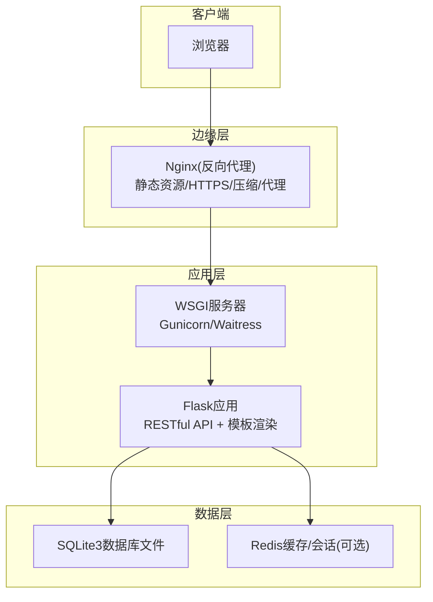
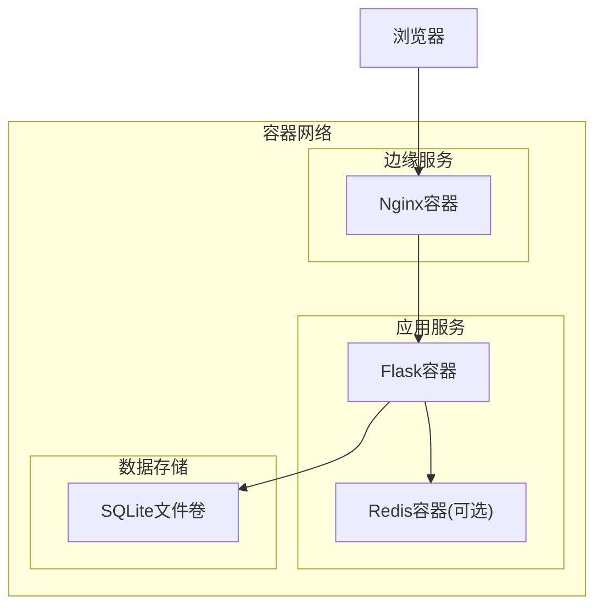
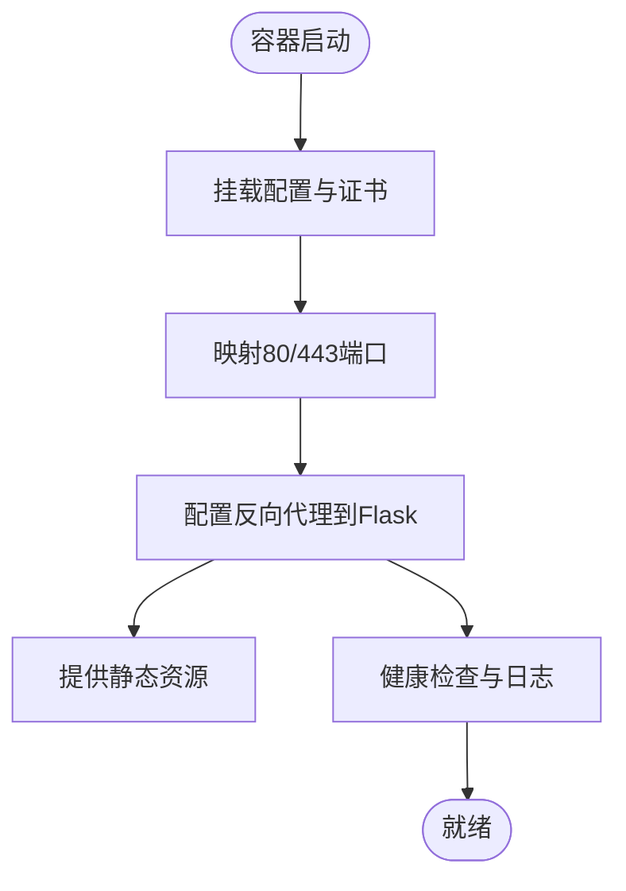
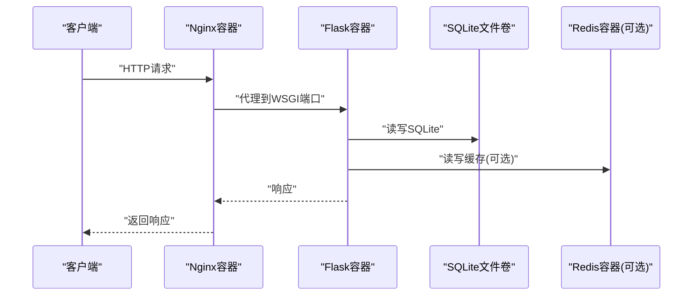
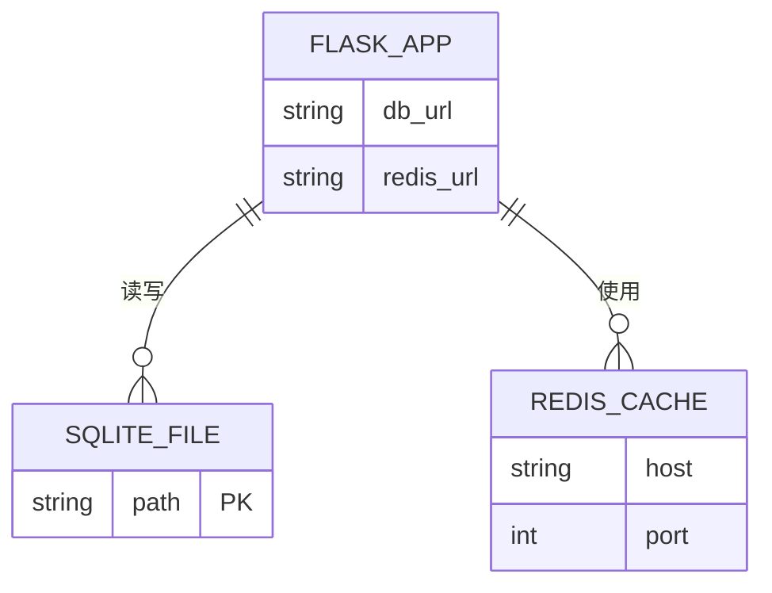
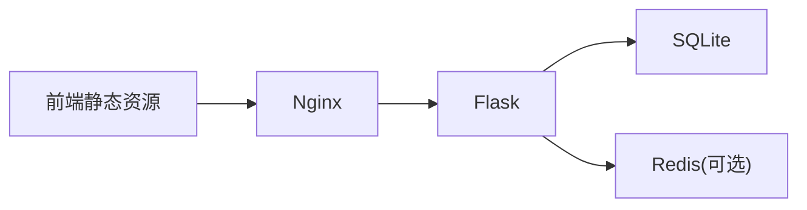

# Docker容器化部署

<cite>
**本文引用的文件**
- [企业网站CMS系统开发需求文档.ini](file://企业网站CMS系统开发需求文档.ini)
- [企业网站CMS系统详细需求文档.md](file://企业网站CMS系统详细需求文档.md)
</cite>

## 目录
1. [简介](#简介)
2. [项目结构](#项目结构)
3. [核心组件](#核心组件)
4. [架构总览](#架构总览)
5. [组件详解](#组件详解)
6. [依赖关系分析](#依赖关系分析)
7. [性能考量](#性能考量)
8. [故障排查指南](#故障排查指南)
9. [结论](#结论)
10. [附录](#附录)

## 简介
本文件面向企业网站CMS系统的容器化部署，结合项目需求文档中的技术栈与部署现状，提供从Dockerfile编写、镜像构建与标签管理、仓库推送，到Docker Compose编排、运行参数配置、监控与健康检查，以及在Docker Swarm/Kubernetes上的编排与服务发现、负载均衡的完整方案。文档同时给出面向非技术读者的可执行步骤与最佳实践，帮助快速落地并稳定运行。

## 项目结构
根据需求文档，系统采用“前后端分离 + 反向代理 + WSGI应用 + 数据库/缓存”的经典三层架构：
- 前端：React/Vue（可选）或纯HTML模板渲染
- 反向代理：Nginx
- 应用层：Flask + Gunicorn（或Windows友好Waitress）
- 数据层：SQLite3（默认）；可选Redis缓存
- 文件存储：本地文件系统（可选云存储）

**章节来源**
- file://企业网站CMS系统详细需求文档.md#L22-L57

## 核心组件
- 反向代理与边缘网关：Nginx，负责静态资源、HTTPS终止、Gzip压缩、API代理、可选负载均衡
- 应用服务：Flask + WSGI（Gunicorn/Waitress），提供RESTful API与模板渲染
- 数据存储：SQLite3（默认），文件存储于本地；可选Redis用于缓存与会话
- 前端：React/Vue或纯HTML模板渲染（取决于部署模式）

**章节来源**
- file://企业网站CMS系统详细需求文档.md#L551-L660

## 架构总览
下图展示了容器化后的典型拓扑：前端静态资源由Nginx提供；API请求经Nginx代理至Flask应用；Flask访问SQLite数据库；可选Redis用于缓存与会话；日志统一采集与集中化。

**图表来源**
- [企业网站CMS系统详细需求文档.md](file://企业网站CMS系统详细需求文档.md#L22-L57)

## 组件详解

### 反向代理（Nginx）容器化
- 基础镜像：nginx:alpine
- 端口映射：80/443对外暴露
- 卷挂载：
  - 静态资源目录映射到Nginx静态目录
  - SSL证书与密钥映射到容器内
  - Nginx配置文件映射
- 环境变量：可通过环境变量控制上游Flask地址、日志路径、Gzip开关等
- 健康检查：可使用curl探测/或自定义探针
- 负载均衡：在Nginx中配置upstream，指向多个Flask实例

**章节来源**
- file://企业网站CMS系统详细需求文档.md#L1143-L1230

### 应用服务（Flask + WSGI）容器化
- 基础镜像：python:3.x-alpine或python:3.x-slim
- 依赖安装：pip安装requirements.txt中的包
- 环境变量：
  - FLASK_ENV、SECRET_KEY、JWT_SECRET_KEY
  - DATABASE_URL（指向SQLite文件路径）
  - REDIS_URL（可选）
  - MAIL_*（SMTP配置）
- 运行命令：gunicorn或waitress启动WSGI应用
- 健康检查：HTTP GET /health（需在Flask中提供）
- 日志：stdout/stderr，配合Nginx访问/错误日志

**章节来源**
- file://企业网站CMS系统详细需求文档.md#L1232-L1322

### 数据与缓存容器化
- SQLite：将数据库文件映射为持久卷，便于备份与迁移
- Redis：可选，用于缓存与会话；若不使用可省略

**章节来源**
- file://企业网站CMS系统详细需求文档.md#L660-L712

### 前端容器化（可选）
- 若采用纯HTML模板渲染，可将静态资源置于Nginx
- 若采用SPA（React/Vue），可将dist目录映射到Nginx静态目录，或使用Nginx作为静态资源服务
- 若需要构建产物，可在CI中先构建前端，再打包进Nginx镜像

**章节来源**
- file://企业网站CMS系统详细需求文档.md#L1202-L1206

## 依赖关系分析
- 应用服务依赖数据库与缓存（可选）
- Nginx依赖应用服务与静态资源
- 前端静态资源可由Nginx提供，也可由应用服务渲染

**图表来源**
- [企业网站CMS系统详细需求文档.md](file://企业网站CMS系统详细需求文档.md#L22-L57)

## 性能考量
- 静态资源：Nginx启用Gzip与缓存头，合理设置expires
- API：WSGI进程数与worker数按CPU核数与内存配置；必要时启用Redis缓存热点数据
- 数据库：SQLite适合中小规模读多写少场景；若并发写入高，考虑迁移到MySQL/PostgreSQL
- 文件存储：本地文件系统简单可靠；若需要高可用，可接入云存储SDK

**章节来源**
- file://企业网站CMS系统详细需求文档.md#L1362-L1380

## 故障排查指南
- 访问异常
  - 检查Nginx配置是否正确代理到Flask
  - 检查Flask容器日志与WSGI启动参数
- 数据库问题
  - 确认数据库文件路径与权限
  - 检查SQLite文件是否损坏或被意外覆盖
- 缓存问题
  - 若启用Redis，检查连接字符串与网络连通性
- 性能问题
  - 分析Nginx访问/错误日志
  - 评估WSGI worker数量与数据库查询性能

**章节来源**
- file://企业网站CMS系统详细需求文档.md#L1143-L1230

## 结论
通过容器化，企业CMS系统可实现标准化构建、一致化运行与弹性扩缩容。结合Nginx的反向代理能力与Flask的RESTful能力，配合SQLite/Redis的组合，既能满足中小规模企业的需求，又为后续扩展（如迁移到MySQL、引入Kubernetes）预留了路径。建议在CI/CD流水线中完成镜像构建与推送，并在生产环境中启用健康检查、日志采集与监控告警。

## 附录

### Dockerfile编写要点
- 基础镜像：python:3.x-alpine或python:3.x-slim
- 依赖安装：pip install -r requirements.txt
- 环境变量：通过ENV或docker-compose传入
- 运行命令：gunicorn或waitress启动WSGI应用
- 健康检查：HTTP GET /health
- 日志：stdout/stderr

**章节来源**
- file://企业网站CMS系统详细需求文档.md#L1304-L1322

### Docker Compose编排要点
- 服务定义：nginx、flask、redis（可选）、sqlite文件卷
- 网络设置：自定义bridge网络，服务间通过服务名通信
- 卷挂载：
  - SQLite文件卷：持久化数据库文件
  - 静态资源卷：映射前端dist或后端模板静态目录
  - SSL证书卷：映射证书与密钥
- 环境变量：通过environment或env_file传入
- 健康检查：为nginx、flask、redis配置健康检查

**章节来源**
- file://企业网站CMS系统详细需求文档.md#L1143-L1230

### 镜像构建、标签管理与仓库推送
- 构建：docker build -t company-cms/flask-app:latest .
- 标签：docker tag company-cms/flask-app:latest company-cms/flask-app:v1.0.0
- 推送：docker push company-cms/flask-app:v1.0.0
- 建议：在CI中按分支/版本打标签并推送

**章节来源**
- file://企业网站CMS系统详细需求文档.md#L1304-L1322

### 容器运行参数配置
- 环境变量：FLASK_ENV、SECRET_KEY、JWT_SECRET_KEY、DATABASE_URL、REDIS_URL、MAIL_* 等
- 端口映射：Nginx 80/443，Flask WSGI端口（如8000）
- 数据卷挂载：SQLite文件卷、静态资源卷、SSL证书卷
- 健康检查：/health端点（需在Flask中实现）

**章节来源**
- file://企业网站CMS系统详细需求文档.md#L1232-L1322

### 监控、日志与健康检查
- 日志：Nginx访问/错误日志；Flask应用日志输出到stdout/stderr
- 健康检查：/health端点；Nginx可配置探针
- 监控：Prometheus/Grafana（可选）；容器资源监控

**章节来源**
- file://企业网站CMS系统详细需求文档.md#L1143-L1230

### 编排、服务发现与负载均衡
- Docker Swarm：使用stack部署，swarm service实现副本与滚动更新
- Kubernetes：Deployment/Service/Ingress；ConfigMap/Secret管理配置；PersistentVolume管理数据库文件
- 负载均衡：Nginx（边缘LB）或Kubernetes Ingress；应用层可多副本横向扩展

**章节来源**
- file://企业网站CMS系统开发需求文档.ini#L87-L90
- file://企业网站CMS系统详细需求文档.md#L1143-L1230