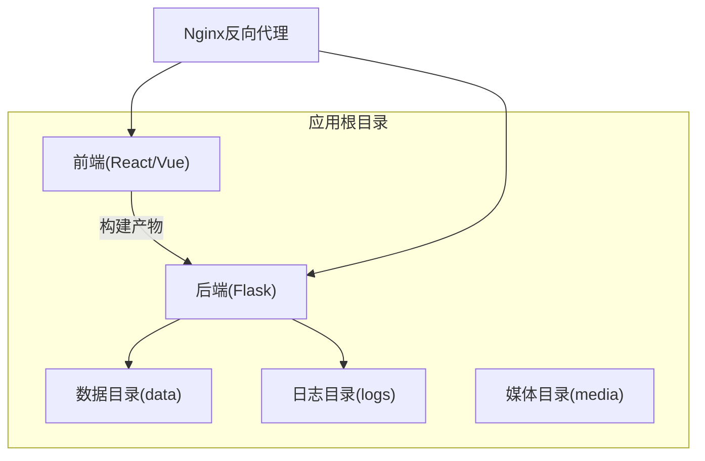
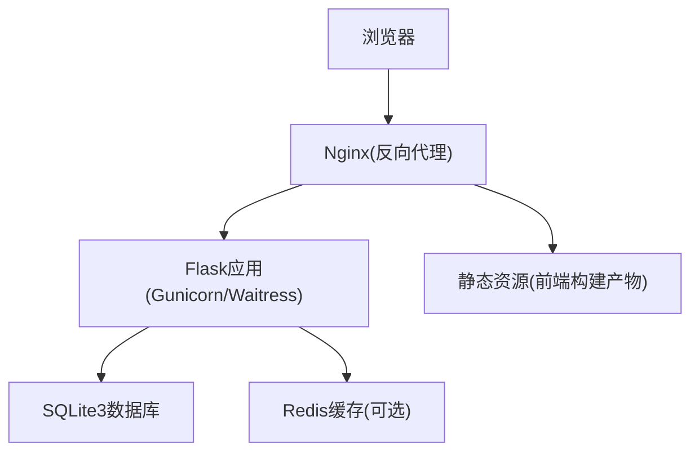
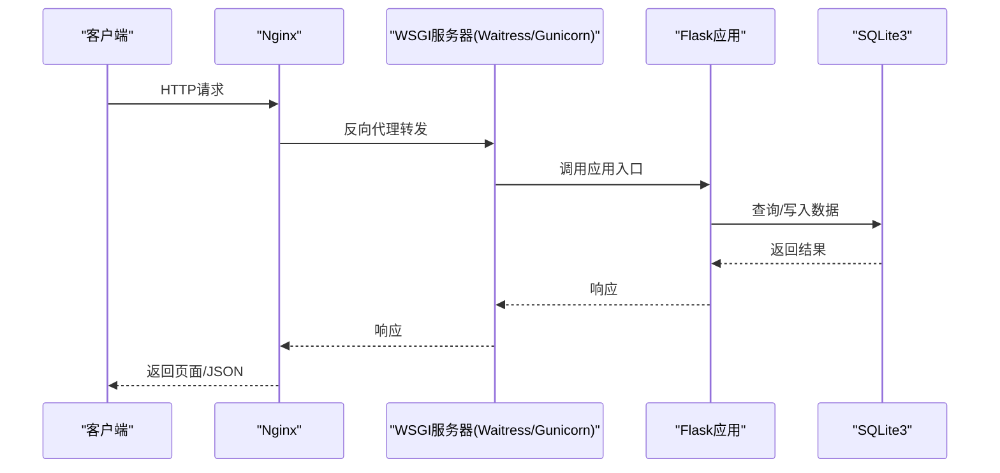
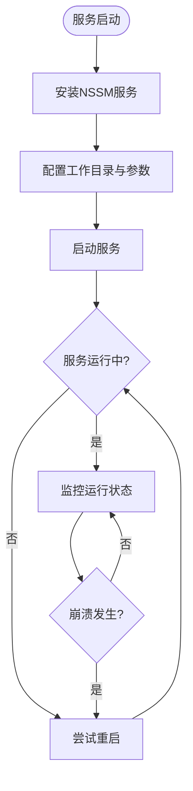
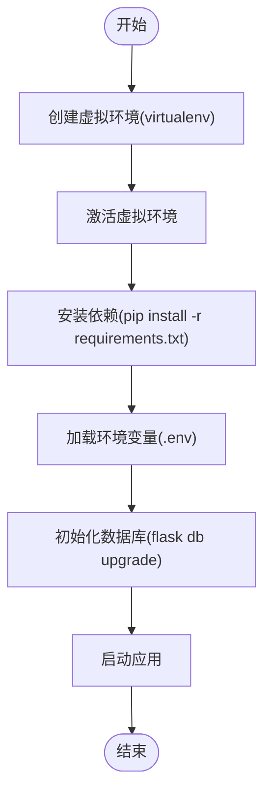
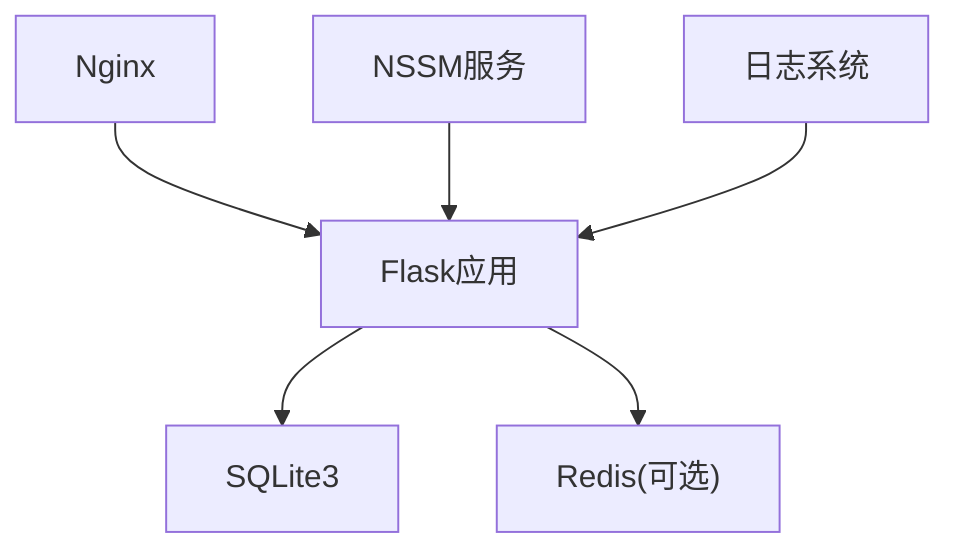

# Flask应用部署

<cite>
**本文引用的文件**
- [企业网站CMS系统开发需求文档.ini](file://企业网站CMS系统开发需求文档.ini)
- [企业网站CMS系统详细需求文档.md](file://企业网站CMS系统详细需求文档.md)
- [开发计划表_2月4日-2月12日.md](file://开发计划表_2月4日-2月12日.md)
</cite>

## 目录
1. [简介](#简介)
2. [项目结构](#项目结构)
3. [核心组件](#核心组件)
4. [架构总览](#架构总览)
5. [详细组件分析](#详细组件分析)
6. [依赖关系分析](#依赖关系分析)
7. [性能考量](#性能考量)
8. [故障排查指南](#故障排查指南)
9. [结论](#结论)
10. [附录](#附录)

## 简介
本文件面向在Windows Server环境下部署Flask应用的工程实践，结合项目实际需求与开发计划，系统阐述从虚拟环境、WSGI服务器选择与配置、进程管理到日志与性能优化的完整部署流程。文档特别强调Windows环境下的WSGI服务器选择（Gunicorn vs Waitress）、NSSM服务注册与自启动、以及基于SQLite3的数据库部署与备份策略，并提供可操作的步骤指引与最佳实践。

## 项目结构
根据开发计划与需求文档，Flask后端采用蓝图化的应用结构，配合数据库迁移、测试与运行入口，形成清晰的模块边界与职责划分：
- 应用根目录包含后端与前端子目录，便于统一部署与版本管理
- 后端采用Flask项目结构，包含models、api、auth、utils等模块
- 前端通过构建工具输出静态资源，由Nginx提供静态服务与反向代理

**章节来源**
- file://开发计划表_2月4日-2月12日.md#L76-L105
- file://开发计划表_2月4日-2月12日.md#L441-L506

## 核心组件
- WSGI服务器：在Windows环境下优先选择Waitress；也可使用Gunicorn（需满足其依赖条件）
- 反向代理：Nginx负责静态资源、HTTPS终止、Gzip压缩与负载均衡
- 数据库：SQLite3作为主数据库，零配置、易备份、适合中小规模网站
- 进程管理：NSSM将Flask应用注册为Windows服务，实现开机自启动与崩溃重启
- 日志与监控：logging模块配合RotatingFileHandler，可选Flask-Profiler或Sentry

**章节来源**
- file://企业网站CMS系统详细需求文档.md#L579-L583
- file://企业网站CMS系统详细需求文档.md#L645-L658
- file://开发计划表_2月4日-2月12日.md#L441-L506

## 架构总览
系统采用前后端分离架构，Nginx作为反向代理与静态资源服务，Flask应用通过WSGI服务器对外提供RESTful API与模板渲染能力，数据库采用SQLite3，进程管理由NSSM负责。

**图表来源**
- [企业网站CMS系统详细需求文档.md](file://企业网站CMS系统详细需求文档.md#L28-L57)

**章节来源**
- file://企业网站CMS系统详细需求文档.md#L22-L57

## 详细组件分析

### WSGI服务器选择与配置
- Windows环境推荐使用Waitress，因其原生支持Windows且易于部署
- 若选择Gunicorn，需满足其依赖（如gevent）并在Windows上进行兼容性测试
- Waitress启动命令示例：waitress-serve --host=127.0.0.1 --port=5000 run:app
- Gunicorn启动示例：gunicorn --workers 4 --bind 127.0.0.1:5000 run:app（需按实际环境调整）

**章节来源**
- file://企业网站CMS系统详细需求文档.md#L579-L583
- file://开发计划表_2月4日-2月12日.md#L489-L499

### 进程管理与服务注册（NSSM）
- 使用NSSM将Flask应用注册为Windows服务，实现开机自启动与崩溃重启
- 常用步骤：安装服务、设置工作目录、设置启动参数、启动服务
- 建议在服务停止或异常退出时自动重启，提高可用性

**章节来源**
- file://企业网站CMS系统详细需求文档.md#L645-L649
- file://开发计划表_2月4日-2月12日.md#L494-L499

### 虚拟环境与依赖管理
- 使用Python venv创建隔离环境，避免全局污染
- 安装依赖包：Flask、Flask-SQLAlchemy、Flask-Migrate、Flask-Login、Flask-WTF、Flask-CORS、Flask-RESTful、Flask-Caching、Flask-Babel等
- 环境变量配置：使用python-dotenv加载.env文件，集中管理敏感信息
- 建议在requirements.txt中固定版本，便于生产一致性

**章节来源**
- file://开发计划表_2月4日-2月12日.md#L68-L73
- file://开发计划表_2月4日-2月12日.md#L451-L463

### 配置文件与敏感信息保护
- 配置文件采用分层设计：开发、测试、生产环境分别配置
- 敏感信息（数据库连接、密钥、第三方服务凭据）通过环境变量注入
- 建议使用dotenv模板文件（.env.example）提供配置指引，但不提交真实密钥
- 对于数据库文件路径、日志路径、媒体存储路径等，统一在配置中集中管理

**章节来源**
- file://开发计划表_2月4日-2月12日.md#L88-L90
- file://开发计划表_2月4日-2月12日.md#L669-L672

### 日志配置与错误处理
- 使用Python logging模块，结合RotatingFileHandler实现日志轮转
- 建议区分应用日志、访问日志与错误日志，便于定位问题
- 在开发阶段启用调试模式，生产环境关闭调试模式
- 结合Nginx访问日志与应用日志，形成完整的审计线索

**章节来源**
- file://企业网站CMS系统详细需求文档.md#L655-L658
- file://开发计划表_2月4日-2月12日.md#L420-L432

### 数据库部署与备份策略
- SQLite3作为主数据库，零配置、易备份，适合中小规模网站
- 建议将数据库文件与备份目录、日志目录分开存放，便于管理
- 备份策略：定期备份数据库文件，保留最近若干份历史备份
- 在高并发场景下，可考虑启用WAL模式以提升写入性能

**章节来源**
- file://企业网站CMS系统详细需求文档.md#L662-L712
- file://开发计划表_2月4日-2月12日.md#L459-L463

## 依赖关系分析
- Flask应用依赖于数据库（SQLite3）、缓存（Redis可选）、文件存储（本地/云存储）
- Nginx依赖于Flask应用与前端静态资源
- NSSM依赖于Flask应用与WSGI服务器
- 日志系统依赖于应用与文件系统

**图表来源**
- [企业网站CMS系统详细需求文档.md](file://企业网站CMS系统详细需求文档.md#L51-L56)

**章节来源**
- file://企业网站CMS系统详细需求文档.md#L51-L56

## 性能考量
- WSGI服务器选择：Windows环境下优先Waitress；若使用Gunicorn，需确保异步worker（gevent）兼容性
- worker进程数量：根据CPU核心数与内存资源合理设置，避免过度并发导致资源争用
- 缓存策略：结合Flask-Caching与Redis实现页面缓存与数据缓存
- 静态资源优化：Nginx提供静态资源服务与Gzip压缩，减少应用压力
- 数据库优化：SQLite3适合读多写少场景，必要时启用WAL模式与索引优化
- 监控与告警：可选Flask-Profiler或Sentry，结合日志实现性能监控

**章节来源**
- file://企业网站CMS系统详细需求文档.md#L579-L583
- file://企业网站CMS系统详细需求文档.md#L514-L548
- file://开发计划表_2月4日-2月12日.md#L440-L449

## 故障排查指南
- 启动失败：检查虚拟环境是否激活、依赖是否正确安装、端口是否被占用
- 访问异常：检查Nginx配置、反向代理是否正确指向WSGI服务器
- 数据库问题：确认数据库文件路径、权限与备份完整性
- 日志定位：查看应用日志与Nginx访问日志，结合错误堆栈定位问题
- 进程异常：通过NSSM查看服务状态与重启策略，确保崩溃后自动恢复

**章节来源**
- file://开发计划表_2月4日-2月12日.md#L439-L449
- file://开发计划表_2月4日-2月12日.md#L420-L432

## 结论
本文基于项目需求与开发计划，提供了在Windows Server环境下部署Flask应用的完整实践指南。通过合理的WSGI服务器选择、NSSM服务注册、虚拟环境与依赖管理、配置与敏感信息保护、日志与监控，以及数据库与备份策略，能够确保系统在生产环境中稳定运行。建议在部署完成后进行性能测试与安全评估，持续优化以满足业务增长需求。

## 附录
- 部署清单：虚拟环境、依赖安装、数据库初始化、Nginx配置、WSGI启动、NSSM服务注册、前端构建与部署
- 备份与恢复：定期备份数据库文件，保留历史版本，制定恢复流程
- 常见问题：端口冲突、权限不足、路径配置错误、服务无法启动等

**章节来源**
- file://开发计划表_2月4日-2月12日.md#L665-L701
- file://开发计划表_2月4日-2月12日.md#L441-L506