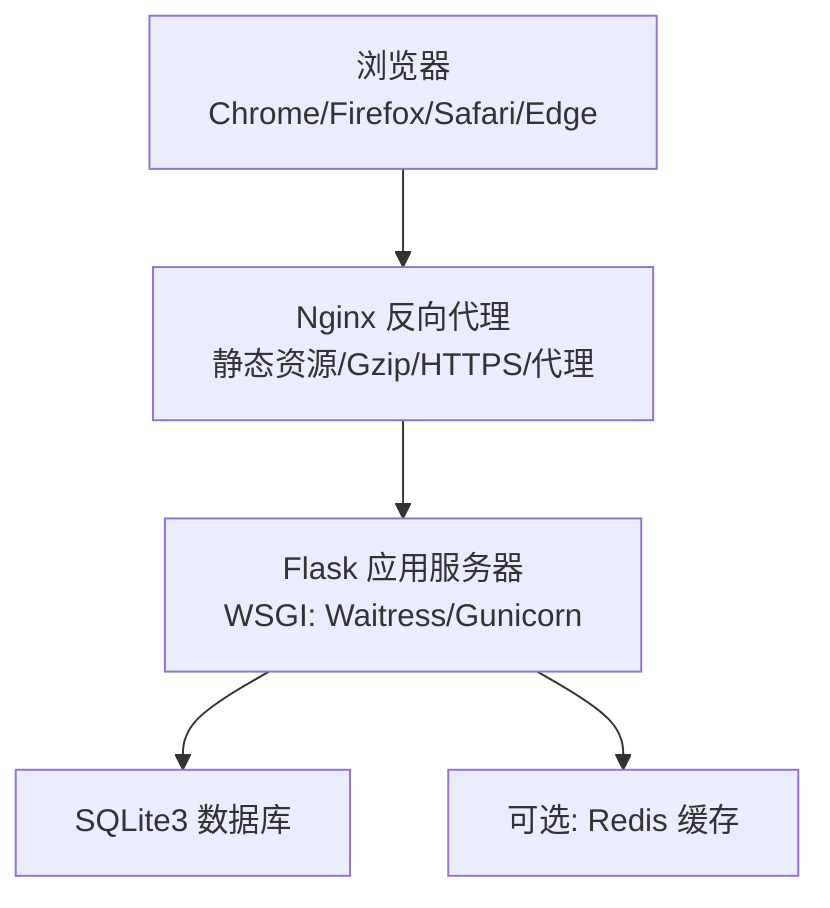
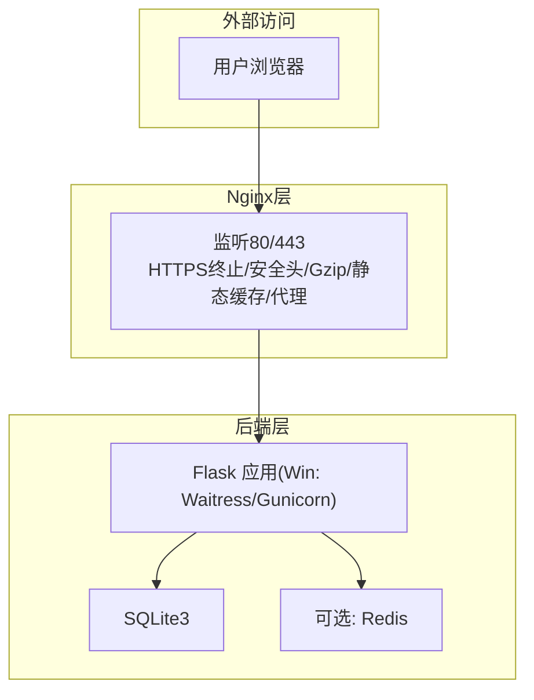
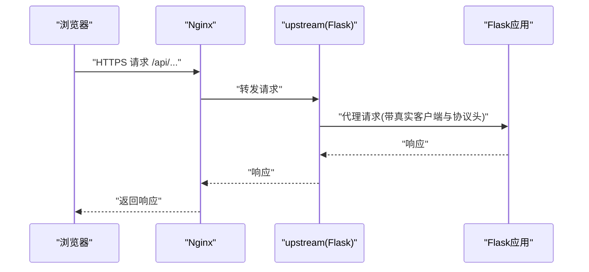
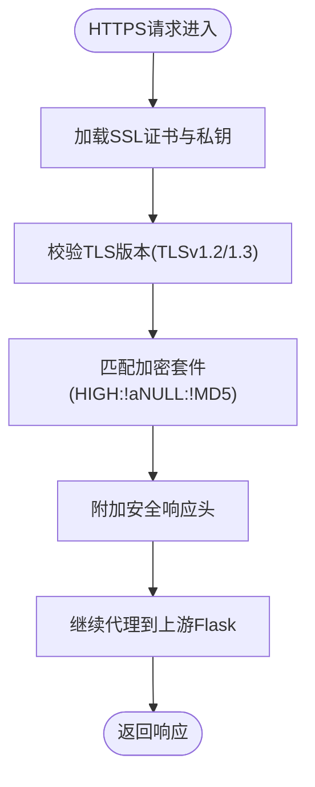
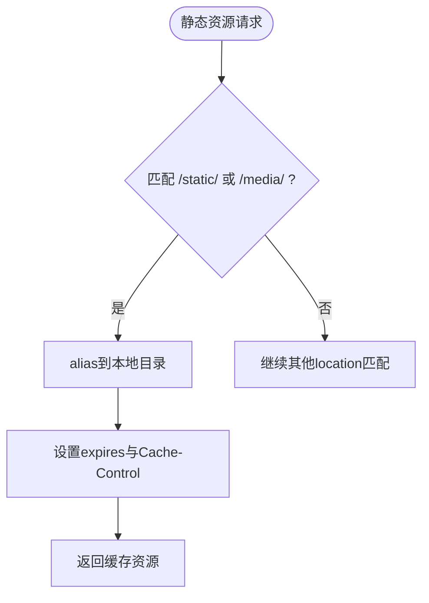
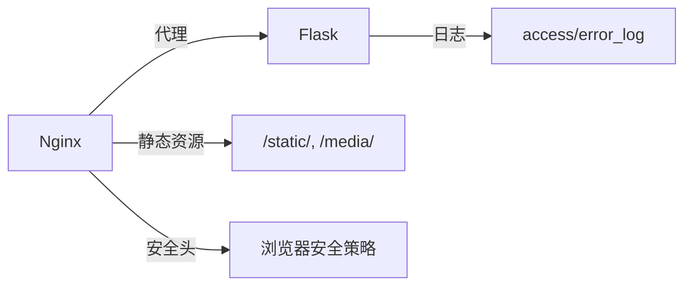

# Nginx反向代理配置

<cite>
**本文引用的文件**
- [企业网站CMS系统开发需求文档.ini](file://企业网站CMS系统开发需求文档.ini)
- [企业网站CMS系统详细需求文档.md](file://企业网站CMS系统详细需求文档.md)
</cite>

## 目录
1. [简介](#简介)
2. [项目结构](#项目结构)
3. [核心组件](#核心组件)
4. [架构总览](#架构总览)
5. [详细组件分析](#详细组件分析)
6. [依赖分析](#依赖分析)
7. [性能考量](#性能考量)
8. [故障排查指南](#故障排查指南)
9. [结论](#结论)
10. [附录](#附录)

## 简介
本文件面向企业网站CMS系统的运维与开发人员，围绕Nginx反向代理在该系统中的核心作用与配置要点进行系统化说明。结合项目文档中的技术栈与部署架构，重点覆盖：
- 反向代理配置语法与上游集群、负载均衡策略
- HTTPS配置（证书、TLS版本、加密套件）
- 静态资源服务（缓存、Gzip压缩、浏览器缓存头）
- WebSocket与长连接支持
- 错误页面、访问日志格式与安全头
- 性能优化（超时、请求大小限制、Keep-Alive）

## 项目结构
- 后端采用Python Flask + WSGI服务器（Windows环境推荐Waitress或Gunicorn），通过Nginx对外提供统一入口。
- 前端可采用SPA或Jinja2模板渲染两种模式，Nginx负责静态资源与API代理。
- 部署环境为Windows Server，Nginx版本建议1.24+。

**章节来源**
- file://企业网站CMS系统详细需求文档.md#L22-L57
- file://企业网站CMS系统详细需求文档.md#L631-L638

## 核心组件
- 反向代理与上游集群
  - 通过upstream定义后端Flask实例，支持单实例或多实例负载均衡。
- HTTPS终止与安全头
  - 在Nginx层终止TLS，配置证书、协议与加密套件，并添加安全响应头。
- 静态资源与缓存
  - 对/static/与/media/等路径提供静态文件服务，设置expires与Cache-Control。
- Gzip压缩
  - 针对文本与脚本类型启用压缩，提升传输效率。
- API与后台代理
  - 将/api/与/admin/等路径转发至上游Flask应用，正确传递真实客户端信息与协议头。
- WebSocket支持
  - 通过HTTP/1.1与Upgrade/Connection头实现长连接代理。
- 日志与错误页面
  - 配置access_log与error_log，结合错误页面与安全头提升可观测性与安全性。

**章节来源**
- file://企业网站CMS系统详细需求文档.md#L1143-L1230

## 架构总览
下图展示了Nginx在企业CMS系统中的关键职责与流量走向。

**图表来源**
- [企业网站CMS系统详细需求文档.md](file://企业网站CMS系统详细需求文档.md#L22-L57)

**章节来源**
- file://企业网站CMS系统详细需求文档.md#L22-L57

## 详细组件分析

### 反向代理与上游集群
- upstream定义
  - 通过upstream集中管理后端Flask实例，便于后续扩展为多实例负载均衡。
- server块与监听
  - 80端口server块用于强制跳转HTTPS；443端口server块承载实际服务。
- 代理规则
  - /api/与/admin/路径转发至upstream，正确设置Host、X-Real-IP、X-Forwarded-For、X-Forwarded-Proto等头，确保后端能获取真实客户端信息与协议。
- 负载均衡策略
  - 可在upstream中添加多server节点，配合权重、健康检查等策略（本项目示例为单实例，可按需扩展）。

**图表来源**
- [企业网站CMS系统详细需求文档.md](file://企业网站CMS系统详细需求文档.md#L1143-L1230)

**章节来源**
- file://企业网站CMS系统详细需求文档.md#L1143-L1230

### HTTPS配置
- 证书与密钥
  - 配置ssl_certificate与ssl_certificate_key指向PEM证书与私钥文件。
- TLS版本与加密套件
  - 指定ssl_protocols为TLSv1.2与TLSv1.3，ssl_ciphers设置为高强度且排除弱算法。
- 安全头
  - 设置X-Frame-Options、X-Content-Type-Options、X-XSS-Protection等，增强浏览器安全防护。

**图表来源**
- [企业网站CMS系统详细需求文档.md](file://企业网站CMS系统详细需求文档.md#L1143-L1230)

**章节来源**
- file://企业网站CMS系统详细需求文档.md#L1143-L1230

### 静态资源服务与缓存策略
- 静态目录映射
  - /static/与/media/分别映射到本地静态资源目录，并设置expires与Cache-Control，提升缓存命中率。
- 浏览器缓存头
  - 通过expires与add_header Cache-Control实现长期缓存与immutable策略，减少带宽消耗。
- 前端SPA路由
  - /路径使用try_files回退到index.html，保证前端路由正常工作。

**图表来源**
- [企业网站CMS系统详细需求文档.md](file://企业网站CMS系统详细需求文档.md#L1143-L1230)

**章节来源**
- file://企业网站CMS系统详细需求文档.md#L1143-L1230

### Gzip压缩
- 启用gzip并设置压缩阈值与类型
  - 针对text/plain、text/css、application/json、application/javascript、text/xml、application/xml等类型启用压缩，提高传输效率。
- 建议
  - 对图片、视频等二进制资源不启用压缩，避免CPU浪费与体积膨胀。

**章节来源**
- file://企业网站CMS系统详细需求文档.md#L1143-L1230

### WebSocket与长连接支持
- HTTP/1.1与Upgrade头
  - 通过proxy_http_version 1.1与proxy_set_header Upgrade/Connection实现WebSocket升级。
- 适用场景
  - 若系统需要实时通信（如聊天、推送），可在相应location中启用此配置。

**章节来源**
- file://企业网站CMS系统详细需求文档.md#L1143-L1230

### 错误页面、访问日志与安全头
- 访问日志与错误日志
  - access_log与error_log分别记录访问与错误信息，便于排障与审计。
- 错误页面
  - 可在server块中配置error_page指令，将特定状态码映射到自定义页面。
- 安全头
  - X-Frame-Options、X-Content-Type-Options、X-XSS-Protection等，提升浏览器层面的安全性。

**章节来源**
- file://企业网站CMS系统详细需求文档.md#L1143-L1230

### 性能优化配置
- 客户端最大上传大小
  - client_max_body_size限制文件上传大小，避免过大请求导致资源耗尽。
- Keep-Alive与超时
  - 可结合后端WSGI配置（如Waitress/Gunicorn）设置keepalive_timeout与request_read_timeout，平衡连接复用与资源占用。
- 连接与请求限制
  - 结合Flask-Limiter等中间件实现基于IP/用户的请求频率限制，缓解DDoS与滥用风险。

**章节来源**
- file://企业网站CMS系统详细需求文档.md#L1143-L1230
- file://企业网站CMS系统详细需求文档.md#L1232-L1302

## 依赖分析
- Nginx与Flask的耦合点
  - 通过proxy_set_header传递真实客户端信息与协议，确保后端日志与鉴权正常。
- 静态资源与缓存
  - 静态资源路径与缓存头直接影响首屏加载与带宽消耗。
- 安全与合规
  - HTTPS与安全头配置直接影响传输安全与浏览器信任度。

**图表来源**
- [企业网站CMS系统详细需求文档.md](file://企业网站CMS系统详细需求文档.md#L1143-L1230)

**章节来源**
- file://企业网站CMS系统详细需求文档.md#L1143-L1230

## 性能考量
- 静态资源缓存与Gzip
  - 合理设置expires与Cache-Control，结合Gzip压缩，显著降低带宽与首屏时间。
- 上传与请求限制
  - client_max_body_size与后端WSGI超时参数协同，避免异常请求造成资源耗尽。
- 负载均衡扩展
  - 当并发增长时，可通过upstream多实例与后端WSGI多worker/异步模式提升吞吐。

[本节为通用指导，不直接分析具体文件]

## 故障排查指南
- 404/502/504常见原因
  - 代理路径不匹配、上游未启动、端口不通、WSGI进程崩溃。
- 日志定位
  - 查看Nginx access_log与error_log，结合Flask应用日志定位问题。
- HTTPS与证书
  - 检查ssl_certificate与ssl_certificate_key路径与权限，确认证书链完整。
- WebSocket无法升级
  - 确认proxy_http_version 1.1与Upgrade/Connection头已正确设置。

**章节来源**
- file://企业网站CMS系统详细需求文档.md#L1143-L1230

## 结论
Nginx在企业CMS系统中承担“统一入口、安全边界、性能优化”的关键角色。通过合理的反向代理、HTTPS、静态资源缓存与Gzip配置，以及对WebSocket与长连接的支持，可有效提升用户体验与系统稳定性。建议在生产环境中持续监控日志与性能指标，并根据业务增长逐步引入多实例与CDN等扩展手段。

[本节为总结性内容，不直接分析具体文件]

## 附录
- 配置要点清单
  - upstream定义与后端实例
  - 80端口强制跳转HTTPS
  - 443端口HTTPS证书与安全头
  - /static/与/media/静态资源缓存
  - Gzip压缩类型与阈值
  - /api/与/admin/代理头设置
  - WebSocket Upgrade/Connection头
  - access_log与error_log
  - client_max_body_size限制
  - Keep-Alive与超时参数

**章节来源**
- file://企业网站CMS系统详细需求文档.md#L1143-L1230