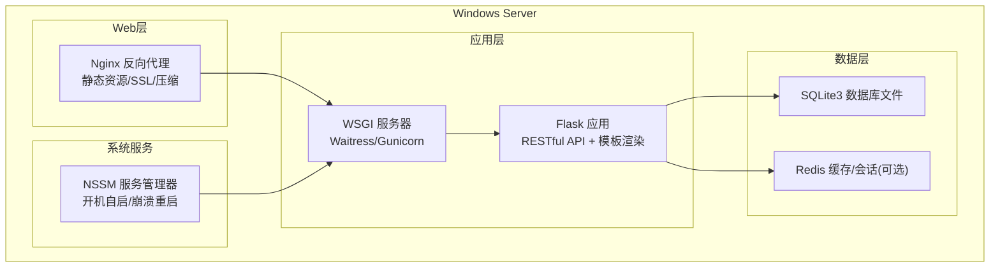
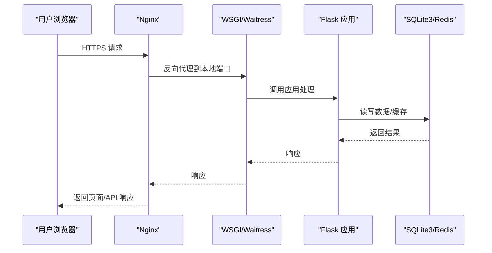
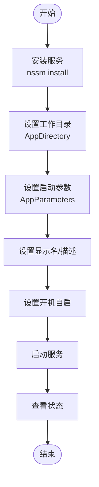
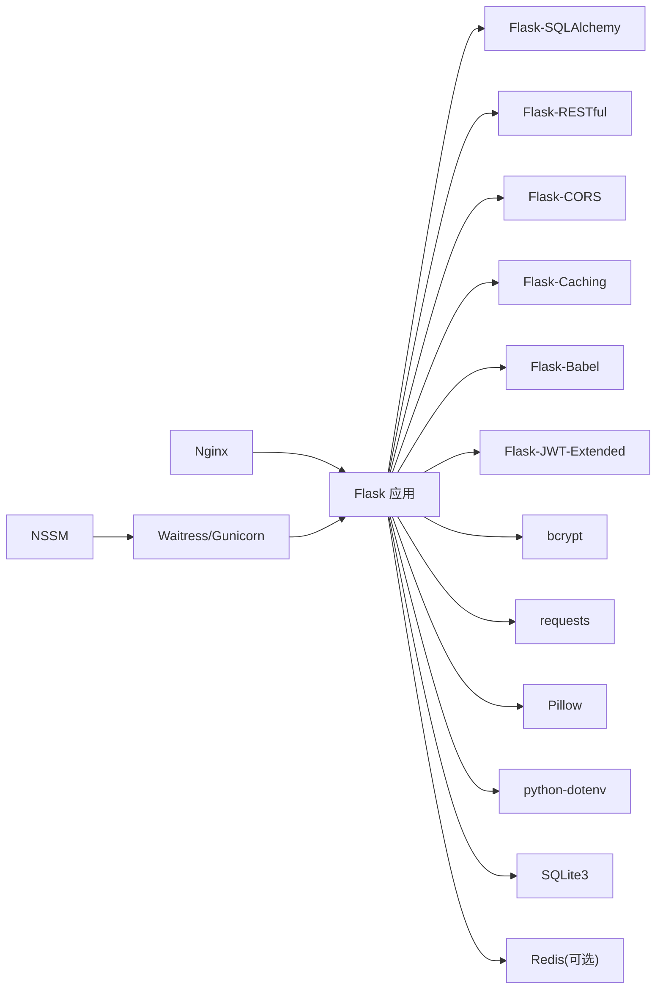

# Windows Server配置

<cite>
**本文引用的文件**
- [企业网站CMS系统开发需求文档.ini](file://企业网站CMS系统开发需求文档.ini)
- [企业网站CMS系统详细需求文档.md](file://企业网站CMS系统详细需求文档.md)
</cite>

## 目录
1. [简介](#简介)
2. [项目结构](#项目结构)
3. [核心组件](#核心组件)
4. [架构总览](#架构总览)
5. [详细组件分析](#详细组件分析)
6. [依赖分析](#依赖分析)
7. [性能考量](#性能考量)
8. [故障排除指南](#故障排除指南)
9. [结论](#结论)
10. [附录](#附录)

## 简介
本文件面向在 Windows Server 环境中部署企业网站 CMS 系统的运维与开发人员，基于仓库中的需求文档，系统梳理系统配置要求、硬件与软件依赖、IIS/Nginx 集成（可选）、防火墙与端口、Python 运行环境与虚拟环境、NSSM 服务管理、系统服务与权限、安全策略、监控与性能调优以及常见故障排除方法。文档以“Windows Server 2019/2022 + Nginx + Flask + SQLite3”为主要部署形态，兼顾可选的 Redis 缓存与云存储能力。

## 项目结构
- 项目采用前后端分离架构，后端使用 Python Flask，前端可选 React/Vue 或纯 HTML 模板渲染。
- 部署层使用 Nginx 作为反向代理与静态资源服务，Flask 应用通过 WSGI 服务器对外提供 API 与模板渲染。
- 数据层使用 SQLite3（零配置、ACID、便于备份与运维），可选 Redis 用于缓存与会话。
- Windows Server 上通过 NSSM 将 Flask 应用注册为系统服务，实现开机自启与崩溃重启。

**图表来源**
- [企业网站CMS系统详细需求文档.md](file://企业网站CMS系统详细需求文档.md#L28-L57)
- [企业网站CMS系统详细需求文档.md](file://企业网站CMS系统详细需求文档.md#L631-L638)
- [企业网站CMS系统详细需求文档.md](file://企业网站CMS系统详细需求文档.md#L1324-L1344)

**章节来源**
- [企业网站CMS系统详细需求文档.md](file://企业网站CMS系统详细需求文档.md#L22-L57)
- [企业网站CMS系统详细需求文档.md](file://企业网站CMS系统详细需求文档.md#L631-L638)

## 核心组件
- 操作系统与服务器：Windows Server 2019/2022
- Web 服务器：Nginx 1.24+（反向代理、静态资源、Gzip 压缩、SSL）
- 应用服务器：Flask + Waitress（Windows 友好）或 Gunicorn（可选）
- 数据库：SQLite3（零服务、ACID、便于备份）
- 缓存：Redis（可选，高并发时启用）
- 进程管理：NSSM（将 WSGI/Flask 注册为 Windows 服务）
- 日志与监控：logging + RotatingFileHandler（可选 Flask-Profiler/Sentry）

**章节来源**
- [企业网站CMS系统详细需求文档.md](file://企业网站CMS系统详细需求文档.md#L631-L638)
- [企业网站CMS系统详细需求文档.md](file://企业网站CMS系统详细需求文档.md#L555-L594)
- [企业网站CMS系统详细需求文档.md](file://企业网站CMS系统详细需求文档.md#L1324-L1344)

## 架构总览
系统采用“浏览器 -> Nginx -> Flask -> SQLite3/Redis”的典型三层架构。Nginx 负责 HTTPS 终止、静态资源缓存、Gzip 压缩与反向代理；Flask 提供 RESTful API 与模板渲染；SQLite3 存储业务数据，Redis 提供可选缓存与会话。

**图表来源**
- [企业网站CMS系统详细需求文档.md](file://企业网站CMS系统详细需求文档.md#L1143-L1230)
- [企业网站CMS系统详细需求文档.md](file://企业网站CMS系统详细需求文档.md#L1232-L1302)

**章节来源**
- [企业网站CMS系统详细需求文档.md](file://企业网站CMS系统详细需求文档.md#L1143-L1230)
- [企业网站CMS系统详细需求文档.md](file://企业网站CMS系统详细需求文档.md#L1232-L1302)

## 详细组件分析

### Windows Server 2019/2022 系统要求与硬件配置
- 操作系统：Windows Server 2019/2022（建议使用 64 位）
- 硬件建议：
  - CPU：2 核起步，建议 4 核以上（并发与 I/O 密集场景建议更高）
  - 内存：4GB 起步，建议 8GB 以上（SQLite 读多写少场景下可较低）
  - 磁盘：系统盘 60GB+，数据盘按媒体与日志容量规划（SQLite 单文件，便于备份）
- 网络：开放 80/443 端口，允许外网访问；内部仅开放必要的管理端口（如远程桌面）
- 安全基线：启用 Windows Defender、定期更新、最小权限原则、账户策略加固

**章节来源**
- [企业网站CMS系统详细需求文档.md](file://企业网站CMS系统详细需求文档.md#L631-L638)

### IIS 集成配置（可选）
- 若企业已有 IIS 基础设施，可将 Flask 应用通过 IIS 的 URL 重写与反向代理集成至现有站点，但推荐使用 Nginx 作为统一入口，减少复杂度。
- 如需 IIS 集成，建议：
  - 在 IIS 中配置静态资源与 URL 重写规则
  - 使用 ARR（Application Request Routing）或反向代理模块转发到本地 Flask 端口
  - 证书与 HTTPS 仍建议由 Nginx 处理，IIS 仅做边缘代理

**章节来源**
- [企业网站CMS系统详细需求文档.md](file://企业网站CMS系统详细需求文档.md#L1143-L1230)

### 防火墙规则与端口配置
- 入站规则建议：
  - TCP 80：HTTP 重定向至 HTTPS
  - TCP 443：HTTPS（SSL 证书）
  - TCP 22/3389：远程管理端口（最小暴露、强认证）
- 出站规则：允许访问外部服务（如邮件、CDN、云存储 SDK）
- 内部规则：Flask 本地回环端口（默认 8000）仅本地访问，避免外网直连

**章节来源**
- [企业网站CMS系统详细需求文档.md](file://企业网站CMS系统详细需求文档.md#L1143-L1230)

### Python 运行环境安装、虚拟环境与 PATH 配置
- Python 版本：3.9+
- 安装步骤要点：
  - 安装 Python 3.9+（建议勾选“Add to PATH”）
  - 创建虚拟环境：python -m venv <env_name>
  - 激活虚拟环境：Windows 使用 venv\Scripts\activate
  - 安装依赖：pip install -r requirements.txt
- 环境变量：
  - 使用 .env 文件集中管理敏感配置（如 SECRET_KEY、DATABASE_URL、REDIS_URL、SMTP 等）
  - 在系统环境变量中设置 FLASK_ENV=production，确保生产模式加载正确配置
- PATH 配置：确保 Python 与 pip、虚拟环境 Scripts 目录在 PATH 中

**章节来源**
- [企业网站CMS系统详细需求文档.md](file://企业网站CMS系统详细需求文档.md#L558-L560)
- [企业网站CMS系统详细需求文档.md](file://企业网站CMS系统详细需求文档.md#L1304-L1322)
- [企业网站CMS系统详细需求文档.md](file://企业网站CMS系统详细需求文档.md#L1346-L1356)

### NSSM 服务管理器使用
- 目标：将 Flask 应用（WSGI/Waitress）注册为 Windows 服务，实现开机自启与崩溃重启。
- 常用命令与参数：
  - 安装服务：nssm install <服务名> "<可执行文件路径>"
  - 设置工作目录：nssm set <服务名> AppDirectory "<项目根目录>"
  - 设置启动参数：nssm set <服务名> AppParameters "<WSGI 参数>"
  - 设置显示名与描述：nssm set <服务名> DisplayName "<显示名>"
  - 设置描述：nssm set <服务名> Description "<描述>"
  - 设置启动类型：nssm set <服务名> Start SERVICE_AUTO_START
  - 启动服务：nssm start <服务名>
  - 查看状态：nssm status <服务名>
- 示例参数（WSGI/Waitress）：
  - -w 4 -b 127.0.0.1:8000 --access-logfile D:\cms\logs\access.log --error-logfile D:\cms\logs\error.log wsgi:app

**图表来源**
- [企业网站CMS系统详细需求文档.md](file://企业网站CMS系统详细需求文档.md#L1324-L1344)

**章节来源**
- [企业网站CMS系统详细需求文档.md](file://企业网站CMS系统详细需求文档.md#L1324-L1344)

### 系统服务配置、用户权限与安全策略
- 服务账户：
  - 使用专用服务账户运行 Flask 服务，避免使用 Administrator
  - 该账户需具备读取项目目录、写入日志目录、访问数据库文件的权限
- 权限最小化：
  - 仅授予必要文件与目录权限（项目目录、logs、data、media）
  - 禁用不必要的服务与端口
- 安全策略：
  - 启用 Windows Defender 防病毒与实时保护
  - 配置强密码策略与账户锁定策略
  - 定期更新系统与补丁
  - 使用 HTTPS 强制跳转与 HSTS 头（Nginx 层）

**章节来源**
- [企业网站CMS系统详细需求文档.md](file://企业网站CMS系统详细需求文档.md#L1143-L1230)
- [企业网站CMS系统详细需求文档.md](file://企业网站CMS系统详细需求文档.md#L1078-L1140)

### 监控、性能调优与日志管理
- 日志：
  - 使用 logging + RotatingFileHandler 管理 Flask 应用日志
  - Nginx 访问与错误日志分别输出到指定路径
- 性能：
  - 合理设置 WSGI worker 数量（-w 4 为示例，依据 CPU 核心数与负载调整）
  - 启用 Gzip 压缩与静态资源缓存
  - SQLite 读多写少场景下，适当增加缓存命中率，避免热点写入
- 监控：
  - 可选 Flask-Profiler（开发/测试）或 Sentry（生产错误追踪）
  - 结合系统自带性能监视器（任务管理器、资源监视器）观察 CPU/内存/磁盘 IO

**章节来源**
- [企业网站CMS系统详细需求文档.md](file://企业网站CMS系统详细需求文档.md#L655-L658)
- [企业网站CMS系统详细需求文档.md](file://企业网站CMS系统详细需求文档.md#L1143-L1230)
- [企业网站CMS系统详细需求文档.md](file://企业网站CMS系统详细需求文档.md#L1320-L1322)

## 依赖分析
- 技术栈依赖：
  - 后端：Flask + Flask-* 扩展（SQLAlchemy、RESTful、CORS、Caching、Babel、JWT 等）
  - 数据库：SQLite3（零服务），可选 Redis
  - WSGI：Waitress（Windows 友好），可选 Gunicorn
  - 前端：React/Vue（可选）或纯 HTML 模板渲染
- 部署依赖：
  - Nginx 1.24+（反向代理、静态资源、SSL）
  - NSSM（Windows 服务注册）
  - Python 3.9+ 与虚拟环境

**图表来源**
- [企业网站CMS系统详细需求文档.md](file://企业网站CMS系统详细需求文档.md#L558-L594)
- [企业网站CMS系统详细需求文档.md](file://企业网站CMS系统详细需求文档.md#L1304-L1322)
- [企业网站CMS系统详细需求文档.md](file://企业网站CMS系统详细需求文档.md#L1324-L1344)

**章节来源**
- [企业网站CMS系统详细需求文档.md](file://企业网站CMS系统详细需求文档.md#L558-L594)
- [企业网站CMS系统详细需求文档.md](file://企业网站CMS系统详细需求文档.md#L1304-L1322)

## 性能考量
- 响应时间目标：
  - 首页加载 < 2 秒，内页 < 3 秒，API < 500ms，数据库查询 < 100ms
- 并发与资源：
  - 支持 1000+ 并发用户，内存使用 < 2GB，CPU 使用 < 70%，磁盘 IO < 80%
- 优化手段：
  - 启用 Nginx Gzip 压缩与静态资源缓存
  - 合理配置 WSGI worker 数量与超时
  - SQLite 读多写少场景下，避免热点写入，必要时引入 Redis 缓存
  - 前端资源 CDN 加速（可选）

**章节来源**
- [企业网站CMS系统详细需求文档.md](file://企业网站CMS系统详细需求文档.md#L1362-L1380)

## 故障排除指南
- 服务无法启动（NSSM）：
  - 检查服务账户权限与路径配置
  - 查看服务状态与日志输出（AppParameters 指定的日志文件）
- Flask 应用 502/504：
  - 检查 Nginx 反代是否指向正确端口
  - 检查 WSGI 是否正常监听（默认 8000）
- 静态资源 404：
  - 检查 Nginx 静态资源路径 alias 与 expires 配置
- HTTPS 证书问题：
  - 确认证书与私钥路径正确，协议与加密套件配置
- 数据库文件异常：
  - 确认 SQLite 文件存在且可读写，备份目录权限正确

**章节来源**
- [企业网站CMS系统详细需求文档.md](file://企业网站CMS系统详细需求文档.md#L1143-L1230)
- [企业网站CMS系统详细需求文档.md](file://企业网站CMS系统详细需求文档.md#L1324-L1344)

## 结论
本配置文档基于仓库需求文档，明确了在 Windows Server 2019/2022 上部署 CMS 系统的软硬件要求、Nginx 反向代理、Flask 应用与 SQLite3/Redis 的组合、NSSM 服务管理、安全与权限策略、监控与性能优化以及常见故障排查。实际部署中可根据业务规模与并发需求调整 WSGI worker 数量、启用 Redis 缓存与 CDN，并持续完善日志与监控体系。

## 附录
- 配置清单与参考路径：
  - Nginx 配置示例：[nginx.conf 示例](file://企业网站CMS系统详细需求文档.md#L1143-L1230)
  - Flask 配置示例：[config.py 示例](file://企业网站CMS系统详细需求文档.md#L1232-L1302)
  - 依赖清单：[requirements.txt 示例](file://企业网站CMS系统详细需求文档.md#L1304-L1322)
  - NSSM 服务注册示例：[Windows 服务配置](file://企业网站CMS系统详细需求文档.md#L1324-L1344)
  - 环境变量示例：[环境变量配置](file://企业网站CMS系统详细需求文档.md#L1346-L1356)