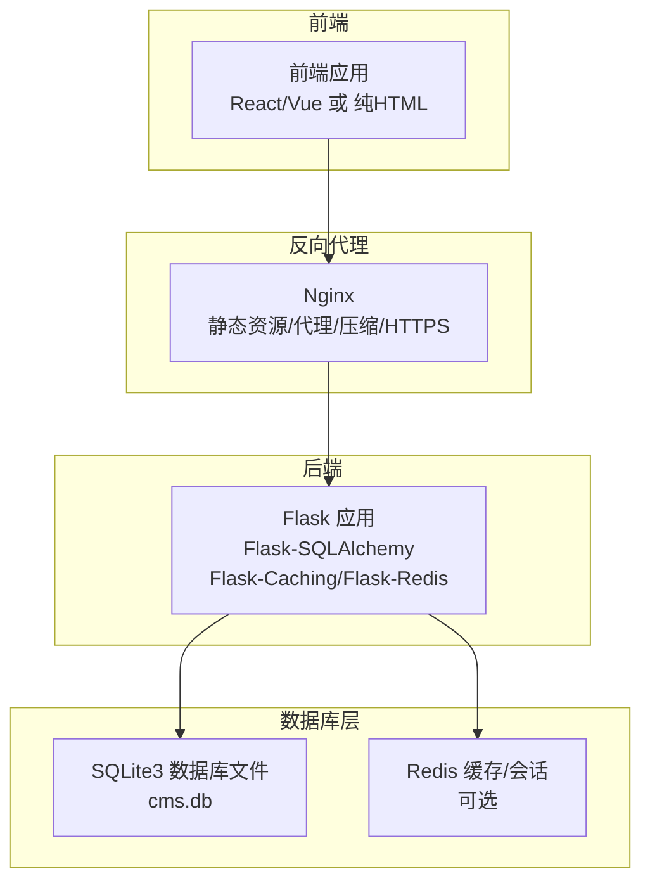
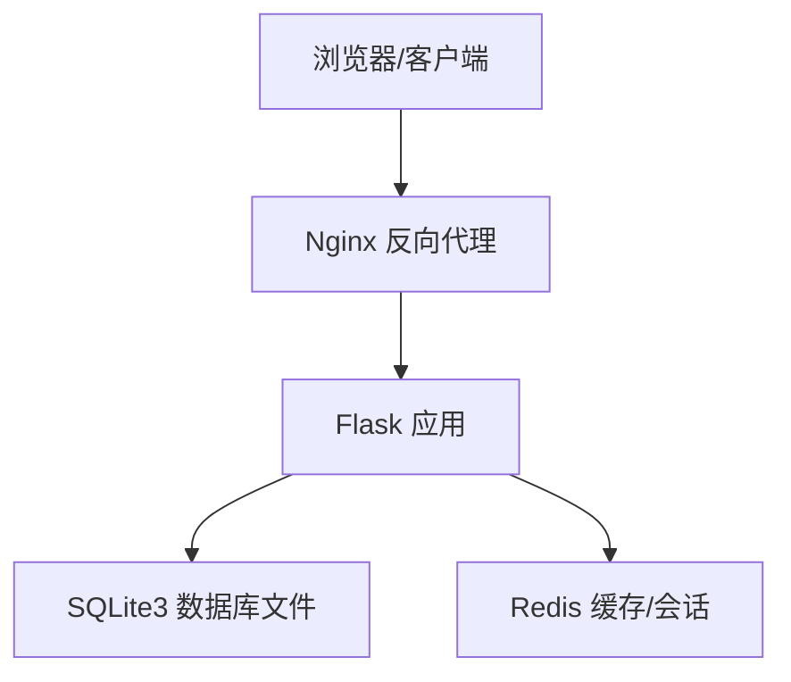
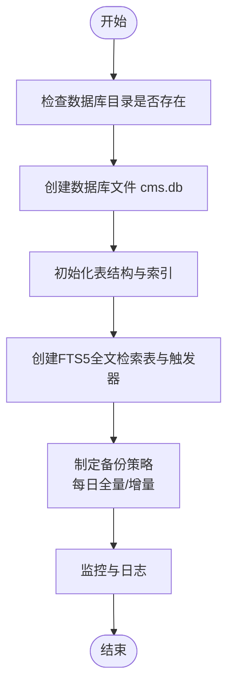
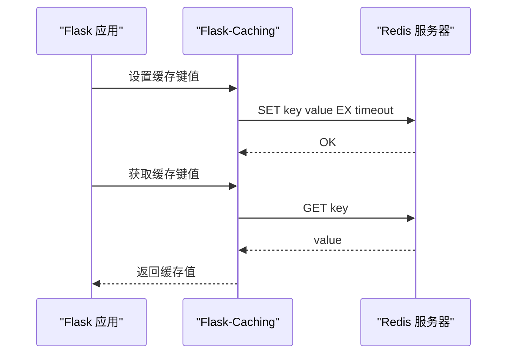
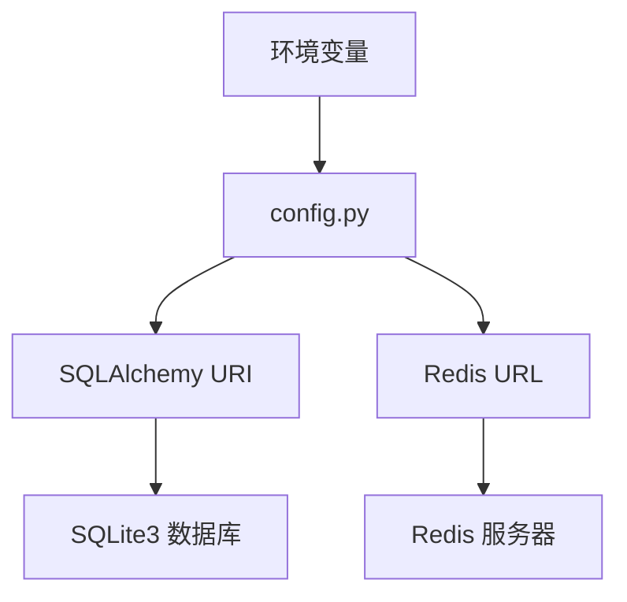
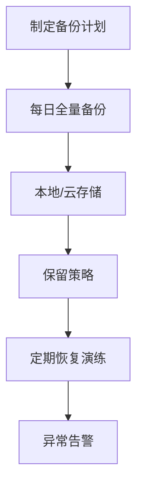
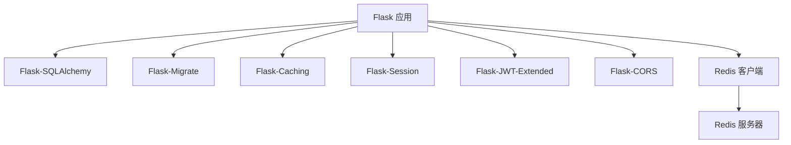

# 数据库配置

<cite>
**本文引用的文件**
- [企业网站CMS系统开发需求文档.ini](file://企业网站CMS系统开发需求文档.ini)
- [企业网站CMS系统详细需求文档.md](file://企业网站CMS系统详细需求文档.md)
- [开发计划表_2月4日-2月12日.md](file://开发计划表_2月4日-2月12日.md)
</cite>

## 目录
1. [简介](#简介)
2. [项目结构](#项目结构)
3. [核心组件](#核心组件)
4. [架构总览](#架构总览)
5. [详细组件分析](#详细组件分析)
6. [依赖分析](#依赖分析)
7. [性能考量](#性能考量)
8. [故障排查指南](#故障排查指南)
9. [结论](#结论)
10. [附录](#附录)

## 简介
本文件面向企业网站CMS系统的数据库配置与运维，聚焦SQLite3与Redis在该系统中的配置与使用。依据项目文档，系统采用Python Flask + SQLite3 + Nginx + Windows Server的组合，数据库层以SQLite3为主，Redis为可选缓存与会话存储。本文将从数据库文件创建与初始化、权限与备份策略、性能优化（WAL、缓存、索引）、Redis配置（连接池、持久化、内存管理）、连接配置与连接字符串、监控与慢查询分析、以及数据迁移与版本升级等方面进行系统化说明，并提供可视化图示帮助理解。

## 项目结构
- 后端采用Flask + SQLAlchemy + Flask-Migrate，数据库连接通过SQLAlchemy配置，支持SQLite3与Redis。
- 前端可选React/Vue或纯HTML模板渲染，API统一走Nginx反向代理。
- 部署在Windows Server，使用Waitress或Gunicorn（Windows友好）作为WSGI服务器，结合NSSM注册Windows服务。

**图示来源**
- [企业网站CMS系统详细需求文档.md](file://企业网站CMS系统详细需求文档.md#L22-L57)
- [开发计划表_2月4日-2月12日.md](file://开发计划表_2月4日-2月12日.md#L440-L500)

**章节来源**
- [企业网站CMS系统详细需求文档.md](file://企业网站CMS系统详细需求文档.md#L22-L57)
- [开发计划表_2月4日-2月12日.md](file://开发计划表_2月4日-2月12日.md#L440-L500)

## 核心组件
- SQLite3数据库文件：单文件数据库，零配置，适合中小规模网站；提供ACID事务支持，便于备份与迁移。
- Redis：可选用于缓存与会话存储，支持Flask-Caching与Flask-Session的Redis后端。
- Flask配置：集中于config.py，包含数据库URI、Redis连接、缓存与会话配置、JWT、文件上传、CORS等。
- 数据库迁移：使用Flask-Migrate，支持SQLite3的迁移与版本演进。
- 备份与恢复：数据库文件直接复制即可备份；支持手动/定时备份与恢复接口。

**章节来源**
- [企业网站CMS系统详细需求文档.md](file://企业网站CMS系统详细需求文档.md#L569-L578)
- [企业网站CMS系统详细需求文档.md](file://企业网站CMS系统详细需求文档.md#L1234-L1302)
- [开发计划表_2月4日-2月12日.md](file://开发计划表_2月4日-2月12日.md#L459-L463)

## 架构总览
系统采用前后端分离架构，数据库层以SQLite3为核心，Redis为可选缓存层。Nginx负责静态资源、HTTPS终止与反向代理。Flask应用通过SQLAlchemy访问SQLite3，通过Flask-Caching/Flask-Session访问Redis（可选）。部署在Windows Server，使用Waitress/Gunicorn与NSSM服务管理。

**图示来源**
- [企业网站CMS系统详细需求文档.md](file://企业网站CMS系统详细需求文档.md#L22-L57)
- [企业网站CMS系统详细需求文档.md](file://企业网站CMS系统详细需求文档.md#L1143-L1230)

**章节来源**
- [企业网站CMS系统详细需求文档.md](file://企业网站CMS系统详细需求文档.md#L22-L57)
- [企业网站CMS系统详细需求文档.md](file://企业网站CMS系统详细需求文档.md#L1143-L1230)

## 详细组件分析

### SQLite3数据库配置与使用
- 数据库文件组织：数据库文件位于D:/cms/data/cms.db，备份目录为D:/cms/data/backups，日志目录为D:/cms/data/logs。
- 连接配置：通过SQLAlchemy的DATABASE_URL或SQLALCHEMY_DATABASE_URI指定，示例为sqlite:///D:/cms/data/cms.db。
- 迁移与版本管理：使用Flask-Migrate，支持SQLite3的迁移脚本生成与执行。
- 全文搜索：SQLite不支持FULLTEXT，采用FTS5虚拟表配合触发器实现全文检索。
- 索引与查询：核心表包含必要索引（如email、status、slug、published_at等），避免N+1查询，优化查询性能。
- 备份与恢复：直接复制数据库文件进行备份；恢复时停止服务后替换数据库文件并重启。
- 权限设置：数据库文件所在目录与文件本身需具备合适的读写权限，确保应用进程可读写。

**图示来源**
- [企业网站CMS系统详细需求文档.md](file://企业网站CMS系统详细需求文档.md#L704-L712)
- [企业网站CMS系统详细需求文档.md](file://企业网站CMS系统详细需求文档.md#L906-L938)

**章节来源**
- [企业网站CMS系统详细需求文档.md](file://企业网站CMS系统详细需求文档.md#L704-L712)
- [企业网站CMS系统详细需求文档.md](file://企业网站CMS系统详细需求文档.md#L906-L938)
- [开发计划表_2月4日-2月12日.md](file://开发计划表_2月4日-2月12日.md#L459-L463)

### Redis配置（可选）
- 连接配置：通过REDIS_URL指定，如redis://localhost:6379/0；可选用于缓存与会话。
- 缓存配置：CACHE_TYPE=redis，CACHE_REDIS_URL=REDIS_URL，CACHE_DEFAULT_TIMEOUT=300。
- 会话配置：SESSION_TYPE=redis，SESSION_REDIS=redis://localhost:6379/1，PERMANENT_SESSION_LIFETIME=24h。
- 连接池：Redis客户端库默认具备连接池能力，可通过环境变量或客户端参数调优（如最大连接数、超时等）。
- 持久化与内存：Redis持久化可选RDB或AOF，结合内存上限配置（maxmemory）与淘汰策略（如volatile-ttl）保障稳定性。
- 监控：使用INFO命令查看连接数、内存、命中率等指标；慢查询日志（slowlog）定位热点命令。

**图示来源**
- [企业网站CMS系统详细需求文档.md](file://企业网站CMS系统详细需求文档.md#L1254-L1265)

**章节来源**
- [企业网站CMS系统详细需求文档.md](file://企业网站CMS系统详细需求文档.md#L1254-L1265)

### 数据库连接配置与连接字符串
- SQLite3连接字符串：sqlite:///D:/cms/data/cms.db（绝对路径）。
- Redis连接字符串：redis://localhost:6379/0（可带密码与DB索引）。
- 环境变量：DATABASE_URL、REDIS_URL、JWT_SECRET_KEY等通过环境变量注入，便于不同环境切换。
- Flask配置：config.py中集中管理，开发/生产环境分别提供配置类，支持SQLALCHEMY_ECHO调试。

**图示来源**
- [企业网站CMS系统详细需求文档.md](file://企业网站CMS系统详细需求文档.md#L1245-L1255)
- [企业网站CMS系统详细需求文档.md](file://企业网站CMS系统详细需求文档.md#L1346-L1356)

**章节来源**
- [企业网站CMS系统详细需求文档.md](file://企业网站CMS系统详细需求文档.md#L1245-L1255)
- [企业网站CMS系统详细需求文档.md](file://企业网站CMS系统详细需求文档.md#L1346-L1356)

### 性能优化配置
- SQLite3优化：
  - WAL模式：启用WAL可显著提升并发读取性能，减少锁竞争。
  - 缓存大小：通过PRAGMA设置cache_size，平衡内存与I/O。
  - 索引优化：为高频查询列建立索引，避免全表扫描；对FTS5全文检索表使用虚拟表与触发器。
  - 查询优化：避免N+1查询，使用JOIN与批量操作；合理分页。
- Redis优化：
  - 连接池：合理设置最大连接数与超时，避免阻塞。
  - 内存管理：设置maxmemory与淘汰策略，定期清理过期键。
  - 持久化：根据一致性与性能需求选择RDB/AOF，或组合策略。
- 前端与CDN：静态资源CDN加速，减少数据库压力。

**章节来源**
- [企业网站CMS系统详细需求文档.md](file://企业网站CMS系统详细需求文档.md#L538-L542)
- [企业网站CMS系统详细需求文档.md](file://企业网站CMS系统详细需求文档.md#L1254-L1265)

### 数据备份策略与恢复流程
- 备份策略：每日全量备份数据库文件，保留一定周期（如30天），支持异地备份至云存储。
- 备份流程：停止服务 -> 复制数据库文件 -> 启动服务。
- 恢复流程：停止服务 -> 替换数据库文件 -> 启动服务。
- 备份接口：系统提供备份与恢复API，便于自动化调度。

**图示来源**
- [企业网站CMS系统详细需求文档.md](file://企业网站CMS系统详细需求文档.md#L1406-L1415)
- [企业网站CMS系统详细需求文档.md](file://企业网站CMS系统详细需求文档.md#L1073-L1076)

**章节来源**
- [企业网站CMS系统详细需求文档.md](file://企业网站CMS系统详细需求文档.md#L1406-L1415)
- [企业网站CMS系统详细需求文档.md](file://企业网站CMS系统详细需求文档.md#L1073-L1076)

### 数据迁移与版本升级
- 迁移工具：Flask-Migrate提供数据库迁移能力，支持SQLite3的迁移脚本生成与执行。
- 版本升级：通过迁移脚本逐步升级数据库结构，确保向后兼容；升级前先备份数据库。
- 兼容性处理：在迁移脚本中处理字段变更、索引重建、默认值更新等；对不支持的SQLite语法进行条件处理。

**章节来源**
- [企业网站CMS系统详细需求文档.md](file://企业网站CMS系统详细需求文档.md#L560-L561)
- [开发计划表_2月4日-2月12日.md](file://开发计划表_2月4日-2月12日.md#L459-L463)

### 监控、慢查询日志与性能分析
- 日志：使用logging模块与RotatingFileHandler记录访问与错误日志。
- 慢查询：SQLite可通过PRAGMA设置慢查询阈值与日志输出；Redis可通过slowlog查看慢命令。
- 性能分析：结合Nginx访问日志、Flask请求耗时、数据库查询耗时与Redis命中率进行综合分析。
- 告警：磁盘空间、错误率、响应时间等指标纳入监控告警。

**章节来源**
- [企业网站CMS系统详细需求文档.md](file://企业网站CMS系统详细需求文档.md#L655-L658)
- [企业网站CMS系统详细需求文档.md](file://企业网站CMS系统详细需求文档.md#L1417-L1422)

## 依赖分析
- Flask生态：Flask-SQLAlchemy、Flask-Migrate、Flask-Caching、Flask-Session、Flask-JWT-Extended、Flask-CORS等。
- 数据库与缓存：SQLite3（内置）、Redis（可选）。
- 部署与服务：Nginx、Waitress/Gunicorn、NSSM（Windows服务）。

**图示来源**
- [企业网站CMS系统详细需求文档.md](file://企业网站CMS系统详细需求文档.md#L1304-L1322)

**章节来源**
- [企业网站CMS系统详细需求文档.md](file://企业网站CMS系统详细需求文档.md#L1304-L1322)

## 性能考量
- 响应时间：页面加载<3秒，API响应<500ms，数据库查询<100ms。
- 并发性能：支持1000+并发用户，SQLite读取性能满足场景。
- 资源占用：内存<2GB，CPU<70%，磁盘IO<80%。
- 缓存策略：页面缓存与数据缓存结合，Redis用于热点数据与会话存储。

**章节来源**
- [企业网站CMS系统详细需求文档.md](file://企业网站CMS系统详细需求文档.md#L1362-L1380)

## 故障排查指南
- 数据库文件权限：确保应用进程对数据库文件与目录具有读写权限。
- 备份失败：检查备份目录权限与磁盘空间，确认备份脚本执行环境变量正确。
- Redis不可用：检查Redis服务状态、连接字符串、防火墙与网络策略。
- 慢查询定位：启用SQLite慢查询日志与Redis slowlog，结合业务热点接口进行优化。
- 迁移失败：核对迁移脚本与数据库版本，必要时回滚并修复不兼容语句。

**章节来源**
- [企业网站CMS系统详细需求文档.md](file://企业网站CMS系统详细需求文档.md#L1417-L1422)

## 结论
本项目以SQLite3为核心数据库，结合Redis（可选）实现高效、易维护的CMS系统。通过合理的索引、WAL模式与缓存策略，系统在中小规模场景下具备优秀的性能与可靠性。配合完善的备份与恢复流程、迁移与版本管理机制，能够满足企业网站的日常运营与扩展需求。若未来业务增长导致并发与数据量上升，可评估迁移到MySQL等关系型数据库或引入读写分离、分库分表等方案。

## 附录
- 环境变量模板：包含FLASK_ENV、SECRET_KEY、JWT_SECRET_KEY、DATABASE_URL、REDIS_URL、MAIL_*等。
- 部署步骤：创建目录、安装依赖、初始化数据库、配置Nginx、启动服务、前端构建与部署。
- 备份与恢复接口：提供备份创建、备份列表与恢复接口，便于自动化运维。

**章节来源**
- [企业网站CMS系统详细需求文档.md](file://企业网站CMS系统详细需求文档.md#L1346-L1356)
- [开发计划表_2月4日-2月12日.md](file://开发计划表_2月4日-2月12日.md#L439-L506)