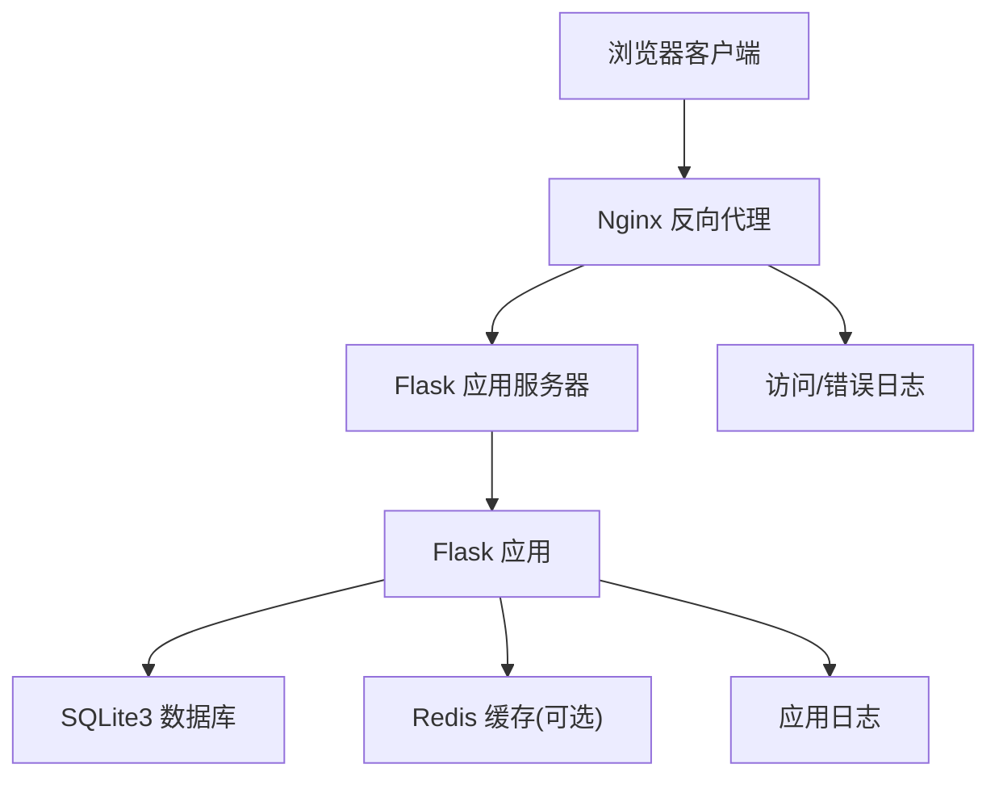
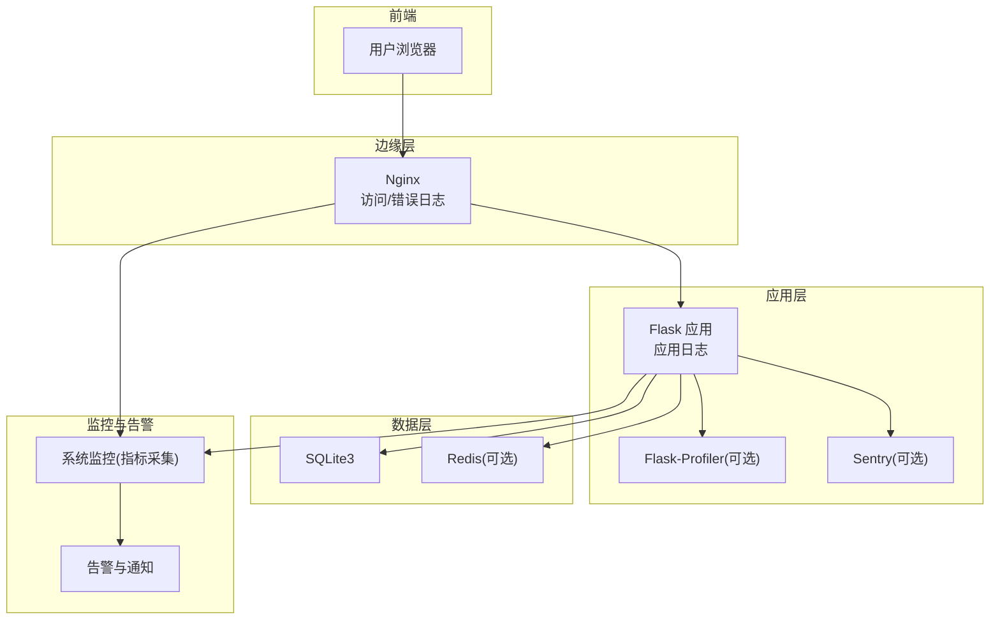
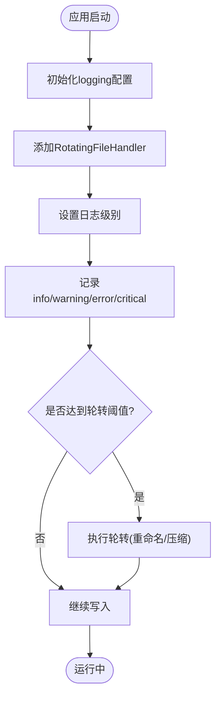
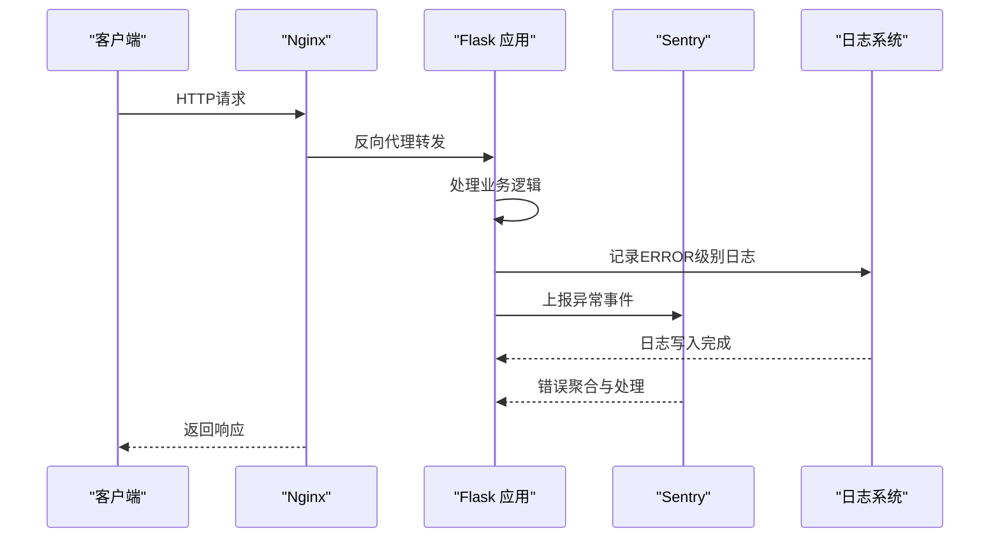
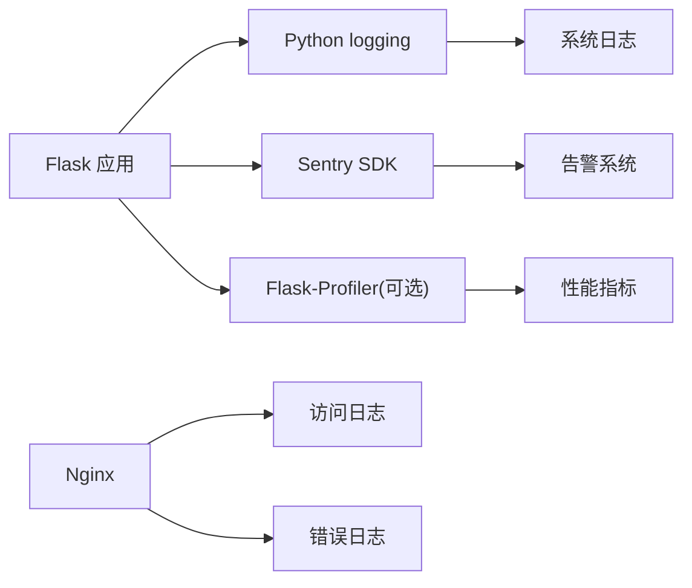

# 监控与日志管理

<cite>
**本文引用的文件**
- [企业网站CMS系统开发需求文档.ini](file://企业网站CMS系统开发需求文档.ini)
- [企业网站CMS系统详细需求文档.md](file://企业网站CMS系统详细需求文档.md)
</cite>

## 目录
1. [简介](#简介)
2. [项目结构](#项目结构)
3. [核心组件](#核心组件)
4. [架构总览](#架构总览)
5. [组件详解](#组件详解)
6. [依赖关系分析](#依赖关系分析)
7. [性能考量](#性能考量)
8. [故障排查指南](#故障排查指南)
9. [结论](#结论)
10. [附录](#附录)

## 简介
本文件面向企业网站CMS系统的监控与日志管理，结合项目文档中的技术栈与部署架构，系统化梳理应用日志配置、系统监控、错误追踪、性能监控工具、告警与通知、日志分析与容量规划等主题，帮助运维与开发团队建立完善的可观测性体系，保障系统稳定性与可维护性。

## 项目结构
- 技术栈与运行环境
  - 后端：Python Flask + SQLite3（可选Redis）
  - 反向代理：Nginx
  - WSGI服务器：Gunicorn（Linux）或 Waitress（Windows）
  - 部署：Windows Server + NSSM注册服务
- 日志与监控要点
  - 日志：Python logging模块 + RotatingFileHandler
  - 性能监控：Flask-Profiler（可选）
  - 错误追踪：Sentry（可选）

**图表来源**
- [企业网站CMS系统详细需求文档.md](file://企业网站CMS系统详细需求文档.md#L22-L57)
- [企业网站CMS系统详细需求文档.md](file://企业网站CMS系统详细需求文档.md#L1143-L1230)
- [企业网站CMS系统详细需求文档.md](file://企业网站CMS系统详细需求文档.md#L1232-L1302)
- [企业网站CMS系统详细需求文档.md](file://企业网站CMS系统详细需求文档.md#L1324-L1356)

**章节来源**
- [企业网站CMS系统详细需求文档.md](file://企业网站CMS系统详细需求文档.md#L22-L57)
- [企业网站CMS系统详细需求文档.md](file://企业网站CMS系统详细需求文档.md#L1143-L1230)
- [企业网站CMS系统详细需求文档.md](file://企业网站CMS系统详细需求文档.md#L1232-L1302)
- [企业网站CMS系统详细需求文档.md](file://企业网站CMS系统详细需求文档.md#L1324-L1356)

## 核心组件
- 应用日志与RotatingFileHandler
  - 使用Python logging模块，配合RotatingFileHandler实现日志轮转，避免单文件过大。
  - 结合Nginx访问/错误日志，形成完整的前后端日志链路。
- 系统监控
  - CPU、内存、磁盘、网络：通过系统监控工具采集指标，结合告警阈值与通知机制。
- 错误追踪与Sentry
  - 集成Sentry进行错误捕获、聚合与上报，便于定位异常与统计错误趋势。
- 性能监控与APM
  - Flask-Profiler（可选）用于开发/测试阶段的函数级性能分析；生产环境可引入APM工具（如OpenTelemetry、DataDog等）进行全链路性能观测。
- 告警与通知
  - 基于监控指标设定阈值，触发邮件/短信等通知，确保问题及时处置。
- 日志分析与容量规划
  - 通过日志留存、增长趋势与峰值分析，制定日志保留策略与容量规划。

**章节来源**
- [企业网站CMS系统详细需求文档.md](file://企业网站CMS系统详细需求文档.md#L655-L658)
- [企业网站CMS系统详细需求文档.md](file://企业网站CMS系统详细需求文档.md#L1417-L1422)

## 架构总览
下图展示CMS系统在监控与日志方面的整体架构：Nginx负责反向代理与日志输出，Flask应用负责业务逻辑与应用日志，SQLite/Redis支撑数据与缓存，监控与告警贯穿整个链路。

**图表来源**
- [企业网站CMS系统详细需求文档.md](file://企业网站CMS系统详细需求文档.md#L22-L57)
- [企业网站CMS系统详细需求文档.md](file://企业网站CMS系统详细需求文档.md#L1143-L1230)
- [企业网站CMS系统详细需求文档.md](file://企业网站CMS系统详细需求文档.md#L1232-L1302)
- [企业网站CMS系统详细需求文档.md](file://企业网站CMS系统详细需求文档.md#L1324-L1356)
- [企业网站CMS系统详细需求文档.md](file://企业网站CMS系统详细需求文档.md#L655-L658)

## 组件详解

### 应用日志配置（Python logging + RotatingFileHandler）
- 日志模块与处理器
  - 使用Python logging模块统一管理日志输出。
  - 使用RotatingFileHandler实现日志轮转，避免单文件无限增长。
- 日志级别与输出
  - 建议将应用日志分为info/warning/error/critical等级别，便于分级检索与告警。
  - 在开发环境可开启更详细的DEBUG日志，在生产环境以INFO/ERROR为主。
- 日志路径与权限
  - 日志文件建议集中存放于独立目录，并设置合适的文件权限与磁盘配额。
- 与WSGI服务器日志联动
  - Nginx访问日志与错误日志可与Flask应用日志形成互补，便于定位请求到响应的全链路问题。
- 与Sentry联动
  - 对ERROR及以上级别的日志可接入Sentry，实现错误聚合与通知。

**图表来源**
- [企业网站CMS系统详细需求文档.md](file://企业网站CMS系统详细需求文档.md#L1232-L1302)
- [企业网站CMS系统详细需求文档.md](file://企业网站CMS系统详细需求文档.md#L1324-L1356)

**章节来源**
- [企业网站CMS系统详细需求文档.md](file://企业网站CMS系统详细需求文档.md#L1232-L1302)
- [企业网站CMS系统详细需求文档.md](file://企业网站CMS系统详细需求文档.md#L1324-L1356)

### 系统监控配置（CPU、内存、磁盘、网络）
- 指标采集
  - CPU：使用系统工具采集使用率、负载、上下文切换等。
  - 内存：采集物理内存与交换分区使用率、缓存命中率。
  - 磁盘：采集使用率、IOPS、吞吐、队列长度、inode使用。
  - 网络：采集带宽、连接数、丢包率、延迟。
- 监控工具
  - 可使用Prometheus + Grafana、Zabbix、Nagios等工具进行采集与可视化。
- 告警阈值建议
  - CPU使用率 > 80% 持续5分钟
  - 内存使用率 > 85%
  - 磁盘使用率 > 85%
  - 网络带宽 > 90%
- 通知机制
  - 邮件、短信、IM群机器人等多通道通知，区分严重/警告/一般级别。

**章节来源**
- [企业网站CMS系统详细需求文档.md](file://企业网站CMS系统详细需求文档.md#L1417-L1422)

### 错误追踪系统集成（Sentry）
- 集成方式
  - 在Flask应用中集成Sentry SDK，自动捕获未处理异常与上下文信息。
  - 对ERROR及以上级别的日志事件，同步上报至Sentry。
- 错误报告机制
  - 上报内容包含请求上下文、用户信息、堆栈跟踪、环境信息等。
  - 支持错误聚合、趋势分析、回归提醒。
- 与日志联动
  - Sentry与应用日志形成互补：日志用于审计与调试，Sentry用于错误聚合与告警。

**图表来源**
- [企业网站CMS系统详细需求文档.md](file://企业网站CMS系统详细需求文档.md#L655-L658)
- [企业网站CMS系统详细需求文档.md](file://企业网站CMS系统详细需求文档.md#L1417-L1422)

**章节来源**
- [企业网站CMS系统详细需求文档.md](file://企业网站CMS系统详细需求文档.md#L655-L658)
- [企业网站CMS系统详细需求文档.md](file://企业网站CMS系统详细需求文档.md#L1417-L1422)

### 性能监控工具（Flask-Profiler与APM）
- Flask-Profiler（可选）
  - 适用于开发/测试阶段，用于分析函数耗时、调用次数、热点路径。
  - 建议仅在受控环境下启用，避免影响生产性能。
- APM工具（生产环境推荐）
  - 生产环境建议引入APM（如OpenTelemetry、DataDog、New Relic等），实现全链路性能观测：
    - HTTP请求耗时、错误率、吞吐
    - 数据库慢查询、连接池使用
    - 缓存命中率、热点Key
    - 线程/协程阻塞、GC统计
- 与日志/告警联动
  - 将APM指标与Sentry错误事件结合，形成“性能-错误”的闭环分析。

**章节来源**
- [企业网站CMS系统详细需求文档.md](file://企业网站CMS系统详细需求文档.md#L655-L658)

### 告警配置、阈值与通知
- 告警维度
  - 服务可用性（HTTP 2xx/4xx/5xx占比、响应时间）
  - 系统资源（CPU、内存、磁盘、网络）
  - 应用指标（QPS、错误率、慢请求比例）
  - 日志异常（ERROR/WARNING突增）
- 阈值设定
  - 基于历史基线与SLA设定阈值，预留一定余量。
  - 区分不同级别告警，避免告警风暴。
- 通知渠道
  - 邮件、短信、IM群机器人、电话（严重级别）。
  - 建议配置静默窗口与抑制规则，减少重复通知。

**章节来源**
- [企业网站CMS系统详细需求文档.md](file://企业网站CMS系统详细需求文档.md#L1417-L1422)

### 日志分析、趋势分析与容量规划
- 日志分析
  - 结构化日志解析，提取关键字段（请求ID、用户ID、响应时间、错误码）。
  - 使用ELK/EFK或轻量工具进行检索与可视化。
- 趋势分析
  - 基于时间序列分析日志量与错误趋势，识别异常波动。
- 容量规划
  - 评估日志增长速率、保留周期与存储成本，制定轮转与归档策略。
  - 结合业务峰值与系统资源上限，确定日志保留时长与轮转大小。

**章节来源**
- [企业网站CMS系统详细需求文档.md](file://企业网站CMS系统详细需求文档.md#L1417-L1422)

## 依赖关系分析
- 组件耦合
  - Flask应用与日志系统、Sentry、APM工具存在松耦合的集成关系，可通过配置与中间件实现解耦。
  - Nginx日志与应用日志形成互补，便于端到端问题定位。
- 外部依赖
  - Python logging模块与第三方日志库（如watchdog、loguru）可选替换。
  - Sentry SDK与APM工具需遵循各自SDK与配置规范。
- 循环依赖与风险
  - 避免在日志处理中引入业务逻辑，防止循环依赖。
  - 监控与告警不应成为新的单点故障，建议异步化与降级策略。

**图表来源**
- [企业网站CMS系统详细需求文档.md](file://企业网站CMS系统详细需求文档.md#L655-L658)
- [企业网站CMS系统详细需求文档.md](file://企业网站CMS系统详细需求文档.md#L1143-L1230)
- [企业网站CMS系统详细需求文档.md](file://企业网站CMS系统详细需求文档.md#L1232-L1302)

**章节来源**
- [企业网站CMS系统详细需求文档.md](file://企业网站CMS系统详细需求文档.md#L655-L658)
- [企业网站CMS系统详细需求文档.md](file://企业网站CMS系统详细需求文档.md#L1143-L1230)
- [企业网站CMS系统详细需求文档.md](file://企业网站CMS系统详细需求文档.md#L1232-L1302)

## 性能考量
- 日志写入性能
  - 使用异步日志处理器或批量写入，避免阻塞主线程。
  - 合理设置轮转阈值与压缩策略，平衡磁盘与CPU开销。
- 监控开销
  - 采样与聚合策略降低监控系统自身开销。
  - APM工具在生产环境需谨慎配置采样率与追踪上下文。
- 资源限制
  - 在Windows Server环境下，注意Waitress/Gunicorn的资源占用与进程管理。

[本节为通用指导，无需特定文件引用]

## 故障排查指南
- 常见问题定位
  - 通过Nginx访问/错误日志定位请求失败与超时。
  - 通过Flask应用日志与Sentry错误事件定位业务异常。
  - 通过系统监控指标判断资源瓶颈与异常波动。
- 快速恢复
  - 临时降级非关键功能，释放资源。
  - 回滚最近变更，验证修复效果。
- 预防措施
  - 建立变更评审与回滚预案。
  - 定期演练故障场景，完善应急预案。

**章节来源**
- [企业网站CMS系统详细需求文档.md](file://企业网站CMS系统详细需求文档.md#L1417-L1422)

## 结论
通过将Python logging与RotatingFileHandler、Nginx日志、Sentry错误追踪、Flask-Profiler/APM工具以及系统监控与告警相结合，企业CMS系统可以建立起覆盖“日志-错误-性能-资源”的完整可观测性体系。建议在开发与测试阶段完善日志与错误追踪配置，在生产环境中逐步引入APM与系统监控，持续优化阈值与通知策略，确保系统稳定、可诊断、可优化。

[本节为总结性内容，无需特定文件引用]

## 附录
- 相关技术栈与工具
  - Python logging模块、RotatingFileHandler
  - Nginx访问/错误日志
  - Sentry SDK
  - Flask-Profiler（可选）
  - APM工具（如OpenTelemetry、DataDog等）
- 配置参考
  - Flask应用配置与WSGI参数
  - Windows服务注册与日志路径

**章节来源**
- [企业网站CMS系统详细需求文档.md](file://企业网站CMS系统详细需求文档.md#L1232-L1302)
- [企业网站CMS系统详细需求文档.md](file://企业网站CMS系统详细需求文档.md#L1324-L1356)