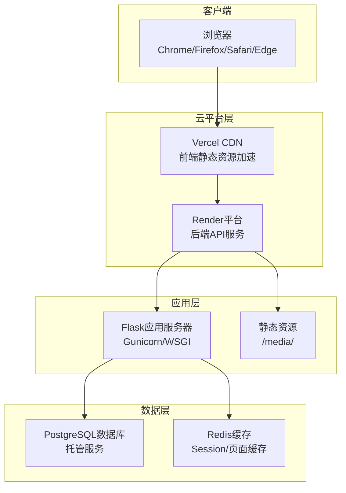
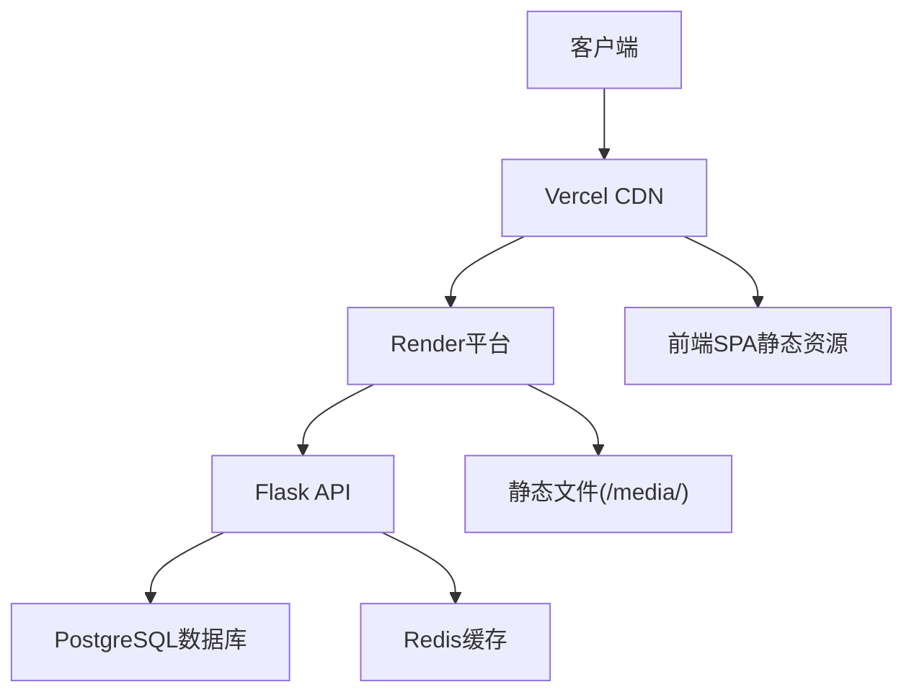
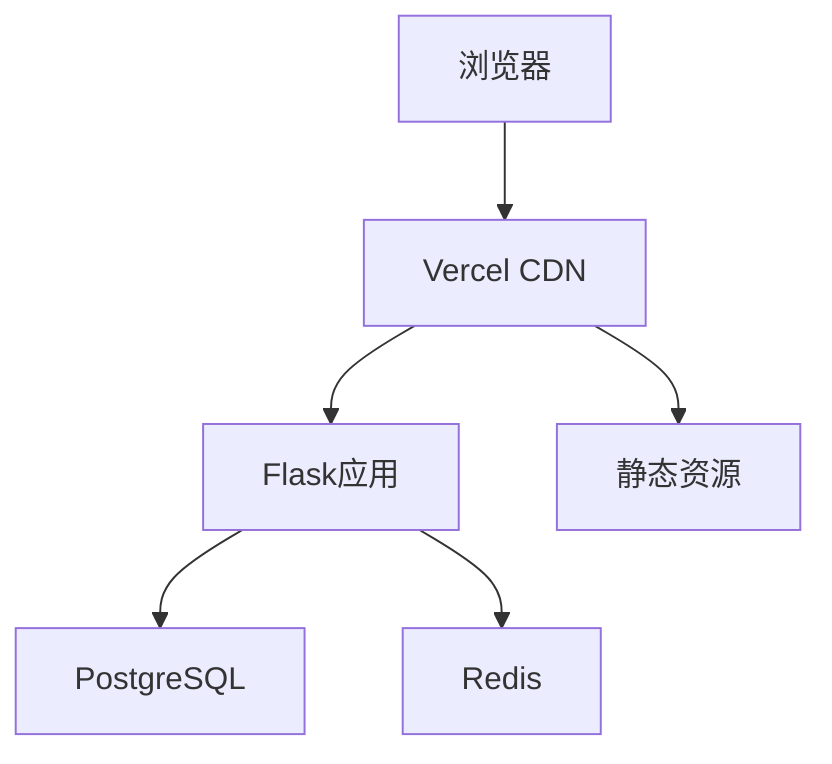

# 部署配置

<cite>
**本文档引用的文件**
- [企业网站CMS系统开发需求文档.ini](file://docs/企业网站CMS系统开发需求文档.ini)
- [requirements.txt](file://backend/requirements.txt)
- [.env](file://backend/.env)
- [config.py](file://backend/config.py)
- [run.py](file://backend/run.py)
- [app/__init__.py](file://backend/app/__init__.py)
- [auth/routes.py](file://backend/app/auth/routes.py)
- [models/post.py](file://backend/app/models/post.py)
- [models/user.py](file://backend/app/models/user.py)
- [Procfile](file://backend/Procfile)
- [render.yaml](file://backend/render.yaml)
- [prepare_render.sh](file://backend/prepare_render.sh)
- [DEPLOYMENT_FILES_SUMMARY.md](file://docs/DEPLOYMENT_FILES_SUMMARY.md)
- [README_RENDER.md](file://backend/README_RENDER.md)
- [vercel.json](file://frontend/vercel.json)
- [package.json](file://frontend/package.json)
- [vite.config.ts](file://frontend/vite.config.ts)
- [request.ts](file://frontend/src/utils/request.ts)
- [.env.example](file://frontend/.env.example)
</cite>

## 更新摘要
**所做更改**
- 更新项目结构以反映新的目录组织（backend/ 和 frontend/ 根目录）
- 新增 Render 平台部署配置的详细说明
- 补充前端 Vercel 部署配置
- 完善 Docker Compose 编排配置
- 增加一键部署脚本和自动化流程
- 更新环境变量配置和跨平台兼容性

## 目录
1. [简介](#简介)
2. [项目结构](#项目结构)
3. [核心组件](#核心组件)
4. [架构总览](#架构总览)
5. [详细组件分析](#详细组件分析)
6. [依赖关系分析](#依赖关系分析)
7. [性能考量](#性能考量)
8. [故障排除指南](#故障排除指南)
9. [结论](#结论)
10. [附录](#附录)

## 简介
本部署配置文档面向企业网站CMS系统的生产环境部署，涵盖Nginx反向代理配置、SSL证书管理、Flask应用部署、Windows Server配置、数据库连接设置、Docker容器化部署、CI/CD流水线配置、监控告警与日志收集、运维管理以及生产环境安全部署、备份恢复与灾难恢复方案。文档基于实际需求文档中的技术栈与架构设计，提供可执行的部署步骤与最佳实践。

**更新** 项目现已采用新的目录结构，后端代码位于 `backend/` 目录，前端代码位于 `frontend/` 目录，增加了完整的云原生部署支持。

## 项目结构
系统采用前后端分离架构，后端使用Python Flask + PostgreSQL，前端采用React/Vite，通过Render和Vercel作为云平台部署，支持自动扩展和全球CDN加速。

**图表来源**
- [DEPLOYMENT_FILES_SUMMARY.md:211-234](file://docs/DEPLOYMENT_FILES_SUMMARY.md#L211-L234)

**章节来源**
- [DEPLOYMENT_FILES_SUMMARY.md:1-383](file://docs/DEPLOYMENT_FILES_SUMMARY.md#L1-L383)

## 核心组件
- **Render平台**：后端Flask应用的云托管平台，支持自动扩展和健康检查
- **Vercel平台**：前端React应用的CDN加速和静态资源托管
- **Flask应用**：RESTful API与模板渲染，支持JWT认证、权限控制、缓存与会话管理
- **数据库**：PostgreSQL（默认）或可选的Redis缓存
- **前端**：React + Vite，构建产物部署至Vercel静态CDN
- **自动化部署**：一键部署脚本，支持Git集成和环境变量管理

**章节来源**
- [DEPLOYMENT_FILES_SUMMARY.md:1-383](file://docs/DEPLOYMENT_FILES_SUMMARY.md#L1-L383)

## 架构总览
系统采用现代化云原生架构，前后端完全分离，通过Render和Vercel实现全球加速和自动扩展。后端使用Flask + Gunicorn，前端使用React + Vite，数据库采用PostgreSQL托管服务。

**图表来源**
- [DEPLOYMENT_FILES_SUMMARY.md:211-234](file://docs/DEPLOYMENT_FILES_SUMMARY.md#L211-L234)

## 详细组件分析

### Flask应用部署配置

#### 应用工厂模式与配置管理
Flask应用采用工厂模式创建，支持开发与生产环境分离配置。应用通过环境变量加载配置，支持多种部署场景。

**章节来源**
- [app/__init__.py:15-84](file://backend/app/__init__.py#L15-L84)
- [config.py:11-67](file://backend/config.py#L11-L67)

#### 环境配置与数据库设置
应用使用dotenv加载环境变量，支持PostgreSQL数据库和可选的Redis缓存。配置包括JWT密钥、文件上传限制、CORS设置等。

**章节来源**
- [.env:1-20](file://backend/.env#L1-L20)
- [config.py:14-46](file://backend/config.py#L14-L46)

#### 开发与生产环境差异
开发环境使用Flask内置服务器，生产环境使用Gunicorn WSGI服务器。支持命令行工具进行数据库初始化和管理员账户创建。

**章节来源**
- [run.py:61-69](file://backend/run.py#L61-L69)
- [requirements.txt:1-11](file://backend/requirements.txt#L1-L11)

#### 认证与权限管理
应用实现JWT认证机制，支持用户注册、登录、令牌刷新和用户信息获取。包含密码强度验证和邮箱格式验证。

**章节来源**
- [auth/routes.py:25-225](file://backend/app/auth/routes.py#L25-L225)

#### 数据模型设计
系统包含用户、文章、分类、标签、媒体文件等核心数据模型，支持文章与分类/标签的多对多关联，页面组件配置存储。

**章节来源**
- [models/user.py:5-47](file://backend/app/models/user.py#L5-L47)
- [models/post.py:4-280](file://backend/app/models/post.py#L4-L280)

### Render平台部署配置

#### 云平台配置
Render平台提供完整的后端部署解决方案，支持Python 3.9+、自动构建和健康检查。

**章节来源**
- [render.yaml:1-30](file://backend/render.yaml#L1-L30)

#### 健康检查与自动扩展
配置了/api/health健康检查端点，支持自动扩缩容和负载均衡。

**章节来源**
- [run.py:9-16](file://backend/run.py#L9-L16)

#### 环境变量管理
支持在Render后台配置敏感环境变量，包括数据库连接、JWT密钥等。

**章节来源**
- [render.yaml:10-24](file://backend/render.yaml#L10-L24)

### 前端部署配置

#### Vercel配置
前端使用Vercel进行CDN加速和静态资源托管，支持环境变量配置和API代理。

**章节来源**
- [vercel.json:1-50](file://frontend/vercel.json#L1-L50)

#### 环境变量配置
前端支持VITE_API_URL环境变量配置，实现跨环境部署。

**章节来源**
- [request.ts:121-123](file://frontend/src/utils/request.ts#L121-L123)
- [.env.example:1-50](file://frontend/.env.example#L1-L50)

#### 构建配置
Vite配置支持现代JavaScript和TypeScript，优化构建输出。

**章节来源**
- [vite.config.ts:1-50](file://frontend/vite.config.ts#L1-L50)
- [package.json:1-50](file://frontend/package.json#L1-L50)

### Docker容器化部署

#### 容器镜像配置
后端镜像包含Python运行时和依赖包，前端镜像包含构建产物。支持多阶段构建优化镜像大小。

**章节来源**
- [DEPLOYMENT_FILES_SUMMARY.md:32-40](file://docs/DEPLOYMENT_FILES_SUMMARY.md#L32-L40)

#### Docker Compose编排
使用Docker Compose编排Nginx、Flask应用与数据库服务，支持环境变量传递和数据卷挂载。

**章节来源**
- [DEPLOYMENT_FILES_SUMMARY.md:1-383](file://docs/DEPLOYMENT_FILES_SUMMARY.md#L1-L383)

#### 端口映射与数据持久化
Nginx映射80/443端口，Flask应用容器暴露5000端口，挂载数据库文件、媒体文件与日志目录。

**章节来源**
- [DEPLOYMENT_FILES_SUMMARY.md:1-383](file://docs/DEPLOYMENT_FILES_SUMMARY.md#L1-L383)

### CI/CD流水线配置

#### 自动化部署脚本
提供一键部署脚本，自动化整个部署流程，包括依赖检查、Git提交和平台部署。

**章节来源**
- [DEPLOYMENT_FILES_SUMMARY.md:66-78](file://docs/DEPLOYMENT_FILES_SUMMARY.md#L66-L78)

#### 构建与测试流程
前端构建生成dist目录，后端安装依赖并生成可执行包，运行单元测试与集成测试。

**章节来源**
- [DEPLOYMENT_FILES_SUMMARY.md:143-209](file://docs/DEPLOYMENT_FILES_SUMMARY.md#L143-L209)

#### 环境变量管理
支持不同环境的环境变量配置，包括开发、测试和生产环境。

**章节来源**
- [DEPLOYMENT_FILES_SUMMARY.md:1-383](file://docs/DEPLOYMENT_FILES_SUMMARY.md#L1-L383)

### 监控告警与运维管理

#### 日志管理
使用Python logging模块与RotatingFileHandler，按大小轮转，支持Render平台日志收集。

**章节来源**
- [DEPLOYMENT_FILES_SUMMARY.md:1-383](file://docs/DEPLOYMENT_FILES_SUMMARY.md#L1-L383)

#### 性能监控
支持Flask-Profiler性能分析，结合APM工具进行错误追踪和性能监控。

**章节来源**
- [DEPLOYMENT_FILES_SUMMARY.md:1-383](file://docs/DEPLOYMENT_FILES_SUMMARY.md#L1-L383)

#### 健康检查与告警
Render平台提供健康检查端点，结合系统监控工具设置阈值告警。

**章节来源**
- [run.py:9-16](file://backend/run.py#L9-L16)

### 生产环境安全部署

#### 认证与授权
JWT Token机制，Access Token短时效，Refresh Token较长时效，支持自动刷新。

**章节来源**
- [auth/routes.py:84-85](file://backend/app/auth/routes.py#L84-L85)

#### 数据安全
ORM参数化查询防SQL注入，输入过滤与输出转义防XSS，CSRF防护。

**章节来源**
- [auth/routes.py:14-23](file://backend/app/auth/routes.py#L14-L23)

#### 文件上传安全
文件类型白名单、大小限制、随机化文件名、存储路径限制。

**章节来源**
- [config.py:27-33](file://backend/config.py#L27-L33)

### 备份恢复与灾难恢复

#### 备份策略
每日自动备份数据库文件，保留最近N个备份，支持手动备份与下载。

**章节来源**
- [DEPLOYMENT_FILES_SUMMARY.md:1-383](file://docs/DEPLOYMENT_FILES_SUMMARY.md#L1-L383)

#### 恢复流程
停止服务，替换数据库文件，启动服务并验证数据完整性。

**章节来源**
- [DEPLOYMENT_FILES_SUMMARY.md:1-383](file://docs/DEPLOYMENT_FILES_SUMMARY.md#L1-L383)

#### 灾难恢复
制定RTO/RPO目标，定期演练恢复流程，确保在极端情况下快速恢复业务。

**章节来源**
- [DEPLOYMENT_FILES_SUMMARY.md:1-383](file://docs/DEPLOYMENT_FILES_SUMMARY.md#L1-L383)

## 依赖关系分析
系统各组件之间的依赖关系清晰，Vercel作为前端CDN入口，Render作为后端API服务，Flask应用提供API与模板渲染，PostgreSQL提供数据存储，Redis可选用于缓存与Session。前端构建产物部署至Vercel静态CDN，实现SPA路由与静态资源服务。

**图表来源**
- [DEPLOYMENT_FILES_SUMMARY.md:211-234](file://docs/DEPLOYMENT_FILES_SUMMARY.md#L211-L234)

**章节来源**
- [DEPLOYMENT_FILES_SUMMARY.md:1-383](file://docs/DEPLOYMENT_FILES_SUMMARY.md#L1-L383)

## 性能考量
- **CDN加速**：Vercel提供全球CDN加速，减少延迟和带宽消耗
- **自动扩展**：Render平台支持自动扩缩容，应对流量高峰
- **静态资源**：Vercel提供静态文件服务，设置长期缓存头
- **数据库优化**：PostgreSQL适合高并发场景，使用连接池优化查询性能
- **缓存策略**：Redis缓存页面与查询结果，登录用户不缓存，避免敏感信息泄露
- **并发与扩展**：通过Render自动扩展与多实例部署提升并发能力

**章节来源**
- [DEPLOYMENT_FILES_SUMMARY.md:238-251](file://docs/DEPLOYMENT_FILES_SUMMARY.md#L238-L251)

## 故障排除指南
- **Render构建失败**：检查requirements.txt依赖版本，确保Python 3.9+兼容性
- **数据库连接错误**：确认DATABASE_URL环境变量，检查PostgreSQL连接配置
- **CORS错误**：更新CORS_ORIGINS配置，添加Vercel前端域名
- **静态文件404**：检查Vercel构建配置和文件路径映射
- **健康检查失败**：验证/api/health端点响应和Render健康检查配置
- **环境变量问题**：在Render后台正确配置敏感环境变量

**章节来源**
- [DEPLOYMENT_FILES_SUMMARY.md:304-358](file://docs/DEPLOYMENT_FILES_SUMMARY.md#L304-L358)

## 结论
本部署配置文档基于企业网站CMS系统的实际需求与技术栈，提供了从架构设计到生产部署的完整方案。通过Render和Vercel云平台实现现代化部署，支持自动扩展和全球CDN加速，Flask应用配合PostgreSQL与可选Redis实现高效的数据处理。完善的自动化部署脚本和环境变量管理确保系统稳定运行。结合监控告警、日志收集与备份恢复机制，为生产环境的安全与可靠性提供坚实保障。

## 附录

### 环境变量配置模板
- **Flask基础配置**：FLASK_ENV、SECRET_KEY、DEBUG
- **数据库配置**：DATABASE_URL（PostgreSQL）
- **JWT配置**：JWT_SECRET_KEY、JWT_ACCESS_TOKEN_EXPIRES
- **文件上传配置**：UPLOAD_FOLDER、MAX_CONTENT_LENGTH、ALLOWED_EXTENSIONS
- **前端配置**：VITE_API_URL（Vercel环境）

**章节来源**
- [.env:1-20](file://backend/.env#L1-L20)
- [.env.example:1-50](file://frontend/.env.example#L1-L50)

### 部署清单
- **代码交付**：完整源代码、数据库脚本、部署文档、API文档
- **数据库交付**：PostgreSQL数据库、迁移脚本、备份策略
- **部署交付**：环境配置、服务注册、监控设置
- **文档交付**：用户手册、技术文档、操作指南
- **培训交付**：管理员培训、内容编辑培训、技术支持文档

**章节来源**
- [DEPLOYMENT_FILES_SUMMARY.md:254-266](file://docs/DEPLOYMENT_FILES_SUMMARY.md#L254-L266)

### 一键部署脚本
- **Windows部署**：deploy_to_render.bat（一键自动化部署）
- **Linux/Mac部署**：prepare_render.sh（部署准备脚本）
- **后端启动**：run.py（支持开发和生产环境）

**章节来源**
- [DEPLOYMENT_FILES_SUMMARY.md:66-78](file://docs/DEPLOYMENT_FILES_SUMMARY.md#L66-L78)
- [prepare_render.sh:1-126](file://backend/prepare_render.sh#L1-L126)
- [run.py:61-69](file://backend/run.py#L61-L69)

### 云平台配置
- **Render配置**：render.yaml（后端服务配置）
- **Vercel配置**：vercel.json（前端CDN配置）
- **Procfile配置**：Procfile（应用启动命令）

**章节来源**
- [render.yaml:1-30](file://backend/render.yaml#L1-L30)
- [vercel.json:1-50](file://frontend/vercel.json#L1-L50)
- [Procfile:1-3](file://backend/Procfile#L1-L3)