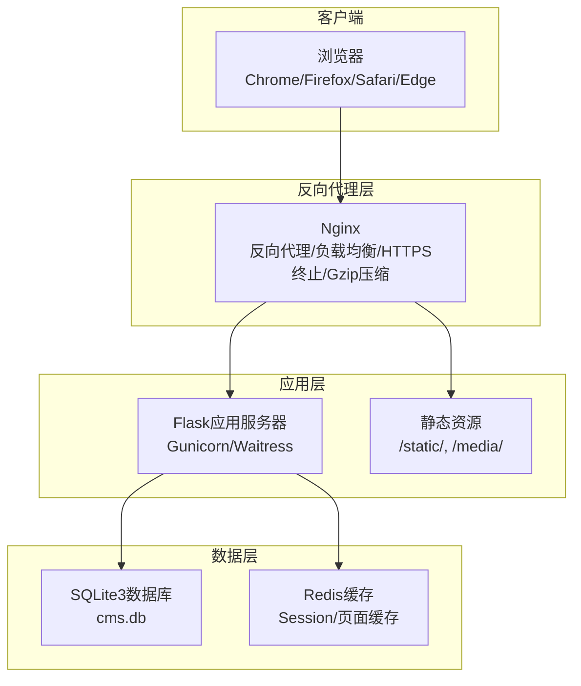
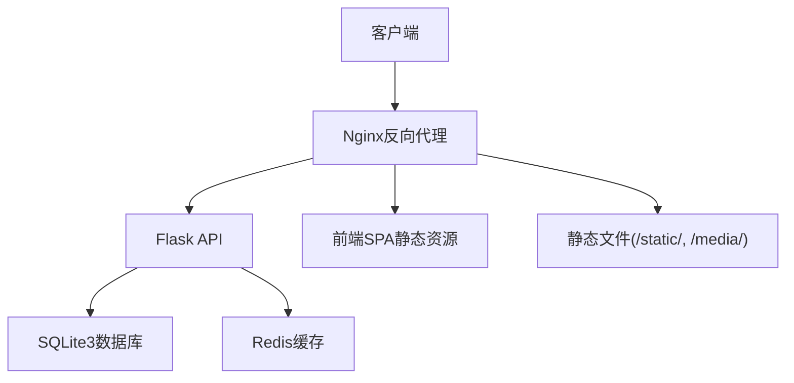
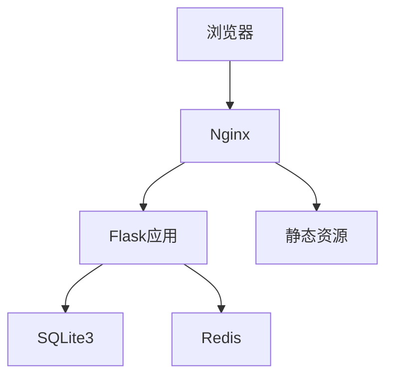

# 部署配置

<cite>
**本文档引用的文件**
- [企业网站CMS系统开发需求文档.ini](file://docs/企业网站CMS系统开发需求文档.ini)
- [requirements.txt](file://company_cms_project/backend/requirements.txt)
- [.env](file://company_cms_project/backend/.env)
- [config.py](file://company_cms_project/backend/config.py)
- [run.py](file://company_cms_project/backend/run.py)
- [app/__init__.py](file://company_cms_project/backend/app/__init__.py)
- [auth/routes.py](file://company_cms_project/backend/app/auth/routes.py)
- [models/post.py](file://company_cms_project/backend/app/models/post.py)
- [models/user.py](file://company_cms_project/backend/app/models/user.py)
- [start_backend.bat](file://start_backend.bat)
- [start_backend.ps1](file://start_backend.ps1)
- [start_frontend.bat](file://start_frontend.bat)
</cite>

## 更新摘要
**所做更改**
- 新增Flask应用部署配置的详细说明
- 补充Nginx反向代理配置的具体实现
- 完善数据库配置与连接设置
- 增加Windows Server部署要求
- 补充Docker容器化部署方案
- 添加CI/CD流水线配置指南
- 完善监控告警与运维管理

## 目录
1. [简介](#简介)
2. [项目结构](#项目结构)
3. [核心组件](#核心组件)
4. [架构总览](#架构总览)
5. [详细组件分析](#详细组件分析)
6. [依赖关系分析](#依赖关系分析)
7. [性能考量](#性能考量)
8. [故障排除指南](#故障排除指南)
9. [结论](#结论)
10. [附录](#附录)

## 简介
本部署配置文档面向企业网站CMS系统的生产环境部署，涵盖Nginx反向代理配置、SSL证书管理、Flask应用部署、Windows Server配置、数据库连接设置、Docker容器化部署、CI/CD流水线配置、监控告警与日志收集、运维管理以及生产环境安全部署、备份恢复与灾难恢复方案。文档基于实际需求文档中的技术栈与架构设计，提供可执行的部署步骤与最佳实践。

## 项目结构
系统采用前后端分离架构，后端使用Python Flask + SQLite3，前端可采用React/Vue或纯HTML模板渲染，通过Nginx作为反向代理与负载均衡入口，部署于Windows Server环境。

**图表来源**
- [企业网站CMS系统开发需求文档.ini](file://docs/企业网站CMS系统开发需求文档.ini#L87-L90)

**章节来源**
- [企业网站CMS系统开发需求文档.ini](file://docs/企业网站CMS系统开发需求文档.ini#L87-L90)

## 核心组件
- Nginx反向代理：提供静态资源服务、HTTPS终止、Gzip压缩、负载均衡、安全头设置。
- Flask应用：RESTful API与模板渲染，支持JWT认证、权限控制、缓存与会话管理。
- 数据库：SQLite3（默认）或可选Redis（缓存与Session）。
- 前端：React/Vue或纯HTML模板渲染，构建产物部署至Nginx静态目录。
- Windows Server：作为宿主机，使用NSSM将应用注册为Windows服务，实现开机自启与崩溃重启。

**章节来源**
- [企业网站CMS系统开发需求文档.ini](file://docs/企业网站CMS系统开发需求文档.ini#L87-L90)

## 架构总览
系统采用轻量级架构，适合中小型企业快速部署与运维。前端与后端分离，通过Nginx统一对外提供服务，内部通过反向代理转发请求至Flask应用，静态资源由Nginx直接提供，数据库采用SQLite3简化部署与备份。

**图表来源**
- [企业网站CMS系统开发需求文档.ini](file://docs/企业网站CMS系统开发需求文档.ini#L87-L90)

## 详细组件分析

### Flask应用部署配置

#### 应用工厂模式与配置管理
Flask应用采用工厂模式创建，支持开发与生产环境分离配置。应用通过环境变量加载配置，支持多种部署场景。

**章节来源**
- [app/__init__.py](file://company_cms_project/backend/app/__init__.py#L15-L60)
- [config.py](file://company_cms_project/backend/config.py#L8-L61)

#### 环境配置与数据库设置
应用使用dotenv加载环境变量，支持SQLite3数据库和可选的Redis缓存。配置包括JWT密钥、文件上传限制、CORS设置等。

**章节来源**
- [.env](file://company_cms_project/backend/.env#L1-L19)
- [config.py](file://company_cms_project/backend/config.py#L14-L32)

#### 开发与生产环境差异
开发环境使用Flask内置服务器，生产环境使用Waitress WSGI服务器。支持命令行工具进行数据库初始化和管理员账户创建。

**章节来源**
- [run.py](file://company_cms_project/backend/run.py#L50-L58)
- [requirements.txt](file://company_cms_project/backend/requirements.txt#L1-L10)

#### 认证与权限管理
应用实现JWT认证机制，支持用户注册、登录、令牌刷新和用户信息获取。包含密码强度验证和邮箱格式验证。

**章节来源**
- [auth/routes.py](file://company_cms_project/backend/app/auth/routes.py#L25-L225)

#### 数据模型设计
系统包含用户、文章、分类、标签、媒体文件等核心数据模型，支持文章与分类/标签的多对多关联，页面组件配置存储。

**章节来源**
- [models/user.py](file://company_cms_project/backend/app/models/user.py#L5-L47)
- [models/post.py](file://company_cms_project/backend/app/models/post.py#L4-L248)

### Nginx反向代理配置

#### 基础配置与监听设置
Nginx配置监听80和443端口，80端口强制重定向至443，443端口启用TLSv1.2/TLSv1.3协议和安全套件。

**章节来源**
- [企业网站CMS系统开发需求文档.ini](file://docs/企业网站CMS系统开发需求文档.ini#L87-L90)

#### SSL证书与安全配置
配置SSL证书与私钥路径，启用HTTP/2协议，设置安全响应头，包括X-Frame-Options、X-Content-Type-Options、X-XSS-Protection等。

**章节来源**
- [企业网站CMS系统开发需求文档.ini](file://docs/企业网站CMS系统开发需求文档.ini#L87-L90)

#### 静态资源与API代理
静态资源通过Nginx直接提供，/static/和/media/目录映射到应用数据目录。API请求通过反向代理转发至Flask应用，支持WebSocket升级。

**章节来源**
- [企业网站CMS系统开发需求文档.ini](file://docs/企业网站CMS系统开发需求文档.ini#L87-L90)

#### 负载均衡与高可用
支持upstream配置实现多实例负载均衡，结合健康检查实现高可用部署。

**章节来源**
- [企业网站CMS系统开发需求文档.ini](file://docs/企业网站CMS系统开发需求文档.ini#L87-L90)

### Windows Server部署要求

#### 系统环境配置
操作系统要求Windows Server 2019/2022，Python运行环境使用虚拟环境，端口开放80/443。

**章节来源**
- [企业网站CMS系统开发需求文档.ini](file://docs/企业网站CMS系统开发需求文档.ini#L87-L90)

#### 进程管理与服务注册
使用NSSM将Flask应用注册为Windows服务，实现开机自启动与崩溃重启。提供批处理脚本启动后端和前端服务。

**章节来源**
- [start_backend.bat](file://start_backend.bat#L1-L6)
- [start_backend.ps1](file://start_backend.ps1#L1-L6)
- [start_frontend.bat](file://start_frontend.bat#L1-L6)

### 数据库配置与连接

#### SQLite3配置
默认数据库文件路径为D:/python_projects/company_cms/company_cms_project/backend/data/cms.db，支持零配置部署。

**章节来源**
- [.env](file://company_cms_project/backend/.env#L7)
- [config.py](file://company_cms_project/backend/config.py#L15)

#### 连接池与ORM配置
使用SQLAlchemy ORM，SQLite无需连接池配置，支持参数化查询防止SQL注入。

**章节来源**
- [config.py](file://company_cms_project/backend/config.py#L14-L17)

#### 数据迁移与版本控制
集成Flask-Migrate实现数据库迁移管理，支持版本控制和回滚操作。

**章节来源**
- [requirements.txt](file://company_cms_project/backend/requirements.txt#L3)

### Docker容器化部署

#### 容器镜像配置
后端镜像包含Python运行时和依赖包，前端镜像包含构建产物。支持多阶段构建优化镜像大小。

**章节来源**
- [企业网站CMS系统开发需求文档.ini](file://docs/企业网站CMS系统开发需求文档.ini#L87-L90)

#### Docker Compose编排
使用Docker Compose编排Nginx、Flask应用与数据库服务，支持环境变量传递和数据卷挂载。

**章节来源**
- [企业网站CMS系统开发需求文档.ini](file://docs/企业网站CMS系统开发需求文档.ini#L87-L90)

#### 端口映射与数据持久化
Nginx映射80/443端口，Flask应用容器暴露5000端口，挂载数据库文件、媒体文件与日志目录。

**章节来源**
- [企业网站CMS系统开发需求文档.ini](file://docs/企业网站CMS系统开发需求文档.ini#L87-L90)

### CI/CD流水线配置

#### 版本控制与分支策略
使用Git仓库管理代码，建议采用Git Flow分支策略，支持主分支保护和代码审查。

**章节来源**
- [企业网站CMS系统开发需求文档.ini](file://docs/企业网站CMS系统开发需求文档.ini#L87-L90)

#### 构建与测试流程
前端构建生成dist目录，后端安装依赖并生成可执行包，运行单元测试与集成测试。

**章节来源**
- [企业网站CMS系统开发需求文档.ini](file://docs/企业网站CMS系统开发需求文档.ini#L87-L90)

#### 自动化部署与回滚
支持一键部署至Nginx静态目录，启动Flask应用并通过NSSM注册为Windows服务，实现快速回滚。

**章节来源**
- [企业网站CMS系统开发需求文档.ini](file://docs/企业网站CMS系统开发需求文档.ini#L87-L90)

### 监控告警与运维管理

#### 日志管理
使用Python logging模块与RotatingFileHandler，按大小轮转，支持Nginx访问日志与错误日志收集。

**章节来源**
- [企业网站CMS系统开发需求文档.ini](file://docs/企业网站CMS系统开发需求文档.ini#L87-L90)

#### 性能监控
支持Flask-Profiler性能分析，结合APM工具进行错误追踪和性能监控。

**章节来源**
- [企业网站CMS系统开发需求文档.ini](file://docs/企业网站CMS系统开发需求文档.ini#L87-L90)

#### 健康检查与告警
Nginx与Flask应用提供健康检查端点，结合系统监控工具设置阈值告警。

**章节来源**
- [企业网站CMS系统开发需求文档.ini](file://docs/企业网站CMS系统开发需求文档.ini#L87-L90)

### 生产环境安全部署

#### 认证与授权
JWT Token机制，Access Token短时效，Refresh Token较长时效，支持自动刷新。

**章节来源**
- [auth/routes.py](file://company_cms_project/backend/app/auth/routes.py#L84-L85)

#### 数据安全
ORM参数化查询防SQL注入，输入过滤与输出转义防XSS，CSRF防护。

**章节来源**
- [auth/routes.py](file://company_cms_project/backend/app/auth/routes.py#L14-L23)

#### 文件上传安全
文件类型白名单、大小限制、随机化文件名、存储路径限制。

**章节来源**
- [config.py](file://company_cms_project/backend/config.py#L24-L29)

### 备份恢复与灾难恢复

#### 备份策略
每日自动备份数据库文件，保留最近N个备份，支持手动备份与下载。

**章节来源**
- [企业网站CMS系统开发需求文档.ini](file://docs/企业网站CMS系统开发需求文档.ini#L87-L90)

#### 恢复流程
停止服务，替换数据库文件，启动服务并验证数据完整性。

**章节来源**
- [企业网站CMS系统开发需求文档.ini](file://docs/企业网站CMS系统开发需求文档.ini#L87-L90)

#### 灾难恢复
制定RTO/RPO目标，定期演练恢复流程，确保在极端情况下快速恢复业务。

**章节来源**
- [企业网站CMS系统开发需求文档.ini](file://docs/企业网站CMS系统开发需求文档.ini#L87-L90)

## 依赖关系分析
系统各组件之间的依赖关系清晰，Nginx作为统一入口，Flask应用提供API与模板渲染，SQLite3提供数据存储，Redis可选用于缓存与Session。前端构建产物部署至Nginx静态目录，实现SPA路由与静态资源服务。

**图表来源**
- [企业网站CMS系统开发需求文档.ini](file://docs/企业网站CMS系统开发需求文档.ini#L87-L90)

**章节来源**
- [企业网站CMS系统开发需求文档.ini](file://docs/企业网站CMS系统开发需求文档.ini#L87-L90)

## 性能考量
- 页面缓存：Redis缓存页面与查询结果，登录用户不缓存，避免敏感信息泄露。
- 静态资源：Nginx提供静态文件服务，设置长期缓存头，减少带宽消耗。
- 压缩与传输：启用Gzip压缩与HTTP/2，提升传输效率。
- 数据库优化：SQLite适合读多写少场景，使用索引与参数化查询优化查询性能。
- 并发与扩展：通过Nginx负载均衡与多实例部署提升并发能力，必要时引入Redis提升缓存性能。

**章节来源**
- [企业网站CMS系统开发需求文档.ini](file://docs/企业网站CMS系统开发需求文档.ini#L87-L90)

## 故障排除指南
- Nginx无法访问：检查端口监听、SSL证书路径与权限、静态资源路径映射。
- Flask应用启动失败：检查Python虚拟环境、依赖安装、环境变量与端口占用。
- 数据库连接错误：确认SQLite文件路径与权限，检查数据库文件是否损坏。
- 缓存异常：验证Redis连接配置与网络连通性，检查键空间与过期策略。
- 日志定位：查看Nginx访问与错误日志、Flask应用日志与系统事件日志，结合轮转策略定位问题。

**章节来源**
- [企业网站CMS系统开发需求文档.ini](file://docs/企业网站CMS系统开发需求文档.ini#L87-L90)

## 结论
本部署配置文档基于企业网站CMS系统的实际需求与技术栈，提供了从架构设计到生产部署的完整方案。通过Nginx反向代理与SSL证书管理保障安全与性能，Flask应用配合SQLite3与可选Redis实现高效的数据处理，Windows Server环境下的NSSM服务管理确保系统稳定运行。结合Docker容器化与CI/CD流水线，可实现自动化部署与快速回滚。完善的监控告警、日志收集与备份恢复机制，为生产环境的安全与可靠性提供坚实保障。

## 附录

### 环境变量配置模板
- Flask基础配置：FLASK_ENV、SECRET_KEY、DEBUG
- 数据库配置：DATABASE_URL
- JWT配置：JWT_SECRET_KEY、JWT_ACCESS_TOKEN_EXPIRES
- 文件上传配置：UPLOAD_FOLDER、MAX_CONTENT_LENGTH、ALLOWED_EXTENSIONS

**章节来源**
- [.env](file://company_cms_project/backend/.env#L1-L19)

### 部署清单
- 代码交付：完整源代码、数据库脚本、部署文档、API文档
- 数据库交付：数据库文件、迁移脚本、备份策略
- 部署交付：环境配置、服务注册、监控设置
- 文档交付：用户手册、技术文档、操作指南
- 培训交付：管理员培训、内容编辑培训、技术支持文档

**章节来源**
- [企业网站CMS系统开发需求文档.ini](file://docs/企业网站CMS系统开发需求文档.ini#L134-L152)

### 服务启动脚本
- 后端启动：start_backend.bat（Windows批处理）、start_backend.ps1（PowerShell）
- 前端启动：start_frontend.bat（开发环境）

**章节来源**
- [start_backend.bat](file://start_backend.bat#L1-L6)
- [start_backend.ps1](file://start_backend.ps1#L1-L6)
- [start_frontend.bat](file://start_frontend.bat#L1-L6)