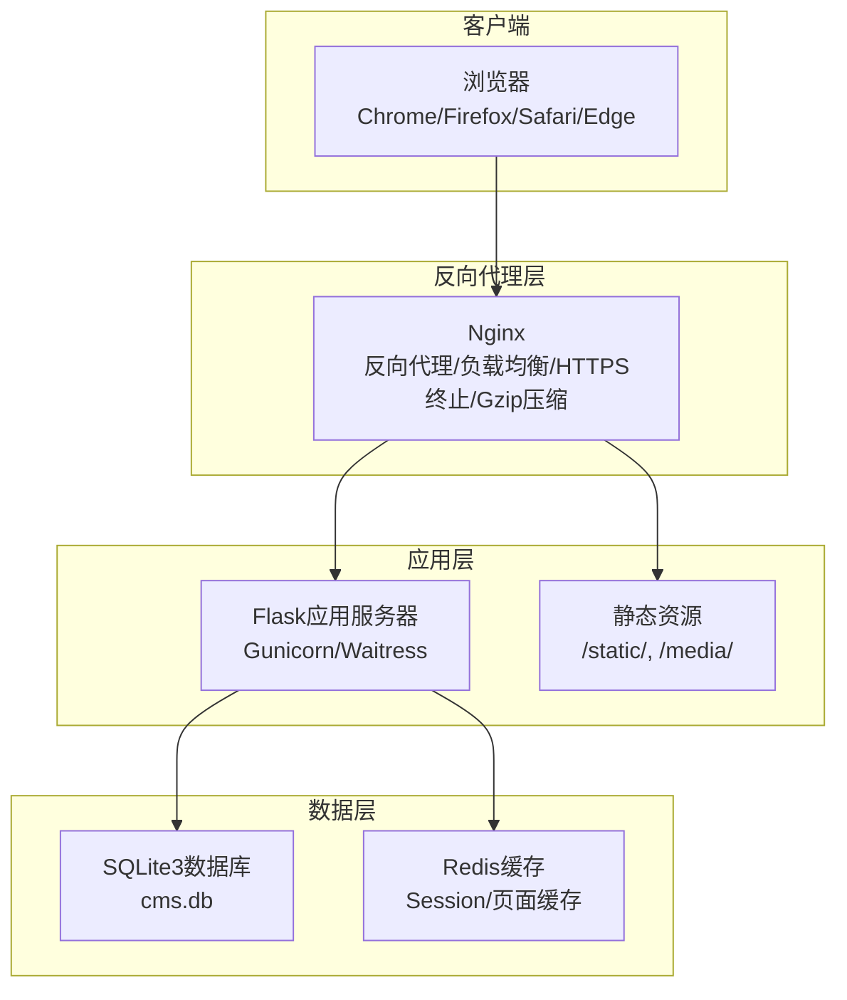
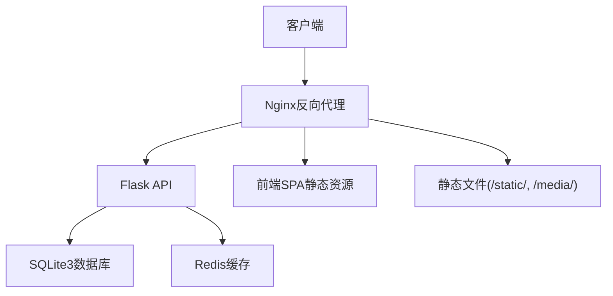
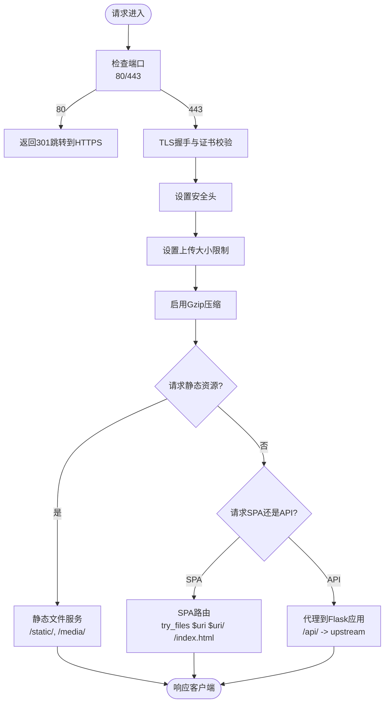
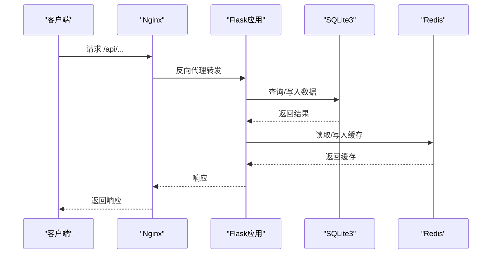
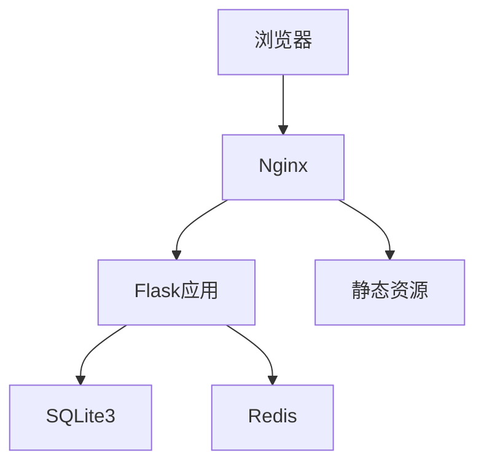

# 部署配置

<cite>
**本文档引用的文件**
- [企业网站CMS系统开发需求文档.ini](file://企业网站CMS系统开发需求文档.ini)
- [企业网站CMS系统详细需求文档.md](file://企业网站CMS系统详细需求文档.md)
- [开发计划表_2月4日-2月12日.md](file://开发计划表_2月4日-2月12日.md)
</cite>

## 目录
1. [简介](#简介)
2. [项目结构](#项目结构)
3. [核心组件](#核心组件)
4. [架构总览](#架构总览)
5. [详细组件分析](#详细组件分析)
6. [依赖关系分析](#依赖关系分析)
7. [性能考量](#性能考量)
8. [故障排除指南](#故障排除指南)
9. [结论](#结论)
10. [附录](#附录)

## 简介
本部署配置文档面向企业网站CMS系统的生产环境部署，涵盖Nginx反向代理配置、SSL证书管理、Flask应用部署、Windows Server配置、数据库连接设置、Docker容器化部署、CI/CD流水线配置、监控告警与日志收集、运维管理以及生产环境安全部署、备份恢复与灾难恢复方案。文档基于实际需求文档中的技术栈与架构设计，提供可执行的部署步骤与最佳实践。

## 项目结构
系统采用前后端分离架构，后端使用Python Flask + SQLite3，前端可采用React/Vue或纯HTML模板渲染，通过Nginx作为反向代理与负载均衡入口，部署于Windows Server环境。

**图表来源**
- [企业网站CMS系统详细需求文档.md](file://企业网站CMS系统详细需求文档.md#L28-L57)

**章节来源**
- [企业网站CMS系统详细需求文档.md](file://企业网站CMS系统详细需求文档.md#L22-L57)

## 核心组件
- Nginx反向代理：提供静态资源服务、HTTPS终止、Gzip压缩、负载均衡、安全头设置。
- Flask应用：RESTful API与模板渲染，支持JWT认证、权限控制、缓存与会话管理。
- 数据库：SQLite3（默认）或可选Redis（缓存与Session）。
- 前端：React/Vue或纯HTML模板渲染，构建产物部署至Nginx静态目录。
- Windows Server：作为宿主机，使用NSSM将应用注册为Windows服务，实现开机自启与崩溃重启。

**章节来源**
- [企业网站CMS系统详细需求文档.md](file://企业网站CMS系统详细需求文档.md#L555-L660)
- [开发计划表_2月4日-2月12日.md](file://开发计划表_2月4日-2月12日.md#L441-L506)

## 架构总览
系统采用轻量级架构，适合中小型企业快速部署与运维。前端与后端分离，通过Nginx统一对外提供服务，内部通过反向代理转发请求至Flask应用，静态资源由Nginx直接提供，数据库采用SQLite3简化部署与备份。

**图表来源**
- [企业网站CMS系统详细需求文档.md](file://企业网站CMS系统详细需求文档.md#L28-L57)

## 详细组件分析

### Nginx反向代理配置
- 监听端口与服务器名：80端口强制跳转至443；443端口启用TLSv1.2/TLSv1.3与安全套件。
- SSL证书：配置证书与私钥路径，启用HTTP/2。
- 安全头：设置X-Frame-Options、X-Content-Type-Options、X-XSS-Protection等。
- 日志：配置访问日志与错误日志路径。
- 客户端上传限制：client_max_body_size设置为50M。
- Gzip压缩：对常见文本与脚本类型启用压缩。
- 静态资源：/static/与/media/分别映射到应用数据目录，设置缓存头。
- 前端页面：SPA模式下使用try_files $uri $uri/ /index.html。
- API代理：将/api/转发至后端Flask应用，设置必要的代理头，支持WebSocket升级。
- 负载均衡：upstream可配置多个后端实例，实现横向扩展。

**图表来源**
- [企业网站CMS系统详细需求文档.md](file://企业网站CMS系统详细需求文档.md#L1145-L1229)

**章节来源**
- [企业网站CMS系统详细需求文档.md](file://企业网站CMS系统详细需求文档.md#L1141-L1229)

### SSL证书管理
- 证书与私钥路径：在Nginx配置中指定ssl_certificate与ssl_certificate_key。
- 协议与套件：启用TLSv1.2与TLSv1.3，使用高强度加密套件。
- HSTS与安全头：结合X-Frame-Options、X-Content-Type-Options、X-XSS-Protection等头增强安全性。
- 证书轮换：定期更新证书与私钥，确保域名解析正确指向服务器。

**章节来源**
- [企业网站CMS系统详细需求文档.md](file://企业网站CMS系统详细需求文档.md#L1162-L1176)

### Flask应用部署配置
- WSGI服务器：推荐使用Waitress（Windows友好），或Gunicorn（Linux）。可配置多worker与异步worker。
- 进程管理：使用NSSM将Flask应用注册为Windows服务，实现开机自启动与崩溃重启。
- 配置文件：通过环境变量覆盖默认配置，支持开发与生产环境分离。
- 数据库：默认SQLite3，可通过环境变量DATABASE_URL指定；Redis用于缓存与Session。
- 缓存与会话：CACHE_TYPE与SESSION_TYPE可配置为redis，提高并发性能。
- JWT：配置JWT_SECRET_KEY与过期时间，支持Access/Refresh Token机制。
- 文件上传：UPLOAD_FOLDER与MAX_CONTENT_LENGTH限制上传大小与类型。
- CORS：允许的源列表，支持前端开发与生产环境域名。
- 日志：使用logging模块与RotatingFileHandler，便于生产环境问题定位。

**图表来源**
- [企业网站CMS系统详细需求文档.md](file://企业网站CMS系统详细需求文档.md#L1234-L1302)

**章节来源**
- [企业网站CMS系统详细需求文档.md](file://企业网站CMS系统详细需求文档.md#L1232-L1302)
- [开发计划表_2月4日-2月12日.md](file://开发计划表_2月4日-2月12日.md#L489-L499)

### Windows Server配置要求与IIS集成
- 操作系统：Windows Server 2019/2022。
- Python运行环境：使用虚拟环境(venv)与pip包管理。
- 进程管理：使用NSSM将Gunicorn/Waitress注册为Windows服务，实现开机自启动与崩溃重启。
- IIS集成：若需使用IIS，可配置FastCGI或通过反向代理桥接到Flask应用（推荐Nginx作为统一入口）。
- 端口与防火墙：确保80/443端口开放，Nginx监听127.0.0.1:5000转发至Flask应用。

**章节来源**
- [企业网站CMS系统详细需求文档.md](file://企业网站CMS系统详细需求文档.md#L629-L659)
- [开发计划表_2月4日-2月12日.md](file://开发计划表_2月4日-2月12日.md#L442-L499)

### 数据库连接设置
- SQLite3：默认数据库文件路径为D:/cms/data/cms.db，零配置部署，便于备份与恢复。
- 连接池：SQLite无需连接池配置，使用ORM参数化查询避免SQL注入。
- Redis：可选用于缓存与Session，通过REDIS_URL环境变量配置。
- 备份目录：D:/cms/data/backups/用于存放数据库备份文件。
- 日志目录：D:/cms/data/logs/用于SQLite日志。

**章节来源**
- [企业网站CMS系统详细需求文档.md](file://企业网站CMS系统详细需求文档.md#L651-L653)
- [企业网站CMS系统详细需求文档.md](file://企业网站CMS系统详细需求文档.md#L704-L712)

### Docker容器化部署
- 容器编排：可使用Docker Compose编排Nginx、Flask应用与Redis服务。
- 镜像管理：后端镜像包含Python运行时与依赖，前端镜像包含构建产物。
- 端口映射：Nginx映射80/443端口，Flask应用容器暴露5000端口。
- 数据卷：挂载数据库文件、媒体文件与日志目录，确保持久化。
- 环境变量：通过Compose文件传递环境变量，避免硬编码。

**章节来源**
- [企业网站CMS系统开发需求文档.ini](file://企业网站CMS系统开发需求文档.ini#L87-L90)

### CI/CD流水线配置与自动化部署
- 版本控制：使用Git仓库管理代码，分支策略建议采用Git Flow。
- 构建阶段：前端构建生成dist目录，后端安装依赖并生成可执行包。
- 测试阶段：运行单元测试与集成测试，确保API与数据库一致性。
- 部署阶段：将构建产物部署至Nginx静态目录，启动Flask应用并通过NSSM注册为Windows服务。
- 回滚策略：保留最近N个版本的构建产物，一键回滚至上一个稳定版本。
- 自动化：使用Jenkins/GitLab CI等工具实现流水线自动化，触发条件可基于分支推送或标签创建。

**章节来源**
- [企业网站CMS系统开发需求文档.ini](file://企业网站CMS系统开发需求文档.ini#L87-L90)
- [开发计划表_2月4日-2月12日.md](file://开发计划表_2月4日-2月12日.md#L515-L572)

### 监控告警、日志收集与运维管理
- 日志：使用Python logging模块与RotatingFileHandler，按大小轮转，便于问题定位。
- 性能监控：可选Flask-Profiler进行性能分析，或使用APM工具（如Sentry）进行错误追踪。
- 健康检查：Nginx与Flask应用提供健康检查端点，用于负载均衡与容器编排。
- 告警：结合系统监控工具（如Prometheus+Grafana）设置阈值告警，关注CPU、内存、磁盘与数据库连接数。
- 运维管理：通过NSSM管理Windows服务，定期检查日志与备份状态，确保系统稳定运行。

**章节来源**
- [企业网站CMS系统详细需求文档.md](file://企业网站CMS系统详细需求文档.md#L655-L659)

### 生产环境安全部署
- 认证与授权：JWT Token机制，Access Token短时效，Refresh Token较长时效，支持自动刷新。
- 密码安全：bcrypt加密，密码强度要求与历史记录，登录失败锁定机制。
- 会话管理：Session存储在Redis，支持异常登录检测与单点/多点登录配置。
- 数据安全：ORM参数化查询防SQL注入，输入过滤与输出转义防XSS，CSRF防护。
- 文件上传安全：文件类型白名单、大小限制、随机化文件名、存储路径限制。
- API安全：Flask-Limiter限流，基于IP与用户维度的访问频率控制，第三方API Key加密存储与轮换。

**章节来源**
- [企业网站CMS系统详细需求文档.md](file://企业网站CMS系统详细需求文档.md#L1078-L1139)

### 备份恢复与灾难恢复
- 备份策略：每日自动备份数据库文件，保留最近N个备份；支持手动备份与下载。
- 恢复流程：停止服务，替换数据库文件，启动服务并验证数据完整性。
- 云存储：可将备份上传至云存储（如阿里云OSS、腾讯云COS），实现异地备份。
- 灾难恢复：制定RTO/RPO目标，定期演练恢复流程，确保在极端情况下快速恢复业务。

**章节来源**
- [企业网站CMS系统详细需求文档.md](file://企业网站CMS系统详细需求文档.md#L436-L444)

## 依赖关系分析
系统各组件之间的依赖关系清晰，Nginx作为统一入口，Flask应用提供API与模板渲染，SQLite3提供数据存储，Redis可选用于缓存与Session。前端构建产物部署至Nginx静态目录，实现SPA路由与静态资源服务。

**图表来源**
- [企业网站CMS系统详细需求文档.md](file://企业网站CMS系统详细需求文档.md#L28-L57)

**章节来源**
- [企业网站CMS系统详细需求文档.md](file://企业网站CMS系统详细需求文档.md#L28-L57)

## 性能考量
- 页面缓存：Redis缓存页面与查询结果，登录用户不缓存，避免敏感信息泄露。
- 静态资源：Nginx提供静态文件服务，设置长期缓存头，减少带宽消耗。
- 压缩与传输：启用Gzip压缩与HTTP/2，提升传输效率。
- 数据库优化：SQLite适合读多写少场景，使用索引与参数化查询优化查询性能。
- 并发与扩展：通过Nginx负载均衡与多实例部署提升并发能力，必要时引入Redis提升缓存性能。

**章节来源**
- [企业网站CMS系统详细需求文档.md](file://企业网站CMS系统详细需求文档.md#L512-L548)

## 故障排除指南
- Nginx无法访问：检查端口监听、SSL证书路径与权限、静态资源路径映射。
- Flask应用启动失败：检查Python虚拟环境、依赖安装、环境变量与端口占用。
- 数据库连接错误：确认SQLite文件路径与权限，检查数据库文件是否损坏。
- 缓存异常：验证Redis连接配置与网络连通性，检查键空间与过期策略。
- 日志定位：查看Nginx访问与错误日志、Flask应用日志与系统事件日志，结合轮转策略定位问题。

**章节来源**
- [开发计划表_2月4日-2月12日.md](file://开发计划表_2月4日-2月12日.md#L419-L432)

## 结论
本部署配置文档基于企业网站CMS系统的实际需求与技术栈，提供了从架构设计到生产部署的完整方案。通过Nginx反向代理与SSL证书管理保障安全与性能，Flask应用配合SQLite3与可选Redis实现高效的数据处理，Windows Server环境下的NSSM服务管理确保系统稳定运行。结合Docker容器化与CI/CD流水线，可实现自动化部署与快速回滚。完善的监控告警、日志收集与备份恢复机制，为生产环境的安全与可靠性提供坚实保障。

## 附录
- 环境变量模板：参考Flask配置文件中的环境变量定义，确保生产环境安全与可维护性。
- 部署清单：包含代码交付、数据库交付、部署交付、文档交付与培训交付清单，确保项目顺利交付与验收。

**章节来源**
- [开发计划表_2月4日-2月12日.md](file://开发计划表_2月4日-2月12日.md#L665-L701)