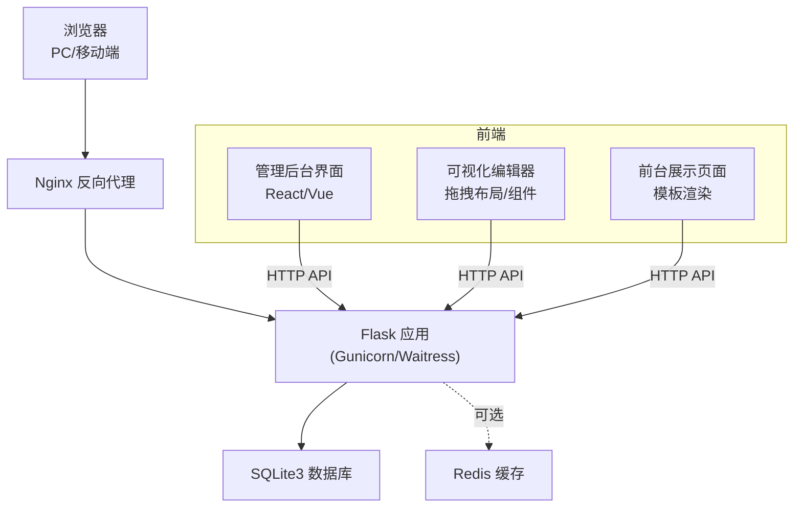
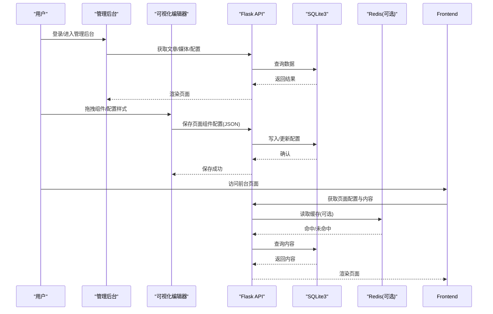
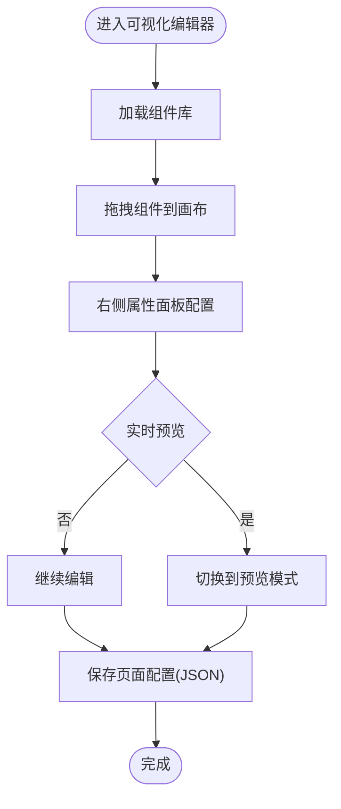
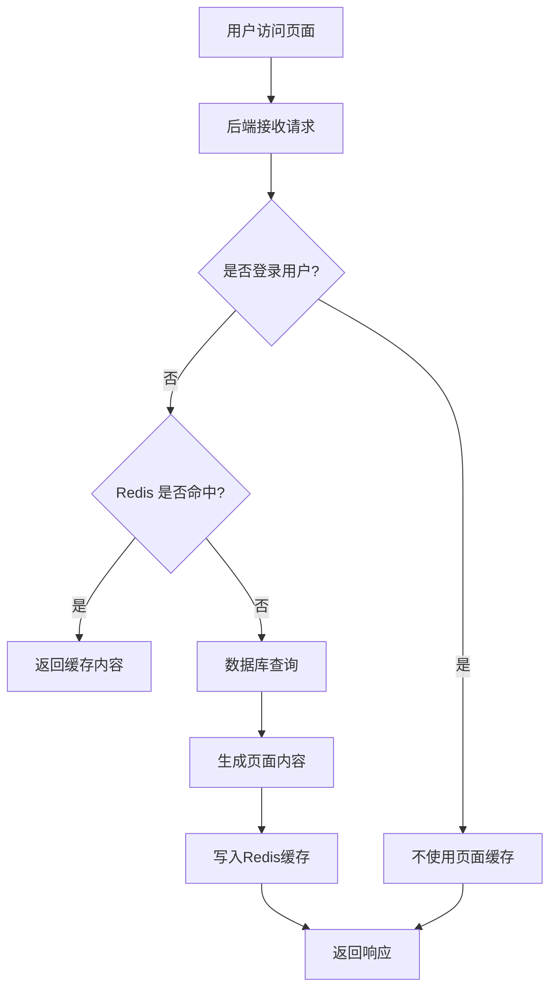
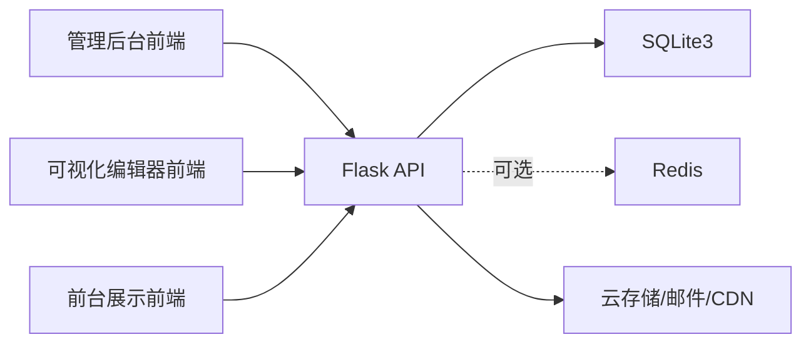

# 功能需求

<cite>
**本文引用的文件**
- [企业网站CMS系统开发需求文档.ini](file://企业网站CMS系统开发需求文档.ini)
- [企业网站CMS系统详细需求文档.md](file://企业网站CMS系统详细需求文档.md)
</cite>

## 目录
1. [引言](#引言)
2. [项目结构](#项目结构)
3. [核心组件](#核心组件)
4. [架构总览](#架构总览)
5. [详细组件分析](#详细组件分析)
6. [依赖分析](#依赖分析)
7. [性能考量](#性能考量)
8. [故障排查指南](#故障排查指南)
9. [结论](#结论)
10. [附录](#附录)

## 引言
本文件依据仓库中的两份需求文档，系统化梳理并形成面向开发与验收的“功能需求”文档，覆盖前端可视化编辑模块、后台管理模块与核心功能模块，明确各模块的功能描述、使用场景、用户交互流程、业务逻辑、优先级、依赖关系与功能边界，确保需求的完整性、一致性与可追溯性。

## 项目结构
- 项目采用前后端分离架构，前端使用 React/Vue（可选）与可视化拖拽组件，后端基于 Python Flask 提供 RESTful API，数据库采用 SQLite3（可选 Redis 缓存），部署于 Windows Server + Nginx。
- 项目分为六个阶段：需求设计、后端开发、前端开发、可视化编辑器、测试部署、交付培训，总计约 8 天的 MVP 开发周期，聚焦最小可用功能集。



**图表来源**
- [企业网站CMS系统详细需求文档.md](file://企业网站CMS系统详细需求文档.md#L22-L57)
- [企业网站CMS系统详细需求文档.md](file://企业网站CMS系统详细需求文档.md#L1143-L1230)

**章节来源**
- [企业网站CMS系统详细需求文档.md](file://企业网站CMS系统详细需求文档.md#L22-L57)
- [企业网站CMS系统详细需求文档.md](file://企业网站CMS系统详细需求文档.md#L1143-L1230)

## 核心组件
- 前端可视化编辑模块：拖拽布局配置、内容组件库、实时预览、响应式布局。
- 后台管理模块：用户权限管理、内容管理（文章/页面/媒体）、系统配置。
- 核心功能模块：多语言支持、SEO 优化、性能优化（缓存、懒加载、CDN、压缩）。

**章节来源**
- [企业网站CMS系统开发需求文档.ini](file://企业网站CMS系统开发需求文档.ini#L16-L69)
- [企业网站CMS系统详细需求文档.md](file://企业网站CMS系统详细需求文档.md#L63-L233)
- [企业网站CMS系统详细需求文档.md](file://企业网站CMS系统详细需求文档.md#L235-L446)
- [企业网站CMS系统详细需求文档.md](file://企业网站CMS系统详细需求文档.md#L448-L549)

## 架构总览
- 前端通过 HTTP API 与后端交互；编辑器与前台页面均消费后端提供的内容与配置数据。
- 后端提供统一的 RESTful API，支持认证（JWT）、权限控制、内容管理、媒体管理、系统配置等能力。
- 数据持久化采用 SQLite3，必要时引入 Redis 缓存；静态资源由 Nginx 提供并支持 Gzip 压缩与 HTTPS 终结。



**图表来源**
- [企业网站CMS系统详细需求文档.md](file://企业网站CMS系统详细需求文档.md#L940-L1076)
- [企业网站CMS系统详细需求文档.md](file://企业网站CMS系统详细需求文档.md#L1232-L1302)

**章节来源**
- [企业网站CMS系统详细需求文档.md](file://企业网站CMS系统详细需求文档.md#L940-L1076)
- [企业网站CMS系统详细需求文档.md](file://企业网站CMS系统详细需求文档.md#L1232-L1302)

## 详细组件分析

### 前端可视化编辑模块
- 拖拽布局配置
  - 页面布局组件库：单栏、双栏、三栏、网格、F 型布局、卡片流式布局；支持自定义栅格（12/24 栏）与响应式断点。
  - 组件拖拽系统：支持从组件面板拖入、页面内拖动排序、跨容器拖拽、复制/删除；提供实时放置反馈与预览。
  - 实时预览：编辑模式与预览模式无缝切换，支持多设备预览与全屏预览。
  - 响应式布局：针对不同断点设置组件显示/隐藏与布局切换。
- 内容组件库
  - 文本编辑器：富文本编辑、图片/视频插入、表格、超链接、代码块、标题/列表/引用样式。
  - 图片组件：轮播图（多图、切换效果、指示器、自动播放）、画廊（瀑布流/网格、灯箱、懒加载）、单图展示（响应式、裁剪/缩放、描述/水印）。
  - 视频组件：本地视频与主流平台嵌入（YouTube、优酷/腾讯视频），支持封面、字幕、自动/循环播放。
  - 表单组件：联系表单（字段类型、验证、邮件通知）、预约表单（日期时间选择、时段设置）、问卷调查（单选/多选/简答、统计）。
  - 导航组件：顶部导航（横向/纵向、多级菜单、当前页高亮）、面包屑导航（自动生成/自定义分隔符）、侧边导航（固定/跟随滚动、折叠/展开）。
  - 社交媒体组件：社交图标链接、分享按钮、信息流嵌入。
  - 高级组件：Tab 标签页、折叠面板、统计数字、时间轴、团队成员、客户案例/合作伙伴。
- 组件通用配置
  - 样式配置：边距、背景、边框、阴影、动画。
  - 显示配置：显示/隐藏、响应式显示控制、条件显示。
  - 高级配置：自定义 CSS 类名、自定义 HTML 属性、锚点 ID 设置。



**图表来源**
- [企业网站CMS系统详细需求文档.md](file://企业网站CMS系统详细需求文档.md#L65-L103)
- [企业网站CMS系统详细需求文档.md](file://企业网站CMS系统详细需求文档.md#L104-L232)

**章节来源**
- [企业网站CMS系统详细需求文档.md](file://企业网站CMS系统详细需求文档.md#L65-L103)
- [企业网站CMS系统详细需求文档.md](file://企业网站CMS系统详细需求文档.md#L104-L232)

### 后台管理模块
- 用户权限管理
  - 角色体系：超级管理员、管理员、编辑、作者、访客；权限粒度覆盖模块级、操作级、数据级。
  - 技术实现：RBAC 模型、Flask-Security/Flask-Principal、装饰器权限验证、数据库表结构（users、roles、permissions、user_roles、role_permissions）。
  - 用户管理：注册（可开启/关闭）、邮箱/手机号验证、密码强度、加密存储、密码重置、登录日志、多设备登录、账号锁定。
- 内容管理
  - 文章管理：列表/卡片视图、筛选/排序/搜索、批量操作、编辑器（标题、富文本、特色图、摘要、分类/标签、SEO、发布设置、自定义字段、版本历史）。
  - 页面管理：树形结构、拖拽排序、快速编辑、页面预览、模板选择、页面设置（URL、父级、状态、访问权限）、SEO 设置。
  - 媒体库管理：支持格式（图片/视频/文档）、拖拽/批量/粘贴上传、文件夹组织、筛选/搜索、图片编辑（裁剪/旋转/缩放/滤镜）、文件信息编辑。
  - 存储管理：本地存储、云存储（阿里云OSS/腾讯云COS/七牛云）、空间统计、未使用文件清理。
- 系统配置
  - 网站设置：名称、Logo/Favicon、描述、联系方式、社交媒体链接、版权、ICP 备案号。
  - SEO 配置：默认 Meta 模板、关键词、Google Analytics、百度统计、自定义头部/底部代码。
  - URL 配置：URL 重写规则、固定链接格式（/post/{id}、/{year}/{month}/{slug} 等）、分页 URL。
  - 邮件配置：SMTP、发件人、邮件模板、测试发送。
  - 安全设置：HTTPS 强制跳转、CORS、API 访问频率限制、IP 黑/白名单、文件上传安全规则。
  - 性能配置：缓存开关/过期、静态资源 CDN、图片压缩质量、懒加载开关。
  - 备份管理：自动备份（频率/时间/保留数）、手动备份、下载、恢复、备份到云存储。

```mermaid
classDiagram
class 用户 {
+id
+用户名
+邮箱
+密码哈希
+显示名
+头像
+状态
+创建/更新时间
+最后登录
}
class 角色 {
+id
+名称
+描述
+创建时间
}
class 权限 {
+id
+名称
+编码
+描述
+模块
}
class 用户_角色 {
+用户_id
+角色_id
}
class 角色_权限 {
+角色_id
+权限_id
}
用户 "1" <---> "多" 用户_角色
角色 "1" <---> "多" 用户_角色
角色 "1" <---> "多" 角色_权限
权限 "1" <---> "多" 角色_权限
```

**图表来源**
- [企业网站CMS系统详细需求文档.md](file://企业网站CMS系统详细需求文档.md#L275-L282)

**章节来源**
- [企业网站CMS系统详细需求文档.md](file://企业网站CMS系统详细需求文档.md#L237-L293)
- [企业网站CMS系统详细需求文档.md](file://企业网站CMS系统详细需求文档.md#L294-L387)
- [企业网站CMS系统详细需求文档.md](file://企业网站CMS系统详细需求文档.md#L388-L445)

### 核心功能模块
- 多语言支持
  - 语言切换：前端语言切换组件、URL 语言参数、Cookie 记住偏好、浏览器语言自动检测。
  - 内容多语言：文章/页面多语言版本、语言版本关联、未翻译提示。
  - 界面多语言：后台界面中英文、前端界面语言包、自定义翻译管理。
  - 技术实现：Flask-Babel、数据库翻译表设计（posts 与 post_translations）。
- SEO 优化
  - URL 优化：友好 URL 结构、自动生成 slug、自定义 URL 别名、URL 重定向管理、规范链接。
  - Meta 标签：每页独立设置 Title/Description/Keywords、Open Graph、Twitter Card、自动生成。
  - Sitemap：自动生成 XML Sitemap、优先级/更新频率、提交搜索引擎。
  - 其他：Robots.txt 编辑、404 页面自定义、301 重定向管理、面包屑导航、图片 ALT 自动填充、内链建议、外链 nofollow。
- 性能优化
  - 缓存策略：页面缓存（Redis）、缓存预热、失效策略、登录用户不缓存；数据缓存（查询结果/API）；静态资源缓存（浏览器 Expires/Cache-Control、版本号/哈希）。
  - 资源优化：图片懒加载、响应式图片、WebP 支持、CSS/JS 压缩合并、关键 CSS 内联、非关键资源异步加载。
  - 数据库优化：索引优化、查询优化（避免 N+1）、连接池配置、慢查询日志。
  - CDN 配置：静态资源 CDN 加速、CDN 域名配置、CDN 缓存刷新。



**图表来源**
- [企业网站CMS系统详细需求文档.md](file://企业网站CMS系统详细需求文档.md#L514-L529)

**章节来源**
- [企业网站CMS系统详细需求文档.md](file://企业网站CMS系统详细需求文档.md#L450-L481)
- [企业网站CMS系统详细需求文档.md](file://企业网站CMS系统详细需求文档.md#L482-L511)
- [企业网站CMS系统详细需求文档.md](file://企业网站CMS系统详细需求文档.md#L512-L548)

## 依赖分析
- 组件耦合与内聚
  - 后台管理模块与核心功能模块高度内聚于后端 API，前端通过统一接口消费。
  - 可视化编辑器与前台展示页面均依赖后端提供的页面组件配置（JSON）与内容数据。
- 直接与间接依赖
  - 后端依赖：Flask 生态（SQLAlchemy、RESTful、CORS、Babel、JWT、Caching 等）、SQLite3、Redis（可选）。
  - 前端依赖：React/Vue（可选）、Ant Design/Element Plus、拖拽库、富文本编辑器、Axios、路由与状态管理。
  - 部署依赖：Nginx、Windows Server、Waitress/Gunicorn、NSSM 注册服务。
- 外部依赖与集成点
  - 云存储（OSS/COS/七牛云）、邮件服务、CDN、搜索引擎（Google/Baidu）。
- 接口契约
  - 统一的 RESTful API，JWT 认证，JSON 数据格式，分页与元信息结构，HTTP 状态码约定。



**图表来源**
- [企业网站CMS系统详细需求文档.md](file://企业网站CMS系统详细需求文档.md#L555-L622)
- [企业网站CMS系统详细需求文档.md](file://企业网站CMS系统详细需求文档.md#L1143-L1230)

**章节来源**
- [企业网站CMS系统详细需求文档.md](file://企业网站CMS系统详细需求文档.md#L940-L1076)
- [企业网站CMS系统详细需求文档.md](file://企业网站CMS系统详细需求文档.md#L555-L622)

## 性能考量
- 响应时间目标：首页 < 2 秒，内页 < 3 秒，API < 500ms，数据库查询 < 100ms，文件上传速度正常。
- 并发与资源占用：支持 1000+ 并发用户，内存 < 2GB，CPU < 70%，磁盘 IO < 80%。
- 优化手段：页面缓存、数据缓存、静态资源缓存、图片懒加载、响应式图片、WebP、CSS/JS 压缩、关键 CSS 内联、异步加载非关键资源、索引优化、连接池、慢查询日志、CDN。

**章节来源**
- [企业网站CMS系统详细需求文档.md](file://企业网站CMS系统详细需求文档.md#L1362-L1380)
- [企业网站CMS系统详细需求文档.md](file://企业网站CMS系统详细需求文档.md#L512-L548)

## 故障排查指南
- 安全相关
  - XSS/CSRF/SQL 注入防护：输入过滤、输出转义、ORM 参数化、CSRF Token、CSP 头。
  - 文件上传安全：类型白名单、大小限制、文件名随机化、存储路径限制。
  - 传输安全：HTTPS 强制跳转、HSTS 头、敏感数据加密。
- 性能相关
  - 缓存未命中或过期：检查 Redis 配置、缓存键命名、失效策略。
  - 数据库慢查询：检查索引、避免 N+1、慢查询日志分析。
  - 前端卡顿：组件懒加载、虚拟滚动、限制单页组件数量。
- 部署相关
  - Nginx 配置：静态资源路径、Gzip、SSL、代理到后端、WebSocket 支持。
  - Windows 服务：NSSM 注册 Flask 应用、开机自启、崩溃重启。
  - 环境变量：SECRET_KEY、JWT_SECRET_KEY、DATABASE_URL、REDIS_URL、邮件配置。

**章节来源**
- [企业网站CMS系统详细需求文档.md](file://企业网站CMS系统详细需求文档.md#L1078-L1140)
- [企业网站CMS系统详细需求文档.md](file://企业网站CMS系统详细需求文档.md#L1232-L1302)
- [企业网站CMS系统详细需求文档.md](file://企业网站CMS系统详细需求文档.md#L1200-L1230)

## 结论
本需求文档基于现有仓库文件，系统化梳理了前端可视化编辑、后台管理与核心功能三大模块的需求边界、交互流程与技术实现要点。在 8 天的 MVP 周期内，优先保障认证与权限、文章/页面/媒体管理、简化版可视化编辑器与前台展示、基础 SEO 的交付，为后续 V2 版本的高级组件、多语言、复杂权限与高级 SEO 留出扩展空间。建议在开发前完成技术评审与原型验证，确保方案可行与合理。

## 附录
- 项目里程碑与阶段划分详见“项目实施计划”，包含各阶段目标、交付物与验收标准。
- 风险管理涵盖技术、项目与安全风险及应对措施。
- 成本预算包含软硬件与第三方服务费用概算。

**章节来源**
- [企业网站CMS系统详细需求文档.md](file://企业网站CMS系统详细需求文档.md#L1463-L1784)
- [企业网站CMS系统详细需求文档.md](file://企业网站CMS系统详细需求文档.md#L1865-L1923)
- [企业网站CMS系统详细需求文档.md](file://企业网站CMS系统详细需求文档.md#L1926-L1958)