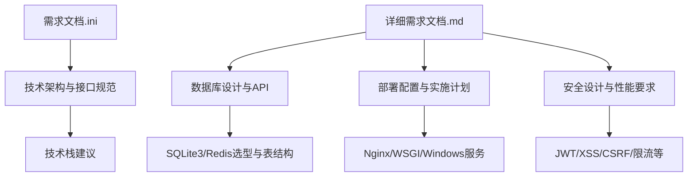
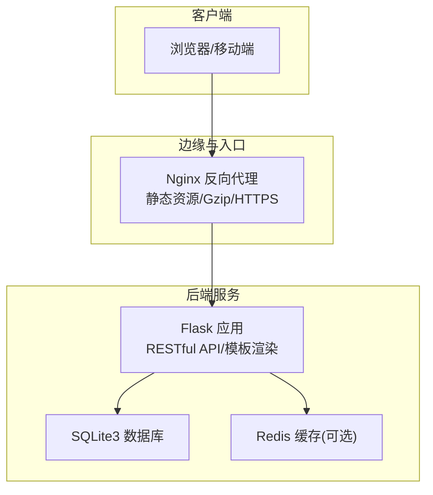
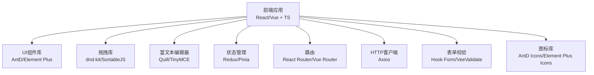
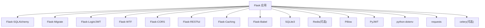
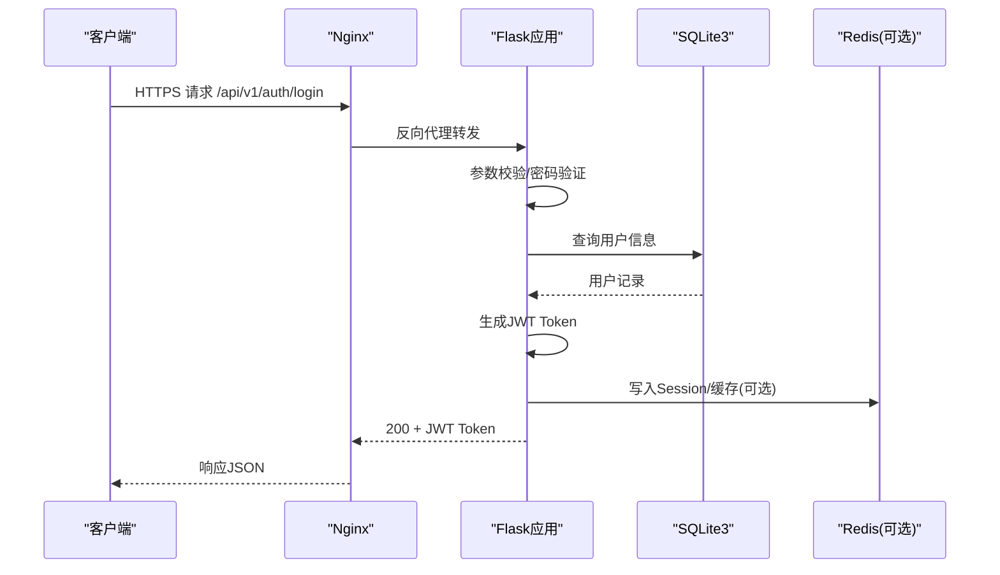
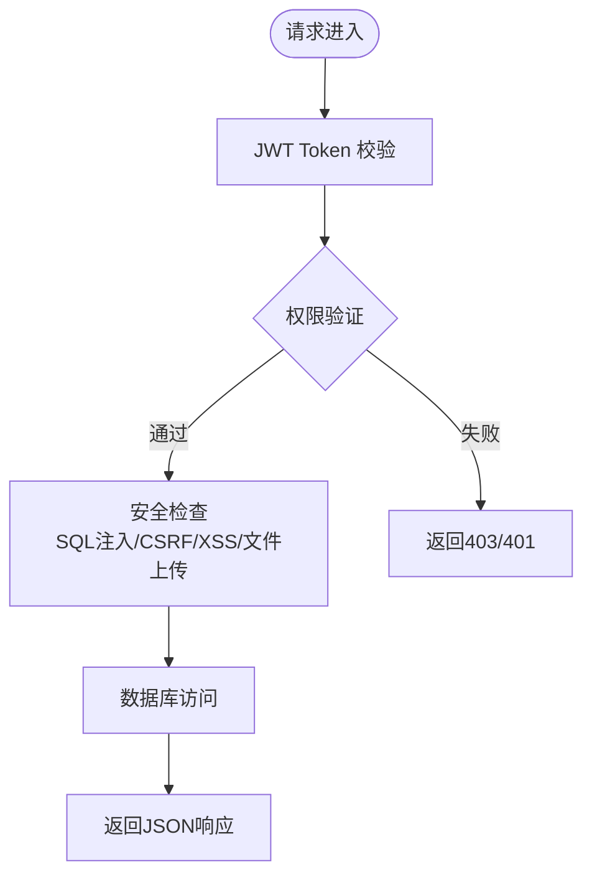
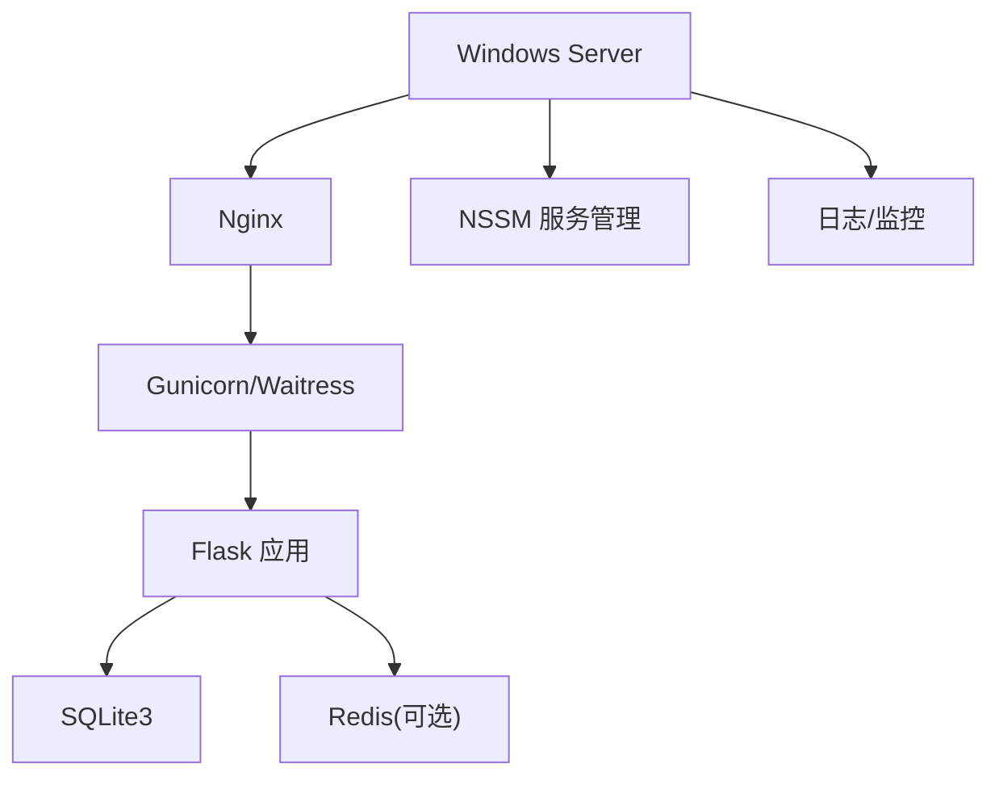
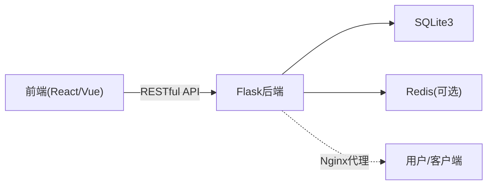

# 技术需求

<cite>
**本文引用的文件**
- [企业网站CMS系统开发需求文档.ini](file://企业网站CMS系统开发需求文档.ini)
- [企业网站CMS系统详细需求文档.md](file://企业网站CMS系统详细需求文档.md)
</cite>

## 目录
1. [引言](#引言)
2. [项目结构](#项目结构)
3. [核心组件](#核心组件)
4. [架构总览](#架构总览)
5. [详细组件分析](#详细组件分析)
6. [依赖分析](#依赖分析)
7. [性能考量](#性能考量)
8. [故障排查指南](#故障排查指南)
9. [结论](#结论)
10. [附录](#附录)

## 引言
本技术需求文档面向“企业网站CMS系统”的技术架构、技术栈选择与接口规范，结合仓库现有文档，明确前端（React/Vue.js、TypeScript、UI库、拖拽库、富文本编辑器、状态管理）、后端（Python/Flask、数据库、文件存储）、部署环境（Windows Server/Nginx、WSGI服务器、容器化与CI/CD）以及接口规范（RESTful API、JWT认证、数据格式、版本控制）等要求，并给出技术选型理由、兼容性与扩展性考虑，帮助项目团队在有限时间内高质量交付MVP版本并为后续演进打下基础。

## 项目结构
本仓库包含两份核心文档：
- 《企业网站CMS系统开发需求文档.ini》：概述项目背景、目标、功能需求、技术栈建议、接口规范、非功能需求、项目范围、交付物、里程碑与验收标准。
- 《企业网站CMS系统详细需求文档.md》：详细技术架构、数据库设计、API接口、安全设计、部署配置、项目实施计划、验收标准、风险与成本预算等。



**章节来源**
- file://企业网站CMS系统开发需求文档.ini#L1-L191
- file://企业网站CMS系统详细需求文档.md#L1-L2026

## 核心组件
- 前端技术栈（可选）：React/Vue.js + TypeScript；UI库：Ant Design/Element Plus；拖拽库：dnd-kit/react-beautiful-dnd/SortableJS；富文本：Quill.js/TinyMCE；状态管理：Redux Toolkit/Zustand/Pinia；路由：React Router/Vue Router；HTTP客户端：Axios；表单：React Hook Form/VeeValidate；图标：Ant Design Icons/Element Plus Icons。
- 后端技术栈：Python 3.9+ + Flask 2.3+；ORM：Flask-SQLAlchemy；数据库：SQLite3（默认，可选Redis）；WSGI：Gunicorn/Waitress；缓存：Flask-Caching；国际化：Flask-Babel；认证：Flask-JWT-Extended；跨域：Flask-CORS；表单与安全：Flask-WTF；异步任务：Celery（可选）。
- 部署环境：Windows Server 2019/2022；Web服务器：Nginx 1.24+；进程管理：NSSM；数据库：SQLite3；可选云存储（OSS/COS/七牛）；监控：logging + 可选Sentry；CI/CD：GitLab CI/Jenkins（建议）。

**章节来源**
- file://企业网站CMS系统开发需求文档.ini#L70-L91
- file://企业网站CMS系统详细需求文档.md#L553-L660

## 架构总览
系统采用前后端分离架构，支持纯HTML模板渲染与SPA两种模式。Nginx作为反向代理与静态资源服务，Flask应用提供RESTful API与模板渲染，SQLite3存储业务数据，Redis可选用于缓存与Session。



**图表来源**
- file://企业网站CMS系统详细需求文档.md#L22-L57

**章节来源**
- file://企业网站CMS系统详细需求文档.md#L22-L57

## 详细组件分析

### 前端技术栈与可视化编辑器
- 框架与类型：React/Vue.js + TypeScript，构建工具推荐Vite。
- UI与组件：Ant Design 5 或 Element Plus；基础组件库与业务组件结合。
- 拖拽系统：dnd-kit/react-beautiful-dnd（React）或 SortableJS/vue-draggable（Vue）；支持组件面板拖入、画布内排序、跨容器拖拽、复制/删除与实时反馈。
- 富文本：Quill.js/TinyMCE，支持格式化、图片/视频插入、表格、超链接、代码块等。
- 状态管理：Redux Toolkit/Zustand（React）或 Pinia（Vue）。
- 路由与HTTP：React Router/Vue Router；Axios；表单校验：React Hook Form/VeeValidate；图标库：Ant Design Icons/Element Plus Icons。
- 可视化编辑器（MVP）：简化版拖拽编辑器，核心组件包括文本、图片、容器、按钮、表单，支持样式配置与JSON存储。



**图表来源**
- file://企业网站CMS系统详细需求文档.md#L595-L622

**章节来源**
- file://企业网站CMS系统详细需求文档.md#L595-L622
- file://企业网站CMS系统详细需求文档.md#L1656-L1694

### 后端技术栈与数据库
- 核心框架：Flask 2.3+，Flask-SQLAlchemy ORM，Flask-Migrate数据库迁移，Flask-Login用户认证，Flask-WTF表单验证，Flask-CORS跨域，Flask-RESTful API开发，Flask-Caching缓存，Flask-Babel国际化，Flask-JWT-Extended JWT。
- 数据库：SQLite3（默认，零配置、ACID、单文件、便于备份与部署）；Redis（可选，用于缓存与Session）。
- WSGI：Gunicorn（Linux）或 Waitress（Windows友好）。
- 文件存储：本地存储（Windows文件系统）；可选云存储SDK（OSS/COS/七牛）。
- 其他依赖：Pillow（图片处理）、PyJWT（JWT）、python-dotenv（环境变量）、requests（HTTP客户端）、celery（异步任务，可选）。



**图表来源**
- file://企业网站CMS系统详细需求文档.md#L555-L594

**章节来源**
- file://企业网站CMS系统详细需求文档.md#L555-L594

### 接口规范与API设计
- 协议与格式：HTTPS + JSON；编码UTF-8。
- API前缀：/api/v1/；认证：JWT Token（Header: Authorization: Bearer <token>）。
- 请求/响应统一结构：data + meta（request_id、timestamp）；HTTP状态码覆盖常见场景。
- 分页格式：items + pagination（page/per_page/total/total_pages）。
- 核心接口：认证（登录/登出/注册/刷新/忘记密码/重置密码/当前用户）、用户管理（CRUD/分配角色）、文章管理（CRUD/批量删除/状态变更）、页面管理（CRUD/组件配置）、分类/标签（CRUD）、媒体库（上传/批量上传/更新/删除）、系统配置（分组配置/备份）。



**图表来源**
- file://企业网站CMS系统详细需求文档.md#L940-L1076

**章节来源**
- file://企业网站CMS系统详细需求文档.md#L940-L1076

### 安全设计
- 认证与授权：JWT（Access/Refresh Token，分别有效期2小时/7天）；RBAC模型；装饰器权限验证；Flask-Login会话管理。
- 密码安全：bcrypt加密（cost=12），密码强度要求，登录失败锁定机制。
- 数据安全：ORM参数化查询防SQL注入；Jinja2自动转义防XSS；CSP头；CSRF防护（Flask-WTF Token/SameSite Cookie/双重提交）；文件上传白名单、大小限制、随机化文件名、病毒扫描（可选）。
- API安全：Flask-Limiter限流（IP/用户维度），敏感数据加密存储与传输（HTTPS/HSTS）。



**图表来源**
- file://企业网站CMS系统详细需求文档.md#L1078-L1140

**章节来源**
- file://企业网站CMS系统详细需求文档.md#L1078-L1140

### 部署与运维
- 操作系统：Windows Server 2019/2022。
- Web服务器：Nginx 1.24+（反向代理、静态资源、Gzip、SSL/TLS、负载均衡可选）。
- Python运行环境：虚拟环境（venv）、pip包管理、环境变量。
- 进程管理：NSSM将Gunicorn/Waitress注册为Windows服务，开机自启、崩溃重启。
- 数据库：SQLite3单文件数据库，Redis（可选）。
- 监控工具：logging + RotatingFileHandler；Flask-Profiler（可选）；Sentry（可选）。
- CI/CD：建议使用GitLab CI/Jenkins。



**图表来源**
- file://企业网站CMS系统详细需求文档.md#L629-L659
- file://企业网站CMS系统详细需求文档.md#L1141-L1356

**章节来源**
- file://企业网站CMS系统详细需求文档.md#L629-L659
- file://企业网站CMS系统详细需求文档.md#L1141-L1356

### 数据库设计与选型
- SQLite3选型理由：零配置、单文件、ACID事务、简化部署与备份、适合中小网站（<10万条记录、并发读取<100用户、低写入频率）。
- 关键表：用户与权限（users、roles、permissions、user_roles、role_permissions）、文章/页面（posts、categories、post_categories、tags、post_tags）、媒体库（media）、页面组件配置（page_components）、站点配置（site_settings）、多语言翻译（post_translations）。
- 全文搜索：使用SQLite FTS5虚拟表与触发器同步，支持关键词检索。
- 迁移建议：当访问量/写入频率/数据量增长时，可考虑升级至MySQL/PostgreSQL并引入读写分离、主从复制。

```mermaid
erDiagram
USERS {
int id PK
varchar username UK
varchar email UK
varchar password_hash
varchar display_name
varchar avatar
tinyint status
datetime created_at
datetime updated_at
datetime last_login
}
ROLES {
int id PK
varchar name UK
varchar description
datetime created_at
}
PERMISSIONS {
int id PK
varchar name UK
varchar code UK
varchar description
varchar module
}
USER_ROLES {
int user_id FK
int role_id FK
}
ROLE_PERMISSIONS {
int role_id FK
int permission_id FK
}
POSTS {
int id PK
varchar type
varchar title
varchar slug
longtext content
text excerpt
varchar featured_image
int author_id FK
varchar status
tinyint comment_status
tinyint is_sticky
int view_count
int sort_order
int parent_id
varchar template
datetime published_at
datetime created_at
datetime updated_at
}
CATEGORIES {
int id PK
varchar name
varchar slug
text description
int parent_id
int sort_order
varchar icon
datetime created_at
}
POST_CATEGORIES {
int post_id FK
int category_id FK
}
TAGS {
int id PK
varchar name UNIQ
varchar slug UNIQ
datetime created_at
}
POST_TAGS {
int post_id FK
int tag_id FK
}
MEDIA {
int id PK
varchar filename
varchar original_name
varchar file_path
varchar file_url
varchar mime_type
int file_size
int width
int height
varchar title
varchar alt_text
text description
int folder_id
int uploader_id FK
datetime created_at
}
PAGE_COMPONENTS {
int id PK
int page_id FK
varchar component_type
json component_data
int sort_order
int parent_id
datetime created_at
datetime updated_at
}
SITE_SETTINGS {
int id PK
varchar key_name UNIQ
text value
varchar type
varchar description
varchar group_name
datetime updated_at
}
POST_TRANSLATIONS {
int id PK
int post_id FK
varchar language_code
varchar title
longtext content
text excerpt
varchar slug
}
USERS ||--o{ POSTS : "author"
USERS ||--o{ MEDIA : "uploader"
POSTS }o--o{ POST_CATEGORIES : "belongs_to"
CATEGORIES ||--o{ POST_CATEGORIES : "has_many"
POSTS }o--o{ POST_TAGS : "belongs_to"
TAGS ||--o{ POST_TAGS : "has_many"
POSTS ||--o{ PAGE_COMPONENTS : "has_many"
POSTS ||--o{ POST_TRANSLATIONS : "has_many"
```

**图表来源**
- file://企业网站CMS系统详细需求文档.md#L660-L938

**章节来源**
- file://企业网站CMS系统详细需求文档.md#L660-L938

## 依赖分析
- 前端与后端通过RESTful API通信，Nginx统一入口与静态资源服务。
- Flask应用依赖ORM、缓存、国际化、JWT、跨域、表单与安全组件；数据库为SQLite3（默认），Redis可选。
- 部署层面依赖Windows Server、Nginx、WSGI服务器（Gunicorn/Waitress）、NSSM服务管理与日志监控。



**图表来源**
- file://企业网站CMS系统详细需求文档.md#L22-L57

**章节来源**
- file://企业网站CMS系统详细需求文档.md#L22-L57

## 性能考量
- 响应时间：首页<2秒，内页<3秒，API<500ms，数据库查询<100ms，文件上传速度合理。
- 并发与资源：支持1000+并发用户，内存<2GB，CPU<70%，磁盘IO<80%。
- 缓存策略：页面缓存（Redis）、数据缓存（查询结果/API响应）、静态资源缓存（浏览器/CDN）。
- 资源优化：图片懒加载、响应式图片、WebP、CSS/JS压缩合并、关键CSS内联、异步加载非关键资源。
- 数据库优化：索引优化、避免N+1查询、连接池配置、慢查询日志。
- CDN配置：静态资源CDN加速、CDN域名与缓存刷新。

**章节来源**
- file://企业网站CMS系统详细需求文档.md#L1360-L1460

## 故障排查指南
- 认证与权限：检查JWT Token是否正确传递、是否过期、权限装饰器是否生效。
- 数据库：确认SQLite3文件路径与权限、索引是否合理、慢查询日志定位问题。
- 文件上传：检查文件类型白名单、大小限制、存储路径权限、病毒扫描（可选）。
- Nginx：确认SSL证书、Gzip、静态资源路径、代理头设置、日志路径。
- Windows服务：使用NSSM检查服务状态、日志文件、自动重启配置。
- 安全：启用CSP头、CSRF Token、HTTPS强制跳转、限流策略。

**章节来源**
- file://企业网站CMS系统详细需求文档.md#L1141-L1356

## 结论
本技术需求文档明确了企业CMS系统的前后端技术栈、接口规范与部署方案，并基于SQLite3与Windows Server的组合给出了可行的MVP实施方案。通过JWT认证、RBAC权限模型、XSS/CSRF/SQL注入防护与限流策略，确保系统在中小规模场景下的安全性与稳定性。建议在项目启动前进行技术评审与原型验证，确保方案的可行性与合理性。

## 附录
- 技术术语：CMS、SPA、ORM、JWT、RBAC、CSRF、XSS、SEO、CDN、SSL/TLS。
- 参考资料：Flask、React、Vue、Nginx、MySQL官方文档及相关技术链接。
- 更新记录：版本2.0（2026-02-03）明确技术栈与详细需求。

**章节来源**
- file://企业网站CMS系统详细需求文档.md#L1961-L2026